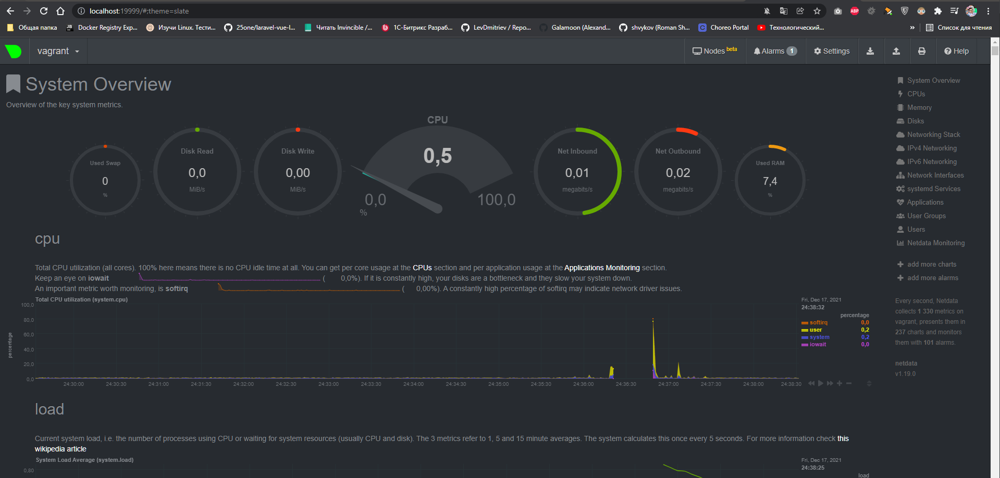

# Домашнее задание к занятию "3.4. Операционные системы, лекция 2"

1. На лекции мы познакомились с [node_exporter](https://github.com/prometheus/node_exporter/releases). В демонстрации
   его исполняемый файл запускался в background. Этого достаточно для демо, но не для настоящей production-системы, где
   процессы должны находиться под внешним управлением. Используя знания из лекции по systemd, создайте самостоятельно
   простой [unit-файл](https://www.freedesktop.org/software/systemd/man/systemd.service.html) для node_exporter:
    * поместите его в автозагрузку,
    * предусмотрите возможность добавления опций к запускаемому процессу через внешний файл (посмотрите, например,
      на `systemctl cat cron`),
    * удостоверьтесь, что с помощью systemctl процесс корректно стартует, завершается, а после перезагрузки
      автоматически поднимается.

> Ответ:

```bash
vagrant@vagrant:~/test$ wget https://github.com/prometheus/node_exporter/releases/download/v1.3.1/node_exporter-1.3.1.linux-amd64.tar.gz
vagrant@vagrant:~/test$ tar xvfz node_exporter-1.3.1.linux-amd64.tar.gz
vagrant@vagrant:~/test$ sudo cp ./node_exporter-1.3.1.linux-amd64/node_exporter /usr/sbin
vagrant@vagrant:~/test$ sudo touch /lib/systemd/system/node_exporter.service
vagrant@vagrant:~/test$ sudo ln -s /lib/systemd/system/node_exporter.service /etc/systemd/system/node_exporter.service
vagrant@vagrant:~/test$ ls -l /etc/systemd/system/node_exporter.service
lrwxrwxrwx 1 root root 41 Dec 16 19:44 /etc/systemd/system/node_exporter.service -> /lib/systemd/system/node_exporter.service
vagrant@vagrant:~/test$ sudo nano /lib/systemd/system/node_exporter.service
vagrant@vagrant:~/test$ cat /etc/systemd/system/node_exporter.service
[Unit]
Description=Node Exporter

[Service]
ExecStart=/usr/local/bin/node_exporter
EnvironmentFile=/etc/default/node_exporter


[Install]
WantedBy=default.target
vagrant@vagrant:~/test$ sudo nano /lib/systemd/system/node_exporter.service
vagrant@vagrant:~/test$ cat /etc/systemd/system/node_exporter.service
[Unit]
Description=Prometheus Node Exporter
After=remote-fs.target nss-user-lookup.target

[Service]
EnvironmentFile=/usr/sbin/node_exporter.conf
ExecStart=/usr/sbin/node_exporter $EXTRA_OPTS

[Install]
WantedBy=multi-user.target
vagrant@vagrant:~/test$ sudo touch /usr/sbin/node_exporter.conf
vagrant@vagrant:~/test$ sudo nano /usr/sbin/node_exporter.conf
vagrant@vagrant:~/test$ sudo systemctl daemon-reload
vagrant@vagrant:~/test$ systemctl cat node_exporter.service
# /lib/systemd/system/node_exporter.service
[Unit]
Description=Prometheus Node Exporter
After=remote-fs.target nss-user-lookup.target

[Service]
EnvironmentFile=/usr/sbin/node_exporter.conf
ExecStart=/usr/sbin/node_exporter $EXTRA_OPTS

[Install]
WantedBy=multi-user.target
vagrant@vagrant:~/test$ sudo systemctl enable node_exporter
Created symlink /etc/systemd/system/multi-user.target.wants/node_exporter.service → /lib/systemd/system/node_exporter.service.
vagrant@vagrant:~/test$ sudo systemctl start node_exporter
vagrant@vagrant:~/test$ sudo systemctl status node_exporter
node_exporter.service - Prometheus Node Exporter
     Loaded: loaded (/lib/systemd/system/node_exporter.service; enabled; vendor preset: enabled)
     Active: active (running) since Thu 2021-12-16 20:06:30 UTC; 13s ago
   Main PID: 2080 (node_exporter)
      Tasks: 5 (limit: 2278)
     Memory: 2.4M
     CGroup: /system.slice/node_exporter.service
             └─2080 /usr/sbin/node_exporter

Dec 16 20:06:30 vagrant node_exporter[2080]: ts=2021-12-16T20:06:30.633Z caller=node_exporter.go:115 level=info collector=thermal_zone
Dec 16 20:06:30 vagrant node_exporter[2080]: ts=2021-12-16T20:06:30.633Z caller=node_exporter.go:115 level=info collector=time
Dec 16 20:06:30 vagrant node_exporter[2080]: ts=2021-12-16T20:06:30.633Z caller=node_exporter.go:115 level=info collector=timex
Dec 16 20:06:30 vagrant node_exporter[2080]: ts=2021-12-16T20:06:30.633Z caller=node_exporter.go:115 level=info collector=udp_queues
Dec 16 20:06:30 vagrant node_exporter[2080]: ts=2021-12-16T20:06:30.634Z caller=node_exporter.go:115 level=info collector=uname
Dec 16 20:06:30 vagrant node_exporter[2080]: ts=2021-12-16T20:06:30.634Z caller=node_exporter.go:115 level=info collector=vmstat
Dec 16 20:06:30 vagrant node_exporter[2080]: ts=2021-12-16T20:06:30.634Z caller=node_exporter.go:115 level=info collector=xfs
Dec 16 20:06:30 vagrant node_exporter[2080]: ts=2021-12-16T20:06:30.634Z caller=node_exporter.go:115 level=info collector=zfs
Dec 16 20:06:30 vagrant node_exporter[2080]: ts=2021-12-16T20:06:30.634Z caller=node_exporter.go:199 level=info msg="Listening on" address=:9100
Dec 16 20:06:30 vagrant node_exporter[2080]: ts=2021-12-16T20:06:30.634Z caller=tls_config.go:195 level=info msg="TLS is disabled." http2=false

vagrant@vagrant:~/test$ curl http://localhost:9100/metrics | grep 'node_cpu_seconds_total{cpu="0",mode="idle"}'
  % Total    % Received % Xferd  Average Speed   Time    Time     Time  Current
                                 Dload  Upload   Total   Spent    Left  Speed
  0     0    0     0    0     0      0      0 --:--:-- --:--:-- --:--:--     0node_cpu_seconds_total{cpu="0",mode="idle"} 49960.4
100 60859    0 60859    0     0  3128k      0 --:--:-- --:--:-- --:--:-- 3301k
vagrant@vagrant:~/test$ sudo systemctl stop node_exporter
vagrant@vagrant:~/test$ journalctl -u node_exporter.service
-- Logs begin at Tue 2021-11-16 21:10:26 UTC, end at Thu 2021-12-16 20:07:40 UTC. --
Dec 16 19:54:06 vagrant systemd[1]: node_exporter.service: Failed to load environment files: No such file or directory
Dec 16 19:54:06 vagrant systemd[1]: node_exporter.service: Failed to run 'start' task: No such file or directory
Dec 16 19:54:06 vagrant systemd[1]: node_exporter.service: Failed with result 'resources'.
Dec 16 19:54:06 vagrant systemd[1]: Failed to start Node Exporter.
Dec 16 19:55:40 vagrant systemd[1]: node_exporter.service: Failed to load environment files: No such file or directory
Dec 16 19:55:40 vagrant systemd[1]: node_exporter.service: Failed to run 'start' task: No such file or directory
Dec 16 19:55:40 vagrant systemd[1]: node_exporter.service: Failed with result 'resources'.
Dec 16 19:55:40 vagrant systemd[1]: Failed to start Node Exporter.
Dec 16 20:06:30 vagrant systemd[1]: Started Prometheus Node Exporter.
Dec 16 20:06:30 vagrant node_exporter[2080]: ts=2021-12-16T20:06:30.629Z caller=node_exporter.go:182 level=info msg="Starting node_exporter" version="(version=1.3.1, branch=HEAD, revisi>
Dec 16 20:06:30 vagrant node_exporter[2080]: ts=2021-12-16T20:06:30.629Z caller=node_exporter.go:183 level=info msg="Build context" build_context="(go=go1.17.3, user=root@243aafa5525c, >
Dec 16 20:06:30 vagrant node_exporter[2080]: ts=2021-12-16T20:06:30.629Z caller=node_exporter.go:185 level=warn msg="Node Exporter is running as root user. This exporter is designed to >
Dec 16 20:06:30 vagrant node_exporter[2080]: ts=2021-12-16T20:06:30.629Z caller=filesystem_common.go:111 level=info collector=filesystem msg="Parsed flag --collector.filesystem.mount-po>
Dec 16 20:06:30 vagrant node_exporter[2080]: ts=2021-12-16T20:06:30.629Z caller=filesystem_common.go:113 level=info collector=filesystem msg="Parsed flag --collector.filesystem.fs-types>
Dec 16 20:06:30 vagrant node_exporter[2080]: ts=2021-12-16T20:06:30.632Z caller=node_exporter.go:108 level=info msg="Enabled collectors"
```

2. Ознакомьтесь с опциями node_exporter и выводом `/metrics` по-умолчанию. Приведите несколько опций, которые вы бы
   выбрали для базового мониторинга хоста по CPU, памяти, диску и сети.

> Ответ:

```bash
vagrant@vagrant:~/test$ curl http://localhost:9100/metrics
# HELP node_cpu_seconds_total Seconds the CPUs spent in each mode.
# TYPE node_cpu_seconds_total counter
node_cpu_seconds_total{cpu="0",mode="idle"} 50122.01
node_cpu_seconds_total{cpu="0",mode="iowait"} 0.83
node_cpu_seconds_total{cpu="0",mode="irq"} 0
node_cpu_seconds_total{cpu="0",mode="nice"} 0.1
node_cpu_seconds_total{cpu="0",mode="softirq"} 1.22
node_cpu_seconds_total{cpu="0",mode="steal"} 0
node_cpu_seconds_total{cpu="0",mode="system"} 6.43
node_cpu_seconds_total{cpu="0",mode="user"} 6.22
node_cpu_seconds_total{cpu="1",mode="idle"} 50067.38
node_cpu_seconds_total{cpu="1",mode="iowait"} 1.91
node_cpu_seconds_total{cpu="1",mode="irq"} 0
node_cpu_seconds_total{cpu="1",mode="nice"} 0.03
node_cpu_seconds_total{cpu="1",mode="softirq"} 1.04
node_cpu_seconds_total{cpu="1",mode="steal"} 0
node_cpu_seconds_total{cpu="1",mode="system"} 14.6
node_cpu_seconds_total{cpu="1",mode="user"} 13.25
node_cpu_seconds_total{cpu="2",mode="idle"} 50111
node_cpu_seconds_total{cpu="2",mode="iowait"} 1.3
node_cpu_seconds_total{cpu="2",mode="irq"} 0
node_cpu_seconds_total{cpu="2",mode="nice"} 0.01
node_cpu_seconds_total{cpu="2",mode="softirq"} 1
node_cpu_seconds_total{cpu="2",mode="steal"} 0
node_cpu_seconds_total{cpu="2",mode="system"} 6.69
node_cpu_seconds_total{cpu="2",mode="user"} 8.99
node_cpu_seconds_total{cpu="3",mode="idle"} 50098.67
node_cpu_seconds_total{cpu="3",mode="iowait"} 0.84
node_cpu_seconds_total{cpu="3",mode="irq"} 0
node_cpu_seconds_total{cpu="3",mode="nice"} 0.05
node_cpu_seconds_total{cpu="3",mode="softirq"} 3.32
node_cpu_seconds_total{cpu="3",mode="steal"} 0
node_cpu_seconds_total{cpu="3",mode="system"} 11.31
node_cpu_seconds_total{cpu="3",mode="user"} 11.7
# HELP node_memory_MemAvailable_bytes Memory information field MemAvailable_bytes.
# TYPE node_memory_MemAvailable_bytes gauge
node_memory_MemAvailable_bytes 1.752457216e+09
# HELP node_network_receive_bytes_total Network device statistic receive_bytes.
# TYPE node_network_receive_bytes_total counter
node_network_receive_bytes_total{device="eth0"} 1.3592657e+07
node_network_receive_bytes_total{device="lo"} 3.627572e+06
# HELP node_network_transmit_bytes_total Network device statistic transmit_bytes.
# TYPE node_network_transmit_bytes_total counter
node_network_transmit_bytes_total{device="eth0"} 5.208404e+06
node_network_transmit_bytes_total{device="lo"} 3.627572e+06
```

3. Установите в свою виртуальную машину [Netdata](https://github.com/netdata/netdata).
   Воспользуйтесь [готовыми пакетами](https://packagecloud.io/netdata/netdata/install) для
   установки (`sudo apt install -y netdata`). После успешной установки:

    * в конфигурационном файле `/etc/netdata/netdata.conf` в секции [web] замените значение с localhost
      на `bind to = 0.0.0.0`,
    * добавьте в Vagrantfile проброс порта Netdata на свой локальный компьютер и сделайте `vagrant reload`:

   ```shell position-relative overflow-auto
   config.vm.network "forwarded_port", guest: 19999, host: 19999
   ```

   После успешной перезагрузки в браузере *на своем ПК* (не в виртуальной машине) вы должны суметь зайти
   на `localhost:19999`. Ознакомьтесь с метриками, которые по умолчанию собираются Netdata и с комментариями, которые
   даны к этим метрикам.

> Ответ:


4. Можно ли по выводу `dmesg` понять, осознает ли ОС, что загружена не на настоящем оборудовании, а на системе
   виртуализации?

> Ответ:

```bash
vagrant@vagrant:~$ dmesg | grep virtual
[    0.009793] CPU MTRRs all blank - virtualized system.
[    0.214616] Booting paravirtualized kernel on KVM
[    3.976709] systemd[1]: Detected virtualization oracle.
```

5. Как настроен sysctl `fs.nr_open` на системе по-умолчанию? Узнайте, что означает этот параметр. Какой другой
   существующий лимит не позволит достичь такого числа (`ulimit --help`)?

> Ответ:
ulimit -n - 1024 - максимальное количество дескрипторов файлов, которые могут быть открыты (ограничение системой)
sysctl -a | grep fs.nr_open fs.nr_open = 1048576 Максимально ВОЗМОЖНОЕ число открытых файлов в системе

6. Запустите любой долгоживущий процесс (не `ls`, который отработает мгновенно, а, например, `sleep 1h`) в отдельном
   неймспейсе процессов; покажите, что ваш процесс работает под PID 1 через `nsenter`. Для простоты работайте в данном
   задании под root (`sudo -i`). Под обычным пользователем требуются дополнительные опции (`--map-root-user`) и т.д.
> Ответ:
```bash
Сессия 1:
vagrant@vagrant:~$ sudo -i
root@vagrant:~# unshare -f --pid --mount-proc /bin/sleep 1h

Сессия 2:
vagrant@vagrant:~$ sudo -i
root@vagrant:~# ps a | grep /bin/sleep
40748 pts/0    S+     0:00 unshare -f --pid --mount-proc /bin/sleep 1h
40749 pts/0    S+     0:00 /bin/sleep 1h
40762 pts/1    S+     0:00 grep --color=auto /bin/sleep
root@vagrant:~# nsenter --target 40749 --pid --mount
root@vagrant:/# ps aux
USER         PID %CPU %MEM    VSZ   RSS TTY      STAT START   TIME COMMAND
root           1  0.0  0.0   8076   528 pts/0    S+   21:23   0:00 /bin/sleep 1h
root           2  0.0  0.1   9836  3968 pts/1    S    21:23   0:00 -bash
root          11  0.0  0.1  11492  3452 pts/1    R+   21:23   0:00 ps aux
```

7. Найдите информацию о том, что такое `:(){ :|:& };:`. Запустите эту команду в своей виртуальной машине Vagrant с
   Ubuntu 20.04 ( **это важно, поведение в других ОС не проверялось** ). Некоторое время все будет "плохо", после чего (
   минуты) – ОС должна стабилизироваться. Вызов `dmesg` расскажет, какой механизм помог автоматической стабилизации. Как
   настроен этот механизм по-умолчанию, и как изменить число процессов, которое можно создать в сессии?

> Ответ: Данная команда является логической fork-бомбой. Она оперирует определением функции с именем ‘:‘, которая рекурсивно вызывает сама себя дважды: один раз на переднем плане и один раз в фоне. Она продолжает своё выполнение снова и снова, создавая новые процессы, пока система не зависнет. Я не смог дождаться стабилизации - моя система упала, и пришлось ее жестко ребутать.
> Думаю максимальное количество процессов по умолчанию можно посмотреть командой `ulimit -u`. vagrant@vagrant:~$ dmesg
[ 2150.995398] cgroup: fork rejected by pids controller in /user.slice/user-1000.slice/session-3.scope Cистема на основании этих файлов в пользовательской зоне ресурсов имеет определенное ограничение на создаваемые ресурсы и соответсвенно при превышении начинает блокировать создание большего числа процессов.

