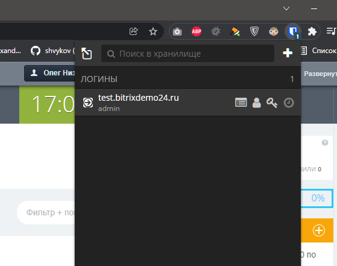

# Домашнее задание к занятию "3.9. Элементы безопасности информационных систем"

1. Установите Bitwarden плагин для браузера. Зарегестрируйтесь и сохраните несколько паролей.
> Ответ: 

2. Установите Google authenticator на мобильный телефон. Настройте вход в Bitwarden акаунт через Google authenticator OTP.
> Ответ:  

+3. Установите apache2, сгенерируйте самоподписанный сертификат, настройте тестовый сайт для работы по HTTPS.
> Ответ:  


4. Проверьте на TLS уязвимости произвольный сайт в интернете (кроме сайтов МВД, ФСБ, МинОбр, НацБанк, РосКосмос, РосАтом, РосНАНО и любых госкомпаний, объектов КИИ, ВПК ... и тому подобное).
> Ответ: 

 ```bash
root@vagrant:~# git clone --depth 1 https://github.com/drwetter/testssl.sh.git
Cloning into 'testssl.sh'...
remote: Enumerating objects: 100, done.
remote: Counting objects: 100% (100/100), done.
remote: Compressing objects: 100% (93/93), done.
remote: Total 100 (delta 14), reused 23 (delta 6), pack-reused 0
Receiving objects: 100% (100/100), 8.55 MiB | 5.38 MiB/s, done.
Resolving deltas: 100% (14/14), done.
root@vagrant:~# cd testssl.sh
root@vagrant:~/testssl.sh# ./testssl.sh -U --sneaky https://tea.ru/


###########################################################
    testssl.sh       3.1dev from https://testssl.sh/dev/
    (35ddd91 2021-12-21 10:54:58 -- )

      This program is free software. Distribution and
             modification under GPLv2 permitted.
      USAGE w/o ANY WARRANTY. USE IT AT YOUR OWN RISK!

       Please file bugs @ https://testssl.sh/bugs/

###########################################################

Using "OpenSSL 1.0.2-chacha (1.0.2k-dev)" [~183 ciphers]
on vagrant:./bin/openssl.Linux.x86_64
(built: "Jan 18 17:12:17 2019", platform: "linux-x86_64")


Start 2021-12-24 13:54:34        -->> 178.248.237.253:443 (tea.ru) <<--

rDNS (178.248.237.253): --
Service detected:       HTTP


Testing vulnerabilities

Heartbleed (CVE-2014-0160)                not vulnerable (OK), no heartbeat extension
CCS (CVE-2014-0224)                       not vulnerable (OK)
Ticketbleed (CVE-2016-9244), experiment.  not vulnerable (OK)
ROBOT                                     not vulnerable (OK)
Secure Renegotiation (RFC 5746)           supported (OK)
Secure Client-Initiated Renegotiation     not vulnerable (OK)
CRIME, TLS (CVE-2012-4929)                not vulnerable (OK)
BREACH (CVE-2013-3587)                    potentially NOT ok, "gzip" HTTP compression detected. - only supplied "/" tested
Can be ignored for static pages or if no secrets in the page
POODLE, SSL (CVE-2014-3566)               not vulnerable (OK)
TLS_FALLBACK_SCSV (RFC 7507)              Downgrade attack prevention supported (OK)
SWEET32 (CVE-2016-2183, CVE-2016-6329)    VULNERABLE, uses 64 bit block ciphers
FREAK (CVE-2015-0204)                     not vulnerable (OK)
DROWN (CVE-2016-0800, CVE-2016-0703)      not vulnerable on this host and port (OK)
make sure you don't use this certificate elsewhere with SSLv2 enabled services
https://censys.io/ipv4?q=85EAA39ADDE0130F0A85E9F71D84E436D948FE1571B3DCE2BB8446584F90ACCF could help you to find out
LOGJAM (CVE-2015-4000), experimental      not vulnerable (OK): no DH EXPORT ciphers, no DH key detected with <= TLS 1.2
BEAST (CVE-2011-3389)                     TLS1: ECDHE-RSA-AES128-SHA AES128-SHA DES-CBC3-SHA
VULNERABLE -- but also supports higher protocols  TLSv1.1 TLSv1.2 (likely mitigated)
LUCKY13 (CVE-2013-0169), experimental     potentially VULNERABLE, uses cipher block chaining (CBC) ciphers with TLS. Check patches
Winshock (CVE-2014-6321), experimental    not vulnerable (OK)
RC4 (CVE-2013-2566, CVE-2015-2808)        no RC4 ciphers detected (OK)


Done 2021-12-24 13:55:31 [  61s] -->> 178.248.237.253:443 (tea.ru) <<--


root@vagrant:~/testssl.sh#
> ```

+5. Установите на Ubuntu ssh сервер, сгенерируйте новый приватный ключ. Скопируйте свой публичный ключ на другой сервер. Подключитесь к серверу по SSH-ключу.
> Ответ:  

6. Переименуйте файлы ключей из задания 5. Настройте файл конфигурации SSH клиента, так чтобы вход на удаленный сервер осуществлялся по имени сервера.
> Ответ:
>
```
  GNU nano 4.8                         config                                    
Host dotsenkois
  HostName 192.168.1.101
  IdentityFile ~/.ssh/dotsenkois.key
  User root
  #Port 2222
  #StrictHostKeyChecking no
Host *
    User root
    IdentityFile ~/.ssh/dotsenkois.key
    Protocol 2
#############################################################################
root@vagrant:~/.ssh# ssh dotsenkois
Welcome to Ubuntu 20.04.3 LTS (GNU/Linux 5.4.0-80-generic x86_64)

 * Documentation:  https://help.ubuntu.com
 * Management:     https://landscape.canonical.com
 * Support:        https://ubuntu.com/advantage

  System information as of Fri 08 Oct 2021 01:47:35 AM UTC

  System load:  0.0               Processes:             134
  Usage of /:   3.1% of 61.31GB   Users logged in:       1
  Memory usage: 23%               IPv4 address for eth0: 10.0.2.15
  Swap usage:   0%                IPv4 address for eth1: 192.168.1.101


This system is built by the Bento project by Chef Software
More information can be found at https://github.com/chef/bento
Last login: Fri Oct  8 01:46:04 2021 from 192.168.1.10
```

7. Соберите дамп трафика утилитой tcpdump в формате pcap, 100 пакетов. Откройте файл pcap в Wireshark.
