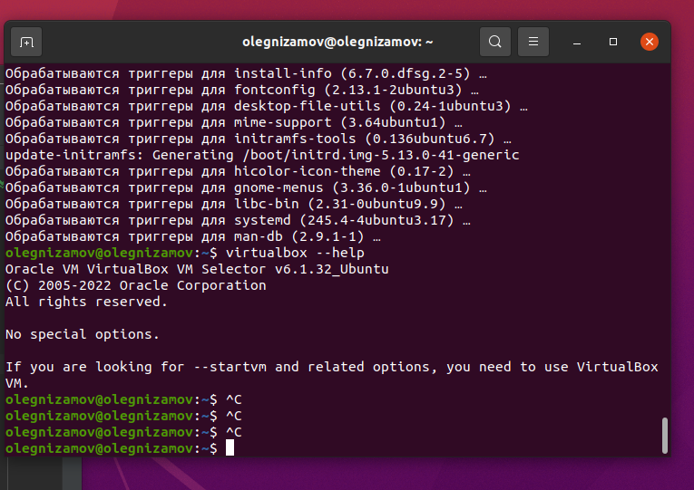
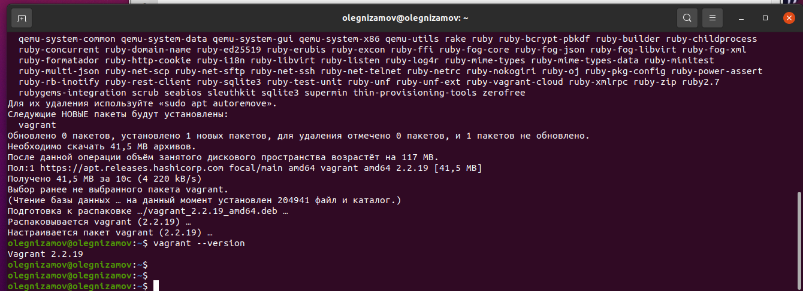
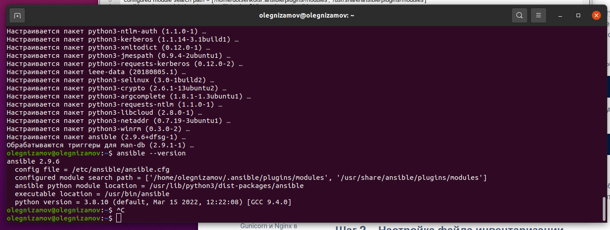

# Домашнее задание к занятию "5.2. Применение принципов IaaC в работе с виртуальными машинами"

## Как сдавать задания

Обязательными к выполнению являются задачи без указания звездочки. Их выполнение необходимо для получения зачета и диплома о профессиональной переподготовке.

Задачи со звездочкой (*) являются дополнительными задачами и/или задачами повышенной сложности. Они не являются обязательными к выполнению, но помогут вам глубже понять тему.

Домашнее задание выполните в файле readme.md в github репозитории. В личном кабинете отправьте на проверку ссылку на .md-файл в вашем репозитории.

Любые вопросы по решению задач задавайте в чате учебной группы.

---

## Задача 1

- Опишите своими словами основные преимущества применения на практике IaaC паттернов.

```
> Ответ:
> Данный подход позволяет описывать инфрастрктуру в виде кода, что позволяет устранить проблемы у разработчиков ("На моей машине работает") и быстро вводить в эксплаутацию новые среды для разработки или увеличивать мощности прокетов.
```

- Какой из принципов IaaC является основополагающим?

```
> Ответ:
> Идемпотентность - знать, что выполнение одного и того же выполняемого действия приведет к ожидаемым результатам.
```

## Задача 2

- Чем Ansible выгодно отличается от других систем управление конфигурациями?

```
> Ответ:
> Использует ssh, не требует дополнительного софта на серверах, механизм работы через push, что более надежнее.
```

- Какой, на ваш взгляд, метод работы систем конфигурации более надёжный push или pull?

```
> Ответ:
> Push (количественная статистика показывает, что больше систем с push механизмом)
```

## Задача 3

Установить на личный компьютер:

- VirtualBox

```
> Ответ:
olegnizamov@olegnizamov:~$ virtualbox --help
Oracle VM VirtualBox VM Selector v6.1.32_Ubuntu
(C) 2005-2022 Oracle Corporation
All rights reserved.
```



- Vagrant

```
> Ответ:
> olegnizamov@olegnizamov:~$ vagrant --version
   Vagrant 2.2.19
```



- Ansible

```
> Ответ:
olegnizamov@olegnizamov:~$ ansible --version
ansible 2.9.6
  config file = /etc/ansible/ansible.cfg
  configured module search path = ['/home/olegnizamov/.ansible/plugins/modules', '/usr/share/ansible/plugins/modules']
  ansible python module location = /usr/lib/python3/dist-packages/ansible
  executable location = /usr/bin/ansible
  python version = 3.8.10 (default, Mar 15 2022, 12:22:08) [GCC 9.4.0]

```


*Приложить вывод команд установленных версий каждой из программ, оформленный в markdown.*

## Задача 4 (*)

Воспроизвести практическую часть лекции самостоятельно.

- Создать виртуальную машину.
- Зайти внутрь ВМ, убедиться, что Docker установлен с помощью команды

```
docker ps
```


```
ответ
olegnizamov@olegnizamov:~/projects/devops-netology/05-virt-02-iaac/src/vagrant$ vagrant ssh
Welcome to Ubuntu 20.04.2 LTS (GNU/Linux 5.4.0-80-generic x86_64)

 * Documentation:  https://help.ubuntu.com
 * Management:     https://landscape.canonical.com
 * Support:        https://ubuntu.com/advantage

  System information as of Wed 03 Nov 2021 09:11:28 AM UTC

  System load:  0.0               Users logged in:          0
  Usage of /:   3.2% of 61.31GB   IPv4 address for docker0: 172.17.0.1
  Memory usage: 20%               IPv4 address for eth0:    10.0.2.15
  Swap usage:   0%                IPv4 address for eth1:    192.168.192.11
  Processes:    103


This system is built by the Bento project by Chef Software
More information can be found at https://github.com/chef/bento
Last login: Wed Nov  3 09:10:56 2021 from 10.0.2.2
vagrant@server1:~$ docker ps
CONTAINER ID   IMAGE     COMMAND   CREATED   STATUS    PORTS     NAMES
```