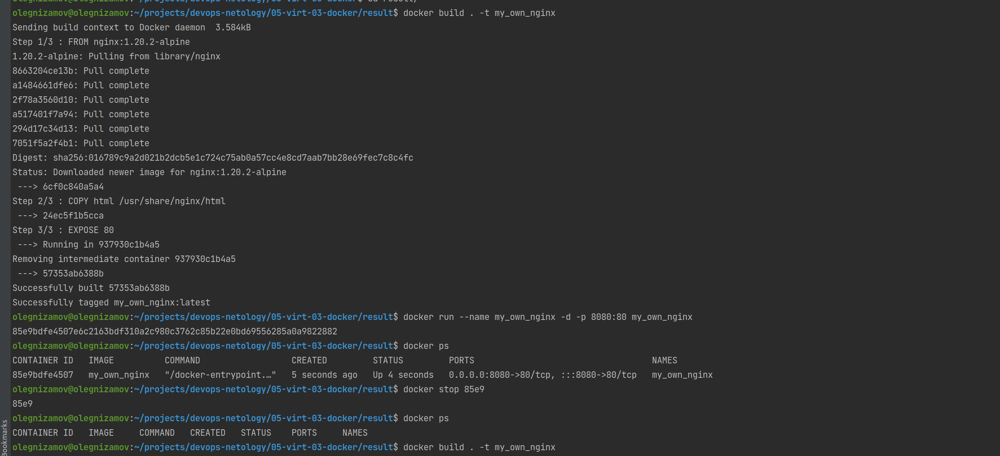
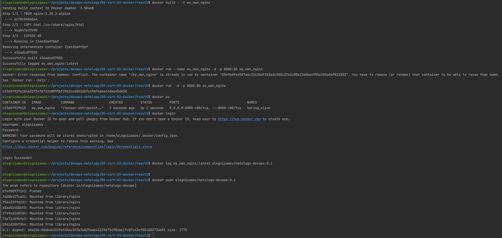

# Домашнее задание к занятию "5.3. Введение. Экосистема. Архитектура. Жизненный цикл Docker контейнера"

## Как сдавать задания

Обязательными к выполнению являются задачи без указания звездочки. Их выполнение необходимо для получения зачета и диплома о профессиональной переподготовке.

Задачи со звездочкой (*) являются дополнительными задачами и/или задачами повышенной сложности. Они не являются обязательными к выполнению, но помогут вам глубже понять тему.

Домашнее задание выполните в файле readme.md в github репозитории. В личном кабинете отправьте на проверку ссылку на .md-файл в вашем репозитории.

Любые вопросы по решению задач задавайте в чате Slack.

---

## Задача 1

Сценарий выполения задачи:

- создайте свой репозиторий на https://hub.docker.com;
- выберете любой образ, который содержит веб-сервер Nginx;
- создайте свой fork образа;
- реализуйте функциональность:
  запуск веб-сервера в фоне с индекс-страницей, содержащей HTML-код ниже:

```
<html>
<head>
Hey, Netology
</head>
<body>
<h1>I’m DevOps Engineer!</h1>
</body>
</html>
```

Опубликуйте созданный форк в своем репозитории и предоставьте ответ в виде ссылки на https://hub.docker.com/username_repo.

```
> Ответ: https://hub.docker.com/r/olegnizamov/netology-devops
olegnizamov@olegnizamov:~/projects/devops-netology/05-virt-03-docker$ cd result/
olegnizamov@olegnizamov:~/projects/devops-netology/05-virt-03-docker/result$ docker build . -t my_own_nginx
Sending build context to Docker daemon  3.584kB
Step 1/3 : FROM nginx:1.20.2-alpine
1.20.2-alpine: Pulling from library/nginx
8663204ce13b: Pull complete
a1484661dfe6: Pull complete
2f78a3560d10: Pull complete
a517401f7a94: Pull complete
294d17c34d13: Pull complete
7051f5a2f4b1: Pull complete
Digest: sha256:016789c9a2d021b2dcb5e1c724c75ab0a57cc4e8cd7aab7bb28e69fec7c8c4fc
Status: Downloaded newer image for nginx:1.20.2-alpine
 ---> 6cf0c840a5a4
Step 2/3 : COPY html /usr/share/nginx/html
 ---> 24ec5f1b5cca
Step 3/3 : EXPOSE 80
 ---> Running in 937930c1b4a5
Removing intermediate container 937930c1b4a5
 ---> 57353ab6388b
Successfully built 57353ab6388b
Successfully tagged my_own_nginx:latest
olegnizamov@olegnizamov:~/projects/devops-netology/05-virt-03-docker/result$ docker run --name my_own_nginx -d -p 8080:80 my_own_nginx
85e9bdfe4507e6c2163bdf310a2c980c3762c85b22e0bd69556285a0a9822882
olegnizamov@olegnizamov:~/projects/devops-netology/05-virt-03-docker/result$ docker ps
CONTAINER ID   IMAGE          COMMAND                  CREATED         STATUS         PORTS                                   NAMES
85e9bdfe4507   my_own_nginx   "/docker-entrypoint.…"   5 seconds ago   Up 4 seconds   0.0.0.0:8080->80/tcp, :::8080->80/tcp   my_own_nginx
olegnizamov@olegnizamov:~/projects/devops-netology/05-virt-03-docker/result$ docker stop 85e9
85e9
olegnizamov@olegnizamov:~/projects/devops-netology/05-virt-03-docker/result$ docker ps
CONTAINER ID   IMAGE     COMMAND   CREATED   STATUS    PORTS     NAMES
olegnizamov@olegnizamov:~/projects/devops-netology/05-virt-03-docker/result$ docker build . -t my_own_nginx
Sending build context to Docker daemon  3.584kB
Step 1/3 : FROM nginx:1.20.2-alpine
 ---> 6cf0c840a5a4
Step 2/3 : COPY html /usr/share/nginx/html
 ---> 96a847637e90
Step 3/3 : EXPOSE 80
 ---> Running in 21ee3ba9fbbf
Removing intermediate container 21ee3ba9fbbf
 ---> 436adcd97505
Successfully built 436adcd97505
Successfully tagged my_own_nginx:latest
olegnizamov@olegnizamov:~/projects/devops-netology/05-virt-03-docker/result$ docker run --name my_own_nginx -d -p 8080:80 my_own_nginx
docker: Error response from daemon: Conflict. The container name "/my_own_nginx" is already in use by container "85e9bdfe4507e6c2163bdf310a2c980c3762c85b22e0bd69556285a0a9822882". You have to remove (or rename) that container to be able to reuse that name.
See 'docker run --help'.
olegnizamov@olegnizamov:~/projects/devops-netology/05-virt-03-docker/result$ docker run  -d -p 8080:80 my_own_nginx
c3365f92fe184a32f547b71268095bf39e2cc68016bfc49e74a6ec4daa45de3d
olegnizamov@olegnizamov:~/projects/devops-netology/05-virt-03-docker/result$ docker ps
CONTAINER ID   IMAGE          COMMAND                  CREATED         STATUS         PORTS                                   NAMES
c3365f92fe18   my_own_nginx   "/docker-entrypoint.…"   3 seconds ago   Up 2 seconds   0.0.0.0:8080->80/tcp, :::8080->80/tcp   boring_elion
olegnizamov@olegnizamov:~/projects/devops-netology/05-virt-03-docker/result$ docker login
Login with your Docker ID to push and pull images from Docker Hub. If you don't have a Docker ID, head over to https://hub.docker.com to create one.
Username: olegnizamov
Password:
WARNING! Your password will be stored unencrypted in /home/olegnizamov/.docker/config.json.
Configure a credential helper to remove this warning. See
https://docs.docker.com/engine/reference/commandline/login/#credentials-store

Login Succeeded
olegnizamov@olegnizamov:~/projects/devops-netology/05-virt-03-docker/result$ docker tag my_own_nginx:latest olegnizamov/netology-devops:0.1

olegnizamov@olegnizamov:~/projects/devops-netology/05-virt-03-docker/result$
olegnizamov@olegnizamov:~/projects/devops-netology/05-virt-03-docker/result$ docker push olegnizamov/netology-devops:0.1
The push refers to repository [docker.io/olegnizamov/netology-devops]
b7afb09771e1: Pushed
3400b427ca31: Mounted from library/nginx
956432f9d2d2: Mounted from library/nginx
68aa52488b50: Mounted from library/nginx
27e9ed2602d4: Mounted from library/nginx
73e72459bfe3: Mounted from library/nginx
b541d28bf3b4: Mounted from library/nginx
0.1: digest: sha256:0dab4b223fe938ac593b368256ab43229e75498d6e1fc07c43ef884883733601 size: 1775

```




## Задача 2

Посмотрите на сценарий ниже и ответьте на вопрос:
"Подходит ли в этом сценарии использование Docker контейнеров или лучше подойдет виртуальная машина, физическая машина? Может быть возможны разные варианты?"

Детально опишите и обоснуйте свой выбор.

--

Сценарий:

- Высоконагруженное монолитное java веб-приложение;

```
> Ответ: Физичевкая машина.
```

- Nodejs веб-приложение;

```
> Ответ: Контейнер Причина - это не монолит, значит есть возможность маштабировать приложение.
```

- Мобильное приложение c версиями для Android и iOS;

```
> Ответ: бэкенд, тогда контейнеры, т.к нужно маштабирование приложения
```

- Шина данных на базе Apache Kafka;

```
> Ответ: Физическая машина или мощная виртуалка и не одна, там вроде бы требовательные запросы.
```

- Elasticsearch кластер для реализации логирования продуктивного веб-приложения - три ноды elasticsearch, два logstash и две ноды kibana;

```
> Ответ: Контейнеры. Из-за возможности маштабирования.
```

- Мониторинг-стек на базе Prometheus и Grafana;

```
> Ответ: Контейнеры. Из-за возможности маштабирования.
```

- MongoDB, как основное хранилище данных для java-приложения;

```
> Ответ: Физическая машина
```

- Gitlab сервер для реализации CI/CD процессов и приватный (закрытый) Docker Registry.

```
> Ответ: Зависит от требований. Крупная разраб. отдел - физическая машина на ssd. Малое колво разрабов - можно и в контейнере поднять.
```

## Задача 3

- Запустите первый контейнер из образа ***centos*** c любым тэгом в фоновом режиме, подключив папку ```/data``` из текущей рабочей директории на хостовой машине в ```/data``` контейнера;

```
> Ответ:
olegnizamov@olegnizamov:~/projects/devops-netology/05-virt-03-docker/result$ docker run -it -v /home/olegnizamov/projects/devops-netology/05-virt-03-docker/result/data:/data centos:8
Unable to find image 'centos:8' locally

8: Pulling from library/centos
a1d0c7532777: Pull complete
Digest: sha256:a27fd8080b517143cbbbab9dfb7c8571c40d67d534bbdee55bd6c473f432b177
Status: Downloaded newer image for centos:8

[root@f5cba055dda9 /]#
[root@f5cba055dda9 /]# docker ps
bash: docker: command not found
[root@f5cba055dda9 /]#


```

- Запустите второй контейнер из образа ***debian*** в фоновом режиме, подключив папку ```/data``` из текущей рабочей директории на хостовой машине в ```/data``` контейнера;

```
> Ответ:
olegnizamov@olegnizamov:~/projects/devops-netology/05-virt-03-docker/result$ docker run -it -v /home/olegnizamov/projects/devops-netology/05-virt-03-docker/result/data:/data debian
Unable to find image 'debian:latest' locally
latest: Pulling from library/debian
67e8aa6c8bbc: Pull complete
Digest: sha256:6137c67e2009e881526386c42ba99b3657e4f92f546814a33d35b14e60579777
Status: Downloaded newer image for debian:latest
root@bee32a0fec46:/#


```

- Подключитесь к первому контейнеру с помощью ```docker exec``` и создайте текстовый файл любого содержания в ```/data```;

```
> Ответ:
[root@f5cba055dda9 /]# ls
bin  data  dev  etc  home  lib  lib64  lost+found  media  mnt  opt  proc  root  run  sbin  srv  sys  tmp  usr  var
[root@f5cba055dda9 /]# cd data
[root@f5cba055dda9 data]# vi 1.txt

```

- Добавьте еще один файл в папку ```/data``` на хостовой машине;

```
> Ответ:
Создал

```

- Подключитесь во второй контейнер и отобразите листинг и содержание файлов в ```/data``` контейнера.

```
> Ответ:
root@bee32a0fec46:/# ls
bin  boot  data  dev  etc  home  lib  lib64  media  mnt  opt  proc  root  run  sbin  srv  sys  tmp  usr  var
root@bee32a0fec46:/# cd data
root@bee32a0fec46:/data# ls
1.txt  2.txt

```

## Задача 4 (*)

Воспроизвести практическую часть лекции самостоятельно.

Соберите Docker образ с Ansible, загрузите на Docker Hub и пришлите ссылку вместе с остальными ответами к задачам.

---

### Как cдавать задание

Выполненное домашнее задание пришлите ссылкой на .md-файл в вашем репозитории.

---
