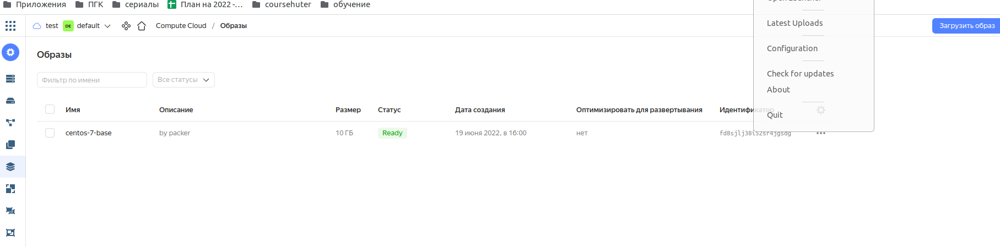
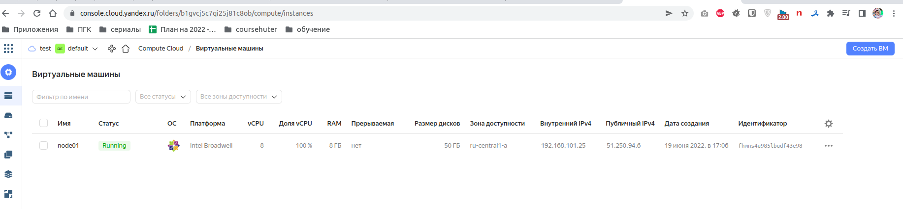
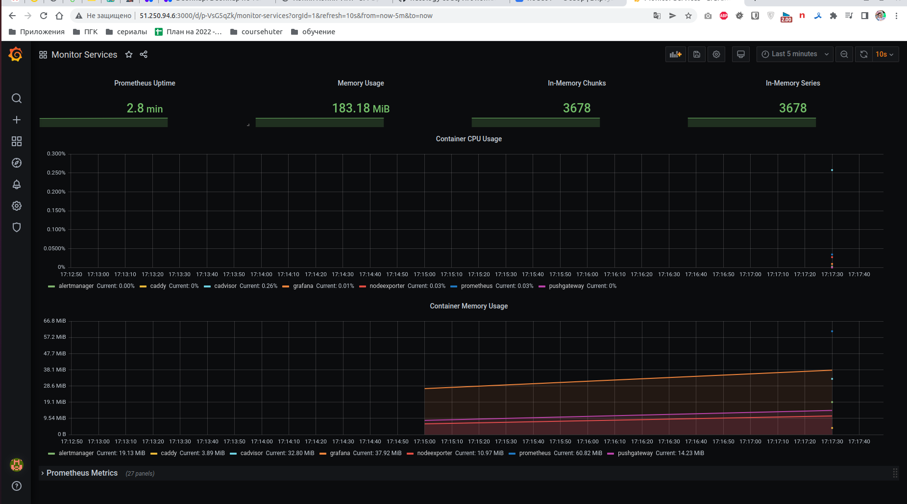

# Домашнее задание к занятию "5.4. Оркестрация группой Docker контейнеров на примере Docker Compose"

## Как сдавать задания

Обязательными к выполнению являются задачи без указания звездочки. Их выполнение необходимо для получения зачета и диплома о профессиональной переподготовке.

Задачи со звездочкой (*) являются дополнительными задачами и/или задачами повышенной сложности. Они не являются обязательными к выполнению, но помогут вам глубже понять тему.

Домашнее задание выполните в файле readme.md в github репозитории. В личном кабинете отправьте на проверку ссылку на .md-файл в вашем репозитории.

Любые вопросы по решению задач задавайте в чате учебной группы.

---

## Задача 1

Создать собственный образ операционной системы с помощью Packer.

Для получения зачета, вам необходимо предоставить:

- Скриншот страницы, как на слайде из презентации (слайд 37).

```
> Ответ:
olegnizamov@olegnizamov:~$ yc init
Welcome! This command will take you through the configuration process.
Please go to https://oauth.yandex.ru/authorize?response_type=token&client_id=1a6990aa636648e9b2ef855fa7bec2fb in order to obtain OAuth token.

olegnizamov@olegnizamov:~$ yc compute image list
+----+------+--------+-------------+--------+
| ID | NAME | FAMILY | PRODUCT IDS | STATUS |
+----+------+--------+-------------+--------+
olegnizamov@olegnizamov:~$ yc vpc network create --name net --labels my-label=netology --description "my first network via yc"
olegnizamov@olegnizamov:~$ yc vpc subnet create --name my-subnet-a --zone ru-central1-a --range 10.1.2.0/24 --network-name net --description "my first subnet via yc"
olegnizamov@olegnizamov:~$ packer --version
legnizamov@olegnizamov:~$ yc init
Welcome! This command will take you through the configuration process.
Please go to https://oauth.yandex.ru/authorize?response_type=token&client_id=1a6990aa636648e9b2ef855fa7bec2fb in order to obtain OAuth token.

Please enter OAuth token: AQAAAAAK95aFAATuwVVwsVDzcENouB59H-1n21E
Please select cloud to use:
 [1] cloud-tearu (id = b1ghsndqlh2ludkub1eu)
 [2] test (id = b1gtitubqcoaoesmi8vd)
Please enter your numeric choice: 2
Your current cloud has been set to 'test' (id = b1gtitubqcoaoesmi8vd).
Please choose folder to use:
 [1] default (id = b1gvcj5c7qi25j81c8ob)
 [2] Create a new folder
Please enter your numeric choice: 1
Your current folder has been set to 'default' (id = b1gvcj5c7qi25j81c8ob).
Do you want to configure a default Compute zone? [Y/n] y
Which zone do you want to use as a profile default?
 [1] ru-central1-a
 [2] ru-central1-b
 [3] ru-central1-c
 [4] Don't set default zone
Please enter your numeric choice: 1
Your profile default Compute zone has been set to 'ru-central1-a'.
olegnizamov@olegnizamov:~$ yc config list
token: AQAAAAAK95aFAATuwVVwsVDzcENouB59H-1n21E
cloud-id: b1gtitubqcoaoesmi8vd
folder-id: b1gvcj5c7qi25j81c8ob
compute-default-zone: ru-central1-a
olegnizamov@olegnizamov:~$ yc compute image list
+----+------+--------+-------------+--------+
| ID | NAME | FAMILY | PRODUCT IDS | STATUS |
+----+------+--------+-------------+--------+
olegnizamov@olegnizamov:~$ yc vpc network create --name net --labels my-label=netology --descrription "my first network via yc"
ERROR: unknown flag: --descrription
olegnizamov@olegnizamov:~$ yc vpc network create --name net --labels my-label=netology --description "my first network via yc"
id: enpontn4iljopq78mh0p
folder_id: b1gvcj5c7qi25j81c8ob
created_at: "2022-06-19T11:48:04Z"
name: net
description: my first network via yc
labels:
  my-label: netology

olegnizamov@olegnizamov:~$ yc vpc subnet create --name my-subnet-a --zone ru-central1-a --range 10.1.2.0/24 --network-name net --description "my first subnet via yc"
id: e9bes131ohm95sq40b76
folder_id: b1gvcj5c7qi25j81c8ob
created_at: "2022-06-19T11:49:22Z"
name: my-subnet-a
description: my first subnet via yc
network_id: enpontn4iljopq78mh0p
zone_id: ru-central1-a
v4_cidr_blocks:
- 10.1.2.0/24

olegnizamov@olegnizamov:~$ packer --version

Команда «packer» не найдена, но может быть установлена с помощью:

sudo snap install packer  # version 1.0.0-2, or
sudo apt  install packer  # version 1.3.4+dfsg-4

See 'snap info packer' for additional versions.

olegnizamov@olegnizamov:~$ sudo apt  install packer
[sudo] пароль для olegnizamov:
Чтение списков пакетов… Готово
Построение дерева зависимостей
Чтение информации о состоянии… Готово
Следующие пакеты устанавливались автоматически и больше не требуются:
  augeas-lenses cpu-checker cryptsetup-bin db-util db5.3-util debootstrap dmeventd extlinux fonts-lato hfsplus
  ibverbs-providers icoutils ipxe-qemu ipxe-qemu-256k-compat-efi-roms jsonlint kpartx ldmtool libafflib0v5 libaio1
  libarchive-tools libaugeas0 libc-ares2 libcacard0 libconfig9 libdate-manip-perl libdevmapper-event1.02.1 libewf2 libfdt1
  libfwupdplugin1 libguestfs-hfsplus libguestfs-perl libguestfs-reiserfs libguestfs-tools libguestfs-xfs libguestfs0 libhfsp0
  libhivex0 libibverbs1 libintl-perl libintl-xs-perl libiscsi7 libldm-1.0-0 liblvm2cmd2.03 libnetpbm10 libnode64 libpmem1
  librados2 librbd1 librdmacm1 libruby2.7 libslirp0 libspice-server1 libstring-shellquote-perl libsys-virt-perl libtsk13
  libusbredirparser1 libvirglrenderer1 libvirt0 libwin-hivex-perl libyara3 lsscsi lvm2 msr-tools netpbm nodejs-doc osinfo-db
  ovmf php-composer-ca-bundle php-composer-semver php-composer-spdx-licenses php-composer-xdebug-handler php-json-schema
  php-psr-container php-psr-log php-symfony-console php-symfony-filesystem php-symfony-finder php-symfony-process
  php-symfony-service-contracts qemu-block-extra qemu-system-common qemu-system-data qemu-system-gui qemu-system-x86
  qemu-utils rake ruby ruby-bcrypt-pbkdf ruby-builder ruby-childprocess ruby-concurrent ruby-domain-name ruby-ed25519
  ruby-erubis ruby-excon ruby-ffi ruby-fog-core ruby-fog-json ruby-fog-libvirt ruby-fog-xml ruby-formatador ruby-http-cookie
  ruby-i18n ruby-libvirt ruby-listen ruby-log4r ruby-mime-types ruby-mime-types-data ruby-minitest ruby-multi-json
  ruby-net-scp ruby-net-sftp ruby-net-ssh ruby-net-telnet ruby-netrc ruby-nokogiri ruby-oj ruby-pkg-config ruby-power-assert
  ruby-rb-inotify ruby-rest-client ruby-sqlite3 ruby-test-unit ruby-unf ruby-unf-ext ruby-vagrant-cloud ruby-xmlrpc ruby-zip
  ruby2.7 rubygems-integration scrub seabios sleuthkit sqlite3 supermin thin-provisioning-tools zerofree
Для их удаления используйте «sudo apt autoremove».
Следующие НОВЫЕ пакеты будут установлены:
  packer
Обновлено 0 пакетов, установлено 1 новых пакетов, для удаления отмечено 0 пакетов, и 29 пакетов не обновлено.
Необходимо скачать 33,3 MB архивов.
После данной операции объём занятого дискового пространства возрастёт на 158 MB.
Ошб:1 https://apt.releases.hashicorp.com focal/main amd64 packer amd64 1.8.1-1
  403  Forbidden [IP: 13.33.243.19 443]
E: Не удалось получить https://apt.releases.hashicorp.com/pool/amd64/main/packer_1.8.1-1_amd64.deb  403  Forbidden [IP: 13.33.243.19 443]
E: Не удалось получить некоторые архивы; возможно, нужно запустить apt-get update или попытаться повторить запуск с ключом --fix-missing?
olegnizamov@olegnizamov:~$ sudo apt  install packer
Чтение списков пакетов… Готово
Построение дерева зависимостей
Чтение информации о состоянии… Готово
Следующие пакеты устанавливались автоматически и больше не требуются:
  augeas-lenses cpu-checker cryptsetup-bin db-util db5.3-util debootstrap dmeventd extlinux fonts-lato hfsplus
  ibverbs-providers icoutils ipxe-qemu ipxe-qemu-256k-compat-efi-roms jsonlint kpartx ldmtool libafflib0v5 libaio1
  libarchive-tools libaugeas0 libc-ares2 libcacard0 libconfig9 libdate-manip-perl libdevmapper-event1.02.1 libewf2 libfdt1
  libfwupdplugin1 libguestfs-hfsplus libguestfs-perl libguestfs-reiserfs libguestfs-tools libguestfs-xfs libguestfs0 libhfsp0
  libhivex0 libibverbs1 libintl-perl libintl-xs-perl libiscsi7 libldm-1.0-0 liblvm2cmd2.03 libnetpbm10 libnode64 libpmem1
  librados2 librbd1 librdmacm1 libruby2.7 libslirp0 libspice-server1 libstring-shellquote-perl libsys-virt-perl libtsk13
  libusbredirparser1 libvirglrenderer1 libvirt0 libwin-hivex-perl libyara3 lsscsi lvm2 msr-tools netpbm nodejs-doc osinfo-db
  ovmf php-composer-ca-bundle php-composer-semver php-composer-spdx-licenses php-composer-xdebug-handler php-json-schema
  php-psr-container php-psr-log php-symfony-console php-symfony-filesystem php-symfony-finder php-symfony-process
  php-symfony-service-contracts qemu-block-extra qemu-system-common qemu-system-data qemu-system-gui qemu-system-x86
  qemu-utils rake ruby ruby-bcrypt-pbkdf ruby-builder ruby-childprocess ruby-concurrent ruby-domain-name ruby-ed25519
  ruby-erubis ruby-excon ruby-ffi ruby-fog-core ruby-fog-json ruby-fog-libvirt ruby-fog-xml ruby-formatador ruby-http-cookie
  ruby-i18n ruby-libvirt ruby-listen ruby-log4r ruby-mime-types ruby-mime-types-data ruby-minitest ruby-multi-json
  ruby-net-scp ruby-net-sftp ruby-net-ssh ruby-net-telnet ruby-netrc ruby-nokogiri ruby-oj ruby-pkg-config ruby-power-assert
  ruby-rb-inotify ruby-rest-client ruby-sqlite3 ruby-test-unit ruby-unf ruby-unf-ext ruby-vagrant-cloud ruby-xmlrpc ruby-zip
  ruby2.7 rubygems-integration scrub seabios sleuthkit sqlite3 supermin thin-provisioning-tools zerofree
Для их удаления используйте «sudo apt autoremove».
Следующие НОВЫЕ пакеты будут установлены:
  packer
Обновлено 0 пакетов, установлено 1 новых пакетов, для удаления отмечено 0 пакетов, и 29 пакетов не обновлено.
Необходимо скачать 33,3 MB архивов.
После данной операции объём занятого дискового пространства возрастёт на 158 MB.
Пол:1 https://apt.releases.hashicorp.com focal/main amd64 packer amd64 1.8.1-1 [33,3 MB]
Получено 33,3 MB за 4с (8 198 kB/s)
Выбор ранее не выбранного пакета packer.
(Чтение базы данных … на данный момент установлено 223122 файла и каталога.)
Подготовка к распаковке …/packer_1.8.1-1_amd64.deb …
Распаковывается packer (1.8.1-1) …
Настраивается пакет packer (1.8.1-1) …
olegnizamov@olegnizamov:~$ packer --version
1.8.1
olegnizamov@olegnizamov:~/projects/devops-netology/05-virt-04-docker-compose/src/packer$ packer validate centos-7-base.json
The configuration is valid.
olegnizamov@olegnizamov:~/projects/devops-netology/05-virt-04-docker-compose/src/packer$ packer build centos-7-base.json
yandex: output will be in this color.

==> yandex: Creating temporary RSA SSH key for instance...
==> yandex: Using as source image: fd80rnhvc47031anomed (name: "centos-7-v20220613", family: "centos-7")
==> yandex: Use provided subnet id e9bes131ohm95sq40b76
==> yandex: Creating disk...
==> yandex: Creating instance...
==> yandex: Waiting for instance with id fhmrq7kr1pvjet9n8ace to become active...
    yandex: Detected instance IP: 51.250.84.22
==> yandex: Using SSH communicator to connect: 51.250.84.22
==> yandex: Waiting for SSH to become available...
==> yandex: Connected to SSH!
==> yandex: Provisioning with shell script: /tmp/packer-shell2390493102
    yandex: Loaded plugins: fastestmirror
    yandex: Loading mirror speeds from cached hostfile
    yandex:  * base: mirror.yandex.ru
    yandex:  * extras: mirror.yandex.ru
    yandex:  * updates: mirror.yandex.ru
    yandex: Resolving Dependencies
    yandex: --> Running transaction check
    yandex: ---> Package xz.x86_64 0:5.2.2-1.el7 will be updated
    yandex: ---> Package xz.x86_64 0:5.2.2-2.el7_9 will be an update
    yandex: ---> Package xz-libs.x86_64 0:5.2.2-1.el7 will be updated
    yandex: ---> Package xz-libs.x86_64 0:5.2.2-2.el7_9 will be an update
    yandex: --> Finished Dependency Resolution
    yandex:
    yandex: Dependencies Resolved
    yandex:
    yandex: ================================================================================
    yandex:  Package          Arch            Version                Repository        Size
    yandex: ================================================================================
    yandex: Updating:
    yandex:  xz               x86_64          5.2.2-2.el7_9          updates          229 k
    yandex:  xz-libs          x86_64          5.2.2-2.el7_9          updates          103 k
    yandex:
    yandex: Transaction Summary
    yandex: ================================================================================
    yandex: Upgrade  2 Packages
    yandex:
    yandex: Total download size: 332 k
    yandex: Downloading packages:
    yandex: Delta RPMs disabled because /usr/bin/applydeltarpm not installed.
    yandex: --------------------------------------------------------------------------------
    yandex: Total                                              2.6 MB/s | 332 kB  00:00
    yandex: Running transaction check
    yandex: Running transaction test
    yandex: Transaction test succeeded
    yandex: Running transaction
    yandex:   Updating   : xz-libs-5.2.2-2.el7_9.x86_64                                 1/4
    yandex:   Updating   : xz-5.2.2-2.el7_9.x86_64                                      2/4
    yandex:   Cleanup    : xz-5.2.2-1.el7.x86_64                                        3/4
    yandex:   Cleanup    : xz-libs-5.2.2-1.el7.x86_64                                   4/4
    yandex:   Verifying  : xz-5.2.2-2.el7_9.x86_64                                      1/4
    yandex:   Verifying  : xz-libs-5.2.2-2.el7_9.x86_64                                 2/4
    yandex:   Verifying  : xz-libs-5.2.2-1.el7.x86_64                                   3/4
    yandex:   Verifying  : xz-5.2.2-1.el7.x86_64                                        4/4
    yandex:
    yandex: Updated:
    yandex:   xz.x86_64 0:5.2.2-2.el7_9            xz-libs.x86_64 0:5.2.2-2.el7_9
    yandex:
    yandex: Complete!
    yandex: Loaded plugins: fastestmirror
    yandex: Loading mirror speeds from cached hostfile
    yandex:  * base: mirror.yandex.ru
    yandex:  * extras: mirror.yandex.ru
    yandex:  * updates: mirror.yandex.ru
    yandex: Package iptables-1.4.21-35.el7.x86_64 already installed and latest version
    yandex: Package curl-7.29.0-59.el7_9.1.x86_64 already installed and latest version
    yandex: Package net-tools-2.0-0.25.20131004git.el7.x86_64 already installed and latest version
    yandex: Package rsync-3.1.2-10.el7.x86_64 already installed and latest version
    yandex: Package openssh-server-7.4p1-22.el7_9.x86_64 already installed and latest version
    yandex: Resolving Dependencies
    yandex: --> Running transaction check
    yandex: ---> Package bind-utils.x86_64 32:9.11.4-26.P2.el7_9.9 will be installed
    yandex: --> Processing Dependency: bind-libs-lite(x86-64) = 32:9.11.4-26.P2.el7_9.9 for package: 32:bind-utils-9.11.4-26.P2.el7_9.9.x86_64
    yandex: --> Processing Dependency: bind-libs(x86-64) = 32:9.11.4-26.P2.el7_9.9 for package: 32:bind-utils-9.11.4-26.P2.el7_9.9.x86_64
    yandex: --> Processing Dependency: liblwres.so.160()(64bit) for package: 32:bind-utils-9.11.4-26.P2.el7_9.9.x86_64
    yandex: --> Processing Dependency: libisccfg.so.160()(64bit) for package: 32:bind-utils-9.11.4-26.P2.el7_9.9.x86_64
    yandex: --> Processing Dependency: libisc.so.169()(64bit) for package: 32:bind-utils-9.11.4-26.P2.el7_9.9.x86_64
    yandex: --> Processing Dependency: libirs.so.160()(64bit) for package: 32:bind-utils-9.11.4-26.P2.el7_9.9.x86_64
    yandex: --> Processing Dependency: libdns.so.1102()(64bit) for package: 32:bind-utils-9.11.4-26.P2.el7_9.9.x86_64
    yandex: --> Processing Dependency: libbind9.so.160()(64bit) for package: 32:bind-utils-9.11.4-26.P2.el7_9.9.x86_64
    yandex: --> Processing Dependency: libGeoIP.so.1()(64bit) for package: 32:bind-utils-9.11.4-26.P2.el7_9.9.x86_64
    yandex: ---> Package bridge-utils.x86_64 0:1.5-9.el7 will be installed
    yandex: ---> Package tcpdump.x86_64 14:4.9.2-4.el7_7.1 will be installed
    yandex: --> Processing Dependency: libpcap >= 14:1.5.3-10 for package: 14:tcpdump-4.9.2-4.el7_7.1.x86_64
    yandex: --> Processing Dependency: libpcap.so.1()(64bit) for package: 14:tcpdump-4.9.2-4.el7_7.1.x86_64
    yandex: ---> Package telnet.x86_64 1:0.17-66.el7 will be installed
    yandex: --> Running transaction check
    yandex: ---> Package GeoIP.x86_64 0:1.5.0-14.el7 will be installed
    yandex: --> Processing Dependency: geoipupdate for package: GeoIP-1.5.0-14.el7.x86_64
    yandex: ---> Package bind-libs.x86_64 32:9.11.4-26.P2.el7_9.9 will be installed
    yandex: --> Processing Dependency: bind-license = 32:9.11.4-26.P2.el7_9.9 for package: 32:bind-libs-9.11.4-26.P2.el7_9.9.x86_64
    yandex: ---> Package bind-libs-lite.x86_64 32:9.11.4-26.P2.el7_9.9 will be installed
    yandex: ---> Package libpcap.x86_64 14:1.5.3-13.el7_9 will be installed
    yandex: --> Running transaction check
    yandex: ---> Package bind-license.noarch 32:9.11.4-26.P2.el7_9.9 will be installed
    yandex: ---> Package geoipupdate.x86_64 0:2.5.0-1.el7 will be installed
    yandex: --> Finished Dependency Resolution
    yandex:
    yandex: Dependencies Resolved
    yandex:
    yandex: ================================================================================
    yandex:  Package            Arch       Version                        Repository   Size
    yandex: ================================================================================
    yandex: Installing:
    yandex:  bind-utils         x86_64     32:9.11.4-26.P2.el7_9.9        updates     261 k
    yandex:  bridge-utils       x86_64     1.5-9.el7                      base         32 k
    yandex:  tcpdump            x86_64     14:4.9.2-4.el7_7.1             base        422 k
    yandex:  telnet             x86_64     1:0.17-66.el7                  updates      64 k
    yandex: Installing for dependencies:
    yandex:  GeoIP              x86_64     1.5.0-14.el7                   base        1.5 M
    yandex:  bind-libs          x86_64     32:9.11.4-26.P2.el7_9.9        updates     157 k
    yandex:  bind-libs-lite     x86_64     32:9.11.4-26.P2.el7_9.9        updates     1.1 M
    yandex:  bind-license       noarch     32:9.11.4-26.P2.el7_9.9        updates      91 k
    yandex:  geoipupdate        x86_64     2.5.0-1.el7                    base         35 k
    yandex:  libpcap            x86_64     14:1.5.3-13.el7_9              updates     139 k
    yandex:
    yandex: Transaction Summary
    yandex: ================================================================================
    yandex: Install  4 Packages (+6 Dependent packages)
    yandex:
    yandex: Total download size: 3.8 M
    yandex: Installed size: 9.0 M
    yandex: Downloading packages:
    yandex: --------------------------------------------------------------------------------
    yandex: Total                                              8.8 MB/s | 3.8 MB  00:00
    yandex: Running transaction check
    yandex: Running transaction test
    yandex: Transaction test succeeded
    yandex: Running transaction
    yandex:   Installing : 32:bind-license-9.11.4-26.P2.el7_9.9.noarch                 1/10
    yandex:   Installing : geoipupdate-2.5.0-1.el7.x86_64                              2/10
    yandex:   Installing : GeoIP-1.5.0-14.el7.x86_64                                   3/10
    yandex:   Installing : 32:bind-libs-lite-9.11.4-26.P2.el7_9.9.x86_64               4/10
    yandex:   Installing : 32:bind-libs-9.11.4-26.P2.el7_9.9.x86_64                    5/10
    yandex:   Installing : 14:libpcap-1.5.3-13.el7_9.x86_64                            6/10
    yandex: pam_tally2: Error opening /var/log/tallylog for update: Permission denied
    yandex: pam_tally2: Authentication error
    yandex: useradd: failed to reset the tallylog entry of user "tcpdump"
    yandex:   Installing : 14:tcpdump-4.9.2-4.el7_7.1.x86_64                           7/10
    yandex:   Installing : 32:bind-utils-9.11.4-26.P2.el7_9.9.x86_64                   8/10
    yandex:   Installing : bridge-utils-1.5-9.el7.x86_64                               9/10
    yandex:   Installing : 1:telnet-0.17-66.el7.x86_64                                10/10
    yandex:   Verifying  : GeoIP-1.5.0-14.el7.x86_64                                   1/10
    yandex:   Verifying  : 14:libpcap-1.5.3-13.el7_9.x86_64                            2/10
    yandex:   Verifying  : 1:telnet-0.17-66.el7.x86_64                                 3/10
    yandex:   Verifying  : 32:bind-libs-9.11.4-26.P2.el7_9.9.x86_64                    4/10
    yandex:   Verifying  : geoipupdate-2.5.0-1.el7.x86_64                              5/10
    yandex:   Verifying  : 14:tcpdump-4.9.2-4.el7_7.1.x86_64                           6/10
    yandex:   Verifying  : 32:bind-license-9.11.4-26.P2.el7_9.9.noarch                 7/10
    yandex:   Verifying  : bridge-utils-1.5-9.el7.x86_64                               8/10
    yandex:   Verifying  : 32:bind-libs-lite-9.11.4-26.P2.el7_9.9.x86_64               9/10
    yandex:   Verifying  : 32:bind-utils-9.11.4-26.P2.el7_9.9.x86_64                  10/10
    yandex:
    yandex: Installed:
    yandex:   bind-utils.x86_64 32:9.11.4-26.P2.el7_9.9   bridge-utils.x86_64 0:1.5-9.el7
    yandex:   tcpdump.x86_64 14:4.9.2-4.el7_7.1           telnet.x86_64 1:0.17-66.el7
    yandex:
    yandex: Dependency Installed:
    yandex:   GeoIP.x86_64 0:1.5.0-14.el7
    yandex:   bind-libs.x86_64 32:9.11.4-26.P2.el7_9.9
    yandex:   bind-libs-lite.x86_64 32:9.11.4-26.P2.el7_9.9
    yandex:   bind-license.noarch 32:9.11.4-26.P2.el7_9.9
    yandex:   geoipupdate.x86_64 0:2.5.0-1.el7
    yandex:   libpcap.x86_64 14:1.5.3-13.el7_9
    yandex:
    yandex: Complete!
==> yandex: Stopping instance...
==> yandex: Deleting instance...
    yandex: Instance has been deleted!
==> yandex: Creating image: centos-7-base
==> yandex: Waiting for image to complete...
==> yandex: Success image create...
==> yandex: Destroying boot disk...
    yandex: Disk has been deleted!
Build 'yandex' finished after 4 minutes 28 seconds.

==> Wait completed after 4 minutes 28 seconds

==> Builds finished. The artifacts of successful builds are:
--> yandex: A disk image was created: centos-7-base (id: fd8sjlj38i52sr4jgsdg) with family name centos
olegnizamov@olegnizamov:~/projects/devops-netology/05-virt-04-docker-compose/src/packer$ yc compute image list
+----------------------+---------------+--------+----------------------+--------+
|          ID          |     NAME      | FAMILY |     PRODUCT IDS      | STATUS |
+----------------------+---------------+--------+----------------------+--------+
| fd8sjlj38i52sr4jgsdg | centos-7-base | centos | f2ed6g56rfbepn59jt09 | READY  |
+----------------------+---------------+--------+----------------------+--------+
olegnizamov@olegnizamov:~/projects/devops-netology/05-virt-04-docker-compose/src/packer$ yc vpc subnet delete --name my-subnet-a && yc vpc network delete --name net
done (7s)
```



## Задача 2

Создать вашу первую виртуальную машину в Яндекс.Облаке.

Для получения зачета, вам необходимо предоставить:

- Скриншот страницы свойств созданной ВМ, как на примере ниже:

<p align="center">
  
</p>

Создать ключ по инструкции - https://cloud.yandex.ru/docs/iam/operations/authorized-key/create
```
> Ответ:
olegnizamov@olegnizamov:~/projects/devops-netology/05-virt-04-docker-compose/src/terraform$ terraform --version
Terraform v1.2.2
on linux_amd64

Your version of Terraform is out of date! The latest version
is 1.2.3. You can update by downloading from https://www.terraform.io/downloads.html
olegnizamov@olegnizamov:~/projects/devops-netology/05-virt-04-docker-compose/src/terraform$ terraform init

Initializing the backend...

Initializing provider plugins...
- Finding latest version of yandex-cloud/yandex...
- Installing yandex-cloud/yandex v0.75.0...
- Installed yandex-cloud/yandex v0.75.0 (self-signed, key ID E40F590B50BB8E40)

Partner and community providers are signed by their developers.
If you'd like to know more about provider signing, you can read about it here:
https://www.terraform.io/docs/cli/plugins/signing.html

Terraform has created a lock file .terraform.lock.hcl to record the provider
selections it made above. Include this file in your version control repository
so that Terraform can guarantee to make the same selections by default when
you run "terraform init" in the future.

Terraform has been successfully initialized!

You may now begin working with Terraform. Try running "terraform plan" to see
any changes that are required for your infrastructure. All Terraform commands
should now work.

If you ever set or change modules or backend configuration for Terraform,
rerun this command to reinitialize your working directory. If you forget, other
commands will detect it and remind you to do so if necessary.

olegnizamov@olegnizamov:~/projects/devops-netology/05-virt-04-docker-compose/src/terraform$ terraform plan

Terraform used the selected providers to generate the following execution plan. Resource actions are indicated with the following symbols:
  + create

Terraform will perform the following actions:

  # yandex_compute_instance.node01 will be created
  + resource "yandex_compute_instance" "node01" {
      + allow_stopping_for_update = true
      + created_at                = (known after apply)
      + folder_id                 = (known after apply)
      + fqdn                      = (known after apply)
      + hostname                  = "node01.netology.cloud"
      + id                        = (known after apply)
..

olegnizamov@olegnizamov:~/projects/devops-netology/05-virt-04-docker-compose/src/terraform$ terraform apply -auto-approve

Terraform used the selected providers to generate the following execution plan. Resource actions are indicated with the following symbols:
  + create

Terraform will perform the following actions:

  # yandex_compute_instance.node01 will be created
  + resource "yandex_compute_instance" "node01" {
      + allow_stopping_for_update = true
      + created_at                = (known after apply)
      + folder_id                 = (known after apply)
      + fqdn                      = (known after apply)
      + hostname                  = "node01.netology.cloud"
      + id                        = (known after apply)
      + name                      = "node01"
      + network_acceleration_type = "standard"
      + platform_id               = "standard-v1"
      + service_account_id        = (known after apply)
      + status                    = (known after apply)
      + zone                      = "ru-central1-a"

      + boot_disk {
          + auto_delete = true
          + device_name = (known after apply)
          + disk_id     = (known after apply)
          + mode        = (known after apply)

          + initialize_params {
              + block_size  = (known after apply)
              + description = (known after apply)
              + image_id    = "fd8sjlj38i52sr4jgsdg"
              + name        = "root-node01"
              + size        = 50
              + snapshot_id = (known after apply)
              + type        = "network-nvme"
            }
        }

      + network_interface {
          + index              = (known after apply)
          + ip_address         = (known after apply)
          + ipv4               = true
          + ipv6               = (known after apply)
          + ipv6_address       = (known after apply)
          + mac_address        = (known after apply)
          + nat                = true
          + nat_ip_address     = (known after apply)
          + nat_ip_version     = (known after apply)
          + security_group_ids = (known after apply)
          + subnet_id          = (known after apply)
        }

      + placement_policy {
          + host_affinity_rules = (known after apply)
          + placement_group_id  = (known after apply)
        }

      + resources {
          + core_fraction = 100
          + cores         = 8
          + memory        = 8
        }

      + scheduling_policy {
          + preemptible = (known after apply)
        }
    }

  # yandex_vpc_network.default will be created
  + resource "yandex_vpc_network" "default" {
      + created_at                = (known after apply)
      + default_security_group_id = (known after apply)
      + folder_id                 = (known after apply)
      + id                        = (known after apply)
      + labels                    = (known after apply)
      + name                      = "net"
      + subnet_ids                = (known after apply)
    }

  # yandex_vpc_subnet.default will be created
  + resource "yandex_vpc_subnet" "default" {
      + created_at     = (known after apply)
      + folder_id      = (known after apply)
      + id             = (known after apply)
      + labels         = (known after apply)
      + name           = "subnet"
      + network_id     = (known after apply)
      + v4_cidr_blocks = [
          + "192.168.101.0/24",
        ]
      + v6_cidr_blocks = (known after apply)
      + zone           = "ru-central1-a"
    }

Plan: 3 to add, 0 to change, 0 to destroy.

Changes to Outputs:
  + external_ip_address_node01_yandex_cloud = (known after apply)
  + internal_ip_address_node01_yandex_cloud = (known after apply)
yandex_vpc_network.default: Creating...
yandex_vpc_network.default: Creation complete after 4s [id=enpa85b8jb71o4ladp73]
yandex_vpc_subnet.default: Creating...
yandex_vpc_subnet.default: Creation complete after 1s [id=e9bg1fd0hifh2mlcadfl]
yandex_compute_instance.node01: Creating...
yandex_compute_instance.node01: Still creating... [10s elapsed]
yandex_compute_instance.node01: Still creating... [20s elapsed]
yandex_compute_instance.node01: Still creating... [30s elapsed]
yandex_compute_instance.node01: Creation complete after 32s [id=fhmns4u985lbudf43e98]

Apply complete! Resources: 3 added, 0 changed, 0 destroyed.

Outputs:

external_ip_address_node01_yandex_cloud = "51.250.94.6"
internal_ip_address_node01_yandex_cloud = "192.168.101.25"


```


## Задача 3

Создать ваш первый готовый к боевой эксплуатации компонент мониторинга, состоящий из стека микросервисов.

Для получения зачета, вам необходимо предоставить:

- Скриншот работающего веб-интерфейса Grafana с текущими метриками, как на примере ниже

<p align="center">
  
</p>

```
> Ответ:
olegnizamov@olegnizamov:~/projects/devops-netology/05-virt-04-docker-compose/src/ansible$ ansible-playbook provision.yml

PLAY [nodes] *******************************************************************************************************************************

TASK [Gathering Facts] *********************************************************************************************************************
The authenticity of host '51.250.94.6 (51.250.94.6)' can't be established.
ECDSA key fingerprint is SHA256:Jwl7gdANXwke5tlJPL22ZmS/yGZXr5l6v16/MviJ7ng.
Are you sure you want to continue connecting (yes/no/[fingerprint])? yes
ok: [node01.netology.cloud]

TASK [Create directory for ssh-keys] *******************************************************************************************************
ok: [node01.netology.cloud]

TASK [Adding rsa-key in /root/.ssh/authorized_keys] ****************************************************************************************
changed: [node01.netology.cloud]

TASK [Checking DNS] ************************************************************************************************************************
changed: [node01.netology.cloud]

TASK [Installing tools] ********************************************************************************************************************
changed: [node01.netology.cloud] => (item=['git', 'curl'])

TASK [Add docker repository] ***************************************************************************************************************
changed: [node01.netology.cloud]

TASK [Installing docker package] ***********************************************************************************************************
changed: [node01.netology.cloud] => (item=['docker-ce', 'docker-ce-cli', 'containerd.io'])

TASK [Enable docker daemon] ****************************************************************************************************************
changed: [node01.netology.cloud]

TASK [Install docker-compose] **************************************************************************************************************
changed: [node01.netology.cloud]

TASK [Synchronization] *********************************************************************************************************************
changed: [node01.netology.cloud]

TASK [Pull all images in compose] **********************************************************************************************************
changed: [node01.netology.cloud]

TASK [Up all services in compose] **********************************************************************************************************
changed: [node01.netology.cloud]

PLAY RECAP *********************************************************************************************************************************
node01.netology.cloud      : ok=12   changed=10   unreachable=0    failed=0    skipped=0    rescued=0    ignored=0
```


## Задача 4 (*)

Создать вторую ВМ и подключить её к мониторингу развёрнутому на первом сервере.

Для получения зачета, вам необходимо предоставить:

- Скриншот из Grafana, на котором будут отображаться метрики добавленного вами сервера.
