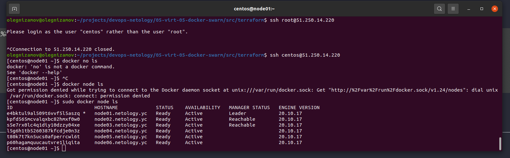
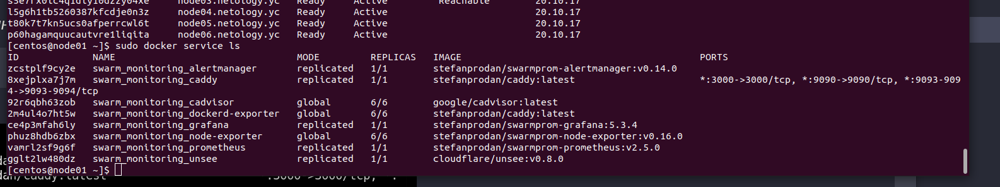
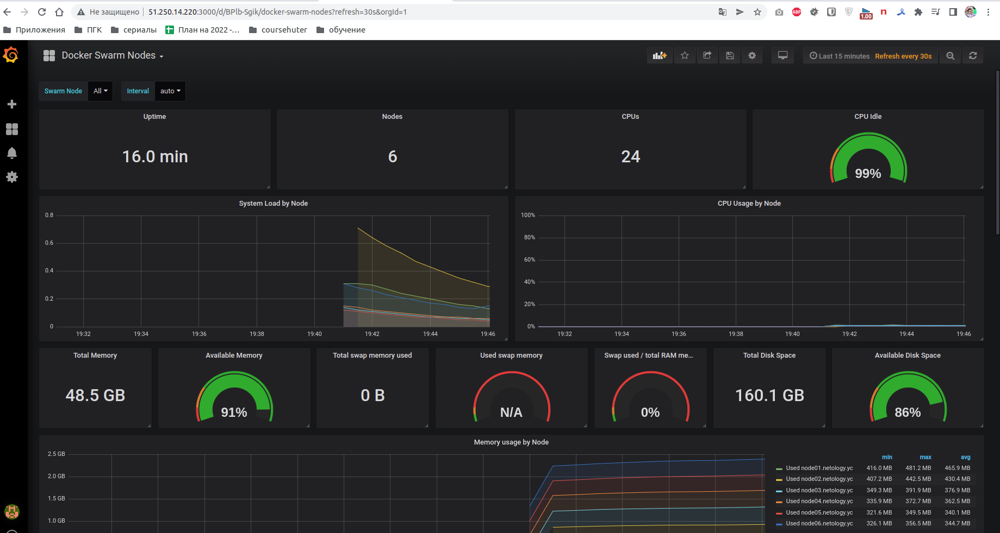

# Домашнее задание к занятию "5.5. Оркестрация кластером Docker контейнеров на примере Docker Swarm"

## Как сдавать задания

Обязательными к выполнению являются задачи без указания звездочки. Их выполнение необходимо для получения зачета и
диплома о профессиональной переподготовке.

Задачи со звездочкой (*) являются дополнительными задачами и/или задачами повышенной сложности. Они не являются
обязательными к выполнению, но помогут вам глубже понять тему.

Домашнее задание выполните в файле readme.md в github репозитории. В личном кабинете отправьте на проверку ссылку на
.md-файл в вашем репозитории.

Любые вопросы по решению задач задавайте в чате учебной группы.

---

## Задача 1

Дайте письменые ответы на следующие вопросы:

- В чём отличие режимов работы сервисов в Docker Swarm кластере: replication и global?

```
> Ответ:
Replicated services - Вы можете указать количество выполненных задач. Например, вы решаете развернуть три копии экземпляров HTTP, каждый из которых предоставляет один и тот же контент. Своими словами - указали количество сервисом, они распаковал в зависимости от настроек и нагрузки.
global services - Запустите одну и ту же задачу на каждом узле. Нет необходимости указывать количество заданий заранее. Каждый раз, когда узел добавляется в рой, координатор создает задачу, а планировщик назначает задачу новому узлу. Распаковали все везде.
```

- Какой алгоритм выбора лидера используется в Docker Swarm кластере?

```
> Ответ:
Алгоритм Raft.

Особенности алгоритма Raft
- Чёткое разделение фаз. Raft предлагает декомпозицию задачи управления кластером на несколько слабо связанных подзадач, основные из которых: выбор лидера (голосование) и репликация протоколов. Каждая из этих задач допускает более детальное разделение. Это упрощает понимание алгоритма и снижает риск ошибок при его реализации.
- Явно выделенный лидер. Raft предполагает, что на кластере всегда существует явно выделенный лидер. Только этот лидер отправляет новые записи на другие узлы кластера. Таким образом, остальные узлы следуют за лидером и не взаимодействуют между собой (за исключением фазы голосования). Если внешний клиент подключается к кластеру через обычный узел, то все его запросы перенаправляются лидеру и только оттуда приходят на узлы.
- Протоколы работы не могут содержать пропусков. То есть записи добавляются строго последовательно. Это накладывает некоторые ограничения, по сравнению с Паксос, но позволяет очень сильно упростить алгоритм. Кроме того, специфика прикладных задач, чаще всего, не позволяет корректно работать с протоколами, содержащими пропуски. То, что Паксос допускает возникновение таких пропусков, зачастую является недостатком Паксос, с которым очень трудно бороться.
- Изменение размера кластера. Raft позволяет легко менять конфигурацию кластера, не останавливая работы: добавлять или удалять узлы.

```

- Что такое Overlay Network?

```
> Ответ: https://ru.wikipedia.org/wiki/%D0%9E%D0%B2%D0%B5%D1%80%D0%BB%D0%B5%D0%B9%D0%BD%D0%B0%D1%8F_%D1%81%D0%B5%D1%82%D1%8C
Распределённая виртуальная сеть между хостами с docker'ом. 
Живёт поверх реальных сетей, подключенных к конкретным докер-нодам. 
Служит для прозрачного и безопасного обмена данными и управляющими командами между 
докер-контейнерами кластера. Маршрутизация данных автоматическая 
(конечному пользователю с ней заморачиваться не нужно).
```

## Задача 2

Создать ваш первый Docker Swarm кластер в Яндекс.Облаке

Для получения зачета, вам необходимо предоставить скриншот из терминала (консоли), с выводом команды:

```
docker node ls
```

```
> Ответ:

```



## Задача 3

Создать ваш первый, готовый к боевой эксплуатации кластер мониторинга, состоящий из стека микросервисов.

Для получения зачета, вам необходимо предоставить скриншот из терминала (консоли), с выводом команды:

```
docker service ls
```





## Задача 4 (*)

Выполнить на лидере Docker Swarm кластера команду (указанную ниже) и дать письменное описание её функционала, что она
делает и зачем она нужна:

```
# см.документацию: https://docs.docker.com/engine/swarm/swarm_manager_locking/
docker swarm update --autolock=true
```

```
> Ответ:
centos@node01 ~]$ sudo docker swarm update --autolock=true
Swarm updated.
To unlock a swarm manager after it restarts, run the `docker swarm unlock`
command and provide the following key:

    SWMKEY-1-vc/ECMhpZO9HNDXmoxBO0eeEsSvNjivAavIjNfVjGJA

Please remember to store this key in a password manager, since without it you
will not be able to restart the manager.
```
*Команда необходима для обновления различных параметров swarm.
С переключателем --autolock происходит блокировка изменения конфигурации роя извне. 
Для разблокировки необходима команда ***docker swarm unlock*** и ключ, выданный при блокировке.*