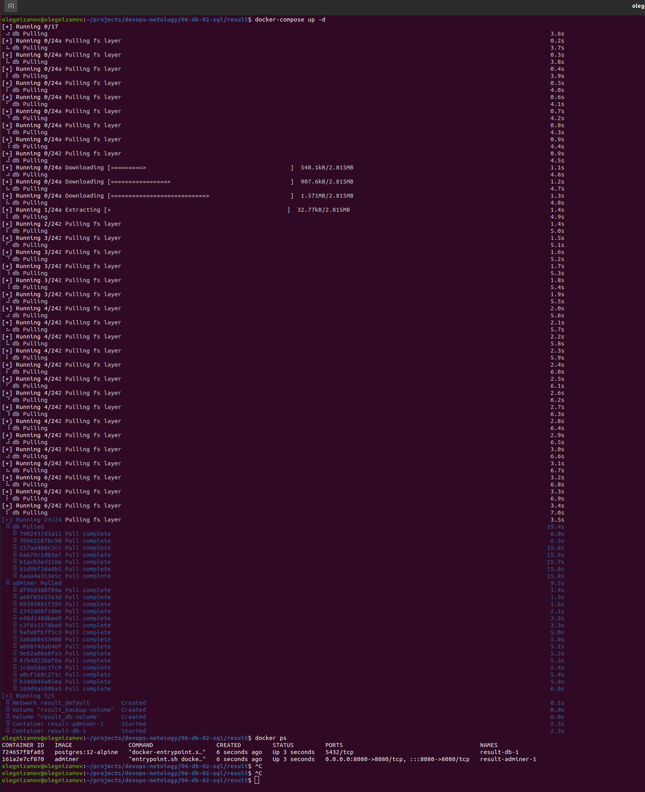
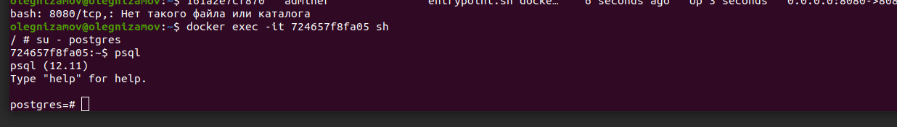
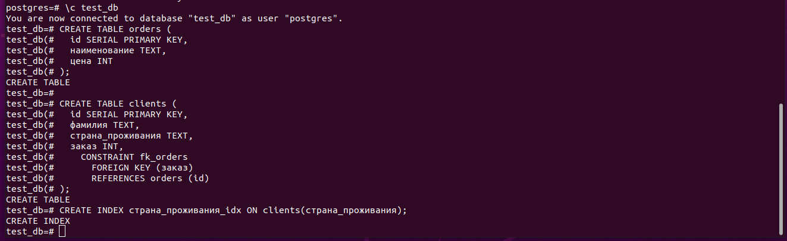
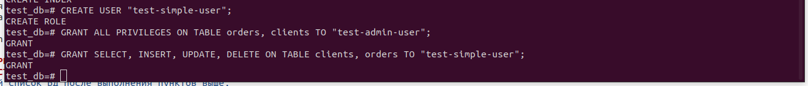
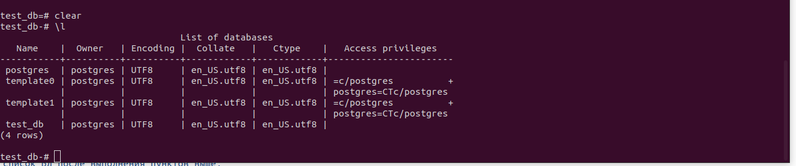
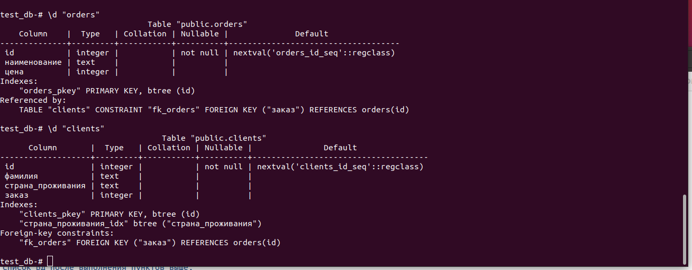
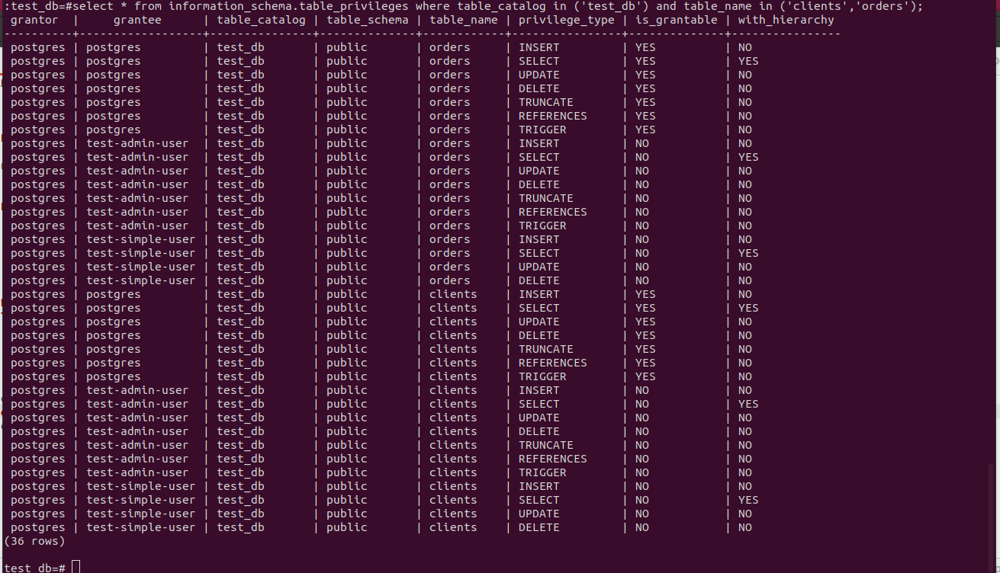
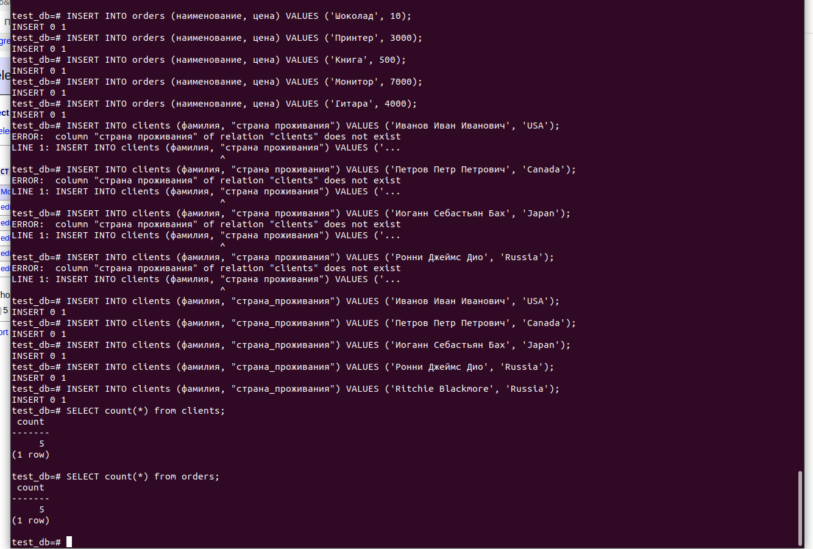
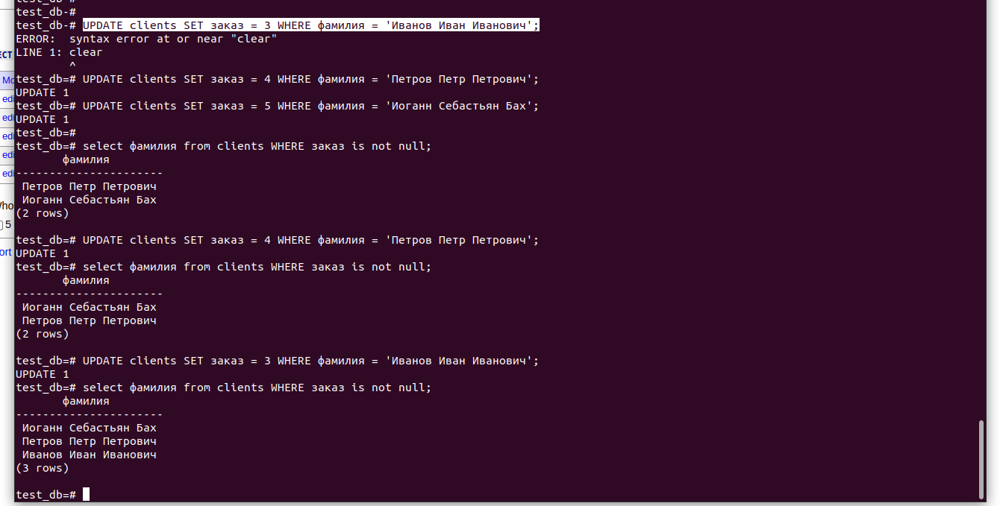
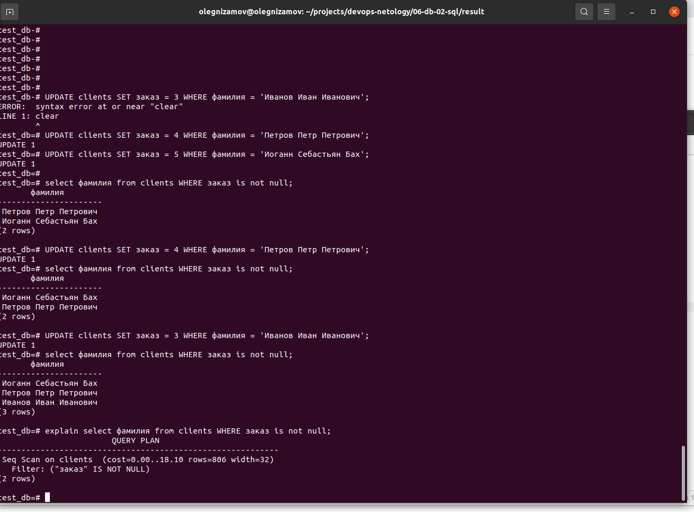

# Домашнее задание к занятию "6.2. SQL"

## Введение

Перед выполнением задания вы можете ознакомиться с
[дополнительными материалами](https://github.com/netology-code/virt-homeworks/tree/master/additional/README.md).

## Задача 1

Используя docker поднимите инстанс PostgreSQL (версию 12) c 2 volume,
в который будут складываться данные БД и бэкапы.

Приведите получившуюся команду или docker-compose манифест.

```
> Ответ: Файл docker-compose.yml

version: "3.1"

services:

  db:
    image: postgres:12-alpine
    restart: always
    environment:
      POSTGRES_PASSWORD: mypassword
    volumes:
      - ./dbvolume:/var/lib/postgresql/data
      - ./backupvolume:/backup

  adminer:
    image: adminer
    restart: always
    ports:
      - 8080:8080


```

Запускаем команду:

```
> Ответ:
olegnizamov@olegnizamov:~/projects/devops-netology/06-db-02-sql/result$ docker-compose up -d

olegnizamov@olegnizamov:~/projects/devops-netology/06-db-02-sql/result$ docker ps
CONTAINER ID   IMAGE                COMMAND                  CREATED         STATUS         PORTS                                       NAMES
724657f8fa05   postgres:12-alpine   "docker-entrypoint.s…"   6 seconds ago   Up 3 seconds   5432/tcp                                    result-db-1
161a2e7cf870   adminer              "entrypoint.sh docke…"   6 seconds ago   Up 3 seconds   0.0.0.0:8080->8080/tcp, :::8080->8080/tcp   result-adminer-1
```




## Задача 2

В БД из задачи 1:

- создайте пользователя test-admin-user и БД test_db
- в БД test_db создайте таблицу orders и clients (спeцификация таблиц ниже)
- предоставьте привилегии на все операции пользователю test-admin-user на таблицы БД test_db
- создайте пользователя test-simple-user
- предоставьте пользователю test-simple-user права на SELECT/INSERT/UPDATE/DELETE данных таблиц БД test_db

Таблица orders:

- id (serial primary key)
- наименование (string)
- цена (integer)

Таблица clients:

- id (serial primary key)
- фамилия (string)
- страна проживания (string, index)
- заказ (foreign key orders)

Приведите:

- итоговый список БД после выполнения пунктов выше,
- описание таблиц (describe)
- SQL-запрос для выдачи списка пользователей с правами над таблицами test_db
- список пользователей с правами над таблицами test_db
- создайте пользователя test-admin-user и БД test_db

```
> Ответ:
postgres=# CREATE database "test_db";
CREATE DATABASE
postgres=# CREATE USER "test-admin-user";
CREATE ROLE
postgres=# \c test_db
postgres=#

```

- в БД test_db создайте таблицу orders и clients (спeцификация таблиц ниже)

```
> Ответ:
CREATE TABLE orders (
  id SERIAL PRIMARY KEY,
  наименование TEXT,
  цена INT
);

CREATE TABLE clients (
  id SERIAL PRIMARY KEY,
  фамилия TEXT,
  страна_проживания TEXT,
  заказ INT,
    CONSTRAINT fk_orders
      FOREIGN KEY (заказ)
      REFERENCES orders (id)
);

CREATE INDEX страна_проживания_idx ON clients(страна_проживания);
```



- создайте пользователя test-simple-user
- предоставьте привилегии на все операции пользователю test-admin-user на таблицы БД test_db
- предоставьте пользователю test-simple-user права на SELECT/INSERT/UPDATE/DELETE данных таблиц БД test_db

```
> Ответ:
test_db=# CREATE USER "test-simple-user";
CREATE ROLE
test_db=# GRANT ALL PRIVILEGES ON TABLE orders, clients TO "test-admin-user";
GRANT
test_db=# GRANT SELECT, INSERT, UPDATE, DELETE ON TABLE clients, orders TO "test-simple-user";
```



- описание таблиц (describe)

```
> Ответ:
test_db=# \l
```



- SQL-запрос для выдачи списка пользователей с правами над таблицами test_db

```
> Ответ:
\d "orders"
\d "clients"
```



- список пользователей с правами над таблицами test_db

```
> Ответ:
select * from information_schema.table_privileges where table_catalog in ('test_db') and table_name in ('clients','orders');
```



## Задача 3

Используя SQL синтаксис - наполните таблицы следующими тестовыми данными:

Таблица orders


| Наименование | цена |
| -------------------------- | ---------- |
| Шоколад           | 10       |
| Принтер           | 3000     |
| Книга               | 500      |
| Монитор           | 7000     |
| Гитара             | 4000     |

```
> Ответ:
INSERT INTO orders (наименование, цена) VALUES ('Шоколад', 10);
INSERT INTO orders (наименование, цена) VALUES ('Принтер', 3000);
INSERT INTO orders (наименование, цена) VALUES ('Книга', 500);
INSERT INTO orders (наименование, цена) VALUES ('Монитор', 7000);
INSERT INTO orders (наименование, цена) VALUES ('Гитара', 4000);
```

Таблица clients


| ФИО                                 | Страна проживания |
| ---------------------------------------- | ----------------------------------- |
| Иванов Иван Иванович | USA                               |
| Петров Петр Петрович | Canada                            |
| Иоганн Себастьян Бах | Japan                             |
| Ронни Джеймс Дио         | Russia                            |
| Ritchie Blackmore                      | Russia                            |

```
> Ответ:
INSERT INTO clients (фамилия, "страна_проживания") VALUES ('Иванов Иван Иванович', 'USA');
INSERT INTO clients (фамилия, "страна_проживания") VALUES ('Петров Петр Петрович', 'Canada');
INSERT INTO clients (фамилия, "страна_проживания") VALUES ('Иоганн Себастьян Бах', 'Japan');
INSERT INTO clients (фамилия, "страна_проживания") VALUES ('Ронни Джеймс Дио', 'Russia');
INSERT INTO clients (фамилия, "страна_проживания") VALUES ('Ritchie Blackmore', 'Russia');
```

Используя SQL синтаксис:

- вычислите количество записей для каждой таблицы
- приведите в ответе:
  - запросы
  - результаты их выполнения.

```
> Ответ:
SELECT count(*) from clients;
SELECT count(*) from orders;
```



## Задача 4

Часть пользователей из таблицы clients решили оформить заказы из таблицы orders.

Используя foreign keys свяжите записи из таблиц, согласно таблице:


| ФИО                                 | Заказ     |
| ---------------------------------------- | ---------------- |
| Иванов Иван Иванович | Книга     |
| Петров Петр Петрович | Монитор |
| Иоганн Себастьян Бах | Гитара   |

Приведите SQL-запросы для выполнения данных операций.

Приведите SQL-запрос для выдачи всех пользователей, которые совершили заказ, а также вывод данного запроса.

Подсказка - используйте директиву `UPDATE`.

```
> Ответ:
UPDATE clients SET заказ = 3 WHERE фамилия = 'Иванов Иван Иванович';
UPDATE clients SET заказ = 4 WHERE фамилия = 'Петров Петр Петрович';
UPDATE clients SET заказ = 5 WHERE фамилия = 'Иоганн Себастьян Бах';

select фамилия from clients WHERE заказ is not null;
```



## Задача 5

Получите полную информацию по выполнению запроса выдачи всех пользователей из задачи 4
(используя директиву EXPLAIN).

Приведите получившийся результат и объясните что значат полученные значения.

```
> Ответ:
test_db=# explain select фамилия from clients WHERE заказ is not null;
                        QUERY PLAN
-----------------------------------------------------------
 Seq Scan on clients  (cost=0.00..18.10 rows=806 width=32)
   Filter: ("заказ" IS NOT NULL)
(2 rows)
test_db=#

Seq Scan on clients - поиск производится в таблице clients
cost=0.00..18.10 - стоимость запроса
rows=806 width=32 - предположительно высота и ширина выводимой таблицы в пикселях
Filter: ("заказ" IS NOT NULL) - фильтр поиска (WHERE)
```



## Задача 6

Создайте бэкап БД test_db и поместите его в volume, предназначенный для бэкапов (см. Задачу 1).

Остановите контейнер с PostgreSQL (но не удаляйте volumes).

Поднимите новый пустой контейнер с PostgreSQL.

Восстановите БД test_db в новом контейнере.

Приведите список операций, который вы применяли для бэкапа данных и восстановления.

```
> Ответ:
pg_dump 	test_db -U postgres > /backup/test_db.dump
postgres=# create database "test_db";
e9081d184e4a:~$ psql -U postgres test_db < /backup/test_db.dump
```


