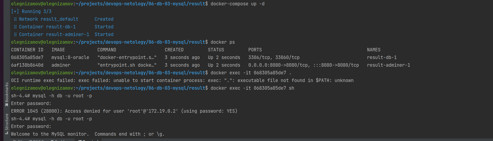
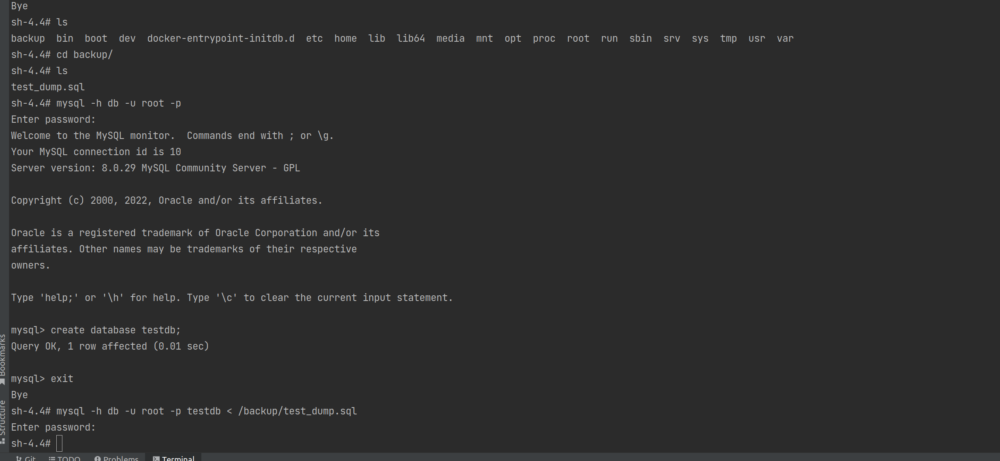
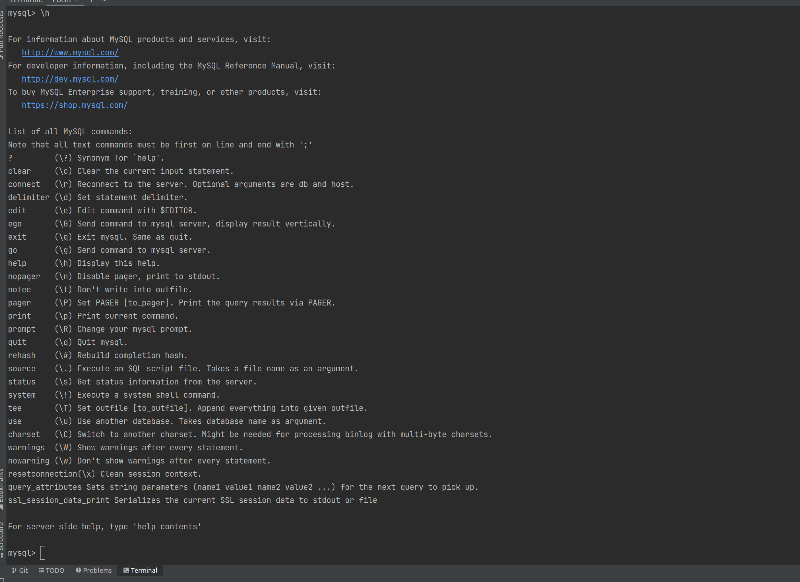
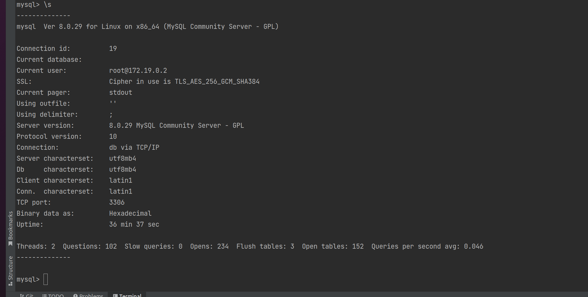
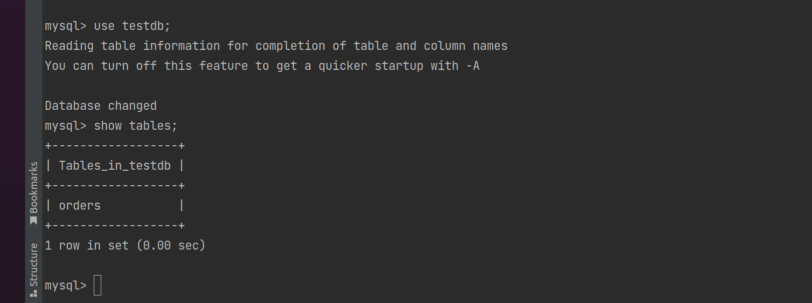
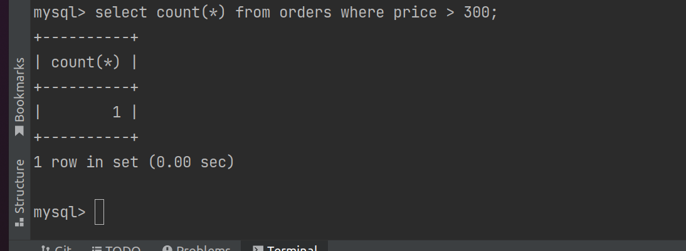
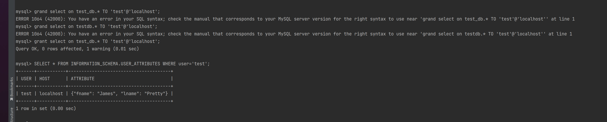
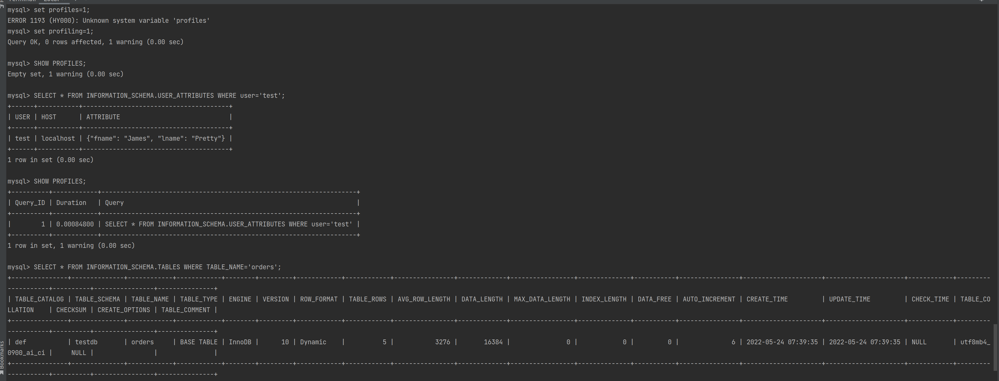

# Домашнее задание к занятию "6.3. MySQL"

## Введение

Перед выполнением задания вы можете ознакомиться с
[дополнительными материалами](https://github.com/netology-code/virt-homeworks/tree/master/additional/README.md).

## Задача 1

Используя docker поднимите инстанс MySQL (версию 8). Данные БД сохраните в volume.

Изучите [бэкап БД](https://github.com/netology-code/virt-homeworks/tree/master/06-db-03-mysql/test_data) и восстановитесь из него.

Перейдите в управляющую консоль `mysql` внутри контейнера.

Используя команду `\h` получите список управляющих команд.

Найдите команду для выдачи статуса БД и **приведите в ответе** из ее вывода версию сервера БД.

Подключитесь к восстановленной БД и получите список таблиц из этой БД.

**Приведите в ответе** количество записей с `price` > 300.

В следующих заданиях мы будем продолжать работу с данным контейнером.

```
> Ответ: Файл docker-compose.yml

version: "3.1"

services:

  db:
    image: mysql:8-oracle
    restart: always
    environment:
      MYSQL_ROOT_PASSWORD: mypassword
    volumes:
      - ./dbvolume:/var/lib/mysql
      - ./backupvolume:/backup

  adminer:
    image: adminer
    restart: always
    ports:
      - 8080:8080

olegnizamov@olegnizamov:~/projects/devops-netology/06-db-03-mysql/result$ docker ps
CONTAINER ID   IMAGE            COMMAND                  CREATED         STATUS         PORTS                                       NAMES
068305a85de7   mysql:8-oracle   "docker-entrypoint.s…"   3 seconds ago   Up 2 seconds   3306/tcp, 33060/tcp                         result-db-1
6af138b8640d   adminer          "entrypoint.sh docke…"   3 seconds ago   Up 2 seconds   0.0.0.0:8080->8080/tcp, :::8080->8080/tcp   result-adminer-1
olegnizamov@olegnizamov:~/projects/devops-netology/06-db-03-mysql/result$ docker exec -it 068305a85de7 .
OCI runtime exec failed: exec failed: unable to start container process: exec: ".": executable file not found in $PATH: unknown
olegnizamov@olegnizamov:~/projects/devops-netology/06-db-03-mysql/result$ docker exec -it 068305a85de7 sh
sh-4.4# mysql -h db -u root -p
Enter password:
ERROR 1045 (28000): Access denied for user 'root'@'172.19.0.2' (using password: YES)
sh-4.4# mysql -h db -u root -p
Enter password:
Welcome to the MySQL monitor.  Commands end with ; or \g.
Your MySQL connection id is 9
Server version: 8.0.29 MySQL Community Server - GPL

Copyright (c) 2000, 2022, Oracle and/or its affiliates.

Oracle is a registered trademark of Oracle Corporation and/or its
affiliates. Other names may be trademarks of their respective
owners.

Type 'help;' or '\h' for help. Type '\c' to clear the current input statement.

sh-4.4# cd backup/
sh-4.4# ls
test_dump.sql
sh-4.4# mysql -h db -u root -p
Enter password:
Welcome to the MySQL monitor.  Commands end with ; or \g.
Your MySQL connection id is 10
Server version: 8.0.29 MySQL Community Server - GPL

Copyright (c) 2000, 2022, Oracle and/or its affiliates.

Oracle is a registered trademark of Oracle Corporation and/or its
affiliates. Other names may be trademarks of their respective
owners.

Type 'help;' or '\h' for help. Type '\c' to clear the current input statement.

mysql> create database testdb;
Query OK, 1 row affected (0.01 sec)

mysql> exit
Bye
sh-4.4# mysql -h db -u root -p testdb < /backup/test_dump.sql
Enter password:
mysql> \h

For information about MySQL products and services, visit:
   http://www.mysql.com/
For developer information, including the MySQL Reference Manual, visit:
   http://dev.mysql.com/
To buy MySQL Enterprise support, training, or other products, visit:
   https://shop.mysql.com/

List of all MySQL commands:
Note that all text commands must be first on line and end with ';'
?         (\?) Synonym for `help'.
clear     (\c) Clear the current input statement.
connect   (\r) Reconnect to the server. Optional arguments are db and host.
delimiter (\d) Set statement delimiter.
edit      (\e) Edit command with $EDITOR.
ego       (\G) Send command to mysql server, display result vertically.
exit      (\q) Exit mysql. Same as quit.
go        (\g) Send command to mysql server.
help      (\h) Display this help.
nopager   (\n) Disable pager, print to stdout.
notee     (\t) Don't write into outfile.
pager     (\P) Set PAGER [to_pager]. Print the query results via PAGER.
print     (\p) Print current command.
prompt    (\R) Change your mysql prompt.
quit      (\q) Quit mysql.
rehash    (\#) Rebuild completion hash.
source    (\.) Execute an SQL script file. Takes a file name as an argument.
status    (\s) Get status information from the server.
system    (\!) Execute a system shell command.
tee       (\T) Set outfile [to_outfile]. Append everything into given outfile.
use       (\u) Use another database. Takes database name as argument.
charset   (\C) Switch to another charset. Might be needed for processing binlog with multi-byte charsets.
warnings  (\W) Show warnings after every statement.
nowarning (\w) Don't show warnings after every statement.
resetconnection(\x) Clean session context.
query_attributes Sets string parameters (name1 value1 name2 value2 ...) for the next query to pick up.
ssl_session_data_print Serializes the current SSL session data to stdout or file

For server side help, type 'help contents'

mysql> \s
--------------
mysql  Ver 8.0.29 for Linux on x86_64 (MySQL Community Server - GPL)

Connection id:          19
Current database:
Current user:           root@172.19.0.2
SSL:                    Cipher in use is TLS_AES_256_GCM_SHA384
Current pager:          stdout
Using outfile:          ''
Using delimiter:        ;
Server version:         8.0.29 MySQL Community Server - GPL
Protocol version:       10
Connection:             db via TCP/IP
Server characterset:    utf8mb4
Db     characterset:    utf8mb4
Client characterset:    latin1
Conn.  characterset:    latin1
TCP port:               3306
Binary data as:         Hexadecimal
Uptime:                 36 min 37 sec

Threads: 2  Questions: 102  Slow queries: 0  Opens: 234  Flush tables: 3  Open tables: 152  Queries per second avg: 0.046
--------------

mysql> use testdb;
Reading table information for completion of table and column names
You can turn off this feature to get a quicker startup with -A

Database changed
mysql> show tables;
+------------------+
| Tables_in_testdb |
+------------------+
| orders           |
+------------------+
1 row in set (0.00 sec)

mysql> select count(*) from orders where price > 300;
+----------+
| count(*) |
+----------+
|        1 |
+----------+
1 row in set (0.00 sec)

mysql>
```








## Задача 2

Создайте пользователя test в БД c паролем test-pass, используя:

- плагин авторизации mysql_native_password
- срок истечения пароля - 180 дней
- количество попыток авторизации - 3
- максимальное количество запросов в час - 100
- аттрибуты пользователя:
  - Фамилия "Pretty"
  - Имя "James"

Предоставьте привелегии пользователю `test` на операции SELECT базы `test_db`.

Используя таблицу INFORMATION_SCHEMA.USER_ATTRIBUTES получите данные по пользователю `test` и
**приведите в ответе к задаче**.

```
> Ответ:

mysql> CREATE USER 'test'@'localhost' IDENTIFIED WITH mysql_native_password BY 'test-pass'
    -> REQUIRE NONE WITH MAX_QUERIES_PER_HOUR 100
    -> PASSWORD EXPIRE INTERVAL 180 DAY
    -> FAILED_LOGIN_ATTEMPTS 3
    -> ATTRIBUTE '{"fname": "James", "lname": "Pretty"}'
    -> ;
Query OK, 0 rows affected (0.01 sec)

mysql> grand select on test_db.* TO 'test'@'localhost';
ERROR 1064 (42000): You have an error in your SQL syntax; check the manual that corresponds to your MySQL server version for the right syntax to use near 'grand select on test_db.* TO 'test'@'localhost'' at line 1
mysql> grand select on testdb.* TO 'test'@'localhost';
ERROR 1064 (42000): You have an error in your SQL syntax; check the manual that corresponds to your MySQL server version for the right syntax to use near 'grand select on testdb.* TO 'test'@'localhost'' at line 1
mysql> grant select on test_db.* TO 'test'@'localhost';
Query OK, 0 rows affected, 1 warning (0.01 sec)

mysql> SELECT * FROM INFORMATION_SCHEMA.USER_ATTRIBUTES WHERE user='test';
+------+-----------+---------------------------------------+
| USER | HOST      | ATTRIBUTE                             |
+------+-----------+---------------------------------------+
| test | localhost | {"fname": "James", "lname": "Pretty"} |
+------+-----------+---------------------------------------+
1 row in set (0.00 sec)


```



## Задача 3

Установите профилирование `SET profiling = 1`.
Изучите вывод профилирования команд `SHOW PROFILES;`.

Исследуйте, какой `engine` используется в таблице БД `test_db` и **приведите в ответе**.

Измените `engine` и **приведите время выполнения и запрос на изменения из профайлера в ответе**:

- на `MyISAM`
- на `InnoDB`

```
> Ответ:
mysql> set profiles=1;
ERROR 1193 (HY000): Unknown system variable 'profiles'
mysql> set profiling=1;
Query OK, 0 rows affected, 1 warning (0.00 sec)

mysql> SHOW PROFILES;
Empty set, 1 warning (0.00 sec)

mysql> SELECT * FROM INFORMATION_SCHEMA.USER_ATTRIBUTES WHERE user='test';
+------+-----------+---------------------------------------+
| USER | HOST      | ATTRIBUTE                             |
+------+-----------+---------------------------------------+
| test | localhost | {"fname": "James", "lname": "Pretty"} |
+------+-----------+---------------------------------------+
1 row in set (0.00 sec)

mysql> SHOW PROFILES;
+----------+------------+--------------------------------------------------------------------+
| Query_ID | Duration   | Query                                                              |
+----------+------------+--------------------------------------------------------------------+
|        1 | 0.00084800 | SELECT * FROM INFORMATION_SCHEMA.USER_ATTRIBUTES WHERE user='test' |
+----------+------------+--------------------------------------------------------------------+
1 row in set, 1 warning (0.00 sec)

mysql> SELECT * FROM INFORMATION_SCHEMA.TABLES WHERE TABLE_NAME='orders';
+---------------+--------------+------------+------------+--------+---------+------------+------------+----------------+-------------+-----------------+--------------+-----------+----------------+---------------------+---------------------+------------+--------------------+----------+----------------+---------------+
| TABLE_CATALOG | TABLE_SCHEMA | TABLE_NAME | TABLE_TYPE | ENGINE | VERSION | ROW_FORMAT | TABLE_ROWS | AVG_ROW_LENGTH | DATA_LENGTH | MAX_DATA_LENGTH | INDEX_LENGTH | DATA_FREE | AUTO_INCREMENT | CREATE_TIME         | UPDATE_TIME         | CHECK_TIME | TABLE_COLLATION    | CHECKSUM | CREATE_OPTIONS | TABLE_COMMENT |
+---------------+--------------+------------+------------+--------+---------+------------+------------+----------------+-------------+-----------------+--------------+-----------+----------------+---------------------+---------------------+------------+--------------------+----------+----------------+---------------+
| def           | testdb       | orders     | BASE TABLE | InnoDB |      10 | Dynamic    |          5 |           3276 |       16384 |               0 |            0 |         0 |              6 | 2022-05-24 07:39:35 | 2022-05-24 07:39:35 | NULL       | utf8mb4_0900_ai_ci |     NULL |                |               |
+---------------+--------------+------------+------------+--------+---------+------------+------------+----------------+-------------+-----------------+--------------+-----------+----------------+---------------------+---------------------+------------+--------------------+----------+----------------+---------------+
1 row in set (0.00 sec)

mysql> SELECT ENGINE,TABLE_NAME FROM INFORMATION_SCHEMA.TABLES WHERE TABLE_NAME='orders';
+--------+------------+
| ENGINE | TABLE_NAME |
+--------+------------+
| InnoDB | orders     |
+--------+------------+
1 row in set (0.01 sec)

mysql> ALTER TABLE orders ENGINE=MyISAM;
Query OK, 5 rows affected (0.04 sec)
Records: 5  Duplicates: 0  Warnings: 0

mysql> SHOW PROFILES;
+----------+------------+-----------------------------------------------------------------------------------+
| Query_ID | Duration   | Query                                                                             |
+----------+------------+-----------------------------------------------------------------------------------+
|        1 | 0.00084800 | SELECT * FROM INFORMATION_SCHEMA.USER_ATTRIBUTES WHERE user='test'                |
|        2 | 0.00223800 | SELECT * FROM INFORMATION_SCHEMA.TABLES WHERE TABLE_NAME='orders'                 |
|        3 | 0.00156400 | SELECT ENGINE,TABLE_NAME FROM INFORMATION_SCHEMA.TABLES WHERE TABLE_NAME='orders' |
|        4 | 0.03501425 | ALTER TABLE orders ENGINE=MyISAM                                                  |
+----------+------------+-----------------------------------------------------------------------------------+
4 rows in set, 1 warning (0.00 sec)

mysql> ALTER TABLE orders ENGINE=InnoDB;
Query OK, 5 rows affected (0.04 sec)
Records: 5  Duplicates: 0  Warnings: 0

mysql> SHOW PROFILES;
+----------+------------+-----------------------------------------------------------------------------------+
| Query_ID | Duration   | Query                                                                             |
+----------+------------+-----------------------------------------------------------------------------------+
|        1 | 0.00084800 | SELECT * FROM INFORMATION_SCHEMA.USER_ATTRIBUTES WHERE user='test'                |
|        2 | 0.00223800 | SELECT * FROM INFORMATION_SCHEMA.TABLES WHERE TABLE_NAME='orders'                 |
|        3 | 0.00156400 | SELECT ENGINE,TABLE_NAME FROM INFORMATION_SCHEMA.TABLES WHERE TABLE_NAME='orders' |
|        4 | 0.03501425 | ALTER TABLE orders ENGINE=MyISAM                                                  |
|        5 | 0.04163000 | ALTER TABLE orders ENGINE=InnoDB                                                  |
+----------+------------+-----------------------------------------------------------------------------------+
5 rows in set, 1 warning (0.00 sec)

mysql>
```




## Задача 4

Изучите файл `my.cnf` в директории /etc/mysql.

Измените его согласно ТЗ (движок InnoDB):

- Скорость IO важнее сохранности данных
- Нужна компрессия таблиц для экономии места на диске
- Размер буффера с незакомиченными транзакциями 1 Мб
- Буфер кеширования 30% от ОЗУ
- Размер файла логов операций 100 Мб

Приведите в ответе измененный файл `my.cnf`.

```
> Ответ:
# For advice on how to change settings please see
# http://dev.mysql.com/doc/refman/8.0/en/server-configuration-defaults.html

[mysqld]
#
# Remove leading # and set to the amount of RAM for the most important data
# cache in MySQL. Start at 70% of total RAM for dedicated server, else 10%.
# innodb_buffer_pool_size = 128M
#
# Remove leading # to turn on a very important data integrity option: logging
# changes to the binary log between backups.
# log_bin
#
# Remove leading # to set options mainly useful for reporting servers.
# The server defaults are faster for transactions and fast SELECTs.
# Adjust sizes as needed, experiment to find the optimal values.
# join_buffer_size = 128M
# sort_buffer_size = 2M
# read_rnd_buffer_size = 2M

# Remove leading # to revert to previous value for default_authentication_plugin,
# this will increase compatibility with older clients. For background, see:
# https://dev.mysql.com/doc/refman/8.0/en/server-system-variables.html#sysvar_default_authentication_plugin
# default-authentication-plugin=mysql_native_password
skip-host-cache
skip-name-resolve
datadir=/var/lib/mysql
socket=/var/run/mysqld/mysqld.sock
secure-file-priv=/var/lib/mysql-files
user=mysql

pid-file=/var/run/mysqld/mysqld.pid
[client]
socket=/var/run/mysqld/mysqld.sock

#Скорость важнее сохранности
innodb_flush_log_at_trx_commit  = 2

#По одному файлу на таблицу (для компрессии)
innodb_file_per_table       = 1

#Размер буффера с незакомиченными транзакциями 1 Мб
innodb_log_buffer_size      = 1M

#Буффер кеширования 30% от ОЗУ
innodb_buffer_pool_size     = 4700M

#Размер файла логов операций 100 Мб
innodb_log_file_size        = 100M


!includedir /etc/mysql/conf.d/
```

---

### Как оформить ДЗ?

Выполненное домашнее задание пришлите ссылкой на .md-файл в вашем репозитории.

---
