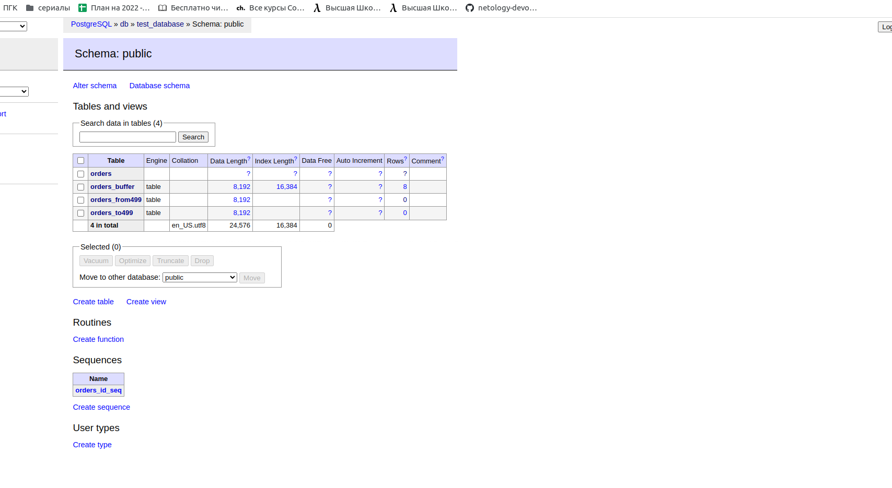

# Домашнее задание к занятию "6.4. PostgreSQL"

## Задача 1

Используя docker поднимите инстанс PostgreSQL (версию 13). Данные БД сохраните в volume.

Подключитесь к БД PostgreSQL используя `psql`.

Воспользуйтесь командой `\?` для вывода подсказки по имеющимся в `psql` управляющим командам.

**Найдите и приведите** управляющие команды для:

- вывода списка БД
- подключения к БД
- вывода списка таблиц
- вывода описания содержимого таблиц
- выхода из psql

```
> Ответ: Файл docker-compose.yml

version: "3.1"

services:

  db:
    image: postgres:13
    restart: always
    environment:
      POSTGRES_PASSWORD: mypassword
    volumes:
      - ./dbvolume:/var/lib/postgresql/data
      - ./backupvolume:/backup

  adminer:
    image: adminer
    restart: always
    ports:
      - 8080:8080

olegnizamov@olegnizamov:~/projects/devops-netology/06-db-04-postgresql/result$ docker ps
CONTAINER ID   IMAGE         COMMAND                  CREATED         STATUS                  PORTS                                       NAMES
fa3586443002   postgres:13   "docker-entrypoint.s…"   4 minutes ago   Up 4 minutes            5432/tcp                                    result-db-1
ec712e362e54   adminer       "entrypoint.sh docke…"   22 hours ago    Up Less than a second   0.0.0.0:8080->8080/tcp, :::8080->8080/tcp   result-adminer-1
olegnizamov@olegnizamov:~/projects/devops-netology/06-db-04-postgresql/result$
olegnizamov@olegnizamov:~/projects/devops-netology/06-db-04-postgresql/result$ docker ps
CONTAINER ID   IMAGE         COMMAND                  CREATED         STATUS                  PORTS                                       NAMES
fa3586443002   postgres:13   "docker-entrypoint.s…"   4 minutes ago   Up 4 minutes            5432/tcp                                    result-db-1
ec712e362e54   adminer       "entrypoint.sh docke…"   22 hours ago    Up Less than a second   0.0.0.0:8080->8080/tcp, :::8080->8080/tcp   result-adminer-1
olegnizamov@olegnizamov:~/projects/devops-netology/06-db-04-postgresql/result$ docker exec -it fa3586443002 sh
# su - postgres
postgres@fa3586443002:~$
postgres@fa3586443002:~$ psql
psql (13.7 (Debian 13.7-1.pgdg110+1))
Type "help" for help.

postgres=# \?
General
  \copyright             show PostgreSQL usage and distribution terms
  \crosstabview [COLUMNS] execute query and display results in crosstab
  \errverbose            show most recent error message at maximum verbosity
  \g [(OPTIONS)] [FILE]  execute query (and send results to file or |pipe);
                         \g with no arguments is equivalent to a semicolon
  \gdesc                 describe result of query, without executing it
  \gexec                 execute query, then execute each value in its result
  \gset [PREFIX]         execute query and store results in psql variables
  \gx [(OPTIONS)] [FILE] as \g, but forces expanded output mode
  \q                     quit psql
  \watch [SEC]           execute query every SEC seconds

Help
  \? [commands]          show help on backslash commands
  \? options             show help on psql command-line options
  \? variables           show help on special variables
  \h [NAME]              help on syntax of SQL commands, * for all commands

Query Buffer
  \e [FILE] [LINE]       edit the query buffer (or file) with external editor
  \ef [FUNCNAME [LINE]]  edit function definition with external editor
  \ev [VIEWNAME [LINE]]  edit view definition with external editor
  \p                     show the contents of the query buffer
  \r                     reset (clear) the query buffer
  \s [FILE]              display history or save it to file
  \w FILE                write query buffer to file

Input/Output
  \copy ...              perform SQL COPY with data stream to the client host
  \echo [-n] [STRING]    write string to standard output (-n for no newline)
  \i FILE                execute commands from file
  \ir FILE               as \i, but relative to location of current script
  \o [FILE]              send all query results to file or |pipe
  \qecho [-n] [STRING]   write string to \o output stream (-n for no newline)
  \warn [-n] [STRING]    write string to standard error (-n for no newline)

Conditional
  \if EXPR               begin conditional block
  \elif EXPR             alternative within current conditional block
  \else                  final alternative within current conditional block
  \endif                 end conditional block

Informational
  (options: S = show system objects, + = additional detail)
  \d[S+]                 list tables, views, and sequences
  \d[S+]  NAME           describe table, view, sequence, or index
  \da[S]  [PATTERN]      list aggregates
  \dA[+]  [PATTERN]      list access methods
  \dAc[+] [AMPTRN [TYPEPTRN]]  list operator classes
  \dAf[+] [AMPTRN [TYPEPTRN]]  list operator families
  \dAo[+] [AMPTRN [OPFPTRN]]   list operators of operator families
  \dAp[+] [AMPTRN [OPFPTRN]]   list support functions of operator families
  \db[+]  [PATTERN]      list tablespaces
  \dc[S+] [PATTERN]      list conversions
  \dC[+]  [PATTERN]      list casts
  \dd[S]  [PATTERN]      show object descriptions not displayed elsewhere
  \dD[S+] [PATTERN]      list domains
  \ddp    [PATTERN]      list default privileges
  \dE[S+] [PATTERN]      list foreign tables
  \det[+] [PATTERN]      list foreign tables
  \des[+] [PATTERN]      list foreign servers
  \deu[+] [PATTERN]      list user mappings
  \dew[+] [PATTERN]      list foreign-data wrappers
  \df[anptw][S+] [PATRN] list [only agg/normal/procedures/trigger/window] functions
  \dF[+]  [PATTERN]      list text search configurations
  \dFd[+] [PATTERN]      list text search dictionaries
  \dFp[+] [PATTERN]      list text search parsers
  \dFt[+] [PATTERN]      list text search templates
  \dg[S+] [PATTERN]      list roles
  \di[S+] [PATTERN]      list indexes
  \dl                    list large objects, same as \lo_list
  \dL[S+] [PATTERN]      list procedural languages
  \dm[S+] [PATTERN]      list materialized views
  \dn[S+] [PATTERN]      list schemas
  \do[S+] [PATTERN]      list operators
  \dO[S+] [PATTERN]      list collations
  \dp     [PATTERN]      list table, view, and sequence access privileges
  \dP[itn+] [PATTERN]    list [only index/table] partitioned relations [n=nested]
  \drds [PATRN1 [PATRN2]] list per-database role settings
  \dRp[+] [PATTERN]      list replication publications
  \dRs[+] [PATTERN]      list replication subscriptions
  \ds[S+] [PATTERN]      list sequences
  \dt[S+] [PATTERN]      list tables
  \dT[S+] [PATTERN]      list data types
  \du[S+] [PATTERN]      list roles
  \dv[S+] [PATTERN]      list views
  \dx[+]  [PATTERN]      list extensions
  \dy[+]  [PATTERN]      list event triggers
  \l[+]   [PATTERN]      list databases
  \sf[+]  FUNCNAME       show a function's definition
  \sv[+]  VIEWNAME       show a view's definition
  \z      [PATTERN]      same as \dp

Formatting
  \a                     toggle between unaligned and aligned output mode
  \C [STRING]            set table title, or unset if none
  \f [STRING]            show or set field separator for unaligned query output
  \H                     toggle HTML output mode (currently off)
  \pset [NAME [VALUE]]   set table output option
                         (border|columns|csv_fieldsep|expanded|fieldsep|
                         fieldsep_zero|footer|format|linestyle|null|
                         numericlocale|pager|pager_min_lines|recordsep|
                         recordsep_zero|tableattr|title|tuples_only|
                         unicode_border_linestyle|unicode_column_linestyle|
                         unicode_header_linestyle)
  \t [on|off]            show only rows (currently off)
  \T [STRING]            set HTML <table> tag attributes, or unset if none
  \x [on|off|auto]       toggle expanded output (currently off)

Connection
  \c[onnect] {[DBNAME|- USER|- HOST|- PORT|-] | conninfo}
                         connect to new database (currently "postgres")
  \conninfo              display information about current connection
  \encoding [ENCODING]   show or set client encoding
  \password [USERNAME]   securely change the password for a user

Operating System
  \cd [DIR]              change the current working directory
  \setenv NAME [VALUE]   set or unset environment variable
  \timing [on|off]       toggle timing of commands (currently off)
  \! [COMMAND]           execute command in shell or start interactive shell

Variables
  \prompt [TEXT] NAME    prompt user to set internal variable
  \set [NAME [VALUE]]    set internal variable, or list all if no parameters
  \unset NAME            unset (delete) internal variable

Large Objects
  \lo_export LOBOID FILE
  \lo_import FILE [COMMENT]
  \lo_list
  \lo_unlink LOBOID      large object operations
postgres=#
postgres=# \l
                                 List of databases
   Name    |  Owner   | Encoding |  Collate   |   Ctype    |   Access privileges
-----------+----------+----------+------------+------------+-----------------------
 postgres  | postgres | UTF8     | en_US.utf8 | en_US.utf8 |
 template0 | postgres | UTF8     | en_US.utf8 | en_US.utf8 | =c/postgres          +
           |          |          |            |            | postgres=CTc/postgres
 template1 | postgres | UTF8     | en_US.utf8 | en_US.utf8 | =c/postgres          +
           |          |          |            |            | postgres=CTc/postgres
(3 rows)

postgres=# \c postgres
You are now connected to database "postgres" as user "postgres".
postgres=# \dtS
                    List of relations
   Schema   |          Name           | Type  |  Owner
------------+-------------------------+-------+----------
 pg_catalog | pg_aggregate            | table | postgres
 pg_catalog | pg_am                   | table | postgres
 pg_catalog | pg_amop                 | table | postgres
 pg_catalog | pg_amproc               | table | postgres
 pg_catalog | pg_attrdef              | table | postgres
 pg_catalog | pg_attribute            | table | postgres
 pg_catalog | pg_auth_members         | table | postgres
 pg_catalog | pg_authid               | table | postgres
 pg_catalog | pg_cast                 | table | postgres
 pg_catalog | pg_class                | table | postgres
 pg_catalog | pg_collation            | table | postgres
 pg_catalog | pg_constraint           | table | postgres
 pg_catalog | pg_conversion           | table | postgres
 pg_catalog | pg_database             | table | postgres
 pg_catalog | pg_db_role_setting      | table | postgres
 pg_catalog | pg_default_acl          | table | postgres
 pg_catalog | pg_depend               | table | postgres
 pg_catalog | pg_description          | table | postgres
 pg_catalog | pg_enum                 | table | postgres
 pg_catalog | pg_event_trigger        | table | postgres
 pg_catalog | pg_extension            | table | postgres
 pg_catalog | pg_foreign_data_wrapper | table | postgres
 pg_catalog | pg_foreign_server       | table | postgres
 pg_catalog | pg_foreign_table        | table | postgres
 pg_catalog | pg_index                | table | postgres
 pg_catalog | pg_inherits             | table | postgres
 pg_catalog | pg_init_privs           | table | postgres
 pg_catalog | pg_language             | table | postgres
 pg_catalog | pg_largeobject          | table | postgres
 pg_catalog | pg_largeobject_metadata | table | postgres
 pg_catalog | pg_namespace            | table | postgres
 pg_catalog | pg_opclass              | table | postgres
 pg_catalog | pg_operator             | table | postgres
 pg_catalog | pg_opfamily             | table | postgres
 pg_catalog | pg_partitioned_table    | table | postgres
 pg_catalog | pg_policy               | table | postgres
 pg_catalog | pg_proc                 | table | postgres
 pg_catalog | pg_publication          | table | postgres
 pg_catalog | pg_publication_rel      | table | postgres
 pg_catalog | pg_range                | table | postgres
 pg_catalog | pg_replication_origin   | table | postgres
 pg_catalog | pg_rewrite              | table | postgres
 pg_catalog | pg_seclabel             | table | postgres
 pg_catalog | pg_sequence             | table | postgres
 pg_catalog | pg_shdepend             | table | postgres
 pg_catalog | pg_shdescription        | table | postgres
 pg_catalog | pg_shseclabel           | table | postgres
 pg_catalog | pg_statistic            | table | postgres
 pg_catalog | pg_statistic_ext        | table | postgres
 pg_catalog | pg_statistic_ext_data   | table | postgres
 pg_catalog | pg_subscription         | table | postgres
 pg_catalog | pg_subscription_rel     | table | postgres
 pg_catalog | pg_tablespace           | table | postgres
 pg_catalog | pg_transform            | table | postgres
 pg_catalog | pg_trigger              | table | postgres
 pg_catalog | pg_ts_config            | table | postgres
 pg_catalog | pg_ts_config_map        | table | postgres
 pg_catalog | pg_ts_dict              | table | postgres
 pg_catalog | pg_ts_parser            | table | postgres
 pg_catalog | pg_ts_template          | table | postgres
 pg_catalog | pg_type                 | table | postgres
 pg_catalog | pg_user_mapping         | table | postgres
(62 rows)

postgres=# \dS+ pg_type
                                       Table "pg_catalog.pg_type"
     Column     |     Type     | Collation | Nullable | Default | Storage  | Stats target | Description
----------------+--------------+-----------+----------+---------+----------+--------------+-------------
 oid            | oid          |           | not null |         | plain    |              |
 typname        | name         |           | not null |         | plain    |              |
 typnamespace   | oid          |           | not null |         | plain    |              |
 typowner       | oid          |           | not null |         | plain    |              |
 typlen         | smallint     |           | not null |         | plain    |              |
 typbyval       | boolean      |           | not null |         | plain    |              |
 typtype        | "char"       |           | not null |         | plain    |              |
 typcategory    | "char"       |           | not null |         | plain    |              |
 typispreferred | boolean      |           | not null |         | plain    |              |
 typisdefined   | boolean      |           | not null |         | plain    |              |
 typdelim       | "char"       |           | not null |         | plain    |              |
 typrelid       | oid          |           | not null |         | plain    |              |
 typelem        | oid          |           | not null |         | plain    |              |
 typarray       | oid          |           | not null |         | plain    |              |
 typinput       | regproc      |           | not null |         | plain    |              |
 typoutput      | regproc      |           | not null |         | plain    |              |
 typreceive     | regproc      |           | not null |         | plain    |              |
 typsend        | regproc      |           | not null |         | plain    |              |
 typmodin       | regproc      |           | not null |         | plain    |              |
 typmodout      | regproc      |           | not null |         | plain    |              |
 typanalyze     | regproc      |           | not null |         | plain    |              |
 typalign       | "char"       |           | not null |         | plain    |              |
 typstorage     | "char"       |           | not null |         | plain    |              |
 typnotnull     | boolean      |           | not null |         | plain    |              |
 typbasetype    | oid          |           | not null |         | plain    |              |
 typtypmod      | integer      |           | not null |         | plain    |              |
 typndims       | integer      |           | not null |         | plain    |              |
 typcollation   | oid          |           | not null |         | plain    |              |
 typdefaultbin  | pg_node_tree | C         |          |         | extended |              |
 typdefault     | text         | C         |          |         | extended |              |
 typacl         | aclitem[]    |           |          |         | extended |              |
Indexes:
    "pg_type_oid_index" UNIQUE, btree (oid)
    "pg_type_typname_nsp_index" UNIQUE, btree (typname, typnamespace)
Access method: heap

postgres=#
postgres=# \q
postgres@fa3586443002:~$

```


## Задача 2

Используя `psql` создайте БД `test_database`.

Изучите [бэкап БД](https://github.com/netology-code/virt-homeworks/tree/master/06-db-04-postgresql/test_data).

Восстановите бэкап БД в `test_database`.

Перейдите в управляющую консоль `psql` внутри контейнера.

Подключитесь к восстановленной БД и проведите операцию ANALYZE для сбора статистики по таблице.

Используя таблицу [pg_stats](https://postgrespro.ru/docs/postgresql/12/view-pg-stats), найдите столбец таблицы `orders`
с наибольшим средним значением размера элементов в байтах.

**Приведите в ответе** команду, которую вы использовали для вычисления и полученный результат.

```
> Ответ:
postgres=# create database "test_database";
CREATE DATABASE
postgres=# exit
postgres@fa3586443002:~$ exit
logout
# psql -U postgres test_database < /backup/test_dump.sql
SET
SET
SET
SET
SET
 set_config
------------

(1 row)

SET
SET
SET
SET
SET
SET
CREATE TABLE
ALTER TABLE
CREATE SEQUENCE
ALTER TABLE
ALTER SEQUENCE
ALTER TABLE
COPY 8
 setval
--------
      8
(1 row)

ALTER TABLE
# su postgres
postgres@fa3586443002:/$ psql
psql (13.7 (Debian 13.7-1.pgdg110+1))
Type "help" for help.

# psql
psql: error: connection to server on socket "/var/run/postgresql/.s.PGSQL.5432" failed: FATAL:  role "root" does not exist
# su -u postgres
Try 'su --help' for more information.
# su postgres
postgres@fa3586443002:/$ psql
psql (13.7 (Debian 13.7-1.pgdg110+1))
Type "help" for help.

postgres=# \c test_database
You are now connected to database "test_database" as user "postgres".
test_database=# \l
                                   List of databases
     Name      |  Owner   | Encoding |  Collate   |   Ctype    |   Access privileges
---------------+----------+----------+------------+------------+-----------------------
 postgres      | postgres | UTF8     | en_US.utf8 | en_US.utf8 |
 template0     | postgres | UTF8     | en_US.utf8 | en_US.utf8 | =c/postgres          +
               |          |          |            |            | postgres=CTc/postgres
 template1     | postgres | UTF8     | en_US.utf8 | en_US.utf8 | =c/postgres          +
               |          |          |            |            | postgres=CTc/postgres
 test_database | postgres | UTF8     | en_US.utf8 | en_US.utf8 |
(4 rows)

test_database=# \dt
         List of relations
 Schema |  Name  | Type  |  Owner
--------+--------+-------+----------
 public | orders | table | postgres
(1 row)

test_database=# ANALLYZE VERBOSE orders;
ERROR:  syntax error at or near "ANALLYZE"
LINE 1: ANALLYZE VERBOSE orders;
        ^
test_database=# ANALYZE VERBOSE orders;
INFO:  analyzing "public.orders"
INFO:  "orders": scanned 1 of 1 pages, containing 8 live rows and 0 dead rows; 8 rows in sample, 8 estimated total rows
ANALYZE
test_database=# \dt
         List of relations
 Schema |  Name  | Type  |  Owner
--------+--------+-------+----------
 public | orders | table | postgres
(1 row)

test_database=# select * from pg_stats where tablename='orders';
 schemaname | tablename | attname | inherited | null_frac | avg_width | n_distinct | most_common_vals | most_common_freqs |                                                                 histogram_bounds
        | correlation | most_common_elems | most_common_elem_freqs | elem_count_histogram
------------+-----------+---------+-----------+-----------+-----------+------------+------------------+-------------------+-------------------------------------------------------------------------------------------------------------------------------------------
--------+-------------+-------------------+------------------------+----------------------
 public     | orders    | id      | f         |         0 |         4 |         -1 |                  |                   | {1,2,3,4,5,6,7,8}
        |           1 |                   |                        |
 public     | orders    | title   | f         |         0 |        16 |         -1 |                  |                   | {"Adventure psql time",Dbiezdmin,"Log gossips","Me and my bash-pet","My little database","Server gravity falls","WAL never lies","War and
peace"} |  -0.3809524 |                   |                        |
 public     | orders    | price   | f         |         0 |         4 |     -0.875 | {300}            | {0.25}            | {100,123,499,500,501,900}
        |   0.5952381 |                   |                        |
(3 rows)

test_database=# select attname,MAX(avg_width) from pg_stats where tablename='orders';
ERROR:  column "pg_stats.attname" must appear in the GROUP BY clause or be used in an aggregate function
LINE 1: select attname,MAX(avg_width) from pg_stats where tablename=...
               ^
test_database=# select attname, MAX(avg_width) from pg_stats where tablename='orders';
ERROR:  column "pg_stats.attname" must appear in the GROUP BY clause or be used in an aggregate function
LINE 1: select attname, MAX(avg_width) from pg_stats where tablename...
               ^
test_database=# select attname from pg_stats where tablename='orders';
 attname
---------
 id
 title
 price
(3 rows)

test_database=# select MAX(avg_width) from pg_stats where tablename='orders';
 max
-----
  16
(1 row)

test_database=# select attname from pg_stats where tablename='orders' and avg_width = (select MAX(avg_width) from pg_stats where tablename='orders');
 attname
---------
 title
(1 row)

test_database=#

```


## Задача 3

Архитектор и администратор БД выяснили, что ваша таблица orders разрослась до невиданных размеров и
поиск по ней занимает долгое время. Вам, как успешному выпускнику курсов DevOps в нетологии предложили
провести разбиение таблицы на 2 (шардировать на orders_1 - price>499 и orders_2 - price<=499).

Предложите SQL-транзакцию для проведения данной операции.

Можно ли было изначально исключить "ручное" разбиение при проектировании таблицы orders?

```
> Ответ:
Пересоздадим таблицу,добавив partition , старую переименую в буферную таблицу.
test_database=# alter table orders rename to orders_buffer;
ALTER TABLE
test_database=# CREATE TABLE orders (id integer NOT NULL, title character varying(80) NOT NULL, price integer DEFAULT 0) partitionn by range(price);
ERROR:  syntax error at or near "partitionn"
LINE 1: ...er varying(80) NOT NULL, price integer DEFAULT 0) partitionn...
                                                             ^
test_database=# CREATE TABLE orders (id integer NOT NULL, title character varying(80) NOT NULL, price integer DEFAULT 0) partition by range(price);
CREATE TABLE
test_database=# CREATE TABLE orders_to499 partition of orders for values from (0) to (499);
CREATE TABLE orders_from499 partition of orders for values from (499) to (999999);
CREATE TABLE
CREATE TABLE
test_database=# insert into orders (id, title, price) select * from orders_buffer;
INSERT 0 8
test_database=#
```




## Задача 4

Используя утилиту `pg_dump` создайте бекап БД `test_database`.

Как бы вы доработали бэкап-файл, чтобы добавить уникальность значения столбца `title` для таблиц `test_database`?

---

```
> Ответ:

# pg_dump -U postgres -d test_database > /backup/test_dump_new.sql


Для уникальности можно поступить 2 вариантами:
1) Добавить UNIQUE

CREATE TABLE public.orders (
    id integer NOT NULL,
    title character varying(80) NOT NULL UNIQUE,
    price integer DEFAULT 0
)

2) Сделать поле title ключом(идентификатором записи)
```

### Как cдавать задание

Выполненное домашнее задание пришлите ссылкой на .md-файл в вашем репозитории.

---
