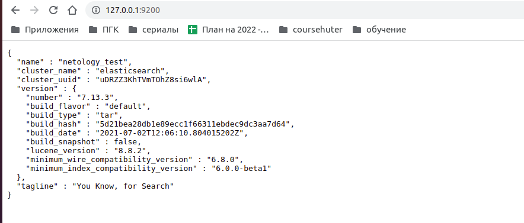

# Домашнее задание к занятию "6.5. Elasticsearch"

## Задача 1

В этом задании вы потренируетесь в:

- установке elasticsearch
- первоначальном конфигурировании elastcisearch
- запуске elasticsearch в docker

Используя докер образ [centos:7](https://hub.docker.com/_/centos) как базовый и
[документацию по установке и запуску Elastcisearch](https://www.elastic.co/guide/en/elasticsearch/reference/current/targz.html):

- составьте Dockerfile-манифест для elasticsearch
- соберите docker-образ и сделайте `push` в ваш docker.io репозиторий
- запустите контейнер из получившегося образа и выполните запрос пути `/` c хост-машины

Требования к `elasticsearch.yml`:

- данные `path` должны сохраняться в `/var/lib`
- имя ноды должно быть `netology_test`

В ответе приведите:

- текст Dockerfile манифеста
[Dockerfile](./result/Dockerfile)
- ссылку на образ в репозитории dockerhub
[dockerhub](https://hub.docker.com/r/olegnizamov/netology-elasticsearch)
- ответ `elasticsearch` на запрос пути `/` в json виде
```
> Ответ: 
{
  "name" : "netology_test",
  "cluster_name" : "elasticsearch",
  "cluster_uuid" : "uDRZZ3KhTVmTOhZ8si6wlA",
  "version" : {
    "number" : "7.13.3",
    "build_flavor" : "default",
    "build_type" : "tar",
    "build_hash" : "5d21bea28db1e89ecc1f66311ebdec9dc3aa7d64",
    "build_date" : "2021-07-02T12:06:10.804015202Z",
    "build_snapshot" : false,
    "lucene_version" : "8.8.2",
    "minimum_wire_compatibility_version" : "6.8.0",
    "minimum_index_compatibility_version" : "6.0.0-beta1"
  },
  "tagline" : "You Know, for Search"
}
```


Подсказки:

- возможно вам понадобится установка пакета perl-Digest-SHA для корректной работы пакета shasum
- при сетевых проблемах внимательно изучите кластерные и сетевые настройки в elasticsearch.yml
- при некоторых проблемах вам поможет docker директива ulimit
- elasticsearch в логах обычно описывает проблему и пути ее решения

Далее мы будем работать с данным экземпляром elasticsearch.

```
> Консоль: 
olegnizamov@olegnizamov:~/projects/devops-netology/06-db-05-elasticsearch/result$ docker build . --no-cache -t elasticsearch
Sending build context to Docker daemon   2.56kB
Step 1/11 : FROM centos:7
7: Pulling from library/centos
2d473b07cdd5: Pull complete 
Digest: sha256:c73f515d06b0fa07bb18d8202035e739a494ce760aa73129f60f4bf2bd22b407
Status: Downloaded newer image for centos:7
 ---> eeb6ee3f44bd
Step 2/11 : RUN yum update -y &&       yum install wget -y &&       yum install perl-Digest-SHA -y &&       yum install java-1.8.0-openjdk.x86_64 -y
 ---> Running in 55514e20d88c
Loaded plugins: fastestmirror, ovl
Determining fastest mirrors
 * base: mirror.corbina.net
 * extras: mirror.corbina.net
 * updates: mirror.corbina.net
Resolving Dependencies
--> Running transaction check
---> Package bash.x86_64 0:4.2.46-34.el7 will be updated
---> Package bash.x86_64 0:4.2.46-35.el7_9 will be an update
---> Package bind-license.noarch 32:9.11.4-26.P2.el7 will be updated
---> Package bind-license.noarch 32:9.11.4-26.P2.el7_9.9 will be an update
---> Package binutils.x86_64 0:2.27-44.base.el7 will be updated
---> Package binutils.x86_64 0:2.27-44.base.el7_9.1 will be an update
---> Package ca-certificates.noarch 0:2020.2.41-70.0.el7_8 will be updated
---> Package ca-certificates.noarch 0:2021.2.50-72.el7_9 will be an update
---> Package centos-release.x86_64 0:7-9.2009.0.el7.centos will be updated
---> Package centos-release.x86_64 0:7-9.2009.1.el7.centos will be an update
---> Package coreutils.x86_64 0:8.22-24.el7 will be updated
---> Package coreutils.x86_64 0:8.22-24.el7_9.2 will be an update
---> Package curl.x86_64 0:7.29.0-59.el7 will be updated
---> Package curl.x86_64 0:7.29.0-59.el7_9.1 will be an update
---> Package cyrus-sasl-lib.x86_64 0:2.1.26-23.el7 will be updated
---> Package cyrus-sasl-lib.x86_64 0:2.1.26-24.el7_9 will be an update
---> Package device-mapper.x86_64 7:1.02.170-6.el7 will be updated
---> Package device-mapper.x86_64 7:1.02.170-6.el7_9.5 will be an update
---> Package device-mapper-libs.x86_64 7:1.02.170-6.el7 will be updated
---> Package device-mapper-libs.x86_64 7:1.02.170-6.el7_9.5 will be an update
---> Package expat.x86_64 0:2.1.0-12.el7 will be updated
---> Package expat.x86_64 0:2.1.0-14.el7_9 will be an update
---> Package glib2.x86_64 0:2.56.1-7.el7 will be updated
---> Package glib2.x86_64 0:2.56.1-9.el7_9 will be an update
---> Package glibc.x86_64 0:2.17-317.el7 will be updated
---> Package glibc.x86_64 0:2.17-326.el7_9 will be an update
---> Package glibc-common.x86_64 0:2.17-317.el7 will be updated
---> Package glibc-common.x86_64 0:2.17-326.el7_9 will be an update
---> Package gzip.x86_64 0:1.5-10.el7 will be updated
---> Package gzip.x86_64 0:1.5-11.el7_9 will be an update
---> Package kpartx.x86_64 0:0.4.9-133.el7 will be updated
---> Package kpartx.x86_64 0:0.4.9-135.el7_9 will be an update
---> Package krb5-libs.x86_64 0:1.15.1-50.el7 will be updated
---> Package krb5-libs.x86_64 0:1.15.1-51.el7_9 will be an update
---> Package libblkid.x86_64 0:2.23.2-65.el7 will be updated
---> Package libblkid.x86_64 0:2.23.2-65.el7_9.1 will be an update
---> Package libcurl.x86_64 0:7.29.0-59.el7 will be updated
---> Package libcurl.x86_64 0:7.29.0-59.el7_9.1 will be an update
---> Package libmount.x86_64 0:2.23.2-65.el7 will be updated
---> Package libmount.x86_64 0:2.23.2-65.el7_9.1 will be an update
---> Package libsmartcols.x86_64 0:2.23.2-65.el7 will be updated
---> Package libsmartcols.x86_64 0:2.23.2-65.el7_9.1 will be an update
---> Package libuuid.x86_64 0:2.23.2-65.el7 will be updated
---> Package libuuid.x86_64 0:2.23.2-65.el7_9.1 will be an update
---> Package libxml2.x86_64 0:2.9.1-6.el7.5 will be updated
---> Package libxml2.x86_64 0:2.9.1-6.el7_9.6 will be an update
---> Package libxml2-python.x86_64 0:2.9.1-6.el7.5 will be updated
---> Package libxml2-python.x86_64 0:2.9.1-6.el7_9.6 will be an update
---> Package nspr.x86_64 0:4.25.0-2.el7_9 will be updated
---> Package nspr.x86_64 0:4.32.0-1.el7_9 will be an update
---> Package nss.x86_64 0:3.53.1-3.el7_9 will be updated
---> Package nss.x86_64 0:3.67.0-4.el7_9 will be an update
---> Package nss-softokn.x86_64 0:3.53.1-6.el7_9 will be updated
---> Package nss-softokn.x86_64 0:3.67.0-3.el7_9 will be an update
---> Package nss-softokn-freebl.x86_64 0:3.53.1-6.el7_9 will be updated
---> Package nss-softokn-freebl.x86_64 0:3.67.0-3.el7_9 will be an update
---> Package nss-sysinit.x86_64 0:3.53.1-3.el7_9 will be updated
---> Package nss-sysinit.x86_64 0:3.67.0-4.el7_9 will be an update
---> Package nss-tools.x86_64 0:3.53.1-3.el7_9 will be updated
---> Package nss-tools.x86_64 0:3.67.0-4.el7_9 will be an update
---> Package nss-util.x86_64 0:3.53.1-1.el7_9 will be updated
---> Package nss-util.x86_64 0:3.67.0-1.el7_9 will be an update
---> Package openldap.x86_64 0:2.4.44-22.el7 will be updated
---> Package openldap.x86_64 0:2.4.44-25.el7_9 will be an update
---> Package openssl-libs.x86_64 1:1.0.2k-19.el7 will be updated
---> Package openssl-libs.x86_64 1:1.0.2k-25.el7_9 will be an update
---> Package python.x86_64 0:2.7.5-89.el7 will be updated
---> Package python.x86_64 0:2.7.5-90.el7 will be an update
---> Package python-libs.x86_64 0:2.7.5-89.el7 will be updated
---> Package python-libs.x86_64 0:2.7.5-90.el7 will be an update
---> Package rpm.x86_64 0:4.11.3-45.el7 will be updated
---> Package rpm.x86_64 0:4.11.3-48.el7_9 will be an update
---> Package rpm-build-libs.x86_64 0:4.11.3-45.el7 will be updated
---> Package rpm-build-libs.x86_64 0:4.11.3-48.el7_9 will be an update
---> Package rpm-libs.x86_64 0:4.11.3-45.el7 will be updated
---> Package rpm-libs.x86_64 0:4.11.3-48.el7_9 will be an update
---> Package rpm-python.x86_64 0:4.11.3-45.el7 will be updated
---> Package rpm-python.x86_64 0:4.11.3-48.el7_9 will be an update
---> Package systemd.x86_64 0:219-78.el7 will be updated
---> Package systemd.x86_64 0:219-78.el7_9.5 will be an update
---> Package systemd-libs.x86_64 0:219-78.el7 will be updated
---> Package systemd-libs.x86_64 0:219-78.el7_9.5 will be an update
---> Package tzdata.noarch 0:2020d-2.el7 will be updated
---> Package tzdata.noarch 0:2022a-1.el7 will be an update
---> Package util-linux.x86_64 0:2.23.2-65.el7 will be updated
---> Package util-linux.x86_64 0:2.23.2-65.el7_9.1 will be an update
---> Package vim-minimal.x86_64 2:7.4.629-7.el7 will be updated
---> Package vim-minimal.x86_64 2:7.4.629-8.el7_9 will be an update
---> Package xz.x86_64 0:5.2.2-1.el7 will be updated
---> Package xz.x86_64 0:5.2.2-2.el7_9 will be an update
---> Package xz-libs.x86_64 0:5.2.2-1.el7 will be updated
---> Package xz-libs.x86_64 0:5.2.2-2.el7_9 will be an update
---> Package zlib.x86_64 0:1.2.7-18.el7 will be updated
---> Package zlib.x86_64 0:1.2.7-20.el7_9 will be an update
--> Finished Dependency Resolution

Dependencies Resolved

================================================================================
 Package               Arch      Version                       Repository  Size
================================================================================
Updating:
 bash                  x86_64    4.2.46-35.el7_9               updates    1.0 M
 bind-license          noarch    32:9.11.4-26.P2.el7_9.9       updates     91 k
 binutils              x86_64    2.27-44.base.el7_9.1          updates    5.9 M
 ca-certificates       noarch    2021.2.50-72.el7_9            updates    379 k
 centos-release        x86_64    7-9.2009.1.el7.centos         updates     27 k
 coreutils             x86_64    8.22-24.el7_9.2               updates    3.3 M
 curl                  x86_64    7.29.0-59.el7_9.1             updates    271 k
 cyrus-sasl-lib        x86_64    2.1.26-24.el7_9               updates    156 k
 device-mapper         x86_64    7:1.02.170-6.el7_9.5          updates    297 k
 device-mapper-libs    x86_64    7:1.02.170-6.el7_9.5          updates    325 k
 expat                 x86_64    2.1.0-14.el7_9                updates     83 k
 glib2                 x86_64    2.56.1-9.el7_9                updates    2.5 M
 glibc                 x86_64    2.17-326.el7_9                updates    3.6 M
 glibc-common          x86_64    2.17-326.el7_9                updates     12 M
 gzip                  x86_64    1.5-11.el7_9                  updates    130 k
 kpartx                x86_64    0.4.9-135.el7_9               updates     81 k
 krb5-libs             x86_64    1.15.1-51.el7_9               updates    809 k
 libblkid              x86_64    2.23.2-65.el7_9.1             updates    183 k
 libcurl               x86_64    7.29.0-59.el7_9.1             updates    223 k
 libmount              x86_64    2.23.2-65.el7_9.1             updates    185 k
 libsmartcols          x86_64    2.23.2-65.el7_9.1             updates    143 k
 libuuid               x86_64    2.23.2-65.el7_9.1             updates     84 k
 libxml2               x86_64    2.9.1-6.el7_9.6               updates    668 k
 libxml2-python        x86_64    2.9.1-6.el7_9.6               updates    247 k
 nspr                  x86_64    4.32.0-1.el7_9                updates    127 k
 nss                   x86_64    3.67.0-4.el7_9                updates    882 k
 nss-softokn           x86_64    3.67.0-3.el7_9                updates    358 k
 nss-softokn-freebl    x86_64    3.67.0-3.el7_9                updates    337 k
 nss-sysinit           x86_64    3.67.0-4.el7_9                updates     66 k
 nss-tools             x86_64    3.67.0-4.el7_9                updates    549 k
 nss-util              x86_64    3.67.0-1.el7_9                updates     79 k
 openldap              x86_64    2.4.44-25.el7_9               updates    356 k
 openssl-libs          x86_64    1:1.0.2k-25.el7_9             updates    1.2 M
 python                x86_64    2.7.5-90.el7                  updates     96 k
 python-libs           x86_64    2.7.5-90.el7                  updates    5.6 M
 rpm                   x86_64    4.11.3-48.el7_9               updates    1.2 M
 rpm-build-libs        x86_64    4.11.3-48.el7_9               updates    108 k
 rpm-libs              x86_64    4.11.3-48.el7_9               updates    279 k
 rpm-python            x86_64    4.11.3-48.el7_9               updates     84 k
 systemd               x86_64    219-78.el7_9.5                updates    5.1 M
 systemd-libs          x86_64    219-78.el7_9.5                updates    419 k
 tzdata                noarch    2022a-1.el7                   updates    501 k
 util-linux            x86_64    2.23.2-65.el7_9.1             updates    2.0 M
 vim-minimal           x86_64    2:7.4.629-8.el7_9             updates    443 k
 xz                    x86_64    5.2.2-2.el7_9                 updates    229 k
 xz-libs               x86_64    5.2.2-2.el7_9                 updates    103 k
 zlib                  x86_64    1.2.7-20.el7_9                updates     90 k

Transaction Summary
================================================================================
Upgrade  47 Packages

Total download size: 52 M
Downloading packages:
Delta RPMs disabled because /usr/bin/applydeltarpm not installed.
warning: /var/cache/yum/x86_64/7/updates/packages/bind-license-9.11.4-26.P2.el7_9.9.noarch.rpm: Header V3 RSA/SHA256 Signature, key ID f4a80eb5: NOKEY
Public key for bind-license-9.11.4-26.P2.el7_9.9.noarch.rpm is not installed
--------------------------------------------------------------------------------
Total                                               10 MB/s |  52 MB  00:05     
Retrieving key from file:///etc/pki/rpm-gpg/RPM-GPG-KEY-CentOS-7
Importing GPG key 0xF4A80EB5:
 Userid     : "CentOS-7 Key (CentOS 7 Official Signing Key) <security@centos.org>"
 Fingerprint: 6341 ab27 53d7 8a78 a7c2 7bb1 24c6 a8a7 f4a8 0eb5
 Package    : centos-release-7-9.2009.0.el7.centos.x86_64 (@CentOS)
 From       : /etc/pki/rpm-gpg/RPM-GPG-KEY-CentOS-7
Running transaction check
Running transaction test
Transaction test succeeded
Running transaction
  Updating   : tzdata-2022a-1.el7.noarch                                   1/94 
  Updating   : bash-4.2.46-35.el7_9.x86_64                                 2/94 
  Updating   : nss-softokn-freebl-3.67.0-3.el7_9.x86_64                    3/94 
  Updating   : glibc-common-2.17-326.el7_9.x86_64                          4/94 
  Updating   : glibc-2.17-326.el7_9.x86_64                                 5/94 
  Updating   : nspr-4.32.0-1.el7_9.x86_64                                  6/94 
  Updating   : nss-util-3.67.0-1.el7_9.x86_64                              7/94 
  Updating   : zlib-1.2.7-20.el7_9.x86_64                                  8/94 
  Updating   : xz-libs-5.2.2-2.el7_9.x86_64                                9/94 
  Updating   : systemd-libs-219-78.el7_9.5.x86_64                         10/94 
  Updating   : libuuid-2.23.2-65.el7_9.1.x86_64                           11/94 
  Updating   : nss-softokn-3.67.0-3.el7_9.x86_64                          12/94 
  Updating   : libxml2-2.9.1-6.el7_9.6.x86_64                             13/94 
  Updating   : libsmartcols-2.23.2-65.el7_9.1.x86_64                      14/94 
  Updating   : expat-2.1.0-14.el7_9.x86_64                                15/94 
  Updating   : ca-certificates-2021.2.50-72.el7_9.noarch                  16/94 
  Updating   : coreutils-8.22-24.el7_9.2.x86_64                           17/94 
  Updating   : 1:openssl-libs-1.0.2k-25.el7_9.x86_64                      18/94 
  Updating   : krb5-libs-1.15.1-51.el7_9.x86_64                           19/94 
  Updating   : python-libs-2.7.5-90.el7.x86_64                            20/94 
  Updating   : libblkid-2.23.2-65.el7_9.1.x86_64                          21/94 
  Updating   : libmount-2.23.2-65.el7_9.1.x86_64                          22/94 
  Updating   : python-2.7.5-90.el7.x86_64                                 23/94 
  Updating   : util-linux-2.23.2-65.el7_9.1.x86_64                        24/94 
  Updating   : cyrus-sasl-lib-2.1.26-24.el7_9.x86_64                      25/94 
  Updating   : nss-3.67.0-4.el7_9.x86_64                                  26/94 
  Updating   : nss-sysinit-3.67.0-4.el7_9.x86_64                          27/94 
  Updating   : nss-tools-3.67.0-4.el7_9.x86_64                            28/94 
  Updating   : libcurl-7.29.0-59.el7_9.1.x86_64                           29/94 
  Updating   : curl-7.29.0-59.el7_9.1.x86_64                              30/94 
  Updating   : rpm-libs-4.11.3-48.el7_9.x86_64                            31/94 
  Updating   : rpm-4.11.3-48.el7_9.x86_64                                 32/94 
  Updating   : openldap-2.4.44-25.el7_9.x86_64                            33/94 
  Updating   : rpm-build-libs-4.11.3-48.el7_9.x86_64                      34/94 
  Updating   : centos-release-7-9.2009.1.el7.centos.x86_64                35/94 
  Updating   : systemd-219-78.el7_9.5.x86_64                              36/94 
Failed to get D-Bus connection: Operation not permitted
  Updating   : 7:device-mapper-libs-1.02.170-6.el7_9.5.x86_64             37/94 
  Updating   : 7:device-mapper-1.02.170-6.el7_9.5.x86_64                  38/94 
  Updating   : kpartx-0.4.9-135.el7_9.x86_64                              39/94 
  Updating   : rpm-python-4.11.3-48.el7_9.x86_64                          40/94 
  Updating   : libxml2-python-2.9.1-6.el7_9.6.x86_64                      41/94 
  Updating   : glib2-2.56.1-9.el7_9.x86_64                                42/94 
  Updating   : binutils-2.27-44.base.el7_9.1.x86_64                       43/94 
install-info: No such file or directory for /usr/share/info/as.info.gz
install-info: No such file or directory for /usr/share/info/binutils.info.gz
install-info: No such file or directory for /usr/share/info/gprof.info.gz
install-info: No such file or directory for /usr/share/info/ld.info.gz
install-info: No such file or directory for /usr/share/info/standards.info.gz
  Updating   : gzip-1.5-11.el7_9.x86_64                                   44/94 
  Updating   : xz-5.2.2-2.el7_9.x86_64                                    45/94 
  Updating   : 2:vim-minimal-7.4.629-8.el7_9.x86_64                       46/94 
  Updating   : 32:bind-license-9.11.4-26.P2.el7_9.9.noarch                47/94 
  Cleanup    : rpm-python-4.11.3-45.el7.x86_64                            48/94 
  Cleanup    : libxml2-python-2.9.1-6.el7.5.x86_64                        49/94 
  Cleanup    : rpm-build-libs-4.11.3-45.el7.x86_64                        50/94 
  Cleanup    : glib2-2.56.1-7.el7.x86_64                                  51/94 
  Cleanup    : python-2.7.5-89.el7.x86_64                                 52/94 
  Cleanup    : python-libs-2.7.5-89.el7.x86_64                            53/94 
  Cleanup    : libxml2-2.9.1-6.el7.5.x86_64                               54/94 
  Cleanup    : xz-5.2.2-1.el7.x86_64                                      55/94 
  Cleanup    : binutils-2.27-44.base.el7.x86_64                           56/94 
  Cleanup    : gzip-1.5-10.el7.x86_64                                     57/94 
  Cleanup    : kpartx-0.4.9-133.el7.x86_64                                58/94 
  Cleanup    : 7:device-mapper-libs-1.02.170-6.el7.x86_64                 59/94 
  Cleanup    : 7:device-mapper-1.02.170-6.el7.x86_64                      60/94 
  Cleanup    : systemd-219-78.el7.x86_64                                  61/94 
  Cleanup    : util-linux-2.23.2-65.el7.x86_64                            62/94 
  Cleanup    : curl-7.29.0-59.el7.x86_64                                  63/94 
  Cleanup    : libcurl-7.29.0-59.el7.x86_64                               64/94 
  Cleanup    : openldap-2.4.44-22.el7.x86_64                              65/94 
  Cleanup    : rpm-libs-4.11.3-45.el7.x86_64                              66/94 
  Cleanup    : rpm-4.11.3-45.el7.x86_64                                   67/94 
  Cleanup    : nss-tools-3.53.1-3.el7_9.x86_64                            68/94 
  Cleanup    : nss-sysinit-3.53.1-3.el7_9.x86_64                          69/94 
  Cleanup    : nss-3.53.1-3.el7_9.x86_64                                  70/94 
  Cleanup    : nss-softokn-3.53.1-6.el7_9.x86_64         9                 71/94 
  Cleanup    : libmount-2.23.2-65.el7.x86_64                              72/94 
  Cleanup    : libblkid-2.23.2-65.el7.x86_64                              73/94 
  Cleanup    : cyrus-sasl-lib-2.1.26-23.el7.x86_64                        74/94 
  Cleanup    : krb5-libs-1.15.1-50.el7.x86_64                             75/94 
  Cleanup    : coreutils-8.22-24.el7.x86_64                               76/94 
  Cleanup    : 1:openssl-libs-1.0.2k-19.el7.x86_64                        77/94 
  Cleanup    : systemd-libs-219-78.el7.x86_64                             78/94 
  Cleanup    : ca-certificates-2020.2.41-70.0.el7_8.noarch                79/94 
  Cleanup    : xz-libs-5.2.2-1.el7.x86_64                                 80/94 
  Cleanup    : zlib-1.2.7-18.el7.x86_64                                   81/94 
  Cleanup    : libuuid-2.23.2-65.el7.x86_64                               82/94 
  Cleanup    : libsmartcols-2.23.2-65.el7.x86_64                          83/94 
  Cleanup    : expat-2.1.0-12.el7.x86_64                                  84/94 
  Cleanup    : 2:vim-minimal-7.4.629-7.el7.x86_64                         85/94 
  Cleanup    : centos-release-7-9.2009.0.el7.centos.x86_64                86/94 
  Cleanup    : 32:bind-license-9.11.4-26.P2.el7.noarch                    87/94 
  Cleanup    : glibc-common-2.17-317.el7.x86_64                           88/94 
  Cleanup    : bash-4.2.46-34.el7.x86_64                                  89/94 
  Cleanup    : nspr-4.25.0-2.el7_9.x86_64                                 90/94 
  Cleanup    : nss-util-3.53.1-1.el7_9.x86_64                             91/94 
  Cleanup    : nss-softokn-freebl-3.53.1-6.el7_9.x86_64                   92/94 
  Cleanup    : glibc-2.17-317.el7.x86_64                                  93/94 
  Cleanup    : tzdata-2020d-2.el7.noarch                                  94/94 
  Verifying  : libblkid-2.23.2-65.el7_9.1.x86_64                           1/94 
  Verifying  : krb5-libs-1.15.1-51.el7_9.x86_64                            2/94 
  Verifying  : centos-release-7-9.2009.1.el7.centos.x86_64                 3/94 
  Verifying  : libsmartcols-2.23.2-65.el7_9.1.x86_64                       4/94 
  Verifying  : nss-3.67.0-4.el7_9.x86_64                                   5/94 
  Verifying  : libcurl-7.29.0-59.el7_9.1.x86_64                            6/94 
  Verifying  : tzdata-2022a-1.el7.noarch                                   7/94 
  Verifying  : python-2.7.5-90.el7.x86_64                                  8/94 
  Verifying  : openldap-2.4.44-25.el7_9.x86_64                             9/94 
  Verifying  : python-libs-2.7.5-90.el7.x86_64                            10/94 
  Verifying  : libxml2-python-2.9.1-6.el7_9.6.x86_64                      11/94 
  Verifying  : nss-util-3.67.0-1.el7_9.x86_64                             12/94 
  Verifying  : 7:device-mapper-1.02.170-6.el7_9.5.x86_64                  13/94 
  Verifying  : libxml2-2.9.1-6.el7_9.6.x86_64                             14/94 
  Verifying  : glibc-2.17-326.el7_9.x86_64                                15/94 
  Verifying  : kpartx-0.4.9-135.el7_9.x86_64                              16/94 
  Verifying  : libmount-2.23.2-65.el7_9.1.x86_64                          17/94 
  Verifying  : nss-softokn-freebl-3.67.0-3.el7_9.x86_64                   18/94 
  Verifying  : util-linux-2.23.2-65.el7_9.1.x86_64                        19/94 
  Verifying  : binutils-2.27-44.base.el7_9.1.x86_64                       20/94 
  Verifying  : bash-4.2.46-35.el7_9.x86_64                                21/94 
  Verifying  : curl-7.29.0-59.el7_9.1.x86_64                              22/94 
  Verifying  : 2:vim-minimal-7.4.629-8.el7_9.x86_64                       23/94 
  Verifying  : nss-softokn-3.67.0-3.el7_9.x86_64                          24/94 
  Verifying  : 32:bind-license-9.11.4-26.P2.el7_9.9.noarch                25/94 
  Verifying  : cyrus-sasl-lib-2.1.26-24.el7_9.x86_64                      26/94 
  Verifying  : expat-2.1.0-14.el7_9.x86_64                                27/94 
  Verifying  : 7:device-mapper-libs-1.02.170-6.el7_9.5.x86_64             28/94 
  Verifying  : ca-certificates-2021.2.50-72.el7_9.noarch                  29/94 
  Verifying  : coreutils-8.22-24.el7_9.2.x86_64                           30/94 
  Verifying  : rpm-libs-4.11.3-48.el7_9.x86_64                            31/94 
  Verifying  : nss-tools-3.67.0-4.el7_9.x86_64                            32/94 
  Verifying  : libuuid-2.23.2-65.el7_9.1.x86_64                           33/94 
  Verifying  : xz-libs-5.2.2-2.el7_9.x86_64                               34/94 
  Verifying  : zlib-1.2.7-20.el7_9.x86_64                                 35/94 
  Verifying  : rpm-4.11.3-48.el7_9.x86_64                                 36/94 
  Verifying  : glib2-2.56.1-9.el7_9.x86_64                                37/94 
  Verifying  : 1:openssl-libs-1.0.2k-25.el7_9.x86_64                      38/94 
  Verifying  : gzip-1.5-11.el7_9.x86_64                                   39/94 
  Verifying  : glibc-common-2.17-326.el7_9.x86_64                         40/94 
  Verifying  : nspr-4.32.0-1.el7_9.x86_64                                 41/94 
  Verifying  : rpm-python-4.11.3-48.el7_9.x86_64                          42/94 
  Verifying  : nss-sysinit-3.67.0-4.el7_9.x86_64                          43/94 
  Verifying  : systemd-libs-219-78.el7_9.5.x86_64                         44/94 
  Verifying  : xz-5.2.2-2.el7_9.x86_64                                    45/94 
  Verifying  : systemd-219-78.el7_9.5.x86_64                              46/94 
  Verifying  : rpm-build-libs-4.11.3-48.el7_9.x86_64                      47/94 
  Verifying  : rpm-4.11.3-45.el7.x86_64                                   48/94 
  Verifying  : nss-tools-3.53.1-3.el7_9.x86_64                            49/94 
  Verifying  : glibc-common-2.17-317.el7.x86_64                           50/94 
  Verifying  : ca-certificates-2020.2.41-70.0.el7_8.noarch                51/94 
  Verifying  : nss-softokn-3.53.1-6.el7_9.x86_64                          52/94 
  Verifying  : nss-util-3.53.1-1.el7_9.x86_64                             53/94 
  Verifying  : glib2-2.56.1-7.el7.x86_64                                  54/94 
  Verifying  : nspr-4.25.0-2.el7_9.x86_64                                 55/94 
  Verifying  : systemd-219-78.el7.x86_64                                  56/94 
  Verifying  : 7:device-mapper-1.02.170-6.el7.x86_64                      57/94 
  Verifying  : libblkid-2.23.2-65.el7.x86_64                              58/94 
  Verifying  : rpm-libs-4.11.3-45.el7.x86_64                              59/94 
  Verifying  : 1:openssl-libs-1.0.2k-19.el7.x86_64                        60/94 
  Verifying  : libxml2-python-2.9.1-6.el7.5.x86_64                        61/94 
  Verifying  : tzdata-2020d-2.el7.noarch                                  62/94 
  Verifying  : libuuid-2.23.2-65.el7.x86_64                               63/94 
  Verifying  : 2:vim-minimal-7.4.629-7.el7.x86_64                         64/94 
  Verifying  : coreutils-8.22-24.el7.x86_64                               65/94 
  Verifying  : nss-sysinit-3.53.1-3.el7_9.x86_64                          66/94 
  Verifying  : nss-softokn-freebl-3.53.1-6.el7_9.x86_64                   67/94 
  Verifying  : rpm-python-4.11.3-45.el7.x86_64                            68/94 
  Verifying  : libcurl-7.29.0-59.el7.x86_64                               69/94 
  Verifying  : curl-7.29.0-59.el7.x86_64                                  70/94 
  Verifying  : bash-4.2.46-34.el7.x86_64                                  71/94 
  Verifying  : rpm-build-libs-4.11.3-45.el7.x86_64                        72/94 
  Verifying  : gzip-1.5-10.el7.x86_64                                     73/94 
  Verifying  : binutils-2.27-44.base.el7.x86_64                           74/94 
  Verifying  : nss-3.53.1-3.el7_9.x86_64                                  75/94 
  Verifying  : zlib-1.2.7-18.el7.x86_64                                   76/94 
  Verifying  : libxml2-2.9.1-6.el7.5.x86_64                               77/94 
  Verifying  : centos-release-7-9.2009.0.el7.centos.x86_64                78/94 
  Verifying  : systemd-libs-219-78.el7.x86_64                             79/94 
  Verifying  : openldap-2.4.44-22.el7.x86_64                              80/94 
  Verifying  : 7:device-mapper-libs-1.02.170-6.el7.x86_64                 81/94 
  Verifying  : util-linux-2.23.2-65.el7.x86_64                            82/94 
  Verifying  : xz-libs-5.2.2-1.el7.x86_64                                 83/94 
  Verifying  : python-2.7.5-89.el7.x86_64                                 84/94 
  Verifying  : expat-2.1.0-12.el7.x86_64                                  85/94 
  Verifying  : glibc-2.17-317.el7.x86_64                                  86/94 
  Verifying  : krb5-libs-1.15.1-50.el7.x86_64                             87/94 
  Verifying  : kpartx-0.4.9-133.el7.x86_64                                88/94 
  Verifying  : 32:bind-license-9.11.4-26.P2.el7.noarch                    89/94 
  Verifying  : python-libs-2.7.5-89.el7.x86_64                            90/94 
  Verifying  : xz-5.2.2-1.el7.x86_64                                      91/94 
  Verifying  : libsmartcols-2.23.2-65.el7.x86_64                          92/94 
  Verifying  : cyrus-sasl-lib-2.1.26-23.el7.x86_64                        93/94 
  Verifying  : libmount-2.23.2-65.el7.x86_64                              94/94 

Updated:
  bash.x86_64 0:4.2.46-35.el7_9                                                 
  bind-license.noarch 32:9.11.4-26.P2.el7_9.9                                   
  binutils.x86_64 0:2.27-44.base.el7_9.1                                        
  ca-certificates.noarch 0:2021.2.50-72.el7_9                                   
  centos-release.x86_64 0:7-9.2009.1.el7.centos                                 
  coreutils.x86_64 0:8.22-24.el7_9.2                                            
  curl.x86_64 0:7.29.0-59.el7_9.1                                               
  cyrus-sasl-lib.x86_64 0:2.1.26-24.el7_9                                       
  device-mapper.x86_64 7:1.02.170-6.el7_9.5                                     
  device-mapper-libs.x86_64 7:1.02.170-6.el7_9.5                                
  expat.x86_64 0:2.1.0-14.el7_9                                                 
  glib2.x86_64 0:2.56.1-9.el7_9                                                 
  glibc.x86_64 0:2.17-326.el7_9                                                 
  glibc-common.x86_64 0:2.17-326.el7_9                                          
  gzip.x86_64 0:1.5-11.el7_9                                                    
  kpartx.x86_64 0:0.4.9-135.el7_9                                               
  krb5-libs.x86_64 0:1.15.1-51.el7_9                                            
  libblkid.x86_64 0:2.23.2-65.el7_9.1                                           
  libcurl.x86_64 0:7.29.0-59.el7_9.1                                            
  libmount.x86_64 0:2.23.2-65.el7_9.1                                           
  libsmartcols.x86_64 0:2.23.2-65.el7_9.1                                       
  libuuid.x86_64 0:2.23.2-65.el7_9.1                                            
  libxml2.x86_64 0:2.9.1-6.el7_9.6                                              
  libxml2-python.x86_64 0:2.9.1-6.el7_9.6                                       
  nspr.x86_64 0:4.32.0-1.el7_9                                                  
  nss.x86_64 0:3.67.0-4.el7_9                                                   
  nss-softokn.x86_64 0:3.67.0-3.el7_9                                           
  nss-softokn-freebl.x86_64 0:3.67.0-3.el7_9                                    
  nss-sysinit.x86_64 0:3.67.0-4.el7_9                                           
  nss-tools.x86_64 0:3.67.0-4.el7_9                                             
  nss-util.x86_64 0:3.67.0-1.el7_9                                              
  openldap.x86_64 0:2.4.44-25.el7_9                                             
  openssl-libs.x86_64 1:1.0.2k-25.el7_9                                         
  python.x86_64 0:2.7.5-90.el7                                                  
  python-libs.x86_64 0:2.7.5-90.el7                                             
  rpm.x86_64 0:4.11.3-48.el7_9                                                  
  rpm-build-libs.x86_64 0:4.11.3-48.el7_9                                       
  rpm-libs.x86_64 0:4.11.3-48.el7_9                                             
  rpm-python.x86_64 0:4.11.3-48.el7_9                                           
  systemd.x86_64 0:219-78.el7_9.5                                               
  systemd-libs.x86_64 0:219-78.el7_9.5                                          
  tzdata.noarch 0:2022a-1.el7                                                   
  util-linux.x86_64 0:2.23.2-65.el7_9.1                                         
  vim-minimal.x86_64 2:7.4.629-8.el7_9                                          
  xz.x86_64 0:5.2.2-2.el7_9                                                     
  xz-libs.x86_64 0:5.2.2-2.el7_9                                                
  zlib.x86_64 0:1.2.7-20.el7_9                                                  

Complete!
Loaded plugins: fastestmirror, ovl
Loading mirror speeds from cached hostfile
 * base: mirror.corbina.net
 * extras: mirror.corbina.net
 * updates: mirror.corbina.net
Resolving Dependencies
--> Running transaction check
---> Package wget.x86_64 0:1.14-18.el7_6.1 will be installed
--> Finished Dependency Resolution

Dependencies Resolved

================================================================================
 Package        Arch             Version                   Repository      Size
================================================================================
Installing:
 wget           x86_64           1.14-18.el7_6.1           base           547 k

Transaction Summary
================================================================================
Install  1 Package

Total download size: 547 k
Installed size: 2.0 M
Downloading packages:
Running transaction check
Running transaction test
Transaction test succeeded
Running transaction
  Installing : wget-1.14-18.el7_6.1.x86_64                                  1/1 
install-info: No such file or directory for /usr/share/info/wget.info.gz
  Verifying  : wget-1.14-18.el7_6.1.x86_64                                  1/1 

Installed:
  wget.x86_64 0:1.14-18.el7_6.1                                                 

Complete!
Loaded plugins: fastestmirror, ovl
Loading mirror speeds from cached hostfile
 * base: mirror.corbina.net
 * extras: mirror.corbina.net
 * updates: mirror.corbina.net
Resolving Dependencies
--> Running transaction check
---> Package perl-Digest-SHA.x86_64 1:5.85-4.el7 will be installed
--> Processing Dependency: perl >= 5.003000 for package: 1:perl-Digest-SHA-5.85-4.el7.x86_64
--> Processing Dependency: perl(vars) for package: 1:perl-Digest-SHA-5.85-4.el7.x86_64
--> Processing Dependency: perl(strict) for package: 1:perl-Digest-SHA-5.85-4.el7.x86_64
--> Processing Dependency: perl(integer) for package: 1:perl-Digest-SHA-5.85-4.el7.x86_64
--> Processing Dependency: perl(Getopt::Long) for package: 1:perl-Digest-SHA-5.85-4.el7.x86_64
--> Processing Dependency: perl(Fcntl) for package: 1:perl-Digest-SHA-5.85-4.el7.x86_64
--> Processing Dependency: perl(Exporter) for package: 1:perl-Digest-SHA-5.85-4.el7.x86_64
--> Processing Dependency: perl(DynaLoader) for package: 1:perl-Digest-SHA-5.85-4.el7.x86_64
--> Processing Dependency: perl(Digest::base) for package: 1:perl-Digest-SHA-5.85-4.el7.x86_64
--> Processing Dependency: perl(Carp) for package: 1:perl-Digest-SHA-5.85-4.el7.x86_64
--> Processing Dependency: perl(:MODULE_COMPAT_5.16.3) for package: 1:perl-Digest-SHA-5.85-4.el7.x86_64
--> Processing Dependency: /usr/bin/perl for package: 1:perl-Digest-SHA-5.85-4.el7.x86_64
--> Running transaction check
---> Package perl.x86_64 4:5.16.3-299.el7_9 will be installed
--> Processing Dependency: perl-libs = 4:5.16.3-299.el7_9 for package: 4:perl-5.16.3-299.el7_9.x86_64
--> Processing Dependency: perl(Socket) >= 1.3 for package: 4:perl-5.16.3-299.el7_9.x86_64
--> Processing Dependency: perl(Scalar::Util) >= 1.10 for package: 4:perl-5.16.3-299.el7_9.x86_64
--> Processing Dependency: perl-macros for package: 4:perl-5.16.3-299.el7_9.x86_64
--> Processing Dependency: perl-libs for package: 4:perl-5.16.3-299.el7_9.x86_64
--> Processing Dependency: perl(threads::shared) for package: 4:perl-5.16.3-299.el7_9.x86_64
--> Processing Dependency: perl(threads) for package: 4:perl-5.16.3-299.el7_9.x86_64
--> Processing Dependency: perl(constant) for package: 4:perl-5.16.3-299.el7_9.x86_64
--> Processing Dependency: perl(Time::Local) for package: 4:perl-5.16.3-299.el7_9.x86_64
--> Processing Dependency: perl(Time::HiRes) for package: 4:perl-5.16.3-299.el7_9.x86_64
--> Processing Dependency: perl(Storable) for package: 4:perl-5.16.3-299.el7_9.x86_64
--> Processing Dependency: perl(Socket) for package: 4:perl-5.16.3-299.el7_9.x86_64
--> Processing Dependency: perl(Scalar::Util) for package: 4:perl-5.16.3-299.el7_9.x86_64
--> Processing Dependency: perl(Pod::Simple::XHTML) for package: 4:perl-5.16.3-299.el7_9.x86_64
--> Processing Dependency: perl(Pod::Simple::Search) for package: 4:perl-5.16.3-299.el7_9.x86_64
--> Processing Dependency: perl(Filter::Util::Call) for package: 4:perl-5.16.3-299.el7_9.x86_64
--> Processing Dependency: perl(File::Temp) for package: 4:perl-5.16.3-299.el7_9.x86_64
--> Processing Dependency: perl(File::Spec::Unix) for package: 4:perl-5.16.3-299.el7_9.x86_64
--> Processing Dependency: perl(File::Spec::Functions) for package: 4:perl-5.16.3-299.el7_9.x86_64
--> Processing Dependency: perl(File::Spec) for package: 4:perl-5.16.3-299.el7_9.x86_64
--> Processing Dependency: perl(File::Path) for package: 4:perl-5.16.3-299.el7_9.x86_64
--> Processing Dependency: perl(Cwd) for package: 4:perl-5.16.3-299.el7_9.x86_64
--> Processing Dependency: libperl.so()(64bit) for package: 4:perl-5.16.3-299.el7_9.x86_64
---> Package perl-Carp.noarch 0:1.26-244.el7 will be installed
---> Package perl-Digest.noarch 0:1.17-245.el7 will be installed
---> Package perl-Exporter.noarch 0:5.68-3.el7 will be installed
---> Package perl-Getopt-Long.noarch 0:2.40-3.el7 will be installed
--> Processing Dependency: perl(Pod::Usage) >= 1.14 for package: perl-Getopt-Long-2.40-3.el7.noarch
--> Processing Dependency: perl(Text::ParseWords) for package: perl-Getopt-Long-2.40-3.el7.noarch
--> Running transaction check
---> Package perl-File-Path.noarch 0:2.09-2.el7 will be installed
---> Package perl-File-Temp.noarch 0:0.23.01-3.el7 will be installed
---> Package perl-Filter.x86_64 0:1.49-3.el7 will be installed
---> Package perl-PathTools.x86_64 0:3.40-5.el7 will be installed
---> Package perl-Pod-Simple.noarch 1:3.28-4.el7 will be installed
--> Processing Dependency: perl(Pod::Escapes) >= 1.04 for package: 1:perl-Pod-Simple-3.28-4.el7.noarch
--> Processing Dependency: perl(Encode) for package: 1:perl-Pod-Simple-3.28-4.el7.noarch
---> Package perl-Pod-Usage.noarch 0:1.63-3.el7 will be installed
--> Processing Dependency: perl(Pod::Text) >= 3.15 for package: perl-Pod-Usage-1.63-3.el7.noarch
--> Processing Dependency: perl-Pod-Perldoc for package: perl-Pod-Usage-1.63-3.el7.noarch
---> Package perl-Scalar-List-Utils.x86_64 0:1.27-248.el7 will be installed
---> Package perl-Socket.x86_64 0:2.010-5.el7 will be installed
---> Package perl-Storable.x86_64 0:2.45-3.el7 will be installed
---> Package perl-Text-ParseWords.noarch 0:3.29-4.el7 will be installed
---> Package perl-Time-HiRes.x86_64 4:1.9725-3.el7 will be installed
---> Package perl-Time-Local.noarch 0:1.2300-2.el7 will be installed
---> Package perl-constant.noarch 0:1.27-2.el7 will be installed
---> Package perl-libs.x86_64 4:5.16.3-299.el7_9 will be installed
---> Package perl-macros.x86_64 4:5.16.3-299.el7_9 will be installed
---> Package perl-threads.x86_64 0:1.87-4.el7 will be installed
---> Package perl-threads-shared.x86_64 0:1.43-6.el7 will be installed
--> Running transaction check
---> Package perl-Encode.x86_64 0:2.51-7.el7 will be installed
---> Package perl-Pod-Escapes.noarch 1:1.04-299.el7_9 will be installed
---> Package perl-Pod-Perldoc.noarch 0:3.20-4.el7 will be installed
--> Processing Dependency: perl(parent) for package: perl-Pod-Perldoc-3.20-4.el7.noarch
--> Processing Dependency: perl(HTTP::Tiny) for package: perl-Pod-Perldoc-3.20-4.el7.noarch
--> Processing Dependency: groff-base for package: perl-Pod-Perldoc-3.20-4.el7.noarch
---> Package perl-podlators.noarch 0:2.5.1-3.el7 will be installed
--> Running transaction check
---> Package groff-base.x86_64 0:1.22.2-8.el7 will be installed
---> Package perl-HTTP-Tiny.noarch 0:0.033-3.el7 will be installed
---> Package perl-parent.noarch 1:0.225-244.el7 will be installed
--> Finished Dependency Resolution

Dependencies Resolved

================================================================================
 Package                    Arch       Version                Repository   Size
================================================================================
Installing:
 perl-Digest-SHA            x86_64     1:5.85-4.el7           base         58 k
Installing for dependencies:
 groff-base                 x86_64     1.22.2-8.el7           base        942 k
 perl                       x86_64     4:5.16.3-299.el7_9     updates     8.0 M
 perl-Carp                  noarch     1.26-244.el7           base         19 k
 perl-Digest                noarch     1.17-245.el7           base         23 k
 perl-Encode                x86_64     2.51-7.el7             base        1.5 M
 perl-Exporter              noarch     5.68-3.el7             base         28 k
 perl-File-Path             noarch     2.09-2.el7             base         26 k
 perl-File-Temp             noarch     0.23.01-3.el7          base         56 k
 perl-Filter                x86_64     1.49-3.el7             base         76 k
 perl-Getopt-Long           noarch     2.40-3.el7             base         56 k
 perl-HTTP-Tiny             noarch     0.033-3.el7            base         38 k
 perl-PathTools             x86_64     3.40-5.el7             base         82 k
 perl-Pod-Escapes           noarch     1:1.04-299.el7_9       updates      52 k
 perl-Pod-Perldoc           noarch     3.20-4.el7             base         87 k
 perl-Pod-Simple            noarch     1:3.28-4.el7           base        216 k
 perl-Pod-Usage             noarch     1.63-3.el7             base         27 k
 perl-Scalar-List-Utils     x86_64     1.27-248.el7           base         36 k
 perl-Socket                x86_64     2.010-5.el7            base         49 k
 perl-Storable              x86_64     2.45-3.el7             base         77 k
 perl-Text-ParseWords       noarch     3.29-4.el7             base         14 k
 perl-Time-HiRes            x86_64     4:1.9725-3.el7         base         45 k
 perl-Time-Local            noarch     1.2300-2.el7           base         24 k
 perl-constant              noarch     1.27-2.el7             base         19 k
 perl-libs                  x86_64     4:5.16.3-299.el7_9     updates     690 k
 perl-macros                x86_64     4:5.16.3-299.el7_9     updates      44 k
 perl-parent                noarch     1:0.225-244.el7        base         12 k
 perl-podlators             noarch     2.5.1-3.el7            base        112 k
 perl-threads               x86_64     1.87-4.el7             base         49 k
 perl-threads-shared        x86_64     1.43-6.el7             base         39 k

Transaction Summary
================================================================================
Install  1 Package (+29 Dependent packages)

Total download size: 12 M
Installed size: 40 M
Downloading packages:
--------------------------------------------------------------------------------
Total                                              7.8 MB/s |  12 MB  00:01     
Running transaction check
Running transaction test
Transaction test succeeded
Running transaction
  Installing : groff-base-1.22.2-8.el7.x86_64                              1/30 
  Installing : 1:perl-parent-0.225-244.el7.noarch                          2/30 
  Installing : perl-HTTP-Tiny-0.033-3.el7.noarch                           3/30 
  Installing : perl-podlators-2.5.1-3.el7.noarch                           4/30 
  Installing : perl-Pod-Perldoc-3.20-4.el7.noarch                          5/30 
  Installing : 1:perl-Pod-Escapes-1.04-299.el7_9.noarch                    6/30 
  Installing : perl-Encode-2.51-7.el7.x86_64                               7/30 
  Installing : perl-Text-ParseWords-3.29-4.el7.noarch                      8/30 
  Installing : perl-Pod-Usage-1.63-3.el7.noarch                            9/30 
  Installing : 4:perl-macros-5.16.3-299.el7_9.x86_64                      10/30 
  Installing : 4:perl-Time-HiRes-1.9725-3.el7.x86_64                      11/30 
  Installing : perl-Exporter-5.68-3.el7.noarch                            12/30 
  Installing : perl-constant-1.27-2.el7.noarch                            13/30 
  Installing : perl-Socket-2.010-5.el7.x86_64                             14/30 
  Installing : perl-Time-Local-1.2300-2.el7.noarch                        15/30 
  Installing : perl-Carp-1.26-244.el7.noarch                              16/30 
  Installing : perl-Storable-2.45-3.el7.x86_64                            17/30 
  Installing : perl-PathTools-3.40-5.el7.x86_64                           18/30 
  Installing : perl-Scalar-List-Utils-1.27-248.el7.x86_64                 19/30 
  Installing : 1:perl-Pod-Simple-3.28-4.el7.noarch                        20/30 
  Installing : perl-File-Temp-0.23.01-3.el7.noarch                        21/30 
  Installing : perl-File-Path-2.09-2.el7.noarch                           22/30 
  Installing : perl-threads-shared-1.43-6.el7.x86_64                      23/30 
  Installing : perl-threads-1.87-4.el7.x86_64                             24/30 
  Installing : perl-Filter-1.49-3.el7.x86_64                              25/30 
  Installing : 4:perl-libs-5.16.3-299.el7_9.x86_64                        26/30 
  Installing : perl-Getopt-Long-2.40-3.el7.noarch                         27/30 
  Installing : 4:perl-5.16.3-299.el7_9.x86_64                             28/30 
  Installing : perl-Digest-1.17-245.el7.noarch                            29/30 
  Installing : 1:perl-Digest-SHA-5.85-4.el7.x86_64                        30/30 
  Verifying  : perl-HTTP-Tiny-0.033-3.el7.noarch                           1/30 
  Verifying  : perl-threads-shared-1.43-6.el7.x86_64                       2/30 
  Verifying  : 4:perl-Time-HiRes-1.9725-3.el7.x86_64                       3/30 
  Verifying  : perl-Exporter-5.68-3.el7.noarch                             4/30 
  Verifying  : perl-constant-1.27-2.el7.noarch                             5/30 
  Verifying  : perl-PathTools-3.40-5.el7.x86_64                            6/30 
  Verifying  : 4:perl-macros-5.16.3-299.el7_9.x86_64                       7/30 
  Verifying  : 1:perl-parent-0.225-244.el7.noarch                          8/30 
  Verifying  : perl-Socket-2.010-5.el7.x86_64                              9/30 
  Verifying  : groff-base-1.22.2-8.el7.x86_64                             10/30 
  Verifying  : perl-File-Temp-0.23.01-3.el7.noarch                        11/30 
  Verifying  : 1:perl-Pod-Simple-3.28-4.el7.noarch                        12/30 
  Verifying  : perl-Time-Local-1.2300-2.el7.noarch                        13/30 
  Verifying  : 1:perl-Pod-Escapes-1.04-299.el7_9.noarch                   14/30 
  Verifying  : perl-Carp-1.26-244.el7.noarch                              15/30 
  Verifying  : perl-Storable-2.45-3.el7.x86_64                            16/30 
  Verifying  : perl-Scalar-List-Utils-1.27-248.el7.x86_64                 17/30 
  Verifying  : perl-Pod-Usage-1.63-3.el7.noarch                           18/30 
  Verifying  : perl-Encode-2.51-7.el7.x86_64                              19/30 
  Verifying  : perl-Pod-Perldoc-3.20-4.el7.noarch                         20/30 
  Verifying  : perl-podlators-2.5.1-3.el7.noarch                          21/30 
  Verifying  : 4:perl-5.16.3-299.el7_9.x86_64                             22/30 
  Verifying  : perl-File-Path-2.09-2.el7.noarch                           23/30 
  Verifying  : 1:perl-Digest-SHA-5.85-4.el7.x86_64                        24/30 
  Verifying  : perl-threads-1.87-4.el7.x86_64                             25/30 
  Verifying  : perl-Filter-1.49-3.el7.x86_64                              26/30 
  Verifying  : perl-Getopt-Long-2.40-3.el7.noarch                         27/30 
  Verifying  : perl-Text-ParseWords-3.29-4.el7.noarch                     28/30 
  Verifying  : perl-Digest-1.17-245.el7.noarch                            29/30 
  Verifying  : 4:perl-libs-5.16.3-299.el7_9.x86_64                        30/30 

Installed:
  perl-Digest-SHA.x86_64 1:5.85-4.el7                                           

Dependency Installed:
  groff-base.x86_64 0:1.22.2-8.el7                                              
  perl.x86_64 4:5.16.3-299.el7_9                                                
  perl-Carp.noarch 0:1.26-244.el7                                               
  perl-Digest.noarch 0:1.17-245.el7                                             
  perl-Encode.x86_64 0:2.51-7.el7                                               
  perl-Exporter.noarch 0:5.68-3.el7                                             
  perl-File-Path.noarch 0:2.09-2.el7                                            
  perl-File-Temp.noarch 0:0.23.01-3.el7                                         
  perl-Filter.x86_64 0:1.49-3.el7                                               
  perl-Getopt-Long.noarch 0:2.40-3.el7                                          
  perl-HTTP-Tiny.noarch 0:0.033-3.el7                                           
  perl-PathTools.x86_64 0:3.40-5.el7                                            
  perl-Pod-Escapes.noarch 1:1.04-299.el7_9                                      
  perl-Pod-Perldoc.noarch 0:3.20-4.el7                                          
  perl-Pod-Simple.noarch 1:3.28-4.el7                                           
  perl-Pod-Usage.noarch 0:1.63-3.el7                                            
  perl-Scalar-List-Utils.x86_64 0:1.27-248.el7                                  
  perl-Socket.x86_64 0:2.010-5.el7                                              
  perl-Storable.x86_64 0:2.45-3.el7                                             
  perl-Text-ParseWords.noarch 0:3.29-4.el7                                      
  perl-Time-HiRes.x86_64 4:1.9725-3.el7                                         
  perl-Time-Local.noarch 0:1.2300-2.el7                                         
  perl-constant.noarch 0:1.27-2.el7                                             
  perl-libs.x86_64 4:5.16.3-299.el7_9                                           
  perl-macros.x86_64 4:5.16.3-299.el7_9                                         
  perl-parent.noarch 1:0.225-244.el7                                            
  perl-podlators.noarch 0:2.5.1-3.el7                                           
  perl-threads.x86_64 0:1.87-4.el7                                              
  perl-threads-shared.x86_64 0:1.43-6.el7                                       

Complete!
Loaded plugins: fastestmirror, ovl
Loading mirror speeds from cached hostfile
 * base: mirror.corbina.net
 * extras: mirror.corbina.net
 * updates: mirror.corbina.net
Resolving Dependencies
--> Running transaction check
---> Package java-1.8.0-openjdk.x86_64 1:1.8.0.332.b09-1.el7_9 will be installed
--> Processing Dependency: java-1.8.0-openjdk-headless(x86-64) = 1:1.8.0.332.b09-1.el7_9 for package: 1:java-1.8.0-openjdk-1.8.0.332.b09-1.el7_9.x86_64
--> Processing Dependency: xorg-x11-fonts-Type1 for package: 1:java-1.8.0-openjdk-1.8.0.332.b09-1.el7_9.x86_64
--> Processing Dependency: libpng15.so.15(PNG15_0)(64bit) for package: 1:java-1.8.0-openjdk-1.8.0.332.b09-1.el7_9.x86_64
--> Processing Dependency: libjvm.so(SUNWprivate_1.1)(64bit) for package: 1:java-1.8.0-openjdk-1.8.0.332.b09-1.el7_9.x86_64
--> Processing Dependency: libjpeg.so.62(LIBJPEG_6.2)(64bit) for package: 1:java-1.8.0-openjdk-1.8.0.332.b09-1.el7_9.x86_64
--> Processing Dependency: libjava.so(SUNWprivate_1.1)(64bit) for package: 1:java-1.8.0-openjdk-1.8.0.332.b09-1.el7_9.x86_64
--> Processing Dependency: libasound.so.2(ALSA_0.9.0rc4)(64bit) for package: 1:java-1.8.0-openjdk-1.8.0.332.b09-1.el7_9.x86_64
--> Processing Dependency: libasound.so.2(ALSA_0.9)(64bit) for package: 1:java-1.8.0-openjdk-1.8.0.332.b09-1.el7_9.x86_64
--> Processing Dependency: libXcomposite(x86-64) for package: 1:java-1.8.0-openjdk-1.8.0.332.b09-1.el7_9.x86_64
--> Processing Dependency: gtk2(x86-64) for package: 1:java-1.8.0-openjdk-1.8.0.332.b09-1.el7_9.x86_64
--> Processing Dependency: fontconfig(x86-64) for package: 1:java-1.8.0-openjdk-1.8.0.332.b09-1.el7_9.x86_64
--> Processing Dependency: libpng15.so.15()(64bit) for package: 1:java-1.8.0-openjdk-1.8.0.332.b09-1.el7_9.x86_64
--> Processing Dependency: libjvm.so()(64bit) for package: 1:java-1.8.0-openjdk-1.8.0.332.b09-1.el7_9.x86_64
--> Processing Dependency: libjpeg.so.62()(64bit) for package: 1:java-1.8.0-openjdk-1.8.0.332.b09-1.el7_9.x86_64
--> Processing Dependency: libjava.so()(64bit) for package: 1:java-1.8.0-openjdk-1.8.0.332.b09-1.el7_9.x86_64
--> Processing Dependency: libgif.so.4()(64bit) for package: 1:java-1.8.0-openjdk-1.8.0.332.b09-1.el7_9.x86_64
--> Processing Dependency: libasound.so.2()(64bit) for package: 1:java-1.8.0-openjdk-1.8.0.332.b09-1.el7_9.x86_64
--> Processing Dependency: libXtst.so.6()(64bit) for package: 1:java-1.8.0-openjdk-1.8.0.332.b09-1.el7_9.x86_64
--> Processing Dependency: libXrender.so.1()(64bit) for package: 1:java-1.8.0-openjdk-1.8.0.332.b09-1.el7_9.x86_64
--> Processing Dependency: libXi.so.6()(64bit) for package: 1:java-1.8.0-openjdk-1.8.0.332.b09-1.el7_9.x86_64
--> Processing Dependency: libXext.so.6()(64bit) for package: 1:java-1.8.0-openjdk-1.8.0.332.b09-1.el7_9.x86_64
--> Processing Dependency: libX11.so.6()(64bit) for package: 1:java-1.8.0-openjdk-1.8.0.332.b09-1.el7_9.x86_64
--> Running transaction check
---> Package alsa-lib.x86_64 0:1.1.8-1.el7 will be installed
---> Package fontconfig.x86_64 0:2.13.0-4.3.el7 will be installed
--> Processing Dependency: freetype >= 2.8-7 for package: fontconfig-2.13.0-4.3.el7.x86_64
--> Processing Dependency: freetype for package: fontconfig-2.13.0-4.3.el7.x86_64
--> Processing Dependency: fontpackages-filesystem for package: fontconfig-2.13.0-4.3.el7.x86_64
--> Processing Dependency: dejavu-sans-fonts for package: fontconfig-2.13.0-4.3.el7.x86_64
--> Processing Dependency: libfreetype.so.6()(64bit) for package: fontconfig-2.13.0-4.3.el7.x86_64
---> Package giflib.x86_64 0:4.1.6-9.el7 will be installed
--> Processing Dependency: libSM.so.6()(64bit) for package: giflib-4.1.6-9.el7.x86_64
--> Processing Dependency: libICE.so.6()(64bit) for package: giflib-4.1.6-9.el7.x86_64
---> Package gtk2.x86_64 0:2.24.31-1.el7 will be installed
--> Processing Dependency: pango >= 1.20.0-1 for package: gtk2-2.24.31-1.el7.x86_64
--> Processing Dependency: libtiff >= 3.6.1 for package: gtk2-2.24.31-1.el7.x86_64
--> Processing Dependency: libXrandr >= 1.2.99.4-2 for package: gtk2-2.24.31-1.el7.x86_64
--> Processing Dependency: atk >= 1.29.4-2 for package: gtk2-2.24.31-1.el7.x86_64
--> Processing Dependency: hicolor-icon-theme for package: gtk2-2.24.31-1.el7.x86_64
--> Processing Dependency: gtk-update-icon-cache for package: gtk2-2.24.31-1.el7.x86_64
--> Processing Dependency: libpangoft2-1.0.so.0()(64bit) for package: gtk2-2.24.31-1.el7.x86_64
--> Processing Dependency: libpangocairo-1.0.so.0()(64bit) for package: gtk2-2.24.31-1.el7.x86_64
--> Processing Dependency: libpango-1.0.so.0()(64bit) for package: gtk2-2.24.31-1.el7.x86_64
--> Processing Dependency: libgdk_pixbuf-2.0.so.0()(64bit) for package: gtk2-2.24.31-1.el7.x86_64
--> Processing Dependency: libcups.so.2()(64bit) for package: gtk2-2.24.31-1.el7.x86_64
--> Processing Dependency: libcairo.so.2()(64bit) for package: gtk2-2.24.31-1.el7.x86_64
--> Processing Dependency: libatk-1.0.so.0()(64bit) for package: gtk2-2.24.31-1.el7.x86_64
--> Processing Dependency: libXrandr.so.2()(64bit) for package: gtk2-2.24.31-1.el7.x86_64
--> Processing Dependency: libXinerama.so.1()(64bit) for package: gtk2-2.24.31-1.el7.x86_64
--> Processing Dependency: libXfixes.so.3()(64bit) for package: gtk2-2.24.31-1.el7.x86_64
--> Processing Dependency: libXdamage.so.1()(64bit) for package: gtk2-2.24.31-1.el7.x86_64
--> Processing Dependency: libXcursor.so.1()(64bit) for package: gtk2-2.24.31-1.el7.x86_64
---> Package java-1.8.0-openjdk-headless.x86_64 1:1.8.0.332.b09-1.el7_9 will be installed
--> Processing Dependency: tzdata-java >= 2021e for package: 1:java-1.8.0-openjdk-headless-1.8.0.332.b09-1.el7_9.x86_64
--> Processing Dependency: copy-jdk-configs >= 3.3 for package: 1:java-1.8.0-openjdk-headless-1.8.0.332.b09-1.el7_9.x86_64
--> Processing Dependency: pcsc-lite-libs(x86-64) for package: 1:java-1.8.0-openjdk-headless-1.8.0.332.b09-1.el7_9.x86_64
--> Processing Dependency: lksctp-tools(x86-64) for package: 1:java-1.8.0-openjdk-headless-1.8.0.332.b09-1.el7_9.x86_64
--> Processing Dependency: jpackage-utils for package: 1:java-1.8.0-openjdk-headless-1.8.0.332.b09-1.el7_9.x86_64
---> Package libX11.x86_64 0:1.6.7-4.el7_9 will be installed
--> Processing Dependency: libX11-common >= 1.6.7-4.el7_9 for package: libX11-1.6.7-4.el7_9.x86_64
--> Processing Dependency: libxcb.so.1()(64bit) for package: libX11-1.6.7-4.el7_9.x86_64
---> Package libXcomposite.x86_64 0:0.4.4-4.1.el7 will be installed
---> Package libXext.x86_64 0:1.3.3-3.el7 will be installed
---> Package libXi.x86_64 0:1.7.9-1.el7 will be installed
---> Package libXrender.x86_64 0:0.9.10-1.el7 will be installed
---> Package libXtst.x86_64 0:1.2.3-1.el7 will be installed
---> Package libjpeg-turbo.x86_64 0:1.2.90-8.el7 will be installed
---> Package libpng.x86_64 2:1.5.13-8.el7 will be installed
---> Package xorg-x11-fonts-Type1.noarch 0:7.5-9.el7 will be installed
--> Processing Dependency: ttmkfdir for package: xorg-x11-fonts-Type1-7.5-9.el7.noarch
--> Processing Dependency: ttmkfdir for package: xorg-x11-fonts-Type1-7.5-9.el7.noarch
--> Processing Dependency: mkfontdir for package: xorg-x11-fonts-Type1-7.5-9.el7.noarch
--> Processing Dependency: mkfontdir for package: xorg-x11-fonts-Type1-7.5-9.el7.noarch
--> Running transaction check
---> Package atk.x86_64 0:2.28.1-2.el7 will be installed
---> Package cairo.x86_64 0:1.15.12-4.el7 will be installed
--> Processing Dependency: libpixman-1.so.0()(64bit) for package: cairo-1.15.12-4.el7.x86_64
--> Processing Dependency: libGL.so.1()(64bit) for package: cairo-1.15.12-4.el7.x86_64
--> Processing Dependency: libEGL.so.1()(64bit) for package: cairo-1.15.12-4.el7.x86_64
---> Package copy-jdk-configs.noarch 0:3.3-10.el7_5 will be installed
---> Package cups-libs.x86_64 1:1.6.3-51.el7 will be installed
--> Processing Dependency: libavahi-common.so.3()(64bit) for package: 1:cups-libs-1.6.3-51.el7.x86_64
--> Processing Dependency: libavahi-client.so.3()(64bit) for package: 1:cups-libs-1.6.3-51.el7.x86_64
---> Package dejavu-sans-fonts.noarch 0:2.33-6.el7 will be installed
--> Processing Dependency: dejavu-fonts-common = 2.33-6.el7 for package: dejavu-sans-fonts-2.33-6.el7.noarch
---> Package fontpackages-filesystem.noarch 0:1.44-8.el7 will be installed
---> Package freetype.x86_64 0:2.8-14.el7_9.1 will be installed
---> Package gdk-pixbuf2.x86_64 0:2.36.12-3.el7 will be installed
--> Processing Dependency: libjasper.so.1()(64bit) for package: gdk-pixbuf2-2.36.12-3.el7.x86_64
---> Package gtk-update-icon-cache.x86_64 0:3.22.30-8.el7_9 will be installed
---> Package hicolor-icon-theme.noarch 0:0.12-7.el7 will be installed
---> Package javapackages-tools.noarch 0:3.4.1-11.el7 will be installed
--> Processing Dependency: python-javapackages = 3.4.1-11.el7 for package: javapackages-tools-3.4.1-11.el7.noarch
--> Processing Dependency: libxslt for package: javapackages-tools-3.4.1-11.el7.noarch
---> Package libICE.x86_64 0:1.0.9-9.el7 will be installed
---> Package libSM.x86_64 0:1.2.2-2.el7 will be installed
---> Package libX11-common.noarch 0:1.6.7-4.el7_9 will be installed
---> Package libXcursor.x86_64 0:1.1.15-1.el7 will be installed
---> Package libXdamage.x86_64 0:1.1.4-4.1.el7 will be installed
---> Package libXfixes.x86_64 0:5.0.3-1.el7 will be installed
---> Package libXinerama.x86_64 0:1.1.3-2.1.el7 will be installed
---> Package libXrandr.x86_64 0:1.5.1-2.el7 will be installed
---> Package libtiff.x86_64 0:4.0.3-35.el7 will be installed
--> Processing Dependency: libjbig.so.2.0()(64bit) for package: libtiff-4.0.3-35.el7.x86_64
---> Package libxcb.x86_64 0:1.13-1.el7 will be installed
--> Processing Dependency: libXau.so.6()(64bit) for package: libxcb-1.13-1.el7.x86_64
---> Package lksctp-tools.x86_64 0:1.0.17-2.el7 will be installed
---> Package pango.x86_64 0:1.42.4-4.el7_7 will be installed
--> Processing Dependency: libthai(x86-64) >= 0.1.9 for package: pango-1.42.4-4.el7_7.x86_64
--> Processing Dependency: libXft(x86-64) >= 2.0.0 for package: pango-1.42.4-4.el7_7.x86_64
--> Processing Dependency: harfbuzz(x86-64) >= 1.4.2 for package: pango-1.42.4-4.el7_7.x86_64
--> Processing Dependency: fribidi(x86-64) >= 1.0 for package: pango-1.42.4-4.el7_7.x86_64
--> Processing Dependency: libthai.so.0(LIBTHAI_0.1)(64bit) for package: pango-1.42.4-4.el7_7.x86_64
--> Processing Dependency: libthai.so.0()(64bit) for package: pango-1.42.4-4.el7_7.x86_64
--> Processing Dependency: libharfbuzz.so.0()(64bit) for package: pango-1.42.4-4.el7_7.x86_64
--> Processing Dependency: libfribidi.so.0()(64bit) for package: pango-1.42.4-4.el7_7.x86_64
--> Processing Dependency: libXft.so.2()(64bit) for package: pango-1.42.4-4.el7_7.x86_64
---> Package pcsc-lite-libs.x86_64 0:1.8.8-8.el7 will be installed
---> Package ttmkfdir.x86_64 0:3.0.9-42.el7 will be installed
---> Package tzdata-java.noarch 0:2022a-1.el7 will be installed
---> Package xorg-x11-font-utils.x86_64 1:7.5-21.el7 will be installed
--> Processing Dependency: libfontenc.so.1()(64bit) for package: 1:xorg-x11-font-utils-7.5-21.el7.x86_64
--> Running transaction check
---> Package avahi-libs.x86_64 0:0.6.31-20.el7 will be installed
---> Package dejavu-fonts-common.noarch 0:2.33-6.el7 will be installed
---> Package fribidi.x86_64 0:1.0.2-1.el7_7.1 will be installed
---> Package harfbuzz.x86_64 0:1.7.5-2.el7 will be installed
--> Processing Dependency: libgraphite2.so.3()(64bit) for package: harfbuzz-1.7.5-2.el7.x86_64
---> Package jasper-libs.x86_64 0:1.900.1-33.el7 will be installed
---> Package jbigkit-libs.x86_64 0:2.0-11.el7 will be installed
---> Package libXau.x86_64 0:1.0.8-2.1.el7 will be installed
---> Package libXft.x86_64 0:2.3.2-2.el7 will be installed
---> Package libfontenc.x86_64 0:1.1.3-3.el7 will be installed
---> Package libglvnd-egl.x86_64 1:1.0.1-0.8.git5baa1e5.el7 will be installed
--> Processing Dependency: libglvnd(x86-64) = 1:1.0.1-0.8.git5baa1e5.el7 for package: 1:libglvnd-egl-1.0.1-0.8.git5baa1e5.el7.x86_64
--> Processing Dependency: mesa-libEGL(x86-64) >= 13.0.4-1 for package: 1:libglvnd-egl-1.0.1-0.8.git5baa1e5.el7.x86_64
--> Processing Dependency: libGLdispatch.so.0()(64bit) for package: 1:libglvnd-egl-1.0.1-0.8.git5baa1e5.el7.x86_64
---> Package libglvnd-glx.x86_64 1:1.0.1-0.8.git5baa1e5.el7 will be installed
--> Processing Dependency: mesa-libGL(x86-64) >= 13.0.4-1 for package: 1:libglvnd-glx-1.0.1-0.8.git5baa1e5.el7.x86_64
---> Package libthai.x86_64 0:0.1.14-9.el7 will be installed
---> Package libxslt.x86_64 0:1.1.28-6.el7 will be installed
---> Package pixman.x86_64 0:0.34.0-1.el7 will be installed
---> Package python-javapackages.noarch 0:3.4.1-11.el7 will be installed
--> Processing Dependency: python-lxml for package: python-javapackages-3.4.1-11.el7.noarch
--> Running transaction check
---> Package graphite2.x86_64 0:1.3.10-1.el7_3 will be installed
---> Package libglvnd.x86_64 1:1.0.1-0.8.git5baa1e5.el7 will be installed
---> Package mesa-libEGL.x86_64 0:18.3.4-12.el7_9 will be installed
--> Processing Dependency: mesa-libgbm = 18.3.4-12.el7_9 for package: mesa-libEGL-18.3.4-12.el7_9.x86_64
--> Processing Dependency: libxshmfence.so.1()(64bit) for package: mesa-libEGL-18.3.4-12.el7_9.x86_64
--> Processing Dependency: libwayland-server.so.0()(64bit) for package: mesa-libEGL-18.3.4-12.el7_9.x86_64
--> Processing Dependency: libwayland-client.so.0()(64bit) for package: mesa-libEGL-18.3.4-12.el7_9.x86_64
--> Processing Dependency: libglapi.so.0()(64bit) for package: mesa-libEGL-18.3.4-12.el7_9.x86_64
--> Processing Dependency: libgbm.so.1()(64bit) for package: mesa-libEGL-18.3.4-12.el7_9.x86_64
--> Processing Dependency: libdrm.so.2()(64bit) for package: mesa-libEGL-18.3.4-12.el7_9.x86_64
---> Package mesa-libGL.x86_64 0:18.3.4-12.el7_9 will be installed
--> Processing Dependency: libXxf86vm.so.1()(64bit) for package: mesa-libGL-18.3.4-12.el7_9.x86_64
---> Package python-lxml.x86_64 0:3.2.1-4.el7 will be installed
--> Running transaction check
---> Package libXxf86vm.x86_64 0:1.1.4-1.el7 will be installed
---> Package libdrm.x86_64 0:2.4.97-2.el7 will be installed
--> Processing Dependency: libpciaccess.so.0()(64bit) for package: libdrm-2.4.97-2.el7.x86_64
---> Package libwayland-client.x86_64 0:1.15.0-1.el7 will be installed
---> Package libwayland-server.x86_64 0:1.15.0-1.el7 will be installed
---> Package libxshmfence.x86_64 0:1.2-1.el7 will be installed
---> Package mesa-libgbm.x86_64 0:18.3.4-12.el7_9 will be installed
---> Package mesa-libglapi.x86_64 0:18.3.4-12.el7_9 will be installed
--> Running transaction check
---> Package libpciaccess.x86_64 0:0.14-1.el7 will be installed
--> Processing Dependency: hwdata for package: libpciaccess-0.14-1.el7.x86_64
--> Running transaction check
---> Package hwdata.x86_64 0:0.252-9.7.el7 will be installed
--> Finished Dependency Resolution

Dependencies Resolved

================================================================================
 Package                     Arch   Version                       Repository
                                                                           Size
================================================================================
Installing:
 java-1.8.0-openjdk          x86_64 1:1.8.0.332.b09-1.el7_9       updates 314 k
Installing for dependencies:
 alsa-lib                    x86_64 1.1.8-1.el7                   base    425 k
 atk                         x86_64 2.28.1-2.el7                  base    263 k
 avahi-libs                  x86_64 0.6.31-20.el7                 base     62 k
 cairo                       x86_64 1.15.12-4.el7                 base    741 k
 copy-jdk-configs            noarch 3.3-10.el7_5                  base     21 k
 cups-libs                   x86_64 1:1.6.3-51.el7                base    359 k
 dejavu-fonts-common         noarch 2.33-6.el7                    base     64 k
 dejavu-sans-fonts           noarch 2.33-6.el7                    base    1.4 M
 fontconfig                  x86_64 2.13.0-4.3.el7                base    254 k
 fontpackages-filesystem     noarch 1.44-8.el7                    base    9.9 k
 freetype                    x86_64 2.8-14.el7_9.1                updates 380 k
 fribidi                     x86_64 1.0.2-1.el7_7.1               base     79 k
 gdk-pixbuf2                 x86_64 2.36.12-3.el7                 base    570 k
 giflib                      x86_64 4.1.6-9.el7                   base     40 k
 graphite2                   x86_64 1.3.10-1.el7_3                base    115 k
 gtk-update-icon-cache       x86_64 3.22.30-8.el7_9               updates  27 k
 gtk2                        x86_64 2.24.31-1.el7                 base    3.4 M
 harfbuzz                    x86_64 1.7.5-2.el7                   base    267 k
 hicolor-icon-theme          noarch 0.12-7.el7                    base     42 k
 hwdata                      x86_64 0.252-9.7.el7                 base    2.5 M
 jasper-libs                 x86_64 1.900.1-33.el7                base    150 k
 java-1.8.0-openjdk-headless x86_64 1:1.8.0.332.b09-1.el7_9       updates  33 M
 javapackages-tools          noarch 3.4.1-11.el7                  base     73 k
 jbigkit-libs                x86_64 2.0-11.el7                    base     46 k
 libICE                      x86_64 1.0.9-9.el7                   base     66 k
 libSM                       x86_64 1.2.2-2.el7                   base     39 k
 libX11                      x86_64 1.6.7-4.el7_9                 updates 607 k
 libX11-common               noarch 1.6.7-4.el7_9                 updates 164 k
 libXau                      x86_64 1.0.8-2.1.el7                 base     29 k
 libXcomposite               x86_64 0.4.4-4.1.el7                 base     22 k
 libXcursor                  x86_64 1.1.15-1.el7                  base     30 k
 libXdamage                  x86_64 1.1.4-4.1.el7                 base     20 k
 libXext                     x86_64 1.3.3-3.el7                   base     39 k
 libXfixes                   x86_64 5.0.3-1.el7                   base     18 k
 libXft                      x86_64 2.3.2-2.el7                   base     58 k
 libXi                       x86_64 1.7.9-1.el7                   base     40 k
 libXinerama                 x86_64 1.1.3-2.1.el7                 base     14 k
 libXrandr                   x86_64 1.5.1-2.el7                   base     27 k
 libXrender                  x86_64 0.9.10-1.el7                  base     26 k
 libXtst                     x86_64 1.2.3-1.el7                   base     20 k
 libXxf86vm                  x86_64 1.1.4-1.el7                   base     18 k
 libdrm                      x86_64 2.4.97-2.el7                  base    151 k
 libfontenc                  x86_64 1.1.3-3.el7                   base     31 k
 libglvnd                    x86_64 1:1.0.1-0.8.git5baa1e5.el7    base     89 k
 libglvnd-egl                x86_64 1:1.0.1-0.8.git5baa1e5.el7    base     44 k
 libglvnd-glx                x86_64 1:1.0.1-0.8.git5baa1e5.el7    base    125 k
 libjpeg-turbo               x86_64 1.2.90-8.el7                  base    135 k
 libpciaccess                x86_64 0.14-1.el7                    base     26 k
 libpng                      x86_64 2:1.5.13-8.el7                base    213 k
 libthai                     x86_64 0.1.14-9.el7                  base    187 k
 libtiff                     x86_64 4.0.3-35.el7                  base    172 k
 libwayland-client           x86_64 1.15.0-1.el7                  base     33 k
 libwayland-server           x86_64 1.15.0-1.el7                  base     39 k
 libxcb                      x86_64 1.13-1.el7                    base    214 k
 libxshmfence                x86_64 1.2-1.el7                     base    7.2 k
 libxslt                     x86_64 1.1.28-6.el7                  base    242 k
 lksctp-tools                x86_64 1.0.17-2.el7                  base     88 k
 mesa-libEGL                 x86_64 18.3.4-12.el7_9               updates 110 k
 mesa-libGL                  x86_64 18.3.4-12.el7_9               updates 166 k
 mesa-libgbm                 x86_64 18.3.4-12.el7_9               updates  39 k
 mesa-libglapi               x86_64 18.3.4-12.el7_9               updates  46 k
 pango                       x86_64 1.42.4-4.el7_7                base    280 k
 pcsc-lite-libs              x86_64 1.8.8-8.el7                   base     34 k
 pixman                      x86_64 0.34.0-1.el7                  base    248 k
 python-javapackages         noarch 3.4.1-11.el7                  base     31 k
 python-lxml                 x86_64 3.2.1-4.el7                   base    758 k
 ttmkfdir                    x86_64 3.0.9-42.el7                  base     48 k
 tzdata-java                 noarch 2022a-1.el7                   updates 190 k
 xorg-x11-font-utils         x86_64 1:7.5-21.el7                  base    104 k
 xorg-x11-fonts-Type1        noarch 7.5-9.el7                     base    521 k

Transaction Summary
================================================================================
Install  1 Package (+70 Dependent packages)

Total download size: 50 M
Installed size: 171 M
Downloading packages:
--------------------------------------------------------------------------------
Total                                              9.8 MB/s |  50 MB  00:05     
Running transaction check
Running transaction test
Transaction test succeeded
Running transaction
  Installing : libjpeg-turbo-1.2.90-8.el7.x86_64                           1/71 
  Installing : 2:libpng-1.5.13-8.el7.x86_64                                2/71 
  Installing : freetype-2.8-14.el7_9.1.x86_64                              3/71 
  Installing : mesa-libglapi-18.3.4-12.el7_9.x86_64                        4/71 
  Installing : libxshmfence-1.2-1.el7.x86_64                               5/71 
  Installing : 1:libglvnd-1.0.1-0.8.git5baa1e5.el7.x86_64                  6/71 
  Installing : fontpackages-filesystem-1.44-8.el7.noarch                   7/71 
  Installing : libICE-1.0.9-9.el7.x86_64                                   8/71 
  Installing : libwayland-server-1.15.0-1.el7.x86_64                       9/71 
  Installing : libxslt-1.1.28-6.el7.x86_64                                10/71 
  Installing : python-lxml-3.2.1-4.el7.x86_64                             11/71 
  Installing : python-javapackages-3.4.1-11.el7.noarch                    12/71 
  Installing : javapackages-tools-3.4.1-11.el7.noarch                     13/71 
  Installing : libSM-1.2.2-2.el7.x86_64                                   14/71 
  Installing : dejavu-fonts-common-2.33-6.el7.noarch                      15/71 
  Installing : dejavu-sans-fonts-2.33-6.el7.noarch                        16/71 
  Installing : fontconfig-2.13.0-4.3.el7.x86_64                           17/71 
  Installing : ttmkfdir-3.0.9-42.el7.x86_64                               18/71 
  Installing : jasper-libs-1.900.1-33.el7.x86_64                          19/71 
  Installing : pixman-0.34.0-1.el7.x86_64                                 20/71 
  Installing : copy-jdk-configs-3.3-10.el7_5.noarch                       21/71 
  Installing : avahi-libs-0.6.31-20.el7.x86_64                            22/71 
  Installing : 1:cups-libs-1.6.3-51.el7.x86_64                            23/71 
  Installing : libfontenc-1.1.3-3.el7.x86_64                              24/71 
  Installing : 1:xorg-x11-font-utils-7.5-21.el7.x86_64                    25/71 
  Installing : xorg-x11-fonts-Type1-7.5-9.el7.noarch                      26/71 
  Installing : atk-2.28.1-2.el7.x86_64                                    27/71 
  Installing : libthai-0.1.14-9.el7.x86_64                                28/71 
  Installing : libX11-common-1.6.7-4.el7_9.noarch                         29/71 
  Installing : graphite2-1.3.10-1.el7_3.x86_64                            30/71 
  Installing : harfbuzz-1.7.5-2.el7.x86_64                                31/71 
  Installing : libXau-1.0.8-2.1.el7.x86_64                                32/71 
  Installing : libxcb-1.13-1.el7.x86_64                                   33/71 
  Installing : libX11-1.6.7-4.el7_9.x86_64                                34/71 
  Installing : libXext-1.3.3-3.el7.x86_64                                 35/71 
  Installing : libXrender-0.9.10-1.el7.x86_64                             36/71 
  Installing : libXfixes-5.0.3-1.el7.x86_64                               37/71 
  Installing : libXi-1.7.9-1.el7.x86_64                                   38/71 
  Installing : libXdamage-1.1.4-4.1.el7.x86_64                            39/71 
  Installing : libXcomposite-0.4.4-4.1.el7.x86_64                         40/71 
  Installing : libXtst-1.2.3-1.el7.x86_64                                 41/71 
  Installing : libXcursor-1.1.15-1.el7.x86_64                             42/71 
  Installing : libXft-2.3.2-2.el7.x86_64                                  43/71 
  Installing : libXrandr-1.5.1-2.el7.x86_64                               44/71 
  Installing : libXinerama-1.1.3-2.1.el7.x86_64                           45/71 
  Installing : libXxf86vm-1.1.4-1.el7.x86_64                              46/71 
  Installing : giflib-4.1.6-9.el7.x86_64                                  47/71 
  Installing : tzdata-java-2022a-1.el7.noarch                             48/71 
  Installing : jbigkit-libs-2.0-11.el7.x86_64                             49/71 
  Installing : libtiff-4.0.3-35.el7.x86_64                                50/71 
  Installing : gdk-pixbuf2-2.36.12-3.el7.x86_64                           51/71 
  Installing : gtk-update-icon-cache-3.22.30-8.el7_9.x86_64               52/71 
  Installing : pcsc-lite-libs-1.8.8-8.el7.x86_64                          53/71 
  Installing : lksctp-tools-1.0.17-2.el7.x86_64                           54/71 
  Installing : 1:java-1.8.0-openjdk-headless-1.8.0.332.b09-1.el7_9.x86_   55/71 
  Installing : fribidi-1.0.2-1.el7_7.1.x86_64                             56/71 
  Installing : libwayland-client-1.15.0-1.el7.x86_64                      57/71 
  Installing : alsa-lib-1.1.8-1.el7.x86_64                                58/71 
  Installing : hicolor-icon-theme-0.12-7.el7.noarch                       59/71 
  Installing : hwdata-0.252-9.7.el7.x86_64                                60/71 
  Installing : libpciaccess-0.14-1.el7.x86_64                             61/71 
  Installing : libdrm-2.4.97-2.el7.x86_64                                 62/71 
  Installing : mesa-libGL-18.3.4-12.el7_9.x86_64                          63/71 
  Installing : 1:libglvnd-glx-1.0.1-0.8.git5baa1e5.el7.x86_64             64/71 
  Installing : mesa-libgbm-18.3.4-12.el7_9.x86_64                         65/71 
  Installing : 1:libglvnd-egl-1.0.1-0.8.git5baa1e5.el7.x86_64             66/71 
  Installing : mesa-libEGL-18.3.4-12.el7_9.x86_64                         67/71 
  Installing : cairo-1.15.12-4.el7.x86_64                                 68/71 
  Installing : pango-1.42.4-4.el7_7.x86_64                                69/71 
  Installing : gtk2-2.24.31-1.el7.x86_64                                  70/71 
  Installing : 1:java-1.8.0-openjdk-1.8.0.332.b09-1.el7_9.x86_64          71/71 
  Verifying  : libXext-1.3.3-3.el7.x86_64                                  1/71 
  Verifying  : libpciaccess-0.14-1.el7.x86_64                              2/71 
  Verifying  : libXi-1.7.9-1.el7.x86_64                                    3/71 
  Verifying  : libxslt-1.1.28-6.el7.x86_64                                 4/71 
  Verifying  : fontconfig-2.13.0-4.3.el7.x86_64                            5/71 
  Verifying  : giflib-4.1.6-9.el7.x86_64                                   6/71 
  Verifying  : libXinerama-1.1.3-2.1.el7.x86_64                            7/71 
  Verifying  : jasper-libs-1.900.1-33.el7.x86_64                           8/71 
  Verifying  : libXrender-0.9.10-1.el7.x86_64                              9/71 
  Verifying  : hwdata-0.252-9.7.el7.x86_64                                10/71 
  Verifying  : 1:xorg-x11-font-utils-7.5-21.el7.x86_64                    11/71 
  Verifying  : libXxf86vm-1.1.4-1.el7.x86_64                              12/71 
  Verifying  : 1:java-1.8.0-openjdk-1.8.0.332.b09-1.el7_9.x86_64          13/71 
  Verifying  : libwayland-server-1.15.0-1.el7.x86_64                      14/71 
  Verifying  : libXcursor-1.1.15-1.el7.x86_64                             15/71 
  Verifying  : 1:java-1.8.0-openjdk-headless-1.8.0.332.b09-1.el7_9.x86_   16/71 
  Verifying  : libICE-1.0.9-9.el7.x86_64                                  17/71 
  Verifying  : 1:cups-libs-1.6.3-51.el7.x86_64                            18/71 
  Verifying  : fontpackages-filesystem-1.44-8.el7.noarch                  19/71 
  Verifying  : ttmkfdir-3.0.9-42.el7.x86_64                               20/71 
  Verifying  : hicolor-icon-theme-0.12-7.el7.noarch                       21/71 
  Verifying  : alsa-lib-1.1.8-1.el7.x86_64                                22/71 
  Verifying  : libwayland-client-1.15.0-1.el7.x86_64                      23/71 
  Verifying  : mesa-libGL-18.3.4-12.el7_9.x86_64                          24/71 
  Verifying  : gdk-pixbuf2-2.36.12-3.el7.x86_64                           25/71 
  Verifying  : libXcomposite-0.4.4-4.1.el7.x86_64                         26/71 
  Verifying  : gtk2-2.24.31-1.el7.x86_64                                  27/71 
  Verifying  : libtiff-4.0.3-35.el7.x86_64                                28/71 
  Verifying  : python-javapackages-3.4.1-11.el7.noarch                    29/71 
  Verifying  : dejavu-fonts-common-2.33-6.el7.noarch                      30/71 
  Verifying  : pango-1.42.4-4.el7_7.x86_64                                31/71 
  Verifying  : fribidi-1.0.2-1.el7_7.1.x86_64                             32/71 
  Verifying  : libXtst-1.2.3-1.el7.x86_64                                 33/71 
  Verifying  : 1:libglvnd-1.0.1-0.8.git5baa1e5.el7.x86_64                 34/71 
  Verifying  : libxcb-1.13-1.el7.x86_64                                   35/71 
  Verifying  : libXft-2.3.2-2.el7.x86_64                                  36/71 
  Verifying  : libdrm-2.4.97-2.el7.x86_64                                 37/71 
  Verifying  : 1:libglvnd-egl-1.0.1-0.8.git5baa1e5.el7.x86_64             38/71 
  Verifying  : lksctp-tools-1.0.17-2.el7.x86_64                           39/71 
  Verifying  : libjpeg-turbo-1.2.90-8.el7.x86_64                          40/71 
  Verifying  : mesa-libEGL-18.3.4-12.el7_9.x86_64                         41/71 
  Verifying  : xorg-x11-fonts-Type1-7.5-9.el7.noarch                      42/71 
  Verifying  : harfbuzz-1.7.5-2.el7.x86_64                                43/71 
  Verifying  : mesa-libglapi-18.3.4-12.el7_9.x86_64                       44/71 
  Verifying  : 1:libglvnd-glx-1.0.1-0.8.git5baa1e5.el7.x86_64             45/71 
  Verifying  : dejavu-sans-fonts-2.33-6.el7.noarch                        46/71 
  Verifying  : libXrandr-1.5.1-2.el7.x86_64                               47/71 
  Verifying  : 2:libpng-1.5.13-8.el7.x86_64                               48/71 
  Verifying  : pcsc-lite-libs-1.8.8-8.el7.x86_64                          49/71 
  Verifying  : javapackages-tools-3.4.1-11.el7.noarch                     50/71 
  Verifying  : jbigkit-libs-2.0-11.el7.x86_64                             51/71 
  Verifying  : cairo-1.15.12-4.el7.x86_64                                 52/71 
  Verifying  : libxshmfence-1.2-1.el7.x86_64                              53/71 
  Verifying  : mesa-libgbm-18.3.4-12.el7_9.x86_64                         54/71 
  Verifying  : tzdata-java-2022a-1.el7.noarch                             55/71 
  Verifying  : libXau-1.0.8-2.1.el7.x86_64                                56/71 
  Verifying  : libSM-1.2.2-2.el7.x86_64                                   57/71 
  Verifying  : gtk-update-icon-cache-3.22.30-8.el7_9.x86_64               58/71 
  Verifying  : libX11-1.6.7-4.el7_9.x86_64                                59/71 
  Verifying  : graphite2-1.3.10-1.el7_3.x86_64                            60/71 
  Verifying  : libX11-common-1.6.7-4.el7_9.noarch                         61/71 
  Verifying  : python-lxml-3.2.1-4.el7.x86_64                             62/71 
  Verifying  : libthai-0.1.14-9.el7.x86_64                                63/71 
  Verifying  : libXdamage-1.1.4-4.1.el7.x86_64                            64/71 
  Verifying  : libXfixes-5.0.3-1.el7.x86_64                               65/71 
  Verifying  : atk-2.28.1-2.el7.x86_64                                    66/71 
  Verifying  : libfontenc-1.1.3-3.el7.x86_64                              67/71 
  Verifying  : freetype-2.8-14.el7_9.1.x86_64                             68/71 
  Verifying  : avahi-libs-0.6.31-20.el7.x86_64                            69/71 
  Verifying  : copy-jdk-configs-3.3-10.el7_5.noarch                       70/71 
  Verifying  : pixman-0.34.0-1.el7.x86_64                                 71/71 

Installed:
  java-1.8.0-openjdk.x86_64 1:1.8.0.332.b09-1.el7_9                             

Dependency Installed:
  alsa-lib.x86_64 0:1.1.8-1.el7                                                 
  atk.x86_64 0:2.28.1-2.el7                                                     
  avahi-libs.x86_64 0:0.6.31-20.el7                                             
  cairo.x86_64 0:1.15.12-4.el7                                                  
  copy-jdk-configs.noarch 0:3.3-10.el7_5                                        
  cups-libs.x86_64 1:1.6.3-51.el7                                               
  dejavu-fonts-common.noarch 0:2.33-6.el7                                       
  dejavu-sans-fonts.noarch 0:2.33-6.el7                                         
  fontconfig.x86_64 0:2.13.0-4.3.el7                                            
  fontpackages-filesystem.noarch 0:1.44-8.el7                                   
  freetype.x86_64 0:2.8-14.el7_9.1                                              
  fribidi.x86_64 0:1.0.2-1.el7_7.1                                              
  gdk-pixbuf2.x86_64 0:2.36.12-3.el7                                            
  giflib.x86_64 0:4.1.6-9.el7                                                   
  graphite2.x86_64 0:1.3.10-1.el7_3                                             
  gtk-update-icon-cache.x86_64 0:3.22.30-8.el7_9                                
  gtk2.x86_64 0:2.24.31-1.el7                                                   
  harfbuzz.x86_64 0:1.7.5-2.el7                                                 
  hicolor-icon-theme.noarch 0:0.12-7.el7                                        
  hwdata.x86_64 0:0.252-9.7.el7                                                 
  jasper-libs.x86_64 0:1.900.1-33.el7                                           
  java-1.8.0-openjdk-headless.x86_64 1:1.8.0.332.b09-1.el7_9                    
  javapackages-tools.noarch 0:3.4.1-11.el7                                      
  jbigkit-libs.x86_64 0:2.0-11.el7                                              
  libICE.x86_64 0:1.0.9-9.el7                                                   
  libSM.x86_64 0:1.2.2-2.el7                                                    
  libX11.x86_64 0:1.6.7-4.el7_9                                                 
  libX11-common.noarch 0:1.6.7-4.el7_9                                          
  libXau.x86_64 0:1.0.8-2.1.el7                                                 
  libXcomposite.x86_64 0:0.4.4-4.1.el7                                          
  libXcursor.x86_64 0:1.1.15-1.el7                                              
  libXdamage.x86_64 0:1.1.4-4.1.el7                                             
  libXext.x86_64 0:1.3.3-3.el7                                                  
  libXfixes.x86_64 0:5.0.3-1.el7                                                
  libXft.x86_64 0:2.3.2-2.el7                                                   
  libXi.x86_64 0:1.7.9-1.el7                                                    
  libXinerama.x86_64 0:1.1.3-2.1.el7                                            
  libXrandr.x86_64 0:1.5.1-2.el7                                                
  libXrender.x86_64 0:0.9.10-1.el7                                              
  libXtst.x86_64 0:1.2.3-1.el7                                                  
  libXxf86vm.x86_64 0:1.1.4-1.el7                                               
  libdrm.x86_64 0:2.4.97-2.el7                                                  
  libfontenc.x86_64 0:1.1.3-3.el7                                               
  libglvnd.x86_64 1:1.0.1-0.8.git5baa1e5.el7                                    
  libglvnd-egl.x86_64 1:1.0.1-0.8.git5baa1e5.el7                                
  libglvnd-glx.x86_64 1:1.0.1-0.8.git5baa1e5.el7                                
  libjpeg-turbo.x86_64 0:1.2.90-8.el7                                           
  libpciaccess.x86_64 0:0.14-1.el7                                              
  libpng.x86_64 2:1.5.13-8.el7                                                  
  libthai.x86_64 0:0.1.14-9.el7                                                 
  libtiff.x86_64 0:4.0.3-35.el7                                                 
  libwayland-client.x86_64 0:1.15.0-1.el7                                       
  libwayland-server.x86_64 0:1.15.0-1.el7                                       
  libxcb.x86_64 0:1.13-1.el7                                                    
  libxshmfence.x86_64 0:1.2-1.el7                                               
  libxslt.x86_64 0:1.1.28-6.el7                                                 
  lksctp-tools.x86_64 0:1.0.17-2.el7                                            
  mesa-libEGL.x86_64 0:18.3.4-12.el7_9                                          
  mesa-libGL.x86_64 0:18.3.4-12.el7_9                                           
  mesa-libgbm.x86_64 0:18.3.4-12.el7_9                                          
  mesa-libglapi.x86_64 0:18.3.4-12.el7_9                                        
  pango.x86_64 0:1.42.4-4.el7_7                                                 
  pcsc-lite-libs.x86_64 0:1.8.8-8.el7                                           
  pixman.x86_64 0:0.34.0-1.el7                                                  
  python-javapackages.noarch 0:3.4.1-11.el7                                     
  python-lxml.x86_64 0:3.2.1-4.el7                                              
  ttmkfdir.x86_64 0:3.0.9-42.el7                                                
  tzdata-java.noarch 0:2022a-1.el7                                              
  xorg-x11-font-utils.x86_64 1:7.5-21.el7                                       
  xorg-x11-fonts-Type1.noarch 0:7.5-9.el7                                       

Complete!
Removing intermediate container 55514e20d88c
 ---> a6abec5424e7
Step 3/11 : WORKDIR /usr/elastic/
 ---> Running in fcc172a2a29c
Removing intermediate container fcc172a2a29c
 ---> b5c2830d787d
Step 4/11 : RUN wget https://artifacts.elastic.co/downloads/elasticsearch/elasticsearch-7.13.3-linux-x86_64.tar.gz && wget https://artifacts.elastic.co/downloads/elasticsearch/elasticsearch-7.13.3-linux-x86_64.tar.gz.sha512
 ---> Running in 1873be766654
--2022-06-21 07:43:04--  https://artifacts.elastic.co/downloads/elasticsearch/elasticsearch-7.13.3-linux-x86_64.tar.gz
Resolving artifacts.elastic.co (artifacts.elastic.co)... 34.120.127.130
Connecting to artifacts.elastic.co (artifacts.elastic.co)|34.120.127.130|:443... connected.
HTTP request sent, awaiting response... 403 Forbidden
2022-06-21 07:43:05 ERROR 403: Forbidden.

The command '/bin/sh -c wget https://artifacts.elastic.co/downloads/elasticsearch/elasticsearch-7.13.3-linux-x86_64.tar.gz && wget https://artifacts.elastic.co/downloads/elasticsearch/elasticsearch-7.13.3-linux-x86_64.tar.gz.sha512' returned a non-zero code: 8
olegnizamov@olegnizamov:~/projects/devops-netology/06-db-05-elasticsearch/result$ docker build . --no-cache -t elasticsearch
Sending build context to Docker daemon   2.56kB
Step 1/11 : FROM centos:7
 ---> eeb6ee3f44bd
Step 2/11 : RUN yum update -y &&       yum install wget -y &&       yum install perl-Digest-SHA -y &&       yum install java-1.8.0-openjdk.x86_64 -y
 ---> Running in bcee91a4cfed
Loaded plugins: fastestmirror, ovl
Determining fastest mirrors
 * base: centos.mirror.liteserver.nl
 * extras: mirrors.xtom.nl
 * updates: mirrors.xtom.nl
Resolving Dependencies
--> Running transaction check
---> Package bash.x86_64 0:4.2.46-34.el7 will be updated
---> Package bash.x86_64 0:4.2.46-35.el7_9 will be an update
---> Package bind-license.noarch 32:9.11.4-26.P2.el7 will be updated
---> Package bind-license.noarch 32:9.11.4-26.P2.el7_9.9 will be an update
---> Package binutils.x86_64 0:2.27-44.base.el7 will be updated
---> Package binutils.x86_64 0:2.27-44.base.el7_9.1 will be an update
---> Package ca-certificates.noarch 0:2020.2.41-70.0.el7_8 will be updated
---> Package ca-certificates.noarch 0:2021.2.50-72.el7_9 will be an update
---> Package centos-release.x86_64 0:7-9.2009.0.el7.centos will be updated
---> Package centos-release.x86_64 0:7-9.2009.1.el7.centos will be an update
---> Package coreutils.x86_64 0:8.22-24.el7 will be updated
---> Package coreutils.x86_64 0:8.22-24.el7_9.2 will be an update
---> Package curl.x86_64 0:7.29.0-59.el7 will be updated
---> Package curl.x86_64 0:7.29.0-59.el7_9.1 will be an update
---> Package cyrus-sasl-lib.x86_64 0:2.1.26-23.el7 will be updated
---> Package cyrus-sasl-lib.x86_64 0:2.1.26-24.el7_9 will be an update
---> Package device-mapper.x86_64 7:1.02.170-6.el7 will be updated
---> Package device-mapper.x86_64 7:1.02.170-6.el7_9.5 will be an update
---> Package device-mapper-libs.x86_64 7:1.02.170-6.el7 will be updated
---> Package device-mapper-libs.x86_64 7:1.02.170-6.el7_9.5 will be an update
---> Package expat.x86_64 0:2.1.0-12.el7 will be updated
---> Package expat.x86_64 0:2.1.0-14.el7_9 will be an update
---> Package glib2.x86_64 0:2.56.1-7.el7 will be updated
---> Package glib2.x86_64 0:2.56.1-9.el7_9 will be an update
---> Package glibc.x86_64 0:2.17-317.el7 will be updated
---> Package glibc.x86_64 0:2.17-326.el7_9 will be an update
---> Package glibc-common.x86_64 0:2.17-317.el7 will be updated
---> Package glibc-common.x86_64 0:2.17-326.el7_9 will be an update
---> Package gzip.x86_64 0:1.5-10.el7 will be updated
---> Package gzip.x86_64 0:1.5-11.el7_9 will be an update
---> Package kpartx.x86_64 0:0.4.9-133.el7 will be updated
---> Package kpartx.x86_64 0:0.4.9-135.el7_9 will be an update
---> Package krb5-libs.x86_64 0:1.15.1-50.el7 will be updated
---> Package krb5-libs.x86_64 0:1.15.1-51.el7_9 will be an update
---> Package libblkid.x86_64 0:2.23.2-65.el7 will be updated
---> Package libblkid.x86_64 0:2.23.2-65.el7_9.1 will be an update
---> Package libcurl.x86_64 0:7.29.0-59.el7 will be updated
---> Package libcurl.x86_64 0:7.29.0-59.el7_9.1 will be an update
---> Package libmount.x86_64 0:2.23.2-65.el7 will be updated
---> Package libmount.x86_64 0:2.23.2-65.el7_9.1 will be an update
---> Package libsmartcols.x86_64 0:2.23.2-65.el7 will be updated
---> Package libsmartcols.x86_64 0:2.23.2-65.el7_9.1 will be an update
---> Package libuuid.x86_64 0:2.23.2-65.el7 will be updated
---> Package libuuid.x86_64 0:2.23.2-65.el7_9.1 will be an update
---> Package libxml2.x86_64 0:2.9.1-6.el7.5 will be updated
---> Package libxml2.x86_64 0:2.9.1-6.el7_9.6 will be an update
---> Package libxml2-python.x86_64 0:2.9.1-6.el7.5 will be updated
---> Package libxml2-python.x86_64 0:2.9.1-6.el7_9.6 will be an update
---> Package nspr.x86_64 0:4.25.0-2.el7_9 will be updated
---> Package nspr.x86_64 0:4.32.0-1.el7_9 will be an update
---> Package nss.x86_64 0:3.53.1-3.el7_9 will be updated
---> Package nss.x86_64 0:3.67.0-4.el7_9 will be an update
---> Package nss-softokn.x86_64 0:3.53.1-6.el7_9 will be updated
---> Package nss-softokn.x86_64 0:3.67.0-3.el7_9 will be an update
---> Package nss-softokn-freebl.x86_64 0:3.53.1-6.el7_9 will be updated
---> Package nss-softokn-freebl.x86_64 0:3.67.0-3.el7_9 will be an update
---> Package nss-sysinit.x86_64 0:3.53.1-3.el7_9 will be updated
---> Package nss-sysinit.x86_64 0:3.67.0-4.el7_9 will be an update
---> Package nss-tools.x86_64 0:3.53.1-3.el7_9 will be updated
---> Package nss-tools.x86_64 0:3.67.0-4.el7_9 will be an update
---> Package nss-util.x86_64 0:3.53.1-1.el7_9 will be updated
---> Package nss-util.x86_64 0:3.67.0-1.el7_9 will be an update
---> Package openldap.x86_64 0:2.4.44-22.el7 will be updated
---> Package openldap.x86_64 0:2.4.44-25.el7_9 will be an update
---> Package openssl-libs.x86_64 1:1.0.2k-19.el7 will be updated
---> Package openssl-libs.x86_64 1:1.0.2k-25.el7_9 will be an update
---> Package python.x86_64 0:2.7.5-89.el7 will be updated
---> Package python.x86_64 0:2.7.5-90.el7 will be an update
---> Package python-libs.x86_64 0:2.7.5-89.el7 will be updated
---> Package python-libs.x86_64 0:2.7.5-90.el7 will be an update
---> Package rpm.x86_64 0:4.11.3-45.el7 will be updated
---> Package rpm.x86_64 0:4.11.3-48.el7_9 will be an update
---> Package rpm-build-libs.x86_64 0:4.11.3-45.el7 will be updated
---> Package rpm-build-libs.x86_64 0:4.11.3-48.el7_9 will be an update
---> Package rpm-libs.x86_64 0:4.11.3-45.el7 will be updated
---> Package rpm-libs.x86_64 0:4.11.3-48.el7_9 will be an update
---> Package rpm-python.x86_64 0:4.11.3-45.el7 will be updated
---> Package rpm-python.x86_64 0:4.11.3-48.el7_9 will be an update
---> Package systemd.x86_64 0:219-78.el7 will be updated
---> Package systemd.x86_64 0:219-78.el7_9.5 will be an update
---> Package systemd-libs.x86_64 0:219-78.el7 will be updated
---> Package systemd-libs.x86_64 0:219-78.el7_9.5 will be an update
---> Package tzdata.noarch 0:2020d-2.el7 will be updated
---> Package tzdata.noarch 0:2022a-1.el7 will be an update
---> Package util-linux.x86_64 0:2.23.2-65.el7 will be updated
---> Package util-linux.x86_64 0:2.23.2-65.el7_9.1 will be an update
---> Package vim-minimal.x86_64 2:7.4.629-7.el7 will be updated
---> Package vim-minimal.x86_64 2:7.4.629-8.el7_9 will be an update
---> Package xz.x86_64 0:5.2.2-1.el7 will be updated
---> Package xz.x86_64 0:5.2.2-2.el7_9 will be an update
---> Package xz-libs.x86_64 0:5.2.2-1.el7 will be updated
---> Package xz-libs.x86_64 0:5.2.2-2.el7_9 will be an update
---> Package zlib.x86_64 0:1.2.7-18.el7 will be updated
---> Package zlib.x86_64 0:1.2.7-20.el7_9 will be an update
--> Finished Dependency Resolution

Dependencies Resolved

================================================================================
 Package               Arch      Version                       Repository  Size
================================================================================
Updating:
 bash                  x86_64    4.2.46-35.el7_9               updates    1.0 M
 bind-license          noarch    32:9.11.4-26.P2.el7_9.9       updates     91 k
 binutils              x86_64    2.27-44.base.el7_9.1          updates    5.9 M
 ca-certificates       noarch    2021.2.50-72.el7_9            updates    379 k
 centos-release        x86_64    7-9.2009.1.el7.centos         updates     27 k
 coreutils             x86_64    8.22-24.el7_9.2               updates    3.3 M
 curl                  x86_64    7.29.0-59.el7_9.1             updates    271 k
 cyrus-sasl-lib        x86_64    2.1.26-24.el7_9               updates    156 k
 device-mapper         x86_64    7:1.02.170-6.el7_9.5          updates    297 k
 device-mapper-libs    x86_64    7:1.02.170-6.el7_9.5          updates    325 k
 expat                 x86_64    2.1.0-14.el7_9                updates     83 k
 glib2                 x86_64    2.56.1-9.el7_9                updates    2.5 M
 glibc                 x86_64    2.17-326.el7_9                updates    3.6 M
 glibc-common          x86_64    2.17-326.el7_9                updates     12 M
 gzip                  x86_64    1.5-11.el7_9                  updates    130 k
 kpartx                x86_64    0.4.9-135.el7_9               updates     81 k
 krb5-libs             x86_64    1.15.1-51.el7_9               updates    809 k
 libblkid              x86_64    2.23.2-65.el7_9.1             updates    183 k
 libcurl               x86_64    7.29.0-59.el7_9.1             updates    223 k
 libmount              x86_64    2.23.2-65.el7_9.1             updates    185 k
 libsmartcols          x86_64    2.23.2-65.el7_9.1             updates    143 k
 libuuid               x86_64    2.23.2-65.el7_9.1             updates     84 k
 libxml2               x86_64    2.9.1-6.el7_9.6               updates    668 k
 libxml2-python        x86_64    2.9.1-6.el7_9.6               updates    247 k
 nspr                  x86_64    4.32.0-1.el7_9                updates    127 k
 nss                   x86_64    3.67.0-4.el7_9                updates    882 k
 nss-softokn           x86_64    3.67.0-3.el7_9                updates    358 k
 nss-softokn-freebl    x86_64    3.67.0-3.el7_9                updates    337 k
 nss-sysinit           x86_64    3.67.0-4.el7_9                updates     66 k
 nss-tools             x86_64    3.67.0-4.el7_9                updates    549 k
 nss-util              x86_64    3.67.0-1.el7_9                updates     79 k
 openldap              x86_64    2.4.44-25.el7_9               updates    356 k
 openssl-libs          x86_64    1:1.0.2k-25.el7_9             updates    1.2 M
 python                x86_64    2.7.5-90.el7                  updates     96 k
 python-libs           x86_64    2.7.5-90.el7                  updates    5.6 M
 rpm                   x86_64    4.11.3-48.el7_9               updates    1.2 M
 rpm-build-libs        x86_64    4.11.3-48.el7_9               updates    108 k
 rpm-libs              x86_64    4.11.3-48.el7_9               updates    279 k
 rpm-python            x86_64    4.11.3-48.el7_9               updates     84 k
 systemd               x86_64    219-78.el7_9.5                updates    5.1 M
 systemd-libs          x86_64    219-78.el7_9.5                updates    419 k
 tzdata                noarch    2022a-1.el7                   updates    501 k
 util-linux            x86_64    2.23.2-65.el7_9.1             updates    2.0 M
 vim-minimal           x86_64    2:7.4.629-8.el7_9             updates    443 k
 xz                    x86_64    5.2.2-2.el7_9                 updates    229 k
 xz-libs               x86_64    5.2.2-2.el7_9                 updates    103 k
 zlib                  x86_64    1.2.7-20.el7_9                updates     90 k

Transaction Summary
================================================================================
Upgrade  47 Packages

Total download size: 52 M
Downloading packages:
Delta RPMs disabled because /usr/bin/applydeltarpm not installed.
warning: /var/cache/yum/x86_64/7/updates/packages/bind-license-9.11.4-26.P2.el7_9.9.noarch.rpm: Header V3 RSA/SHA256 Signature, key ID f4a80eb5: NOKEY
Public key for bind-license-9.11.4-26.P2.el7_9.9.noarch.rpm is not installed
--------------------------------------------------------------------------------
Total                                              7.7 MB/s |  52 MB  00:06     
Retrieving key from file:///etc/pki/rpm-gpg/RPM-GPG-KEY-CentOS-7
Importing GPG key 0xF4A80EB5:
 Userid     : "CentOS-7 Key (CentOS 7 Official Signing Key) <security@centos.org>"
 Fingerprint: 6341 ab27 53d7 8a78 a7c2 7bb1 24c6 a8a7 f4a8 0eb5
 Package    : centos-release-7-9.2009.0.el7.centos.x86_64 (@CentOS)
 From       : /etc/pki/rpm-gpg/RPM-GPG-KEY-CentOS-7
Running transaction check
Running transaction test
Transaction test succeeded
Running transaction
  Updating   : tzdata-2022a-1.el7.noarch                                   1/94 
  Updating   : bash-4.2.46-35.el7_9.x86_64                                 2/94 
  Updating   : nss-softokn-freebl-3.67.0-3.el7_9.x86_64                    3/94 
  Updating   : glibc-common-2.17-326.el7_9.x86_64                          4/94 
  Updating   : glibc-2.17-326.el7_9.x86_64                                 5/94 
  Updating   : nspr-4.32.0-1.el7_9.x86_64                                  6/94 
  Updating   : nss-util-3.67.0-1.el7_9.x86_64                              7/94 
  Updating   : zlib-1.2.7-20.el7_9.x86_64                                  8/94 
  Updating   : xz-libs-5.2.2-2.el7_9.x86_64                                9/94 
  Updating   : systemd-libs-219-78.el7_9.5.x86_64                         10/94 
  Updating   : libuuid-2.23.2-65.el7_9.1.x86_64                           11/94 
  Updating   : nss-softokn-3.67.0-3.el7_9.x86_64                          12/94 
  Updating   : libxml2-2.9.1-6.el7_9.6.x86_64                             13/94 
  Updating   : libsmartcols-2.23.2-65.el7_9.1.x86_64                      14/94 
  Updating   : expat-2.1.0-14.el7_9.x86_64                                15/94 
  Updating   : ca-certificates-2021.2.50-72.el7_9.noarch                  16/94 
  Updating   : coreutils-8.22-24.el7_9.2.x86_64                           17/94 
  Updating   : 1:openssl-libs-1.0.2k-25.el7_9.x86_64                      18/94 
  Updating   : krb5-libs-1.15.1-51.el7_9.x86_64                           19/94 
  Updating   : python-libs-2.7.5-90.el7.x86_64                            20/94 
  Updating   : libblkid-2.23.2-65.el7_9.1.x86_64                          21/94 
  Updating   : libmount-2.23.2-65.el7_9.1.x86_64                          22/94 
  Updating   : python-2.7.5-90.el7.x86_64                                 23/94 
  Updating   : util-linux-2.23.2-65.el7_9.1.x86_64                        24/94 
  Updating   : cyrus-sasl-lib-2.1.26-24.el7_9.x86_64                      25/94 
  Updating   : nss-3.67.0-4.el7_9.x86_64                                  26/94 
  Updating   : nss-sysinit-3.67.0-4.el7_9.x86_64                          27/94 
  Updating   : nss-tools-3.67.0-4.el7_9.x86_64                            28/94 
  Updating   : libcurl-7.29.0-59.el7_9.1.x86_64                           29/94 
  Updating   : curl-7.29.0-59.el7_9.1.x86_64                              30/94 
  Updating   : rpm-libs-4.11.3-48.el7_9.x86_64                            31/94 
  Updating   : rpm-4.11.3-48.el7_9.x86_64                                 32/94 
  Updating   : openldap-2.4.44-25.el7_9.x86_64                            33/94 
  Updating   : rpm-build-libs-4.11.3-48.el7_9.x86_64                      34/94 
  Updating   : centos-release-7-9.2009.1.el7.centos.x86_64                35/94 
  Updating   : systemd-219-78.el7_9.5.x86_64                              36/94 
Failed to get D-Bus connection: Operation not permitted
  Updating   : 7:device-mapper-libs-1.02.170-6.el7_9.5.x86_64             37/94 
  Updating   : 7:device-mapper-1.02.170-6.el7_9.5.x86_64                  38/94 
  Updating   : kpartx-0.4.9-135.el7_9.x86_64                              39/94 
  Updating   : rpm-python-4.11.3-48.el7_9.x86_64                          40/94 
  Updating   : libxml2-python-2.9.1-6.el7_9.6.x86_64                      41/94 
  Updating   : glib2-2.56.1-9.el7_9.x86_64                                42/94 
  Updating   : binutils-2.27-44.base.el7_9.1.x86_64                       43/94 
install-info: No such file or directory for /usr/share/info/as.info.gz
install-info: No such file or directory for /usr/share/info/binutils.info.gz
install-info: No such file or directory for /usr/share/info/gprof.info.gz
install-info: No such file or directory for /usr/share/info/ld.info.gz
install-info: No such file or directory for /usr/share/info/standards.info.gz
  Updating   : gzip-1.5-11.el7_9.x86_64                                   44/94 
  Updating   : xz-5.2.2-2.el7_9.x86_64                                    45/94 
  Updating   : 2:vim-minimal-7.4.629-8.el7_9.x86_64                       46/94 
  Updating   : 32:bind-license-9.11.4-26.P2.el7_9.9.noarch                47/94 
  Cleanup    : rpm-python-4.11.3-45.el7.x86_64                            48/94 
  Cleanup    : libxml2-python-2.9.1-6.el7.5.x86_64                        49/94 
  Cleanup    : rpm-build-libs-4.11.3-45.el7.x86_64                        50/94 
  Cleanup    : glib2-2.56.1-7.el7.x86_64                                  51/94 
  Cleanup    : python-2.7.5-89.el7.x86_64                                 52/94 
  Cleanup    : python-libs-2.7.5-89.el7.x86_64                            53/94 
  Cleanup    : libxml2-2.9.1-6.el7.5.x86_64                               54/94 
  Cleanup    : xz-5.2.2-1.el7.x86_64                                      55/94 
  Cleanup    : binutils-2.27-44.base.el7.x86_64                           56/94 
  Cleanup    : gzip-1.5-10.el7.x86_64                                     57/94 
  Cleanup    : kpartx-0.4.9-133.el7.x86_64                                58/94 
  Cleanup    : 7:device-mapper-libs-1.02.170-6.el7.x86_64                 59/94 
  Cleanup    : 7:device-mapper-1.02.170-6.el7.x86_64                      60/94 
  Cleanup    : systemd-219-78.el7.x86_64                                  61/94 
  Cleanup    : util-linux-2.23.2-65.el7.x86_64                            62/94 
  Cleanup    : curl-7.29.0-59.el7.x86_64                                  63/94 
  Cleanup    : libcurl-7.29.0-59.el7.x86_64                               64/94 
  Cleanup    : openldap-2.4.44-22.el7.x86_64                              65/94 
  Cleanup    : rpm-libs-4.11.3-45.el7.x86_64                              66/94 
  Cleanup    : rpm-4.11.3-45.el7.x86_64                                   67/94 
  Cleanup    : nss-tools-3.53.1-3.el7_9.x86_64                            68/94 
  Cleanup    : nss-sysinit-3.53.1-3.el7_9.x86_64                          69/94 
  Cleanup    : nss-3.53.1-3.el7_9.x86_64                                  70/94 
  Cleanup    : nss-softokn-3.53.1-6.el7_9.x86_64                          71/94 
  Cleanup    : libmount-2.23.2-65.el7.x86_64                              72/94 
  Cleanup    : libblkid-2.23.2-65.el7.x86_64                              73/94 
  Cleanup    : cyrus-sasl-lib-2.1.26-23.el7.x86_64                        74/94 
  Cleanup    : coreutils-8.22-24.el7.x86_64                               75/94 
  Cleanup    : 1:openssl-libs-1.0.2k-19.el7.x86_64                        76/94 
  Cleanup    : krb5-libs-1.15.1-50.el7.x86_64                             77/94 
  Cleanup    : systemd-libs-219-78.el7.x86_64                             78/94 
  Cleanup    : ca-certificates-2020.2.41-70.0.el7_8.noarch                79/94 
  Cleanup    : xz-libs-5.2.2-1.el7.x86_64                                 80/94 
  Cleanup    : zlib-1.2.7-18.el7.x86_64                                   81/94 
  Cleanup    : libuuid-2.23.2-65.el7.x86_64                               82/94 
  Cleanup    : libsmartcols-2.23.2-65.el7.x86_64                          83/94 
  Cleanup    : expat-2.1.0-12.el7.x86_64                                  84/94 
  Cleanup    : 2:vim-minimal-7.4.629-7.el7.x86_64                         85/94 
  Cleanup    : centos-release-7-9.2009.0.el7.centos.x86_64                86/94 
  Cleanup    : 32:bind-license-9.11.4-26.P2.el7.noarch                    87/94 
  Cleanup    : glibc-common-2.17-317.el7.x86_64                           88/94 
  Cleanup    : bash-4.2.46-34.el7.x86_64                                  89/94 
  Cleanup    : nspr-4.25.0-2.el7_9.x86_64                                 90/94 
  Cleanup    : nss-util-3.53.1-1.el7_9.x86_64                             91/94 
  Cleanup    : nss-softokn-freebl-3.53.1-6.el7_9.x86_64                   92/94 
  Cleanup    : glibc-2.17-317.el7.x86_64                                  93/94 
  Cleanup    : tzdata-2020d-2.el7.noarch                                  94/94 
  Verifying  : krb5-libs-1.15.1-51.el7_9.x86_64                            1/94 
  Verifying  : libblkid-2.23.2-65.el7_9.1.x86_64                           2/94 
  Verifying  : centos-release-7-9.2009.1.el7.centos.x86_64                 3/94 
  Verifying  : libsmartcols-2.23.2-65.el7_9.1.x86_64                       4/94 
  Verifying  : nss-3.67.0-4.el7_9.x86_64                                   5/94 
  Verifying  : libcurl-7.29.0-59.el7_9.1.x86_64                            6/94 
  Verifying  : tzdata-2022a-1.el7.noarch                                   7/94 
  Verifying  : python-2.7.5-90.el7.x86_64                                  8/94 
  Verifying  : openldap-2.4.44-25.el7_9.x86_64                             9/94 
  Verifying  : python-libs-2.7.5-90.el7.x86_64                            10/94 
  Verifying  : libxml2-python-2.9.1-6.el7_9.6.x86_64                      11/94 
  Verifying  : nss-util-3.67.0-1.el7_9.x86_64                             12/94 
  Verifying  : 7:device-mapper-1.02.170-6.el7_9.5.x86_64                  13/94 
  Verifying  : libxml2-2.9.1-6.el7_9.6.x86_64                             14/94 
  Verifying  : glibc-2.17-326.el7_9.x86_64                                15/94 
  Verifying  : kpartx-0.4.9-135.el7_9.x86_64                              16/94 
  Verifying  : libmount-2.23.2-65.el7_9.1.x86_64                          17/94 
  Verifying  : nss-softokn-freebl-3.67.0-3.el7_9.x86_64                   18/94 
  Verifying  : util-linux-2.23.2-65.el7_9.1.x86_64                        19/94 
  Verifying  : binutils-2.27-44.base.el7_9.1.x86_64                       20/94 
  Verifying  : bash-4.2.46-35.el7_9.x86_64                                21/94 
  Verifying  : curl-7.29.0-59.el7_9.1.x86_64                              22/94 
  Verifying  : 2:vim-minimal-7.4.629-8.el7_9.x86_64                       23/94 
  Verifying  : nss-softokn-3.67.0-3.el7_9.x86_64                          24/94 
  Verifying  : 32:bind-license-9.11.4-26.P2.el7_9.9.noarch                25/94 
  Verifying  : cyrus-sasl-lib-2.1.26-24.el7_9.x86_64                      26/94 
  Verifying  : expat-2.1.0-14.el7_9.x86_64                                27/94 
  Verifying  : 7:device-mapper-libs-1.02.170-6.el7_9.5.x86_64             28/94 
  Verifying  : ca-certificates-2021.2.50-72.el7_9.noarch                  29/94 
  Verifying  : xz-libs-5.2.2-2.el7_9.x86_64                               30/94 
  Verifying  : coreutils-8.22-24.el7_9.2.x86_64                           31/94 
  Verifying  : rpm-libs-4.11.3-48.el7_9.x86_64                            32/94 
  Verifying  : nss-tools-3.67.0-4.el7_9.x86_64                            33/94 
  Verifying  : libuuid-2.23.2-65.el7_9.1.x86_64                           34/94 
  Verifying  : zlib-1.2.7-20.el7_9.x86_64                                 35/94 
  Verifying  : rpm-4.11.3-48.el7_9.x86_64                                 36/94 
  Verifying  : glib2-2.56.1-9.el7_9.x86_64                                37/94 
  Verifying  : 1:openssl-libs-1.0.2k-25.el7_9.x86_64                      38/94 
  Verifying  : gzip-1.5-11.el7_9.x86_64                                   39/94 
  Verifying  : glibc-common-2.17-326.el7_9.x86_64                         40/94 
  Verifying  : nspr-4.32.0-1.el7_9.x86_64                                 41/94 
  Verifying  : rpm-python-4.11.3-48.el7_9.x86_64                          42/94 
  Verifying  : nss-sysinit-3.67.0-4.el7_9.x86_64                          43/94 
  Verifying  : systemd-libs-219-78.el7_9.5.x86_64                         44/94 
  Verifying  : xz-5.2.2-2.el7_9.x86_64                                    45/94 
  Verifying  : systemd-219-78.el7_9.5.x86_64                              46/94 
  Verifying  : rpm-build-libs-4.11.3-48.el7_9.x86_64                      47/94 
  Verifying  : nss-tools-3.53.1-3.el7_9.x86_64                            48/94 
  Verifying  : glibc-common-2.17-317.el7.x86_64                           49/94 
  Verifying  : ca-certificates-2020.2.41-70.0.el7_8.noarch                50/94 
  Verifying  : nss-softokn-3.53.1-6.el7_9.x86_64                          51/94 
  Verifying  : nss-util-3.53.1-1.el7_9.x86_64                             52/94 
  Verifying  : glib2-2.56.1-7.el7.x86_64                                  53/94 
  Verifying  : rpm-4.11.3-45.el7.x86_64                                   54/94 
  Verifying  : nspr-4.25.0-2.el7_9.x86_64                                 55/94 
  Verifying  : systemd-219-78.el7.x86_64                                  56/94 
  Verifying  : 7:device-mapper-1.02.170-6.el7.x86_64                      57/94 
  Verifying  : libblkid-2.23.2-65.el7.x86_64                              58/94 
  Verifying  : rpm-libs-4.11.3-45.el7.x86_64                              59/94 
  Verifying  : 1:openssl-libs-1.0.2k-19.el7.x86_64                        60/94 
  Verifying  : libxml2-python-2.9.1-6.el7.5.x86_64                        61/94 
  Verifying  : tzdata-2020d-2.el7.noarch                                  62/94 
  Verifying  : libuuid-2.23.2-65.el7.x86_64                               63/94 
  Verifying  : 2:vim-minimal-7.4.629-7.el7.x86_64                         64/94 
  Verifying  : coreutils-8.22-24.el7.x86_64                               65/94 
  Verifying  : nss-sysinit-3.53.1-3.el7_9.x86_64                          66/94 
  Verifying  : nss-softokn-freebl-3.53.1-6.el7_9.x86_64                   67/94 
  Verifying  : rpm-python-4.11.3-45.el7.x86_64                            68/94 
  Verifying  : libcurl-7.29.0-59.el7.x86_64                               69/94 
  Verifying  : curl-7.29.0-59.el7.x86_64                                  70/94 
  Verifying  : bash-4.2.46-34.el7.x86_64                                  71/94 
  Verifying  : rpm-build-libs-4.11.3-45.el7.x86_64                        72/94 
  Verifying  : gzip-1.5-10.el7.x86_64                                     73/94 
  Verifying  : binutils-2.27-44.base.el7.x86_64                           74/94 
  Verifying  : nss-3.53.1-3.el7_9.x86_64                                  75/94 
  Verifying  : zlib-1.2.7-18.el7.x86_64                                   76/94 
  Verifying  : libxml2-2.9.1-6.el7.5.x86_64                               77/94 
  Verifying  : centos-release-7-9.2009.0.el7.centos.x86_64                78/94 
  Verifying  : systemd-libs-219-78.el7.x86_64                             79/94 
  Verifying  : 7:device-mapper-libs-1.02.170-6.el7.x86_64                 80/94 
  Verifying  : util-linux-2.23.2-65.el7.x86_64                            81/94 
  Verifying  : xz-libs-5.2.2-1.el7.x86_64                                 82/94 
  Verifying  : python-2.7.5-89.el7.x86_64                                 83/94 
  Verifying  : openldap-2.4.44-22.el7.x86_64                              84/94 
  Verifying  : expat-2.1.0-12.el7.x86_64                                  85/94 
  Verifying  : glibc-2.17-317.el7.x86_64                                  86/94 
  Verifying  : krb5-libs-1.15.1-50.el7.x86_64                             87/94 
  Verifying  : kpartx-0.4.9-133.el7.x86_64                                88/94 
  Verifying  : 32:bind-license-9.11.4-26.P2.el7.noarch                    89/94 
  Verifying  : python-libs-2.7.5-89.el7.x86_64                            90/94 
  Verifying  : xz-5.2.2-1.el7.x86_64                                      91/94 
  Verifying  : libsmartcols-2.23.2-65.el7.x86_64                          92/94 
  Verifying  : cyrus-sasl-lib-2.1.26-23.el7.x86_64                        93/94 
  Verifying  : libmount-2.23.2-65.el7.x86_64                              94/94 

Updated:
  bash.x86_64 0:4.2.46-35.el7_9                                                 
  bind-license.noarch 32:9.11.4-26.P2.el7_9.9                                   
  binutils.x86_64 0:2.27-44.base.el7_9.1                                        
  ca-certificates.noarch 0:2021.2.50-72.el7_9                                   
  centos-release.x86_64 0:7-9.2009.1.el7.centos                                 
  coreutils.x86_64 0:8.22-24.el7_9.2                                            
  curl.x86_64 0:7.29.0-59.el7_9.1                                               
  cyrus-sasl-lib.x86_64 0:2.1.26-24.el7_9                                       
  device-mapper.x86_64 7:1.02.170-6.el7_9.5                                     
  device-mapper-libs.x86_64 7:1.02.170-6.el7_9.5                                
  expat.x86_64 0:2.1.0-14.el7_9                                                 
  glib2.x86_64 0:2.56.1-9.el7_9                                                 
  glibc.x86_64 0:2.17-326.el7_9                                                 
  glibc-common.x86_64 0:2.17-326.el7_9                                          
  gzip.x86_64 0:1.5-11.el7_9                                                    
  kpartx.x86_64 0:0.4.9-135.el7_9                                               
  krb5-libs.x86_64 0:1.15.1-51.el7_9                                            
  libblkid.x86_64 0:2.23.2-65.el7_9.1                                           
  libcurl.x86_64 0:7.29.0-59.el7_9.1                                            
  libmount.x86_64 0:2.23.2-65.el7_9.1                                           
  libsmartcols.x86_64 0:2.23.2-65.el7_9.1                                       
  libuuid.x86_64 0:2.23.2-65.el7_9.1                                            
  libxml2.x86_64 0:2.9.1-6.el7_9.6                                              
  libxml2-python.x86_64 0:2.9.1-6.el7_9.6                                       
  nspr.x86_64 0:4.32.0-1.el7_9                                                  
  nss.x86_64 0:3.67.0-4.el7_9                                                   
  nss-softokn.x86_64 0:3.67.0-3.el7_9                                           
  nss-softokn-freebl.x86_64 0:3.67.0-3.el7_9                                    
  nss-sysinit.x86_64 0:3.67.0-4.el7_9                                           
  nss-tools.x86_64 0:3.67.0-4.el7_9                                             
  nss-util.x86_64 0:3.67.0-1.el7_9                                              
  openldap.x86_64 0:2.4.44-25.el7_9                                             
  openssl-libs.x86_64 1:1.0.2k-25.el7_9                                         
  python.x86_64 0:2.7.5-90.el7                                                  
  python-libs.x86_64 0:2.7.5-90.el7                                             
  rpm.x86_64 0:4.11.3-48.el7_9                                                  
  rpm-build-libs.x86_64 0:4.11.3-48.el7_9                                       
  rpm-libs.x86_64 0:4.11.3-48.el7_9                                             
  rpm-python.x86_64 0:4.11.3-48.el7_9                                           
  systemd.x86_64 0:219-78.el7_9.5                                               
  systemd-libs.x86_64 0:219-78.el7_9.5                                          
  tzdata.noarch 0:2022a-1.el7                                                   
  util-linux.x86_64 0:2.23.2-65.el7_9.1                                         
  vim-minimal.x86_64 2:7.4.629-8.el7_9                                          
  xz.x86_64 0:5.2.2-2.el7_9                                                     
  xz-libs.x86_64 0:5.2.2-2.el7_9                                                
  zlib.x86_64 0:1.2.7-20.el7_9                                                  

Complete!
Loaded plugins: fastestmirror, ovl
Loading mirror speeds from cached hostfile
 * base: centos.mirror.liteserver.nl
 * extras: mirrors.xtom.nl
 * updates: mirrors.xtom.nl
Resolving Dependencies
--> Running transaction check
---> Package wget.x86_64 0:1.14-18.el7_6.1 will be installed
--> Finished Dependency Resolution

Dependencies Resolved

================================================================================
 Package        Arch             Version                   Repository      Size
================================================================================
Installing:
 wget           x86_64           1.14-18.el7_6.1           base           547 k

Transaction Summary
================================================================================
Install  1 Package

Total download size: 547 k
Installed size: 2.0 M
Downloading packages:
Running transaction check
Running transaction test
Transaction test succeeded
Running transaction
  Installing : wget-1.14-18.el7_6.1.x86_64                                  1/1 
install-info: No such file or directory for /usr/share/info/wget.info.gz
  Verifying  : wget-1.14-18.el7_6.1.x86_64                                  1/1 

Installed:
  wget.x86_64 0:1.14-18.el7_6.1                                                 

Complete!
Loaded plugins: fastestmirror, ovl
Loading mirror speeds from cached hostfile
 * base: centos.mirror.liteserver.nl
 * extras: mirrors.xtom.nl
 * updates: mirrors.xtom.nl
Resolving Dependencies
--> Running transaction check
---> Package perl-Digest-SHA.x86_64 1:5.85-4.el7 will be installed
--> Processing Dependency: perl >= 5.003000 for package: 1:perl-Digest-SHA-5.85-4.el7.x86_64
--> Processing Dependency: perl(vars) for package: 1:perl-Digest-SHA-5.85-4.el7.x86_64
--> Processing Dependency: perl(strict) for package: 1:perl-Digest-SHA-5.85-4.el7.x86_64
--> Processing Dependency: perl(integer) for package: 1:perl-Digest-SHA-5.85-4.el7.x86_64
--> Processing Dependency: perl(Getopt::Long) for package: 1:perl-Digest-SHA-5.85-4.el7.x86_64
--> Processing Dependency: perl(Fcntl) for package: 1:perl-Digest-SHA-5.85-4.el7.x86_64
--> Processing Dependency: perl(Exporter) for package: 1:perl-Digest-SHA-5.85-4.el7.x86_64
--> Processing Dependency: perl(DynaLoader) for package: 1:perl-Digest-SHA-5.85-4.el7.x86_64
--> Processing Dependency: perl(Digest::base) for package: 1:perl-Digest-SHA-5.85-4.el7.x86_64
--> Processing Dependency: perl(Carp) for package: 1:perl-Digest-SHA-5.85-4.el7.x86_64
--> Processing Dependency: perl(:MODULE_COMPAT_5.16.3) for package: 1:perl-Digest-SHA-5.85-4.el7.x86_64
--> Processing Dependency: /usr/bin/perl for package: 1:perl-Digest-SHA-5.85-4.el7.x86_64
--> Running transaction check
---> Package perl.x86_64 4:5.16.3-299.el7_9 will be installed
--> Processing Dependency: perl-libs = 4:5.16.3-299.el7_9 for package: 4:perl-5.16.3-299.el7_9.x86_64
--> Processing Dependency: perl(Socket) >= 1.3 for package: 4:perl-5.16.3-299.el7_9.x86_64
--> Processing Dependency: perl(Scalar::Util) >= 1.10 for package: 4:perl-5.16.3-299.el7_9.x86_64
--> Processing Dependency: perl-macros for package: 4:perl-5.16.3-299.el7_9.x86_64
--> Processing Dependency: perl-libs for package: 4:perl-5.16.3-299.el7_9.x86_64
--> Processing Dependency: perl(threads::shared) for package: 4:perl-5.16.3-299.el7_9.x86_64
--> Processing Dependency: perl(threads) for package: 4:perl-5.16.3-299.el7_9.x86_64
--> Processing Dependency: perl(constant) for package: 4:perl-5.16.3-299.el7_9.x86_64
--> Processing Dependency: perl(Time::Local) for package: 4:perl-5.16.3-299.el7_9.x86_64
--> Processing Dependency: perl(Time::HiRes) for package: 4:perl-5.16.3-299.el7_9.x86_64
--> Processing Dependency: perl(Storable) for package: 4:perl-5.16.3-299.el7_9.x86_64
--> Processing Dependency: perl(Socket) for package: 4:perl-5.16.3-299.el7_9.x86_64
--> Processing Dependency: perl(Scalar::Util) for package: 4:perl-5.16.3-299.el7_9.x86_64
--> Processing Dependency: perl(Pod::Simple::XHTML) for package: 4:perl-5.16.3-299.el7_9.x86_64
--> Processing Dependency: perl(Pod::Simple::Search) for package: 4:perl-5.16.3-299.el7_9.x86_64
--> Processing Dependency: perl(Filter::Util::Call) for package: 4:perl-5.16.3-299.el7_9.x86_64
--> Processing Dependency: perl(File::Temp) for package: 4:perl-5.16.3-299.el7_9.x86_64
--> Processing Dependency: perl(File::Spec::Unix) for package: 4:perl-5.16.3-299.el7_9.x86_64
--> Processing Dependency: perl(File::Spec::Functions) for package: 4:perl-5.16.3-299.el7_9.x86_64
--> Processing Dependency: perl(File::Spec) for package: 4:perl-5.16.3-299.el7_9.x86_64
--> Processing Dependency: perl(File::Path) for package: 4:perl-5.16.3-299.el7_9.x86_64
--> Processing Dependency: perl(Cwd) for package: 4:perl-5.16.3-299.el7_9.x86_64
--> Processing Dependency: libperl.so()(64bit) for package: 4:perl-5.16.3-299.el7_9.x86_64
---> Package perl-Carp.noarch 0:1.26-244.el7 will be installed
---> Package perl-Digest.noarch 0:1.17-245.el7 will be installed
---> Package perl-Exporter.noarch 0:5.68-3.el7 will be installed
---> Package perl-Getopt-Long.noarch 0:2.40-3.el7 will be installed
--> Processing Dependency: perl(Pod::Usage) >= 1.14 for package: perl-Getopt-Long-2.40-3.el7.noarch
--> Processing Dependency: perl(Text::ParseWords) for package: perl-Getopt-Long-2.40-3.el7.noarch
--> Running transaction check
---> Package perl-File-Path.noarch 0:2.09-2.el7 will be installed
---> Package perl-File-Temp.noarch 0:0.23.01-3.el7 will be installed
---> Package perl-Filter.x86_64 0:1.49-3.el7 will be installed
---> Package perl-PathTools.x86_64 0:3.40-5.el7 will be installed
---> Package perl-Pod-Simple.noarch 1:3.28-4.el7 will be installed
--> Processing Dependency: perl(Pod::Escapes) >= 1.04 for package: 1:perl-Pod-Simple-3.28-4.el7.noarch
--> Processing Dependency: perl(Encode) for package: 1:perl-Pod-Simple-3.28-4.el7.noarch
---> Package perl-Pod-Usage.noarch 0:1.63-3.el7 will be installed
--> Processing Dependency: perl(Pod::Text) >= 3.15 for package: perl-Pod-Usage-1.63-3.el7.noarch
--> Processing Dependency: perl-Pod-Perldoc for package: perl-Pod-Usage-1.63-3.el7.noarch
---> Package perl-Scalar-List-Utils.x86_64 0:1.27-248.el7 will be installed
---> Package perl-Socket.x86_64 0:2.010-5.el7 will be installed
---> Package perl-Storable.x86_64 0:2.45-3.el7 will be installed
---> Package perl-Text-ParseWords.noarch 0:3.29-4.el7 will be installed
---> Package perl-Time-HiRes.x86_64 4:1.9725-3.el7 will be installed
---> Package perl-Time-Local.noarch 0:1.2300-2.el7 will be installed
---> Package perl-constant.noarch 0:1.27-2.el7 will be installed
---> Package perl-libs.x86_64 4:5.16.3-299.el7_9 will be installed
---> Package perl-macros.x86_64 4:5.16.3-299.el7_9 will be installed
---> Package perl-threads.x86_64 0:1.87-4.el7 will be installed
---> Package perl-threads-shared.x86_64 0:1.43-6.el7 will be installed
--> Running transaction check
---> Package perl-Encode.x86_64 0:2.51-7.el7 will be installed
---> Package perl-Pod-Escapes.noarch 1:1.04-299.el7_9 will be installed
---> Package perl-Pod-Perldoc.noarch 0:3.20-4.el7 will be installed
--> Processing Dependency: perl(parent) for package: perl-Pod-Perldoc-3.20-4.el7.noarch
--> Processing Dependency: perl(HTTP::Tiny) for package: perl-Pod-Perldoc-3.20-4.el7.noarch
--> Processing Dependency: groff-base for package: perl-Pod-Perldoc-3.20-4.el7.noarch
---> Package perl-podlators.noarch 0:2.5.1-3.el7 will be installed
--> Running transaction check
---> Package groff-base.x86_64 0:1.22.2-8.el7 will be installed
---> Package perl-HTTP-Tiny.noarch 0:0.033-3.el7 will be installed
---> Package perl-parent.noarch 1:0.225-244.el7 will be installed
--> Finished Dependency Resolution

Dependencies Resolved

================================================================================
 Package                    Arch       Version                Repository   Size
================================================================================
Installing:
 perl-Digest-SHA            x86_64     1:5.85-4.el7           base         58 k
Installing for dependencies:
 groff-base                 x86_64     1.22.2-8.el7           base        942 k
 perl                       x86_64     4:5.16.3-299.el7_9     updates     8.0 M
 perl-Carp                  noarch     1.26-244.el7           base         19 k
 perl-Digest                noarch     1.17-245.el7           base         23 k
 perl-Encode                x86_64     2.51-7.el7             base        1.5 M
 perl-Exporter              noarch     5.68-3.el7             base         28 k
 perl-File-Path             noarch     2.09-2.el7             base         26 k
 perl-File-Temp             noarch     0.23.01-3.el7          base         56 k
 perl-Filter                x86_64     1.49-3.el7             base         76 k
 perl-Getopt-Long           noarch     2.40-3.el7             base         56 k
 perl-HTTP-Tiny             noarch     0.033-3.el7            base         38 k
 perl-PathTools             x86_64     3.40-5.el7             base         82 k
 perl-Pod-Escapes           noarch     1:1.04-299.el7_9       updates      52 k
 perl-Pod-Perldoc           noarch     3.20-4.el7             base         87 k
 perl-Pod-Simple            noarch     1:3.28-4.el7           base        216 k
 perl-Pod-Usage             noarch     1.63-3.el7             base         27 k
 perl-Scalar-List-Utils     x86_64     1.27-248.el7           base         36 k
 perl-Socket                x86_64     2.010-5.el7            base         49 k
 perl-Storable              x86_64     2.45-3.el7             base         77 k
 perl-Text-ParseWords       noarch     3.29-4.el7             base         14 k
 perl-Time-HiRes            x86_64     4:1.9725-3.el7         base         45 k
 perl-Time-Local            noarch     1.2300-2.el7           base         24 k
 perl-constant              noarch     1.27-2.el7             base         19 k
 perl-libs                  x86_64     4:5.16.3-299.el7_9     updates     690 k
 perl-macros                x86_64     4:5.16.3-299.el7_9     updates      44 k
 perl-parent                noarch     1:0.225-244.el7        base         12 k
 perl-podlators             noarch     2.5.1-3.el7            base        112 k
 perl-threads               x86_64     1.87-4.el7             base         49 k
 perl-threads-shared        x86_64     1.43-6.el7             base         39 k

Transaction Summary
================================================================================
Install  1 Package (+29 Dependent packages)

Total download size: 12 M
Installed size: 40 M
Downloading packages:
--------------------------------------------------------------------------------
Total                                              4.0 MB/s |  12 MB  00:03     
Running transaction check
Running transaction test
Transaction test succeeded
Running transaction
  Installing : groff-base-1.22.2-8.el7.x86_64                              1/30 
  Installing : 1:perl-parent-0.225-244.el7.noarch                          2/30 
  Installing : perl-HTTP-Tiny-0.033-3.el7.noarch                           3/30 
  Installing : perl-podlators-2.5.1-3.el7.noarch                           4/30 
  Installing : perl-Pod-Perldoc-3.20-4.el7.noarch                          5/30 
  Installing : 1:perl-Pod-Escapes-1.04-299.el7_9.noarch                    6/30 
  Installing : perl-Encode-2.51-7.el7.x86_64                               7/30 
  Installing : perl-Text-ParseWords-3.29-4.el7.noarch                      8/30 
  Installing : perl-Pod-Usage-1.63-3.el7.noarch                            9/30 
  Installing : 4:perl-macros-5.16.3-299.el7_9.x86_64                      10/30 
  Installing : 4:perl-Time-HiRes-1.9725-3.el7.x86_64                      11/30 
  Installing : perl-Exporter-5.68-3.el7.noarch                            12/30 
  Installing : perl-constant-1.27-2.el7.noarch                            13/30 
  Installing : perl-Socket-2.010-5.el7.x86_64                             14/30 
  Installing : perl-Time-Local-1.2300-2.el7.noarch                        15/30 
  Installing : perl-Carp-1.26-244.el7.noarch                              16/30 
  Installing : perl-Storable-2.45-3.el7.x86_64                            17/30 
  Installing : perl-PathTools-3.40-5.el7.x86_64                           18/30 
  Installing : perl-Scalar-List-Utils-1.27-248.el7.x86_64                 19/30 
  Installing : 1:perl-Pod-Simple-3.28-4.el7.noarch                        20/30 
  Installing : perl-File-Temp-0.23.01-3.el7.noarch                        21/30 
  Installing : perl-File-Path-2.09-2.el7.noarch                           22/30 
  Installing : perl-threads-shared-1.43-6.el7.x86_64                      23/30 
  Installing : perl-threads-1.87-4.el7.x86_64                             24/30 
  Installing : perl-Filter-1.49-3.el7.x86_64                              25/30 
  Installing : 4:perl-libs-5.16.3-299.el7_9.x86_64                        26/30 
  Installing : perl-Getopt-Long-2.40-3.el7.noarch                         27/30 
  Installing : 4:perl-5.16.3-299.el7_9.x86_64                             28/30 
  Installing : perl-Digest-1.17-245.el7.noarch                            29/30 
  Installing : 1:perl-Digest-SHA-5.85-4.el7.x86_64                        30/30 
  Verifying  : perl-HTTP-Tiny-0.033-3.el7.noarch                           1/30 
  Verifying  : perl-threads-shared-1.43-6.el7.x86_64                       2/30 
  Verifying  : 4:perl-Time-HiRes-1.9725-3.el7.x86_64                       3/30 
  Verifying  : perl-Exporter-5.68-3.el7.noarch                             4/30 
  Verifying  : perl-constant-1.27-2.el7.noarch                             5/30 
  Verifying  : perl-PathTools-3.40-5.el7.x86_64                            6/30 
  Verifying  : 4:perl-macros-5.16.3-299.el7_9.x86_64                       7/30 
  Verifying  : 1:perl-parent-0.225-244.el7.noarch                          8/30 
  Verifying  : perl-Socket-2.010-5.el7.x86_64                              9/30 
  Verifying  : groff-base-1.22.2-8.el7.x86_64                             10/30 
  Verifying  : perl-File-Temp-0.23.01-3.el7.noarch                        11/30 
  Verifying  : 1:perl-Pod-Simple-3.28-4.el7.noarch                        12/30 
  Verifying  : perl-Time-Local-1.2300-2.el7.noarch                        13/30 
  Verifying  : 1:perl-Pod-Escapes-1.04-299.el7_9.noarch                   14/30 
  Verifying  : perl-Carp-1.26-244.el7.noarch                              15/30 
  Verifying  : perl-Storable-2.45-3.el7.x86_64                            16/30 
  Verifying  : perl-Scalar-List-Utils-1.27-248.el7.x86_64                 17/30 
  Verifying  : perl-Pod-Usage-1.63-3.el7.noarch                           18/30 
  Verifying  : perl-Encode-2.51-7.el7.x86_64                              19/30 
  Verifying  : perl-Pod-Perldoc-3.20-4.el7.noarch                         20/30 
  Verifying  : perl-podlators-2.5.1-3.el7.noarch                          21/30 
  Verifying  : 4:perl-5.16.3-299.el7_9.x86_64                             22/30 
  Verifying  : perl-File-Path-2.09-2.el7.noarch                           23/30 
  Verifying  : 1:perl-Digest-SHA-5.85-4.el7.x86_64                        24/30 
  Verifying  : perl-threads-1.87-4.el7.x86_64                             25/30 
  Verifying  : perl-Filter-1.49-3.el7.x86_64                              26/30 
  Verifying  : perl-Getopt-Long-2.40-3.el7.noarch                         27/30 
  Verifying  : perl-Text-ParseWords-3.29-4.el7.noarch                     28/30 
  Verifying  : perl-Digest-1.17-245.el7.noarch                            29/30 
  Verifying  : 4:perl-libs-5.16.3-299.el7_9.x86_64                        30/30 

Installed:
  perl-Digest-SHA.x86_64 1:5.85-4.el7                                           

Dependency Installed:
  groff-base.x86_64 0:1.22.2-8.el7                                              
  perl.x86_64 4:5.16.3-299.el7_9                                                
  perl-Carp.noarch 0:1.26-244.el7                                               
  perl-Digest.noarch 0:1.17-245.el7                                             
  perl-Encode.x86_64 0:2.51-7.el7                                               
  perl-Exporter.noarch 0:5.68-3.el7                                             
  perl-File-Path.noarch 0:2.09-2.el7                                            
  perl-File-Temp.noarch 0:0.23.01-3.el7                                         
  perl-Filter.x86_64 0:1.49-3.el7                                               
  perl-Getopt-Long.noarch 0:2.40-3.el7                                          
  perl-HTTP-Tiny.noarch 0:0.033-3.el7                                           
  perl-PathTools.x86_64 0:3.40-5.el7                                            
  perl-Pod-Escapes.noarch 1:1.04-299.el7_9                                      
  perl-Pod-Perldoc.noarch 0:3.20-4.el7                                          
  perl-Pod-Simple.noarch 1:3.28-4.el7                                           
  perl-Pod-Usage.noarch 0:1.63-3.el7                                            
  perl-Scalar-List-Utils.x86_64 0:1.27-248.el7                                  
  perl-Socket.x86_64 0:2.010-5.el7                                              
  perl-Storable.x86_64 0:2.45-3.el7                                             
  perl-Text-ParseWords.noarch 0:3.29-4.el7                                      
  perl-Time-HiRes.x86_64 4:1.9725-3.el7                                         
  perl-Time-Local.noarch 0:1.2300-2.el7                                         
  perl-constant.noarch 0:1.27-2.el7                                             
  perl-libs.x86_64 4:5.16.3-299.el7_9                                           
  perl-macros.x86_64 4:5.16.3-299.el7_9                                         
  perl-parent.noarch 1:0.225-244.el7                                            
  perl-podlators.noarch 0:2.5.1-3.el7                                           
  perl-threads.x86_64 0:1.87-4.el7                                              
  perl-threads-shared.x86_64 0:1.43-6.el7                                       

Complete!
Loaded plugins: fastestmirror, ovl
Loading mirror speeds from cached hostfile
 * base: centos.mirror.liteserver.nl
 * extras: mirrors.xtom.nl
 * updates: mirrors.xtom.nl
Resolving Dependencies
--> Running transaction check
---> Package java-1.8.0-openjdk.x86_64 1:1.8.0.332.b09-1.el7_9 will be installed
--> Processing Dependency: java-1.8.0-openjdk-headless(x86-64) = 1:1.8.0.332.b09-1.el7_9 for package: 1:java-1.8.0-openjdk-1.8.0.332.b09-1.el7_9.x86_64
--> Processing Dependency: xorg-x11-fonts-Type1 for package: 1:java-1.8.0-openjdk-1.8.0.332.b09-1.el7_9.x86_64
--> Processing Dependency: libpng15.so.15(PNG15_0)(64bit) for package: 1:java-1.8.0-openjdk-1.8.0.332.b09-1.el7_9.x86_64
--> Processing Dependency: libjvm.so(SUNWprivate_1.1)(64bit) for package: 1:java-1.8.0-openjdk-1.8.0.332.b09-1.el7_9.x86_64
--> Processing Dependency: libjpeg.so.62(LIBJPEG_6.2)(64bit) for package: 1:java-1.8.0-openjdk-1.8.0.332.b09-1.el7_9.x86_64
--> Processing Dependency: libjava.so(SUNWprivate_1.1)(64bit) for package: 1:java-1.8.0-openjdk-1.8.0.332.b09-1.el7_9.x86_64
--> Processing Dependency: libasound.so.2(ALSA_0.9.0rc4)(64bit) for package: 1:java-1.8.0-openjdk-1.8.0.332.b09-1.el7_9.x86_64
--> Processing Dependency: libasound.so.2(ALSA_0.9)(64bit) for package: 1:java-1.8.0-openjdk-1.8.0.332.b09-1.el7_9.x86_64
--> Processing Dependency: libXcomposite(x86-64) for package: 1:java-1.8.0-openjdk-1.8.0.332.b09-1.el7_9.x86_64
--> Processing Dependency: gtk2(x86-64) for package: 1:java-1.8.0-openjdk-1.8.0.332.b09-1.el7_9.x86_64
--> Processing Dependency: fontconfig(x86-64) for package: 1:java-1.8.0-openjdk-1.8.0.332.b09-1.el7_9.x86_64
--> Processing Dependency: libpng15.so.15()(64bit) for package: 1:java-1.8.0-openjdk-1.8.0.332.b09-1.el7_9.x86_64
--> Processing Dependency: libjvm.so()(64bit) for package: 1:java-1.8.0-openjdk-1.8.0.332.b09-1.el7_9.x86_64
--> Processing Dependency: libjpeg.so.62()(64bit) for package: 1:java-1.8.0-openjdk-1.8.0.332.b09-1.el7_9.x86_64
--> Processing Dependency: libjava.so()(64bit) for package: 1:java-1.8.0-openjdk-1.8.0.332.b09-1.el7_9.x86_64
--> Processing Dependency: libgif.so.4()(64bit) for package: 1:java-1.8.0-openjdk-1.8.0.332.b09-1.el7_9.x86_64
--> Processing Dependency: libasound.so.2()(64bit) for package: 1:java-1.8.0-openjdk-1.8.0.332.b09-1.el7_9.x86_64
--> Processing Dependency: libXtst.so.6()(64bit) for package: 1:java-1.8.0-openjdk-1.8.0.332.b09-1.el7_9.x86_64
--> Processing Dependency: libXrender.so.1()(64bit) for package: 1:java-1.8.0-openjdk-1.8.0.332.b09-1.el7_9.x86_64
--> Processing Dependency: libXi.so.6()(64bit) for package: 1:java-1.8.0-openjdk-1.8.0.332.b09-1.el7_9.x86_64
--> Processing Dependency: libXext.so.6()(64bit) for package: 1:java-1.8.0-openjdk-1.8.0.332.b09-1.el7_9.x86_64
--> Processing Dependency: libX11.so.6()(64bit) for package: 1:java-1.8.0-openjdk-1.8.0.332.b09-1.el7_9.x86_64
--> Running transaction check
---> Package alsa-lib.x86_64 0:1.1.8-1.el7 will be installed
---> Package fontconfig.x86_64 0:2.13.0-4.3.el7 will be installed
--> Processing Dependency: freetype >= 2.8-7 for package: fontconfig-2.13.0-4.3.el7.x86_64
--> Processing Dependency: freetype for package: fontconfig-2.13.0-4.3.el7.x86_64
--> Processing Dependency: fontpackages-filesystem for package: fontconfig-2.13.0-4.3.el7.x86_64
--> Processing Dependency: dejavu-sans-fonts for package: fontconfig-2.13.0-4.3.el7.x86_64
--> Processing Dependency: libfreetype.so.6()(64bit) for package: fontconfig-2.13.0-4.3.el7.x86_64
---> Package giflib.x86_64 0:4.1.6-9.el7 will be installed
--> Processing Dependency: libSM.so.6()(64bit) for package: giflib-4.1.6-9.el7.x86_64
--> Processing Dependency: libICE.so.6()(64bit) for package: giflib-4.1.6-9.el7.x86_64
---> Package gtk2.x86_64 0:2.24.31-1.el7 will be installed
--> Processing Dependency: pango >= 1.20.0-1 for package: gtk2-2.24.31-1.el7.x86_64
--> Processing Dependency: libtiff >= 3.6.1 for package: gtk2-2.24.31-1.el7.x86_64
--> Processing Dependency: libXrandr >= 1.2.99.4-2 for package: gtk2-2.24.31-1.el7.x86_64
--> Processing Dependency: atk >= 1.29.4-2 for package: gtk2-2.24.31-1.el7.x86_64
--> Processing Dependency: hicolor-icon-theme for package: gtk2-2.24.31-1.el7.x86_64
--> Processing Dependency: gtk-update-icon-cache for package: gtk2-2.24.31-1.el7.x86_64
--> Processing Dependency: libpangoft2-1.0.so.0()(64bit) for package: gtk2-2.24.31-1.el7.x86_64
--> Processing Dependency: libpangocairo-1.0.so.0()(64bit) for package: gtk2-2.24.31-1.el7.x86_64
--> Processing Dependency: libpango-1.0.so.0()(64bit) for package: gtk2-2.24.31-1.el7.x86_64
--> Processing Dependency: libgdk_pixbuf-2.0.so.0()(64bit) for package: gtk2-2.24.31-1.el7.x86_64
--> Processing Dependency: libcups.so.2()(64bit) for package: gtk2-2.24.31-1.el7.x86_64
--> Processing Dependency: libcairo.so.2()(64bit) for package: gtk2-2.24.31-1.el7.x86_64
--> Processing Dependency: libatk-1.0.so.0()(64bit) for package: gtk2-2.24.31-1.el7.x86_64
--> Processing Dependency: libXrandr.so.2()(64bit) for package: gtk2-2.24.31-1.el7.x86_64
--> Processing Dependency: libXinerama.so.1()(64bit) for package: gtk2-2.24.31-1.el7.x86_64
--> Processing Dependency: libXfixes.so.3()(64bit) for package: gtk2-2.24.31-1.el7.x86_64
--> Processing Dependency: libXdamage.so.1()(64bit) for package: gtk2-2.24.31-1.el7.x86_64
--> Processing Dependency: libXcursor.so.1()(64bit) for package: gtk2-2.24.31-1.el7.x86_64
---> Package java-1.8.0-openjdk-headless.x86_64 1:1.8.0.332.b09-1.el7_9 will be installed
--> Processing Dependency: tzdata-java >= 2021e for package: 1:java-1.8.0-openjdk-headless-1.8.0.332.b09-1.el7_9.x86_64
--> Processing Dependency: copy-jdk-configs >= 3.3 for package: 1:java-1.8.0-openjdk-headless-1.8.0.332.b09-1.el7_9.x86_64
--> Processing Dependency: pcsc-lite-libs(x86-64) for package: 1:java-1.8.0-openjdk-headless-1.8.0.332.b09-1.el7_9.x86_64
--> Processing Dependency: lksctp-tools(x86-64) for package: 1:java-1.8.0-openjdk-headless-1.8.0.332.b09-1.el7_9.x86_64
--> Processing Dependency: jpackage-utils for package: 1:java-1.8.0-openjdk-headless-1.8.0.332.b09-1.el7_9.x86_64
---> Package libX11.x86_64 0:1.6.7-4.el7_9 will be installed
--> Processing Dependency: libX11-common >= 1.6.7-4.el7_9 for package: libX11-1.6.7-4.el7_9.x86_64
--> Processing Dependency: libxcb.so.1()(64bit) for package: libX11-1.6.7-4.el7_9.x86_64
---> Package libXcomposite.x86_64 0:0.4.4-4.1.el7 will be installed
---> Package libXext.x86_64 0:1.3.3-3.el7 will be installed
---> Package libXi.x86_64 0:1.7.9-1.el7 will be installed
---> Package libXrender.x86_64 0:0.9.10-1.el7 will be installed
---> Package libXtst.x86_64 0:1.2.3-1.el7 will be installed
---> Package libjpeg-turbo.x86_64 0:1.2.90-8.el7 will be installed
---> Package libpng.x86_64 2:1.5.13-8.el7 will be installed
---> Package xorg-x11-fonts-Type1.noarch 0:7.5-9.el7 will be installed
--> Processing Dependency: ttmkfdir for package: xorg-x11-fonts-Type1-7.5-9.el7.noarch
--> Processing Dependency: ttmkfdir for package: xorg-x11-fonts-Type1-7.5-9.el7.noarch
--> Processing Dependency: mkfontdir for package: xorg-x11-fonts-Type1-7.5-9.el7.noarch
--> Processing Dependency: mkfontdir for package: xorg-x11-fonts-Type1-7.5-9.el7.noarch
--> Running transaction check
---> Package atk.x86_64 0:2.28.1-2.el7 will be installed
---> Package cairo.x86_64 0:1.15.12-4.el7 will be installed
--> Processing Dependency: libpixman-1.so.0()(64bit) for package: cairo-1.15.12-4.el7.x86_64
--> Processing Dependency: libGL.so.1()(64bit) for package: cairo-1.15.12-4.el7.x86_64
--> Processing Dependency: libEGL.so.1()(64bit) for package: cairo-1.15.12-4.el7.x86_64
---> Package copy-jdk-configs.noarch 0:3.3-10.el7_5 will be installed
---> Package cups-libs.x86_64 1:1.6.3-51.el7 will be installed
--> Processing Dependency: libavahi-common.so.3()(64bit) for package: 1:cups-libs-1.6.3-51.el7.x86_64
--> Processing Dependency: libavahi-client.so.3()(64bit) for package: 1:cups-libs-1.6.3-51.el7.x86_64
---> Package dejavu-sans-fonts.noarch 0:2.33-6.el7 will be installed
--> Processing Dependency: dejavu-fonts-common = 2.33-6.el7 for package: dejavu-sans-fonts-2.33-6.el7.noarch
---> Package fontpackages-filesystem.noarch 0:1.44-8.el7 will be installed
---> Package freetype.x86_64 0:2.8-14.el7_9.1 will be installed
---> Package gdk-pixbuf2.x86_64 0:2.36.12-3.el7 will be installed
--> Processing Dependency: libjasper.so.1()(64bit) for package: gdk-pixbuf2-2.36.12-3.el7.x86_64
---> Package gtk-update-icon-cache.x86_64 0:3.22.30-8.el7_9 will be installed
---> Package hicolor-icon-theme.noarch 0:0.12-7.el7 will be installed
---> Package javapackages-tools.noarch 0:3.4.1-11.el7 will be installed
--> Processing Dependency: python-javapackages = 3.4.1-11.el7 for package: javapackages-tools-3.4.1-11.el7.noarch
--> Processing Dependency: libxslt for package: javapackages-tools-3.4.1-11.el7.noarch
---> Package libICE.x86_64 0:1.0.9-9.el7 will be installed
---> Package libSM.x86_64 0:1.2.2-2.el7 will be installed
---> Package libX11-common.noarch 0:1.6.7-4.el7_9 will be installed
---> Package libXcursor.x86_64 0:1.1.15-1.el7 will be installed
---> Package libXdamage.x86_64 0:1.1.4-4.1.el7 will be installed
---> Package libXfixes.x86_64 0:5.0.3-1.el7 will be installed
---> Package libXinerama.x86_64 0:1.1.3-2.1.el7 will be installed
---> Package libXrandr.x86_64 0:1.5.1-2.el7 will be installed
---> Package libtiff.x86_64 0:4.0.3-35.el7 will be installed
--> Processing Dependency: libjbig.so.2.0()(64bit) for package: libtiff-4.0.3-35.el7.x86_64
---> Package libxcb.x86_64 0:1.13-1.el7 will be installed
--> Processing Dependency: libXau.so.6()(64bit) for package: libxcb-1.13-1.el7.x86_64
---> Package lksctp-tools.x86_64 0:1.0.17-2.el7 will be installed
---> Package pango.x86_64 0:1.42.4-4.el7_7 will be installed
--> Processing Dependency: libthai(x86-64) >= 0.1.9 for package: pango-1.42.4-4.el7_7.x86_64
--> Processing Dependency: libXft(x86-64) >= 2.0.0 for package: pango-1.42.4-4.el7_7.x86_64
--> Processing Dependency: harfbuzz(x86-64) >= 1.4.2 for package: pango-1.42.4-4.el7_7.x86_64
--> Processing Dependency: fribidi(x86-64) >= 1.0 for package: pango-1.42.4-4.el7_7.x86_64
--> Processing Dependency: libthai.so.0(LIBTHAI_0.1)(64bit) for package: pango-1.42.4-4.el7_7.x86_64
--> Processing Dependency: libthai.so.0()(64bit) for package: pango-1.42.4-4.el7_7.x86_64
--> Processing Dependency: libharfbuzz.so.0()(64bit) for package: pango-1.42.4-4.el7_7.x86_64
--> Processing Dependency: libfribidi.so.0()(64bit) for package: pango-1.42.4-4.el7_7.x86_64
--> Processing Dependency: libXft.so.2()(64bit) for package: pango-1.42.4-4.el7_7.x86_64
---> Package pcsc-lite-libs.x86_64 0:1.8.8-8.el7 will be installed
---> Package ttmkfdir.x86_64 0:3.0.9-42.el7 will be installed
---> Package tzdata-java.noarch 0:2022a-1.el7 will be installed
---> Package xorg-x11-font-utils.x86_64 1:7.5-21.el7 will be installed
--> Processing Dependency: libfontenc.so.1()(64bit) for package: 1:xorg-x11-font-utils-7.5-21.el7.x86_64
--> Running transaction check
---> Package avahi-libs.x86_64 0:0.6.31-20.el7 will be installed
---> Package dejavu-fonts-common.noarch 0:2.33-6.el7 will be installed
---> Package fribidi.x86_64 0:1.0.2-1.el7_7.1 will be installed
---> Package harfbuzz.x86_64 0:1.7.5-2.el7 will be installed
--> Processing Dependency: libgraphite2.so.3()(64bit) for package: harfbuzz-1.7.5-2.el7.x86_64
---> Package jasper-libs.x86_64 0:1.900.1-33.el7 will be installed
---> Package jbigkit-libs.x86_64 0:2.0-11.el7 will be installed
---> Package libXau.x86_64 0:1.0.8-2.1.el7 will be installed
---> Package libXft.x86_64 0:2.3.2-2.el7 will be installed
---> Package libfontenc.x86_64 0:1.1.3-3.el7 will be installed
---> Package libglvnd-egl.x86_64 1:1.0.1-0.8.git5baa1e5.el7 will be installed
--> Processing Dependency: libglvnd(x86-64) = 1:1.0.1-0.8.git5baa1e5.el7 for package: 1:libglvnd-egl-1.0.1-0.8.git5baa1e5.el7.x86_64
--> Processing Dependency: mesa-libEGL(x86-64) >= 13.0.4-1 for package: 1:libglvnd-egl-1.0.1-0.8.git5baa1e5.el7.x86_64
--> Processing Dependency: libGLdispatch.so.0()(64bit) for package: 1:libglvnd-egl-1.0.1-0.8.git5baa1e5.el7.x86_64
---> Package libglvnd-glx.x86_64 1:1.0.1-0.8.git5baa1e5.el7 will be installed
--> Processing Dependency: mesa-libGL(x86-64) >= 13.0.4-1 for package: 1:libglvnd-glx-1.0.1-0.8.git5baa1e5.el7.x86_64
---> Package libthai.x86_64 0:0.1.14-9.el7 will be installed
---> Package libxslt.x86_64 0:1.1.28-6.el7 will be installed
---> Package pixman.x86_64 0:0.34.0-1.el7 will be installed
---> Package python-javapackages.noarch 0:3.4.1-11.el7 will be installed
--> Processing Dependency: python-lxml for package: python-javapackages-3.4.1-11.el7.noarch
--> Running transaction check
---> Package graphite2.x86_64 0:1.3.10-1.el7_3 will be installed
---> Package libglvnd.x86_64 1:1.0.1-0.8.git5baa1e5.el7 will be installed
---> Package mesa-libEGL.x86_64 0:18.3.4-12.el7_9 will be installed
--> Processing Dependency: mesa-libgbm = 18.3.4-12.el7_9 for package: mesa-libEGL-18.3.4-12.el7_9.x86_64
--> Processing Dependency: libxshmfence.so.1()(64bit) for package: mesa-libEGL-18.3.4-12.el7_9.x86_64
--> Processing Dependency: libwayland-server.so.0()(64bit) for package: mesa-libEGL-18.3.4-12.el7_9.x86_64
--> Processing Dependency: libwayland-client.so.0()(64bit) for package: mesa-libEGL-18.3.4-12.el7_9.x86_64
--> Processing Dependency: libglapi.so.0()(64bit) for package: mesa-libEGL-18.3.4-12.el7_9.x86_64
--> Processing Dependency: libgbm.so.1()(64bit) for package: mesa-libEGL-18.3.4-12.el7_9.x86_64
--> Processing Dependency: libdrm.so.2()(64bit) for package: mesa-libEGL-18.3.4-12.el7_9.x86_64
---> Package mesa-libGL.x86_64 0:18.3.4-12.el7_9 will be installed
--> Processing Dependency: libXxf86vm.so.1()(64bit) for package: mesa-libGL-18.3.4-12.el7_9.x86_64
---> Package python-lxml.x86_64 0:3.2.1-4.el7 will be installed
--> Running transaction check
---> Package libXxf86vm.x86_64 0:1.1.4-1.el7 will be installed
---> Package libdrm.x86_64 0:2.4.97-2.el7 will be installed
--> Processing Dependency: libpciaccess.so.0()(64bit) for package: libdrm-2.4.97-2.el7.x86_64
---> Package libwayland-client.x86_64 0:1.15.0-1.el7 will be installed
---> Package libwayland-server.x86_64 0:1.15.0-1.el7 will be installed
---> Package libxshmfence.x86_64 0:1.2-1.el7 will be installed
---> Package mesa-libgbm.x86_64 0:18.3.4-12.el7_9 will be installed
---> Package mesa-libglapi.x86_64 0:18.3.4-12.el7_9 will be installed
--> Running transaction check
---> Package libpciaccess.x86_64 0:0.14-1.el7 will be installed
--> Processing Dependency: hwdata for package: libpciaccess-0.14-1.el7.x86_64
--> Running transaction check
---> Package hwdata.x86_64 0:0.252-9.7.el7 will be installed
--> Finished Dependency Resolution

Dependencies Resolved

================================================================================
 Package                     Arch   Version                       Repository
                                                                           Size
================================================================================
Installing:
 java-1.8.0-openjdk          x86_64 1:1.8.0.332.b09-1.el7_9       updates 314 k
Installing for dependencies:
 alsa-lib                    x86_64 1.1.8-1.el7                   base    425 k
 atk                         x86_64 2.28.1-2.el7                  base    263 k
 avahi-libs                  x86_64 0.6.31-20.el7                 base     62 k
 cairo                       x86_64 1.15.12-4.el7                 base    741 k
 copy-jdk-configs            noarch 3.3-10.el7_5                  base     21 k
 cups-libs                   x86_64 1:1.6.3-51.el7                base    359 k
 dejavu-fonts-common         noarch 2.33-6.el7                    base     64 k
 dejavu-sans-fonts           noarch 2.33-6.el7                    base    1.4 M
 fontconfig                  x86_64 2.13.0-4.3.el7                base    254 k
 fontpackages-filesystem     noarch 1.44-8.el7                    base    9.9 k
 freetype                    x86_64 2.8-14.el7_9.1                updates 380 k
 fribidi                     x86_64 1.0.2-1.el7_7.1               base     79 k
 gdk-pixbuf2                 x86_64 2.36.12-3.el7                 base    570 k
 giflib                      x86_64 4.1.6-9.el7                   base     40 k
 graphite2                   x86_64 1.3.10-1.el7_3                base    115 k
 gtk-update-icon-cache       x86_64 3.22.30-8.el7_9               updates  27 k
 gtk2                        x86_64 2.24.31-1.el7                 base    3.4 M
 harfbuzz                    x86_64 1.7.5-2.el7                   base    267 k
 hicolor-icon-theme          noarch 0.12-7.el7                    base     42 k
 hwdata                      x86_64 0.252-9.7.el7                 base    2.5 M
 jasper-libs                 x86_64 1.900.1-33.el7                base    150 k
 java-1.8.0-openjdk-headless x86_64 1:1.8.0.332.b09-1.el7_9       updates  33 M
 javapackages-tools          noarch 3.4.1-11.el7                  base     73 k
 jbigkit-libs                x86_64 2.0-11.el7                    base     46 k
 libICE                      x86_64 1.0.9-9.el7                   base     66 k
 libSM                       x86_64 1.2.2-2.el7                   base     39 k
 libX11                      x86_64 1.6.7-4.el7_9                 updates 607 k
 libX11-common               noarch 1.6.7-4.el7_9                 updates 164 k
 libXau                      x86_64 1.0.8-2.1.el7                 base     29 k
 libXcomposite               x86_64 0.4.4-4.1.el7                 base     22 k
 libXcursor                  x86_64 1.1.15-1.el7                  base     30 k
 libXdamage                  x86_64 1.1.4-4.1.el7                 base     20 k
 libXext                     x86_64 1.3.3-3.el7                   base     39 k
 libXfixes                   x86_64 5.0.3-1.el7                   base     18 k
 libXft                      x86_64 2.3.2-2.el7                   base     58 k
 libXi                       x86_64 1.7.9-1.el7                   base     40 k
 libXinerama                 x86_64 1.1.3-2.1.el7                 base     14 k
 libXrandr                   x86_64 1.5.1-2.el7                   base     27 k
 libXrender                  x86_64 0.9.10-1.el7                  base     26 k
 libXtst                     x86_64 1.2.3-1.el7                   base     20 k
 libXxf86vm                  x86_64 1.1.4-1.el7                   base     18 k
 libdrm                      x86_64 2.4.97-2.el7                  base    151 k
 libfontenc                  x86_64 1.1.3-3.el7                   base     31 k
 libglvnd                    x86_64 1:1.0.1-0.8.git5baa1e5.el7    base     89 k
 libglvnd-egl                x86_64 1:1.0.1-0.8.git5baa1e5.el7    base     44 k
 libglvnd-glx                x86_64 1:1.0.1-0.8.git5baa1e5.el7    base    125 k
 libjpeg-turbo               x86_64 1.2.90-8.el7                  base    135 k
 libpciaccess                x86_64 0.14-1.el7                    base     26 k
 libpng                      x86_64 2:1.5.13-8.el7                base    213 k
 libthai                     x86_64 0.1.14-9.el7                  base    187 k
 libtiff                     x86_64 4.0.3-35.el7                  base    172 k
 libwayland-client           x86_64 1.15.0-1.el7                  base     33 k
 libwayland-server           x86_64 1.15.0-1.el7                  base     39 k
 libxcb                      x86_64 1.13-1.el7                    base    214 k
 libxshmfence                x86_64 1.2-1.el7                     base    7.2 k
 libxslt                     x86_64 1.1.28-6.el7                  base    242 k
 lksctp-tools                x86_64 1.0.17-2.el7                  base     88 k
 mesa-libEGL                 x86_64 18.3.4-12.el7_9               updates 110 k
 mesa-libGL                  x86_64 18.3.4-12.el7_9               updates 166 k
 mesa-libgbm                 x86_64 18.3.4-12.el7_9               updates  39 k
 mesa-libglapi               x86_64 18.3.4-12.el7_9               updates  46 k
 pango                       x86_64 1.42.4-4.el7_7                base    280 k
 pcsc-lite-libs              x86_64 1.8.8-8.el7                   base     34 k
 pixman                      x86_64 0.34.0-1.el7                  base    248 k
 python-javapackages         noarch 3.4.1-11.el7                  base     31 k
 python-lxml                 x86_64 3.2.1-4.el7                   base    758 k
 ttmkfdir                    x86_64 3.0.9-42.el7                  base     48 k
 tzdata-java                 noarch 2022a-1.el7                   updates 190 k
 xorg-x11-font-utils         x86_64 1:7.5-21.el7                  base    104 k
 xorg-x11-fonts-Type1        noarch 7.5-9.el7                     base    521 k

Transaction Summary
================================================================================
Install  1 Package (+70 Dependent packages)

Total download size: 50 M
Installed size: 171 M
Downloading packages:
--------------------------------------------------------------------------------
Total                                              4.3 MB/s |  50 MB  00:11     
Running transaction check
Running transaction test
Transaction test succeeded
Running transaction
  Installing : libjpeg-turbo-1.2.90-8.el7.x86_64                           1/71 
  Installing : 2:libpng-1.5.13-8.el7.x86_64                                2/71 
  Installing : freetype-2.8-14.el7_9.1.x86_64                              3/71 
  Installing : mesa-libglapi-18.3.4-12.el7_9.x86_64                        4/71 
  Installing : libxshmfence-1.2-1.el7.x86_64                               5/71 
  Installing : 1:libglvnd-1.0.1-0.8.git5baa1e5.el7.x86_64                  6/71 
  Installing : fontpackages-filesystem-1.44-8.el7.noarch                   7/71 
  Installing : libICE-1.0.9-9.el7.x86_64                                   8/71 
  Installing : libwayland-server-1.15.0-1.el7.x86_64                       9/71 
  Installing : libxslt-1.1.28-6.el7.x86_64                                10/71 
  Installing : python-lxml-3.2.1-4.el7.x86_64                             11/71 
  Installing : python-javapackages-3.4.1-11.el7.noarch                    12/71 
  Installing : javapackages-tools-3.4.1-11.el7.noarch                     13/71 
  Installing : libSM-1.2.2-2.el7.x86_64                                   14/71 
  Installing : dejavu-fonts-common-2.33-6.el7.noarch                      15/71 
  Installing : dejavu-sans-fonts-2.33-6.el7.noarch                        16/71 
  Installing : fontconfig-2.13.0-4.3.el7.x86_64                           17/71 
  Installing : ttmkfdir-3.0.9-42.el7.x86_64                               18/71 
  Installing : jasper-libs-1.900.1-33.el7.x86_64                          19/71 
  Installing : pixman-0.34.0-1.el7.x86_64                                 20/71 
  Installing : copy-jdk-configs-3.3-10.el7_5.noarch                       21/71 
  Installing : avahi-libs-0.6.31-20.el7.x86_64                            22/71 
  Installing : 1:cups-libs-1.6.3-51.el7.x86_64                            23/71 
  Installing : libfontenc-1.1.3-3.el7.x86_64                              24/71 
  Installing : 1:xorg-x11-font-utils-7.5-21.el7.x86_64                    25/71 
  Installing : xorg-x11-fonts-Type1-7.5-9.el7.noarch                      26/71 
  Installing : atk-2.28.1-2.el7.x86_64                                    27/71 
  Installing : libthai-0.1.14-9.el7.x86_64                                28/71 
  Installing : libX11-common-1.6.7-4.el7_9.noarch                         29/71 
  Installing : graphite2-1.3.10-1.el7_3.x86_64                            30/71 
  Installing : harfbuzz-1.7.5-2.el7.x86_64                                31/71 
  Installing : libXau-1.0.8-2.1.el7.x86_64                                32/71 
  Installing : libxcb-1.13-1.el7.x86_64                                   33/71 
  Installing : libX11-1.6.7-4.el7_9.x86_64                                34/71 
  Installing : libXext-1.3.3-3.el7.x86_64                                 35/71 
  Installing : libXrender-0.9.10-1.el7.x86_64                             36/71 
  Installing : libXfixes-5.0.3-1.el7.x86_64                               37/71 
  Installing : libXi-1.7.9-1.el7.x86_64                                   38/71 
  Installing : libXdamage-1.1.4-4.1.el7.x86_64                            39/71 
  Installing : libXcomposite-0.4.4-4.1.el7.x86_64                         40/71 
  Installing : libXtst-1.2.3-1.el7.x86_64                                 41/71 
  Installing : libXcursor-1.1.15-1.el7.x86_64                             42/71 
  Installing : libXft-2.3.2-2.el7.x86_64                                  43/71 
  Installing : libXrandr-1.5.1-2.el7.x86_64                               44/71 
  Installing : libXinerama-1.1.3-2.1.el7.x86_64                           45/71 
  Installing : libXxf86vm-1.1.4-1.el7.x86_64                              46/71 
  Installing : giflib-4.1.6-9.el7.x86_64                                  47/71 
  Installing : tzdata-java-2022a-1.el7.noarch                             48/71 
  Installing : jbigkit-libs-2.0-11.el7.x86_64                             49/71 
  Installing : libtiff-4.0.3-35.el7.x86_64                                50/71 
  Installing : gdk-pixbuf2-2.36.12-3.el7.x86_64                           51/71 
  Installing : gtk-update-icon-cache-3.22.30-8.el7_9.x86_64               52/71 
  Installing : pcsc-lite-libs-1.8.8-8.el7.x86_64                          53/71 
  Installing : lksctp-tools-1.0.17-2.el7.x86_64                           54/71 
  Installing : 1:java-1.8.0-openjdk-headless-1.8.0.332.b09-1.el7_9.x86_   55/71 
  Installing : fribidi-1.0.2-1.el7_7.1.x86_64                             56/71 
  Installing : libwayland-client-1.15.0-1.el7.x86_64                      57/71 
  Installing : alsa-lib-1.1.8-1.el7.x86_64                                58/71 
  Installing : hicolor-icon-theme-0.12-7.el7.noarch                       59/71 
  Installing : hwdata-0.252-9.7.el7.x86_64                                60/71 
  Installing : libpciaccess-0.14-1.el7.x86_64                             61/71 
  Installing : libdrm-2.4.97-2.el7.x86_64                                 62/71 
  Installing : mesa-libGL-18.3.4-12.el7_9.x86_64                          63/71 
  Installing : 1:libglvnd-glx-1.0.1-0.8.git5baa1e5.el7.x86_64             64/71 
  Installing : mesa-libgbm-18.3.4-12.el7_9.x86_64                         65/71 
  Installing : 1:libglvnd-egl-1.0.1-0.8.git5baa1e5.el7.x86_64             66/71 
  Installing : mesa-libEGL-18.3.4-12.el7_9.x86_64                         67/71 
  Installing : cairo-1.15.12-4.el7.x86_64                                 68/71 
  Installing : pango-1.42.4-4.el7_7.x86_64                                69/71 
  Installing : gtk2-2.24.31-1.el7.x86_64                                  70/71 
  Installing : 1:java-1.8.0-openjdk-1.8.0.332.b09-1.el7_9.x86_64          71/71 
  Verifying  : libXext-1.3.3-3.el7.x86_64                                  1/71 
  Verifying  : libpciaccess-0.14-1.el7.x86_64                              2/71 
  Verifying  : libXi-1.7.9-1.el7.x86_64                                    3/71 
  Verifying  : libxslt-1.1.28-6.el7.x86_64                                 4/71 
  Verifying  : fontconfig-2.13.0-4.3.el7.x86_64                            5/71 
  Verifying  : giflib-4.1.6-9.el7.x86_64                                   6/71 
  Verifying  : libXinerama-1.1.3-2.1.el7.x86_64                            7/71 
  Verifying  : jasper-libs-1.900.1-33.el7.x86_64                           8/71 
  Verifying  : libXrender-0.9.10-1.el7.x86_64                              9/71 
  Verifying  : hwdata-0.252-9.7.el7.x86_64                                10/71 
  Verifying  : 1:xorg-x11-font-utils-7.5-21.el7.x86_64                    11/71 
  Verifying  : libXxf86vm-1.1.4-1.el7.x86_64                              12/71 
  Verifying  : 1:java-1.8.0-openjdk-1.8.0.332.b09-1.el7_9.x86_64          13/71 
  Verifying  : libwayland-server-1.15.0-1.el7.x86_64                      14/71 
  Verifying  : libXcursor-1.1.15-1.el7.x86_64                             15/71 
  Verifying  : 1:java-1.8.0-openjdk-headless-1.8.0.332.b09-1.el7_9.x86_   16/71 
  Verifying  : libICE-1.0.9-9.el7.x86_64                                  17/71 
  Verifying  : 1:cups-libs-1.6.3-51.el7.x86_64                            18/71 
  Verifying  : fontpackages-filesystem-1.44-8.el7.noarch                  19/71 
  Verifying  : ttmkfdir-3.0.9-42.el7.x86_64                               20/71 
  Verifying  : hicolor-icon-theme-0.12-7.el7.noarch                       21/71 
  Verifying  : alsa-lib-1.1.8-1.el7.x86_64                                22/71 
  Verifying  : libwayland-client-1.15.0-1.el7.x86_64                      23/71 
  Verifying  : mesa-libGL-18.3.4-12.el7_9.x86_64                          24/71 
  Verifying  : gdk-pixbuf2-2.36.12-3.el7.x86_64                           25/71 
  Verifying  : libXcomposite-0.4.4-4.1.el7.x86_64                         26/71 
  Verifying  : gtk2-2.24.31-1.el7.x86_64                                  27/71 
  Verifying  : libtiff-4.0.3-35.el7.x86_64                                28/71 
  Verifying  : python-javapackages-3.4.1-11.el7.noarch                    29/71 
  Verifying  : dejavu-fonts-common-2.33-6.el7.noarch                      30/71 
  Verifying  : pango-1.42.4-4.el7_7.x86_64                                31/71 
  Verifying  : fribidi-1.0.2-1.el7_7.1.x86_64                             32/71 
  Verifying  : libXtst-1.2.3-1.el7.x86_64                                 33/71 
  Verifying  : 1:libglvnd-1.0.1-0.8.git5baa1e5.el7.x86_64                 34/71 
  Verifying  : libxcb-1.13-1.el7.x86_64                                   35/71 
  Verifying  : libXft-2.3.2-2.el7.x86_64                                  36/71 
  Verifying  : libdrm-2.4.97-2.el7.x86_64                                 37/71 
  Verifying  : 1:libglvnd-egl-1.0.1-0.8.git5baa1e5.el7.x86_64             38/71 
  Verifying  : lksctp-tools-1.0.17-2.el7.x86_64                           39/71 
  Verifying  : libjpeg-turbo-1.2.90-8.el7.x86_64                          40/71 
  Verifying  : mesa-libEGL-18.3.4-12.el7_9.x86_64                         41/71 
  Verifying  : xorg-x11-fonts-Type1-7.5-9.el7.noarch                      42/71 
  Verifying  : harfbuzz-1.7.5-2.el7.x86_64                                43/71 
  Verifying  : mesa-libglapi-18.3.4-12.el7_9.x86_64                       44/71 
  Verifying  : 1:libglvnd-glx-1.0.1-0.8.git5baa1e5.el7.x86_64             45/71 
  Verifying  : dejavu-sans-fonts-2.33-6.el7.noarch                        46/71 
  Verifying  : libXrandr-1.5.1-2.el7.x86_64                               47/71 
  Verifying  : 2:libpng-1.5.13-8.el7.x86_64                               48/71 
  Verifying  : pcsc-lite-libs-1.8.8-8.el7.x86_64                          49/71 
  Verifying  : javapackages-tools-3.4.1-11.el7.noarch                     50/71 
  Verifying  : jbigkit-libs-2.0-11.el7.x86_64                             51/71 
  Verifying  : cairo-1.15.12-4.el7.x86_64                                 52/71 
  Verifying  : libxshmfence-1.2-1.el7.x86_64                              53/71 
  Verifying  : mesa-libgbm-18.3.4-12.el7_9.x86_64                         54/71 
  Verifying  : tzdata-java-2022a-1.el7.noarch                             55/71 
  Verifying  : libXau-1.0.8-2.1.el7.x86_64                                56/71 
  Verifying  : libSM-1.2.2-2.el7.x86_64                                   57/71 
  Verifying  : gtk-update-icon-cache-3.22.30-8.el7_9.x86_64               58/71 
  Verifying  : libX11-1.6.7-4.el7_9.x86_64                                59/71 
  Verifying  : graphite2-1.3.10-1.el7_3.x86_64                            60/71 
  Verifying  : libX11-common-1.6.7-4.el7_9.noarch                         61/71 
  Verifying  : python-lxml-3.2.1-4.el7.x86_64                             62/71 
  Verifying  : libthai-0.1.14-9.el7.x86_64                                63/71 
  Verifying  : libXdamage-1.1.4-4.1.el7.x86_64                            64/71 
  Verifying  : libXfixes-5.0.3-1.el7.x86_64                               65/71 
  Verifying  : atk-2.28.1-2.el7.x86_64                                    66/71 
  Verifying  : libfontenc-1.1.3-3.el7.x86_64                              67/71 
  Verifying  : freetype-2.8-14.el7_9.1.x86_64                             68/71 
  Verifying  : avahi-libs-0.6.31-20.el7.x86_64                            69/71 
  Verifying  : copy-jdk-configs-3.3-10.el7_5.noarch                       70/71 
  Verifying  : pixman-0.34.0-1.el7.x86_64                                 71/71 

Installed:
  java-1.8.0-openjdk.x86_64 1:1.8.0.332.b09-1.el7_9                             

Dependency Installed:
  alsa-lib.x86_64 0:1.1.8-1.el7                                                 
  atk.x86_64 0:2.28.1-2.el7                                                     
  avahi-libs.x86_64 0:0.6.31-20.el7                                             
  cairo.x86_64 0:1.15.12-4.el7                                                  
  copy-jdk-configs.noarch 0:3.3-10.el7_5                                        
  cups-libs.x86_64 1:1.6.3-51.el7                                               
  dejavu-fonts-common.noarch 0:2.33-6.el7                                       
  dejavu-sans-fonts.noarch 0:2.33-6.el7                                         
  fontconfig.x86_64 0:2.13.0-4.3.el7                                            
  fontpackages-filesystem.noarch 0:1.44-8.el7                                   
  freetype.x86_64 0:2.8-14.el7_9.1                                              
  fribidi.x86_64 0:1.0.2-1.el7_7.1                                              
  gdk-pixbuf2.x86_64 0:2.36.12-3.el7                                            
  giflib.x86_64 0:4.1.6-9.el7                                                   
  graphite2.x86_64 0:1.3.10-1.el7_3                                             
  gtk-update-icon-cache.x86_64 0:3.22.30-8.el7_9                                
  gtk2.x86_64 0:2.24.31-1.el7                                                   
  harfbuzz.x86_64 0:1.7.5-2.el7                                                 
  hicolor-icon-theme.noarch 0:0.12-7.el7                                        
  hwdata.x86_64 0:0.252-9.7.el7                                                 
  jasper-libs.x86_64 0:1.900.1-33.el7                                           
  java-1.8.0-openjdk-headless.x86_64 1:1.8.0.332.b09-1.el7_9                    
  javapackages-tools.noarch 0:3.4.1-11.el7                                      
  jbigkit-libs.x86_64 0:2.0-11.el7                                              
  libICE.x86_64 0:1.0.9-9.el7                                                   
  libSM.x86_64 0:1.2.2-2.el7                                                    
  libX11.x86_64 0:1.6.7-4.el7_9                                                 
  libX11-common.noarch 0:1.6.7-4.el7_9                                          
  libXau.x86_64 0:1.0.8-2.1.el7                                                 
  libXcomposite.x86_64 0:0.4.4-4.1.el7                                          
  libXcursor.x86_64 0:1.1.15-1.el7                                              
  libXdamage.x86_64 0:1.1.4-4.1.el7                                             
  libXext.x86_64 0:1.3.3-3.el7                                                  
  libXfixes.x86_64 0:5.0.3-1.el7                                                
  libXft.x86_64 0:2.3.2-2.el7                                                   
  libXi.x86_64 0:1.7.9-1.el7                                                    
  libXinerama.x86_64 0:1.1.3-2.1.el7                                            
  libXrandr.x86_64 0:1.5.1-2.el7                                                
  libXrender.x86_64 0:0.9.10-1.el7                                              
  libXtst.x86_64 0:1.2.3-1.el7                                                  
  libXxf86vm.x86_64 0:1.1.4-1.el7                                               
  libdrm.x86_64 0:2.4.97-2.el7                                                  
  libfontenc.x86_64 0:1.1.3-3.el7                                               
  libglvnd.x86_64 1:1.0.1-0.8.git5baa1e5.el7                                    
  libglvnd-egl.x86_64 1:1.0.1-0.8.git5baa1e5.el7                                
  libglvnd-glx.x86_64 1:1.0.1-0.8.git5baa1e5.el7                                
  libjpeg-turbo.x86_64 0:1.2.90-8.el7                                           
  libpciaccess.x86_64 0:0.14-1.el7                                              
  libpng.x86_64 2:1.5.13-8.el7                                                  
  libthai.x86_64 0:0.1.14-9.el7                                                 
  libtiff.x86_64 0:4.0.3-35.el7                                                 
  libwayland-client.x86_64 0:1.15.0-1.el7                                       
  libwayland-server.x86_64 0:1.15.0-1.el7                                       
  libxcb.x86_64 0:1.13-1.el7                                                    
  libxshmfence.x86_64 0:1.2-1.el7                                               
  libxslt.x86_64 0:1.1.28-6.el7                                                 
  lksctp-tools.x86_64 0:1.0.17-2.el7                                            
  mesa-libEGL.x86_64 0:18.3.4-12.el7_9                                          
  mesa-libGL.x86_64 0:18.3.4-12.el7_9                                           
  mesa-libgbm.x86_64 0:18.3.4-12.el7_9                                          
  mesa-libglapi.x86_64 0:18.3.4-12.el7_9                                        
  pango.x86_64 0:1.42.4-4.el7_7                                                 
  pcsc-lite-libs.x86_64 0:1.8.8-8.el7                                           
  pixman.x86_64 0:0.34.0-1.el7                                                  
  python-javapackages.noarch 0:3.4.1-11.el7                                     
  python-lxml.x86_64 0:3.2.1-4.el7                                              
  ttmkfdir.x86_64 0:3.0.9-42.el7                                                
  tzdata-java.noarch 0:2022a-1.el7                                              
  xorg-x11-font-utils.x86_64 1:7.5-21.el7                                       
  xorg-x11-fonts-Type1.noarch 0:7.5-9.el7                                       

Complete!
Removing intermediate container bcee91a4cfed
 ---> 5ee86509a703
Step 3/11 : WORKDIR /usr/elastic/
 ---> Running in 9642c91f0bab
Removing intermediate container 9642c91f0bab
 ---> bff0f7e55df9
Step 4/11 : RUN wget https://artifacts.elastic.co/downloads/elasticsearch/elasticsearch-7.13.3-linux-x86_64.tar.gz && wget https://artifacts.elastic.co/downloads/elasticsearch/elasticsearch-7.13.3-linux-x86_64.tar.gz.sha512
 ---> Running in 1924fbd3e4ca
--2022-06-21 07:45:48--  https://artifacts.elastic.co/downloads/elasticsearch/elasticsearch-7.13.3-linux-x86_64.tar.gz
Resolving artifacts.elastic.co (artifacts.elastic.co)... 34.120.127.130, 2600:1901:0:1d7::
Connecting to artifacts.elastic.co (artifacts.elastic.co)|34.120.127.130|:443... connected.
HTTP request sent, awaiting response... 200 OK
Length: 327177336 (312M) [application/x-gzip]
Saving to: 'elasticsearch-7.13.3-linux-x86_64.tar.gz'

     0K .......... .......... .......... .......... ..........  0%  230K 23m12s
    50K .......... .......... .......... .......... ..........  0%  531K 16m36s
   100K .......... .......... .......... .......... ..........  0% 2.04M 11m55s
   150K .......... .......... .......... .......... ..........  0% 1.28M 9m57s
   200K .......... .......... .......... .......... ..........  0%  971K 9m3s
   250K .......... .......... .......... .......... ..........  0% 4.56M 7m44s
   300K .......... .......... .......... .......... ..........  0% 4.61M 6m47s
   350K .......... .......... .......... .......... ..........  0% 2.11M 6m15s
   400K .......... .......... .......... .......... ..........  0% 1.02M 6m7s
   450K .......... .......... .......... .......... ..........  0% 6.47M 5m35s
   500K .......... .......... .......... .......... ..........  0% 8.26M 5m8s
   550K .......... .......... .......... .......... ..........  0% 9.82M 4m45s
   600K .......... .......... .......... .......... ..........  0% 9.68M 4m25s
   650K .......... .......... .......... .......... ..........  0% 9.48M 4m9s
   700K .......... .......... .......... .......... ..........  0% 9.49M 3m54s
   750K .......... .......... .......... .......... ..........  0% 10.1M 3m42s
   800K .......... .......... .......... .......... ..........  0% 2.48M 3m36s
   850K .......... .......... .......... .......... ..........  0% 1.10M 3m40s
   900K .......... .......... .......... .......... ..........  0% 10.5M 3m30s
   950K .......... .......... .......... .......... ..........  0% 10.6M 3m21s
  1000K .......... .......... .......... .......... ..........  0% 8.36M 3m13s
  1050K .......... .......... .......... .......... ..........  0% 11.0M 3m5s
  1100K .......... .......... .......... .......... ..........  0% 10.9M 2m58s
  1150K .......... .......... .......... .......... ..........  0% 11.3M 2m52s
  1200K .......... .......... .......... .......... ..........  0% 10.9M 2m46s
  1250K .......... .......... .......... .......... ..........  0% 11.4M 2m41s
  1300K .......... .......... .......... .......... ..........  0% 11.0M 2m36s
  1350K .......... .......... .......... .......... ..........  0% 11.1M 2m31s
  1400K .......... .......... .......... .......... ..........  0%  679K 2m42s
  1450K .......... .......... .......... .......... ..........  0% 27.3M 2m37s
  1500K .......... .......... .......... .......... ..........  0% 23.1M 2m33s
  1550K .......... .......... .......... .......... ..........  0% 16.2M 2m28s
  1600K .......... .......... .......... .......... ..........  0% 36.0M 2m24s
  1650K .......... .......... .......... .......... ..........  0%  166M 2m20s
  1700K .......... .......... .......... .......... ..........  0%  146M 2m16s
  1750K .......... .......... .......... .......... ..........  0%  157M 2m12s
  1800K .......... .......... .......... .......... ..........  0%  142M 2m9s
  1850K .......... .......... .......... .......... ..........  0%  174M 2m5s
  1900K .......... .......... .......... .......... ..........  0%  182M 2m2s
  1950K .......... .......... .......... .......... ..........  0% 16.1M 2m0s
  2000K .......... .......... .......... .......... ..........  0% 1.87M 2m1s
  2050K .......... .......... .......... .......... ..........  0% 11.1M 1m58s
  2100K .......... .......... .......... .......... ..........  0% 9.48M 1m56s
  2150K .......... .......... .......... .......... ..........  0% 11.0M 1m54s
  2200K .......... .......... .......... .......... ..........  0% 8.38M 1m53s
  2250K .......... .......... .......... .......... ..........  0% 11.0M 1m51s
  2300K .......... .......... .......... .......... ..........  0% 11.2M 1m49s
  2350K .......... .......... .......... .......... ..........  0% 11.3M 1m47s
  2400K .......... .......... .......... .......... ..........  0% 10.9M 1m46s
  2450K .......... .......... .......... .......... ..........  0% 11.1M 1m44s
  2500K .......... .......... .......... .......... ..........  0% 11.1M 1m43s
  2550K .......... .......... .......... .......... ..........  0% 11.1M 1m41s
  2600K .......... .......... .......... .......... ..........  0%  776K 1m47s
  2650K .......... .......... .......... .......... ..........  0%  110M 1m45s
  2700K .......... .......... .......... .......... ..........  0%  125M 1m43s
  2750K .......... .......... .......... .......... ..........  0%  126M 1m41s
  2800K .......... .......... .......... .......... ..........  0% 3.95M 1m41s
  2850K .......... .......... .......... .......... ..........  0% 18.7M 99s
  2900K .......... .......... .......... .......... ..........  0% 14.0M 98s
  2950K .......... .......... .......... .......... ..........  0% 13.0M 97s
  3000K .......... .......... .......... .......... ..........  0% 17.2M 96s
  3050K .......... .......... .......... .......... ..........  0% 21.9M 94s
  3100K .......... .......... .......... .......... ..........  0% 19.0M 93s
  3150K .......... .......... .......... .......... ..........  1% 14.9M 92s
  3200K .......... .......... .......... .......... ..........  1% 13.8M 91s
  3250K .......... .......... .......... .......... ..........  1% 12.9M 90s
  3300K .......... .......... .......... .......... ..........  1% 20.3M 89s
  3350K .......... .......... .......... .......... ..........  1% 20.8M 87s
  3400K .......... .......... .......... .......... ..........  1% 14.0M 86s
  3450K .......... .......... .......... .......... ..........  1% 6.63M 86s
  3500K .......... .......... .......... .......... ..........  1% 28.9M 85s
  3550K .......... .......... .......... .......... ..........  1% 21.8M 84s
  3600K .......... .......... .......... .......... ..........  1% 5.05M 84s
  3650K .......... .......... .......... .......... ..........  1% 10.8M 83s
  3700K .......... .......... .......... .......... ..........  1% 11.1M 82s
  3750K .......... .......... .......... .......... ..........  1% 8.46M 81s
  3800K .......... .......... .......... .......... ..........  1% 11.1M 81s
  3850K .......... .......... .......... .......... ..........  1% 11.3M 80s
  3900K .......... .......... .......... .......... ..........  1% 13.2M 79s
  3950K .......... .......... .......... .......... ..........  1% 8.44M 79s
  4000K .......... .......... .......... .......... ..........  1% 10.9M 78s
  4050K .......... .......... .......... .......... ..........  1%  642K 83s
  4100K .......... .......... .......... .......... ..........  1% 19.7M 82s
  4150K .......... .......... .......... .......... ..........  1% 26.9M 81s
  4200K .......... .......... .......... .......... ..........  1% 22.5M 81s
  4250K .......... .......... .......... .......... ..........  1% 26.0M 80s
  4300K .......... .......... .......... .......... ..........  1% 21.8M 79s
  4350K .......... .......... .......... .......... ..........  1% 14.6M 78s
  4400K .......... .......... .......... .......... ..........  1% 20.4M 78s
  4450K .......... .......... .......... .......... ..........  1% 77.0M 77s
  4500K .......... .......... .......... .......... ..........  1%  171M 76s
  4550K .......... .......... .......... .......... ..........  1% 34.0M 75s
  4600K .......... .......... .......... .......... ..........  1%  178M 74s
  4650K .......... .......... .......... .......... ..........  1%  159M 74s
  4700K .......... .......... .......... .......... ..........  1%  177M 73s
  4750K .......... .......... .......... .......... ..........  1%  186M 72s
  4800K .......... .......... .......... .......... ..........  1%  167M 71s
  4850K .......... .......... .......... .......... ..........  1% 2.60M 72s
  4900K .......... .......... .......... .......... ..........  1% 20.4M 71s
  4950K .......... .......... .......... .......... ..........  1% 13.6M 71s
  5000K .......... .......... .......... .......... ..........  1% 15.6M 70s
  5050K .......... .......... .......... .......... ..........  1% 20.2M 70s
  5100K .......... .......... .......... .......... ..........  1% 19.4M 69s
  5150K .......... .......... .......... .......... ..........  1% 13.4M 69s
  5200K .......... .......... .......... .......... ..........  1% 15.4M 68s
  5250K .......... .......... .......... .......... ..........  1% 13.4M 68s
  5300K .......... .......... .......... .......... ..........  1% 5.61M 68s
  5350K .......... .......... .......... .......... ..........  1% 19.3M 67s
  5400K .......... .......... .......... .......... ..........  1%  823K 70s
  5450K .......... .......... .......... .......... ..........  1% 8.51M 70s
  5500K .......... .......... .......... .......... ..........  1% 34.2M 69s
  5550K .......... .......... .......... .......... ..........  1%  139M 69s
  5600K .......... .......... .......... .......... ..........  1%  173M 68s
  5650K .......... .......... .......... .......... ..........  1% 29.9M 67s
  5700K .......... .......... .......... .......... ..........  1% 19.4M 67s
  5750K .......... .......... .......... .......... ..........  1% 14.4M 67s
  5800K .......... .......... .......... .......... ..........  1% 14.7M 66s
  5850K .......... .......... .......... .......... ..........  1% 20.4M 66s
  5900K .......... .......... .......... .......... ..........  1% 15.9M 65s
  5950K .......... .......... .......... .......... ..........  1% 21.2M 65s
  6000K .......... .......... .......... .......... ..........  1% 19.5M 64s
  6050K .......... .......... .......... .......... ..........  1% 29.3M 64s
  6100K .......... .......... .......... .......... ..........  1% 4.25M 64s
  6150K .......... .......... .......... .......... ..........  1%  118M 64s
  6200K .......... .......... .......... .......... ..........  1%  154M 63s
  6250K .......... .......... .......... .......... ..........  1%  156M 63s
  6300K .......... .......... .......... .......... ..........  1%  156M 62s
  6350K .......... .......... .......... .......... ..........  2%  142M 62s
  6400K .......... .......... .......... .......... ..........  2%  130M 61s
  6450K .......... .......... .......... .......... ..........  2%  152M 61s
  6500K .......... .......... .......... .......... ..........  2%  147M 60s
  6550K .......... .......... .......... .......... ..........  2%  886K 62s
  6600K .......... .......... .......... .......... ..........  2% 14.1M 62s
  6650K .......... .......... .......... .......... ..........  2% 15.1M 62s
  6700K .......... .......... .......... .......... ..........  2% 21.8M 61s
  6750K .......... .......... .......... .......... ..........  2% 16.8M 61s
  6800K .......... .......... .......... .......... ..........  2% 13.9M 61s
  6850K .......... .......... .......... .......... ..........  2% 14.2M 61s
  6900K .......... .......... .......... .......... ..........  2% 19.5M 60s
  6950K .......... .......... .......... .......... ..........  2% 20.1M 60s
  7000K .......... .......... .......... .......... ..........  2% 16.2M 60s
  7050K .......... .......... .......... .......... ..........  2% 13.4M 59s
  7100K .......... .......... .......... .......... ..........  2% 19.4M 59s
  7150K .......... .......... .......... .......... ..........  2% 13.4M 59s
  7200K .......... .......... .......... .......... ..........  2%  742K 61s
  7250K .......... .......... .......... .......... ..........  2% 31.4M 61s
  7300K .......... .......... .......... .......... ..........  2% 6.87M 61s
  7350K .......... .......... .......... .......... ..........  2% 11.8M 60s
  7400K .......... .......... .......... .......... ..........  2% 42.7M 60s
  7450K .......... .......... .......... .......... ..........  2% 51.2M 60s
  7500K .......... .......... .......... .......... ..........  2% 11.7M 59s
  7550K .......... .......... .......... .......... ..........  2% 13.2M 59s
  7600K .......... .......... .......... .......... ..........  2% 20.5M 59s
  7650K .......... .......... .......... .......... ..........  2% 14.7M 59s
  7700K .......... .......... .......... .......... ..........  2% 15.9M 58s
  7750K .......... .......... .......... .......... ..........  2% 12.6M 58s
  7800K .......... .......... .......... .......... ..........  2% 20.6M 58s
  7850K .......... .......... .......... .......... ..........  2% 12.3M 58s
  7900K .......... .......... .......... .......... ..........  2% 26.4M 57s
  7950K .......... .......... .......... .......... ..........  2% 21.8M 57s
  8000K .......... .......... .......... .......... ..........  2% 14.7M 57s
  8050K .......... .......... .......... .......... ..........  2% 13.7M 57s
  8100K .......... .......... .......... .......... ..........  2% 20.6M 56s
  8150K .......... .......... .......... .......... ..........  2% 12.9M 56s
  8200K .......... .......... .......... .......... ..........  2% 19.4M 56s
  8250K .......... .......... .......... .......... ..........  2% 17.1M 56s
  8300K .......... .......... .......... .......... ..........  2% 13.6M 55s
  8350K .......... .......... .......... .......... ..........  2% 18.7M 55s
  8400K .......... .......... .......... .......... ..........  2% 13.1M 55s
  8450K .......... .......... .......... .......... ..........  2% 11.0M 55s
  8500K .......... .......... .......... .......... ..........  2% 11.4M 55s
  8550K .......... .......... .......... .......... ..........  2% 11.1M 55s
  8600K .......... .......... .......... .......... ..........  2% 11.0M 54s
  8650K .......... .......... .......... .......... ..........  2% 8.41M 54s
  8700K .......... .......... .......... .......... ..........  2% 11.2M 54s
  8750K .......... .......... .......... .......... ..........  2% 11.4M 54s
  8800K .......... .......... .......... .......... ..........  2% 11.1M 54s
  8850K .......... .......... .......... .......... ..........  2% 10.8M 54s
  8900K .......... .......... .......... .......... ..........  2% 11.2M 53s
  8950K .......... .......... .......... .......... ..........  2% 11.0M 53s
  9000K .......... .......... .......... .......... ..........  2% 11.5M 53s
  9050K .......... .......... .......... .......... ..........  2% 8.36M 53s
  9100K .......... .......... .......... .......... ..........  2% 11.1M 53s
  9150K .......... .......... .......... .......... ..........  2% 11.1M 53s
  9200K .......... .......... .......... .......... ..........  2% 11.0M 53s
  9250K .......... .......... .......... .......... ..........  2% 11.3M 52s
  9300K .......... .......... .......... .......... ..........  2% 10.9M 52s
  9350K .......... .......... .......... .......... ..........  2% 9.09M 52s
  9400K .......... .......... .......... .......... ..........  2% 10.6M 52s
  9450K .......... .......... .......... .......... ..........  2% 11.2M 52s
  9500K .......... .......... .......... .......... ..........  2% 11.1M 52s
  9550K .......... .......... .......... .......... ..........  3% 11.2M 52s
  9600K .......... .......... .......... .......... ..........  3% 11.2M 52s
  9650K .......... .......... .......... .......... ..........  3% 11.0M 51s
  9700K .......... .......... .......... .......... ..........  3% 11.1M 51s
  9750K .......... .......... .......... .......... ..........  3% 8.47M 51s
  9800K .......... .......... .......... .......... ..........  3% 11.4M 51s
  9850K .......... .......... .......... .......... ..........  3% 11.9M 51s
  9900K .......... .......... .......... .......... ..........  3% 10.9M 51s
  9950K .......... .......... .......... .......... ..........  3% 11.4M 51s
 10000K .......... .......... .......... .......... ..........  3% 11.2M 51s
 10050K .......... .......... .......... .......... ..........  3% 8.12M 50s
 10100K .......... .......... .......... .......... ..........  3% 11.4M 50s
 10150K .......... .......... .......... .......... ..........  3% 11.1M 50s
 10200K .......... .......... .......... .......... ..........  3% 11.1M 50s
 10250K .......... .......... .......... .......... ..........  3% 10.9M 50s
 10300K .......... .......... .......... .......... ..........  3% 10.7M 50s
 10350K .......... .......... .......... .......... ..........  3% 10.2M 50s
 10400K .......... .......... .......... .......... ..........  3% 13.1M 50s
 10450K .......... .......... .......... .......... ..........  3% 8.43M 50s
 10500K .......... .......... .......... .......... ..........  3% 12.0M 49s
 10550K .......... .......... .......... .......... ..........  3% 12.6M 49s
 10600K .......... .......... .......... .......... ..........  3% 9.46M 49s
 10650K .......... .......... .......... .......... ..........  3% 11.0M 49s
 10700K .......... .......... .......... .......... ..........  3% 11.0M 49s
 10750K .......... .......... .......... .......... ..........  3% 11.1M 49s
 10800K .......... .......... .......... .......... ..........  3% 11.0M 49s
 10850K .......... .......... .......... .......... ..........  3% 8.47M 49s
 10900K .......... .......... .......... .......... ..........  3% 11.4M 49s
 10950K .......... .......... .......... .......... ..........  3% 11.0M 48s
 11000K .......... .......... .......... .......... ..........  3% 11.0M 48s
 11050K .......... .......... .......... .......... ..........  3% 10.9M 48s
 11100K .......... .......... .......... .......... ..........  3% 11.3M 48s
 11150K .......... .......... .......... .......... ..........  3% 11.1M 48s
 11200K .......... .......... .......... .......... ..........  3% 11.0M 48s
 11250K .......... .......... .......... .......... ..........  3% 9.55M 48s
 11300K .......... .......... .......... .......... ..........  3% 9.70M 48s
 11350K .......... .......... .......... .......... ..........  3% 11.1M 48s
 11400K .......... .......... .......... .......... ..........  3% 11.3M 48s
 11450K .......... .......... .......... .......... ..........  3% 11.8M 47s
 11500K .......... .......... .......... .......... ..........  3% 10.4M 47s
 11550K .......... .......... .......... .......... ..........  3% 11.1M 47s
 11600K .......... .......... .......... .......... ..........  3% 11.1M 47s
 11650K .......... .......... .......... .......... ..........  3% 8.32M 47s
 11700K .......... .......... .......... .......... ..........  3% 11.4M 47s
 11750K .......... .......... .......... .......... ..........  3% 11.1M 47s
 11800K .......... .......... .......... .......... ..........  3% 11.0M 47s
 11850K .......... .......... .......... .......... ..........  3% 10.9M 47s
 11900K .......... .......... .......... .......... ..........  3% 11.3M 47s
 11950K .......... .......... .......... .......... ..........  3% 11.0M 47s
 12000K .......... .......... .......... .......... ..........  3% 11.2M 47s
 12050K .......... .......... .......... .......... ..........  3% 8.48M 46s
 12100K .......... .......... .......... .......... ..........  3% 11.1M 46s
 12150K .......... .......... .......... .......... ..........  3% 10.1M 46s
 12200K .......... .......... .......... .......... ..........  3% 3.17M 46s
 12250K .......... .......... .......... .......... ..........  3% 11.9M 46s
 12300K .......... .......... .......... .......... ..........  3% 9.51M 46s
 12350K .......... .......... .......... .......... ..........  3% 9.67M 46s
 12400K .......... .......... .......... .......... ..........  3% 11.2M 46s
 12450K .......... .......... .......... .......... ..........  3% 12.2M 46s
 12500K .......... .......... .......... .......... ..........  3% 10.3M 46s
 12550K .......... .......... .......... .......... ..........  3% 10.9M 46s
 12600K .......... .......... .......... .......... ..........  3% 11.2M 46s
 12650K .......... .......... .......... .......... ..........  3% 11.2M 46s
 12700K .......... .......... .......... .......... ..........  3% 8.97M 46s
 12750K .......... .......... .......... .......... ..........  4% 11.1M 46s
 12800K .......... .......... .......... .......... ..........  4% 11.1M 46s
 12850K .......... .......... .......... .......... ..........  4% 10.9M 45s
 12900K .......... .......... .......... .......... ..........  4% 11.4M 45s
 12950K .......... .......... .......... .......... ..........  4% 11.2M 45s
 13000K .......... .......... .......... .......... ..........  4% 11.0M 45s
 13050K .......... .......... .......... .......... ..........  4% 8.44M 45s
 13100K .......... .......... .......... .......... ..........  4% 14.4M 45s
 13150K .......... .......... .......... .......... ..........  4% 2.19M 45s
 13200K .......... .......... .......... .......... ..........  4% 11.1M 45s
 13250K .......... .......... .......... .......... ..........  4% 11.0M 45s
 13300K .......... .......... .......... .......... ..........  4% 11.4M 45s
 13350K .......... .......... .......... .......... ..........  4% 11.0M 45s
 13400K .......... .......... .......... .......... ..........  4% 11.0M 45s
 13450K .......... .......... .......... .......... ..........  4% 11.0M 45s
 13500K .......... .......... .......... .......... ..........  4% 9.10M 45s
 13550K .......... .......... .......... .......... ..........  4% 11.1M 45s
 13600K .......... .......... .......... .......... ..........  4% 11.3M 45s
 13650K .......... .......... .......... .......... ..........  4% 11.0M 45s
 13700K .......... .......... .......... .......... ..........  4% 11.0M 45s
 13750K .......... .......... .......... .......... ..........  4% 11.1M 45s
 13800K .......... .......... .......... .......... ..........  4% 11.4M 44s
 13850K .......... .......... .......... .......... ..........  4% 8.47M 44s
 13900K .......... .......... .......... .......... ..........  4% 11.0M 44s
 13950K .......... .......... .......... .......... ..........  4% 11.2M 44s
 14000K .......... .......... .......... .......... ..........  4% 11.0M 44s
 14050K .......... .......... .......... .......... ..........  4% 10.8M 44s
 14100K .......... .......... .......... .......... ..........  4% 2.53M 44s
 14150K .......... .......... .......... .......... ..........  4% 11.3M 44s
 14200K .......... .......... .......... .......... ..........  4% 8.92M 44s
 14250K .......... .......... .......... .......... ..........  4% 13.6M 44s
 14300K .......... .......... .......... .......... ..........  4% 11.0M 44s
 14350K .......... .......... .......... .......... ..........  4% 8.42M 44s
 14400K .......... .......... .......... .......... ..........  4% 13.4M 44s
 14450K .......... .......... .......... .......... ..........  4% 10.1M 44s
 14500K .......... .......... .......... .......... ..........  4% 10.3M 44s
 14550K .......... .......... .......... .......... ..........  4% 9.71M 44s
 14600K .......... .......... .......... .......... ..........  4% 11.1M 44s
 14650K .......... .......... .......... .......... ..........  4% 11.9M 44s
 14700K .......... .......... .......... .......... ..........  4% 11.0M 44s
 14750K .......... .......... .......... .......... ..........  4% 11.4M 44s
 14800K .......... .......... .......... .......... ..........  4% 9.59M 44s
 14850K .......... .......... .......... .......... ..........  4% 11.0M 43s
 14900K .......... .......... .......... .......... ..........  4% 11.0M 43s
 14950K .......... .......... .......... .......... ..........  4% 11.1M 43s
 15000K .......... .......... .......... .......... ..........  4% 10.3M 43s
 15050K .......... .......... .......... .......... ..........  4% 2.17M 44s
 15100K .......... .......... .......... .......... ..........  4% 11.2M 44s
 15150K .......... .......... .......... .......... ..........  4% 11.1M 43s
 15200K .......... .......... .......... .......... ..........  4% 11.1M 43s
 15250K .......... .......... .......... .......... ..........  4% 11.1M 43s
 15300K .......... .......... .......... .......... ..........  4% 11.1M 43s
 15350K .......... .......... .......... .......... ..........  4% 8.47M 43s
 15400K .......... .......... .......... .......... ..........  4% 11.0M 43s
 15450K .......... .......... .......... .......... ..........  4% 11.5M 43s
 15500K .......... .......... .......... .......... ..........  4% 11.0M 43s
 15550K .......... .......... .......... .......... ..........  4% 10.9M 43s
 15600K .......... .......... .......... .......... ..........  4% 11.1M 43s
 15650K .......... .......... .......... .......... ..........  4% 11.3M 43s
 15700K .......... .......... .......... .......... ..........  4% 11.1M 43s
 15750K .......... .......... .......... .......... ..........  4% 8.40M 43s
 15800K .......... .......... .......... .......... ..........  4% 11.0M 43s
 15850K .......... .......... .......... .......... ..........  4% 11.1M 43s
 15900K .......... .......... .......... .......... ..........  4% 11.1M 43s
 15950K .......... .......... .......... .......... ..........  5% 11.3M 43s
 16000K .......... .......... .......... .......... ..........  5% 2.71M 43s
 16050K .......... .......... .......... .......... ..........  5% 10.1M 43s
 16100K .......... .......... .......... .......... ..........  5% 11.4M 43s
 16150K .......... .......... .......... .......... ..........  5% 8.36M 43s
 16200K .......... .......... .......... .......... ..........  5% 11.0M 43s
 16250K .......... .......... .......... .......... ..........  5% 11.0M 43s
 16300K .......... .......... .......... .......... ..........  5% 11.1M 42s
 16350K .......... .......... .......... .......... ..........  5% 12.1M 42s
 16400K .......... .......... .......... .......... ..........  5% 10.7M 42s
 16450K .......... .......... .......... .......... ..........  5% 8.46M 42s
 16500K .......... .......... .......... .......... ..........  5% 10.9M 42s
 16550K .......... .......... .......... .......... ..........  5% 11.1M 42s
 16600K .......... .......... .......... .......... ..........  5% 11.5M 42s
 16650K .......... .......... .......... .......... ..........  5% 10.9M 42s
 16700K .......... .......... .......... .......... ..........  5% 11.2M 42s
 16750K .......... .......... .......... .......... ..........  5% 11.0M 42s
 16800K .......... .......... .......... .......... ..........  5% 11.0M 42s
 16850K .......... .......... .......... .......... ..........  5% 8.38M 42s
 16900K .......... .......... .......... .......... ..........  5% 11.3M 42s
 16950K .......... .......... .......... .......... ..........  5% 13.6M 42s
 17000K .......... .......... .......... .......... ..........  5% 2.42M 42s
 17050K .......... .......... .......... .......... ..........  5% 11.4M 42s
 17100K .......... .......... .......... .......... ..........  5% 11.0M 42s
 17150K .......... .......... .......... .......... ..........  5% 10.9M 42s
 17200K .......... .......... .......... .......... ..........  5% 11.2M 42s
 17250K .......... .......... .......... .......... ..........  5% 11.2M 42s
 17300K .......... .......... .......... .......... ..........  5% 9.69M 42s
 17350K .......... .......... .......... .......... ..........  5% 10.9M 42s
 17400K .......... .......... .......... .......... ..........  5% 11.0M 42s
 17450K .......... .......... .......... .......... ..........  5% 11.1M 42s
 17500K .......... .......... .......... .......... ..........  5% 7.44M 42s
 17550K .......... .......... .......... .......... ..........  5% 14.0M 42s
 17600K .......... .......... .......... .......... ..........  5% 12.1M 41s
 17650K .......... .......... .......... .......... ..........  5% 10.8M 41s
 17700K .......... .......... .......... .......... ..........  5% 11.1M 41s
 17750K .......... .......... .......... .......... ..........  5% 11.2M 41s
 17800K .......... .......... .......... .......... ..........  5% 9.13M 41s
 17850K .......... .......... .......... .......... ..........  5% 10.9M 41s
 17900K .......... .......... .......... .......... ..........  5% 11.2M 41s
 17950K .......... .......... .......... .......... ..........  5% 2.38M 41s
 18000K .......... .......... .......... .......... ..........  5% 11.0M 41s
 18050K .......... .......... .......... .......... ..........  5% 8.37M 41s
 18100K .......... .......... .......... .......... ..........  5% 11.1M 41s
 18150K .......... .......... .......... .......... ..........  5% 11.0M 41s
 18200K .......... .......... .......... .......... ..........  5% 10.7M 41s
 18250K .......... .......... .......... .......... ..........  5% 11.0M 41s
 18300K .......... .......... .......... .......... ..........  5% 10.9M 41s
 18350K .......... .......... .......... .......... ..........  5% 9.27M 41s
 18400K .......... .......... .......... .......... ..........  5% 14.2M 41s
 18450K .......... .......... .......... .......... ..........  5% 9.64M 41s
 18500K .......... .......... .......... .......... ..........  5% 11.0M 41s
 18550K .......... .......... .......... .......... ..........  5% 8.96M 41s
 18600K .......... .......... .......... .......... ..........  5% 11.1M 41s
 18650K .......... .......... .......... .......... ..........  5% 11.0M 41s
 18700K .......... .......... .......... .......... ..........  5% 10.2M 41s
 18750K .......... .......... .......... .......... ..........  5% 10.9M 41s
 18800K .......... .......... .......... .......... ..........  5% 9.32M 41s
 18850K .......... .......... .......... .......... ..........  5% 11.6M 41s
 18900K .......... .......... .......... .......... ..........  5% 2.57M 41s
 18950K .......... .......... .......... .......... ..........  5% 11.0M 41s
 19000K .......... .......... .......... .......... ..........  5% 11.1M 41s
 19050K .......... .......... .......... .......... ..........  5% 11.0M 41s
 19100K .......... .......... .......... .......... ..........  5% 11.3M 41s
 19150K .......... .......... .......... .......... ..........  6% 8.43M 41s
 19200K .......... .......... .......... .......... ..........  6% 10.8M 41s
 19250K .......... .......... .......... .......... ..........  6% 11.0M 41s
 19300K .......... .......... .......... .......... ..........  6% 11.1M 41s
 19350K .......... .......... .......... .......... ..........  6% 11.2M 40s
 19400K .......... .......... .......... .......... ..........  6% 10.8M 40s
 19450K .......... .......... .......... .......... ..........  6% 11.2M 40s
 19500K .......... .......... .......... .......... ..........  6% 10.9M 40s
 19550K .......... .......... .......... .......... ..........  6% 8.42M 40s
 19600K .......... .......... .......... .......... ..........  6% 10.9M 40s
 19650K .......... .......... .......... .......... ..........  6% 11.4M 40s
 19700K .......... .......... .......... .......... ..........  6% 11.0M 40s
 19750K .......... .......... .......... .......... ..........  6% 10.9M 40s
 19800K .......... .......... .......... .......... ..........  6% 10.9M 40s
 19850K .......... .......... .......... .......... ..........  6% 2.38M 40s
 19900K .......... .......... .......... .......... ..........  6% 11.2M 40s
 19950K .......... .......... .......... .......... ..........  6% 10.9M 40s
 20000K .......... .......... .......... .......... ..........  6% 11.4M 40s
 20050K .......... .......... .......... .......... ..........  6% 11.1M 40s
 20100K .......... .......... .......... .......... ..........  6% 11.0M 40s
 20150K .......... .......... .......... .......... ..........  6% 8.44M 40s
 20200K .......... .......... .......... .......... ..........  6% 10.7M 40s
 20250K .......... .......... .......... .......... ..........  6% 11.5M 40s
 20300K .......... .......... .......... .......... ..........  6% 11.4M 40s
 20350K .......... .......... .......... .......... ..........  6% 10.9M 40s
 20400K .......... .......... .......... .......... ..........  6% 11.1M 40s
 20450K .......... .......... .......... .......... ..........  6% 11.0M 40s
 20500K .......... .......... .......... .......... ..........  6% 11.3M 40s
 20550K .......... .......... .......... .......... ..........  6% 8.26M 40s
 20600K .......... .......... .......... .......... ..........  6% 11.4M 40s
 20650K .......... .......... .......... .......... ..........  6% 10.9M 40s
 20700K .......... .......... .......... .......... ..........  6% 11.0M 40s
 20750K .......... .......... .......... .......... ..........  6% 10.9M 40s
 20800K .......... .......... .......... .......... ..........  6% 2.57M 40s
 20850K .......... .......... .......... .......... ..........  6% 9.05M 40s
 20900K .......... .......... .......... .......... ..........  6% 11.9M 40s
 20950K .......... .......... .......... .......... ..........  6% 11.3M 40s
 21000K .......... .......... .......... .......... ..........  6% 11.0M 40s
 21050K .......... .......... .......... .......... ..........  6% 8.47M 40s
 21100K .......... .......... .......... .......... ..........  6% 11.2M 40s
 21150K .......... .......... .......... .......... ..........  6% 11.1M 40s
 21200K .......... .......... .......... .......... ..........  6% 11.4M 40s
 21250K .......... .......... .......... .......... ..........  6% 12.0M 39s
 21300K .......... .......... .......... .......... ..........  6% 8.95M 39s
 21350K .......... .......... .......... .......... ..........  6% 10.2M 39s
 21400K .......... .......... .......... .......... ..........  6% 10.7M 39s
 21450K .......... .......... .......... .......... ..........  6% 11.2M 39s
 21500K .......... .......... .......... .......... ..........  6% 11.5M 39s
 21550K .......... .......... .......... .......... ..........  6% 10.9M 39s
 21600K .......... .......... .......... .......... ..........  6% 11.2M 39s
 21650K .......... .......... .......... .......... ..........  6% 10.9M 39s
 21700K .......... .......... .......... .......... ..........  6% 11.7M 39s
 21750K .......... .......... .......... .......... ..........  6% 2.38M 39s
 21800K .......... .......... .......... .......... ..........  6% 10.9M 39s
 21850K .......... .......... .......... .......... ..........  6% 8.46M 39s
 21900K .......... .......... .......... .......... ..........  6% 11.3M 39s
 21950K .......... .......... .......... .......... ..........  6% 11.0M 39s
 22000K .......... .......... .......... .......... ..........  6% 11.0M 39s
 22050K .......... .......... .......... .......... ..........  6% 10.8M 39s
 22100K .......... .......... .......... .......... ..........  6% 10.8M 39s
 22150K .......... .......... .......... .......... ..........  6% 11.5M 39s
 22200K .......... .......... .......... .......... ..........  6% 9.51M 39s
 22250K .......... .......... .......... .......... ..........  6% 10.9M 39s
 22300K .......... .......... .......... .......... ..........  6% 10.3M 39s
 22350K .......... .......... .......... .......... ..........  7% 11.7M 39s
 22400K .......... .......... .......... .......... ..........  7% 11.4M 39s
 22450K .......... .......... .......... .......... ..........  7% 8.31M 39s
 22500K .......... .......... .......... .......... ..........  7% 11.0M 39s
 22550K .......... .......... .......... .......... ..........  7% 11.0M 39s
 22600K .......... .......... .......... .......... ..........  7% 11.1M 39s
 22650K .......... .......... .......... .......... ..........  7% 11.2M 39s
 22700K .......... .......... .......... .......... ..........  7% 2.60M 39s
 22750K .......... .......... .......... .......... ..........  7% 9.64M 39s
 22800K .......... .......... .......... .......... ..........  7% 9.76M 39s
 22850K .......... .......... .......... .......... ..........  7% 13.1M 39s
 22900K .......... .......... .......... .......... ..........  7% 11.1M 39s
 22950K .......... .......... .......... .......... ..........  7% 8.18M 39s
 23000K .......... .......... .......... .......... ..........  7% 11.2M 39s
 23050K .......... .......... .......... .......... ..........  7% 11.2M 39s
 23100K .......... .......... .......... .......... ..........  7% 11.1M 39s
 23150K .......... .......... .......... .......... ..........  7% 10.8M 39s
 23200K .......... .......... .......... .......... ..........  7% 11.0M 39s
 23250K .......... .......... .......... .......... ..........  7% 10.9M 39s
 23300K .......... .......... .......... .......... ..........  7% 9.09M 39s
 23350K .......... .......... .......... .......... ..........  7% 12.3M 39s
 23400K .......... .......... .......... .......... ..........  7% 10.8M 38s
 23450K .......... .......... .......... .......... ..........  7% 11.1M 38s
 23500K .......... .......... .......... .......... ..........  7% 10.9M 38s
 23550K .......... .......... .......... .......... ..........  7% 8.37M 38s
 23600K .......... .......... .......... .......... ..........  7% 11.3M 38s
 23650K .......... .......... .......... .......... ..........  7% 13.6M 38s
 23700K .......... .......... .......... .......... ..........  7% 2.53M 38s
 23750K .......... .......... .......... .......... ..........  7% 10.2M 38s
 23800K .......... .......... .......... .......... ..........  7% 11.2M 38s
 23850K .......... .......... .......... .......... ..........  7% 9.03M 38s
 23900K .......... .......... .......... .......... ..........  7% 12.0M 38s
 23950K .......... .......... .......... .......... ..........  7% 11.3M 38s
 24000K .......... .......... .......... .......... ..........  7% 11.0M 38s
 24050K .......... .......... .......... .......... ..........  7% 8.47M 38s
 24100K .......... .......... .......... .......... ..........  7% 10.9M 38s
 24150K .......... .......... .......... .......... ..........  7% 11.1M 38s
 24200K .......... .......... .......... .......... ..........  7% 11.0M 38s
 24250K .......... .......... .......... .......... ..........  7% 11.2M 38s
 24300K .......... .......... .......... .......... ..........  7% 11.1M 38s
 24350K .......... .......... .......... .......... ..........  7% 10.8M 38s
 24400K .......... .......... .......... .......... ..........  7% 11.1M 38s
 24450K .......... .......... .......... .......... ..........  7% 8.39M 38s
 24500K .......... .......... .......... .......... ..........  7% 11.2M 38s
 24550K .......... .......... .......... .......... ..........  7% 11.1M 38s
 24600K .......... .......... .......... .......... ..........  7% 11.0M 38s
 24650K .......... .......... .......... .......... ..........  7% 2.55M 38s
 24700K .......... .......... .......... .......... ..........  7% 11.9M 38s
 24750K .......... .......... .......... .......... ..........  7% 10.3M 38s
 24800K .......... .......... .......... .......... ..........  7% 11.0M 38s
 24850K .......... .......... .......... .......... ..........  7% 11.3M 38s
 24900K .......... .......... .......... .......... ..........  7% 11.2M 38s
 24950K .......... .......... .......... .......... ..........  7% 10.3M 38s
 25000K .......... .......... .......... .......... ..........  7% 11.1M 38s
 25050K .......... .......... .......... .......... ..........  7% 8.49M 38s
 25100K .......... .......... .......... .......... ..........  7% 10.9M 38s
 25150K .......... .......... .......... .......... ..........  7% 13.6M 38s
 25200K .......... .......... .......... .......... ..........  7% 9.65M 38s
 25250K .......... .......... .......... .......... ..........  7% 10.8M 38s
 25300K .......... .......... .......... .......... ..........  7% 11.3M 38s
 25350K .......... .......... .......... .......... ..........  7% 11.0M 38s
 25400K .......... .......... .......... .......... ..........  7% 11.4M 38s
 25450K .......... .......... .......... .......... ..........  7% 8.45M 38s
 25500K .......... .......... .......... .......... ..........  7% 11.1M 38s
 25550K .......... .......... .......... .......... ..........  8% 11.1M 38s
 25600K .......... .......... .......... .......... ..........  8% 2.36M 38s
 25650K .......... .......... .......... .......... ..........  8% 8.53M 38s
 25700K .......... .......... .......... .......... ..........  8% 14.3M 38s
 25750K .......... .......... .......... .......... ..........  8% 8.45M 38s
 25800K .......... .......... .......... .......... ..........  8% 11.1M 38s
 25850K .......... .......... .......... .......... ..........  8% 11.3M 38s
 25900K .......... .......... .......... .......... ..........  8% 11.0M 38s
 25950K .......... .......... .......... .......... ..........  8% 11.0M 38s
 26000K .......... .......... .......... .......... ..........  8% 10.8M 38s
 26050K .......... .......... .......... .......... ..........  8% 11.4M 38s
 26100K .......... .......... .......... .......... ..........  8% 11.0M 37s
 26150K .......... .......... .......... .......... ..........  8% 8.41M 37s
 26200K .......... .......... .......... .......... ..........  8% 10.9M 37s
 26250K .......... .......... .......... .......... ..........  8% 11.0M 37s
 26300K .......... .......... .......... .......... ..........  8% 11.3M 37s
 26350K .......... .......... .......... .......... ..........  8% 8.74M 37s
 26400K .......... .......... .......... .......... ..........  8% 11.2M 37s
 26450K .......... .......... .......... .......... ..........  8% 11.1M 37s
 26500K .......... .......... .......... .......... ..........  8% 11.1M 37s
 26550K .......... .......... .......... .......... ..........  8% 2.47M 37s
 26600K .......... .......... .......... .......... ..........  8% 13.0M 37s
 26650K .......... .......... .......... .......... ..........  8% 9.66M 37s
 26700K .......... .......... .......... .......... ..........  8% 11.4M 37s
 26750K .......... .......... .......... .......... ..........  8% 11.9M 37s
 26800K .......... .......... .......... .......... ..........  8% 11.1M 37s
 26850K .......... .......... .......... .......... ..........  8% 8.31M 37s
 26900K .......... .......... .......... .......... ..........  8% 11.0M 37s
 26950K .......... .......... .......... .......... ..........  8% 10.7M 37s
 27000K .......... .......... .......... .......... ..........  8% 14.0M 37s
 27050K .......... .......... .......... .......... ..........  8% 8.30M 37s
 27100K .......... .......... .......... .......... ..........  8% 11.9M 37s
 27150K .......... .......... .......... .......... ..........  8% 10.1M 37s
 27200K .......... .......... .......... .......... ..........  8% 11.0M 37s
 27250K .......... .......... .......... .......... ..........  8% 11.1M 37s
 27300K .......... .......... .......... .......... ..........  8% 11.0M 37s
 27350K .......... .......... .......... .......... ..........  8% 11.1M 37s
 27400K .......... .......... .......... .......... ..........  8% 10.9M 37s
 27450K .......... .......... .......... .......... ..........  8% 8.46M 37s
 27500K .......... .......... .......... .......... ..........  8% 2.52M 37s
 27550K .......... .......... .......... .......... ..........  8% 10.3M 37s
 27600K .......... .......... .......... .......... ..........  8% 14.6M 37s
 27650K .......... .......... .......... .......... ..........  8% 8.50M 37s
 27700K .......... .......... .......... .......... ..........  8% 11.1M 37s
 27750K .......... .......... .......... .......... ..........  8% 11.0M 37s
 27800K .......... .......... .......... .......... ..........  8% 11.1M 37s
 27850K .......... .......... .......... .......... ..........  8% 10.8M 37s
 27900K .......... .......... .......... .......... ..........  8% 11.4M 37s
 27950K .......... .......... .......... .......... ..........  8% 11.0M 37s
 28000K .......... .......... .......... .......... ..........  8% 11.1M 37s
 28050K .......... .......... .......... .......... ..........  8% 8.36M 37s
 28100K .......... .......... .......... .......... ..........  8% 11.1M 37s
 28150K .......... .......... .......... .......... ..........  8% 11.2M 37s
 28200K .......... .......... .......... .......... ..........  8% 11.1M 37s
 28250K .......... .......... .......... .......... ..........  8% 10.8M 37s
 28300K .......... .......... .......... .......... ..........  8% 11.2M 37s
 28350K .......... .......... .......... .......... ..........  8% 10.9M 37s
 28400K .......... .......... .......... .......... ..........  8% 11.2M 37s
 28450K .......... .......... .......... .......... ..........  8% 2.52M 37s
 28500K .......... .......... .......... .......... ..........  8% 10.7M 37s
 28550K .......... .......... .......... .......... ..........  8% 9.42M 37s
 28600K .......... .......... .......... .......... ..........  8% 11.1M 37s
 28650K .......... .......... .......... .......... ..........  8% 11.1M 37s
 28700K .......... .......... .......... .......... ..........  8% 8.91M 37s
 28750K .......... .......... .......... .......... ..........  9% 11.3M 37s
 28800K .......... .......... .......... .......... ..........  9% 11.3M 37s
 28850K .......... .......... .......... .......... ..........  9% 10.9M 37s
 28900K .......... .......... .......... .......... ..........  9% 11.0M 37s
 28950K .......... .......... .......... .......... ..........  9% 9.02M 37s
 29000K .......... .......... .......... .......... ..........  9% 12.1M 37s
 29050K .......... .......... .......... .......... ..........  9% 11.3M 37s
 29100K .......... .......... .......... .......... ..........  9% 11.0M 36s
 29150K .......... .......... .......... .......... ..........  9% 11.1M 36s
 29200K .......... .......... .......... .......... ..........  9% 11.0M 36s
 29250K .......... .......... .......... .......... ..........  9% 8.51M 36s
 29300K .......... .......... .......... .......... ..........  9% 11.0M 36s
 29350K .......... .......... .......... .......... ..........  9% 11.3M 36s
 29400K .......... .......... .......... .......... ..........  9% 11.3M 36s
 29450K .......... .......... .......... .......... ..........  9% 2.56M 36s
 29500K .......... .......... .......... .......... ..........  9% 8.86M 36s
 29550K .......... .......... .......... .......... ..........  9% 11.1M 36s
 29600K .......... .......... .......... .......... ..........  9% 11.0M 36s
 29650K .......... .......... .......... .......... ..........  9% 11.0M 36s
 29700K .......... .......... .......... .......... ..........  9% 11.4M 36s
 29750K .......... .......... .......... .......... ..........  9% 11.0M 36s
 29800K .......... .......... .......... .......... ..........  9% 10.9M 36s
 29850K .......... .......... .......... .......... ..........  9% 8.38M 36s
 29900K .......... .......... .......... .......... ..........  9% 11.1M 36s
 29950K .......... .......... .......... .......... ..........  9% 13.2M 36s
 30000K .......... .......... .......... .......... ..........  9% 8.88M 36s
 30050K .......... .......... .......... .......... ..........  9% 11.1M 36s
 30100K .......... .......... .......... .......... ..........  9% 10.3M 36s
 30150K .......... .......... .......... .......... ..........  9% 10.9M 36s
 30200K .......... .......... .......... .......... ..........  9% 10.4M 36s
 30250K .......... .......... .......... .......... ..........  9% 9.76M 36s
 30300K .......... .......... .......... .......... ..........  9% 11.1M 36s
 30350K .......... .......... .......... .......... ..........  9% 11.0M 36s
 30400K .......... .......... .......... .......... ..........  9% 2.56M 36s
 30450K .......... .......... .......... .......... ..........  9% 10.9M 36s
 30500K .......... .......... .......... .......... ..........  9% 11.3M 36s
 30550K .......... .......... .......... .......... ..........  9% 8.40M 36s
 30600K .......... .......... .......... .......... ..........  9% 11.0M 36s
 30650K .......... .......... .......... .......... ..........  9% 11.2M 36s
 30700K .......... .......... .......... .......... ..........  9% 11.2M 36s
 30750K .......... .......... .......... .......... ..........  9% 10.9M 36s
 30800K .......... .......... .......... .......... ..........  9% 11.0M 36s
 30850K .......... .......... .......... .......... ..........  9% 8.83M 36s
 30900K .......... .......... .......... .......... ..........  9% 12.2M 36s
 30950K .......... .......... .......... .......... ..........  9% 8.96M 36s
 31000K .......... .......... .......... .......... ..........  9% 11.1M 36s
 31050K .......... .......... .......... .......... ..........  9% 10.8M 36s
 31100K .......... .......... .......... .......... ..........  9% 11.3M 36s
 31150K .......... .......... .......... .......... ..........  9% 10.8M 36s
 31200K .......... .......... .......... .......... ..........  9% 11.6M 36s
 31250K .......... .......... .......... .......... ..........  9% 11.0M 36s
 31300K .......... .......... .......... .......... ..........  9% 11.0M 36s
 31350K .......... .......... .......... .......... ..........  9% 2.41M 36s
 31400K .......... .......... .......... .......... ..........  9% 13.5M 36s
 31450K .......... .......... .......... .......... ..........  9% 10.8M 36s
 31500K .......... .......... .......... .......... ..........  9% 11.5M 36s
 31550K .......... .......... .......... .......... ..........  9% 8.47M 36s
 31600K .......... .......... .......... .......... ..........  9% 11.0M 36s
 31650K .......... .......... .......... .......... ..........  9% 11.0M 36s
 31700K .......... .......... .......... .......... ..........  9% 11.1M 36s
 31750K .......... .......... .......... .......... ..........  9% 10.8M 36s
 31800K .......... .......... .......... .......... ..........  9% 12.4M 36s
 31850K .......... .......... .......... .......... ..........  9% 10.2M 36s
 31900K .......... .......... .......... .......... ..........  9% 11.2M 36s
 31950K .......... .......... .......... .......... .......... 10% 8.36M 36s
 32000K .......... .......... .......... .......... .......... 10% 10.9M 36s
 32050K .......... .......... .......... .......... .......... 10% 11.4M 36s
 32100K .......... .......... .......... .......... .......... 10% 11.0M 36s
 32150K .......... .......... .......... .......... .......... 10% 10.7M 36s
 32200K .......... .......... .......... .......... .......... 10% 11.1M 36s
 32250K .......... .......... .......... .......... .......... 10% 11.0M 36s
 32300K .......... .......... .......... .......... .......... 10% 2.23M 36s
 32350K .......... .......... .......... .......... .......... 10% 11.2M 36s
 32400K .......... .......... .......... .......... .......... 10% 11.2M 36s
 32450K .......... .......... .......... .......... .......... 10% 8.48M 36s
 32500K .......... .......... .......... .......... .......... 10% 11.2M 36s
 32550K .......... .......... .......... .......... .......... 10% 11.0M 36s
 32600K .......... .......... .......... .......... .......... 10% 10.9M 36s
 32650K .......... .......... .......... .......... .......... 10% 11.1M 36s
 32700K .......... .......... .......... .......... .......... 10% 11.4M 35s
 32750K .......... .......... .......... .......... .......... 10% 11.1M 35s
 32800K .......... .......... .......... .......... .......... 10% 10.2M 35s
 32850K .......... .......... .......... .......... .......... 10% 11.4M 35s
 32900K .......... .......... .......... .......... .......... 10% 10.8M 35s
 32950K .......... .......... .......... .......... .......... 10% 8.54M 35s
 33000K .......... .......... .......... .......... .......... 10% 11.4M 35s
 33050K .......... .......... .......... .......... .......... 10% 11.0M 35s
 33100K .......... .......... .......... .......... .......... 10% 11.1M 35s
 33150K .......... .......... .......... .......... .......... 10% 10.9M 35s
 33200K .......... .......... .......... .......... .......... 10% 11.3M 35s
 33250K .......... .......... .......... .......... .......... 10% 3.04M 35s
 33300K .......... .......... .......... .......... .......... 10% 5.71M 35s
 33350K .......... .......... .......... .......... .......... 10% 8.61M 35s
 33400K .......... .......... .......... .......... .......... 10% 10.7M 35s
 33450K .......... .......... .......... .......... .......... 10% 11.3M 35s
 33500K .......... .......... .......... .......... .......... 10% 11.2M 35s
 33550K .......... .......... .......... .......... .......... 10% 10.9M 35s
 33600K .......... .......... .......... .......... .......... 10% 11.1M 35s
 33650K .......... .......... .......... .......... .......... 10% 11.1M 35s
 33700K .......... .......... .......... .......... .......... 10% 11.2M 35s
 33750K .......... .......... .......... .......... .......... 10% 8.36M 35s
 33800K .......... .......... .......... .......... .......... 10% 14.5M 35s
 33850K .......... .......... .......... .......... .......... 10% 9.19M 35s
 33900K .......... .......... .......... .......... .......... 10% 11.1M 35s
 33950K .......... .......... .......... .......... .......... 10% 10.9M 35s
 34000K .......... .......... .......... .......... .......... 10% 10.9M 35s
 34050K .......... .......... .......... .......... .......... 10% 10.9M 35s
 34100K .......... .......... .......... .......... .......... 10% 11.5M 35s
 34150K .......... .......... .......... .......... .......... 10% 8.38M 35s
 34200K .......... .......... .......... .......... .......... 10% 12.4M 35s
 34250K .......... .......... .......... .......... .......... 10% 2.95M 35s
 34300K .......... .......... .......... .......... .......... 10% 11.1M 35s
 34350K .......... .......... .......... .......... .......... 10% 8.44M 35s
 34400K .......... .......... .......... .......... .......... 10% 11.0M 35s
 34450K .......... .......... .......... .......... .......... 10% 10.9M 35s
 34500K .......... .......... .......... .......... .......... 10% 11.4M 35s
 34550K .......... .......... .......... .......... .......... 10% 10.8M 35s
 34600K .......... .......... .......... .......... .......... 10% 11.1M 35s
 34650K .......... .......... .......... .......... .......... 10% 10.9M 35s
 34700K .......... .......... .......... .......... .......... 10% 9.60M 35s
 34750K .......... .......... .......... .......... .......... 10% 12.4M 35s
 34800K .......... .......... .......... .......... .......... 10% 10.8M 35s
 34850K .......... .......... .......... .......... .......... 10% 8.33M 35s
 34900K .......... .......... .......... .......... .......... 10% 11.1M 35s
 34950K .......... .......... .......... .......... .......... 10% 11.0M 35s
 35000K .......... .......... .......... .......... .......... 10% 11.4M 35s
 35050K .......... .......... .......... .......... .......... 10% 10.9M 35s
 35100K .......... .......... .......... .......... .......... 11% 11.0M 35s
 35150K .......... .......... .......... .......... .......... 11% 10.9M 35s
 35200K .......... .......... .......... .......... .......... 11% 2.50M 35s
 35250K .......... .......... .......... .......... .......... 11% 10.9M 35s
 35300K .......... .......... .......... .......... .......... 11% 11.2M 35s
 35350K .......... .......... .......... .......... .......... 11% 11.4M 35s
 35400K .......... .......... .......... .......... .......... 11% 11.0M 35s
 35450K .......... .......... .......... .......... .......... 11% 8.48M 35s
 35500K .......... .......... .......... .......... .......... 11% 11.0M 35s
 35550K .......... .......... .......... .......... .......... 11% 10.9M 35s
 35600K .......... .......... .......... .......... .......... 11% 11.2M 35s
 35650K .......... .......... .......... .......... .......... 11% 11.4M 35s
 35700K .......... .......... .......... .......... .......... 11% 9.41M 35s
 35750K .......... .......... .......... .......... .......... 11% 10.9M 35s
 35800K .......... .......... .......... .......... .......... 11% 11.0M 35s
 35850K .......... .......... .......... .......... .......... 11% 10.6M 35s
 35900K .......... .......... .......... .......... .......... 11% 11.6M 35s
 35950K .......... .......... .......... .......... .......... 11% 11.0M 35s
 36000K .......... .......... .......... .......... .......... 11% 10.9M 35s
 36050K .......... .......... .......... .......... .......... 11% 8.41M 35s
 36100K .......... .......... .......... .......... .......... 11% 11.0M 35s
 36150K .......... .......... .......... .......... .......... 11% 2.52M 35s
 36200K .......... .......... .......... .......... .......... 11% 12.4M 35s
 36250K .......... .......... .......... .......... .......... 11% 8.36M 35s
 36300K .......... .......... .......... .......... .......... 11% 11.5M 35s
 36350K .......... .......... .......... .......... .......... 11% 11.0M 35s
 36400K .......... .......... .......... .......... .......... 11% 11.1M 35s
 36450K .......... .......... .......... .......... .......... 11% 11.0M 35s
 36500K .......... .......... .......... .......... .......... 11% 11.1M 35s
 36550K .......... .......... .......... .......... .......... 11% 11.3M 35s
 36600K .......... .......... .......... .......... .......... 11% 9.05M 34s
 36650K .......... .......... .......... .......... .......... 11% 13.1M 34s
 36700K .......... .......... .......... .......... .......... 11% 11.0M 34s
 36750K .......... .......... .......... .......... .......... 11% 8.44M 34s
 36800K .......... .......... .......... .......... .......... 11% 11.0M 34s
 36850K .......... .......... .......... .......... .......... 11% 11.4M 34s
 36900K .......... .......... .......... .......... .......... 11% 11.1M 34s
 36950K .......... .......... .......... .......... .......... 11% 11.0M 34s
 37000K .......... .......... .......... .......... .......... 11% 11.0M 34s
 37050K .......... .......... .......... .......... .......... 11% 11.4M 34s
 37100K .......... .......... .......... .......... .......... 11% 11.2M 34s
 37150K .......... .......... .......... .......... .......... 11% 2.36M 34s
 37200K .......... .......... .......... .......... .......... 11% 11.1M 34s
 37250K .......... .......... .......... .......... .......... 11% 8.52M 34s
 37300K .......... .......... .......... .......... .......... 11% 11.1M 34s
 37350K .......... .......... .......... .......... .......... 11% 11.1M 34s
 37400K .......... .......... .......... .......... .......... 11% 11.3M 34s
 37450K .......... .......... .......... .......... .......... 11% 10.7M 34s
 37500K .......... .......... .......... .......... .......... 11% 11.2M 34s
 37550K .......... .......... .......... .......... .......... 11% 8.91M 34s
 37600K .......... .......... .......... .......... .......... 11% 12.1M 34s
 37650K .......... .......... .......... .......... .......... 11% 10.1M 34s
 37700K .......... .......... .......... .......... .......... 11% 11.4M 34s
 37750K .......... .......... .......... .......... .......... 11% 10.9M 34s
 37800K .......... .......... .......... .......... .......... 11% 10.9M 34s
 37850K .......... .......... .......... .......... .......... 11% 11.2M 34s
 37900K .......... .......... .......... .......... .......... 11% 11.1M 34s
 37950K .......... .......... .......... .......... .......... 11% 8.48M 34s
 38000K .......... .......... .......... .......... .......... 11% 11.0M 34s
 38050K .......... .......... .......... .......... .......... 11% 10.7M 34s
 38100K .......... .......... .......... .......... .......... 11% 2.94M 34s
 38150K .......... .......... .......... .......... .......... 11% 8.47M 34s
 38200K .......... .......... .......... .......... .......... 11% 11.1M 34s
 38250K .......... .......... .......... .......... .......... 11% 11.0M 34s
 38300K .......... .......... .......... .......... .......... 12% 11.3M 34s
 38350K .......... .......... .......... .......... .......... 12% 10.8M 34s
 38400K .......... .......... .......... .......... .......... 12% 11.2M 34s
 38450K .......... .......... .......... .......... .......... 12% 10.8M 34s
 38500K .......... .......... .......... .......... .......... 12% 11.1M 34s
 38550K .......... .......... .......... .......... .......... 12% 9.38M 34s
 38600K .......... .......... .......... .......... .......... 12% 12.5M 34s
 38650K .......... .......... .......... .......... .......... 12% 8.35M 34s
 38700K .......... .......... .......... .......... .......... 12% 11.0M 34s
 38750K .......... .......... .......... .......... .......... 12% 10.9M 34s
 38800K .......... .......... .......... .......... .......... 12% 11.3M 34s
 38850K .......... .......... .......... .......... .......... 12% 10.9M 34s
 38900K .......... .......... .......... .......... .......... 12% 10.9M 34s
 38950K .......... .......... .......... .......... .......... 12% 11.2M 34s
 39000K .......... .......... .......... .......... .......... 12% 9.14M 34s
 39050K .......... .......... .......... .......... .......... 12% 2.62M 34s
 39100K .......... .......... .......... .......... .......... 12% 11.0M 34s
 39150K .......... .......... .......... .......... .......... 12% 11.3M 34s
 39200K .......... .......... .......... .......... .......... 12% 11.0M 34s
 39250K .......... .......... .......... .......... .......... 12% 11.1M 34s
 39300K .......... .......... .......... .......... .......... 12% 11.1M 34s
 39350K .......... .......... .......... .......... .......... 12% 8.17M 34s
 39400K .......... .......... .......... .......... .......... 12% 15.3M 34s
 39450K .......... .......... .......... .......... .......... 12% 8.28M 34s
 39500K .......... .......... .......... .......... .......... 12% 11.1M 34s
 39550K .......... .......... .......... .......... .......... 12% 11.1M 34s
 39600K .......... .......... .......... .......... .......... 12% 11.1M 34s
 39650K .......... .......... .......... .......... .......... 12% 11.3M 34s
 39700K .......... .......... .......... .......... .......... 12% 11.1M 34s
 39750K .......... .......... .......... .......... .......... 12% 11.0M 34s
 39800K .......... .......... .......... .......... .......... 12% 11.1M 34s
 39850K .......... .......... .......... .......... .......... 12% 8.38M 34s
 39900K .......... .......... .......... .......... .......... 12% 11.1M 34s
 39950K .......... .......... .......... .......... .......... 12% 11.1M 34s
 40000K .......... .......... .......... .......... .......... 12% 11.3M 34s
 40050K .......... .......... .......... .......... .......... 12% 2.71M 34s
 40100K .......... .......... .......... .......... .......... 12% 11.1M 34s
 40150K .......... .......... .......... .......... .......... 12% 10.8M 34s
 40200K .......... .......... .......... .......... .......... 12% 11.2M 34s
 40250K .......... .......... .......... .......... .......... 12% 8.95M 34s
 40300K .......... .......... .......... .......... .......... 12% 11.4M 34s
 40350K .......... .......... .......... .......... .......... 12% 11.1M 34s
 40400K .......... .......... .......... .......... .......... 12% 11.0M 34s
 40450K .......... .......... .......... .......... .......... 12% 10.7M 34s
 40500K .......... .......... .......... .......... .......... 12% 12.7M 34s
 40550K .......... .......... .......... .......... .......... 12% 10.3M 34s
 40600K .......... .......... .......... .......... .......... 12% 11.2M 34s
 40650K .......... .......... .......... .......... .......... 12% 8.38M 34s
 40700K .......... .......... .......... .......... .......... 12% 11.1M 34s
 40750K .......... .......... .......... .......... .......... 12% 11.1M 34s
 40800K .......... .......... .......... .......... .......... 12% 11.3M 33s
 40850K .......... .......... .......... .......... .......... 12% 11.0M 33s
 40900K .......... .......... .......... .......... .......... 12% 10.9M 33s
 40950K .......... .......... .......... .......... .......... 12% 11.1M 33s
 41000K .......... .......... .......... .......... .......... 12% 2.56M 34s
 41050K .......... .......... .......... .......... .......... 12% 11.3M 34s
 41100K .......... .......... .......... .......... .......... 12% 11.4M 33s
 41150K .......... .......... .......... .......... .......... 12% 8.94M 33s
 41200K .......... .......... .......... .......... .......... 12% 11.0M 33s
 41250K .......... .......... .......... .......... .......... 12% 10.9M 33s
 41300K .......... .......... .......... .......... .......... 12% 11.9M 33s
 41350K .......... .......... .......... .......... .......... 12% 8.41M 33s
 41400K .......... .......... .......... .......... .......... 12% 11.2M 33s
 41450K .......... .......... .......... .......... .......... 12% 11.0M 33s
 41500K .......... .......... .......... .......... .......... 13% 11.9M 33s
 41550K .......... .......... .......... .......... .......... 13% 11.0M 33s
 41600K .......... .......... .......... .......... .......... 13% 11.0M 33s
 41650K .......... .......... .......... .......... .......... 13% 8.32M 33s
 41700K .......... .......... .......... .......... .......... 13% 11.3M 33s
 41750K .......... .......... .......... .......... .......... 13% 10.9M 33s
 41800K .......... .......... .......... .......... .......... 13% 11.1M 33s
 41850K .......... .......... .......... .......... .......... 13% 10.8M 33s
 41900K .......... .......... .......... .......... .......... 13% 11.5M 33s
 41950K .......... .......... .......... .......... .......... 13% 2.51M 33s
 42000K .......... .......... .......... .......... .......... 13% 10.7M 33s
 42050K .......... .......... .......... .......... .......... 13% 11.4M 33s
 42100K .......... .......... .......... .......... .......... 13% 11.0M 33s
 42150K .......... .......... .......... .......... .......... 13% 8.43M 33s
 42200K .......... .......... .......... .......... .......... 13% 11.1M 33s
 42250K .......... .......... .......... .......... .......... 13% 12.2M 33s
 42300K .......... .......... .......... .......... .......... 13% 10.3M 33s
 42350K .......... .......... .......... .......... .......... 13% 10.9M 33s
 42400K .......... .......... .......... .......... .......... 13% 10.7M 33s
 42450K .......... .......... .......... .......... .......... 13% 11.1M 33s
 42500K .......... .......... .......... .......... .......... 13% 11.3M 33s
 42550K .......... .......... .......... .......... .......... 13% 8.51M 33s
 42600K .......... .......... .......... .......... .......... 13% 10.9M 33s
 42650K .......... .......... .......... .......... .......... 13% 10.8M 33s
 42700K .......... .......... .......... .......... .......... 13% 11.1M 33s
 42750K .......... .......... .......... .......... .......... 13% 10.9M 33s
 42800K .......... .......... .......... .......... .......... 13% 11.3M 33s
 42850K .......... .......... .......... .......... .......... 13% 11.1M 33s
 42900K .......... .......... .......... .......... .......... 13% 10.9M 33s
 42950K .......... .......... .......... .......... .......... 13% 2.62M 33s
 43000K .......... .......... .......... .......... .......... 13% 11.2M 33s
 43050K .......... .......... .......... .......... .......... 13% 10.9M 33s
 43100K .......... .......... .......... .......... .......... 13% 11.1M 33s
 43150K .......... .......... .......... .......... .......... 13% 11.1M 33s
 43200K .......... .......... .......... .......... .......... 13% 12.0M 33s
 43250K .......... .......... .......... .......... .......... 13% 9.45M 33s
 43300K .......... .......... .......... .......... .......... 13% 11.3M 33s
 43350K .......... .......... .......... .......... .......... 13% 10.7M 33s
 43400K .......... .......... .......... .......... .......... 13% 11.2M 33s
 43450K .......... .......... .......... .......... .......... 13% 8.50M 33s
 43500K .......... .......... .......... .......... .......... 13% 14.3M 33s
 43550K .......... .......... .......... .......... .......... 13% 8.33M 33s
 43600K .......... .......... .......... .......... .......... 13% 11.8M 33s
 43650K .......... .......... .......... .......... .......... 13% 10.2M 33s
 43700K .......... .......... .......... .......... .......... 13% 11.5M 33s
 43750K .......... .......... .......... .......... .......... 13% 10.9M 33s
 43800K .......... .......... .......... .......... .......... 13% 12.2M 33s
 43850K .......... .......... .......... .......... .......... 13% 9.18M 33s
 43900K .......... .......... .......... .......... .......... 13% 2.76M 33s
 43950K .......... .......... .......... .......... .......... 13% 9.65M 33s
 44000K .......... .......... .......... .......... .......... 13% 11.4M 33s
 44050K .......... .......... .......... .......... .......... 13% 11.2M 33s
 44100K .......... .......... .......... .......... .......... 13% 11.0M 33s
 44150K .......... .......... .......... .......... .......... 13% 9.04M 33s
 44200K .......... .......... .......... .......... .......... 13% 11.0M 33s
 44250K .......... .......... .......... .......... .......... 13% 11.3M 33s
 44300K .......... .......... .......... .......... .......... 13% 11.0M 33s
 44350K .......... .......... .......... .......... .......... 13% 11.1M 33s
 44400K .......... .......... .......... .......... .......... 13% 11.0M 33s
 44450K .......... .......... .......... .......... .......... 13% 9.53M 33s
 44500K .......... .......... .......... .......... .......... 13% 11.4M 33s
 44550K .......... .......... .......... .......... .......... 13% 11.1M 33s
 44600K .......... .......... .......... .......... .......... 13% 11.1M 33s
 44650K .......... .......... .......... .......... .......... 13% 8.46M 33s
 44700K .......... .......... .......... .......... .......... 14% 11.0M 33s
 44750K .......... .......... .......... .......... .......... 14% 11.1M 33s
 44800K .......... .......... .......... .......... .......... 14% 11.3M 33s
 44850K .......... .......... .......... .......... .......... 14% 10.8M 33s
 44900K .......... .......... .......... .......... .......... 14% 2.62M 33s
 44950K .......... .......... .......... .......... .......... 14% 9.64M 33s
 45000K .......... .......... .......... .......... .......... 14% 11.0M 33s
 45050K .......... .......... .......... .......... .......... 14% 11.8M 33s
 45100K .......... .......... .......... .......... .......... 14% 11.5M 33s
 45150K .......... .......... .......... .......... .......... 14% 8.19M 33s
 45200K .......... .......... .......... .......... .......... 14% 11.0M 33s
 45250K .......... .......... .......... .......... .......... 14% 11.2M 33s
 45300K .......... .......... .......... .......... .......... 14% 11.1M 33s
 45350K .......... .......... .......... .......... .......... 14% 10.9M 33s
 45400K .......... .......... .......... .......... .......... 14% 12.0M 33s
 45450K .......... .......... .......... .......... .......... 14% 8.41M 33s
 45500K .......... .......... .......... .......... .......... 14% 11.0M 33s
 45550K .......... .......... .......... .......... .......... 14% 11.0M 33s
 45600K .......... .......... .......... .......... .......... 14% 10.3M 33s
 45650K .......... .......... .......... .......... .......... 14% 11.3M 33s
 45700K .......... .......... .......... .......... .......... 14% 10.9M 32s
 45750K .......... .......... .......... .......... .......... 14% 10.9M 32s
 45800K .......... .......... .......... .......... .......... 14% 11.0M 32s
 45850K .......... .......... .......... .......... .......... 14% 2.62M 33s
 45900K .......... .......... .......... .......... .......... 14% 14.4M 33s
 45950K .......... .......... .......... .......... .......... 14% 8.43M 33s
 46000K .......... .......... .......... .......... .......... 14% 11.2M 32s
 46050K .......... .......... .......... .......... .......... 14% 11.0M 32s
 46100K .......... .......... .......... .......... .......... 14% 11.1M 32s
 46150K .......... .......... .......... .......... .......... 14% 11.9M 32s
 46200K .......... .......... .......... .......... .......... 14% 11.2M 32s
 46250K .......... .......... .......... .......... .......... 14% 8.35M 32s
 46300K .......... .......... .......... .......... .......... 14% 11.1M 32s
 46350K .......... .......... .......... .......... .......... 14% 10.1M 32s
 46400K .......... .......... .......... .......... .......... 14% 12.0M 32s
 46450K .......... .......... .......... .......... .......... 14% 9.51M 32s
 46500K .......... .......... .......... .......... .......... 14% 15.2M 32s
 46550K .......... .......... .......... .......... .......... 14% 9.91M 32s
 46600K .......... .......... .......... .......... .......... 14% 9.55M 32s
 46650K .......... .......... .......... .......... .......... 14% 10.9M 32s
 46700K .......... .......... .......... .......... .......... 14% 10.9M 32s
 46750K .......... .......... .......... .......... .......... 14% 11.3M 32s
 46800K .......... .......... .......... .......... .......... 14% 11.1M 32s
 46850K .......... .......... .......... .......... .......... 14% 2.44M 32s
 46900K .......... .......... .......... .......... .......... 14% 11.8M 32s
 46950K .......... .......... .......... .......... .......... 14% 11.1M 32s
 47000K .......... .......... .......... .......... .......... 14% 11.1M 32s
 47050K .......... .......... .......... .......... .......... 14% 8.45M 32s
 47100K .......... .......... .......... .......... .......... 14% 15.0M 32s
 47150K .......... .......... .......... .......... .......... 14% 8.71M 32s
 47200K .......... .......... .......... .......... .......... 14% 11.4M 32s
 47250K .......... .......... .......... .......... .......... 14% 11.9M 32s
 47300K .......... .......... .......... .......... .......... 14% 11.3M 32s
 47350K .......... .......... .......... .......... .......... 14% 8.42M 32s
 47400K .......... .......... .......... .......... .......... 14% 12.1M 32s
 47450K .......... .......... .......... .......... .......... 14% 10.8M 32s
 47500K .......... .......... .......... .......... .......... 14% 11.1M 32s
 47550K .......... .......... .......... .......... .......... 14% 8.82M 32s
 47600K .......... .......... .......... .......... .......... 14% 11.0M 32s
 47650K .......... .......... .......... .......... .......... 14% 11.2M 32s
 47700K .......... .......... .......... .......... .......... 14% 11.1M 32s
 47750K .......... .......... .......... .......... .......... 14% 10.8M 32s
 47800K .......... .......... .......... .......... .......... 14% 2.60M 32s
 47850K .......... .......... .......... .......... .......... 14% 13.2M 32s
 47900K .......... .......... .......... .......... .......... 15% 8.85M 32s
 47950K .......... .......... .......... .......... .......... 15% 11.6M 32s
 48000K .......... .......... .......... .......... .......... 15% 12.1M 32s
 48050K .......... .......... .......... .......... .......... 15% 8.95M 32s
 48100K .......... .......... .......... .......... .......... 15% 14.4M 32s
 48150K .......... .......... .......... .......... .......... 15% 8.44M 32s
 48200K .......... .......... .......... .......... .......... 15% 11.0M 32s
 48250K .......... .......... .......... .......... .......... 15% 11.4M 32s
 48300K .......... .......... .......... .......... .......... 15% 11.0M 32s
 48350K .......... .......... .......... .......... .......... 15% 11.1M 32s
 48400K .......... .......... .......... .......... .......... 15% 11.0M 32s
 48450K .......... .......... .......... .......... .......... 15% 11.5M 32s
 48500K .......... .......... .......... .......... .......... 15% 11.1M 32s
 48550K .......... .......... .......... .......... .......... 15% 10.3M 32s
 48600K .......... .......... .......... .......... .......... 15% 10.9M 32s
 48650K .......... .......... .......... .......... .......... 15% 8.41M 32s
 48700K .......... .......... .......... .......... .......... 15% 11.0M 32s
 48750K .......... .......... .......... .......... .......... 15% 11.6M 32s
 48800K .......... .......... .......... .......... .......... 15% 2.74M 32s
 48850K .......... .......... .......... .......... .......... 15% 9.40M 32s
 48900K .......... .......... .......... .......... .......... 15% 11.4M 32s
 48950K .......... .......... .......... .......... .......... 15% 9.38M 32s
 49000K .......... .......... .......... .......... .......... 15% 15.1M 32s
 49050K .......... .......... .......... .......... .......... 15% 9.02M 32s
 49100K .......... .......... .......... .......... .......... 15% 11.0M 32s
 49150K .......... .......... .......... .......... .......... 15% 10.7M 32s
 49200K .......... .......... .......... .......... .......... 15% 11.1M 32s
 49250K .......... .......... .......... .......... .......... 15% 11.1M 32s
 49300K .......... .......... .......... .......... .......... 15% 11.4M 32s
 49350K .......... .......... .......... .......... .......... 15% 8.40M 32s
 49400K .......... .......... .......... .......... .......... 15% 12.9M 32s
 49450K .......... .......... .......... .......... .......... 15% 11.1M 32s
 49500K .......... .......... .......... .......... .......... 15% 10.2M 32s
 49550K .......... .......... .......... .......... .......... 15% 11.3M 32s
 49600K .......... .......... .......... .......... .......... 15% 11.0M 32s
 49650K .......... .......... .......... .......... .......... 15% 4.01M 32s
 49700K .......... .......... .......... .......... .......... 15% 11.0M 32s
 49750K .......... .......... .......... .......... .......... 15% 4.57M 32s
 49800K .......... .......... .......... .......... .......... 15% 8.81M 32s
 49850K .......... .......... .......... .......... .......... 15% 11.2M 32s
 49900K .......... .......... .......... .......... .......... 15% 11.2M 32s
 49950K .......... .......... .......... .......... .......... 15% 12.0M 32s
 50000K .......... .......... .......... .......... .......... 15% 10.2M 32s
 50050K .......... .......... .......... .......... .......... 15% 8.66M 32s
 50100K .......... .......... .......... .......... .......... 15% 11.0M 32s
 50150K .......... .......... .......... .......... .......... 15% 11.3M 32s
 50200K .......... .......... .......... .......... .......... 15% 12.1M 32s
 50250K .......... .......... .......... .......... .......... 15% 9.51M 32s
 50300K .......... .......... .......... .......... .......... 15% 12.9M 32s
 50350K .......... .......... .......... .......... .......... 15% 10.4M 32s
 50400K .......... .......... .......... .......... .......... 15% 11.3M 32s
 50450K .......... .......... .......... .......... .......... 15% 9.58M 32s
 50500K .......... .......... .......... .......... .......... 15% 9.41M 32s
 50550K .......... .......... .......... .......... .......... 15% 10.3M 32s
 50600K .......... .......... .......... .......... .......... 15% 11.0M 32s
 50650K .......... .......... .......... .......... .......... 15% 10.8M 32s
 50700K .......... .......... .......... .......... .......... 15% 11.5M 32s
 50750K .......... .......... .......... .......... .......... 15% 2.65M 32s
 50800K .......... .......... .......... .......... .......... 15% 12.0M 32s
 50850K .......... .......... .......... .......... .......... 15% 8.09M 32s
 50900K .......... .......... .......... .......... .......... 15% 11.0M 32s
 50950K .......... .......... .......... .......... .......... 15% 11.1M 32s
 51000K .......... .......... .......... .......... .......... 15% 11.3M 32s
 51050K .......... .......... .......... .......... .......... 15% 11.8M 32s
 51100K .......... .......... .......... .......... .......... 16% 11.2M 32s
 51150K .......... .......... .......... .......... .......... 16% 8.94M 32s
 51200K .......... .......... .......... .......... .......... 16% 11.2M 31s
 51250K .......... .......... .......... .......... .......... 16% 11.1M 31s
 51300K .......... .......... .......... .......... .......... 16% 11.1M 31s
 51350K .......... .......... .......... .......... .......... 16% 11.1M 31s
 51400K .......... .......... .......... .......... .......... 16% 8.96M 31s
 51450K .......... .......... .......... .......... .......... 16% 11.1M 31s
 51500K .......... .......... .......... .......... .......... 16% 11.4M 31s
 51550K .......... .......... .......... .......... .......... 16% 11.0M 31s
 51600K .......... .......... .......... .......... .......... 16% 11.0M 31s
 51650K .......... .......... .......... .......... .......... 16% 11.1M 31s
 51700K .......... .......... .......... .......... .......... 16% 2.66M 31s
 51750K .......... .......... .......... .......... .......... 16% 11.0M 31s
 51800K .......... .......... .......... .......... .......... 16% 11.1M 31s
 51850K .......... .......... .......... .......... .......... 16% 12.3M 31s
 51900K .......... .......... .......... .......... .......... 16% 11.1M 31s
 51950K .......... .......... .......... .......... .......... 16% 8.48M 31s
 52000K .......... .......... .......... .......... .......... 16% 13.0M 31s
 52050K .......... .......... .......... .......... .......... 16% 11.2M 31s
 52100K .......... .......... .......... .......... .......... 16% 10.4M 31s
 52150K .......... .......... .......... .......... .......... 16% 11.0M 31s
 52200K .......... .......... .......... .......... .......... 16% 11.0M 31s
 52250K .......... .......... .......... .......... .......... 16% 9.01M 31s
 52300K .......... .......... .......... .......... .......... 16% 11.1M 31s
 52350K .......... .......... .......... .......... .......... 16% 11.1M 31s
 52400K .......... .......... .......... .......... .......... 16% 12.0M 31s
 52450K .......... .......... .......... .......... .......... 16% 8.56M 31s
 52500K .......... .......... .......... .......... .......... 16% 11.1M 31s
 52550K .......... .......... .......... .......... .......... 16% 11.1M 31s
 52600K .......... .......... .......... .......... .......... 16% 11.4M 31s
 52650K .......... .......... .......... .......... .......... 16% 11.0M 31s
 52700K .......... .......... .......... .......... .......... 16% 2.59M 31s
 52750K .......... .......... .......... .......... .......... 16% 9.12M 31s
 52800K .......... .......... .......... .......... .......... 16% 11.1M 31s
 52850K .......... .......... .......... .......... .......... 16% 11.7M 31s
 52900K .......... .......... .......... .......... .......... 16% 11.5M 31s
 52950K .......... .......... .......... .......... .......... 16% 11.0M 31s
 53000K .......... .......... .......... .......... .......... 16% 10.9M 31s
 53050K .......... .......... .......... .......... .......... 16% 8.49M 31s
 53100K .......... .......... .......... .......... .......... 16% 12.0M 31s
 53150K .......... .......... .......... .......... .......... 16% 10.3M 31s
 53200K .......... .......... .......... .......... .......... 16% 11.5M 31s
 53250K .......... .......... .......... .......... .......... 16% 11.1M 31s
 53300K .......... .......... .......... .......... .......... 16% 11.0M 31s
 53350K .......... .......... .......... .......... .......... 16% 9.05M 31s
 53400K .......... .......... .......... .......... .......... 16% 10.2M 31s
 53450K .......... .......... .......... .......... .......... 16% 11.4M 31s
 53500K .......... .......... .......... .......... .......... 16% 11.1M 31s
 53550K .......... .......... .......... .......... .......... 16% 10.7M 31s
 53600K .......... .......... .......... .......... .......... 16% 11.0M 31s
 53650K .......... .......... .......... .......... .......... 16% 2.50M 31s
 53700K .......... .......... .......... .......... .......... 16% 11.2M 31s
 53750K .......... .......... .......... .......... .......... 16% 12.2M 31s
 53800K .......... .......... .......... .......... .......... 16% 11.1M 31s
 53850K .......... .......... .......... .......... .......... 16% 8.38M 31s
 53900K .......... .......... .......... .......... .......... 16% 11.9M 31s
 53950K .......... .......... .......... .......... .......... 16% 11.0M 31s
 54000K .......... .......... .......... .......... .......... 16% 11.2M 31s
 54050K .......... .......... .......... .......... .......... 16% 11.1M 31s
 54100K .......... .......... .......... .......... .......... 16% 11.0M 31s
 54150K .......... .......... .......... .......... .......... 16% 8.86M 31s
 54200K .......... .......... .......... .......... .......... 16% 11.1M 31s
 54250K .......... .......... .......... .......... .......... 16% 10.7M 31s
 54300K .......... .......... .......... .......... .......... 17% 11.3M 31s
 54350K .......... .......... .......... .......... .......... 17% 11.0M 31s
 54400K .......... .......... .......... .......... .......... 17% 11.2M 31s
 54450K .......... .......... .......... .......... .......... 17% 8.75M 31s
 54500K .......... .......... .......... .......... .......... 17% 11.0M 31s
 54550K .......... .......... .......... .......... .......... 17% 11.2M 31s
 54600K .......... .......... .......... .......... .......... 17% 11.1M 31s
 54650K .......... .......... .......... .......... .......... 17% 2.81M 31s
 54700K .......... .......... .......... .......... .......... 17% 11.0M 31s
 54750K .......... .......... .......... .......... .......... 17% 11.1M 31s
 54800K .......... .......... .......... .......... .......... 17% 11.0M 31s
 54850K .......... .......... .......... .......... .......... 17% 11.3M 31s
 54900K .......... .......... .......... .......... .......... 17% 10.8M 31s
 54950K .......... .......... .......... .......... .......... 17% 11.1M 31s
 55000K .......... .......... .......... .......... .......... 17% 8.94M 31s
 55050K .......... .......... .......... .......... .......... 17% 10.9M 31s
 55100K .......... .......... .......... .......... .......... 17% 12.4M 31s
 55150K .......... .......... .......... .......... .......... 17% 10.9M 31s
 55200K .......... .......... .......... .......... .......... 17% 10.1M 31s
 55250K .......... .......... .......... .......... .......... 17% 9.37M 31s
 55300K .......... .......... .......... .......... .......... 17% 11.2M 31s
 55350K .......... .......... .......... .......... .......... 17% 10.9M 31s
 55400K .......... .......... .......... .......... .......... 17% 11.4M 31s
 55450K .......... .......... .......... .......... .......... 17% 11.0M 31s
 55500K .......... .......... .......... .......... .......... 17% 10.9M 31s
 55550K .......... .......... .......... .......... .......... 17% 8.35M 31s
 55600K .......... .......... .......... .......... .......... 17% 2.98M 31s
 55650K .......... .......... .......... .......... .......... 17% 7.32M 31s
 55700K .......... .......... .......... .......... .......... 17% 11.0M 31s
 55750K .......... .......... .......... .......... .......... 17% 11.1M 31s
 55800K .......... .......... .......... .......... .......... 17% 11.2M 31s
 55850K .......... .......... .......... .......... .......... 17% 11.1M 31s
 55900K .......... .......... .......... .......... .......... 17% 11.1M 31s
 55950K .......... .......... .......... .......... .......... 17% 9.48M 31s
 56000K .......... .......... .......... .......... .......... 17% 9.86M 31s
 56050K .......... .......... .......... .......... .......... 17% 13.3M 31s
 56100K .......... .......... .......... .......... .......... 17% 10.9M 31s
 56150K .......... .......... .......... .......... .......... 17% 9.51M 31s
 56200K .......... .......... .......... .......... .......... 17% 11.0M 31s
 56250K .......... .......... .......... .......... .......... 17% 9.74M 31s
 56300K .......... .......... .......... .......... .......... 17% 11.3M 31s
 56350K .......... .......... .......... .......... .......... 17% 11.0M 31s
 56400K .......... .......... .......... .......... .......... 17% 10.9M 31s
 56450K .......... .......... .......... .......... .......... 17% 11.2M 31s
 56500K .......... .......... .......... .......... .......... 17% 11.3M 31s
 56550K .......... .......... .......... .......... .......... 17% 8.50M 31s
 56600K .......... .......... .......... .......... .......... 17% 2.73M 31s
 56650K .......... .......... .......... .......... .......... 17% 10.3M 31s
 56700K .......... .......... .......... .......... .......... 17% 11.0M 31s
 56750K .......... .......... .......... .......... .......... 17% 11.2M 31s
 56800K .......... .......... .......... .......... .......... 17% 11.2M 31s
 56850K .......... .......... .......... .......... .......... 17% 8.93M 31s
 56900K .......... .......... .......... .......... .......... 17% 11.0M 31s
 56950K .......... .......... .......... .......... .......... 17% 10.9M 31s
 57000K .......... .......... .......... .......... .......... 17% 11.0M 31s
 57050K .......... .......... .......... .......... .......... 17% 11.4M 30s
 57100K .......... .......... .......... .......... .......... 17% 11.0M 30s
 57150K .......... .......... .......... .......... .......... 17% 8.33M 30s
 57200K .......... .......... .......... .......... .......... 17% 12.0M 30s
 57250K .......... .......... .......... .......... .......... 17% 10.7M 30s
 57300K .......... .......... .......... .......... .......... 17% 11.2M 30s
 57350K .......... .......... .......... .......... .......... 17% 11.3M 30s
 57400K .......... .......... .......... .......... .......... 17% 11.0M 30s
 57450K .......... .......... .......... .......... .......... 17% 8.41M 30s
 57500K .......... .......... .......... .......... .......... 18% 11.1M 30s
 57550K .......... .......... .......... .......... .......... 18% 2.71M 30s
 57600K .......... .......... .......... .......... .......... 18% 10.9M 30s
 57650K .......... .......... .......... .......... .......... 18% 8.53M 30s
 57700K .......... .......... .......... .......... .......... 18% 11.4M 30s
 57750K .......... .......... .......... .......... .......... 18% 11.1M 30s
 57800K .......... .......... .......... .......... .......... 18% 11.0M 30s
 57850K .......... .......... .......... .......... .......... 18% 10.0M 30s
 57900K .......... .......... .......... .......... .......... 18% 12.4M 30s
 57950K .......... .......... .......... .......... .......... 18% 10.1M 30s
 58000K .......... .......... .......... .......... .......... 18% 11.0M 30s
 58050K .......... .......... .......... .......... .......... 18% 11.1M 30s
 58100K .......... .......... .......... .......... .......... 18% 10.0M 30s
 58150K .......... .......... .......... .......... .......... 18% 9.03M 30s
 58200K .......... .......... .......... .......... .......... 18% 11.0M 30s
 58250K .......... .......... .......... .......... .......... 18% 11.2M 30s
 58300K .......... .......... .......... .......... .......... 18% 12.0M 30s
 58350K .......... .......... .......... .......... .......... 18% 8.76M 30s
 58400K .......... .......... .......... .......... .......... 18% 7.72M 30s
 58450K .......... .......... .......... .......... .......... 18% 20.3M 30s
 58500K .......... .......... .......... .......... .......... 18% 11.0M 30s
 58550K .......... .......... .......... .......... .......... 18% 2.76M 30s
 58600K .......... .......... .......... .......... .......... 18% 11.0M 30s
 58650K .......... .......... .......... .......... .......... 18% 11.1M 30s
 58700K .......... .......... .......... .......... .......... 18% 11.0M 30s
 58750K .......... .......... .......... .......... .......... 18% 9.93M 30s
 58800K .......... .......... .......... .......... .......... 18% 11.0M 30s
 58850K .......... .......... .......... .......... .......... 18% 9.64M 30s
 58900K .......... .......... .......... .......... .......... 18% 11.0M 30s
 58950K .......... .......... .......... .......... .......... 18% 10.2M 30s
 59000K .......... .......... .......... .......... .......... 18% 13.8M 30s
 59050K .......... .......... .......... .......... .......... 18% 10.9M 30s
 59100K .......... .......... .......... .......... .......... 18% 10.2M 30s
 59150K .......... .......... .......... .......... .......... 18% 11.0M 30s
 59200K .......... .......... .......... .......... .......... 18% 10.8M 30s
 59250K .......... .......... .......... .......... .......... 18% 8.43M 30s
 59300K .......... .......... .......... .......... .......... 18% 11.5M 30s
 59350K .......... .......... .......... .......... .......... 18% 11.0M 30s
 59400K .......... .......... .......... .......... .......... 18% 11.1M 30s
 59450K .......... .......... .......... .......... .......... 18% 10.4M 30s
 59500K .......... .......... .......... .......... .......... 18% 2.97M 30s
 59550K .......... .......... .......... .......... .......... 18% 7.50M 30s
 59600K .......... .......... .......... .......... .......... 18% 11.6M 30s
 59650K .......... .......... .......... .......... .......... 18% 8.46M 30s
 59700K .......... .......... .......... .......... .......... 18% 11.1M 30s
 59750K .......... .......... .......... .......... .......... 18% 11.1M 30s
 59800K .......... .......... .......... .......... .......... 18% 11.1M 30s
 59850K .......... .......... .......... .......... .......... 18% 11.1M 30s
 59900K .......... .......... .......... .......... .......... 18% 11.2M 30s
 59950K .......... .......... .......... .......... .......... 18% 11.1M 30s
 60000K .......... .......... .......... .......... .......... 18% 10.9M 30s
 60050K .......... .......... .......... .......... .......... 18% 9.50M 30s
 60100K .......... .......... .......... .......... .......... 18% 10.7M 30s
 60150K .......... .......... .......... .......... .......... 18% 11.1M 30s
 60200K .......... .......... .......... .......... .......... 18% 11.0M 30s
 60250K .......... .......... .......... .......... .......... 18% 8.39M 30s
 60300K .......... .......... .......... .......... .......... 18% 11.1M 30s
 60350K .......... .......... .......... .......... .......... 18% 11.0M 30s
 60400K .......... .......... .......... .......... .......... 18% 11.4M 30s
 60450K .......... .......... .......... .......... .......... 18% 11.0M 30s
 60500K .......... .......... .......... .......... .......... 18% 2.78M 30s
 60550K .......... .......... .......... .......... .......... 18% 10.8M 30s
 60600K .......... .......... .......... .......... .......... 18% 10.9M 30s
 60650K .......... .......... .......... .......... .......... 18% 11.0M 30s
 60700K .......... .......... .......... .......... .......... 19% 11.4M 30s
 60750K .......... .......... .......... .......... .......... 19% 8.39M 30s
 60800K .......... .......... .......... .......... .......... 19% 11.1M 30s
 60850K .......... .......... .......... .......... .......... 19% 11.1M 30s
 60900K .......... .......... .......... .......... .......... 19% 10.1M 30s
 60950K .......... .......... .......... .......... .......... 19% 11.1M 30s
 61000K .......... .......... .......... .......... .......... 19% 11.5M 30s
 61050K .......... .......... .......... .......... .......... 19% 10.7M 30s
 61100K .......... .......... .......... .......... .......... 19% 11.1M 30s
 61150K .......... .......... .......... .......... .......... 19% 11.0M 30s
 61200K .......... .......... .......... .......... .......... 19% 11.3M 30s
 61250K .......... .......... .......... .......... .......... 19% 8.33M 30s
 61300K .......... .......... .......... .......... .......... 19% 11.2M 30s
 61350K .......... .......... .......... .......... .......... 19% 10.9M 30s
 61400K .......... .......... .......... .......... .......... 19% 10.8M 30s
 61450K .......... .......... .......... .......... .......... 19% 2.84M 30s
 61500K .......... .......... .......... .......... .......... 19% 9.58M 30s
 61550K .......... .......... .......... .......... .......... 19% 11.3M 30s
 61600K .......... .......... .......... .......... .......... 19% 11.1M 30s
 61650K .......... .......... .......... .......... .......... 19% 11.0M 30s
 61700K .......... .......... .......... .......... .......... 19% 11.0M 30s
 61750K .......... .......... .......... .......... .......... 19% 8.49M 30s
 61800K .......... .......... .......... .......... .......... 19% 11.1M 30s
 61850K .......... .......... .......... .......... .......... 19% 11.0M 30s
 61900K .......... .......... .......... .......... .......... 19% 11.1M 30s
 61950K .......... .......... .......... .......... .......... 19% 11.0M 30s
 62000K .......... .......... .......... .......... .......... 19% 11.0M 30s
 62050K .......... .......... .......... .......... .......... 19% 9.57M 30s
 62100K .......... .......... .......... .......... .......... 19% 11.2M 30s
 62150K .......... .......... .......... .......... .......... 19% 11.0M 30s
 62200K .......... .......... .......... .......... .......... 19% 10.9M 30s
 62250K .......... .......... .......... .......... .......... 19% 11.1M 30s
 62300K .......... .......... .......... .......... .......... 19% 11.0M 30s
 62350K .......... .......... .......... .......... .......... 19% 8.44M 30s
 62400K .......... .......... .......... .......... .......... 19% 11.0M 30s
 62450K .......... .......... .......... .......... .......... 19% 2.88M 30s
 62500K .......... .......... .......... .......... .......... 19% 11.3M 30s
 62550K .......... .......... .......... .......... .......... 19% 8.51M 30s
 62600K .......... .......... .......... .......... .......... 19% 11.0M 30s
 62650K .......... .......... .......... .......... .......... 19% 12.2M 30s
 62700K .......... .......... .......... .......... .......... 19% 11.1M 30s
 62750K .......... .......... .......... .......... .......... 19% 9.66M 30s
 62800K .......... .......... .......... .......... .......... 19% 10.3M 30s
 62850K .......... .......... .......... .......... .......... 19% 11.0M 30s
 62900K .......... .......... .......... .......... .......... 19% 11.1M 30s
 62950K .......... .......... .......... .......... .......... 19% 11.0M 30s
 63000K .......... .......... .......... .......... .......... 19% 11.0M 30s
 63050K .......... .......... .......... .......... .......... 19% 11.0M 30s
 63100K .......... .......... .......... .......... .......... 19% 11.0M 30s
 63150K .......... .......... .......... .......... .......... 19% 8.40M 30s
 63200K .......... .......... .......... .......... .......... 19% 11.3M 29s
 63250K .......... .......... .......... .......... .......... 19% 11.1M 29s
 63300K .......... .......... .......... .......... .......... 19% 10.9M 29s
 63350K .......... .......... .......... .......... .......... 19% 11.0M 29s
 63400K .......... .......... .......... .......... .......... 19% 2.86M 29s
 63450K .......... .......... .......... .......... .......... 19% 6.57M 30s
 63500K .......... .......... .......... .......... .......... 19% 11.5M 29s
 63550K .......... .......... .......... .......... .......... 19% 11.2M 29s
 63600K .......... .......... .......... .......... .......... 19% 10.9M 29s
 63650K .......... .......... .......... .......... .......... 19% 8.47M 29s
 63700K .......... .......... .......... .......... .......... 19% 12.0M 29s
 63750K .......... .......... .......... .......... .......... 19% 11.2M 29s
 63800K .......... .......... .......... .......... .......... 19% 11.2M 29s
 63850K .......... .......... .......... .......... .......... 19% 8.93M 29s
 63900K .......... .......... .......... .......... .......... 20% 11.1M 29s
 63950K .......... .......... .......... .......... .......... 20% 11.1M 29s
 64000K .......... .......... .......... .......... .......... 20% 11.4M 29s
 64050K .......... .......... .......... .......... .......... 20% 10.9M 29s
 64100K .......... .......... .......... .......... .......... 20% 11.2M 29s
 64150K .......... .......... .......... .......... .......... 20% 10.9M 29s
 64200K .......... .......... .......... .......... .......... 20% 11.2M 29s
 64250K .......... .......... .......... .......... .......... 20% 8.39M 29s
 64300K .......... .......... .......... .......... .......... 20% 11.4M 29s
 64350K .......... .......... .......... .......... .......... 20% 13.0M 29s
 64400K .......... .......... .......... .......... .......... 20% 2.90M 29s
 64450K .......... .......... .......... .......... .......... 20% 9.60M 29s
 64500K .......... .......... .......... .......... .......... 20% 11.1M 29s
 64550K .......... .......... .......... .......... .......... 20% 11.0M 29s
 64600K .......... .......... .......... .......... .......... 20% 11.3M 29s
 64650K .......... .......... .......... .......... .......... 20% 8.41M 29s
 64700K .......... .......... .......... .......... .......... 20% 11.0M 29s
 64750K .......... .......... .......... .......... .......... 20% 11.0M 29s
 64800K .......... .......... .......... .......... .......... 20% 10.9M 29s
 64850K .......... .......... .......... .......... .......... 20% 12.3M 29s
 64900K .......... .......... .......... .......... .......... 20% 11.1M 29s
 64950K .......... .......... .......... .......... .......... 20% 8.28M 29s
 65000K .......... .......... .......... .......... .......... 20% 11.2M 29s
 65050K .......... .......... .......... .......... .......... 20% 11.1M 29s
 65100K .......... .......... .......... .......... .......... 20% 10.9M 29s
 65150K .......... .......... .......... .......... .......... 20% 11.3M 29s
 65200K .......... .......... .......... .......... .......... 20% 10.8M 29s
 65250K .......... .......... .......... .......... .......... 20% 11.1M 29s
 65300K .......... .......... .......... .......... .......... 20% 9.48M 29s
 65350K .......... .......... .......... .......... .......... 20% 2.77M 29s
 65400K .......... .......... .......... .......... .......... 20% 9.72M 29s
 65450K .......... .......... .......... .......... .......... 20% 11.2M 29s
 65500K .......... .......... .......... .......... .......... 20% 11.0M 29s
 65550K .......... .......... .......... .......... .......... 20% 11.1M 29s
 65600K .......... .......... .......... .......... .......... 20% 9.61M 29s
 65650K .......... .......... .......... .......... .......... 20% 10.1M 29s
 65700K .......... .......... .......... .......... .......... 20% 11.3M 29s
 65750K .......... .......... .......... .......... .......... 20% 10.3M 29s
 65800K .......... .......... .......... .......... .......... 20% 10.2M 29s
 65850K .......... .......... .......... .......... .......... 20% 11.1M 29s
 65900K .......... .......... .......... .......... .......... 20% 10.9M 29s
 65950K .......... .......... .......... .......... .......... 20% 11.3M 29s
 66000K .......... .......... .......... .......... .......... 20% 11.1M 29s
 66050K .......... .......... .......... .......... .......... 20% 11.0M 29s
 66100K .......... .......... .......... .......... .......... 20% 11.1M 29s
 66150K .......... .......... .......... .......... .......... 20% 8.35M 29s
 66200K .......... .......... .......... .......... .......... 20% 10.9M 29s
 66250K .......... .......... .......... .......... .......... 20% 10.5M 29s
 66300K .......... .......... .......... .......... .......... 20% 11.1M 29s
 66350K .......... .......... .......... .......... .......... 20% 2.55M 29s
 66400K .......... .......... .......... .......... .......... 20% 11.3M 29s
 66450K .......... .......... .......... .......... .......... 20% 10.9M 29s
 66500K .......... .......... .......... .......... .......... 20% 11.1M 29s
 66550K .......... .......... .......... .......... .......... 20% 9.15M 29s
 66600K .......... .......... .......... .......... .......... 20% 11.1M 29s
 66650K .......... .......... .......... .......... .......... 20% 11.1M 29s
 66700K .......... .......... .......... .......... .......... 20% 10.2M 29s
 66750K .......... .......... .......... .......... .......... 20% 13.1M 29s
 66800K .......... .......... .......... .......... .......... 20% 11.3M 29s
 66850K .......... .......... .......... .......... .......... 20% 8.37M 29s
 66900K .......... .......... .......... .......... .......... 20% 12.0M 29s
 66950K .......... .......... .......... .......... .......... 20% 11.0M 29s
 67000K .......... .......... .......... .......... .......... 20% 8.63M 29s
 67050K .......... .......... .......... .......... .......... 21% 11.3M 29s
 67100K .......... .......... .......... .......... .......... 21% 11.2M 29s
 67150K .......... .......... .......... .......... .......... 21% 9.06M 29s
 67200K .......... .......... .......... .......... .......... 21% 11.0M 29s
 67250K .......... .......... .......... .......... .......... 21% 11.0M 29s
 67300K .......... .......... .......... .......... .......... 21% 3.66M 29s
 67350K .......... .......... .......... .......... .......... 21% 7.46M 29s
 67400K .......... .......... .......... .......... .......... 21% 11.2M 29s
 67450K .......... .......... .......... .......... .......... 21% 11.0M 29s
 67500K .......... .......... .......... .......... .......... 21% 9.60M 29s
 67550K .......... .......... .......... .......... .......... 21% 11.0M 29s
 67600K .......... .......... .......... .......... .......... 21% 10.9M 29s
 67650K .......... .......... .......... .......... .......... 21% 11.5M 29s
 67700K .......... .......... .......... .......... .......... 21% 8.97M 29s
 67750K .......... .......... .......... .......... .......... 21% 11.1M 29s
 67800K .......... .......... .......... .......... .......... 21% 11.1M 29s
 67850K .......... .......... .......... .......... .......... 21% 10.9M 29s
 67900K .......... .......... .......... .......... .......... 21% 11.3M 29s
 67950K .......... .......... .......... .......... .......... 21% 11.2M 29s
 68000K .......... .......... .......... .......... .......... 21% 11.0M 29s
 68050K .......... .......... .......... .......... .......... 21% 8.46M 29s
 68100K .......... .......... .......... .......... .......... 21% 11.1M 29s
 68150K .......... .......... .......... .......... .......... 21% 12.2M 29s
 68200K .......... .......... .......... .......... .......... 21% 11.8M 29s
 68250K .......... .......... .......... .......... .......... 21% 9.10M 29s
 68300K .......... .......... .......... .......... .......... 21% 2.63M 29s
 68350K .......... .......... .......... .......... .......... 21% 11.0M 29s
 68400K .......... .......... .......... .......... .......... 21% 11.0M 29s
 68450K .......... .......... .......... .......... .......... 21% 10.3M 29s
 68500K .......... .......... .......... .......... .......... 21% 12.4M 29s
 68550K .......... .......... .......... .......... .......... 21% 8.31M 29s
 68600K .......... .......... .......... .......... .......... 21% 13.3M 29s
 68650K .......... .......... .......... .......... .......... 21% 9.27M 29s
 68700K .......... .......... .......... .......... .......... 21% 13.2M 29s
 68750K .......... .......... .......... .......... .......... 21% 8.37M 29s
 68800K .......... .......... .......... .......... .......... 21% 15.2M 29s
 68850K .......... .......... .......... .......... .......... 21% 8.12M 29s
 68900K .......... .......... .......... .......... .......... 21% 11.0M 29s
 68950K .......... .......... .......... .......... .......... 21% 11.1M 29s
 69000K .......... .......... .......... .......... .......... 21% 11.1M 29s
 69050K .......... .......... .......... .......... .......... 21% 10.4M 29s
 69100K .......... .......... .......... .......... .......... 21% 11.1M 29s
 69150K .......... .......... .......... .......... .......... 21% 10.3M 29s
 69200K .......... .......... .......... .......... .......... 21% 11.6M 29s
 69250K .......... .......... .......... .......... .......... 21% 2.74M 29s
 69300K .......... .......... .......... .......... .......... 21% 7.92M 29s
 69350K .......... .......... .......... .......... .......... 21% 11.5M 29s
 69400K .......... .......... .......... .......... .......... 21% 9.57M 29s
 69450K .......... .......... .......... .......... .......... 21% 10.2M 29s
 69500K .......... .......... .......... .......... .......... 21% 11.1M 29s
 69550K .......... .......... .......... .......... .......... 21% 9.56M 29s
 69600K .......... .......... .......... .......... .......... 21% 11.0M 29s
 69650K .......... .......... .......... .......... .......... 21% 10.6M 29s
 69700K .......... .......... .......... .......... .......... 21% 12.0M 29s
 69750K .......... .......... .......... .......... .......... 21% 11.0M 29s
 69800K .......... .......... .......... .......... .......... 21% 11.1M 29s
 69850K .......... .......... .......... .......... .......... 21% 11.4M 29s
 69900K .......... .......... .......... .......... .......... 21% 11.0M 29s
 69950K .......... .......... .......... .......... .......... 21% 8.35M 28s
 70000K .......... .......... .......... .......... .......... 21% 11.2M 28s
 70050K .......... .......... .......... .......... .......... 21% 11.1M 28s
 70100K .......... .......... .......... .......... .......... 21% 11.9M 28s
 70150K .......... .......... .......... .......... .......... 21% 9.78M 28s
 70200K .......... .......... .......... .......... .......... 21% 11.1M 28s
 70250K .......... .......... .......... .......... .......... 22% 2.78M 28s
 70300K .......... .......... .......... .......... .......... 22% 12.2M 28s
 70350K .......... .......... .......... .......... .......... 22% 8.43M 28s
 70400K .......... .......... .......... .......... .......... 22% 15.2M 28s
 70450K .......... .......... .......... .......... .......... 22% 8.08M 28s
 70500K .......... .......... .......... .......... .......... 22% 11.4M 28s
 70550K .......... .......... .......... .......... .......... 22% 11.0M 28s
 70600K .......... .......... .......... .......... .......... 22% 10.9M 28s
 70650K .......... .......... .......... .......... .......... 22% 10.8M 28s
 70700K .......... .......... .......... .......... .......... 22% 11.4M 28s
 70750K .......... .......... .......... .......... .......... 22% 11.0M 28s
 70800K .......... .......... .......... .......... .......... 22% 11.0M 28s
 70850K .......... .......... .......... .......... .......... 22% 8.33M 28s
 70900K .......... .......... .......... .......... .......... 22% 10.9M 28s
 70950K .......... .......... .......... .......... .......... 22% 11.4M 28s
 71000K .......... .......... .......... .......... .......... 22% 11.0M 28s
 71050K .......... .......... .......... .......... .......... 22% 10.9M 28s
 71100K .......... .......... .......... .......... .......... 22% 9.59M 28s
 71150K .......... .......... .......... .......... .......... 22% 10.9M 28s
 71200K .......... .......... .......... .......... .......... 22% 13.8M 28s
 71250K .......... .......... .......... .......... .......... 22% 1.87M 28s
 71300K .......... .......... .......... .......... .......... 22% 11.3M 28s
 71350K .......... .......... .......... .......... .......... 22% 11.0M 28s
 71400K .......... .......... .......... .......... .......... 22% 11.1M 28s
 71450K .......... .......... .......... .......... .......... 22% 11.0M 28s
 71500K .......... .......... .......... .......... .......... 22% 11.4M 28s
 71550K .......... .......... .......... .......... .......... 22% 8.47M 28s
 71600K .......... .......... .......... .......... .......... 22% 11.0M 28s
 71650K .......... .......... .......... .......... .......... 22% 11.0M 28s
 71700K .......... .......... .......... .......... .......... 22% 11.2M 28s
 71750K .......... .......... .......... .......... .......... 22% 10.9M 28s
 71800K .......... .......... .......... .......... .......... 22% 11.3M 28s
 71850K .......... .......... .......... .......... .......... 22% 11.2M 28s
 71900K .......... .......... .......... .......... .......... 22% 11.0M 28s
 71950K .......... .......... .......... .......... .......... 22% 8.46M 28s
 72000K .......... .......... .......... .......... .......... 22% 11.1M 28s
 72050K .......... .......... .......... .......... .......... 22% 11.4M 28s
 72100K .......... .......... .......... .......... .......... 22% 11.1M 28s
 72150K .......... .......... .......... .......... .......... 22% 11.0M 28s
 72200K .......... .......... .......... .......... .......... 22% 2.66M 28s
 72250K .......... .......... .......... .......... .......... 22% 9.07M 28s
 72300K .......... .......... .......... .......... .......... 22% 14.6M 28s
 72350K .......... .......... .......... .......... .......... 22% 8.40M 28s
 72400K .......... .......... .......... .......... .......... 22% 11.4M 28s
 72450K .......... .......... .......... .......... .......... 22% 11.0M 28s
 72500K .......... .......... .......... .......... .......... 22% 11.1M 28s
 72550K .......... .......... .......... .......... .......... 22% 11.0M 28s
 72600K .......... .......... .......... .......... .......... 22% 11.2M 28s
 72650K .......... .......... .......... .......... .......... 22% 11.1M 28s
 72700K .......... .......... .......... .......... .......... 22% 11.0M 28s
 72750K .......... .......... .......... .......... .......... 22% 8.40M 28s
 72800K .......... .......... .......... .......... .......... 22% 11.0M 28s
 72850K .......... .......... .......... .......... .......... 22% 11.1M 28s
 72900K .......... .......... .......... .......... .......... 22% 11.2M 28s
 72950K .......... .......... .......... .......... .......... 22% 11.0M 28s
 73000K .......... .......... .......... .......... .......... 22% 11.0M 28s
 73050K .......... .......... .......... .......... .......... 22% 10.9M 28s
 73100K .......... .......... .......... .......... .......... 22% 11.2M 28s
 73150K .......... .......... .......... .......... .......... 22% 9.53M 28s
 73200K .......... .......... .......... .......... .......... 22% 2.81M 28s
 73250K .......... .......... .......... .......... .......... 22% 11.9M 28s
 73300K .......... .......... .......... .......... .......... 22% 8.95M 28s
 73350K .......... .......... .......... .......... .......... 22% 11.1M 28s
 73400K .......... .......... .......... .......... .......... 22% 11.0M 28s
 73450K .......... .......... .......... .......... .......... 23% 11.2M 28s
 73500K .......... .......... .......... .......... .......... 23% 11.3M 28s
 73550K .......... .......... .......... .......... .......... 23% 10.9M 28s
 73600K .......... .......... .......... .......... .......... 23% 11.1M 28s
 73650K .......... .......... .......... .......... .......... 23% 8.38M 28s
 73700K .......... .......... .......... .......... .......... 23% 11.4M 28s
 73750K .......... .......... .......... .......... .......... 23% 11.0M 28s
 73800K .......... .......... .......... .......... .......... 23% 10.8M 28s
 73850K .......... .......... .......... .......... .......... 23% 10.9M 28s
 73900K .......... .......... .......... .......... .......... 23% 11.0M 28s
 73950K .......... .......... .......... .......... .......... 23% 11.3M 28s
 74000K .......... .......... .......... .......... .......... 23% 11.0M 28s
 74050K .......... .......... .......... .......... .......... 23% 8.40M 28s
 74100K .......... .......... .......... .......... .......... 23% 11.0M 28s
 74150K .......... .......... .......... .......... .......... 23% 2.84M 28s
 74200K .......... .......... .......... .......... .......... 23% 11.0M 28s
 74250K .......... .......... .......... .......... .......... 23% 8.99M 28s
 74300K .......... .......... .......... .......... .......... 23% 11.2M 28s
 74350K .......... .......... .......... .......... .......... 23% 11.4M 28s
 74400K .......... .......... .......... .......... .......... 23% 11.1M 28s
 74450K .......... .......... .......... .......... .......... 23% 10.7M 28s
 74500K .......... .......... .......... .......... .......... 23% 11.3M 28s
 74550K .......... .......... .......... .......... .......... 23% 11.2M 28s
 74600K .......... .......... .......... .......... .......... 23% 10.9M 28s
 74650K .......... .......... .......... .......... .......... 23% 8.30M 28s
 74700K .......... .......... .......... .......... .......... 23% 11.2M 28s
 74750K .......... .......... .......... .......... .......... 23% 11.2M 28s
 74800K .......... .......... .......... .......... .......... 23% 11.2M 28s
 74850K .......... .......... .......... .......... .......... 23% 10.9M 28s
 74900K .......... .......... .......... .......... .......... 23% 11.1M 28s
 74950K .......... .......... .......... .......... .......... 23% 11.0M 28s
 75000K .......... .......... .......... .......... .......... 23% 11.3M 28s
 75050K .......... .......... .......... .......... .......... 23% 8.41M 28s
 75100K .......... .......... .......... .......... .......... 23% 11.0M 28s
 75150K .......... .......... .......... .......... .......... 23% 2.89M 28s
 75200K .......... .......... .......... .......... .......... 23% 11.2M 28s
 75250K .......... .......... .......... .......... .......... 23% 8.42M 28s
 75300K .......... .......... .......... .......... .......... 23% 11.1M 28s
 75350K .......... .......... .......... .......... .......... 23% 11.3M 28s
 75400K .......... .......... .......... .......... .......... 23% 11.0M 28s
 75450K .......... .......... .......... .......... .......... 23% 11.0M 28s
 75500K .......... .......... .......... .......... .......... 23% 11.0M 28s
 75550K .......... .......... .......... .......... .......... 23% 11.4M 28s
 75600K .......... .......... .......... .......... .......... 23% 11.1M 28s
 75650K .......... .......... .......... .......... .......... 23% 8.42M 28s
 75700K .......... .......... .......... .......... .......... 23% 11.2M 28s
 75750K .......... .......... .......... .......... .......... 23% 10.9M 28s
 75800K .......... .......... .......... .......... .......... 23% 11.2M 28s
 75850K .......... .......... .......... .......... .......... 23% 11.2M 28s
 75900K .......... .......... .......... .......... .......... 23% 11.1M 28s
 75950K .......... .......... .......... .......... .......... 23% 11.0M 28s
 76000K .......... .......... .......... .......... .......... 23% 11.1M 28s
 76050K .......... .......... .......... .......... .......... 23% 9.57M 28s
 76100K .......... .......... .......... .......... .......... 23% 2.80M 28s
 76150K .......... .......... .......... .......... .......... 23% 8.77M 28s
 76200K .......... .......... .......... .......... .......... 23% 10.3M 28s
 76250K .......... .......... .......... .......... .......... 23% 11.5M 28s
 76300K .......... .......... .......... .......... .......... 23% 11.0M 28s
 76350K .......... .......... .......... .......... .......... 23% 10.9M 28s
 76400K .......... .......... .......... .......... .......... 23% 11.2M 28s
 76450K .......... .......... .......... .......... .......... 23% 11.4M 28s
 76500K .......... .......... .......... .......... .......... 23% 11.1M 28s
 76550K .......... .......... .......... .......... .......... 23% 8.37M 28s
 76600K .......... .......... .......... .......... .......... 23% 10.9M 28s
 76650K .......... .......... .......... .......... .......... 24% 10.9M 28s
 76700K .......... .......... .......... .......... .......... 24% 11.1M 28s
 76750K .......... .......... .......... .......... .......... 24% 9.43M 28s
 76800K .......... .......... .......... .......... .......... 24% 12.4M 28s
 76850K .......... .......... .......... .......... .......... 24% 9.60M 28s
 76900K .......... .......... .......... .......... .......... 24% 11.8M 28s
 76950K .......... .......... .......... .......... .......... 24% 11.0M 28s
 77000K .......... .......... .......... .......... .......... 24% 11.3M 28s
 77050K .......... .......... .......... .......... .......... 24% 11.0M 27s
 77100K .......... .......... .......... .......... .......... 24% 2.59M 28s
 77150K .......... .......... .......... .......... .......... 24% 12.0M 28s
 77200K .......... .......... .......... .......... .......... 24% 11.1M 28s
 77250K .......... .......... .......... .......... .......... 24% 8.41M 28s
 77300K .......... .......... .......... .......... .......... 24% 11.3M 27s
 77350K .......... .......... .......... .......... .......... 24% 11.0M 27s
 77400K .......... .......... .......... .......... .......... 24% 11.1M 27s
 77450K .......... .......... .......... .......... .......... 24% 10.8M 27s
 77500K .......... .......... .......... .......... .......... 24% 11.2M 27s
 77550K .......... .......... .......... .......... .......... 24% 11.4M 27s
 77600K .......... .......... .......... .......... .......... 24% 11.0M 27s
 77650K .......... .......... .......... .......... .......... 24% 8.38M 27s
 77700K .......... .......... .......... .......... .......... 24% 11.0M 27s
 77750K .......... .......... .......... .......... .......... 24% 11.0M 27s
 77800K .......... .......... .......... .......... .......... 24% 13.5M 27s
 77850K .......... .......... .......... .......... .......... 24% 8.96M 27s
 77900K .......... .......... .......... .......... .......... 24% 13.2M 27s
 77950K .......... .......... .......... .......... .......... 24% 8.31M 27s
 78000K .......... .......... .......... .......... .......... 24% 10.8M 27s
 78050K .......... .......... .......... .......... .......... 24% 13.8M 27s
 78100K .......... .......... .......... .......... .......... 24% 2.67M 27s
 78150K .......... .......... .......... .......... .......... 24% 9.70M 27s
 78200K .......... .......... .......... .......... .......... 24% 11.2M 27s
 78250K .......... .......... .......... .......... .......... 24% 10.8M 27s
 78300K .......... .......... .......... .......... .......... 24% 11.0M 27s
 78350K .......... .......... .......... .......... .......... 24% 11.2M 27s
 78400K .......... .......... .......... .......... .......... 24% 11.0M 27s
 78450K .......... .......... .......... .......... .......... 24% 8.34M 27s
 78500K .......... .......... .......... .......... .......... 24% 10.9M 27s
 78550K .......... .......... .......... .......... .......... 24% 11.3M 27s
 78600K .......... .......... .......... .......... .......... 24% 10.9M 27s
 78650K .......... .......... .......... .......... .......... 24% 11.1M 27s
 78700K .......... .......... .......... .......... .......... 24% 10.9M 27s
 78750K .......... .......... .......... .......... .......... 24% 11.2M 27s
 78800K .......... .......... .......... .......... .......... 24% 11.0M 27s
 78850K .......... .......... .......... .......... .......... 24% 8.46M 27s
 78900K .......... .......... .......... .......... .......... 24% 11.1M 27s
 78950K .......... .......... .......... .......... .......... 24% 11.0M 27s
 79000K .......... .......... .......... .......... .......... 24% 11.0M 27s
 79050K .......... .......... .......... .......... .......... 24% 2.60M 27s
 79100K .......... .......... .......... .......... .......... 24% 11.4M 27s
 79150K .......... .......... .......... .......... .......... 24% 10.9M 27s
 79200K .......... .......... .......... .......... .......... 24% 11.2M 27s
 79250K .......... .......... .......... .......... .......... 24% 11.2M 27s
 79300K .......... .......... .......... .......... .......... 24% 11.2M 27s
 79350K .......... .......... .......... .......... .......... 24% 8.46M 27s
 79400K .......... .......... .......... .......... .......... 24% 11.1M 27s
 79450K .......... .......... .......... .......... .......... 24% 11.3M 27s
 79500K .......... .......... .......... .......... .......... 24% 11.1M 27s
 79550K .......... .......... .......... .......... .......... 24% 10.9M 27s
 79600K .......... .......... .......... .......... .......... 24% 11.2M 27s
 79650K .......... .......... .......... .......... .......... 24% 11.0M 27s
 79700K .......... .......... .......... .......... .......... 24% 11.3M 27s
 79750K .......... .......... .......... .......... .......... 24% 8.52M 27s
 79800K .......... .......... .......... .......... .......... 24% 14.5M 27s
 79850K .......... .......... .......... .......... .......... 25% 10.4M 27s
 79900K .......... .......... .......... .......... .......... 25% 10.9M 27s
 79950K .......... .......... .......... .......... .......... 25% 8.40M 27s
 80000K .......... .......... .......... .......... .......... 25% 13.7M 27s
 80050K .......... .......... .......... .......... .......... 25% 2.63M 27s
 80100K .......... .......... .......... .......... .......... 25% 11.1M 27s
 80150K .......... .......... .......... .......... .......... 25% 8.30M 27s
 80200K .......... .......... .......... .......... .......... 25% 11.1M 27s
 80250K .......... .......... .......... .......... .......... 25% 11.0M 27s
 80300K .......... .......... .......... .......... .......... 25% 11.5M 27s
 80350K .......... .......... .......... .......... .......... 25% 10.8M 27s
 80400K .......... .......... .......... .......... .......... 25% 11.1M 27s
 80450K .......... .......... .......... .......... .......... 25% 10.9M 27s
 80500K .......... .......... .......... .......... .......... 25% 11.1M 27s
 80550K .......... .......... .......... .......... .......... 25% 8.39M 27s
 80600K .......... .......... .......... .......... .......... 25% 11.3M 27s
 80650K .......... .......... .......... .......... .......... 25% 11.1M 27s
 80700K .......... .......... .......... .......... .......... 25% 11.0M 27s
 80750K .......... .......... .......... .......... .......... 25% 10.8M 27s
 80800K .......... .......... .......... .......... .......... 25% 11.2M 27s
 80850K .......... .......... .......... .......... .......... 25% 11.3M 27s
 80900K .......... .......... .......... .......... .......... 25% 8.80M 27s
 80950K .......... .......... .......... .......... .......... 25% 10.9M 27s
 81000K .......... .......... .......... .......... .......... 25% 2.52M 27s
 81050K .......... .......... .......... .......... .......... 25% 13.3M 27s
 81100K .......... .......... .......... .......... .......... 25% 11.3M 27s
 81150K .......... .......... .......... .......... .......... 25% 8.40M 27s
 81200K .......... .......... .......... .......... .......... 25% 11.1M 27s
 81250K .......... .......... .......... .......... .......... 25% 10.9M 27s
 81300K .......... .......... .......... .......... .......... 25% 11.1M 27s
 81350K .......... .......... .......... .......... .......... 25% 11.0M 27s
 81400K .......... .......... .......... .......... .......... 25% 11.0M 27s
 81450K .......... .......... .......... .......... .......... 25% 11.0M 27s
 81500K .......... .......... .......... .......... .......... 25% 11.1M 27s
 81550K .......... .......... .......... .......... .......... 25% 8.36M 27s
 81600K .......... .......... .......... .......... .......... 25% 11.1M 27s
 81650K .......... .......... .......... .......... .......... 25% 11.4M 27s
 81700K .......... .......... .......... .......... .......... 25% 11.0M 27s
 81750K .......... .......... .......... .......... .......... 25% 10.9M 27s
 81800K .......... .......... .......... .......... .......... 25% 10.9M 27s
 81850K .......... .......... .......... .......... .......... 25% 11.4M 27s
 81900K .......... .......... .......... .......... .......... 25% 10.8M 27s
 81950K .......... .......... .......... .......... .......... 25% 8.98M 27s
 82000K .......... .......... .......... .......... .......... 25% 3.07M 27s
 82050K .......... .......... .......... .......... .......... 25% 10.9M 27s
 82100K .......... .......... .......... .......... .......... 25% 12.1M 27s
 82150K .......... .......... .......... .......... .......... 25% 9.68M 27s
 82200K .......... .......... .......... .......... .......... 25% 11.2M 27s
 82250K .......... .......... .......... .......... .......... 25% 10.9M 27s
 82300K .......... .......... .......... .......... .......... 25% 11.0M 27s
 82350K .......... .......... .......... .......... .......... 25% 8.46M 27s
 82400K .......... .......... .......... .......... .......... 25% 11.1M 27s
 82450K .......... .......... .......... .......... .......... 25% 11.0M 27s
 82500K .......... .......... .......... .......... .......... 25% 11.4M 27s
 82550K .......... .......... .......... .......... .......... 25% 10.8M 27s
 82600K .......... .......... .......... .......... .......... 25% 5.99M 27s
 82650K .......... .......... .......... .......... .......... 25% 66.3M 27s
 82700K .......... .......... .......... .......... .......... 25% 9.47M 27s
 82750K .......... .......... .......... .......... .......... 25% 10.6M 27s
 82800K .......... .......... .......... .......... .......... 25% 11.0M 27s
 82850K .......... .......... .......... .......... .......... 25% 10.9M 27s
 82900K .......... .......... .......... .......... .......... 25% 10.9M 27s
 82950K .......... .......... .......... .......... .......... 25% 2.71M 27s
 83000K .......... .......... .......... .......... .......... 25% 11.3M 27s
 83050K .......... .......... .......... .......... .......... 26% 10.3M 27s
 83100K .......... .......... .......... .......... .......... 26% 10.9M 27s
 83150K .......... .......... .......... .......... .......... 26% 8.92M 27s
 83200K .......... .......... .......... .......... .......... 26% 11.1M 27s
 83250K .......... .......... .......... .......... .......... 26% 10.3M 27s
 83300K .......... .......... .......... .......... .......... 26% 11.4M 27s
 83350K .......... .......... .......... .......... .......... 26% 11.0M 27s
 83400K .......... .......... .......... .......... .......... 26% 11.0M 27s
 83450K .......... .......... .......... .......... .......... 26% 11.1M 27s
 83500K .......... .......... .......... .......... .......... 26% 11.1M 27s
 83550K .......... .......... .......... .......... .......... 26% 8.39M 27s
 83600K .......... .......... .......... .......... .......... 26% 11.3M 27s
 83650K .......... .......... .......... .......... .......... 26% 11.1M 27s
 83700K .......... .......... .......... .......... .......... 26% 11.1M 27s
 83750K .......... .......... .......... .......... .......... 26% 11.0M 27s
 83800K .......... .......... .......... .......... .......... 26% 11.3M 27s
 83850K .......... .......... .......... .......... .......... 26% 11.1M 27s
 83900K .......... .......... .......... .......... .......... 26% 11.0M 27s
 83950K .......... .......... .......... .......... .......... 26% 2.69M 27s
 84000K .......... .......... .......... .......... .......... 26% 9.70M 27s
 84050K .......... .......... .......... .......... .......... 26% 9.62M 27s
 84100K .......... .......... .......... .......... .......... 26% 11.1M 27s
 84150K .......... .......... .......... .......... .......... 26% 11.2M 27s
 84200K .......... .......... .......... .......... .......... 26% 9.55M 27s
 84250K .......... .......... .......... .......... .......... 26% 13.2M 27s
 84300K .......... .......... .......... .......... .......... 26% 11.1M 27s
 84350K .......... .......... .......... .......... .......... 26% 8.47M 27s
 84400K .......... .......... .......... .......... .......... 26% 11.0M 27s
 84450K .......... .......... .......... .......... .......... 26% 11.2M 27s
 84500K .......... .......... .......... .......... .......... 26% 11.3M 26s
 84550K .......... .......... .......... .......... .......... 26% 10.9M 26s
 84600K .......... .......... .......... .......... .......... 26% 11.0M 26s
 84650K .......... .......... .......... .......... .......... 26% 11.5M 26s
 84700K .......... .......... .......... .......... .......... 26% 11.1M 26s
 84750K .......... .......... .......... .......... .......... 26% 10.3M 26s
 84800K .......... .......... .......... .......... .......... 26% 11.1M 26s
 84850K .......... .......... .......... .......... .......... 26% 9.50M 26s
 84900K .......... .......... .......... .......... .......... 26% 11.3M 26s
 84950K .......... .......... .......... .......... .......... 26% 2.69M 26s
 85000K .......... .......... .......... .......... .......... 26% 11.4M 26s
 85050K .......... .......... .......... .......... .......... 26% 11.1M 26s
 85100K .......... .......... .......... .......... .......... 26% 10.2M 26s
 85150K .......... .......... .......... .......... .......... 26% 11.7M 26s
 85200K .......... .......... .......... .......... .......... 26% 11.4M 26s
 85250K .......... .......... .......... .......... .......... 26% 10.2M 26s
 85300K .......... .......... .......... .......... .......... 26% 10.9M 26s
 85350K .......... .......... .......... .......... .......... 26% 10.2M 26s
 85400K .......... .......... .......... .......... .......... 26% 10.8M 26s
 85450K .......... .......... .......... .......... .......... 26% 8.40M 26s
 85500K .......... .......... .......... .......... .......... 26% 11.4M 26s
 85550K .......... .......... .......... .......... .......... 26% 11.0M 26s
 85600K .......... .......... .......... .......... .......... 26% 11.2M 26s
 85650K .......... .......... .......... .......... .......... 26% 10.9M 26s
 85700K .......... .......... .......... .......... .......... 26% 11.3M 26s
 85750K .......... .......... .......... .......... .......... 26% 11.1M 26s
 85800K .......... .......... .......... .......... .......... 26% 11.0M 26s
 85850K .......... .......... .......... .......... .......... 26% 8.51M 26s
 85900K .......... .......... .......... .......... .......... 26% 3.12M 26s
 85950K .......... .......... .......... .......... .......... 26% 8.49M 26s
 86000K .......... .......... .......... .......... .......... 26% 12.4M 26s
 86050K .......... .......... .......... .......... .......... 26% 10.9M 26s
 86100K .......... .......... .......... .......... .......... 26% 11.1M 26s
 86150K .......... .......... .......... .......... .......... 26% 9.62M 26s
 86200K .......... .......... .......... .......... .......... 26% 11.0M 26s
 86250K .......... .......... .......... .......... .......... 27% 11.0M 26s
 86300K .......... .......... .......... .......... .......... 27% 11.4M 26s
 86350K .......... .......... .......... .......... .......... 27% 11.1M 26s
 86400K .......... .......... .......... .......... .......... 27% 11.0M 26s
 86450K .......... .......... .......... .......... .......... 27% 8.40M 26s
 86500K .......... .......... .......... .......... .......... 27% 10.9M 26s
 86550K .......... .......... .......... .......... .......... 27% 11.5M 26s
 86600K .......... .......... .......... .......... .......... 27% 11.0M 26s
 86650K .......... .......... .......... .......... .......... 27% 10.7M 26s
 86700K .......... .......... .......... .......... .......... 27% 11.2M 26s
 86750K .......... .......... .......... .......... .......... 27% 11.3M 26s
 86800K .......... .......... .......... .......... .......... 27% 11.1M 26s
 86850K .......... .......... .......... .......... .......... 27% 9.61M 26s
 86900K .......... .......... .......... .......... .......... 27% 2.88M 26s
 86950K .......... .......... .......... .......... .......... 27% 9.08M 26s
 87000K .......... .......... .......... .......... .......... 27% 10.7M 26s
 87050K .......... .......... .......... .......... .......... 27% 10.9M 26s
 87100K .......... .......... .......... .......... .......... 27% 11.3M 26s
 87150K .......... .......... .......... .......... .......... 27% 9.09M 26s
 87200K .......... .......... .......... .......... .......... 27% 12.9M 26s
 87250K .......... .......... .......... .......... .......... 27% 11.2M 26s
 87300K .......... .......... .......... .......... .......... 27% 11.3M 26s
 87350K .......... .......... .......... .......... .......... 27% 8.27M 26s
 87400K .......... .......... .......... .......... .......... 27% 11.3M 26s
 87450K .......... .......... .......... .......... .......... 27% 11.1M 26s
 87500K .......... .......... .......... .......... .......... 27% 11.0M 26s
 87550K .......... .......... .......... .......... .......... 27% 10.9M 26s
 87600K .......... .......... .......... .......... .......... 27% 11.5M 26s
 87650K .......... .......... .......... .......... .......... 27% 11.0M 26s
 87700K .......... .......... .......... .......... .......... 27% 11.2M 26s
 87750K .......... .......... .......... .......... .......... 27% 7.58M 26s
 87800K .......... .......... .......... .......... .......... 27% 11.1M 26s
 87850K .......... .......... .......... .......... .......... 27% 12.3M 26s
 87900K .......... .......... .......... .......... .......... 27% 2.78M 26s
 87950K .......... .......... .......... .......... .......... 27% 11.1M 26s
 88000K .......... .......... .......... .......... .......... 27% 11.9M 26s
 88050K .......... .......... .......... .......... .......... 27% 11.0M 26s
 88100K .......... .......... .......... .......... .......... 27% 11.4M 26s
 88150K .......... .......... .......... .......... .......... 27% 9.42M 26s
 88200K .......... .......... .......... .......... .......... 27% 11.2M 26s
 88250K .......... .......... .......... .......... .......... 27% 10.3M 26s
 88300K .......... .......... .......... .......... .......... 27% 11.7M 26s
 88350K .......... .......... .......... .......... .......... 27% 8.42M 26s
 88400K .......... .......... .......... .......... .......... 27% 6.64M 26s
 88450K .......... .......... .......... .......... .......... 27% 69.6M 26s
 88500K .......... .......... .......... .......... .......... 27% 11.2M 26s
 88550K .......... .......... .......... .......... .......... 27% 8.40M 26s
 88600K .......... .......... .......... .......... .......... 27% 11.0M 26s
 88650K .......... .......... .......... .......... .......... 27% 11.0M 26s
 88700K .......... .......... .......... .......... .......... 27% 11.3M 26s
 88750K .......... .......... .......... .......... .......... 27% 10.7M 26s
 88800K .......... .......... .......... .......... .......... 27% 11.3M 26s
 88850K .......... .......... .......... .......... .......... 27% 2.67M 26s
 88900K .......... .......... .......... .......... .......... 27% 11.9M 26s
 88950K .......... .......... .......... .......... .......... 27% 10.5M 26s
 89000K .......... .......... .......... .......... .......... 27% 10.6M 26s
 89050K .......... .......... .......... .......... .......... 27% 12.2M 26s
 89100K .......... .......... .......... .......... .......... 27% 9.09M 26s
 89150K .......... .......... .......... .......... .......... 27% 11.1M 26s
 89200K .......... .......... .......... .......... .......... 27% 11.2M 26s
 89250K .......... .......... .......... .......... .......... 27% 10.9M 26s
 89300K .......... .......... .......... .......... .......... 27% 10.9M 26s
 89350K .......... .......... .......... .......... .......... 27% 11.1M 26s
 89400K .......... .......... .......... .......... .......... 27% 10.0M 26s
 89450K .......... .......... .......... .......... .......... 28% 11.2M 26s
 89500K .......... .......... .......... .......... .......... 28% 11.3M 26s
 89550K .......... .......... .......... .......... .......... 28% 8.38M 26s
 89600K .......... .......... .......... .......... .......... 28%  177K 27s
 89650K .......... .......... .......... .......... .......... 28% 11.0M 27s
 89700K .......... .......... .......... .......... .......... 28% 11.2M 27s
 89750K .......... .......... .......... .......... .......... 28% 11.2M 26s
 89800K .......... .......... .......... .......... .......... 28% 11.2M 26s
 89850K .......... .......... .......... .......... .......... 28% 9.00M 26s
 89900K .......... .......... .......... .......... .......... 28% 11.1M 26s
 89950K .......... .......... .......... .......... .......... 28% 10.2M 26s
 90000K .......... .......... .......... .......... .......... 28% 11.1M 26s
 90050K .......... .......... .......... .......... .......... 28% 11.4M 26s
 90100K .......... .......... .......... .......... .......... 28% 12.8M 26s
 90150K .......... .......... .......... .......... .......... 28% 8.53M 26s
 90200K .......... .......... .......... .......... .......... 28% 11.0M 26s
 90250K .......... .......... .......... .......... .......... 28% 11.1M 26s
 90300K .......... .......... .......... .......... .......... 28% 11.4M 26s
 90350K .......... .......... .......... .......... .......... 28% 11.9M 26s
 90400K .......... .......... .......... .......... .......... 28% 9.62M 26s
 90450K .......... .......... .......... .......... .......... 28% 11.0M 26s
 90500K .......... .......... .......... .......... .......... 28% 11.3M 26s
 90550K .......... .......... .......... .......... .......... 28% 11.0M 26s
 90600K .......... .......... .......... .......... .......... 28% 11.0M 26s
 90650K .......... .......... .......... .......... .......... 28% 8.40M 26s
 90700K .......... .......... .......... .......... .......... 28% 10.9M 26s
 90750K .......... .......... .......... .......... .......... 28% 13.8M 26s
 90800K .......... .......... .......... .......... .......... 28% 9.24M 26s
 90850K .......... .......... .......... .......... .......... 28% 12.0M 26s
 90900K .......... .......... .......... .......... .......... 28% 11.2M 26s
 90950K .......... .......... .......... .......... .......... 28% 8.74M 26s
 91000K .......... .......... .......... .......... .......... 28% 10.6M 26s
 91050K .......... .......... .......... .......... .......... 28% 10.7M 26s
 91100K .......... .......... .......... .......... .......... 28% 11.1M 26s
 91150K .......... .......... .......... .......... .......... 28% 8.46M 26s
 91200K .......... .......... .......... .......... .......... 28% 11.1M 26s
 91250K .......... .......... .......... .......... .......... 28% 10.3M 26s
 91300K .......... .......... .......... .......... .......... 28% 11.0M 26s
 91350K .......... .......... .......... .......... .......... 28% 10.3M 26s
 91400K .......... .......... .......... .......... .......... 28% 13.7M 26s
 91450K .......... .......... .......... .......... .......... 28% 8.82M 26s
 91500K .......... .......... .......... .......... .......... 28% 11.0M 26s
 91550K .......... .......... .......... .......... .......... 28% 11.1M 26s
 91600K .......... .......... .......... .......... .......... 28% 12.4M 26s
 91650K .......... .......... .......... .......... .......... 28% 9.34M 26s
 91700K .......... .......... .......... .......... .......... 28% 11.1M 26s
 91750K .......... .......... .......... .......... .......... 28% 11.9M 26s
 91800K .......... .......... .......... .......... .......... 28% 11.2M 26s
 91850K .......... .......... .......... .......... .......... 28% 9.40M 26s
 91900K .......... .......... .......... .......... .......... 28% 11.4M 26s
 91950K .......... .......... .......... .......... .......... 28% 10.8M 26s
 92000K .......... .......... .......... .......... .......... 28% 11.3M 26s
 92050K .......... .......... .......... .......... .......... 28% 8.41M 26s
 92100K .......... .......... .......... .......... .......... 28% 11.0M 26s
 92150K .......... .......... .......... .......... .......... 28% 11.4M 26s
 92200K .......... .......... .......... .......... .......... 28% 11.1M 26s
 92250K .......... .......... .......... .......... .......... 28% 10.9M 26s
 92300K .......... .......... .......... .......... .......... 28% 11.1M 26s
 92350K .......... .......... .......... .......... .......... 28% 11.2M 26s
 92400K .......... .......... .......... .......... .......... 28% 10.4M 26s
 92450K .......... .......... .......... .......... .......... 28% 11.2M 26s
 92500K .......... .......... .......... .......... .......... 28% 10.9M 26s
 92550K .......... .......... .......... .......... .......... 28% 8.42M 26s
 92600K .......... .......... .......... .......... .......... 28% 11.1M 26s
 92650K .......... .......... .......... .......... .......... 29% 11.5M 26s
 92700K .......... .......... .......... .......... .......... 29% 10.2M 26s
 92750K .......... .......... .......... .......... .......... 29% 11.9M 26s
 92800K .......... .......... .......... .......... .......... 29% 9.60M 26s
 92850K .......... .......... .......... .......... .......... 29% 13.3M 26s
 92900K .......... .......... .......... .......... .......... 29% 11.2M 26s
 92950K .......... .......... .......... .......... .......... 29% 8.27M 26s
 93000K .......... .......... .......... .......... .......... 29% 11.3M 26s
 93050K .......... .......... .......... .......... .......... 29% 11.0M 26s
 93100K .......... .......... .......... .......... .......... 29% 11.1M 26s
 93150K .......... .......... .......... .......... .......... 29% 11.0M 26s
 93200K .......... .......... .......... .......... .......... 29% 11.2M 26s
 93250K .......... .......... .......... .......... .......... 29% 11.2M 26s
 93300K .......... .......... .......... .......... .......... 29% 10.1M 26s
 93350K .......... .......... .......... .......... .......... 29% 11.1M 26s
 93400K .......... .......... .......... .......... .......... 29% 6.24M 26s
 93450K .......... .......... .......... .......... .......... 29% 11.6M 26s
 93500K .......... .......... .......... .......... .......... 29% 11.0M 26s
 93550K .......... .......... .......... .......... .......... 29% 8.52M 26s
 93600K .......... .......... .......... .......... .......... 29% 12.0M 26s
 93650K .......... .......... .......... .......... .......... 29% 10.9M 26s
 93700K .......... .......... .......... .......... .......... 29% 11.5M 26s
 93750K .......... .......... .......... .......... .......... 29% 11.0M 26s
 93800K .......... .......... .......... .......... .......... 29% 9.57M 26s
 93850K .......... .......... .......... .......... .......... 29% 12.2M 26s
 93900K .......... .......... .......... .......... .......... 29% 9.45M 26s
 93950K .......... .......... .......... .......... .......... 29% 9.53M 26s
 94000K .......... .......... .......... .......... .......... 29% 11.1M 26s
 94050K .......... .......... .......... .......... .......... 29% 11.4M 26s
 94100K .......... .......... .......... .......... .......... 29% 11.9M 26s
 94150K .......... .......... .......... .......... .......... 29% 11.1M 26s
 94200K .......... .......... .......... .......... .......... 29% 11.0M 26s
 94250K .......... .......... .......... .......... .......... 29% 9.00M 26s
 94300K .......... .......... .......... .......... .......... 29% 11.3M 26s
 94350K .......... .......... .......... .......... .......... 29% 10.7M 26s
 94400K .......... .......... .......... .......... .......... 29% 11.4M 26s
 94450K .......... .......... .......... .......... .......... 29% 11.1M 26s
 94500K .......... .......... .......... .......... .......... 29% 11.1M 26s
 94550K .......... .......... .......... .......... .......... 29% 9.15M 26s
 94600K .......... .......... .......... .......... .......... 29% 11.1M 26s
 94650K .......... .......... .......... .......... .......... 29% 10.1M 26s
 94700K .......... .......... .......... .......... .......... 29% 13.2M 26s
 94750K .......... .......... .......... .......... .......... 29% 9.39M 26s
 94800K .......... .......... .......... .......... .......... 29% 12.7M 26s
 94850K .......... .......... .......... .......... .......... 29% 8.86M 26s
 94900K .......... .......... .......... .......... .......... 29% 13.1M 26s
 94950K .......... .......... .......... .......... .......... 29% 9.01M 26s
 95000K .......... .......... .......... .......... .......... 29% 11.0M 26s
 95050K .......... .......... .......... .......... .......... 29% 9.49M 26s
 95100K .......... .......... .......... .......... .......... 29% 14.8M 26s
 95150K .......... .......... .......... .......... .......... 29% 8.50M 26s
 95200K .......... .......... .......... .......... .......... 29% 12.0M 26s
 95250K .......... .......... .......... .......... .......... 29% 12.0M 26s
 95300K .......... .......... .......... .......... .......... 29% 11.0M 26s
 95350K .......... .......... .......... .......... .......... 29% 8.36M 26s
 95400K .......... .......... .......... .......... .......... 29% 11.3M 26s
 95450K .......... .......... .......... .......... .......... 29% 11.1M 26s
 95500K .......... .......... .......... .......... .......... 29% 10.9M 26s
 95550K .......... .......... .......... .......... .......... 29% 11.1M 26s
 95600K .......... .......... .......... .......... .......... 29% 11.4M 26s
 95650K .......... .......... .......... .......... .......... 29% 11.0M 25s
 95700K .......... .......... .......... .......... .......... 29% 9.63M 25s
 95750K .......... .......... .......... .......... .......... 29% 11.9M 25s
 95800K .......... .......... .......... .......... .......... 29% 11.1M 25s
 95850K .......... .......... .......... .......... .......... 30% 8.47M 25s
 95900K .......... .......... .......... .......... .......... 30% 11.0M 25s
 95950K .......... .......... .......... .......... .......... 30% 11.3M 25s
 96000K .......... .......... .......... .......... .......... 30% 10.8M 25s
 96050K .......... .......... .......... .......... .......... 30% 11.2M 25s
 96100K .......... .......... .......... .......... .......... 30% 11.1M 25s
 96150K .......... .......... .......... .......... .......... 30% 11.3M 25s
 96200K .......... .......... .......... .......... .......... 30% 11.1M 25s
 96250K .......... .......... .......... .......... .......... 30% 8.99M 25s
 96300K .......... .......... .......... .......... .......... 30% 11.1M 25s
 96350K .......... .......... .......... .......... .......... 30% 10.9M 25s
 96400K .......... .......... .......... .......... .......... 30% 9.64M 25s
 96450K .......... .......... .......... .......... .......... 30% 11.3M 25s
 96500K .......... .......... .......... .......... .......... 30% 11.1M 25s
 96550K .......... .......... .......... .......... .......... 30% 10.8M 25s
 96600K .......... .......... .......... .......... .......... 30% 10.5M 25s
 96650K .......... .......... .......... .......... .......... 30% 10.9M 25s
 96700K .......... .......... .......... .......... .......... 30% 9.89M 25s
 96750K .......... .......... .......... .......... .......... 30% 13.2M 25s
 96800K .......... .......... .......... .......... .......... 30% 9.38M 25s
 96850K .......... .......... .......... .......... .......... 30% 10.8M 25s
 96900K .......... .......... .......... .......... .......... 30% 11.5M 25s
 96950K .......... .......... .......... .......... .......... 30% 11.3M 25s
 97000K .......... .......... .......... .......... .......... 30% 11.1M 25s
 97050K .......... .......... .......... .......... .......... 30% 8.39M 25s
 97100K .......... .......... .......... .......... .......... 30% 11.1M 25s
 97150K .......... .......... .......... .......... .......... 30% 11.0M 25s
 97200K .......... .......... .......... .......... .......... 30% 13.4M 25s
 97250K .......... .......... .......... .......... .......... 30% 8.50M 25s
 97300K .......... .......... .......... .......... .......... 30% 11.0M 25s
 97350K .......... .......... .......... .......... .......... 30% 11.0M 25s
 97400K .......... .......... .......... .......... .......... 30% 11.0M 25s
 97450K .......... .......... .......... .......... .......... 30%  756K 25s
 97500K .......... .......... .......... .......... .......... 30% 14.0M 25s
 97550K .......... .......... .......... .......... .......... 30%  148M 25s
 97600K .......... .......... .......... .......... .......... 30%  156M 25s
 97650K .......... .......... .......... .......... .......... 30%  175M 25s
 97700K .......... .......... .......... .......... .......... 30%  154M 25s
 97750K .......... .......... .......... .......... .......... 30%  131M 25s
 97800K .......... .......... .......... .......... .......... 30%  158M 25s
 97850K .......... .......... .......... .......... .......... 30%  148M 25s
 97900K .......... .......... .......... .......... .......... 30%  130M 25s
 97950K .......... .......... .......... .......... .......... 30%  117M 25s
 98000K .......... .......... .......... .......... .......... 30%  145M 25s
 98050K .......... .......... .......... .......... .......... 30%  179M 25s
 98100K .......... .......... .......... .......... .......... 30%  171M 25s
 98150K .......... .......... .......... .......... .......... 30%  160M 25s
 98200K .......... .......... .......... .......... .......... 30%  144M 25s
 98250K .......... .......... .......... .......... .......... 30% 16.3M 25s
 98300K .......... .......... .......... .......... .......... 30% 11.4M 25s
 98350K .......... .......... .......... .......... .......... 30% 8.44M 25s
 98400K .......... .......... .......... .......... .......... 30% 11.1M 25s
 98450K .......... .......... .......... .......... .......... 30% 11.0M 25s
 98500K .......... .......... .......... .......... .......... 30% 11.1M 25s
 98550K .......... .......... .......... .......... .......... 30% 12.3M 25s
 98600K .......... .......... .......... .......... .......... 30% 10.9M 25s
 98650K .......... .......... .......... .......... .......... 30% 8.46M 25s
 98700K .......... .......... .......... .......... .......... 30% 13.0M 25s
 98750K .......... .......... .......... .......... .......... 30% 11.1M 25s
 98800K .......... .......... .......... .......... .......... 30% 10.2M 25s
 98850K .......... .......... .......... .......... .......... 30% 9.02M 25s
 98900K .......... .......... .......... .......... .......... 30% 11.3M 25s
 98950K .......... .......... .......... .......... .......... 30% 11.1M 25s
 99000K .......... .......... .......... .......... .......... 31% 11.0M 25s
 99050K .......... .......... .......... .......... .......... 31% 10.9M 25s
 99100K .......... .......... .......... .......... .......... 31% 11.3M 25s
 99150K .......... .......... .......... .......... .......... 31% 10.4M 25s
 99200K .......... .......... .......... .......... .......... 31% 10.1M 25s
 99250K .......... .......... .......... .......... .......... 31% 10.9M 25s
 99300K .......... .......... .......... .......... .......... 31% 11.1M 25s
 99350K .......... .......... .......... .......... .......... 31% 11.4M 25s
 99400K .......... .......... .......... .......... .......... 31% 11.2M 25s
 99450K .......... .......... .......... .......... .......... 31% 8.40M 25s
 99500K .......... .......... .......... .......... .......... 31% 13.2M 25s
 99550K .......... .......... .......... .......... .......... 31% 11.0M 25s
 99600K .......... .......... .......... .......... .......... 31% 11.3M 25s
 99650K .......... .......... .......... .......... .......... 31% 8.46M 25s
 99700K .......... .......... .......... .......... .......... 31% 14.3M 25s
 99750K .......... .......... .......... .......... .......... 31% 9.58M 25s
 99800K .......... .......... .......... .......... .......... 31% 12.3M 25s
 99850K .......... .......... .......... .......... .......... 31% 8.34M 25s
 99900K .......... .......... .......... .......... .......... 31% 11.0M 25s
 99950K .......... .......... .......... .......... .......... 31% 11.3M 25s
100000K .......... .......... .......... .......... .......... 31% 11.0M 25s
100050K .......... .......... .......... .......... .......... 31% 11.1M 25s
100100K .......... .......... .......... .......... .......... 31% 11.0M 25s
100150K .......... .......... .......... .......... .......... 31% 11.3M 25s
100200K .......... .......... .......... .......... .......... 31% 11.2M 25s
100250K .......... .......... .......... .......... .......... 31% 8.41M 25s
100300K .......... .......... .......... .......... .......... 31% 11.0M 25s
100350K .......... .......... .......... .......... .......... 31% 11.1M 25s
100400K .......... .......... .......... .......... .......... 31% 11.1M 25s
100450K .......... .......... .......... .......... .......... 31% 11.2M 25s
100500K .......... .......... .......... .......... .......... 31% 12.0M 25s
100550K .......... .......... .......... .......... .......... 31% 8.97M 25s
100600K .......... .......... .......... .......... .......... 31% 11.9M 25s
100650K .......... .......... .......... .......... .......... 31% 11.2M 25s
100700K .......... .......... .......... .......... .......... 31% 11.5M 25s
100750K .......... .......... .......... .......... .......... 31% 8.87M 25s
100800K .......... .......... .......... .......... .......... 31% 10.3M 25s
100850K .......... .......... .......... .......... .......... 31% 11.0M 25s
100900K .......... .......... .......... .......... .......... 31% 11.2M 25s
100950K .......... .......... .......... .......... .......... 31% 10.9M 25s
101000K .......... .......... .......... .......... .......... 31% 11.2M 25s
101050K .......... .......... .......... .......... .......... 31% 11.3M 25s
101100K .......... .......... .......... .......... .......... 31% 10.7M 25s
101150K .......... .......... .......... .......... .......... 31% 9.65M 25s
101200K .......... .......... .......... .......... .......... 31% 12.5M 25s
101250K .......... .......... .......... .......... .......... 31% 8.26M 25s
101300K .......... .......... .......... .......... .......... 31% 11.2M 25s
101350K .......... .......... .......... .......... .......... 31% 11.2M 25s
101400K .......... .......... .......... .......... .......... 31% 11.1M 25s
101450K .......... .......... .......... .......... .......... 31% 10.8M 25s
101500K .......... .......... .......... .......... .......... 31% 11.6M 25s
101550K .......... .......... .......... .......... .......... 31% 11.0M 25s
101600K .......... .......... .......... .......... .......... 31% 11.2M 25s
101650K .......... .......... .......... .......... .......... 31% 8.99M 25s
101700K .......... .......... .......... .......... .......... 31% 13.2M 25s
101750K .......... .......... .......... .......... .......... 31% 9.29M 25s
101800K .......... .......... .......... .......... .......... 31% 11.5M 24s
101850K .......... .......... .......... .......... .......... 31% 11.0M 24s
101900K .......... .......... .......... .......... .......... 31% 11.1M 24s
101950K .......... .......... .......... .......... .......... 31% 8.50M 24s
102000K .......... .......... .......... .......... .......... 31% 11.1M 24s
102050K .......... .......... .......... .......... .......... 31% 11.3M 24s
102100K .......... .......... .......... .......... .......... 31% 10.3M 24s
102150K .......... .......... .......... .......... .......... 31% 12.1M 24s
102200K .......... .......... .......... .......... .......... 32% 10.2M 24s
102250K .......... .......... .......... .......... .......... 32% 10.3M 24s
102300K .......... .......... .......... .......... .......... 32% 11.1M 24s
102350K .......... .......... .......... .......... .......... 32% 9.71M 24s
102400K .......... .......... .......... .......... .......... 32% 11.0M 24s
102450K .......... .......... .......... .......... .......... 32% 11.0M 24s
102500K .......... .......... .......... .......... .......... 32% 11.2M 24s
102550K .......... .......... .......... .......... .......... 32% 10.9M 24s
102600K .......... .......... .......... .......... .......... 32% 12.4M 24s
102650K .......... .......... .......... .......... .......... 32% 8.45M 24s
102700K .......... .......... .......... .......... .......... 32% 12.0M 24s
102750K .......... .......... .......... .......... .......... 32% 10.9M 24s
102800K .......... .......... .......... .......... .......... 32% 11.0M 24s
102850K .......... .......... .......... .......... .......... 32% 11.2M 24s
102900K .......... .......... .......... .......... .......... 32% 11.3M 24s
102950K .......... .......... .......... .......... .......... 32% 8.36M 24s
103000K .......... .......... .......... .......... .......... 32% 11.0M 24s
103050K .......... .......... .......... .......... .......... 32% 11.1M 24s
103100K .......... .......... .......... .......... .......... 32% 11.1M 24s
103150K .......... .......... .......... .......... .......... 32% 11.1M 24s
103200K .......... .......... .......... .......... .......... 32% 11.1M 24s
103250K .......... .......... .......... .......... .......... 32% 11.0M 24s
103300K .......... .......... .......... .......... .......... 32% 9.73M 24s
103350K .......... .......... .......... .......... .......... 32% 10.9M 24s
103400K .......... .......... .......... .......... .......... 32% 11.3M 24s
103450K .......... .......... .......... .......... .......... 32% 11.2M 24s
103500K .......... .......... .......... .......... .......... 32% 11.0M 24s
103550K .......... .......... .......... .......... .......... 32% 8.46M 24s
103600K .......... .......... .......... .......... .......... 32% 13.3M 24s
103650K .......... .......... .......... .......... .......... 32% 11.2M 24s
103700K .......... .......... .......... .......... .......... 32% 11.2M 24s
103750K .......... .......... .......... .......... .......... 32% 8.40M 24s
103800K .......... .......... .......... .......... .......... 32% 11.1M 24s
103850K .......... .......... .......... .......... .......... 32% 11.0M 24s
103900K .......... .......... .......... .......... .......... 32% 11.2M 24s
103950K .......... .......... .......... .......... .......... 32% 11.2M 24s
104000K .......... .......... .......... .......... .......... 32% 11.1M 24s
104050K .......... .......... .......... .......... .......... 32% 10.9M 24s
104100K .......... .......... .......... .......... .......... 32% 11.2M 24s
104150K .......... .......... .......... .......... .......... 32% 8.47M 24s
104200K .......... .......... .......... .......... .......... 32% 11.3M 24s
104250K .......... .......... .......... .......... .......... 32% 13.3M 24s
104300K .......... .......... .......... .......... .......... 32% 8.81M 24s
104350K .......... .......... .......... .......... .......... 32% 13.1M 24s
104400K .......... .......... .......... .......... .......... 32% 11.0M 24s
104450K .......... .......... .......... .......... .......... 32% 8.50M 24s
104500K .......... .......... .......... .......... .......... 32% 11.2M 24s
104550K .......... .......... .......... .......... .......... 32% 12.3M 24s
104600K .......... .......... .......... .......... .......... 32% 10.8M 24s
104650K .......... .......... .......... .......... .......... 32% 11.2M 24s
104700K .......... .......... .......... .......... .......... 32% 9.59M 24s
104750K .......... .......... .......... .......... .......... 32% 12.4M 24s
104800K .......... .......... .......... .......... .......... 32% 10.9M 24s
104850K .......... .......... .......... .......... .......... 32% 8.39M 24s
104900K .......... .......... .......... .......... .......... 32% 12.0M 24s
104950K .......... .......... .......... .......... .......... 32% 11.0M 24s
105000K .......... .......... .......... .......... .......... 32% 11.4M 24s
105050K .......... .......... .......... .......... .......... 32% 11.0M 24s
105100K .......... .......... .......... .......... .......... 32% 11.0M 24s
105150K .......... .......... .......... .......... .......... 32% 9.02M 24s
105200K .......... .......... .......... .......... .......... 32% 11.1M 24s
105250K .......... .......... .......... .......... .......... 32% 10.2M 24s
105300K .......... .......... .......... .......... .......... 32% 11.4M 24s
105350K .......... .......... .......... .......... .......... 32% 11.8M 24s
105400K .......... .......... .......... .......... .......... 33% 11.0M 24s
105450K .......... .......... .......... .......... .......... 33% 8.45M 24s
105500K .......... .......... .......... .......... .......... 33% 12.1M 24s
105550K .......... .......... .......... .......... .......... 33% 12.5M 24s
105600K .......... .......... .......... .......... .......... 33% 9.51M 24s
105650K .......... .......... .......... .......... .......... 33% 12.1M 24s
105700K .......... .......... .......... .......... .......... 33% 8.83M 24s
105750K .......... .......... .......... .......... .......... 33% 11.1M 24s
105800K .......... .......... .......... .......... .......... 33% 11.4M 24s
105850K .......... .......... .......... .......... .......... 33% 10.9M 24s
105900K .......... .......... .......... .......... .......... 33% 11.1M 24s
105950K .......... .......... .......... .......... .......... 33% 11.0M 24s
106000K .......... .......... .......... .......... .......... 33% 11.0M 24s
106050K .......... .......... .......... .......... .......... 33% 8.51M 24s
106100K .......... .......... .......... .......... .......... 33% 11.3M 24s
106150K .......... .......... .......... .......... .......... 33% 11.1M 24s
106200K .......... .......... .......... .......... .......... 33% 13.3M 24s
106250K .......... .......... .......... .......... .......... 33% 10.0M 24s
106300K .......... .......... .......... .......... .......... 33% 10.2M 24s
106350K .......... .......... .......... .......... .......... 33% 11.4M 24s
106400K .......... .......... .......... .......... .......... 33% 10.9M 24s
106450K .......... .......... .......... .......... .......... 33% 8.50M 24s
106500K .......... .......... .......... .......... .......... 33% 14.8M 24s
106550K .......... .......... .......... .......... .......... 33% 9.48M 24s
106600K .......... .......... .......... .......... .......... 33% 11.3M 24s
106650K .......... .......... .......... .......... .......... 33% 11.3M 24s
106700K .......... .......... .......... .......... .......... 33% 8.60M 24s
106750K .......... .......... .......... .......... .......... 33% 11.1M 24s
106800K .......... .......... .......... .......... .......... 33% 11.1M 24s
106850K .......... .......... .......... .......... .......... 33% 11.0M 24s
106900K .......... .......... .......... .......... .......... 33% 11.3M 24s
106950K .......... .......... .......... .......... .......... 33% 11.0M 24s
107000K .......... .......... .......... .......... .......... 33% 11.1M 24s
107050K .......... .......... .......... .......... .......... 33% 8.47M 24s
107100K .......... .......... .......... .......... .......... 33% 11.0M 24s
107150K .......... .......... .......... .......... .......... 33% 11.3M 24s
107200K .......... .......... .......... .......... .......... 33% 12.1M 24s
107250K .......... .......... .......... .......... .......... 33% 8.91M 24s
107300K .......... .......... .......... .......... .......... 33% 14.4M 24s
107350K .......... .......... .......... .......... .......... 33% 8.42M 24s
107400K .......... .......... .......... .......... .......... 33% 11.1M 24s
107450K .......... .......... .......... .......... .......... 33% 12.3M 24s
107500K .......... .......... .......... .......... .......... 33% 10.3M 24s
107550K .......... .......... .......... .......... .......... 33% 10.9M 24s
107600K .......... .......... .......... .......... .......... 33% 11.1M 24s
107650K .......... .......... .......... .......... .......... 33% 10.2M 24s
107700K .......... .......... .......... .......... .......... 33% 11.4M 24s
107750K .......... .......... .......... .......... .......... 33% 10.8M 24s
107800K .......... .......... .......... .......... .......... 33% 11.2M 24s
107850K .......... .......... .......... .......... .......... 33% 8.49M 24s
107900K .......... .......... .......... .......... .......... 33% 11.1M 24s
107950K .......... .......... .......... .......... .......... 33% 11.4M 24s
108000K .......... .......... .......... .......... .......... 33% 11.0M 24s
108050K .......... .......... .......... .......... .......... 33% 10.9M 24s
108100K .......... .......... .......... .......... .......... 33% 11.0M 24s
108150K .......... .......... .......... .......... .......... 33% 11.1M 24s
108200K .......... .......... .......... .......... .......... 33% 11.7M 24s
108250K .......... .......... .......... .......... .......... 33% 10.1M 24s
108300K .......... .......... .......... .......... .......... 33% 11.1M 23s
108350K .......... .......... .......... .......... .......... 33% 8.38M 23s
108400K .......... .......... .......... .......... .......... 33% 11.1M 23s
108450K .......... .......... .......... .......... .......... 33% 10.3M 23s
108500K .......... .......... .......... .......... .......... 33% 12.3M 23s
108550K .......... .......... .......... .......... .......... 33% 10.6M 23s
108600K .......... .......... .......... .......... .......... 34% 11.1M 23s
108650K .......... .......... .......... .......... .......... 34% 8.99M 23s
108700K .......... .......... .......... .......... .......... 34% 12.0M 23s
108750K .......... .......... .......... .......... .......... 34% 11.3M 23s
108800K .......... .......... .......... .......... .......... 34% 11.0M 23s
108850K .......... .......... .......... .......... .......... 34% 11.1M 23s
108900K .......... .......... .......... .......... .......... 34% 11.1M 23s
108950K .......... .......... .......... .......... .......... 34% 8.44M 23s
109000K .......... .......... .......... .......... .......... 34% 11.0M 23s
109050K .......... .......... .......... .......... .......... 34% 11.5M 23s
109100K .......... .......... .......... .......... .......... 34% 10.8M 23s
109150K .......... .......... .......... .......... .......... 34% 11.1M 23s
109200K .......... .......... .......... .......... .......... 34% 11.7M 23s
109250K .......... .......... .......... .......... .......... 34% 9.71M 23s
109300K .......... .......... .......... .......... .......... 34% 11.3M 23s
109350K .......... .......... .......... .......... .......... 34% 11.1M 23s
109400K .......... .......... .......... .......... .......... 34% 11.1M 23s
109450K .......... .......... .......... .......... .......... 34% 8.91M 23s
109500K .......... .......... .......... .......... .......... 34% 11.1M 23s
109550K .......... .......... .......... .......... .......... 34% 11.3M 23s
109600K .......... .......... .......... .......... .......... 34% 12.0M 23s
109650K .......... .......... .......... .......... .......... 34% 8.44M 23s
109700K .......... .......... .......... .......... .......... 34% 11.1M 23s
109750K .......... .......... .......... .......... .......... 34% 11.1M 23s
109800K .......... .......... .......... .......... .......... 34% 11.0M 23s
109850K .......... .......... .......... .......... .......... 34% 11.2M 23s
109900K .......... .......... .......... .......... .......... 34% 11.0M 23s
109950K .......... .......... .......... .......... .......... 34% 11.1M 23s
110000K .......... .......... .......... .......... .......... 34% 11.0M 23s
110050K .......... .......... .......... .......... .......... 34% 8.48M 23s
110100K .......... .......... .......... .......... .......... 34% 10.9M 23s
110150K .......... .......... .......... .......... .......... 34% 11.6M 23s
110200K .......... .......... .......... .......... .......... 34% 10.9M 23s
110250K .......... .......... .......... .......... .......... 34% 11.1M 23s
110300K .......... .......... .......... .......... .......... 34% 11.2M 23s
110350K .......... .......... .......... .......... .......... 34% 10.8M 23s
110400K .......... .......... .......... .......... .......... 34% 9.64M 23s
110450K .......... .......... .......... .......... .......... 34% 11.9M 23s
110500K .......... .......... .......... .......... .......... 34% 11.1M 23s
110550K .......... .......... .......... .......... .......... 34% 8.40M 23s
110600K .......... .......... .......... .......... .......... 34% 15.3M 23s
110650K .......... .......... .......... .......... .......... 34% 9.32M 23s
110700K .......... .......... .......... .......... .......... 34% 10.5M 23s
110750K .......... .......... .......... .......... .......... 34% 11.0M 23s
110800K .......... .......... .......... .......... .......... 34% 11.0M 23s
110850K .......... .......... .......... .......... .......... 34% 11.1M 23s
110900K .......... .......... .......... .......... .......... 34% 11.2M 23s
110950K .......... .......... .......... .......... .......... 34% 8.50M 23s
111000K .......... .......... .......... .......... .......... 34% 11.1M 23s
111050K .......... .......... .......... .......... .......... 34% 11.0M 23s
111100K .......... .......... .......... .......... .......... 34% 11.2M 23s
111150K .......... .......... .......... .......... .......... 34% 9.46M 23s
111200K .......... .......... .......... .......... .......... 34% 11.4M 23s
111250K .......... .......... .......... .......... .......... 34% 11.1M 23s
111300K .......... .......... .......... .......... .......... 34% 11.0M 23s
111350K .......... .......... .......... .......... .......... 34% 11.9M 23s
111400K .......... .......... .......... .......... .......... 34% 11.4M 23s
111450K .......... .......... .......... .......... .......... 34% 9.53M 23s
111500K .......... .......... .......... .......... .......... 34% 11.0M 23s
111550K .......... .......... .......... .......... .......... 34% 11.1M 23s
111600K .......... .......... .......... .......... .......... 34% 3.82M 23s
111650K .......... .......... .......... .......... .......... 34% 8.99M 23s
111700K .......... .......... .......... .......... .......... 34% 11.2M 23s
111750K .......... .......... .......... .......... .......... 34% 11.3M 23s
111800K .......... .......... .......... .......... .......... 35% 11.0M 23s
111850K .......... .......... .......... .......... .......... 35% 11.2M 23s
111900K .......... .......... .......... .......... .......... 35% 10.9M 23s
111950K .......... .......... .......... .......... .......... 35% 8.50M 23s
112000K .......... .......... .......... .......... .......... 35% 11.4M 23s
112050K .......... .......... .......... .......... .......... 35% 10.9M 23s
112100K .......... .......... .......... .......... .......... 35% 11.2M 23s
112150K .......... .......... .......... .......... .......... 35% 10.1M 23s
112200K .......... .......... .......... .......... .......... 35% 11.1M 23s
112250K .......... .......... .......... .......... .......... 35% 11.3M 23s
112300K .......... .......... .......... .......... .......... 35% 11.0M 23s
112350K .......... .......... .......... .......... .......... 35% 9.66M 23s
112400K .......... .......... .......... .......... .......... 35% 10.2M 23s
112450K .......... .......... .......... .......... .......... 35% 10.3M 23s
112500K .......... .......... .......... .......... .......... 35% 11.1M 23s
112550K .......... .......... .......... .......... .......... 35% 11.3M 23s
112600K .......... .......... .......... .......... .......... 35% 2.84M 23s
112650K .......... .......... .......... .......... .......... 35% 11.3M 23s
112700K .......... .......... .......... .......... .......... 35% 11.0M 23s
112750K .......... .......... .......... .......... .......... 35% 10.9M 23s
112800K .......... .......... .......... .......... .......... 35% 11.5M 23s
112850K .......... .......... .......... .......... .......... 35% 11.1M 23s
112900K .......... .......... .......... .......... .......... 35% 11.1M 23s
112950K .......... .......... .......... .......... .......... 35% 8.48M 23s
113000K .......... .......... .......... .......... .......... 35% 11.0M 23s
113050K .......... .......... .......... .......... .......... 35% 11.4M 23s
113100K .......... .......... .......... .......... .......... 35% 12.1M 23s
113150K .......... .......... .......... .......... .......... 35% 10.9M 23s
113200K .......... .......... .......... .......... .......... 35% 11.1M 23s
113250K .......... .......... .......... .......... .......... 35% 8.45M 23s
113300K .......... .......... .......... .......... .......... 35% 11.1M 23s
113350K .......... .......... .......... .......... .......... 35% 12.1M 23s
113400K .......... .......... .......... .......... .......... 35% 12.1M 23s
113450K .......... .......... .......... .......... .......... 35% 8.47M 23s
113500K .......... .......... .......... .......... .......... 35% 11.0M 23s
113550K .......... .......... .......... .......... .......... 35% 11.1M 23s
113600K .......... .......... .......... .......... .......... 35% 3.02M 23s
113650K .......... .......... .......... .......... .......... 35% 11.1M 23s
113700K .......... .......... .......... .......... .......... 35% 9.67M 23s
113750K .......... .......... .......... .......... .......... 35% 10.8M 23s
113800K .......... .......... .......... .......... .......... 35% 11.5M 23s
113850K .......... .......... .......... .......... .......... 35% 11.1M 23s
113900K .......... .......... .......... .......... .......... 35% 8.76M 23s
113950K .......... .......... .......... .......... .......... 35% 10.9M 23s
114000K .......... .......... .......... .......... .......... 35% 11.2M 23s
114050K .......... .......... .......... .......... .......... 35% 12.2M 23s
114100K .......... .......... .......... .......... .......... 35% 9.05M 23s
114150K .......... .......... .......... .......... .......... 35% 11.1M 23s
114200K .......... .......... .......... .......... .......... 35% 10.4M 23s
114250K .......... .......... .......... .......... .......... 35% 10.8M 23s
114300K .......... .......... .......... .......... .......... 35% 10.4M 23s
114350K .......... .......... .......... .......... .......... 35% 10.5M 23s
114400K .......... .......... .......... .......... .......... 35% 10.2M 23s
114450K .......... .......... .......... .......... .......... 35% 11.0M 23s
114500K .......... .......... .......... .......... .......... 35% 11.1M 23s
114550K .......... .......... .......... .......... .......... 35% 11.2M 23s
114600K .......... .......... .......... .......... .......... 35% 3.08M 23s
114650K .......... .......... .......... .......... .......... 35% 9.07M 23s
114700K .......... .......... .......... .......... .......... 35% 11.1M 23s
114750K .......... .......... .......... .......... .......... 35% 10.8M 23s
114800K .......... .......... .......... .......... .......... 35% 11.0M 23s
114850K .......... .......... .......... .......... .......... 35% 9.57M 23s
114900K .......... .......... .......... .......... .......... 35% 11.3M 23s
114950K .......... .......... .......... .......... .......... 35% 11.0M 23s
115000K .......... .......... .......... .......... .......... 36% 10.8M 23s
115050K .......... .......... .......... .......... .......... 36% 11.1M 23s
115100K .......... .......... .......... .......... .......... 36% 9.54M 23s
115150K .......... .......... .......... .......... .......... 36% 11.3M 23s
115200K .......... .......... .......... .......... .......... 36% 11.0M 23s
115250K .......... .......... .......... .......... .......... 36% 10.3M 23s
115300K .......... .......... .......... .......... .......... 36% 12.7M 23s
115350K .......... .......... .......... .......... .......... 36% 8.14M 23s
115400K .......... .......... .......... .......... .......... 36% 11.4M 23s
115450K .......... .......... .......... .......... .......... 36% 11.1M 23s
115500K .......... .......... .......... .......... .......... 36% 11.0M 23s
115550K .......... .......... .......... .......... .......... 36% 4.74M 23s
115600K .......... .......... .......... .......... .......... 36% 4.71M 23s
115650K .......... .......... .......... .......... .......... 36% 11.0M 23s
115700K .......... .......... .......... .......... .......... 36% 11.0M 23s
115750K .......... .......... .......... .......... .......... 36% 8.45M 23s
115800K .......... .......... .......... .......... .......... 36% 12.0M 23s
115850K .......... .......... .......... .......... .......... 36% 10.1M 22s
115900K .......... .......... .......... .......... .......... 36% 12.2M 22s
115950K .......... .......... .......... .......... .......... 36% 11.1M 22s
116000K .......... .......... .......... .......... .......... 36% 11.0M 22s
116050K .......... .......... .......... .......... .......... 36% 10.2M 22s
116100K .......... .......... .......... .......... .......... 36% 10.1M 22s
116150K .......... .......... .......... .......... .......... 36% 8.99M 22s
116200K .......... .......... .......... .......... .......... 36% 11.6M 22s
116250K .......... .......... .......... .......... .......... 36% 11.1M 22s
116300K .......... .......... .......... .......... .......... 36% 9.41M 22s
116350K .......... .......... .......... .......... .......... 36% 10.3M 22s
116400K .......... .......... .......... .......... .......... 36% 11.2M 22s
116450K .......... .......... .......... .......... .......... 36% 11.2M 22s
116500K .......... .......... .......... .......... .......... 36% 11.0M 22s
116550K .......... .......... .......... .......... .......... 36% 3.95M 22s
116600K .......... .......... .......... .......... .......... 36% 5.61M 22s
116650K .......... .......... .......... .......... .......... 36% 11.2M 22s
116700K .......... .......... .......... .......... .......... 36% 11.1M 22s
116750K .......... .......... .......... .......... .......... 36% 11.0M 22s
116800K .......... .......... .......... .......... .......... 36% 10.3M 22s
116850K .......... .......... .......... .......... .......... 36% 10.2M 22s
116900K .......... .......... .......... .......... .......... 36% 11.4M 22s
116950K .......... .......... .......... .......... .......... 36% 11.1M 22s
117000K .......... .......... .......... .......... .......... 36% 10.9M 22s
117050K .......... .......... .......... .......... .......... 36% 9.02M 22s
117100K .......... .......... .......... .......... .......... 36% 11.1M 22s
117150K .......... .......... .......... .......... .......... 36% 10.9M 22s
117200K .......... .......... .......... .......... .......... 36% 10.6M 22s
117250K .......... .......... .......... .......... .......... 36% 9.48M 22s
117300K .......... .......... .......... .......... .......... 36% 11.1M 22s
117350K .......... .......... .......... .......... .......... 36% 11.0M 22s
117400K .......... .......... .......... .......... .......... 36% 11.0M 22s
117450K .......... .......... .......... .......... .......... 36% 11.3M 22s
117500K .......... .......... .......... .......... .......... 36% 11.0M 22s
117550K .......... .......... .......... .......... .......... 36% 3.04M 22s
117600K .......... .......... .......... .......... .......... 36% 8.48M 22s
117650K .......... .......... .......... .......... .......... 36% 11.1M 22s
117700K .......... .......... .......... .......... .......... 36% 11.4M 22s
117750K .......... .......... .......... .......... .......... 36% 10.8M 22s
117800K .......... .......... .......... .......... .......... 36% 11.2M 22s
117850K .......... .......... .......... .......... .......... 36% 9.50M 22s
117900K .......... .......... .......... .......... .......... 36% 11.1M 22s
117950K .......... .......... .......... .......... .......... 36% 11.3M 22s
118000K .......... .......... .......... .......... .......... 36% 11.0M 22s
118050K .......... .......... .......... .......... .......... 36% 11.1M 22s
118100K .......... .......... .......... .......... .......... 36% 10.2M 22s
118150K .......... .......... .......... .......... .......... 36% 11.1M 22s
118200K .......... .......... .......... .......... .......... 37% 11.4M 22s
118250K .......... .......... .......... .......... .......... 37% 9.01M 22s
118300K .......... .......... .......... .......... .......... 37% 11.1M 22s
118350K .......... .......... .......... .......... .......... 37% 11.9M 22s
118400K .......... .......... .......... .......... .......... 37% 11.1M 22s
118450K .......... .......... .......... .......... .......... 37% 8.47M 22s
118500K .......... .......... .......... .......... .......... 37% 11.0M 22s
118550K .......... .......... .......... .......... .......... 37% 3.15M 22s
118600K .......... .......... .......... .......... .......... 37% 10.1M 22s
118650K .......... .......... .......... .......... .......... 37% 10.8M 22s
118700K .......... .......... .......... .......... .......... 37% 11.7M 22s
118750K .......... .......... .......... .......... .......... 37% 8.32M 22s
118800K .......... .......... .......... .......... .......... 37% 11.1M 22s
118850K .......... .......... .......... .......... .......... 37% 11.1M 22s
118900K .......... .......... .......... .......... .......... 37% 11.1M 22s
118950K .......... .......... .......... .......... .......... 37% 10.9M 22s
119000K .......... .......... .......... .......... .......... 37% 10.6M 22s
119050K .......... .......... .......... .......... .......... 37% 10.9M 22s
119100K .......... .......... .......... .......... .......... 37% 12.1M 22s
119150K .......... .......... .......... .......... .......... 37% 9.53M 22s
119200K .......... .......... .......... .......... .......... 37% 9.02M 22s
119250K .......... .......... .......... .......... .......... 37% 11.0M 22s
119300K .......... .......... .......... .......... .......... 37% 12.3M 22s
119350K .......... .......... .......... .......... .......... 37% 11.0M 22s
119400K .......... .......... .......... .......... .......... 37% 11.1M 22s
119450K .......... .......... .......... .......... .......... 37% 8.37M 22s
119500K .......... .......... .......... .......... .......... 37% 11.2M 22s
119550K .......... .......... .......... .......... .......... 37% 2.99M 22s
119600K .......... .......... .......... .......... .......... 37% 11.1M 22s
119650K .......... .......... .......... .......... .......... 37% 9.85M 22s
119700K .......... .......... .......... .......... .......... 37% 12.7M 22s
119750K .......... .......... .......... .......... .......... 37% 8.38M 22s
119800K .......... .......... .......... .......... .......... 37% 12.0M 22s
119850K .......... .......... .......... .......... .......... 37% 11.1M 22s
119900K .......... .......... .......... .......... .......... 37% 11.1M 22s
119950K .......... .......... .......... .......... .......... 37% 9.54M 22s
120000K .......... .......... .......... .......... .......... 37% 10.0M 22s
120050K .......... .......... .......... .......... .......... 37% 10.5M 22s
120100K .......... .......... .......... .......... .......... 37% 11.9M 22s
120150K .......... .......... .......... .......... .......... 37% 11.9M 22s
120200K .......... .......... .......... .......... .......... 37% 10.8M 22s
120250K .......... .......... .......... .......... .......... 37% 8.49M 22s
120300K .......... .......... .......... .......... .......... 37% 11.2M 22s
120350K .......... .......... .......... .......... .......... 37% 11.8M 22s
120400K .......... .......... .......... .......... .......... 37% 10.2M 22s
120450K .......... .......... .......... .......... .......... 37% 10.6M 22s
120500K .......... .......... .......... .......... .......... 37% 10.7M 22s
120550K .......... .......... .......... .......... .......... 37% 3.04M 22s
120600K .......... .......... .......... .......... .......... 37% 11.7M 22s
120650K .......... .......... .......... .......... .......... 37% 11.2M 22s
120700K .......... .......... .......... .......... .......... 37% 11.2M 22s
120750K .......... .......... .......... .......... .......... 37% 8.33M 22s
120800K .......... .......... .......... .......... .......... 37% 12.5M 22s
120850K .......... .......... .......... .......... .......... 37% 10.9M 22s
120900K .......... .......... .......... .......... .......... 37% 11.0M 22s
120950K .......... .......... .......... .......... .......... 37% 9.92M 22s
121000K .......... .......... .......... .......... .......... 37% 10.9M 22s
121050K .......... .......... .......... .......... .......... 37% 10.6M 22s
121100K .......... .......... .......... .......... .......... 37% 12.1M 22s
121150K .......... .......... .......... .......... .......... 37% 8.34M 22s
121200K .......... .......... .......... .......... .......... 37% 11.2M 22s
121250K .......... .......... .......... .......... .......... 37% 12.9M 22s
121300K .......... .......... .......... .......... .......... 37% 11.4M 22s
121350K .......... .......... .......... .......... .......... 37% 8.27M 22s
121400K .......... .......... .......... .......... .......... 38% 14.7M 22s
121450K .......... .......... .......... .......... .......... 38% 8.27M 22s
121500K .......... .......... .......... .......... .......... 38% 12.3M 22s
121550K .......... .......... .......... .......... .......... 38% 3.06M 22s
121600K .......... .......... .......... .......... .......... 38% 11.1M 22s
121650K .......... .......... .......... .......... .......... 38% 8.45M 22s
121700K .......... .......... .......... .......... .......... 38% 11.1M 22s
121750K .......... .......... .......... .......... .......... 38% 10.9M 22s
121800K .......... .......... .......... .......... .......... 38% 11.2M 22s
121850K .......... .......... .......... .......... .......... 38% 11.0M 22s
121900K .......... .......... .......... .......... .......... 38% 12.3M 22s
121950K .......... .......... .......... .......... .......... 38% 8.90M 22s
122000K .......... .......... .......... .......... .......... 38% 11.1M 22s
122050K .......... .......... .......... .......... .......... 38% 12.2M 22s
122100K .......... .......... .......... .......... .......... 38% 11.1M 22s
122150K .......... .......... .......... .......... .......... 38% 10.4M 22s
122200K .......... .......... .......... .......... .......... 38% 10.9M 22s
122250K .......... .......... .......... .......... .......... 38% 8.34M 22s
122300K .......... .......... .......... .......... .......... 38% 11.2M 22s
122350K .......... .......... .......... .......... .......... 38% 11.3M 22s
122400K .......... .......... .......... .......... .......... 38% 11.1M 22s
122450K .......... .......... .......... .......... .......... 38% 11.0M 22s
122500K .......... .......... .......... .......... .......... 38% 12.5M 22s
122550K .......... .......... .......... .......... .......... 38% 2.81M 22s
122600K .......... .......... .......... .......... .......... 38% 11.1M 22s
122650K .......... .......... .......... .......... .......... 38% 11.2M 22s
122700K .......... .......... .......... .......... .......... 38% 11.0M 22s
122750K .......... .......... .......... .......... .......... 38% 8.44M 22s
122800K .......... .......... .......... .......... .......... 38% 11.1M 22s
122850K .......... .......... .......... .......... .......... 38% 11.4M 22s
122900K .......... .......... .......... .......... .......... 38% 11.1M 22s
122950K .......... .......... .......... .......... .......... 38% 9.48M 22s
123000K .......... .......... .......... .......... .......... 38% 11.1M 22s
123050K .......... .......... .......... .......... .......... 38% 12.0M 22s
123100K .......... .......... .......... .......... .......... 38% 9.47M 22s
123150K .......... .......... .......... .......... .......... 38% 13.5M 22s
123200K .......... .......... .......... .......... .......... 38% 10.3M 22s
123250K .......... .......... .......... .......... .......... 38% 8.89M 22s
123300K .......... .......... .......... .......... .......... 38% 11.1M 22s
123350K .......... .......... .......... .......... .......... 38% 10.7M 22s
123400K .......... .......... .......... .......... .......... 38% 11.3M 22s
123450K .......... .......... .......... .......... .......... 38% 11.0M 22s
123500K .......... .......... .......... .......... .......... 38% 6.71M 22s
123550K .......... .......... .......... .......... .......... 38% 3.48M 22s
123600K .......... .......... .......... .......... .......... 38% 11.8M 22s
123650K .......... .......... .......... .......... .......... 38% 10.9M 22s
123700K .......... .......... .......... .......... .......... 38% 11.2M 22s
123750K .......... .......... .......... .......... .......... 38% 10.9M 22s
123800K .......... .......... .......... .......... .......... 38% 11.6M 22s
123850K .......... .......... .......... .......... .......... 38% 6.52M 22s
123900K .......... .......... .......... .......... .......... 38% 20.4M 22s
123950K .......... .......... .......... .......... .......... 38% 10.2M 22s
124000K .......... .......... .......... .......... .......... 38% 12.5M 22s
124050K .......... .......... .......... .......... .......... 38% 9.11M 21s
124100K .......... .......... .......... .......... .......... 38% 13.6M 21s
124150K .......... .......... .......... .......... .......... 38% 10.1M 21s
124200K .......... .......... .......... .......... .......... 38% 8.99M 21s
124250K .......... .......... .......... .......... .......... 38% 11.7M 21s
124300K .......... .......... .......... .......... .......... 38% 11.0M 21s
124350K .......... .......... .......... .......... .......... 38% 11.1M 21s
124400K .......... .......... .......... .......... .......... 38% 11.1M 21s
124450K .......... .......... .......... .......... .......... 38% 8.66M 21s
124500K .......... .......... .......... .......... .......... 38% 6.15M 21s
124550K .......... .......... .......... .......... .......... 38% 3.85M 21s
124600K .......... .......... .......... .......... .......... 39% 11.4M 21s
124650K .......... .......... .......... .......... .......... 39% 11.1M 21s
124700K .......... .......... .......... .......... .......... 39% 11.0M 21s
124750K .......... .......... .......... .......... .......... 39% 11.0M 21s
124800K .......... .......... .......... .......... .......... 39% 9.59M 21s
124850K .......... .......... .......... .......... .......... 39% 12.4M 21s
124900K .......... .......... .......... .......... .......... 39% 10.1M 21s
124950K .......... .......... .......... .......... .......... 39% 8.89M 21s
125000K .......... .......... .......... .......... .......... 39% 13.2M 21s
125050K .......... .......... .......... .......... .......... 39% 8.82M 21s
125100K .......... .......... .......... .......... .......... 39% 14.3M 21s
125150K .......... .......... .......... .......... .......... 39% 8.41M 21s
125200K .......... .......... .......... .......... .......... 39% 11.1M 21s
125250K .......... .......... .......... .......... .......... 39% 11.9M 21s
125300K .......... .......... .......... .......... .......... 39% 10.9M 21s
125350K .......... .......... .......... .......... .......... 39% 11.0M 21s
125400K .......... .......... .......... .......... .......... 39% 11.3M 21s
125450K .......... .......... .......... .......... .......... 39% 8.95M 21s
125500K .......... .......... .......... .......... .......... 39% 3.07M 21s
125550K .......... .......... .......... .......... .......... 39% 9.10M 21s
125600K .......... .......... .......... .......... .......... 39% 10.0M 21s
125650K .......... .......... .......... .......... .......... 39% 11.0M 21s
125700K .......... .......... .......... .......... .......... 39% 11.0M 21s
125750K .......... .......... .......... .......... .......... 39% 8.35M 21s
125800K .......... .......... .......... .......... .......... 39% 11.2M 21s
125850K .......... .......... .......... .......... .......... 39% 11.8M 21s
125900K .......... .......... .......... .......... .......... 39% 12.4M 21s
125950K .......... .......... .......... .......... .......... 39% 9.68M 21s
126000K .......... .......... .......... .......... .......... 39% 11.7M 21s
126050K .......... .......... .......... .......... .......... 39% 10.3M 21s
126100K .......... .......... .......... .......... .......... 39% 11.1M 21s
126150K .......... .......... .......... .......... .......... 39% 8.49M 21s
126200K .......... .......... .......... .......... .......... 39% 15.2M 21s
126250K .......... .......... .......... .......... .......... 39% 8.90M 21s
126300K .......... .......... .......... .......... .......... 39% 11.1M 21s
126350K .......... .......... .......... .......... .......... 39% 11.0M 21s
126400K .......... .......... .......... .......... .......... 39% 10.7M 21s
126450K .......... .......... .......... .......... .......... 39% 9.04M 21s
126500K .......... .......... .......... .......... .......... 39% 3.28M 21s
126550K .......... .......... .......... .......... .......... 39% 12.3M 21s
126600K .......... .......... .......... .......... .......... 39% 10.2M 21s
126650K .......... .......... .......... .......... .......... 39% 10.1M 21s
126700K .......... .......... .......... .......... .......... 39% 11.4M 21s
126750K .......... .......... .......... .......... .......... 39% 11.5M 21s
126800K .......... .......... .......... .......... .......... 39% 11.3M 21s
126850K .......... .......... .......... .......... .......... 39% 8.85M 21s
126900K .......... .......... .......... .......... .......... 39% 12.2M 21s
126950K .......... .......... .......... .......... .......... 39% 10.1M 21s
127000K .......... .......... .......... .......... .......... 39% 11.0M 21s
127050K .......... .......... .......... .......... .......... 39% 11.0M 21s
127100K .......... .......... .......... .......... .......... 39% 11.0M 21s
127150K .......... .......... .......... .......... .......... 39% 8.46M 21s
127200K .......... .......... .......... .......... .......... 39% 12.4M 21s
127250K .......... .......... .......... .......... .......... 39% 10.8M 21s
127300K .......... .......... .......... .......... .......... 39% 11.1M 21s
127350K .......... .......... .......... .......... .......... 39% 11.2M 21s
127400K .......... .......... .......... .......... .......... 39% 9.61M 21s
127450K .......... .......... .......... .......... .......... 39% 10.1M 21s
127500K .......... .......... .......... .......... .......... 39% 2.94M 21s
127550K .......... .......... .......... .......... .......... 39% 10.3M 21s
127600K .......... .......... .......... .......... .......... 39% 11.1M 21s
127650K .......... .......... .......... .......... .......... 39% 13.3M 21s
127700K .......... .......... .......... .......... .......... 39% 11.1M 21s
127750K .......... .......... .......... .......... .......... 39% 9.00M 21s
127800K .......... .......... .......... .......... .......... 40% 11.9M 21s
127850K .......... .......... .......... .......... .......... 40% 9.58M 21s
127900K .......... .......... .......... .......... .......... 40% 10.3M 21s
127950K .......... .......... .......... .......... .......... 40% 12.3M 21s
128000K .......... .......... .......... .......... .......... 40% 10.3M 21s
128050K .......... .......... .......... .......... .......... 40% 11.8M 21s
128100K .......... .......... .......... .......... .......... 40% 11.1M 21s
128150K .......... .......... .......... .......... .......... 40% 8.44M 21s
128200K .......... .......... .......... .......... .......... 40% 11.0M 21s
128250K .......... .......... .......... .......... .......... 40% 11.5M 21s
128300K .......... .......... .......... .......... .......... 40% 11.0M 21s
128350K .......... .......... .......... .......... .......... 40% 10.9M 21s
128400K .......... .......... .......... .......... .......... 40% 9.62M 21s
128450K .......... .......... .......... .......... .......... 40% 13.6M 21s
128500K .......... .......... .......... .......... .......... 40% 2.86M 21s
128550K .......... .......... .......... .......... .......... 40% 6.10M 21s
128600K .......... .......... .......... .......... .......... 40% 12.1M 21s
128650K .......... .......... .......... .......... .......... 40% 8.43M 21s
128700K .......... .......... .......... .......... .......... 40% 11.4M 21s
128750K .......... .......... .......... .......... .......... 40% 10.2M 21s
128800K .......... .......... .......... .......... .......... 40% 13.1M 21s
128850K .......... .......... .......... .......... .......... 40% 11.0M 21s
128900K .......... .......... .......... .......... .......... 40% 11.5M 21s
128950K .......... .......... .......... .......... .......... 40% 10.1M 21s
129000K .......... .......... .......... .......... .......... 40% 9.68M 21s
129050K .......... .......... .......... .......... .......... 40% 11.9M 21s
129100K .......... .......... .......... .......... .......... 40% 11.0M 21s
129150K .......... .......... .......... .......... .......... 40% 10.4M 21s
129200K .......... .......... .......... .......... .......... 40% 11.2M 21s
129250K .......... .......... .......... .......... .......... 40% 8.44M 21s
129300K .......... .......... .......... .......... .......... 40% 11.1M 21s
129350K .......... .......... .......... .......... .......... 40% 11.7M 21s
129400K .......... .......... .......... .......... .......... 40% 11.2M 21s
129450K .......... .......... .......... .......... .......... 40% 11.5M 21s
129500K .......... .......... .......... .......... .......... 40% 3.63M 21s
129550K .......... .......... .......... .......... .......... 40% 10.1M 21s
129600K .......... .......... .......... .......... .......... 40% 13.3M 21s
129650K .......... .......... .......... .......... .......... 40% 8.92M 21s
129700K .......... .......... .......... .......... .......... 40% 11.3M 21s
129750K .......... .......... .......... .......... .......... 40% 9.43M 21s
129800K .......... .......... .......... .......... .......... 40% 11.0M 21s
129850K .......... .......... .......... .......... .......... 40% 11.9M 21s
129900K .......... .......... .......... .......... .......... 40% 11.0M 21s
129950K .......... .......... .......... .......... .......... 40% 9.50M 21s
130000K .......... .......... .......... .......... .......... 40% 13.4M 21s
130050K .......... .......... .......... .......... .......... 40% 8.86M 21s
130100K .......... .......... .......... .......... .......... 40% 11.0M 21s
130150K .......... .......... .......... .......... .......... 40% 9.43M 21s
130200K .......... .......... .......... .......... .......... 40% 10.8M 21s
130250K .......... .......... .......... .......... .......... 40% 11.3M 21s
130300K .......... .......... .......... .......... .......... 40% 10.9M 21s
130350K .......... .......... .......... .......... .......... 40% 10.3M 21s
130400K .......... .......... .......... .......... .......... 40% 11.9M 21s
130450K .......... .......... .......... .......... .......... 40% 11.1M 21s
130500K .......... .......... .......... .......... .......... 40% 2.98M 21s
130550K .......... .......... .......... .......... .......... 40% 11.9M 21s
130600K .......... .......... .......... .......... .......... 40% 10.9M 21s
130650K .......... .......... .......... .......... .......... 40% 11.1M 21s
130700K .......... .......... .......... .......... .......... 40% 8.98M 21s
130750K .......... .......... .......... .......... .......... 40% 11.4M 21s
130800K .......... .......... .......... .......... .......... 40% 13.0M 21s
130850K .......... .......... .......... .......... .......... 40% 8.89M 21s
130900K .......... .......... .......... .......... .......... 40% 11.1M 21s
130950K .......... .......... .......... .......... .......... 41% 10.1M 21s
131000K .......... .......... .......... .......... .......... 41% 11.1M 21s
131050K .......... .......... .......... .......... .......... 41% 11.0M 21s
131100K .......... .......... .......... .......... .......... 41% 9.56M 21s
131150K .......... .......... .......... .......... .......... 41% 10.9M 21s
131200K .......... .......... .......... .......... .......... 41% 11.1M 21s
131250K .......... .......... .......... .......... .......... 41% 11.1M 21s
131300K .......... .......... .......... .......... .......... 41% 11.1M 21s
131350K .......... .......... .......... .......... .......... 41% 8.79M 21s
131400K .......... .......... .......... .......... .......... 41% 14.5M 21s
131450K .......... .......... .......... .......... .......... 41% 8.38M 21s
131500K .......... .......... .......... .......... .......... 41% 3.18M 21s
131550K .......... .......... .......... .......... .......... 41% 11.2M 21s
131600K .......... .......... .......... .......... .......... 41% 11.0M 21s
131650K .......... .......... .......... .......... .......... 41% 10.3M 21s
131700K .......... .......... .......... .......... .......... 41% 9.16M 21s
131750K .......... .......... .......... .......... .......... 41% 11.9M 21s
131800K .......... .......... .......... .......... .......... 41% 9.58M 21s
131850K .......... .......... .......... .......... .......... 41% 13.2M 21s
131900K .......... .......... .......... .......... .......... 41% 9.48M 21s
131950K .......... .......... .......... .......... .......... 41% 10.3M 21s
132000K .......... .......... .......... .......... .......... 41% 11.4M 21s
132050K .......... .......... .......... .......... .......... 41% 10.9M 21s
132100K .......... .......... .......... .......... .......... 41% 12.2M 21s
132150K .......... .......... .......... .......... .......... 41% 8.39M 21s
132200K .......... .......... .......... .......... .......... 41% 11.1M 21s
132250K .......... .......... .......... .......... .......... 41% 11.3M 21s
132300K .......... .......... .......... .......... .......... 41% 11.1M 21s
132350K .......... .......... .......... .......... .......... 41% 12.1M 20s
132400K .......... .......... .......... .......... .......... 41% 8.88M 20s
132450K .......... .......... .......... .......... .......... 41% 11.9M 20s
132500K .......... .......... .......... .......... .......... 41% 3.21M 20s
132550K .......... .......... .......... .......... .......... 41% 9.48M 20s
132600K .......... .......... .......... .......... .......... 41% 11.1M 20s
132650K .......... .......... .......... .......... .......... 41% 9.71M 20s
132700K .......... .......... .......... .......... .......... 41% 13.4M 20s
132750K .......... .......... .......... .......... .......... 41% 8.45M 20s
132800K .......... .......... .......... .......... .......... 41% 12.0M 20s
132850K .......... .......... .......... .......... .......... 41% 11.0M 20s
132900K .......... .......... .......... .......... .......... 41% 11.9M 20s
132950K .......... .......... .......... .......... .......... 41% 10.3M 20s
133000K .......... .......... .......... .......... .......... 41% 10.4M 20s
133050K .......... .......... .......... .......... .......... 41% 9.72M 20s
133100K .......... .......... .......... .......... .......... 41% 11.0M 20s
133150K .......... .......... .......... .......... .......... 41% 10.3M 20s
133200K .......... .......... .......... .......... .......... 41% 10.9M 20s
133250K .......... .......... .......... .......... .......... 41% 11.4M 20s
133300K .......... .......... .......... .......... .......... 41% 9.63M 20s
133350K .......... .......... .......... .......... .......... 41% 13.1M 20s
133400K .......... .......... .......... .......... .......... 41% 11.1M 20s
133450K .......... .......... .......... .......... .......... 41% 9.00M 20s
133500K .......... .......... .......... .......... .......... 41% 3.00M 20s
133550K .......... .......... .......... .......... .......... 41% 8.41M 20s
133600K .......... .......... .......... .......... .......... 41% 12.1M 20s
133650K .......... .......... .......... .......... .......... 41% 10.8M 20s
133700K .......... .......... .......... .......... .......... 41% 11.3M 20s
133750K .......... .......... .......... .......... .......... 41% 11.1M 20s
133800K .......... .......... .......... .......... .......... 41% 8.84M 20s
133850K .......... .......... .......... .......... .......... 41% 12.0M 20s
133900K .......... .......... .......... .......... .......... 41% 10.3M 20s
133950K .......... .......... .......... .......... .......... 41% 10.8M 20s
134000K .......... .......... .......... .......... .......... 41% 11.3M 20s
134050K .......... .......... .......... .......... .......... 41% 9.08M 20s
134100K .......... .......... .......... .......... .......... 41% 11.0M 20s
134150K .......... .......... .......... .......... .......... 42% 11.1M 20s
134200K .......... .......... .......... .......... .......... 42% 11.0M 20s
134250K .......... .......... .......... .......... .......... 42% 12.2M 20s
134300K .......... .......... .......... .......... .......... 42% 10.9M 20s
134350K .......... .......... .......... .......... .......... 42% 8.44M 20s
134400K .......... .......... .......... .......... .......... 42% 11.1M 20s
134450K .......... .......... .......... .......... .......... 42% 12.0M 20s
134500K .......... .......... .......... .......... .......... 42% 3.12M 20s
134550K .......... .......... .......... .......... .......... 42% 11.1M 20s
134600K .......... .......... .......... .......... .......... 42% 10.2M 20s
134650K .......... .......... .......... .......... .......... 42% 11.1M 20s
134700K .......... .......... .......... .......... .......... 42% 9.48M 20s
134750K .......... .......... .......... .......... .......... 42% 10.5M 20s
134800K .......... .......... .......... .......... .......... 42% 11.9M 20s
134850K .......... .......... .......... .......... .......... 42% 10.1M 20s
134900K .......... .......... .......... .......... .......... 42% 9.52M 20s
134950K .......... .......... .......... .......... .......... 42% 11.8M 20s
135000K .......... .......... .......... .......... .......... 42% 9.64M 20s
135050K .......... .......... .......... .......... .......... 42% 11.3M 20s
135100K .......... .......... .......... .......... .......... 42% 10.9M 20s
135150K .......... .......... .......... .......... .......... 42% 11.1M 20s
135200K .......... .......... .......... .......... .......... 42% 11.0M 20s
135250K .......... .......... .......... .......... .......... 42% 9.60M 20s
135300K .......... .......... .......... .......... .......... 42% 11.4M 20s
135350K .......... .......... .......... .......... .......... 42% 10.7M 20s
135400K .......... .......... .......... .......... .......... 42% 11.0M 20s
135450K .......... .......... .......... .......... .......... 42% 11.1M 20s
135500K .......... .......... .......... .......... .......... 42% 3.00M 20s
135550K .......... .......... .......... .......... .......... 42% 11.1M 20s
135600K .......... .......... .......... .......... .......... 42% 11.1M 20s
135650K .......... .......... .......... .......... .......... 42% 11.1M 20s
135700K .......... .......... .......... .......... .......... 42% 11.4M 20s
135750K .......... .......... .......... .......... .......... 42% 10.3M 20s
135800K .......... .......... .......... .......... .......... 42% 10.9M 20s
135850K .......... .......... .......... .......... .......... 42% 9.02M 20s
135900K .......... .......... .......... .......... .......... 42% 11.8M 20s
135950K .......... .......... .......... .......... .......... 42% 10.1M 20s
136000K .......... .......... .......... .......... .......... 42% 9.65M 20s
136050K .......... .......... .......... .......... .......... 42% 13.4M 20s
136100K .......... .......... .......... .......... .......... 42% 9.01M 20s
136150K .......... .......... .......... .......... .......... 42% 12.8M 20s
136200K .......... .......... .......... .......... .......... 42% 11.0M 20s
136250K .......... .......... .......... .......... .......... 42% 8.44M 20s
136300K .......... .......... .......... .......... .......... 42% 11.3M 20s
136350K .......... .......... .......... .......... .......... 42% 11.0M 20s
136400K .......... .......... .......... .......... .......... 42% 11.0M 20s
136450K .......... .......... .......... .......... .......... 42% 10.8M 20s
136500K .......... .......... .......... .......... .......... 42% 3.08M 20s
136550K .......... .......... .......... .......... .......... 42% 11.1M 20s
136600K .......... .......... .......... .......... .......... 42% 11.1M 20s
136650K .......... .......... .......... .......... .......... 42% 9.45M 20s
136700K .......... .......... .......... .......... .......... 42% 11.4M 20s
136750K .......... .......... .......... .......... .......... 42% 8.99M 20s
136800K .......... .......... .......... .......... .......... 42% 13.0M 20s
136850K .......... .......... .......... .......... .......... 42% 9.65M 20s
136900K .......... .......... .......... .......... .......... 42% 11.0M 20s
136950K .......... .......... .......... .......... .......... 42% 11.0M 20s
137000K .......... .......... .......... .......... .......... 42% 11.4M 20s
137050K .......... .......... .......... .......... .......... 42% 8.97M 20s
137100K .......... .......... .......... .......... .......... 42% 11.0M 20s
137150K .......... .......... .......... .......... .......... 42% 11.0M 20s
137200K .......... .......... .......... .......... .......... 42% 12.2M 20s
137250K .......... .......... .......... .......... .......... 42% 11.5M 20s
137300K .......... .......... .......... .......... .......... 42% 10.9M 20s
137350K .......... .......... .......... .......... .......... 43% 8.46M 20s
137400K .......... .......... .......... .......... .......... 43% 11.1M 20s
137450K .......... .......... .......... .......... .......... 43% 11.0M 20s
137500K .......... .......... .......... .......... .......... 43% 3.28M 20s
137550K .......... .......... .......... .......... .......... 43% 10.9M 20s
137600K .......... .......... .......... .......... .......... 43% 11.1M 20s
137650K .......... .......... .......... .......... .......... 43% 8.51M 20s
137700K .......... .......... .......... .......... .......... 43% 12.0M 20s
137750K .......... .......... .......... .......... .......... 43% 11.2M 20s
137800K .......... .......... .......... .......... .......... 43% 10.3M 20s
137850K .......... .......... .......... .......... .......... 43% 11.0M 20s
137900K .......... .......... .......... .......... .......... 43% 12.0M 20s
137950K .......... .......... .......... .......... .......... 43% 8.43M 20s
138000K .......... .......... .......... .......... .......... 43% 11.4M 20s
138050K .......... .......... .......... .......... .......... 43% 10.2M 20s
138100K .......... .......... .......... .......... .......... 43% 11.1M 20s
138150K .......... .......... .......... .......... .......... 43% 10.3M 20s
138200K .......... .......... .......... .......... .......... 43% 13.3M 20s
138250K .......... .......... .......... .......... .......... 43% 11.2M 20s
138300K .......... .......... .......... .......... .......... 43% 11.0M 20s
138350K .......... .......... .......... .......... .......... 43% 8.42M 20s
138400K .......... .......... .......... .......... .......... 43% 11.2M 20s
138450K .......... .......... .......... .......... .......... 43% 11.1M 20s
138500K .......... .......... .......... .......... .......... 43% 2.93M 20s
138550K .......... .......... .......... .......... .......... 43% 9.52M 20s
138600K .......... .......... .......... .......... .......... 43% 11.1M 20s
138650K .......... .......... .......... .......... .......... 43% 10.3M 20s
138700K .......... .......... .......... .......... .......... 43% 10.9M 20s
138750K .......... .......... .......... .......... .......... 43% 13.0M 20s
138800K .......... .......... .......... .......... .......... 43% 9.67M 20s
138850K .......... .......... .......... .......... .......... 43% 10.4M 20s
138900K .......... .......... .......... .......... .......... 43% 12.8M 20s
138950K .......... .......... .......... .......... .......... 43% 8.45M 20s
139000K .......... .......... .......... .......... .......... 43% 11.1M 20s
139050K .......... .......... .......... .......... .......... 43% 11.1M 20s
139100K .......... .......... .......... .......... .......... 43% 11.1M 20s
139150K .......... .......... .......... .......... .......... 43% 11.9M 20s
139200K .......... .......... .......... .......... .......... 43% 9.60M 20s
139250K .......... .......... .......... .......... .......... 43% 10.3M 20s
139300K .......... .......... .......... .......... .......... 43% 11.3M 20s
139350K .......... .......... .......... .......... .......... 43% 10.9M 20s
139400K .......... .......... .......... .......... .......... 43% 11.0M 20s
139450K .......... .......... .......... .......... .......... 43% 11.0M 20s
139500K .......... .......... .......... .......... .......... 43% 3.20M 20s
139550K .......... .......... .......... .......... .......... 43% 9.19M 20s
139600K .......... .......... .......... .......... .......... 43% 11.1M 20s
139650K .......... .......... .......... .......... .......... 43% 10.0M 20s
139700K .......... .......... .......... .......... .......... 43% 13.9M 20s
139750K .......... .......... .......... .......... .......... 43% 9.38M 20s
139800K .......... .......... .......... .......... .......... 43% 12.0M 20s
139850K .......... .......... .......... .......... .......... 43% 9.01M 20s
139900K .......... .......... .......... .......... .......... 43% 11.8M 20s
139950K .......... .......... .......... .......... .......... 43% 11.3M 20s
140000K .......... .......... .......... .......... .......... 43% 9.61M 20s
140050K .......... .......... .......... .......... .......... 43% 11.8M 20s
140100K .......... .......... .......... .......... .......... 43% 8.88M 20s
140150K .......... .......... .......... .......... .......... 43% 11.9M 20s
140200K .......... .......... .......... .......... .......... 43% 11.1M 20s
140250K .......... .......... .......... .......... .......... 43% 11.5M 20s
140300K .......... .......... .......... .......... .......... 43% 10.9M 20s
140350K .......... .......... .......... .......... .......... 43% 8.40M 20s
140400K .......... .......... .......... .......... .......... 43% 11.1M 20s
140450K .......... .......... .......... .......... .......... 43% 11.0M 20s
140500K .......... .......... .......... .......... .......... 43% 3.30M 20s
140550K .......... .......... .......... .......... .......... 44% 10.1M 20s
140600K .......... .......... .......... .......... .......... 44% 9.67M 20s
140650K .......... .......... .......... .......... .......... 44% 11.2M 20s
140700K .......... .......... .......... .......... .......... 44% 13.5M 20s
140750K .......... .......... .......... .......... .......... 44% 9.10M 20s
140800K .......... .......... .......... .......... .......... 44% 12.1M 20s
140850K .......... .......... .......... .......... .......... 44% 8.48M 20s
140900K .......... .......... .......... .......... .......... 44% 11.1M 19s
140950K .......... .......... .......... .......... .......... 44% 12.5M 19s
141000K .......... .......... .......... .......... .......... 44% 9.51M 19s
141050K .......... .......... .......... .......... .......... 44% 11.1M 19s
141100K .......... .......... .......... .......... .......... 44% 13.1M 19s
141150K .......... .......... .......... .......... .......... 44% 8.96M 19s
141200K .......... .......... .......... .......... .......... 44% 10.9M 19s
141250K .......... .......... .......... .......... .......... 44% 11.1M 19s
141300K .......... .......... .......... .......... .......... 44% 10.9M 19s
141350K .......... .......... .......... .......... .......... 44% 11.2M 19s
141400K .......... .......... .......... .......... .......... 44% 10.9M 19s
141450K .......... .......... .......... .......... .......... 44% 8.46M 19s
141500K .......... .......... .......... .......... .......... 44% 3.25M 19s
141550K .......... .......... .......... .......... .......... 44% 9.66M 19s
141600K .......... .......... .......... .......... .......... 44% 13.0M 19s
141650K .......... .......... .......... .......... .......... 44% 8.41M 19s
141700K .......... .......... .......... .......... .......... 44% 13.3M 19s
141750K .......... .......... .......... .......... .......... 44% 8.97M 19s
141800K .......... .......... .......... .......... .......... 44% 12.9M 19s
141850K .......... .......... .......... .......... .......... 44% 11.1M 19s
141900K .......... .......... .......... .......... .......... 44% 11.4M 19s
141950K .......... .......... .......... .......... .......... 44% 10.2M 19s
142000K .......... .......... .......... .......... .......... 44% 10.4M 19s
142050K .......... .......... .......... .......... .......... 44% 10.8M 19s
142100K .......... .......... .......... .......... .......... 44% 10.3M 19s
142150K .......... .......... .......... .......... .......... 44% 9.69M 19s
142200K .......... .......... .......... .......... .......... 44% 10.2M 19s
142250K .......... .......... .......... .......... .......... 44% 11.3M 19s
142300K .......... .......... .......... .......... .......... 44% 11.1M 19s
142350K .......... .......... .......... .......... .......... 44% 9.49M 19s
142400K .......... .......... .......... .......... .......... 44% 11.1M 19s
142450K .......... .......... .......... .......... .......... 44% 11.1M 19s
142500K .......... .......... .......... .......... .......... 44% 3.18M 19s
142550K .......... .......... .......... .......... .......... 44% 10.2M 19s
142600K .......... .......... .......... .......... .......... 44% 11.1M 19s
142650K .......... .......... .......... .......... .......... 44% 12.5M 19s
142700K .......... .......... .......... .......... .......... 44% 11.0M 19s
142750K .......... .......... .......... .......... .......... 44% 9.54M 19s
142800K .......... .......... .......... .......... .......... 44% 10.9M 19s
142850K .......... .......... .......... .......... .......... 44% 11.0M 19s
142900K .......... .......... .......... .......... .......... 44% 11.3M 19s
142950K .......... .......... .......... .......... .......... 44% 9.05M 19s
143000K .......... .......... .......... .......... .......... 44% 12.8M 19s
143050K .......... .......... .......... .......... .......... 44% 10.4M 19s
143100K .......... .......... .......... .......... .......... 44% 8.96M 19s
143150K .......... .......... .......... .......... .......... 44% 11.1M 19s
143200K .......... .......... .......... .......... .......... 44% 11.4M 19s
143250K .......... .......... .......... .......... .......... 44% 11.7M 19s
143300K .......... .......... .......... .......... .......... 44% 9.11M 19s
143350K .......... .......... .......... .......... .......... 44% 11.0M 19s
143400K .......... .......... .......... .......... .......... 44% 11.1M 19s
143450K .......... .......... .......... .......... .......... 44% 10.6M 19s
143500K .......... .......... .......... .......... .......... 44% 2.95M 19s
143550K .......... .......... .......... .......... .......... 44% 10.4M 19s
143600K .......... .......... .......... .......... .......... 44% 11.0M 19s
143650K .......... .......... .......... .......... .......... 44% 11.0M 19s
143700K .......... .......... .......... .......... .......... 44% 10.7M 19s
143750K .......... .......... .......... .......... .......... 45% 12.8M 19s
143800K .......... .......... .......... .......... .......... 45% 9.74M 19s
143850K .......... .......... .......... .......... .......... 45% 10.9M 19s
143900K .......... .......... .......... .......... .......... 45% 12.4M 19s
143950K .......... .......... .......... .......... .......... 45% 8.41M 19s
144000K .......... .......... .......... .......... .......... 45% 11.0M 19s
144050K .......... .......... .......... .......... .......... 45% 13.0M 19s
144100K .......... .......... .......... .......... .......... 45% 9.00M 19s
144150K .......... .......... .......... .......... .......... 45% 11.1M 19s
144200K .......... .......... .......... .......... .......... 45% 11.4M 19s
144250K .......... .......... .......... .......... .......... 45% 11.0M 19s
144300K .......... .......... .......... .......... .......... 45% 11.0M 19s
144350K .......... .......... .......... .......... .......... 45% 10.9M 19s
144400K .......... .......... .......... .......... .......... 45% 11.2M 19s
144450K .......... .......... .......... .......... .......... 45% 8.47M 19s
144500K .......... .......... .......... .......... .......... 45% 3.14M 19s
144550K .......... .......... .......... .......... .......... 45% 10.3M 19s
144600K .......... .......... .......... .......... .......... 45% 11.7M 19s
144650K .......... .......... .......... .......... .......... 45% 8.35M 19s
144700K .......... .......... .......... .......... .......... 45% 14.7M 19s
144750K .......... .......... .......... .......... .......... 45% 9.42M 19s
144800K .......... .......... .......... .......... .......... 45% 11.0M 19s
144850K .......... .......... .......... .......... .......... 45% 11.4M 19s
144900K .......... .......... .......... .......... .......... 45% 10.3M 19s
144950K .......... .......... .......... .......... .......... 45% 8.98M 19s
145000K .......... .......... .......... .......... .......... 45% 12.1M 19s
145050K .......... .......... .......... .......... .......... 45% 10.3M 19s
145100K .......... .......... .......... .......... .......... 45% 11.9M 19s
145150K .......... .......... .......... .......... .......... 45% 10.3M 19s
145200K .......... .......... .......... .......... .......... 45% 11.2M 19s
145250K .......... .......... .......... .......... .......... 45% 8.94M 19s
145300K .......... .......... .......... .......... .......... 45% 10.9M 19s
145350K .......... .......... .......... .......... .......... 45% 13.5M 19s
145400K .......... .......... .......... .......... .......... 45% 11.2M 19s
145450K .......... .......... .......... .......... .......... 45% 8.47M 19s
145500K .......... .......... .......... .......... .......... 45% 3.68M 19s
145550K .......... .......... .......... .......... .......... 45% 6.79M 19s
145600K .......... .......... .......... .......... .......... 45% 10.3M 19s
145650K .......... .......... .......... .......... .......... 45% 11.3M 19s
145700K .......... .......... .......... .......... .......... 45% 12.9M 19s
145750K .......... .......... .......... .......... .......... 45% 8.54M 19s
145800K .......... .......... .......... .......... .......... 45% 12.0M 19s
145850K .......... .......... .......... .......... .......... 45% 11.3M 19s
145900K .......... .......... .......... .......... .......... 45% 10.4M 19s
145950K .......... .......... .......... .......... .......... 45% 10.8M 19s
146000K .......... .......... .......... .......... .......... 45% 12.1M 19s
146050K .......... .......... .......... .......... .......... 45% 9.02M 19s
146100K .......... .......... .......... .......... .......... 45% 11.1M 19s
146150K .......... .......... .......... .......... .......... 45% 10.4M 19s
146200K .......... .......... .......... .......... .......... 45% 11.9M 19s
146250K .......... .......... .......... .......... .......... 45% 8.97M 19s
146300K .......... .......... .......... .......... .......... 45% 11.1M 19s
146350K .......... .......... .......... .......... .......... 45% 13.0M 19s
146400K .......... .......... .......... .......... .......... 45% 9.04M 19s
146450K .......... .......... .......... .......... .......... 45% 11.3M 19s
146500K .......... .......... .......... .......... .......... 45% 4.12M 19s
146550K .......... .......... .......... .......... .......... 45% 4.74M 19s
146600K .......... .......... .......... .......... .......... 45% 11.3M 19s
146650K .......... .......... .......... .......... .......... 45% 10.5M 19s
146700K .......... .......... .......... .......... .......... 45% 10.9M 19s
146750K .......... .......... .......... .......... .......... 45% 11.0M 19s
146800K .......... .......... .......... .......... .......... 45% 11.1M 19s
146850K .......... .......... .......... .......... .......... 45% 11.4M 19s
146900K .......... .......... .......... .......... .......... 45% 10.3M 19s
146950K .......... .......... .......... .......... .......... 46% 11.0M 19s
147000K .......... .......... .......... .......... .......... 46% 11.0M 19s
147050K .......... .......... .......... .......... .......... 46% 9.04M 19s
147100K .......... .......... .......... .......... .......... 46% 11.1M 19s
147150K .......... .......... .......... .......... .......... 46% 11.4M 19s
147200K .......... .......... .......... .......... .......... 46% 11.0M 19s
147250K .......... .......... .......... .......... .......... 46% 10.9M 19s
147300K .......... .......... .......... .......... .......... 46% 11.2M 19s
147350K .......... .......... .......... .......... .......... 46% 11.1M 19s
147400K .......... .......... .......... .......... .......... 46% 11.3M 19s
147450K .......... .......... .......... .......... .......... 46% 8.48M 19s
147500K .......... .......... .......... .......... .......... 46% 6.21M 19s
147550K .......... .......... .......... .......... .......... 46% 4.54M 19s
147600K .......... .......... .......... .......... .......... 46% 10.1M 19s
147650K .......... .......... .......... .......... .......... 46% 11.2M 19s
147700K .......... .......... .......... .......... .......... 46% 11.0M 19s
147750K .......... .......... .......... .......... .......... 46% 8.99M 19s
147800K .......... .......... .......... .......... .......... 46% 11.1M 19s
147850K .......... .......... .......... .......... .......... 46% 10.5M 19s
147900K .......... .......... .......... .......... .......... 46% 13.1M 19s
147950K .......... .......... .......... .......... .......... 46% 10.3M 19s
148000K .......... .......... .......... .......... .......... 46% 9.60M 19s
148050K .......... .......... .......... .......... .......... 46% 11.2M 19s
148100K .......... .......... .......... .......... .......... 46% 12.1M 19s
148150K .......... .......... .......... .......... .......... 46% 8.30M 19s
148200K .......... .......... .......... .......... .......... 46% 11.3M 19s
148250K .......... .......... .......... .......... .......... 46% 11.1M 19s
148300K .......... .......... .......... .......... .......... 46% 11.8M 19s
148350K .......... .......... .......... .......... .......... 46% 10.4M 19s
148400K .......... .......... .......... .......... .......... 46% 11.4M 19s
148450K .......... .......... .......... .......... .......... 46% 11.1M 19s
148500K .......... .......... .......... .......... .......... 46% 11.3M 19s
148550K .......... .......... .......... .......... .......... 46% 3.01M 19s
148600K .......... .......... .......... .......... .......... 46% 10.4M 19s
148650K .......... .......... .......... .......... .......... 46% 10.9M 19s
148700K .......... .......... .......... .......... .......... 46% 10.9M 19s
148750K .......... .......... .......... .......... .......... 46% 9.72M 19s
148800K .......... .......... .......... .......... .......... 46% 11.1M 19s
148850K .......... .......... .......... .......... .......... 46% 11.2M 19s
148900K .......... .......... .......... .......... .......... 46% 11.1M 19s
148950K .......... .......... .......... .......... .......... 46% 8.93M 19s
149000K .......... .......... .......... .......... .......... 46% 14.8M 19s
149050K .......... .......... .......... .......... .......... 46% 8.04M 19s
149100K .......... .......... .......... .......... .......... 46% 11.2M 19s
149150K .......... .......... .......... .......... .......... 46% 11.0M 19s
149200K .......... .......... .......... .......... .......... 46% 12.2M 19s
149250K .......... .......... .......... .......... .......... 46% 8.43M 19s
149300K .......... .......... .......... .......... .......... 46% 11.0M 19s
149350K .......... .......... .......... .......... .......... 46% 13.3M 19s
149400K .......... .......... .......... .......... .......... 46% 11.2M 19s
149450K .......... .......... .......... .......... .......... 46% 8.43M 18s
149500K .......... .......... .......... .......... .......... 46% 13.3M 18s
149550K .......... .......... .......... .......... .......... 46% 3.23M 18s
149600K .......... .......... .......... .......... .......... 46% 10.1M 18s
149650K .......... .......... .......... .......... .......... 46% 11.0M 18s
149700K .......... .......... .......... .......... .......... 46% 10.3M 18s
149750K .......... .......... .......... .......... .......... 46% 13.7M 18s
149800K .......... .......... .......... .......... .......... 46% 10.9M 18s
149850K .......... .......... .......... .......... .......... 46% 10.4M 18s
149900K .......... .......... .......... .......... .......... 46% 9.52M 18s
149950K .......... .......... .......... .......... .......... 46% 9.53M 18s
150000K .......... .......... .......... .......... .......... 46% 14.6M 18s
150050K .......... .......... .......... .......... .......... 46% 9.63M 18s
150100K .......... .......... .......... .......... .......... 46% 12.1M 18s
150150K .......... .......... .......... .......... .......... 47% 8.37M 18s
150200K .......... .......... .......... .......... .......... 47% 11.2M 18s
150250K .......... .......... .......... .......... .......... 47% 11.0M 18s
150300K .......... .......... .......... .......... .......... 47% 11.0M 18s
150350K .......... .......... .......... .......... .......... 47% 9.83M 18s
150400K .......... .......... .......... .......... .......... 47% 11.1M 18s
150450K .......... .......... .......... .......... .......... 47% 10.2M 18s
150500K .......... .......... .......... .......... .......... 47% 11.1M 18s
150550K .......... .......... .......... .......... .......... 47% 3.32M 18s
150600K .......... .......... .......... .......... .......... 47% 10.3M 18s
150650K .......... .......... .......... .......... .......... 47% 11.2M 18s
150700K .......... .......... .......... .......... .......... 47% 9.54M 18s
150750K .......... .......... .......... .......... .......... 47% 9.54M 18s
150800K .......... .......... .......... .......... .......... 47% 11.3M 18s
150850K .......... .......... .......... .......... .......... 47% 12.2M 18s
150900K .......... .......... .......... .......... .......... 47% 11.9M 18s
150950K .......... .......... .......... .......... .......... 47% 8.86M 18s
151000K .......... .......... .......... .......... .......... 47% 11.1M 18s
151050K .......... .......... .......... .......... .......... 47% 9.56M 18s
151100K .......... .......... .......... .......... .......... 47% 14.8M 18s
151150K .......... .......... .......... .......... .......... 47% 8.50M 18s
151200K .......... .......... .......... .......... .......... 47% 11.0M 18s
151250K .......... .......... .......... .......... .......... 47% 10.2M 18s
151300K .......... .......... .......... .......... .......... 47% 10.7M 18s
151350K .......... .......... .......... .......... .......... 47% 13.3M 18s
151400K .......... .......... .......... .......... .......... 47% 11.2M 18s
151450K .......... .......... .......... .......... .......... 47% 8.42M 18s
151500K .......... .......... .......... .......... .......... 47% 11.1M 18s
151550K .......... .......... .......... .......... .......... 47% 3.27M 18s
151600K .......... .......... .......... .......... .......... 47% 9.87M 18s
151650K .......... .......... .......... .......... .......... 47% 10.9M 18s
151700K .......... .......... .......... .......... .......... 47% 11.0M 18s
151750K .......... .......... .......... .......... .......... 47% 11.5M 18s
151800K .......... .......... .......... .......... .......... 47% 11.0M 18s
151850K .......... .......... .......... .......... .......... 47% 9.01M 18s
151900K .......... .......... .......... .......... .......... 47% 11.8M 18s
151950K .......... .......... .......... .......... .......... 47% 11.2M 18s
152000K .......... .......... .......... .......... .......... 47% 11.3M 18s
152050K .......... .......... .......... .......... .......... 47% 8.46M 18s
152100K .......... .......... .......... .......... .......... 47% 10.9M 18s
152150K .......... .......... .......... .......... .......... 47% 11.0M 18s
152200K .......... .......... .......... .......... .......... 47% 11.0M 18s
152250K .......... .......... .......... .......... .......... 47% 11.3M 18s
152300K .......... .......... .......... .......... .......... 47% 11.1M 18s
152350K .......... .......... .......... .......... .......... 47% 8.41M 18s
152400K .......... .......... .......... .......... .......... 47% 11.1M 18s
152450K .......... .......... .......... .......... .......... 47% 11.1M 18s
152500K .......... .......... .......... .......... .......... 47% 11.0M 18s
152550K .......... .......... .......... .......... .......... 47% 3.28M 18s
152600K .......... .......... .......... .......... .......... 47% 12.9M 18s
152650K .......... .......... .......... .......... .......... 47% 8.50M 18s
152700K .......... .......... .......... .......... .......... 47% 13.1M 18s
152750K .......... .......... .......... .......... .......... 47% 11.2M 18s
152800K .......... .......... .......... .......... .......... 47% 11.1M 18s
152850K .......... .......... .......... .......... .......... 47% 8.98M 18s
152900K .......... .......... .......... .......... .......... 47% 11.1M 18s
152950K .......... .......... .......... .......... .......... 47% 12.0M 18s
153000K .......... .......... .......... .......... .......... 47% 10.2M 18s
153050K .......... .......... .......... .......... .......... 47% 9.63M 18s
153100K .......... .......... .......... .......... .......... 47% 10.2M 18s
153150K .......... .......... .......... .......... .......... 47% 13.2M 18s
153200K .......... .......... .......... .......... .......... 47% 10.9M 18s
153250K .......... .......... .......... .......... .......... 47% 9.07M 18s
153300K .......... .......... .......... .......... .......... 47% 11.4M 18s
153350K .......... .......... .......... .......... .......... 48% 9.46M 18s
153400K .......... .......... .......... .......... .......... 48% 11.1M 18s
153450K .......... .......... .......... .......... .......... 48% 11.1M 18s
153500K .......... .......... .......... .......... .......... 48% 11.1M 18s
153550K .......... .......... .......... .......... .......... 48% 2.72M 18s
153600K .......... .......... .......... .......... .......... 48% 12.8M 18s
153650K .......... .......... .......... .......... .......... 48% 11.2M 18s
153700K .......... .......... .......... .......... .......... 48% 11.5M 18s
153750K .......... .......... .......... .......... .......... 48% 8.38M 18s
153800K .......... .......... .......... .......... .......... 48% 11.1M 18s
153850K .......... .......... .......... .......... .......... 48% 11.5M 18s
153900K .......... .......... .......... .......... .......... 48% 9.68M 18s
153950K .......... .......... .......... .......... .......... 48% 11.1M 18s
154000K .......... .......... .......... .......... .......... 48% 13.3M 18s
154050K .......... .......... .......... .......... .......... 48% 9.52M 18s
154100K .......... .......... .......... .......... .......... 48% 10.8M 18s
154150K .......... .......... .......... .......... .......... 48% 11.0M 18s
154200K .......... .......... .......... .......... .......... 48% 11.2M 18s
154250K .......... .......... .......... .......... .......... 48% 8.40M 18s
154300K .......... .......... .......... .......... .......... 48% 11.1M 18s
154350K .......... .......... .......... .......... .......... 48% 11.1M 18s
154400K .......... .......... .......... .......... .......... 48% 11.0M 18s
154450K .......... .......... .......... .......... .......... 48% 10.9M 18s
154500K .......... .......... .......... .......... .......... 48% 11.4M 18s
154550K .......... .......... .......... .......... .......... 48% 3.13M 18s
154600K .......... .......... .......... .......... .......... 48% 10.3M 18s
154650K .......... .......... .......... .......... .......... 48% 12.2M 18s
154700K .......... .......... .......... .......... .......... 48% 11.1M 18s
154750K .......... .......... .......... .......... .......... 48% 8.19M 18s
154800K .......... .......... .......... .......... .......... 48% 11.6M 18s
154850K .......... .......... .......... .......... .......... 48% 12.0M 18s
154900K .......... .......... .......... .......... .......... 48% 12.2M 18s
154950K .......... .......... .......... .......... .......... 48% 9.61M 18s
155000K .......... .......... .......... .......... .......... 48% 11.8M 18s
155050K .......... .......... .......... .......... .......... 48% 9.50M 18s
155100K .......... .......... .......... .......... .......... 48% 11.0M 18s
155150K .......... .......... .......... .......... .......... 48% 11.3M 18s
155200K .......... .......... .......... .......... .......... 48% 9.68M 18s
155250K .......... .......... .......... .......... .......... 48% 11.9M 18s
155300K .......... .......... .......... .......... .......... 48% 10.2M 18s
155350K .......... .......... .......... .......... .......... 48% 11.0M 18s
155400K .......... .......... .......... .......... .......... 48% 10.8M 18s
155450K .......... .......... .......... .......... .......... 48% 10.5M 18s
155500K .......... .......... .......... .......... .......... 48% 11.3M 18s
155550K .......... .......... .......... .......... .......... 48% 4.04M 18s
155600K .......... .......... .......... .......... .......... 48% 5.81M 18s
155650K .......... .......... .......... .......... .......... 48% 11.1M 18s
155700K .......... .......... .......... .......... .......... 48% 11.3M 18s
155750K .......... .......... .......... .......... .......... 48% 8.85M 18s
155800K .......... .......... .......... .......... .......... 48% 11.0M 18s
155850K .......... .......... .......... .......... .......... 48% 11.0M 18s
155900K .......... .......... .......... .......... .......... 48% 11.2M 18s
155950K .......... .......... .......... .......... .......... 48% 10.2M 18s
156000K .......... .......... .......... .......... .......... 48% 9.47M 18s
156050K .......... .......... .......... .......... .......... 48% 14.5M 18s
156100K .......... .......... .......... .......... .......... 48% 8.94M 18s
156150K .......... .......... .......... .......... .......... 48% 12.4M 18s
156200K .......... .......... .......... .......... .......... 48% 10.8M 18s
156250K .......... .......... .......... .......... .......... 48% 10.9M 18s
156300K .......... .......... .......... .......... .......... 48% 10.1M 18s
156350K .......... .......... .......... .......... .......... 48% 11.1M 18s
156400K .......... .......... .......... .......... .......... 48% 11.3M 18s
156450K .......... .......... .......... .......... .......... 48% 8.42M 18s
156500K .......... .......... .......... .......... .......... 48% 11.0M 18s
156550K .......... .......... .......... .......... .......... 49% 13.9M 18s
156600K .......... .......... .......... .......... .......... 49% 3.08M 18s
156650K .......... .......... .......... .......... .......... 49% 11.4M 18s
156700K .......... .......... .......... .......... .......... 49% 11.2M 18s
156750K .......... .......... .......... .......... .......... 49% 11.8M 18s
156800K .......... .......... .......... .......... .......... 49% 11.2M 18s
156850K .......... .......... .......... .......... .......... 49% 8.31M 18s
156900K .......... .......... .......... .......... .......... 49% 11.5M 18s
156950K .......... .......... .......... .......... .......... 49% 10.2M 18s
157000K .......... .......... .......... .......... .......... 49% 13.0M 18s
157050K .......... .......... .......... .......... .......... 49% 10.2M 18s
157100K .......... .......... .......... .......... .......... 49% 12.3M 18s
157150K .......... .......... .......... .......... .......... 49% 10.3M 18s
157200K .......... .......... .......... .......... .......... 49% 9.63M 18s
157250K .......... .......... .......... .......... .......... 49% 10.8M 18s
157300K .......... .......... .......... .......... .......... 49% 11.2M 18s
157350K .......... .......... .......... .......... .......... 49% 11.1M 18s
157400K .......... .......... .......... .......... .......... 49% 11.3M 18s
157450K .......... .......... .......... .......... .......... 49% 8.47M 18s
157500K .......... .......... .......... .......... .......... 49% 10.9M 18s
157550K .......... .......... .......... .......... .......... 49% 13.3M 18s
157600K .......... .......... .......... .......... .......... 49% 3.03M 18s
157650K .......... .......... .......... .......... .......... 49% 9.36M 18s
157700K .......... .......... .......... .......... .......... 49% 11.0M 18s
157750K .......... .......... .......... .......... .......... 49% 11.9M 18s
157800K .......... .......... .......... .......... .......... 49% 11.2M 18s
157850K .......... .......... .......... .......... .......... 49% 11.1M 18s
157900K .......... .......... .......... .......... .......... 49% 11.1M 18s
157950K .......... .......... .......... .......... .......... 49% 10.4M 18s
158000K .......... .......... .......... .......... .......... 49% 9.47M 18s
158050K .......... .......... .......... .......... .......... 49% 9.65M 18s
158100K .......... .......... .......... .......... .......... 49% 11.9M 18s
158150K .......... .......... .......... .......... .......... 49% 9.52M 17s
158200K .......... .......... .......... .......... .......... 49% 13.3M 17s
158250K .......... .......... .......... .......... .......... 49% 9.02M 17s
158300K .......... .......... .......... .......... .......... 49% 11.1M 17s
158350K .......... .......... .......... .......... .......... 49% 11.1M 17s
158400K .......... .......... .......... .......... .......... 49% 11.1M 17s
158450K .......... .......... .......... .......... .......... 49% 11.2M 17s
158500K .......... .......... .......... .......... .......... 49% 11.1M 17s
158550K .......... .......... .......... .......... .......... 49% 10.5M 17s
158600K .......... .......... .......... .......... .......... 49% 3.23M 17s
158650K .......... .......... .......... .......... .......... 49% 10.1M 17s
158700K .......... .......... .......... .......... .......... 49% 11.1M 17s
158750K .......... .......... .......... .......... .......... 49% 8.99M 17s
158800K .......... .......... .......... .......... .......... 49% 10.8M 17s
158850K .......... .......... .......... .......... .......... 49% 12.6M 17s
158900K .......... .......... .......... .......... .......... 49% 11.0M 17s
158950K .......... .......... .......... .......... .......... 49% 10.2M 17s
159000K .......... .......... .......... .......... .......... 49% 12.3M 17s
159050K .......... .......... .......... .......... .......... 49% 10.1M 17s
159100K .......... .......... .......... .......... .......... 49% 8.82M 17s
159150K .......... .......... .......... .......... .......... 49% 12.3M 17s
159200K .......... .......... .......... .......... .......... 49% 10.9M 17s
159250K .......... .......... .......... .......... .......... 49% 11.0M 17s
159300K .......... .......... .......... .......... .......... 49% 11.0M 17s
159350K .......... .......... .......... .......... .......... 49% 8.26M 17s
159400K .......... .......... .......... .......... .......... 49% 12.1M 17s
159450K .......... .......... .......... .......... .......... 49% 10.5M 17s
159500K .......... .......... .......... .......... .......... 49% 10.9M 17s
159550K .......... .......... .......... .......... .......... 49% 12.1M 17s
159600K .......... .......... .......... .......... .......... 49% 3.07M 17s
159650K .......... .......... .......... .......... .......... 49% 10.3M 17s
159700K .......... .......... .......... .......... .......... 49% 11.0M 17s
159750K .......... .......... .......... .......... .......... 50% 13.6M 17s
159800K .......... .......... .......... .......... .......... 50% 10.9M 17s
159850K .......... .......... .......... .......... .......... 50% 8.44M 17s
159900K .......... .......... .......... .......... .......... 50% 10.9M 17s
159950K .......... .......... .......... .......... .......... 50% 11.0M 17s
160000K .......... .......... .......... .......... .......... 50% 10.2M 17s
160050K .......... .......... .......... .......... .......... 50% 13.5M 17s
160100K .......... .......... .......... .......... .......... 50% 9.70M 17s
160150K .......... .......... .......... .......... .......... 50% 10.0M 17s
160200K .......... .......... .......... .......... .......... 50% 11.0M 17s
160250K .......... .......... .......... .......... .......... 50% 10.6M 17s
160300K .......... .......... .......... .......... .......... 50% 11.4M 17s
160350K .......... .......... .......... .......... .......... 50% 11.0M 17s
160400K .......... .......... .......... .......... .......... 50% 11.1M 17s
160450K .......... .......... .......... .......... .......... 50% 8.96M 17s
160500K .......... .......... .......... .......... .......... 50% 10.9M 17s
160550K .......... .......... .......... .......... .......... 50% 12.0M 17s
160600K .......... .......... .......... .......... .......... 50% 3.28M 17s
160650K .......... .......... .......... .......... .......... 50% 10.2M 17s
160700K .......... .......... .......... .......... .......... 50% 11.1M 17s
160750K .......... .......... .......... .......... .......... 50% 11.4M 17s
160800K .......... .......... .......... .......... .......... 50% 10.9M 17s
160850K .......... .......... .......... .......... .......... 50% 8.94M 17s
160900K .......... .......... .......... .......... .......... 50% 12.0M 17s
160950K .......... .......... .......... .......... .......... 50% 9.37M 17s
161000K .......... .......... .......... .......... .......... 50% 10.1M 17s
161050K .......... .......... .......... .......... .......... 50% 12.4M 17s
161100K .......... .......... .......... .......... .......... 50% 10.9M 17s
161150K .......... .......... .......... .......... .......... 50% 10.2M 17s
161200K .......... .......... .......... .......... .......... 50% 9.54M 17s
161250K .......... .......... .......... .......... .......... 50% 13.1M 17s
161300K .......... .......... .......... .......... .......... 50% 11.1M 17s
161350K .......... .......... .......... .......... .......... 50% 8.53M 17s
161400K .......... .......... .......... .......... .......... 50% 11.0M 17s
161450K .......... .......... .......... .......... .......... 50% 12.9M 17s
161500K .......... .......... .......... .......... .......... 50% 10.9M 17s
161550K .......... .......... .......... .......... .......... 50% 9.66M 17s
161600K .......... .......... .......... .......... .......... 50% 2.63M 17s
161650K .......... .......... .......... .......... .......... 50% 8.92M 17s
161700K .......... .......... .......... .......... .......... 50% 13.3M 17s
161750K .......... .......... .......... .......... .......... 50% 11.2M 17s
161800K .......... .......... .......... .......... .......... 50% 10.9M 17s
161850K .......... .......... .......... .......... .......... 50% 11.2M 17s
161900K .......... .......... .......... .......... .......... 50% 11.0M 17s
161950K .......... .......... .......... .......... .......... 50% 8.55M 17s
162000K .......... .......... .......... .......... .......... 50% 11.0M 17s
162050K .......... .......... .......... .......... .......... 50% 11.3M 17s
162100K .......... .......... .......... .......... .......... 50% 13.0M 17s
162150K .......... .......... .......... .......... .......... 50% 9.53M 17s
162200K .......... .......... .......... .......... .......... 50% 10.4M 17s
162250K .......... .......... .......... .......... .......... 50% 10.9M 17s
162300K .......... .......... .......... .......... .......... 50% 11.3M 17s
162350K .......... .......... .......... .......... .......... 50% 11.0M 17s
162400K .......... .......... .......... .......... .......... 50% 11.1M 17s
162450K .......... .......... .......... .......... .......... 50% 10.1M 17s
162500K .......... .......... .......... .......... .......... 50% 11.2M 17s
162550K .......... .......... .......... .......... .......... 50% 8.40M 17s
162600K .......... .......... .......... .......... .......... 50% 4.54M 17s
162650K .......... .......... .......... .......... .......... 50% 10.0M 17s
162700K .......... .......... .......... .......... .......... 50% 10.9M 17s
162750K .......... .......... .......... .......... .......... 50% 8.48M 17s
162800K .......... .......... .......... .......... .......... 50% 11.3M 17s
162850K .......... .......... .......... .......... .......... 50% 11.1M 17s
162900K .......... .......... .......... .......... .......... 51% 11.1M 17s
162950K .......... .......... .......... .......... .......... 51% 10.9M 17s
163000K .......... .......... .......... .......... .......... 51% 12.4M 17s
163050K .......... .......... .......... .......... .......... 51% 9.56M 17s
163100K .......... .......... .......... .......... .......... 51% 12.1M 17s
163150K .......... .......... .......... .......... .......... 51% 8.98M 17s
163200K .......... .......... .......... .......... .......... 51% 10.2M 17s
163250K .......... .......... .......... .......... .......... 51% 11.1M 17s
163300K .......... .......... .......... .......... .......... 51% 11.4M 17s
163350K .......... .......... .......... .......... .......... 51% 10.8M 17s
163400K .......... .......... .......... .......... .......... 51% 11.2M 17s
163450K .......... .......... .......... .......... .......... 51% 10.3M 17s
163500K .......... .......... .......... .......... .......... 51% 11.0M 17s
163550K .......... .......... .......... .......... .......... 51% 11.2M 17s
163600K .......... .......... .......... .......... .......... 51% 3.37M 17s
163650K .......... .......... .......... .......... .......... 51% 7.08M 17s
163700K .......... .......... .......... .......... .......... 51% 11.1M 17s
163750K .......... .......... .......... .......... .......... 51% 12.4M 17s
163800K .......... .......... .......... .......... .......... 51% 9.49M 17s
163850K .......... .......... .......... .......... .......... 51% 10.2M 17s
163900K .......... .......... .......... .......... .......... 51% 14.6M 17s
163950K .......... .......... .......... .......... .......... 51% 8.37M 17s
164000K .......... .......... .......... .......... .......... 51% 13.5M 17s
164050K .......... .......... .......... .......... .......... 51% 10.1M 17s
164100K .......... .......... .......... .......... .......... 51% 11.0M 17s
164150K .......... .......... .......... .......... .......... 51% 8.94M 17s
164200K .......... .......... .......... .......... .......... 51% 13.2M 17s
164250K .......... .......... .......... .......... .......... 51% 10.8M 17s
164300K .......... .......... .......... .......... .......... 51% 11.3M 17s
164350K .......... .......... .......... .......... .......... 51% 8.26M 17s
164400K .......... .......... .......... .......... .......... 51% 11.1M 17s
164450K .......... .......... .......... .......... .......... 51% 13.1M 17s
164500K .......... .......... .......... .......... .......... 51% 9.62M 17s
164550K .......... .......... .......... .......... .......... 51% 9.43M 17s
164600K .......... .......... .......... .......... .......... 51% 4.83M 17s
164650K .......... .......... .......... .......... .......... 51% 4.78M 17s
164700K .......... .......... .......... .......... .......... 51% 10.4M 17s
164750K .......... .......... .......... .......... .......... 51% 11.1M 17s
164800K .......... .......... .......... .......... .......... 51% 11.1M 17s
164850K .......... .......... .......... .......... .......... 51% 10.1M 17s
164900K .......... .......... .......... .......... .......... 51% 12.0M 17s
164950K .......... .......... .......... .......... .......... 51% 11.3M 17s
165000K .......... .......... .......... .......... .......... 51% 10.8M 17s
165050K .......... .......... .......... .......... .......... 51% 9.19M 17s
165100K .......... .......... .......... .......... .......... 51% 11.5M 17s
165150K .......... .......... .......... .......... .......... 51% 10.1M 17s
165200K .......... .......... .......... .......... .......... 51% 12.4M 17s
165250K .......... .......... .......... .......... .......... 51% 10.2M 17s
165300K .......... .......... .......... .......... .......... 51% 11.0M 17s
165350K .......... .......... .......... .......... .......... 51% 8.37M 17s
165400K .......... .......... .......... .......... .......... 51% 10.9M 17s
165450K .......... .......... .......... .......... .......... 51% 11.1M 17s
165500K .......... .......... .......... .......... .......... 51% 11.3M 17s
165550K .......... .......... .......... .......... .......... 51% 11.7M 17s
165600K .......... .......... .......... .......... .......... 51% 11.1M 17s
165650K .......... .......... .......... .......... .......... 51% 3.30M 17s
165700K .......... .......... .......... .......... .......... 51% 10.2M 17s
165750K .......... .......... .......... .......... .......... 51% 11.8M 17s
165800K .......... .......... .......... .......... .......... 51% 10.9M 17s
165850K .......... .......... .......... .......... .......... 51% 10.9M 17s
165900K .......... .......... .......... .......... .......... 51% 9.84M 17s
165950K .......... .......... .......... .......... .......... 51% 10.6M 17s
166000K .......... .......... .......... .......... .......... 51% 9.67M 17s
166050K .......... .......... .......... .......... .......... 51% 12.1M 17s
166100K .......... .......... .......... .......... .......... 52% 10.2M 17s
166150K .......... .......... .......... .......... .......... 52% 10.3M 17s
166200K .......... .......... .......... .......... .......... 52% 12.4M 17s
166250K .......... .......... .......... .......... .......... 52% 9.52M 17s
166300K .......... .......... .......... .......... .......... 52% 10.9M 17s
166350K .......... .......... .......... .......... .......... 52% 10.7M 17s
166400K .......... .......... .......... .......... .......... 52% 12.0M 17s
166450K .......... .......... .......... .......... .......... 52% 8.31M 17s
166500K .......... .......... .......... .......... .......... 52% 11.3M 17s
166550K .......... .......... .......... .......... .......... 52% 13.0M 17s
166600K .......... .......... .......... .......... .......... 52% 11.2M 17s
166650K .......... .......... .......... .......... .......... 52% 3.17M 17s
166700K .......... .......... .......... .......... .......... 52% 10.1M 17s
166750K .......... .......... .......... .......... .......... 52% 10.2M 17s
166800K .......... .......... .......... .......... .......... 52% 11.2M 17s
166850K .......... .......... .......... .......... .......... 52% 10.9M 17s
166900K .......... .......... .......... .......... .......... 52% 9.03M 17s
166950K .......... .......... .......... .......... .......... 52% 11.4M 16s
167000K .......... .......... .......... .......... .......... 52% 10.2M 16s
167050K .......... .......... .......... .......... .......... 52% 12.0M 16s
167100K .......... .......... .......... .......... .......... 52% 12.0M 16s
167150K .......... .......... .......... .......... .......... 52% 8.49M 16s
167200K .......... .......... .......... .......... .......... 52% 15.0M 16s
167250K .......... .......... .......... .......... .......... 52% 8.42M 16s
167300K .......... .......... .......... .......... .......... 52% 11.1M 16s
167350K .......... .......... .......... .......... .......... 52% 11.0M 16s
167400K .......... .......... .......... .......... .......... 52% 11.1M 16s
167450K .......... .......... .......... .......... .......... 52% 11.2M 16s
167500K .......... .......... .......... .......... .......... 52% 10.9M 16s
167550K .......... .......... .......... .......... .......... 52% 10.4M 16s
167600K .......... .......... .......... .......... .......... 52% 12.0M 16s
167650K .......... .......... .......... .......... .......... 52% 3.13M 16s
167700K .......... .......... .......... .......... .......... 52% 11.1M 16s
167750K .......... .......... .......... .......... .......... 52% 9.04M 16s
167800K .......... .......... .......... .......... .......... 52% 11.0M 16s
167850K .......... .......... .......... .......... .......... 52% 11.0M 16s
167900K .......... .......... .......... .......... .......... 52% 12.3M 16s
167950K .......... .......... .......... .......... .......... 52% 8.48M 16s
168000K .......... .......... .......... .......... .......... 52% 13.2M 16s
168050K .......... .......... .......... .......... .......... 52% 9.46M 16s
168100K .......... .......... .......... .......... .......... 52% 11.2M 16s
168150K .......... .......... .......... .......... .......... 52% 12.3M 16s
168200K .......... .......... .......... .......... .......... 52% 11.2M 16s
168250K .......... .......... .......... .......... .......... 52% 10.2M 16s
168300K .......... .......... .......... .......... .......... 52% 8.87M 16s
168350K .......... .......... .......... .......... .......... 52% 11.0M 16s
168400K .......... .......... .......... .......... .......... 52% 11.2M 16s
168450K .......... .......... .......... .......... .......... 52% 11.1M 16s
168500K .......... .......... .......... .......... .......... 52% 11.2M 16s
168550K .......... .......... .......... .......... .......... 52% 9.46M 16s
168600K .......... .......... .......... .......... .......... 52% 11.3M 16s
168650K .......... .......... .......... .......... .......... 52% 3.35M 16s
168700K .......... .......... .......... .......... .......... 52% 8.45M 16s
168750K .......... .......... .......... .......... .......... 52% 10.2M 16s
168800K .......... .......... .......... .......... .......... 52% 10.9M 16s
168850K .......... .......... .......... .......... .......... 52% 11.2M 16s
168900K .......... .......... .......... .......... .......... 52% 13.5M 16s
168950K .......... .......... .......... .......... .......... 52% 9.24M 16s
169000K .......... .......... .......... .......... .......... 52% 6.80M 16s
169050K .......... .......... .......... .......... .......... 52% 11.1M 16s
169100K .......... .......... .......... .......... .......... 52% 11.3M 16s
169150K .......... .......... .......... .......... .......... 52% 9.49M 16s
169200K .......... .......... .......... .......... .......... 52% 10.5M 16s
169250K .......... .......... .......... .......... .......... 52% 10.6M 16s
169300K .......... .......... .......... .......... .......... 53% 11.0M 16s
169350K .......... .......... .......... .......... .......... 53% 11.2M 16s
169400K .......... .......... .......... .......... .......... 53% 11.5M 16s
169450K .......... .......... .......... .......... .......... 53% 8.38M 16s
169500K .......... .......... .......... .......... .......... 53% 11.1M 16s
169550K .......... .......... .......... .......... .......... 53% 11.9M 16s
169600K .......... .......... .......... .......... .......... 53% 11.2M 16s
169650K .......... .......... .......... .......... .......... 53% 3.58M 16s
169700K .......... .......... .......... .......... .......... 53% 9.57M 16s
169750K .......... .......... .......... .......... .......... 53% 12.1M 16s
169800K .......... .......... .......... .......... .......... 53% 11.3M 16s
169850K .......... .......... .......... .......... .......... 53% 8.95M 16s
169900K .......... .......... .......... .......... .......... 53% 13.0M 16s
169950K .......... .......... .......... .......... .......... 53% 9.55M 16s
170000K .......... .......... .......... .......... .......... 53% 11.0M 16s
170050K .......... .......... .......... .......... .......... 53% 11.7M 16s
170100K .......... .......... .......... .......... .......... 53% 11.4M 16s
170150K .......... .......... .......... .......... .......... 53% 8.53M 16s
170200K .......... .......... .......... .......... .......... 53% 11.2M 16s
170250K .......... .......... .......... .......... .......... 53% 8.41M 16s
170300K .......... .......... .......... .......... .......... 53% 11.1M 16s
170350K .......... .......... .......... .......... .......... 53% 11.1M 16s
170400K .......... .......... .......... .......... .......... 53% 11.3M 16s
170450K .......... .......... .......... .......... .......... 53% 10.9M 16s
170500K .......... .......... .......... .......... .......... 53% 11.1M 16s
170550K .......... .......... .......... .......... .......... 53% 9.61M 16s
170600K .......... .......... .......... .......... .......... 53% 11.1M 16s
170650K .......... .......... .......... .......... .......... 53% 3.93M 16s
170700K .......... .......... .......... .......... .......... 53% 8.16M 16s
170750K .......... .......... .......... .......... .......... 53% 9.65M 16s
170800K .......... .......... .......... .......... .......... 53% 11.2M 16s
170850K .......... .......... .......... .......... .......... 53% 11.9M 16s
170900K .......... .......... .......... .......... .......... 53% 11.0M 16s
170950K .......... .......... .......... .......... .......... 53% 8.37M 16s
171000K .......... .......... .......... .......... .......... 53% 11.1M 16s
171050K .......... .......... .......... .......... .......... 53% 12.0M 16s
171100K .......... .......... .......... .......... .......... 53% 11.3M 16s
171150K .......... .......... .......... .......... .......... 53% 10.1M 16s
171200K .......... .......... .......... .......... .......... 53% 9.49M 16s
171250K .......... .......... .......... .......... .......... 53% 11.2M 16s
171300K .......... .......... .......... .......... .......... 53% 10.8M 16s
171350K .......... .......... .......... .......... .......... 53% 9.49M 16s
171400K .......... .......... .......... .......... .......... 53% 11.4M 16s
171450K .......... .......... .......... .......... .......... 53% 10.9M 16s
171500K .......... .......... .......... .......... .......... 53% 10.1M 16s
171550K .......... .......... .......... .......... .......... 53% 10.3M 16s
171600K .......... .......... .......... .......... .......... 53% 11.0M 16s
171650K .......... .......... .......... .......... .......... 53% 3.52M 16s
171700K .......... .......... .......... .......... .......... 53% 13.7M 16s
171750K .......... .......... .......... .......... .......... 53% 9.95M 16s
171800K .......... .......... .......... .......... .......... 53% 10.8M 16s
171850K .......... .......... .......... .......... .......... 53% 10.5M 16s
171900K .......... .......... .......... .......... .......... 53% 9.54M 16s
171950K .......... .......... .......... .......... .......... 53% 11.0M 16s
172000K .......... .......... .......... .......... .......... 53% 10.9M 16s
172050K .......... .......... .......... .......... .......... 53% 9.81M 16s
172100K .......... .......... .......... .......... .......... 53% 14.4M 16s
172150K .......... .......... .......... .......... .......... 53% 9.44M 16s
172200K .......... .......... .......... .......... .......... 53% 11.8M 16s
172250K .......... .......... .......... .......... .......... 53% 8.56M 16s
172300K .......... .......... .......... .......... .......... 53% 11.0M 16s
172350K .......... .......... .......... .......... .......... 53% 11.4M 16s
172400K .......... .......... .......... .......... .......... 53% 10.2M 16s
172450K .......... .......... .......... .......... .......... 53% 11.2M 16s
172500K .......... .......... .......... .......... .......... 54% 10.1M 16s
172550K .......... .......... .......... .......... .......... 54% 13.9M 16s
172600K .......... .......... .......... .......... .......... 54% 10.8M 16s
172650K .......... .......... .......... .......... .......... 54% 3.19M 16s
172700K .......... .......... .......... .......... .......... 54% 8.10M 16s
172750K .......... .......... .......... .......... .......... 54% 11.9M 16s
172800K .......... .......... .......... .......... .......... 54% 12.5M 16s
172850K .......... .......... .......... .......... .......... 54% 9.47M 16s
172900K .......... .......... .......... .......... .......... 54% 12.0M 16s
172950K .......... .......... .......... .......... .......... 54% 9.51M 16s
173000K .......... .......... .......... .......... .......... 54% 11.1M 16s
173050K .......... .......... .......... .......... .......... 54% 11.4M 16s
173100K .......... .......... .......... .......... .......... 54% 8.89M 16s
173150K .......... .......... .......... .......... .......... 54% 11.9M 16s
173200K .......... .......... .......... .......... .......... 54% 11.9M 16s
173250K .......... .......... .......... .......... .......... 54% 9.62M 16s
173300K .......... .......... .......... .......... .......... 54% 11.1M 16s
173350K .......... .......... .......... .......... .......... 54% 11.4M 16s
173400K .......... .......... .......... .......... .......... 54% 9.64M 16s
173450K .......... .......... .......... .......... .......... 54% 10.9M 16s
173500K .......... .......... .......... .......... .......... 54% 10.4M 16s
173550K .......... .......... .......... .......... .......... 54% 11.8M 16s
173600K .......... .......... .......... .......... .......... 54% 9.64M 16s
173650K .......... .......... .......... .......... .......... 54% 3.81M 16s
173700K .......... .......... .......... .......... .......... 54% 8.47M 16s
173750K .......... .......... .......... .......... .......... 54% 8.30M 16s
173800K .......... .......... .......... .......... .......... 54% 13.9M 16s
173850K .......... .......... .......... .......... .......... 54% 8.85M 16s
173900K .......... .......... .......... .......... .......... 54% 14.4M 16s
173950K .......... .......... .......... .......... .......... 54% 8.46M 16s
174000K .......... .......... .......... .......... .......... 54% 11.1M 16s
174050K .......... .......... .......... .......... .......... 54% 12.4M 16s
174100K .......... .......... .......... .......... .......... 54% 10.2M 16s
174150K .......... .......... .......... .......... .......... 54% 10.2M 16s
174200K .......... .......... .......... .......... .......... 54% 13.1M 16s
174250K .......... .......... .......... .......... .......... 54% 8.36M 16s
174300K .......... .......... .......... .......... .......... 54% 11.0M 16s
174350K .......... .......... .......... .......... .......... 54% 11.2M 16s
174400K .......... .......... .......... .......... .......... 54% 11.0M 16s
174450K .......... .......... .......... .......... .......... 54% 10.8M 16s
174500K .......... .......... .......... .......... .......... 54% 11.2M 16s
174550K .......... .......... .......... .......... .......... 54% 11.1M 16s
174600K .......... .......... .......... .......... .......... 54% 8.84M 16s
174650K .......... .......... .......... .......... .......... 54% 13.9M 16s
174700K .......... .......... .......... .......... .......... 54% 3.01M 16s
174750K .......... .......... .......... .......... .......... 54% 10.4M 16s
174800K .......... .......... .......... .......... .......... 54% 9.61M 16s
174850K .......... .......... .......... .......... .......... 54% 10.2M 16s
174900K .......... .......... .......... .......... .......... 54% 10.3M 16s
174950K .......... .......... .......... .......... .......... 54% 11.0M 16s
175000K .......... .......... .......... .......... .......... 54% 11.4M 16s
175050K .......... .......... .......... .......... .......... 54% 10.7M 16s
175100K .......... .......... .......... .......... .......... 54% 9.64M 16s
175150K .......... .......... .......... .......... .......... 54% 11.8M 16s
175200K .......... .......... .......... .......... .......... 54% 10.4M 16s
175250K .......... .......... .......... .......... .......... 54% 12.1M 16s
175300K .......... .......... .......... .......... .......... 54% 11.0M 16s
175350K .......... .......... .......... .......... .......... 54% 8.41M 16s
175400K .......... .......... .......... .......... .......... 54% 11.1M 16s
175450K .......... .......... .......... .......... .......... 54% 11.0M 16s
175500K .......... .......... .......... .......... .......... 54% 10.9M 16s
175550K .......... .......... .......... .......... .......... 54% 11.2M 16s
175600K .......... .......... .......... .......... .......... 54% 9.59M 16s
175650K .......... .......... .......... .......... .......... 54% 12.0M 16s
175700K .......... .......... .......... .......... .......... 55% 3.18M 16s
175750K .......... .......... .......... .......... .......... 55% 11.8M 16s
175800K .......... .......... .......... .......... .......... 55% 9.60M 15s
175850K .......... .......... .......... .......... .......... 55% 12.1M 15s
175900K .......... .......... .......... .......... .......... 55% 9.43M 15s
175950K .......... .......... .......... .......... .......... 55% 11.2M 15s
176000K .......... .......... .......... .......... .......... 55% 11.0M 15s
176050K .......... .......... .......... .......... .......... 55% 11.0M 15s
176100K .......... .......... .......... .......... .......... 55% 9.64M 15s
176150K .......... .......... .......... .......... .......... 55% 10.8M 15s
176200K .......... .......... .......... .......... .......... 55% 12.7M 15s
176250K .......... .......... .......... .......... .......... 55% 9.45M 15s
176300K .......... .......... .......... .......... .......... 55% 10.2M 15s
176350K .......... .......... .......... .......... .......... 55% 10.7M 15s
176400K .......... .......... .......... .......... .......... 55% 11.0M 15s
176450K .......... .......... .......... .......... .......... 55% 11.3M 15s
176500K .......... .......... .......... .......... .......... 55% 11.0M 15s
176550K .......... .......... .......... .......... .......... 55% 8.38M 15s
176600K .......... .......... .......... .......... .......... 55% 11.0M 15s
176650K .......... .......... .......... .......... .......... 55% 12.0M 15s
176700K .......... .......... .......... .......... .......... 55% 3.07M 15s
176750K .......... .......... .......... .......... .......... 55% 10.8M 15s
176800K .......... .......... .......... .......... .......... 55% 11.1M 15s
176850K .......... .......... .......... .......... .......... 55% 11.1M 15s
176900K .......... .......... .......... .......... .......... 55% 11.2M 15s
176950K .......... .......... .......... .......... .......... 55% 10.5M 15s
177000K .......... .......... .......... .......... .......... 55% 10.9M 15s
177050K .......... .......... .......... .......... .......... 55% 8.46M 15s
177100K .......... .......... .......... .......... .......... 55% 12.0M 15s
177150K .......... .......... .......... .......... .......... 55% 10.3M 15s
177200K .......... .......... .......... .......... .......... 55% 13.6M 15s
177250K .......... .......... .......... .......... .......... 55% 9.39M 15s
177300K .......... .......... .......... .......... .......... 55% 10.4M 15s
177350K .......... .......... .......... .......... .......... 55% 10.9M 15s
177400K .......... .......... .......... .......... .......... 55% 11.1M 15s
177450K .......... .......... .......... .......... .......... 55% 11.3M 15s
177500K .......... .......... .......... .......... .......... 55% 11.1M 15s
177550K .......... .......... .......... .......... .......... 55% 8.28M 15s
177600K .......... .......... .......... .......... .......... 55% 11.1M 15s
177650K .......... .......... .......... .......... .......... 55% 11.0M 15s
177700K .......... .......... .......... .......... .......... 55% 3.67M 15s
177750K .......... .......... .......... .......... .......... 55% 9.35M 15s
177800K .......... .......... .......... .......... .......... 55% 9.70M 15s
177850K .......... .......... .......... .......... .......... 55% 11.8M 15s
177900K .......... .......... .......... .......... .......... 55% 9.65M 15s
177950K .......... .......... .......... .......... .......... 55% 10.2M 15s
178000K .......... .......... .......... .......... .......... 55% 11.4M 15s
178050K .......... .......... .......... .......... .......... 55% 11.1M 15s
178100K .......... .......... .......... .......... .......... 55% 11.1M 15s
178150K .......... .......... .......... .......... .......... 55% 11.8M 15s
178200K .......... .......... .......... .......... .......... 55% 11.1M 15s
178250K .......... .......... .......... .......... .......... 55% 9.58M 15s
178300K .......... .......... .......... .......... .......... 55% 9.56M 15s
178350K .......... .......... .......... .......... .......... 55% 11.0M 15s
178400K .......... .......... .......... .......... .......... 55% 11.1M 15s
178450K .......... .......... .......... .......... .......... 55% 10.9M 15s
178500K .......... .......... .......... .......... .......... 55% 11.5M 15s
178550K .......... .......... .......... .......... .......... 55% 11.1M 15s
178600K .......... .......... .......... .......... .......... 55% 11.1M 15s
178650K .......... .......... .......... .......... .......... 55% 8.38M 15s
178700K .......... .......... .......... .......... .......... 55% 3.36M 15s
178750K .......... .......... .......... .......... .......... 55% 9.06M 15s
178800K .......... .......... .......... .......... .......... 55% 11.9M 15s
178850K .......... .......... .......... .......... .......... 55% 9.04M 15s
178900K .......... .......... .......... .......... .......... 56% 12.2M 15s
178950K .......... .......... .......... .......... .......... 56% 10.3M 15s
179000K .......... .......... .......... .......... .......... 56% 10.3M 15s
179050K .......... .......... .......... .......... .......... 56% 11.0M 15s
179100K .......... .......... .......... .......... .......... 56% 11.9M 15s
179150K .......... .......... .......... .......... .......... 56% 9.03M 15s
179200K .......... .......... .......... .......... .......... 56% 12.4M 15s
179250K .......... .......... .......... .......... .......... 56% 8.84M 15s
179300K .......... .......... .......... .......... .......... 56% 11.0M 15s
179350K .......... .......... .......... .......... .......... 56% 10.1M 15s
179400K .......... .......... .......... .......... .......... 56% 11.1M 15s
179450K .......... .......... .......... .......... .......... 56% 11.1M 15s
179500K .......... .......... .......... .......... .......... 56% 11.3M 15s
179550K .......... .......... .......... .......... .......... 56% 10.9M 15s
179600K .......... .......... .......... .......... .......... 56% 11.1M 15s
179650K .......... .......... .......... .......... .......... 56% 11.0M 15s
179700K .......... .......... .......... .......... .......... 56% 3.28M 15s
179750K .......... .......... .......... .......... .......... 56% 8.64M 15s
179800K .......... .......... .......... .......... .......... 56% 10.3M 15s
179850K .......... .......... .......... .......... .......... 56% 12.3M 15s
179900K .......... .......... .......... .......... .......... 56% 12.3M 15s
179950K .......... .......... .......... .......... .......... 56% 8.85M 15s
180000K .......... .......... .......... .......... .......... 56% 10.1M 15s
180050K .......... .......... .......... .......... .......... 56% 11.0M 15s
180100K .......... .......... .......... .......... .......... 56% 10.3M 15s
180150K .......... .......... .......... .......... .......... 56% 12.3M 15s
180200K .......... .......... .......... .......... .......... 56% 10.8M 15s
180250K .......... .......... .......... .......... .......... 56% 8.94M 15s
180300K .......... .......... .......... .......... .......... 56% 11.0M 15s
180350K .......... .......... .......... .......... .......... 56% 12.8M 15s
180400K .......... .......... .......... .......... .......... 56% 11.3M 15s
180450K .......... .......... .......... .......... .......... 56% 8.37M 15s
180500K .......... .......... .......... .......... .......... 56% 10.9M 15s
180550K .......... .......... .......... .......... .......... 56% 11.1M 15s
180600K .......... .......... .......... .......... .......... 56% 10.5M 15s
180650K .......... .......... .......... .......... .......... 56% 11.2M 15s
180700K .......... .......... .......... .......... .......... 56% 4.21M 15s
180750K .......... .......... .......... .......... .......... 56% 6.70M 15s
180800K .......... .......... .......... .......... .......... 56% 9.65M 15s
180850K .......... .......... .......... .......... .......... 56% 12.0M 15s
180900K .......... .......... .......... .......... .......... 56% 12.1M 15s
180950K .......... .......... .......... .......... .......... 56% 10.1M 15s
181000K .......... .......... .......... .......... .......... 56% 10.1M 15s
181050K .......... .......... .......... .......... .......... 56% 11.3M 15s
181100K .......... .......... .......... .......... .......... 56% 10.2M 15s
181150K .......... .......... .......... .......... .......... 56% 11.1M 15s
181200K .......... .......... .......... .......... .......... 56% 9.50M 15s
181250K .......... .......... .......... .......... .......... 56% 9.44M 15s
181300K .......... .......... .......... .......... .......... 56% 13.0M 15s
181350K .......... .......... .......... .......... .......... 56% 10.3M 15s
181400K .......... .......... .......... .......... .......... 56% 11.0M 15s
181450K .......... .......... .......... .......... .......... 56% 9.53M 15s
181500K .......... .......... .......... .......... .......... 56% 11.0M 15s
181550K .......... .......... .......... .......... .......... 56% 10.8M 15s
181600K .......... .......... .......... .......... .......... 56% 11.3M 15s
181650K .......... .......... .......... .......... .......... 56% 11.1M 15s
181700K .......... .......... .......... .......... .......... 56% 11.2M 15s
181750K .......... .......... .......... .......... .......... 56% 3.12M 15s
181800K .......... .......... .......... .......... .......... 56% 11.1M 15s
181850K .......... .......... .......... .......... .......... 56% 10.9M 15s
181900K .......... .......... .......... .......... .......... 56% 11.1M 15s
181950K .......... .......... .......... .......... .......... 56% 8.86M 15s
182000K .......... .......... .......... .......... .......... 56% 13.5M 15s
182050K .......... .......... .......... .......... .......... 56% 8.46M 15s
182100K .......... .......... .......... .......... .......... 57% 11.0M 15s
182150K .......... .......... .......... .......... .......... 57% 12.1M 15s
182200K .......... .......... .......... .......... .......... 57% 10.9M 15s
182250K .......... .......... .......... .......... .......... 57% 9.59M 15s
182300K .......... .......... .......... .......... .......... 57% 13.4M 15s
182350K .......... .......... .......... .......... .......... 57% 8.48M 15s
182400K .......... .......... .......... .......... .......... 57% 11.0M 15s
182450K .......... .......... .......... .......... .......... 57% 11.0M 15s
182500K .......... .......... .......... .......... .......... 57% 12.3M 15s
182550K .......... .......... .......... .......... .......... 57% 11.0M 15s
182600K .......... .......... .......... .......... .......... 57% 11.0M 15s
182650K .......... .......... .......... .......... .......... 57% 8.50M 15s
182700K .......... .......... .......... .......... .......... 57% 12.2M 15s
182750K .......... .......... .......... .......... .......... 57% 3.07M 15s
182800K .......... .......... .......... .......... .......... 57% 12.1M 15s
182850K .......... .......... .......... .......... .......... 57% 10.2M 15s
182900K .......... .......... .......... .......... .......... 57% 11.1M 15s
182950K .......... .......... .......... .......... .......... 57% 8.43M 15s
183000K .......... .......... .......... .......... .......... 57% 11.0M 15s
183050K .......... .......... .......... .......... .......... 57% 11.2M 15s
183100K .......... .......... .......... .......... .......... 57% 11.1M 15s
183150K .......... .......... .......... .......... .......... 57% 11.9M 15s
183200K .......... .......... .......... .......... .......... 57% 9.02M 15s
183250K .......... .......... .......... .......... .......... 57% 10.3M 15s
183300K .......... .......... .......... .......... .......... 57% 11.3M 15s
183350K .......... .......... .......... .......... .......... 57% 13.1M 15s
183400K .......... .......... .......... .......... .......... 57% 9.56M 15s
183450K .......... .......... .......... .......... .......... 57% 10.9M 15s
183500K .......... .......... .......... .......... .......... 57% 10.4M 15s
183550K .......... .......... .......... .......... .......... 57% 12.3M 15s
183600K .......... .......... .......... .......... .......... 57% 11.0M 15s
183650K .......... .......... .......... .......... .......... 57% 8.40M 15s
183700K .......... .......... .......... .......... .......... 57% 11.2M 15s
183750K .......... .......... .......... .......... .......... 57% 3.41M 15s
183800K .......... .......... .......... .......... .......... 57% 13.3M 15s
183850K .......... .......... .......... .......... .......... 57% 8.33M 15s
183900K .......... .......... .......... .......... .......... 57% 11.0M 15s
183950K .......... .......... .......... .......... .......... 57% 13.3M 15s
184000K .......... .......... .......... .......... .......... 57% 11.3M 15s
184050K .......... .......... .......... .......... .......... 57% 8.28M 15s
184100K .......... .......... .......... .......... .......... 57% 13.2M 15s
184150K .......... .......... .......... .......... .......... 57% 9.88M 15s
184200K .......... .......... .......... .......... .......... 57% 12.5M 15s
184250K .......... .......... .......... .......... .......... 57% 8.34M 15s
184300K .......... .......... .......... .......... .......... 57% 13.2M 15s
184350K .......... .......... .......... .......... .......... 57% 10.8M 15s
184400K .......... .......... .......... .......... .......... 57% 10.2M 15s
184450K .......... .......... .......... .......... .......... 57% 10.9M 15s
184500K .......... .......... .......... .......... .......... 57% 8.98M 15s
184550K .......... .......... .......... .......... .......... 57% 13.4M 15s
184600K .......... .......... .......... .......... .......... 57% 11.0M 15s
184650K .......... .......... .......... .......... .......... 57% 8.26M 14s
184700K .......... .......... .......... .......... .......... 57% 11.1M 14s
184750K .......... .......... .......... .......... .......... 57% 3.40M 14s
184800K .......... .......... .......... .......... .......... 57% 10.3M 14s
184850K .......... .......... .......... .......... .......... 57% 11.2M 14s
184900K .......... .......... .......... .......... .......... 57% 11.0M 14s
184950K .......... .......... .......... .......... .......... 57% 10.3M 14s
185000K .......... .......... .......... .......... .......... 57% 8.91M 14s
185050K .......... .......... .......... .......... .......... 57% 12.1M 14s
185100K .......... .......... .......... .......... .......... 57% 10.9M 14s
185150K .......... .......... .......... .......... .......... 57% 9.72M 14s
185200K .......... .......... .......... .......... .......... 57% 11.9M 14s
185250K .......... .......... .......... .......... .......... 57% 11.1M 14s
185300K .......... .......... .......... .......... .......... 58% 10.8M 14s
185350K .......... .......... .......... .......... .......... 58% 8.92M 14s
185400K .......... .......... .......... .......... .......... 58% 11.3M 14s
185450K .......... .......... .......... .......... .......... 58% 10.8M 14s
185500K .......... .......... .......... .......... .......... 58% 11.1M 14s
185550K .......... .......... .......... .......... .......... 58% 9.57M 14s
185600K .......... .......... .......... .......... .......... 58% 10.6M 14s
185650K .......... .......... .......... .......... .......... 58% 11.3M 14s
185700K .......... .......... .......... .......... .......... 58% 11.0M 14s
185750K .......... .......... .......... .......... .......... 58% 11.1M 14s
185800K .......... .......... .......... .......... .......... 58% 3.49M 14s
185850K .......... .......... .......... .......... .......... 58% 8.40M 14s
185900K .......... .......... .......... .......... .......... 58% 14.6M 14s
185950K .......... .......... .......... .......... .......... 58% 8.87M 14s
186000K .......... .......... .......... .......... .......... 58% 11.6M 14s
186050K .......... .......... .......... .......... .......... 58% 11.2M 14s
186100K .......... .......... .......... .......... .......... 58% 11.1M 14s
186150K .......... .......... .......... .......... .......... 58% 8.92M 14s
186200K .......... .......... .......... .......... .......... 58% 11.0M 14s
186250K .......... .......... .......... .......... .......... 58% 9.43M 14s
186300K .......... .......... .......... .......... .......... 58% 11.1M 14s
186350K .......... .......... .......... .......... .......... 58% 11.0M 14s
186400K .......... .......... .......... .......... .......... 58% 11.1M 14s
186450K .......... .......... .......... .......... .......... 58% 10.8M 14s
186500K .......... .......... .......... .......... .......... 58% 10.2M 14s
186550K .......... .......... .......... .......... .......... 58% 9.54M 14s
186600K .......... .......... .......... .......... .......... 58% 11.1M 14s
186650K .......... .......... .......... .......... .......... 58% 11.3M 14s
186700K .......... .......... .......... .......... .......... 58% 10.9M 14s
186750K .......... .......... .......... .......... .......... 58% 11.8M 14s
186800K .......... .......... .......... .......... .......... 58% 3.47M 14s
186850K .......... .......... .......... .......... .......... 58% 10.9M 14s
186900K .......... .......... .......... .......... .......... 58% 11.0M 14s
186950K .......... .......... .......... .......... .......... 58% 8.31M 14s
187000K .......... .......... .......... .......... .......... 58% 14.6M 14s
187050K .......... .......... .......... .......... .......... 58% 8.83M 14s
187100K .......... .......... .......... .......... .......... 58% 11.4M 14s
187150K .......... .......... .......... .......... .......... 58% 10.3M 14s
187200K .......... .......... .......... .......... .......... 58% 11.1M 14s
187250K .......... .......... .......... .......... .......... 58% 10.2M 14s
187300K .......... .......... .......... .......... .......... 58% 10.3M 14s
187350K .......... .......... .......... .......... .......... 58% 11.4M 14s
187400K .......... .......... .......... .......... .......... 58% 11.1M 14s
187450K .......... .......... .......... .......... .......... 58% 10.9M 14s
187500K .......... .......... .......... .......... .......... 58% 9.65M 14s
187550K .......... .......... .......... .......... .......... 58% 11.9M 14s
187600K .......... .......... .......... .......... .......... 58% 10.6M 14s
187650K .......... .......... .......... .......... .......... 58% 10.9M 14s
187700K .......... .......... .......... .......... .......... 58% 11.1M 14s
187750K .......... .......... .......... .......... .......... 58% 11.2M 14s
187800K .......... .......... .......... .......... .......... 58% 3.21M 14s
187850K .......... .......... .......... .......... .......... 58% 11.4M 14s
187900K .......... .......... .......... .......... .......... 58% 11.1M 14s
187950K .......... .......... .......... .......... .......... 58% 10.1M 14s
188000K .......... .......... .......... .......... .......... 58% 11.4M 14s
188050K .......... .......... .......... .......... .......... 58% 10.2M 14s
188100K .......... .......... .......... .......... .......... 58% 9.60M 14s
188150K .......... .......... .......... .......... .......... 58% 9.61M 14s
188200K .......... .......... .......... .......... .......... 58% 12.9M 14s
188250K .......... .......... .......... .......... .......... 58% 9.56M 14s
188300K .......... .......... .......... .......... .......... 58% 10.4M 14s
188350K .......... .......... .......... .......... .......... 58% 11.4M 14s
188400K .......... .......... .......... .......... .......... 58% 10.9M 14s
188450K .......... .......... .......... .......... .......... 58% 11.0M 14s
188500K .......... .......... .......... .......... .......... 59% 12.1M 14s
188550K .......... .......... .......... .......... .......... 59% 9.01M 14s
188600K .......... .......... .......... .......... .......... 59% 11.4M 14s
188650K .......... .......... .......... .......... .......... 59% 10.9M 14s
188700K .......... .......... .......... .......... .......... 59% 11.1M 14s
188750K .......... .......... .......... .......... .......... 59% 11.1M 14s
188800K .......... .......... .......... .......... .......... 59% 3.01M 14s
188850K .......... .......... .......... .......... .......... 59% 11.8M 14s
188900K .......... .......... .......... .......... .......... 59% 11.1M 14s
188950K .......... .......... .......... .......... .......... 59% 11.2M 14s
189000K .......... .......... .......... .......... .......... 59% 10.9M 14s
189050K .......... .......... .......... .......... .......... 59% 10.3M 14s
189100K .......... .......... .......... .......... .......... 59% 9.26M 14s
189150K .......... .......... .......... .......... .......... 59% 10.2M 14s
189200K .......... .......... .......... .......... .......... 59% 11.1M 14s
189250K .......... .......... .......... .......... .......... 59% 11.3M 14s
189300K .......... .......... .......... .......... .......... 59% 10.3M 14s
189350K .......... .......... .......... .......... .......... 59% 10.9M 14s
189400K .......... .......... .......... .......... .......... 59% 10.8M 14s
189450K .......... .......... .......... .......... .......... 59% 11.2M 14s
189500K .......... .......... .......... .......... .......... 59% 11.4M 14s
189550K .......... .......... .......... .......... .......... 59% 8.83M 14s
189600K .......... .......... .......... .......... .......... 59% 11.0M 14s
189650K .......... .......... .......... .......... .......... 59% 8.11M 14s
189700K .......... .......... .......... .......... .......... 59% 16.8M 14s
189750K .......... .......... .......... .......... .......... 59% 11.4M 14s
189800K .......... .......... .......... .......... .......... 59% 3.83M 14s
189850K .......... .......... .......... .......... .......... 59% 6.50M 14s
189900K .......... .......... .......... .......... .......... 59% 11.4M 14s
189950K .......... .......... .......... .......... .......... 59% 11.0M 14s
190000K .......... .......... .......... .......... .......... 59% 10.2M 14s
190050K .......... .......... .......... .......... .......... 59% 10.9M 14s
190100K .......... .......... .......... .......... .......... 59% 9.50M 14s
190150K .......... .......... .......... .......... .......... 59% 13.5M 14s
190200K .......... .......... .......... .......... .......... 59% 8.77M 14s
190250K .......... .......... .......... .......... .......... 59% 13.0M 14s
190300K .......... .......... .......... .......... .......... 59% 8.30M 14s
190350K .......... .......... .......... .......... .......... 59% 12.0M 14s
190400K .......... .......... .......... .......... .......... 59% 11.0M 14s
190450K .......... .......... .......... .......... .......... 59% 10.9M 14s
190500K .......... .......... .......... .......... .......... 59% 11.1M 14s
190550K .......... .......... .......... .......... .......... 59% 9.65M 14s
190600K .......... .......... .......... .......... .......... 59% 11.1M 14s
190650K .......... .......... .......... .......... .......... 59% 10.8M 14s
190700K .......... .......... .......... .......... .......... 59% 11.5M 14s
190750K .......... .......... .......... .......... .......... 59% 10.8M 14s
190800K .......... .......... .......... .......... .......... 59% 11.0M 14s
190850K .......... .......... .......... .......... .......... 59% 3.00M 14s
190900K .......... .......... .......... .......... .......... 59% 11.6M 14s
190950K .......... .......... .......... .......... .......... 59% 13.3M 14s
191000K .......... .......... .......... .......... .......... 59% 10.9M 14s
191050K .......... .......... .......... .......... .......... 59% 9.02M 14s
191100K .......... .......... .......... .......... .......... 59% 11.0M 14s
191150K .......... .......... .......... .......... .......... 59% 11.1M 14s
191200K .......... .......... .......... .......... .......... 59% 12.2M 14s
191250K .......... .......... .......... .......... .......... 59% 8.07M 14s
191300K .......... .......... .......... .......... .......... 59% 13.5M 14s
191350K .......... .......... .......... .......... .......... 59% 11.3M 14s
191400K .......... .......... .......... .......... .......... 59% 9.00M 14s
191450K .......... .......... .......... .......... .......... 59% 10.9M 14s
191500K .......... .......... .......... .......... .......... 59% 10.9M 14s
191550K .......... .......... .......... .......... .......... 59% 9.53M 14s
191600K .......... .......... .......... .......... .......... 59% 11.0M 14s
191650K .......... .......... .......... .......... .......... 59% 11.3M 14s
191700K .......... .......... .......... .......... .......... 60% 10.9M 14s
191750K .......... .......... .......... .......... .......... 60% 10.7M 14s
191800K .......... .......... .......... .......... .......... 60% 12.1M 14s
191850K .......... .......... .......... .......... .......... 60% 3.20M 14s
191900K .......... .......... .......... .......... .......... 60% 11.2M 14s
191950K .......... .......... .......... .......... .......... 60% 11.1M 14s
192000K .......... .......... .......... .......... .......... 60% 8.99M 14s
192050K .......... .......... .......... .......... .......... 60% 13.3M 14s
192100K .......... .......... .......... .......... .......... 60% 11.2M 14s
192150K .......... .......... .......... .......... .......... 60% 8.38M 14s
192200K .......... .......... .......... .......... .......... 60% 12.0M 14s
192250K .......... .......... .......... .......... .......... 60% 11.0M 14s
192300K .......... .......... .......... .......... .......... 60% 11.0M 14s
192350K .......... .......... .......... .......... .......... 60% 11.3M 14s
192400K .......... .......... .......... .......... .......... 60% 11.0M 14s
192450K .......... .......... .......... .......... .......... 60% 8.45M 14s
192500K .......... .......... .......... .......... .......... 60% 11.1M 14s
192550K .......... .......... .......... .......... .......... 60% 13.0M 14s
192600K .......... .......... .......... .......... .......... 60% 11.3M 14s
192650K .......... .......... .......... .......... .......... 60% 8.53M 14s
192700K .......... .......... .......... .......... .......... 60% 11.0M 14s
192750K .......... .......... .......... .......... .......... 60% 11.1M 14s
192800K .......... .......... .......... .......... .......... 60% 13.4M 14s
192850K .......... .......... .......... .......... .......... 60% 3.20M 14s
192900K .......... .......... .......... .......... .......... 60% 12.3M 14s
192950K .......... .......... .......... .......... .......... 60% 8.91M 14s
193000K .......... .......... .......... .......... .......... 60% 11.8M 14s
193050K .......... .......... .......... .......... .......... 60% 4.95M 14s
193100K .......... .......... .......... .......... .......... 60% 68.8M 14s
193150K .......... .......... .......... .......... .......... 60% 16.7M 14s
193200K .......... .......... .......... .......... .......... 60% 11.2M 14s
193250K .......... .......... .......... .......... .......... 60% 8.99M 14s
193300K .......... .......... .......... .......... .......... 60% 11.0M 14s
193350K .......... .......... .......... .......... .......... 60% 11.9M 14s
193400K .......... .......... .......... .......... .......... 60% 11.4M 14s
193450K .......... .......... .......... .......... .......... 60% 8.44M 14s
193500K .......... .......... .......... .......... .......... 60% 11.1M 14s
193550K .......... .......... .......... .......... .......... 60% 11.9M 14s
193600K .......... .......... .......... .......... .......... 60% 11.1M 14s
193650K .......... .......... .......... .......... .......... 60% 11.2M 13s
193700K .......... .......... .......... .......... .......... 60% 11.1M 13s
193750K .......... .......... .......... .......... .......... 60% 8.48M 13s
193800K .......... .......... .......... .......... .......... 60% 14.2M 13s
193850K .......... .......... .......... .......... .......... 60% 4.05M 13s
193900K .......... .......... .......... .......... .......... 60% 7.03M 13s
193950K .......... .......... .......... .......... .......... 60% 10.2M 13s
194000K .......... .......... .......... .......... .......... 60% 9.05M 13s
194050K .......... .......... .......... .......... .......... 60% 11.0M 13s
194100K .......... .......... .......... .......... .......... 60% 11.2M 13s
194150K .......... .......... .......... .......... .......... 60% 12.0M 13s
194200K .......... .......... .......... .......... .......... 60% 10.4M 13s
194250K .......... .......... .......... .......... .......... 60% 11.1M 13s
194300K .......... .......... .......... .......... .......... 60% 9.47M 13s
194350K .......... .......... .......... .......... .......... 60% 12.2M 13s
194400K .......... .......... .......... .......... .......... 60% 11.0M 13s
194450K .......... .......... .......... .......... .......... 60% 10.6M 13s
194500K .......... .......... .......... .......... .......... 60% 11.0M 13s
194550K .......... .......... .......... .......... .......... 60% 10.4M 13s
194600K .......... .......... .......... .......... .......... 60% 10.8M 13s
194650K .......... .......... .......... .......... .......... 60% 8.53M 13s
194700K .......... .......... .......... .......... .......... 60% 11.1M 13s
194750K .......... .......... .......... .......... .......... 60% 11.3M 13s
194800K .......... .......... .......... .......... .......... 60% 11.3M 13s
194850K .......... .......... .......... .......... .......... 60% 5.79M 13s
194900K .......... .......... .......... .......... .......... 61% 4.46M 13s
194950K .......... .......... .......... .......... .......... 61% 10.9M 13s
195000K .......... .......... .......... .......... .......... 61% 12.2M 13s
195050K .......... .......... .......... .......... .......... 61% 8.44M 13s
195100K .......... .......... .......... .......... .......... 61% 11.2M 13s
195150K .......... .......... .......... .......... .......... 61% 11.3M 13s
195200K .......... .......... .......... .......... .......... 61% 11.9M 13s
195250K .......... .......... .......... .......... .......... 61% 11.0M 13s
195300K .......... .......... .......... .......... .......... 61% 9.03M 13s
195350K .......... .......... .......... .......... .......... 61% 10.2M 13s
195400K .......... .......... .......... .......... .......... 61% 12.4M 13s
195450K .......... .......... .......... .......... .......... 61% 10.9M 13s
195500K .......... .......... .......... .......... .......... 61% 11.0M 13s
195550K .......... .......... .......... .......... .......... 61% 9.66M 13s
195600K .......... .......... .......... .......... .......... 61% 11.4M 13s
195650K .......... .......... .......... .......... .......... 61% 10.9M 13s
195700K .......... .......... .......... .......... .......... 61% 11.1M 13s
195750K .......... .......... .......... .......... .......... 61% 11.1M 13s
195800K .......... .......... .......... .......... .......... 61% 11.2M 13s
195850K .......... .......... .......... .......... .......... 61% 6.44M 13s
195900K .......... .......... .......... .......... .......... 61% 4.45M 13s
195950K .......... .......... .......... .......... .......... 61% 8.97M 13s
196000K .......... .......... .......... .......... .......... 61% 12.0M 13s
196050K .......... .......... .......... .......... .......... 61% 11.0M 13s
196100K .......... .......... .......... .......... .......... 61% 11.5M 13s
196150K .......... .......... .......... .......... .......... 61% 8.43M 13s
196200K .......... .......... .......... .......... .......... 61% 10.7M 13s
196250K .......... .......... .......... .......... .......... 61% 11.3M 13s
196300K .......... .......... .......... .......... .......... 61% 11.8M 13s
196350K .......... .......... .......... .......... .......... 61% 11.0M 13s
196400K .......... .......... .......... .......... .......... 61% 11.5M 13s
196450K .......... .......... .......... .......... .......... 61% 8.39M 13s
196500K .......... .......... .......... .......... .......... 61% 11.1M 13s
196550K .......... .......... .......... .......... .......... 61% 11.9M 13s
196600K .......... .......... .......... .......... .......... 61% 11.1M 13s
196650K .......... .......... .......... .......... .......... 61% 11.4M 13s
196700K .......... .......... .......... .......... .......... 61% 11.0M 13s
196750K .......... .......... .......... .......... .......... 61% 8.42M 13s
196800K .......... .......... .......... .......... .......... 61% 13.3M 13s
196850K .......... .......... .......... .......... .......... 61% 6.62M 13s
196900K .......... .......... .......... .......... .......... 61% 5.41M 13s
196950K .......... .......... .......... .......... .......... 61% 5.57M 13s
197000K .......... .......... .......... .......... .......... 61% 10.2M 13s
197050K .......... .......... .......... .......... .......... 61% 11.1M 13s
197100K .......... .......... .......... .......... .......... 61% 11.5M 13s
197150K .......... .......... .......... .......... .......... 61% 10.9M 13s
197200K .......... .......... .......... .......... .......... 61% 11.9M 13s
197250K .......... .......... .......... .......... .......... 61% 8.47M 13s
197300K .......... .......... .......... .......... .......... 61% 12.0M 13s
197350K .......... .......... .......... .......... .......... 61% 11.5M 13s
197400K .......... .......... .......... .......... .......... 61% 10.9M 13s
197450K .......... .......... .......... .......... .......... 61% 11.1M 13s
197500K .......... .......... .......... .......... .......... 61% 11.0M 13s
197550K .......... .......... .......... .......... .......... 61% 9.03M 13s
197600K .......... .......... .......... .......... .......... 61% 13.4M 13s
197650K .......... .......... .......... .......... .......... 61% 8.47M 13s
197700K .......... .......... .......... .......... .......... 61% 10.9M 13s
197750K .......... .......... .......... .......... .......... 61% 11.2M 13s
197800K .......... .......... .......... .......... .......... 61% 10.2M 13s
197850K .......... .......... .......... .......... .......... 61% 11.1M 13s
197900K .......... .......... .......... .......... .......... 61% 3.97M 13s
197950K .......... .......... .......... .......... .......... 61% 7.36M 13s
198000K .......... .......... .......... .......... .......... 61% 11.2M 13s
198050K .......... .......... .......... .......... .......... 62% 9.01M 13s
198100K .......... .......... .......... .......... .......... 62% 14.5M 13s
198150K .......... .......... .......... .......... .......... 62% 8.43M 13s
198200K .......... .......... .......... .......... .......... 62% 12.0M 13s
198250K .......... .......... .......... .......... .......... 62% 11.2M 13s
198300K .......... .......... .......... .......... .......... 62% 12.1M 13s
198350K .......... .......... .......... .......... .......... 62% 10.2M 13s
198400K .......... .......... .......... .......... .......... 62% 11.1M 13s
198450K .......... .......... .......... .......... .......... 62% 9.56M 13s
198500K .......... .......... .......... .......... .......... 62% 11.3M 13s
198550K .......... .......... .......... .......... .......... 62% 11.0M 13s
198600K .......... .......... .......... .......... .......... 62% 11.1M 13s
198650K .......... .......... .......... .......... .......... 62% 9.57M 13s
198700K .......... .......... .......... .......... .......... 62% 11.1M 13s
198750K .......... .......... .......... .......... .......... 62% 11.3M 13s
198800K .......... .......... .......... .......... .......... 62% 11.1M 13s
198850K .......... .......... .......... .......... .......... 62% 10.1M 13s
198900K .......... .......... .......... .......... .......... 62% 4.01M 13s
198950K .......... .......... .......... .......... .......... 62% 6.27M 13s
199000K .......... .......... .......... .......... .......... 62% 13.0M 13s
199050K .......... .......... .......... .......... .......... 62% 11.6M 13s
199100K .......... .......... .......... .......... .......... 62% 9.53M 13s
199150K .......... .......... .......... .......... .......... 62% 9.53M 13s
199200K .......... .......... .......... .......... .......... 62% 11.0M 13s
199250K .......... .......... .......... .......... .......... 62% 11.1M 13s
199300K .......... .......... .......... .......... .......... 62% 12.4M 13s
199350K .......... .......... .......... .......... .......... 62% 8.94M 13s
199400K .......... .......... .......... .......... .......... 62% 14.4M 13s
199450K .......... .......... .......... .......... .......... 62% 8.98M 13s
199500K .......... .......... .......... .......... .......... 62% 11.0M 13s
199550K .......... .......... .......... .......... .......... 62% 11.0M 13s
199600K .......... .......... .......... .......... .......... 62% 10.6M 13s
199650K .......... .......... .......... .......... .......... 62% 9.57M 13s
199700K .......... .......... .......... .......... .......... 62% 11.0M 13s
199750K .......... .......... .......... .......... .......... 62% 10.9M 13s
199800K .......... .......... .......... .......... .......... 62% 11.2M 13s
199850K .......... .......... .......... .......... .......... 62% 9.52M 13s
199900K .......... .......... .......... .......... .......... 62% 6.47M 13s
199950K .......... .......... .......... .......... .......... 62% 4.11M 13s
200000K .......... .......... .......... .......... .......... 62% 10.2M 13s
200050K .......... .......... .......... .......... .......... 62% 11.0M 13s
200100K .......... .......... .......... .......... .......... 62% 11.1M 13s
200150K .......... .......... .......... .......... .......... 62% 11.5M 13s
200200K .......... .......... .......... .......... .......... 62% 10.9M 13s
200250K .......... .......... .......... .......... .......... 62% 8.49M 13s
200300K .......... .......... .......... .......... .......... 62% 11.8M 13s
200350K .......... .......... .......... .......... .......... 62% 9.52M 13s
200400K .......... .......... .......... .......... .......... 62% 12.1M 13s
200450K .......... .......... .......... .......... .......... 62% 12.3M 13s
200500K .......... .......... .......... .......... .......... 62% 9.00M 13s
200550K .......... .......... .......... .......... .......... 62% 11.0M 13s
200600K .......... .......... .......... .......... .......... 62% 13.2M 13s
200650K .......... .......... .......... .......... .......... 62% 9.39M 13s
200700K .......... .......... .......... .......... .......... 62% 11.6M 13s
200750K .......... .......... .......... .......... .......... 62% 8.85M 13s
200800K .......... .......... .......... .......... .......... 62% 10.9M 13s
200850K .......... .......... .......... .......... .......... 62% 13.6M 13s
200900K .......... .......... .......... .......... .......... 62% 11.1M 13s
200950K .......... .......... .......... .......... .......... 62% 3.42M 13s
201000K .......... .......... .......... .......... .......... 62% 11.0M 13s
201050K .......... .......... .......... .......... .......... 62% 8.38M 13s
201100K .......... .......... .......... .......... .......... 62% 11.5M 13s
201150K .......... .......... .......... .......... .......... 62% 11.1M 13s
201200K .......... .......... .......... .......... .......... 62% 12.0M 13s
201250K .......... .......... .......... .......... .......... 63% 8.93M 13s
201300K .......... .......... .......... .......... .......... 63% 11.1M 13s
201350K .......... .......... .......... .......... .......... 63% 11.4M 13s
201400K .......... .......... .......... .......... .......... 63% 11.9M 13s
201450K .......... .......... .......... .......... .......... 63% 10.1M 13s
201500K .......... .......... .......... .......... .......... 63% 12.1M 13s
201550K .......... .......... .......... .......... .......... 63% 8.49M 13s
201600K .......... .......... .......... .......... .......... 63% 11.0M 13s
201650K .......... .......... .......... .......... .......... 63% 11.4M 13s
201700K .......... .......... .......... .......... .......... 63% 11.1M 13s
201750K .......... .......... .......... .......... .......... 63% 10.9M 13s
201800K .......... .......... .......... .......... .......... 63% 11.0M 13s
201850K .......... .......... .......... .......... .......... 63% 11.3M 13s
201900K .......... .......... .......... .......... .......... 63% 9.53M 13s
201950K .......... .......... .......... .......... .......... 63% 5.72M 13s
202000K .......... .......... .......... .......... .......... 63% 5.40M 13s
202050K .......... .......... .......... .......... .......... 63% 10.9M 13s
202100K .......... .......... .......... .......... .......... 63% 9.03M 13s
202150K .......... .......... .......... .......... .......... 63% 11.0M 13s
202200K .......... .......... .......... .......... .......... 63% 11.1M 13s
202250K .......... .......... .......... .......... .......... 63% 11.2M 13s
202300K .......... .......... .......... .......... .......... 63% 11.1M 13s
202350K .......... .......... .......... .......... .......... 63% 11.1M 13s
202400K .......... .......... .......... .......... .......... 63% 9.58M 13s
202450K .......... .......... .......... .......... .......... 63% 10.2M 13s
202500K .......... .......... .......... .......... .......... 63% 12.3M 13s
202550K .......... .......... .......... .......... .......... 63% 11.0M 13s
202600K .......... .......... .......... .......... .......... 63% 11.1M 13s
202650K .......... .......... .......... .......... .......... 63% 9.05M 13s
202700K .......... .......... .......... .......... .......... 63% 11.0M 12s
202750K .......... .......... .......... .......... .......... 63% 11.2M 12s
202800K .......... .......... .......... .......... .......... 63% 11.1M 12s
202850K .......... .......... .......... .......... .......... 63% 11.1M 12s
202900K .......... .......... .......... .......... .......... 63% 11.0M 12s
202950K .......... .......... .......... .......... .......... 63% 5.27M 12s
203000K .......... .......... .......... .......... .......... 63% 7.93M 12s
203050K .......... .......... .......... .......... .......... 63% 4.96M 12s
203100K .......... .......... .......... .......... .......... 63% 12.7M 12s
203150K .......... .......... .......... .......... .......... 63% 11.4M 12s
203200K .......... .......... .......... .......... .......... 63% 9.02M 12s
203250K .......... .......... .......... .......... .......... 63% 11.1M 12s
203300K .......... .......... .......... .......... .......... 63% 10.2M 12s
203350K .......... .......... .......... .......... .......... 63% 12.0M 12s
203400K .......... .......... .......... .......... .......... 63% 10.2M 12s
203450K .......... .......... .......... .......... .......... 63% 9.63M 12s
203500K .......... .......... .......... .......... .......... 63% 11.4M 12s
203550K .......... .......... .......... .......... .......... 63% 11.0M 12s
203600K .......... .......... .......... .......... .......... 63% 11.2M 12s
203650K .......... .......... .......... .......... .......... 63% 11.6M 12s
203700K .......... .......... .......... .......... .......... 63% 11.6M 12s
203750K .......... .......... .......... .......... .......... 63% 8.48M 12s
203800K .......... .......... .......... .......... .......... 63% 11.1M 12s
203850K .......... .......... .......... .......... .......... 63% 11.0M 12s
203900K .......... .......... .......... .......... .......... 63% 11.0M 12s
203950K .......... .......... .......... .......... .......... 63% 12.0M 12s
204000K .......... .......... .......... .......... .......... 63% 5.26M 12s
204050K .......... .......... .......... .......... .......... 63% 5.35M 12s
204100K .......... .......... .......... .......... .......... 63% 11.0M 12s
204150K .......... .......... .......... .......... .......... 63% 11.1M 12s
204200K .......... .......... .......... .......... .......... 63% 11.2M 12s
204250K .......... .......... .......... .......... .......... 63% 10.8M 12s
204300K .......... .......... .......... .......... .......... 63% 8.96M 12s
204350K .......... .......... .......... .......... .......... 63% 11.0M 12s
204400K .......... .......... .......... .......... .......... 63% 11.4M 12s
204450K .......... .......... .......... .......... .......... 64% 11.8M 12s
204500K .......... .......... .......... .......... .......... 64% 10.9M 12s
204550K .......... .......... .......... .......... .......... 64% 8.41M 12s
204600K .......... .......... .......... .......... .......... 64% 11.0M 12s
204650K .......... .......... .......... .......... .......... 64% 11.1M 12s
204700K .......... .......... .......... .......... .......... 64% 11.3M 12s
204750K .......... .......... .......... .......... .......... 64% 10.7M 12s
204800K .......... .......... .......... .......... .......... 64% 11.1M 12s
204850K .......... .......... .......... .......... .......... 64% 11.0M 12s
204900K .......... .......... .......... .......... .......... 64% 11.3M 12s
204950K .......... .......... .......... .......... .......... 64% 10.3M 12s
205000K .......... .......... .......... .......... .......... 64% 10.2M 12s
205050K .......... .......... .......... .......... .......... 64% 3.90M 12s
205100K .......... .......... .......... .......... .......... 64% 7.05M 12s
205150K .......... .......... .......... .......... .......... 64% 10.9M 12s
205200K .......... .......... .......... .......... .......... 64% 11.9M 12s
205250K .......... .......... .......... .......... .......... 64% 9.71M 12s
205300K .......... .......... .......... .......... .......... 64% 12.2M 12s
205350K .......... .......... .......... .......... .......... 64% 10.1M 12s
205400K .......... .......... .......... .......... .......... 64% 9.61M 12s
205450K .......... .......... .......... .......... .......... 64% 11.1M 12s
205500K .......... .......... .......... .......... .......... 64% 13.2M 12s
205550K .......... .......... .......... .......... .......... 64% 9.39M 12s
205600K .......... .......... .......... .......... .......... 64% 12.2M 12s
205650K .......... .......... .......... .......... .......... 64% 9.61M 12s
205700K .......... .......... .......... .......... .......... 64% 11.0M 12s
205750K .......... .......... .......... .......... .......... 64% 10.7M 12s
205800K .......... .......... .......... .......... .......... 64% 11.1M 12s
205850K .......... .......... .......... .......... .......... 64% 8.39M 12s
205900K .......... .......... .......... .......... .......... 64% 11.4M 12s
205950K .......... .......... .......... .......... .......... 64% 10.9M 12s
206000K .......... .......... .......... .......... .......... 64% 11.1M 12s
206050K .......... .......... .......... .......... .......... 64% 5.64M 12s
206100K .......... .......... .......... .......... .......... 64% 4.90M 12s
206150K .......... .......... .......... .......... .......... 64% 10.3M 12s
206200K .......... .......... .......... .......... .......... 64% 11.1M 12s
206250K .......... .......... .......... .......... .......... 64% 11.4M 12s
206300K .......... .......... .......... .......... .......... 64% 11.0M 12s
206350K .......... .......... .......... .......... .......... 64% 11.8M 12s
206400K .......... .......... .......... .......... .......... 64% 11.1M 12s
206450K .......... .......... .......... .......... .......... 64% 8.43M 12s
206500K .......... .......... .......... .......... .......... 64% 13.8M 12s
206550K .......... .......... .......... .......... .......... 64% 9.43M 12s
206600K .......... .......... .......... .......... .......... 64% 11.8M 12s
206650K .......... .......... .......... .......... .......... 64% 11.0M 12s
206700K .......... .......... .......... .......... .......... 64% 11.3M 12s
206750K .......... .......... .......... .......... .......... 64% 8.45M 12s
206800K .......... .......... .......... .......... .......... 64% 11.0M 12s
206850K .......... .......... .......... .......... .......... 64% 11.0M 12s
206900K .......... .......... .......... .......... .......... 64% 11.1M 12s
206950K .......... .......... .......... .......... .......... 64% 10.7M 12s
207000K .......... .......... .......... .......... .......... 64% 11.4M 12s
207050K .......... .......... .......... .......... .......... 64% 9.54M 12s
207100K .......... .......... .......... .......... .......... 64% 3.86M 12s
207150K .......... .......... .......... .......... .......... 64% 11.1M 12s
207200K .......... .......... .......... .......... .......... 64% 11.0M 12s
207250K .......... .......... .......... .......... .......... 64% 8.89M 12s
207300K .......... .......... .......... .......... .......... 64% 11.4M 12s
207350K .......... .......... .......... .......... .......... 64% 11.0M 12s
207400K .......... .......... .......... .......... .......... 64% 13.0M 12s
207450K .......... .......... .......... .......... .......... 64% 10.2M 12s
207500K .......... .......... .......... .......... .......... 64% 10.3M 12s
207550K .......... .......... .......... .......... .......... 64% 9.56M 12s
207600K .......... .......... .......... .......... .......... 64% 11.4M 12s
207650K .......... .......... .......... .......... .......... 65% 11.0M 12s
207700K .......... .......... .......... .......... .......... 65% 10.3M 12s
207750K .......... .......... .......... .......... .......... 65% 10.9M 12s
207800K .......... .......... .......... .......... .......... 65% 11.5M 12s
207850K .......... .......... .......... .......... .......... 65% 9.59M 12s
207900K .......... .......... .......... .......... .......... 65% 11.1M 12s
207950K .......... .......... .......... .......... .......... 65% 11.0M 12s
208000K .......... .......... .......... .......... .......... 65% 11.1M 12s
208050K .......... .......... .......... .......... .......... 65% 9.75M 12s
208100K .......... .......... .......... .......... .......... 65% 7.52M 12s
208150K .......... .......... .......... .......... .......... 65% 4.87M 12s
208200K .......... .......... .......... .......... .......... 65% 9.60M 12s
208250K .......... .......... .......... .......... .......... 65% 11.0M 12s
208300K .......... .......... .......... .......... .......... 65% 11.1M 12s
208350K .......... .......... .......... .......... .......... 65% 8.95M 12s
208400K .......... .......... .......... .......... .......... 65% 13.3M 12s
208450K .......... .......... .......... .......... .......... 65% 9.51M 12s
208500K .......... .......... .......... .......... .......... 65% 12.1M 12s
208550K .......... .......... .......... .......... .......... 65% 10.2M 12s
208600K .......... .......... .......... .......... .......... 65% 12.4M 12s
208650K .......... .......... .......... .......... .......... 65% 8.92M 12s
208700K .......... .......... .......... .......... .......... 65% 11.9M 12s
208750K .......... .......... .......... .......... .......... 65% 10.3M 12s
208800K .......... .......... .......... .......... .......... 65% 11.1M 12s
208850K .......... .......... .......... .......... .......... 65% 11.2M 12s
208900K .......... .......... .......... .......... .......... 65% 11.2M 12s
208950K .......... .......... .......... .......... .......... 65% 8.41M 12s
209000K .......... .......... .......... .......... .......... 65% 11.1M 12s
209050K .......... .......... .......... .......... .......... 65% 11.9M 12s
209100K .......... .......... .......... .......... .......... 65% 7.19M 12s
209150K .......... .......... .......... .......... .......... 65% 4.15M 12s
209200K .......... .......... .......... .......... .......... 65% 12.4M 12s
209250K .......... .......... .......... .......... .......... 65% 8.92M 12s
209300K .......... .......... .......... .......... .......... 65% 13.5M 12s
209350K .......... .......... .......... .......... .......... 65% 10.3M 12s
209400K .......... .......... .......... .......... .......... 65% 10.9M 12s
209450K .......... .......... .......... .......... .......... 65% 8.44M 12s
209500K .......... .......... .......... .......... .......... 65% 11.1M 12s
209550K .......... .......... .......... .......... .......... 65% 11.9M 12s
209600K .......... .......... .......... .......... .......... 65% 11.4M 12s
209650K .......... .......... .......... .......... .......... 65% 11.0M 12s
209700K .......... .......... .......... .......... .......... 65% 11.1M 12s
209750K .......... .......... .......... .......... .......... 65% 8.40M 12s
209800K .......... .......... .......... .......... .......... 65% 12.0M 12s
209850K .......... .......... .......... .......... .......... 65% 11.2M 12s
209900K .......... .......... .......... .......... .......... 65% 11.1M 12s
209950K .......... .......... .......... .......... .......... 65% 11.1M 12s
210000K .......... .......... .......... .......... .......... 65% 11.1M 12s
210050K .......... .......... .......... .......... .......... 65% 8.40M 12s
210100K .......... .......... .......... .......... .......... 65% 14.6M 12s
210150K .......... .......... .......... .......... .......... 65% 7.78M 12s
210200K .......... .......... .......... .......... .......... 65% 3.53M 12s
210250K .......... .......... .......... .......... .......... 65% 13.5M 12s
210300K .......... .......... .......... .......... .......... 65% 10.2M 12s
210350K .......... .......... .......... .......... .......... 65% 11.1M 12s
210400K .......... .......... .......... .......... .......... 65% 10.1M 12s
210450K .......... .......... .......... .......... .......... 65% 9.71M 12s
210500K .......... .......... .......... .......... .......... 65% 13.4M 12s
210550K .......... .......... .......... .......... .......... 65% 9.00M 12s
210600K .......... .......... .......... .......... .......... 65% 10.2M 12s
210650K .......... .......... .......... .......... .......... 65% 12.0M 12s
210700K .......... .......... .......... .......... .......... 65% 10.8M 12s
210750K .......... .......... .......... .......... .......... 65% 11.5M 12s
210800K .......... .......... .......... .......... .......... 65% 11.0M 12s
210850K .......... .......... .......... .......... .......... 66% 8.50M 12s
210900K .......... .......... .......... .......... .......... 66% 11.0M 12s
210950K .......... .......... .......... .......... .......... 66% 11.2M 12s
211000K .......... .......... .......... .......... .......... 66% 11.0M 12s
211050K .......... .......... .......... .......... .......... 66% 11.3M 12s
211100K .......... .......... .......... .......... .......... 66% 11.0M 12s
211150K .......... .......... .......... .......... .......... 66% 6.58M 12s
211200K .......... .......... .......... .......... .......... 66% 10.4M 12s
211250K .......... .......... .......... .......... .......... 66% 5.08M 12s
211300K .......... .......... .......... .......... .......... 66% 12.1M 12s
211350K .......... .......... .......... .......... .......... 66% 10.5M 12s
211400K .......... .......... .......... .......... .......... 66% 9.57M 12s
211450K .......... .......... .......... .......... .......... 66% 11.0M 12s
211500K .......... .......... .......... .......... .......... 66% 11.0M 12s
211550K .......... .......... .......... .......... .......... 66% 11.2M 12s
211600K .......... .......... .......... .......... .......... 66% 11.3M 12s
211650K .......... .......... .......... .......... .......... 66% 8.90M 12s
211700K .......... .......... .......... .......... .......... 66% 11.1M 12s
211750K .......... .......... .......... .......... .......... 66% 9.54M 11s
211800K .......... .......... .......... .......... .......... 66% 11.0M 11s
211850K .......... .......... .......... .......... .......... 66% 11.2M 11s
211900K .......... .......... .......... .......... .......... 66% 11.4M 11s
211950K .......... .......... .......... .......... .......... 66% 10.8M 11s
212000K .......... .......... .......... .......... .......... 66% 11.2M 11s
212050K .......... .......... .......... .......... .......... 66% 11.1M 11s
212100K .......... .......... .......... .......... .......... 66% 11.3M 11s
212150K .......... .......... .......... .......... .......... 66% 9.58M 11s
212200K .......... .......... .......... .......... .......... 66% 4.96M 11s
212250K .......... .......... .......... .......... .......... 66% 5.40M 11s
212300K .......... .......... .......... .......... .......... 66% 11.0M 11s
212350K .......... .......... .......... .......... .......... 66% 10.2M 11s
212400K .......... .......... .......... .......... .......... 66% 11.0M 11s
212450K .......... .......... .......... .......... .......... 66% 9.58M 11s
212500K .......... .......... .......... .......... .......... 66% 13.7M 11s
212550K .......... .......... .......... .......... .......... 66% 9.53M 11s
212600K .......... .......... .......... .......... .......... 66% 9.44M 11s
212650K .......... .......... .......... .......... .......... 66% 13.0M 11s
212700K .......... .......... .......... .......... .......... 66% 9.02M 11s
212750K .......... .......... .......... .......... .......... 66% 11.1M 11s
212800K .......... .......... .......... .......... .......... 66% 11.4M 11s
212850K .......... .......... .......... .......... .......... 66% 11.0M 11s
212900K .......... .......... .......... .......... .......... 66% 11.1M 11s
212950K .......... .......... .......... .......... .......... 66% 11.0M 11s
213000K .......... .......... .......... .......... .......... 66% 11.5M 11s
213050K .......... .......... .......... .......... .......... 66% 8.38M 11s
213100K .......... .......... .......... .......... .......... 66% 11.1M 11s
213150K .......... .......... .......... .......... .......... 66% 13.0M 11s
213200K .......... .......... .......... .......... .......... 66% 11.2M 11s
213250K .......... .......... .......... .......... .......... 66% 5.02M 11s
213300K .......... .......... .......... .......... .......... 66% 5.85M 11s
213350K .......... .......... .......... .......... .......... 66% 5.49M 11s
213400K .......... .......... .......... .......... .......... 66% 24.8M 11s
213450K .......... .......... .......... .......... .......... 66% 12.9M 11s
213500K .......... .......... .......... .......... .......... 66% 9.03M 11s
213550K .......... .......... .......... .......... .......... 66% 11.1M 11s
213600K .......... .......... .......... .......... .......... 66% 10.3M 11s
213650K .......... .......... .......... .......... .......... 66% 12.2M 11s
213700K .......... .......... .......... .......... .......... 66% 9.65M 11s
213750K .......... .......... .......... .......... .......... 66% 10.3M 11s
213800K .......... .......... .......... .......... .......... 66% 11.0M 11s
213850K .......... .......... .......... .......... .......... 66% 10.9M 11s
213900K .......... .......... .......... .......... .......... 66% 11.3M 11s
213950K .......... .......... .......... .......... .......... 66% 11.0M 11s
214000K .......... .......... .......... .......... .......... 66% 11.2M 11s
214050K .......... .......... .......... .......... .......... 67% 11.0M 11s
214100K .......... .......... .......... .......... .......... 67% 11.1M 11s
214150K .......... .......... .......... .......... .......... 67% 8.43M 11s
214200K .......... .......... .......... .......... .......... 67% 15.1M 11s
214250K .......... .......... .......... .......... .......... 67% 10.2M 11s
214300K .......... .......... .......... .......... .......... 67% 5.40M 11s
214350K .......... .......... .......... .......... .......... 67% 4.72M 11s
214400K .......... .......... .......... .......... .......... 67% 12.7M 11s
214450K .......... .......... .......... .......... .......... 67% 10.3M 11s
214500K .......... .......... .......... .......... .......... 67% 11.2M 11s
214550K .......... .......... .......... .......... .......... 67% 11.4M 11s
214600K .......... .......... .......... .......... .......... 67% 8.91M 11s
214650K .......... .......... .......... .......... .......... 67% 10.3M 11s
214700K .......... .......... .......... .......... .......... 67% 14.6M 11s
214750K .......... .......... .......... .......... .......... 67% 10.2M 11s
214800K .......... .......... .......... .......... .......... 67% 9.37M 11s
214850K .......... .......... .......... .......... .......... 67% 9.67M 11s
214900K .......... .......... .......... .......... .......... 67% 11.1M 11s
214950K .......... .......... .......... .......... .......... 67% 11.0M 11s
215000K .......... .......... .......... .......... .......... 67% 11.1M 11s
215050K .......... .......... .......... .......... .......... 67% 10.8M 11s
215100K .......... .......... .......... .......... .......... 67% 11.5M 11s
215150K .......... .......... .......... .......... .......... 67% 10.6M 11s
215200K .......... .......... .......... .......... .......... 67% 11.2M 11s
215250K .......... .......... .......... .......... .......... 67% 9.61M 11s
215300K .......... .......... .......... .......... .......... 67% 7.80M 11s
215350K .......... .......... .......... .......... .......... 67% 6.74M 11s
215400K .......... .......... .......... .......... .......... 67% 5.76M 11s
215450K .......... .......... .......... .......... .......... 67% 11.0M 11s
215500K .......... .......... .......... .......... .......... 67% 10.3M 11s
215550K .......... .......... .......... .......... .......... 67% 11.1M 11s
215600K .......... .......... .......... .......... .......... 67% 11.8M 11s
215650K .......... .......... .......... .......... .......... 67% 8.90M 11s
215700K .......... .......... .......... .......... .......... 67% 11.2M 11s
215750K .......... .......... .......... .......... .......... 67% 13.0M 11s
215800K .......... .......... .......... .......... .......... 67% 9.54M 11s
215850K .......... .......... .......... .......... .......... 67% 10.9M 11s
215900K .......... .......... .......... .......... .......... 67% 12.2M 11s
215950K .......... .......... .......... .......... .......... 67% 8.23M 11s
216000K .......... .......... .......... .......... .......... 67% 11.1M 11s
216050K .......... .......... .......... .......... .......... 67% 11.1M 11s
216100K .......... .......... .......... .......... .......... 67% 11.1M 11s
216150K .......... .......... .......... .......... .......... 67% 10.8M 11s
216200K .......... .......... .......... .......... .......... 67% 11.4M 11s
216250K .......... .......... .......... .......... .......... 67% 10.8M 11s
216300K .......... .......... .......... .......... .......... 67% 9.70M 11s
216350K .......... .......... .......... .......... .......... 67% 4.61M 11s
216400K .......... .......... .......... .......... .......... 67% 12.2M 11s
216450K .......... .......... .......... .......... .......... 67% 6.50M 11s
216500K .......... .......... .......... .......... .......... 67% 11.4M 11s
216550K .......... .......... .......... .......... .......... 67% 11.1M 11s
216600K .......... .......... .......... .......... .......... 67% 11.0M 11s
216650K .......... .......... .......... .......... .......... 67% 11.7M 11s
216700K .......... .......... .......... .......... .......... 67% 11.1M 11s
216750K .......... .......... .......... .......... .......... 67% 10.4M 11s
216800K .......... .......... .......... .......... .......... 67% 8.90M 11s
216850K .......... .......... .......... .......... .......... 67% 10.3M 11s
216900K .......... .......... .......... .......... .......... 67% 10.9M 11s
216950K .......... .......... .......... .......... .......... 67% 11.0M 11s
217000K .......... .......... .......... .......... .......... 67% 11.1M 11s
217050K .......... .......... .......... .......... .......... 67% 11.0M 11s
217100K .......... .......... .......... .......... .......... 67% 11.1M 11s
217150K .......... .......... .......... .......... .......... 67% 10.9M 11s
217200K .......... .......... .......... .......... .......... 67% 10.9M 11s
217250K .......... .......... .......... .......... .......... 68% 8.38M 11s
217300K .......... .......... .......... .......... .......... 68% 13.7M 11s
217350K .......... .......... .......... .......... .......... 68% 10.9M 11s
217400K .......... .......... .......... .......... .......... 68% 4.38M 11s
217450K .......... .......... .......... .......... .......... 68% 10.6M 11s
217500K .......... .......... .......... .......... .......... 68% 6.79M 11s
217550K .......... .......... .......... .......... .......... 68% 11.3M 11s
217600K .......... .......... .......... .......... .......... 68% 9.07M 11s
217650K .......... .......... .......... .......... .......... 68% 13.2M 11s
217700K .......... .......... .......... .......... .......... 68% 11.0M 11s
217750K .......... .......... .......... .......... .......... 68% 9.47M 11s
217800K .......... .......... .......... .......... .......... 68% 12.2M 11s
217850K .......... .......... .......... .......... .......... 68% 9.46M 11s
217900K .......... .......... .......... .......... .......... 68% 9.68M 11s
217950K .......... .......... .......... .......... .......... 68% 11.1M 11s
218000K .......... .......... .......... .......... .......... 68% 11.1M 11s
218050K .......... .......... .......... .......... .......... 68% 10.9M 11s
218100K .......... .......... .......... .......... .......... 68% 11.4M 11s
218150K .......... .......... .......... .......... .......... 68% 11.0M 11s
218200K .......... .......... .......... .......... .......... 68% 11.0M 11s
218250K .......... .......... .......... .......... .......... 68% 9.64M 11s
218300K .......... .......... .......... .......... .......... 68% 11.0M 11s
218350K .......... .......... .......... .......... .......... 68% 10.7M 11s
218400K .......... .......... .......... .......... .......... 68% 8.76M 11s
218450K .......... .......... .......... .......... .......... 68% 5.25M 11s
218500K .......... .......... .......... .......... .......... 68% 6.56M 11s
218550K .......... .......... .......... .......... .......... 68% 11.1M 11s
218600K .......... .......... .......... .......... .......... 68% 11.3M 11s
218650K .......... .......... .......... .......... .......... 68% 10.4M 11s
218700K .......... .......... .......... .......... .......... 68% 10.1M 11s
218750K .......... .......... .......... .......... .......... 68% 9.57M 11s
218800K .......... .......... .......... .......... .......... 68% 11.8M 11s
218850K .......... .......... .......... .......... .......... 68% 11.2M 11s
218900K .......... .......... .......... .......... .......... 68% 11.4M 11s
218950K .......... .......... .......... .......... .......... 68% 9.01M 11s
219000K .......... .......... .......... .......... .......... 68% 13.2M 11s
219050K .......... .......... .......... .......... .......... 68% 8.89M 11s
219100K .......... .......... .......... .......... .......... 68% 11.8M 11s
219150K .......... .......... .......... .......... .......... 68% 11.3M 11s
219200K .......... .......... .......... .......... .......... 68% 11.0M 11s
219250K .......... .......... .......... .......... .......... 68% 5.24M 11s
219300K .......... .......... .......... .......... .......... 68% 97.4M 11s
219350K .......... .......... .......... .......... .......... 68% 11.8M 11s
219400K .......... .......... .......... .......... .......... 68% 11.4M 11s
219450K .......... .......... .......... .......... .......... 68% 5.62M 11s
219500K .......... .......... .......... .......... .......... 68% 5.67M 11s
219550K .......... .......... .......... .......... .......... 68% 9.05M 11s
219600K .......... .......... .......... .......... .......... 68% 13.7M 11s
219650K .......... .......... .......... .......... .......... 68% 10.9M 11s
219700K .......... .......... .......... .......... .......... 68% 11.2M 11s
219750K .......... .......... .......... .......... .......... 68% 10.4M 11s
219800K .......... .......... .......... .......... .......... 68% 8.80M 11s
219850K .......... .......... .......... .......... .......... 68% 12.2M 11s
219900K .......... .......... .......... .......... .......... 68% 11.0M 11s
219950K .......... .......... .......... .......... .......... 68% 9.44M 11s
220000K .......... .......... .......... .......... .......... 68% 11.0M 11s
220050K .......... .......... .......... .......... .......... 68% 11.0M 11s
220100K .......... .......... .......... .......... .......... 68% 11.4M 11s
220150K .......... .......... .......... .......... .......... 68% 11.0M 11s
220200K .......... .......... .......... .......... .......... 68% 11.0M 11s
220250K .......... .......... .......... .......... .......... 68% 8.46M 11s
220300K .......... .......... .......... .......... .......... 68% 11.1M 11s
220350K .......... .......... .......... .......... .......... 68% 11.2M 11s
220400K .......... .......... .......... .......... .......... 68% 13.5M 11s
220450K .......... .......... .......... .......... .......... 69% 8.93M 11s
220500K .......... .......... .......... .......... .......... 69% 5.70M 11s
220550K .......... .......... .......... .......... .......... 69% 4.81M 11s
220600K .......... .......... .......... .......... .......... 69% 11.1M 11s
220650K .......... .......... .......... .......... .......... 69% 12.0M 11s
220700K .......... .......... .......... .......... .......... 69% 9.56M 11s
220750K .......... .......... .......... .......... .......... 69% 13.5M 11s
220800K .......... .......... .......... .......... .......... 69% 8.93M 11s
220850K .......... .......... .......... .......... .......... 69% 11.1M 10s
220900K .......... .......... .......... .......... .......... 69% 11.1M 10s
220950K .......... .......... .......... .......... .......... 69% 11.0M 10s
221000K .......... .......... .......... .......... .......... 69% 11.4M 10s
221050K .......... .......... .......... .......... .......... 69% 11.0M 10s
221100K .......... .......... .......... .......... .......... 69% 10.3M 10s
221150K .......... .......... .......... .......... .......... 69% 11.1M 10s
221200K .......... .......... .......... .......... .......... 69% 11.3M 10s
221250K .......... .......... .......... .......... .......... 69% 8.45M 10s
221300K .......... .......... .......... .......... .......... 69% 11.0M 10s
221350K .......... .......... .......... .......... .......... 69% 10.2M 10s
221400K .......... .......... .......... .......... .......... 69% 11.1M 10s
221450K .......... .......... .......... .......... .......... 69% 13.4M 10s
221500K .......... .......... .......... .......... .......... 69% 10.2M 10s
221550K .......... .......... .......... .......... .......... 69% 4.07M 10s
221600K .......... .......... .......... .......... .......... 69% 8.71M 10s
221650K .......... .......... .......... .......... .......... 69% 10.2M 10s
221700K .......... .......... .......... .......... .......... 69% 11.0M 10s
221750K .......... .......... .......... .......... .......... 69% 9.53M 10s
221800K .......... .......... .......... .......... .......... 69% 11.0M 10s
221850K .......... .......... .......... .......... .......... 69% 11.3M 10s
221900K .......... .......... .......... .......... .......... 69% 11.2M 10s
221950K .......... .......... .......... .......... .......... 69% 9.04M 10s
222000K .......... .......... .......... .......... .......... 69% 11.0M 10s
222050K .......... .......... .......... .......... .......... 69% 10.9M 10s
222100K .......... .......... .......... .......... .......... 69% 12.1M 10s
222150K .......... .......... .......... .......... .......... 69% 8.40M 10s
222200K .......... .......... .......... .......... .......... 69% 11.3M 10s
222250K .......... .......... .......... .......... .......... 69% 11.1M 10s
222300K .......... .......... .......... .......... .......... 69% 11.1M 10s
222350K .......... .......... .......... .......... .......... 69% 11.9M 10s
222400K .......... .......... .......... .......... .......... 69% 9.49M 10s
222450K .......... .......... .......... .......... .......... 69% 11.4M 10s
222500K .......... .......... .......... .......... .......... 69% 10.2M 10s
222550K .......... .......... .......... .......... .......... 69% 11.0M 10s
222600K .......... .......... .......... .......... .......... 69% 3.35M 10s
222650K .......... .......... .......... .......... .......... 69% 11.5M 10s
222700K .......... .......... .......... .......... .......... 69% 11.1M 10s
222750K .......... .......... .......... .......... .......... 69% 8.48M 10s
222800K .......... .......... .......... .......... .......... 69% 7.56M 10s
222850K .......... .......... .......... .......... .......... 69% 24.7M 10s
222900K .......... .......... .......... .......... .......... 69% 11.3M 10s
222950K .......... .......... .......... .......... .......... 69% 11.0M 10s
223000K .......... .......... .......... .......... .......... 69% 9.60M 10s
223050K .......... .......... .......... .......... .......... 69% 11.0M 10s
223100K .......... .......... .......... .......... .......... 69% 12.1M 10s
223150K .......... .......... .......... .......... .......... 69% 8.40M 10s
223200K .......... .......... .......... .......... .......... 69% 13.5M 10s
223250K .......... .......... .......... .......... .......... 69% 11.0M 10s
223300K .......... .......... .......... .......... .......... 69% 11.3M 10s
223350K .......... .......... .......... .......... .......... 69% 8.33M 10s
223400K .......... .......... .......... .......... .......... 69% 11.1M 10s
223450K .......... .......... .......... .......... .......... 69% 13.4M 10s
223500K .......... .......... .......... .......... .......... 69% 10.9M 10s
223550K .......... .......... .......... .......... .......... 69% 8.49M 10s
223600K .......... .......... .......... .......... .......... 69% 10.1M 10s
223650K .......... .......... .......... .......... .......... 70% 4.65M 10s
223700K .......... .......... .......... .......... .......... 70% 10.4M 10s
223750K .......... .......... .......... .......... .......... 70% 10.2M 10s
223800K .......... .......... .......... .......... .......... 70% 11.0M 10s
223850K .......... .......... .......... .......... .......... 70% 11.9M 10s
223900K .......... .......... .......... .......... .......... 70% 11.5M 10s
223950K .......... .......... .......... .......... .......... 70% 9.44M 10s
224000K .......... .......... .......... .......... .......... 70% 11.2M 10s
224050K .......... .......... .......... .......... .......... 70% 11.0M 10s
224100K .......... .......... .......... .......... .......... 70% 11.1M 10s
224150K .......... .......... .......... .......... .......... 70% 10.4M 10s
224200K .......... .......... .......... .......... .......... 70% 11.0M 10s
224250K .......... .......... .......... .......... .......... 70% 8.56M 10s
224300K .......... .......... .......... .......... .......... 70% 11.0M 10s
224350K .......... .......... .......... .......... .......... 70% 11.1M 10s
224400K .......... .......... .......... .......... .......... 70% 11.0M 10s
224450K .......... .......... .......... .......... .......... 70% 9.50M 10s
224500K .......... .......... .......... .......... .......... 70% 13.3M 10s
224550K .......... .......... .......... .......... .......... 70% 11.0M 10s
224600K .......... .......... .......... .......... .......... 70% 9.75M 10s
224650K .......... .......... .......... .......... .......... 70% 7.95M 10s
224700K .......... .......... .......... .......... .......... 70% 4.68M 10s
224750K .......... .......... .......... .......... .......... 70% 11.3M 10s
224800K .......... .......... .......... .......... .......... 70% 11.0M 10s
224850K .......... .......... .......... .......... .......... 70% 10.2M 10s
224900K .......... .......... .......... .......... .......... 70% 11.2M 10s
224950K .......... .......... .......... .......... .......... 70% 10.2M 10s
225000K .......... .......... .......... .......... .......... 70% 11.1M 10s
225050K .......... .......... .......... .......... .......... 70% 11.1M 10s
225100K .......... .......... .......... .......... .......... 70% 11.0M 10s
225150K .......... .......... .......... .......... .......... 70% 9.08M 10s
225200K .......... .......... .......... .......... .......... 70% 11.9M 10s
225250K .......... .......... .......... .......... .......... 70% 8.97M 10s
225300K .......... .......... .......... .......... .......... 70% 11.1M 10s
225350K .......... .......... .......... .......... .......... 70% 11.3M 10s
225400K .......... .......... .......... .......... .......... 70% 11.1M 10s
225450K .......... .......... .......... .......... .......... 70% 10.9M 10s
225500K .......... .......... .......... .......... .......... 70% 11.2M 10s
225550K .......... .......... .......... .......... .......... 70% 10.3M 10s
225600K .......... .......... .......... .......... .......... 70% 11.1M 10s
225650K .......... .......... .......... .......... .......... 70% 10.9M 10s
225700K .......... .......... .......... .......... .......... 70% 9.05M 10s
225750K .......... .......... .......... .......... .......... 70% 4.25M 10s
225800K .......... .......... .......... .......... .......... 70% 15.0M 10s
225850K .......... .......... .......... .......... .......... 70% 8.46M 10s
225900K .......... .......... .......... .......... .......... 70% 12.1M 10s
225950K .......... .......... .......... .......... .......... 70% 10.1M 10s
226000K .......... .......... .......... .......... .......... 70% 10.3M 10s
226050K .......... .......... .......... .......... .......... 70% 11.1M 10s
226100K .......... .......... .......... .......... .......... 70% 13.7M 10s
226150K .......... .......... .......... .......... .......... 70% 9.37M 10s
226200K .......... .......... .......... .......... .......... 70% 11.2M 10s
226250K .......... .......... .......... .......... .......... 70% 8.86M 10s
226300K .......... .......... .......... .......... .......... 70% 13.0M 10s
226350K .......... .......... .......... .......... .......... 70% 11.3M 10s
226400K .......... .......... .......... .......... .......... 70% 10.9M 10s
226450K .......... .......... .......... .......... .......... 70% 8.57M 10s
226500K .......... .......... .......... .......... .......... 70% 11.0M 10s
226550K .......... .......... .......... .......... .......... 70% 11.0M 10s
226600K .......... .......... .......... .......... .......... 70% 12.1M 10s
226650K .......... .......... .......... .......... .......... 70% 9.37M 10s
226700K .......... .......... .......... .......... .......... 70% 12.4M 10s
226750K .......... .......... .......... .......... .......... 70% 6.31M 10s
226800K .......... .......... .......... .......... .......... 70% 5.31M 10s
226850K .......... .......... .......... .......... .......... 71% 10.9M 10s
226900K .......... .......... .......... .......... .......... 71% 10.4M 10s
226950K .......... .......... .......... .......... .......... 71% 11.0M 10s
227000K .......... .......... .......... .......... .......... 71% 12.7M 10s
227050K .......... .......... .......... .......... .......... 71% 10.1M 10s
227100K .......... .......... .......... .......... .......... 71% 11.1M 10s
227150K .......... .......... .......... .......... .......... 71% 8.96M 10s
227200K .......... .......... .......... .......... .......... 71% 11.0M 10s
227250K .......... .......... .......... .......... .......... 71% 12.3M 10s
227300K .......... .......... .......... .......... .......... 71% 9.70M 10s
227350K .......... .......... .......... .......... .......... 71% 11.1M 10s
227400K .......... .......... .......... .......... .......... 71% 10.9M 10s
227450K .......... .......... .......... .......... .......... 71% 11.1M 10s
227500K .......... .......... .......... .......... .......... 71% 11.3M 10s
227550K .......... .......... .......... .......... .......... 71% 8.99M 10s
227600K .......... .......... .......... .......... .......... 71% 13.0M 10s
227650K .......... .......... .......... .......... .......... 71% 8.32M 10s
227700K .......... .......... .......... .......... .......... 71% 12.1M 10s
227750K .......... .......... .......... .......... .......... 71% 11.2M 10s
227800K .......... .......... .......... .......... .......... 71% 6.88M 10s
227850K .......... .......... .......... .......... .......... 71% 5.10M 10s
227900K .......... .......... .......... .......... .......... 71% 11.1M 10s
227950K .......... .......... .......... .......... .......... 71% 10.2M 10s
228000K .......... .......... .......... .......... .......... 71% 11.1M 10s
228050K .......... .......... .......... .......... .......... 71% 8.41M 10s
228100K .......... .......... .......... .......... .......... 71% 13.7M 10s
228150K .......... .......... .......... .......... .......... 71% 10.7M 10s
228200K .......... .......... .......... .......... .......... 71% 11.4M 10s
228250K .......... .......... .......... .......... .......... 71% 8.43M 10s
228300K .......... .......... .......... .......... .......... 71% 11.0M 10s
228350K .......... .......... .......... .......... .......... 71% 11.4M 10s
228400K .......... .......... .......... .......... .......... 71% 13.0M 10s
228450K .......... .......... .......... .......... .......... 71% 8.46M 10s
228500K .......... .......... .......... .......... .......... 71% 11.0M 10s
228550K .......... .......... .......... .......... .......... 71% 11.1M 10s
228600K .......... .......... .......... .......... .......... 71% 11.4M 10s
228650K .......... .......... .......... .......... .......... 71% 9.49M 10s
228700K .......... .......... .......... .......... .......... 71% 13.2M 10s
228750K .......... .......... .......... .......... .......... 71% 10.3M 10s
228800K .......... .......... .......... .......... .......... 71% 11.1M 10s
228850K .......... .......... .......... .......... .......... 71% 7.96M 10s
228900K .......... .......... .......... .......... .......... 71% 4.83M 10s
228950K .......... .......... .......... .......... .......... 71% 9.46M 10s
229000K .......... .......... .......... .......... .......... 71% 10.9M 10s
229050K .......... .......... .......... .......... .......... 71% 13.9M 10s
229100K .......... .......... .......... .......... .......... 71% 9.55M 10s
229150K .......... .......... .......... .......... .......... 71% 10.9M 10s
229200K .......... .......... .......... .......... .......... 71% 11.1M 10s
229250K .......... .......... .......... .......... .......... 71% 11.0M 10s
229300K .......... .......... .......... .......... .......... 71% 11.4M 10s
229350K .......... .......... .......... .......... .......... 71% 9.49M 10s
229400K .......... .......... .......... .......... .......... 71% 11.1M 10s
229450K .......... .......... .......... .......... .......... 71% 11.1M 10s
229500K .......... .......... .......... .......... .......... 71% 11.2M 10s
229550K .......... .......... .......... .......... .......... 71% 8.42M 10s
229600K .......... .......... .......... .......... .......... 71% 11.1M 10s
229650K .......... .......... .......... .......... .......... 71% 11.4M 10s
229700K .......... .......... .......... .......... .......... 71% 13.2M 10s
229750K .......... .......... .......... .......... .......... 71% 9.52M 10s
229800K .......... .......... .......... .......... .......... 71% 10.9M 10s
229850K .......... .......... .......... .......... .......... 71% 9.68M 10s
229900K .......... .......... .......... .......... .......... 71% 8.80M 10s
229950K .......... .......... .......... .......... .......... 71% 4.79M 10s
230000K .......... .......... .......... .......... .......... 72% 11.0M 9s
230050K .......... .......... .......... .......... .......... 72% 10.9M 9s
230100K .......... .......... .......... .......... .......... 72% 9.64M 9s
230150K .......... .......... .......... .......... .......... 72% 10.1M 9s
230200K .......... .......... .......... .......... .......... 72% 13.6M 9s
230250K .......... .......... .......... .......... .......... 72% 10.9M 9s
230300K .......... .......... .......... .......... .......... 72% 11.0M 9s
230350K .......... .......... .......... .......... .......... 72% 9.58M 9s
230400K .......... .......... .......... .......... .......... 72% 11.4M 9s
230450K .......... .......... .......... .......... .......... 72% 8.98M 9s
230500K .......... .......... .......... .......... .......... 72% 11.1M 9s
230550K .......... .......... .......... .......... .......... 72% 11.1M 9s
230600K .......... .......... .......... .......... .......... 72% 11.0M 9s
230650K .......... .......... .......... .......... .......... 72% 11.0M 9s
230700K .......... .......... .......... .......... .......... 72% 11.4M 9s
230750K .......... .......... .......... .......... .......... 72% 10.4M 9s
230800K .......... .......... .......... .......... .......... 72% 10.8M 9s
230850K .......... .......... .......... .......... .......... 72% 9.63M 9s
230900K .......... .......... .......... .......... .......... 72% 12.1M 9s
230950K .......... .......... .......... .......... .......... 72% 5.25M 9s
231000K .......... .......... .......... .......... .......... 72% 6.48M 9s
231050K .......... .......... .......... .......... .......... 72% 10.0M 9s
231100K .......... .......... .......... .......... .......... 72% 11.1M 9s
231150K .......... .......... .......... .......... .......... 72% 8.52M 9s
231200K .......... .......... .......... .......... .......... 72% 15.0M 9s
231250K .......... .......... .......... .......... .......... 72% 9.42M 9s
231300K .......... .......... .......... .......... .......... 72% 11.0M 9s
231350K .......... .......... .......... .......... .......... 72% 11.0M 9s
231400K .......... .......... .......... .......... .......... 72% 11.0M 9s
231450K .......... .......... .......... .......... .......... 72% 9.08M 9s
231500K .......... .......... .......... .......... .......... 72% 11.3M 9s
231550K .......... .......... .......... .......... .......... 72% 11.0M 9s
231600K .......... .......... .......... .......... .......... 72% 11.1M 9s
231650K .......... .......... .......... .......... .......... 72% 11.0M 9s
231700K .......... .......... .......... .......... .......... 72% 11.0M 9s
231750K .......... .......... .......... .......... .......... 72% 10.8M 9s
231800K .......... .......... .......... .......... .......... 72% 9.51M 9s
231850K .......... .......... .......... .......... .......... 72% 9.44M 9s
231900K .......... .......... .......... .......... .......... 72% 12.9M 9s
231950K .......... .......... .......... .......... .......... 72% 11.2M 9s
232000K .......... .......... .......... .......... .......... 72% 10.9M 9s
232050K .......... .......... .......... .......... .......... 72% 3.91M 9s
232100K .......... .......... .......... .......... .......... 72% 11.1M 9s
232150K .......... .......... .......... .......... .......... 72% 11.8M 9s
232200K .......... .......... .......... .......... .......... 72% 11.2M 9s
232250K .......... .......... .......... .......... .......... 72% 10.3M 9s
232300K .......... .......... .......... .......... .......... 72% 10.5M 9s
232350K .......... .......... .......... .......... .......... 72% 11.2M 9s
232400K .......... .......... .......... .......... .......... 72% 10.9M 9s
232450K .......... .......... .......... .......... .......... 72% 8.51M 9s
232500K .......... .......... .......... .......... .......... 72% 13.2M 9s
232550K .......... .......... .......... .......... .......... 72% 9.46M 9s
232600K .......... .......... .......... .......... .......... 72% 11.4M 9s
232650K .......... .......... .......... .......... .......... 72% 11.9M 9s
232700K .......... .......... .......... .......... .......... 72% 11.1M 9s
232750K .......... .......... .......... .......... .......... 72% 8.36M 9s
232800K .......... .......... .......... .......... .......... 72% 12.8M 9s
232850K .......... .......... .......... .......... .......... 72% 10.7M 9s
232900K .......... .......... .......... .......... .......... 72% 11.0M 9s
232950K .......... .......... .......... .......... .......... 72% 9.63M 9s
233000K .......... .......... .......... .......... .......... 72% 8.60M 9s
233050K .......... .......... .......... .......... .......... 72% 13.3M 9s
233100K .......... .......... .......... .......... .......... 72% 4.61M 9s
233150K .......... .......... .......... .......... .......... 72% 8.53M 9s
233200K .......... .......... .......... .......... .......... 73% 10.6M 9s
233250K .......... .......... .......... .......... .......... 73% 12.4M 9s
233300K .......... .......... .......... .......... .......... 73% 10.4M 9s
233350K .......... .......... .......... .......... .......... 73% 9.56M 9s
233400K .......... .......... .......... .......... .......... 73% 12.3M 9s
233450K .......... .......... .......... .......... .......... 73% 10.9M 9s
233500K .......... .......... .......... .......... .......... 73% 11.1M 9s
233550K .......... .......... .......... .......... .......... 73% 9.60M 9s
233600K .......... .......... .......... .......... .......... 73% 11.1M 9s
233650K .......... .......... .......... .......... .......... 73% 11.1M 9s
233700K .......... .......... .......... .......... .......... 73% 11.1M 9s
233750K .......... .......... .......... .......... .......... 73% 11.0M 9s
233800K .......... .......... .......... .......... .......... 73% 11.2M 9s
233850K .......... .......... .......... .......... .......... 73% 8.41M 9s
233900K .......... .......... .......... .......... .......... 73% 12.5M 9s
233950K .......... .......... .......... .......... .......... 73% 11.8M 9s
234000K .......... .......... .......... .......... .......... 73% 11.1M 9s
234050K .......... .......... .......... .......... .......... 73% 7.62M 9s
234100K .......... .......... .......... .......... .......... 73% 7.93M 9s
234150K .......... .......... .......... .......... .......... 73% 5.73M 9s
234200K .......... .......... .......... .......... .......... 73% 10.5M 9s
234250K .......... .......... .......... .......... .......... 73% 11.9M 9s
234300K .......... .......... .......... .......... .......... 73% 10.2M 9s
234350K .......... .......... .......... .......... .......... 73% 9.03M 9s
234400K .......... .......... .......... .......... .......... 73% 13.0M 9s
234450K .......... .......... .......... .......... .......... 73% 11.3M 9s
234500K .......... .......... .......... .......... .......... 73% 11.1M 9s
234550K .......... .......... .......... .......... .......... 73% 8.46M 9s
234600K .......... .......... .......... .......... .......... 73% 14.7M 9s
234650K .......... .......... .......... .......... .......... 73% 10.1M 9s
234700K .......... .......... .......... .......... .......... 73% 10.5M 9s
234750K .......... .......... .......... .......... .......... 73% 11.0M 9s
234800K .......... .......... .......... .......... .......... 73% 11.2M 9s
234850K .......... .......... .......... .......... .......... 73% 8.44M 9s
234900K .......... .......... .......... .......... .......... 73% 11.9M 9s
234950K .......... .......... .......... .......... .......... 73% 9.60M 9s
235000K .......... .......... .......... .......... .......... 73% 14.6M 9s
235050K .......... .......... .......... .......... .......... 73% 9.17M 9s
235100K .......... .......... .......... .......... .......... 73% 7.97M 9s
235150K .......... .......... .......... .......... .......... 73% 9.96M 9s
235200K .......... .......... .......... .......... .......... 73% 5.02M 9s
235250K .......... .......... .......... .......... .......... 73% 11.5M 9s
235300K .......... .......... .......... .......... .......... 73% 10.6M 9s
235350K .......... .......... .......... .......... .......... 73% 12.4M 9s
235400K .......... .......... .......... .......... .......... 73% 10.2M 9s
235450K .......... .......... .......... .......... .......... 73% 11.1M 9s
235500K .......... .......... .......... .......... .......... 73% 10.9M 9s
235550K .......... .......... .......... .......... .......... 73% 8.45M 9s
235600K .......... .......... .......... .......... .......... 73% 11.2M 9s
235650K .......... .......... .......... .......... .......... 73% 11.4M 9s
235700K .......... .......... .......... .......... .......... 73% 11.0M 9s
235750K .......... .......... .......... .......... .......... 73% 10.9M 9s
235800K .......... .......... .......... .......... .......... 73% 11.0M 9s
235850K .......... .......... .......... .......... .......... 73% 11.0M 9s
235900K .......... .......... .......... .......... .......... 73% 11.5M 9s
235950K .......... .......... .......... .......... .......... 73% 8.42M 9s
236000K .......... .......... .......... .......... .......... 73% 11.8M 9s
236050K .......... .......... .......... .......... .......... 73% 10.3M 9s
236100K .......... .......... .......... .......... .......... 73% 11.9M 9s
236150K .......... .......... .......... .......... .......... 73% 5.56M 9s
236200K .......... .......... .......... .......... .......... 73% 10.9M 9s
236250K .......... .......... .......... .......... .......... 73% 6.84M 9s
236300K .......... .......... .......... .......... .......... 73% 9.63M 9s
236350K .......... .......... .......... .......... .......... 73% 13.0M 9s
236400K .......... .......... .......... .......... .......... 74% 10.5M 9s
236450K .......... .......... .......... .......... .......... 74% 10.4M 9s
236500K .......... .......... .......... .......... .......... 74% 11.1M 9s
236550K .......... .......... .......... .......... .......... 74% 11.1M 9s
236600K .......... .......... .......... .......... .......... 74% 11.0M 9s
236650K .......... .......... .......... .......... .......... 74% 7.92M 9s
236700K .......... .......... .......... .......... .......... 74% 14.9M 9s
236750K .......... .......... .......... .......... .......... 74% 11.0M 9s
236800K .......... .......... .......... .......... .......... 74% 11.0M 9s
236850K .......... .......... .......... .......... .......... 74% 8.44M 9s
236900K .......... .......... .......... .......... .......... 74% 11.1M 9s
236950K .......... .......... .......... .......... .......... 74% 11.0M 9s
237000K .......... .......... .......... .......... .......... 74% 12.3M 9s
237050K .......... .......... .......... .......... .......... 74% 11.4M 9s
237100K .......... .......... .......... .......... .......... 74% 6.58M 9s
237150K .......... .......... .......... .......... .......... 74% 8.16M 9s
237200K .......... .......... .......... .......... .......... 74% 9.37M 9s
237250K .......... .......... .......... .......... .......... 74% 8.35M 9s
237300K .......... .......... .......... .......... .......... 74% 10.8M 9s
237350K .......... .......... .......... .......... .......... 74% 8.38M 9s
237400K .......... .......... .......... .......... .......... 74% 13.2M 9s
237450K .......... .......... .......... .......... .......... 74% 10.2M 9s
237500K .......... .......... .......... .......... .......... 74% 10.9M 9s
237550K .......... .......... .......... .......... .......... 74% 11.5M 9s
237600K .......... .......... .......... .......... .......... 74% 9.48M 9s
237650K .......... .......... .......... .......... .......... 74% 11.0M 9s
237700K .......... .......... .......... .......... .......... 74% 9.61M 9s
237750K .......... .......... .......... .......... .......... 74% 11.9M 9s
237800K .......... .......... .......... .......... .......... 74% 11.1M 9s
237850K .......... .......... .......... .......... .......... 74% 9.92M 9s
237900K .......... .......... .......... .......... .......... 74% 11.9M 9s
237950K .......... .......... .......... .......... .......... 74% 11.1M 9s
238000K .......... .......... .......... .......... .......... 74% 8.97M 9s
238050K .......... .......... .......... .......... .......... 74% 11.6M 9s
238100K .......... .......... .......... .......... .......... 74% 11.3M 9s
238150K .......... .......... .......... .......... .......... 74% 10.4M 9s
238200K .......... .......... .......... .......... .......... 74% 4.10M 9s
238250K .......... .......... .......... .......... .......... 74% 11.0M 9s
238300K .......... .......... .......... .......... .......... 74% 13.5M 9s
238350K .......... .......... .......... .......... .......... 74% 10.4M 9s
238400K .......... .......... .......... .......... .......... 74% 10.9M 9s
238450K .......... .......... .......... .......... .......... 74% 8.44M 9s
238500K .......... .......... .......... .......... .......... 74% 11.1M 9s
238550K .......... .......... .......... .......... .......... 74% 12.0M 9s
238600K .......... .......... .......... .......... .......... 74% 12.3M 9s
238650K .......... .......... .......... .......... .......... 74% 8.97M 9s
238700K .......... .......... .......... .......... .......... 74% 11.0M 9s
238750K .......... .......... .......... .......... .......... 74% 9.50M 9s
238800K .......... .......... .......... .......... .......... 74% 11.0M 9s
238850K .......... .......... .......... .......... .......... 74% 11.4M 9s
238900K .......... .......... .......... .......... .......... 74% 10.3M 9s
238950K .......... .......... .......... .......... .......... 74% 10.1M 9s
239000K .......... .......... .......... .......... .......... 74% 11.1M 9s
239050K .......... .......... .......... .......... .......... 74% 13.0M 9s
239100K .......... .......... .......... .......... .......... 74% 9.75M 9s
239150K .......... .......... .......... .......... .......... 74% 11.1M 8s
239200K .......... .......... .......... .......... .......... 74% 10.3M 8s
239250K .......... .......... .......... .......... .......... 74% 4.07M 8s
239300K .......... .......... .......... .......... .......... 74% 10.3M 8s
239350K .......... .......... .......... .......... .......... 74% 13.7M 8s
239400K .......... .......... .......... .......... .......... 74% 10.1M 8s
239450K .......... .......... .......... .......... .......... 74% 11.0M 8s
239500K .......... .......... .......... .......... .......... 74% 11.4M 8s
239550K .......... .......... .......... .......... .......... 74% 10.1M 8s
239600K .......... .......... .......... .......... .......... 75% 9.64M 8s
239650K .......... .......... .......... .......... .......... 75% 10.5M 8s
239700K .......... .......... .......... .......... .......... 75% 11.1M 8s
239750K .......... .......... .......... .......... .......... 75% 11.7M 8s
239800K .......... .......... .......... .......... .......... 75% 9.01M 8s
239850K .......... .......... .......... .......... .......... 75% 9.88M 8s
239900K .......... .......... .......... .......... .......... 75% 12.0M 8s
239950K .......... .......... .......... .......... .......... 75% 11.2M 8s
240000K .......... .......... .......... .......... .......... 75% 11.0M 8s
240050K .......... .......... .......... .......... .......... 75% 8.39M 8s
240100K .......... .......... .......... .......... .......... 75% 13.1M 8s
240150K .......... .......... .......... .......... .......... 75% 11.6M 8s
240200K .......... .......... .......... .......... .......... 75% 10.1M 8s
240250K .......... .......... .......... .......... .......... 75% 7.31M 8s
240300K .......... .......... .......... .......... .......... 75% 5.17M 8s
240350K .......... .......... .......... .......... .......... 75% 8.79M 8s
240400K .......... .......... .......... .......... .......... 75% 13.5M 8s
240450K .......... .......... .......... .......... .......... 75% 9.08M 8s
240500K .......... .......... .......... .......... .......... 75% 12.5M 8s
240550K .......... .......... .......... .......... .......... 75% 8.42M 8s
240600K .......... .......... .......... .......... .......... 75% 14.4M 8s
240650K .......... .......... .......... .......... .......... 75% 10.2M 8s
240700K .......... .......... .......... .......... .......... 75% 11.1M 8s
240750K .......... .......... .......... .......... .......... 75% 8.43M 8s
240800K .......... .......... .......... .......... .......... 75% 10.8M 8s
240850K .......... .......... .......... .......... .......... 75% 11.1M 8s
240900K .......... .......... .......... .......... .......... 75% 11.1M 8s
240950K .......... .......... .......... .......... .......... 75% 10.9M 8s
241000K .......... .......... .......... .......... .......... 75% 10.3M 8s
241050K .......... .......... .......... .......... .......... 75% 10.8M 8s
241100K .......... .......... .......... .......... .......... 75% 10.8M 8s
241150K .......... .......... .......... .......... .......... 75% 8.03M 8s
241200K .......... .......... .......... .......... .......... 75% 10.1M 8s
241250K .......... .......... .......... .......... .......... 75% 10.5M 8s
241300K .......... .......... .......... .......... .......... 75% 9.15M 8s
241350K .......... .......... .......... .......... .......... 75% 6.55M 8s
241400K .......... .......... .......... .......... .......... 75% 10.6M 8s
241450K .......... .......... .......... .......... .......... 75% 7.90M 8s
241500K .......... .......... .......... .......... .......... 75% 11.9M 8s
241550K .......... .......... .......... .......... .......... 75% 12.6M 8s
241600K .......... .......... .......... .......... .......... 75% 8.50M 8s
241650K .......... .......... .......... .......... .......... 75% 12.9M 8s
241700K .......... .......... .......... .......... .......... 75% 9.36M 8s
241750K .......... .......... .......... .......... .......... 75% 10.6M 8s
241800K .......... .......... .......... .......... .......... 75% 10.1M 8s
241850K .......... .......... .......... .......... .......... 75% 10.8M 8s
241900K .......... .......... .......... .......... .......... 75% 10.5M 8s
241950K .......... .......... .......... .......... .......... 75% 8.62M 8s
242000K .......... .......... .......... .......... .......... 75% 10.0M 8s
242050K .......... .......... .......... .......... .......... 75% 10.5M 8s
242100K .......... .......... .......... .......... .......... 75% 10.1M 8s
242150K .......... .......... .......... .......... .......... 75% 9.55M 8s
242200K .......... .......... .......... .......... .......... 75% 10.7M 8s
242250K .......... .......... .......... .......... .......... 75% 8.21M 8s
242300K .......... .......... .......... .......... .......... 75% 8.38M 8s
242350K .......... .......... .......... .......... .......... 75% 9.11M 8s
242400K .......... .......... .......... .......... .......... 75% 8.85M 8s
242450K .......... .......... .......... .......... .......... 75% 12.3M 8s
242500K .......... .......... .......... .......... .......... 75% 8.61M 8s
242550K .......... .......... .......... .......... .......... 75% 10.1M 8s
242600K .......... .......... .......... .......... .......... 75% 10.3M 8s
242650K .......... .......... .......... .......... .......... 75% 8.02M 8s
242700K .......... .......... .......... .......... .......... 75% 12.2M 8s
242750K .......... .......... .......... .......... .......... 75% 8.75M 8s
242800K .......... .......... .......... .......... .......... 76% 11.1M 8s
242850K .......... .......... .......... .......... .......... 76% 11.1M 8s
242900K .......... .......... .......... .......... .......... 76% 10.8M 8s
242950K .......... .......... .......... .......... .......... 76% 10.4M 8s
243000K .......... .......... .......... .......... .......... 76% 9.01M 8s
243050K .......... .......... .......... .......... .......... 76% 10.2M 8s
243100K .......... .......... .......... .......... .......... 76% 11.4M 8s
243150K .......... .......... .......... .......... .......... 76% 11.0M 8s
243200K .......... .......... .......... .......... .......... 76% 11.2M 8s
243250K .......... .......... .......... .......... .......... 76% 11.0M 8s
243300K .......... .......... .......... .......... .......... 76% 10.2M 8s
243350K .......... .......... .......... .......... .......... 76% 11.3M 8s
243400K .......... .......... .......... .......... .......... 76% 12.2M 8s
243450K .......... .......... .......... .......... .......... 76% 9.50M 8s
243500K .......... .......... .......... .......... .......... 76% 7.57M 8s
243550K .......... .......... .......... .......... .......... 76% 10.4M 8s
243600K .......... .......... .......... .......... .......... 76% 8.90M 8s
243650K .......... .......... .......... .......... .......... 76% 9.39M 8s
243700K .......... .......... .......... .......... .......... 76% 10.9M 8s
243750K .......... .......... .......... .......... .......... 76% 10.1M 8s
243800K .......... .......... .......... .......... .......... 76% 10.6M 8s
243850K .......... .......... .......... .......... .......... 76% 8.27M 8s
243900K .......... .......... .......... .......... .......... 76% 10.8M 8s
243950K .......... .......... .......... .......... .......... 76% 10.6M 8s
244000K .......... .......... .......... .......... .......... 76% 11.2M 8s
244050K .......... .......... .......... .......... .......... 76% 11.7M 8s
244100K .......... .......... .......... .......... .......... 76% 10.9M 8s
244150K .......... .......... .......... .......... .......... 76% 8.36M 8s
244200K .......... .......... .......... .......... .......... 76% 11.0M 8s
244250K .......... .......... .......... .......... .......... 76% 11.3M 8s
244300K .......... .......... .......... .......... .......... 76% 10.8M 8s
244350K .......... .......... .......... .......... .......... 76% 12.1M 8s
244400K .......... .......... .......... .......... .......... 76% 9.40M 8s
244450K .......... .......... .......... .......... .......... 76% 11.9M 8s
244500K .......... .......... .......... .......... .......... 76% 11.1M 8s
244550K .......... .......... .......... .......... .......... 76% 8.60M 8s
244600K .......... .......... .......... .......... .......... 76% 10.3M 8s
244650K .......... .......... .......... .......... .......... 76% 9.54M 8s
244700K .......... .......... .......... .......... .......... 76% 11.0M 8s
244750K .......... .......... .......... .......... .......... 76% 9.47M 8s
244800K .......... .......... .......... .......... .......... 76% 11.0M 8s
244850K .......... .......... .......... .......... .......... 76% 11.0M 8s
244900K .......... .......... .......... .......... .......... 76% 13.6M 8s
244950K .......... .......... .......... .......... .......... 76% 8.13M 8s
245000K .......... .......... .......... .......... .......... 76% 11.0M 8s
245050K .......... .......... .......... .......... .......... 76% 11.2M 8s
245100K .......... .......... .......... .......... .......... 76% 11.5M 8s
245150K .......... .......... .......... .......... .......... 76% 11.1M 8s
245200K .......... .......... .......... .......... .......... 76% 11.4M 8s
245250K .......... .......... .......... .......... .......... 76% 8.26M 8s
245300K .......... .......... .......... .......... .......... 76% 11.1M 8s
245350K .......... .......... .......... .......... .......... 76% 10.8M 8s
245400K .......... .......... .......... .......... .......... 76% 12.2M 8s
245450K .......... .......... .......... .......... .......... 76% 10.2M 8s
245500K .......... .......... .......... .......... .......... 76% 9.63M 8s
245550K .......... .......... .......... .......... .......... 76% 11.8M 8s
245600K .......... .......... .......... .......... .......... 76% 5.30M 8s
245650K .......... .......... .......... .......... .......... 76% 11.2M 8s
245700K .......... .......... .......... .......... .......... 76% 9.03M 8s
245750K .......... .......... .......... .......... .......... 76% 11.1M 8s
245800K .......... .......... .......... .......... .......... 76% 12.9M 8s
245850K .......... .......... .......... .......... .......... 76% 9.54M 8s
245900K .......... .......... .......... .......... .......... 76% 10.9M 8s
245950K .......... .......... .......... .......... .......... 76% 9.57M 8s
246000K .......... .......... .......... .......... .......... 77% 10.3M 8s
246050K .......... .......... .......... .......... .......... 77% 10.1M 8s
246100K .......... .......... .......... .......... .......... 77% 10.9M 8s
246150K .......... .......... .......... .......... .......... 77% 12.0M 8s
246200K .......... .......... .......... .......... .......... 77% 9.44M 8s
246250K .......... .......... .......... .......... .......... 77% 13.4M 8s
246300K .......... .......... .......... .......... .......... 77% 11.0M 8s
246350K .......... .......... .......... .......... .......... 77% 8.31M 8s
246400K .......... .......... .......... .......... .......... 77% 10.8M 8s
246450K .......... .......... .......... .......... .......... 77% 11.1M 8s
246500K .......... .......... .......... .......... .......... 77% 11.3M 8s
246550K .......... .......... .......... .......... .......... 77% 11.0M 8s
246600K .......... .......... .......... .......... .......... 77% 10.3M 8s
246650K .......... .......... .......... .......... .......... 77% 10.2M 8s
246700K .......... .......... .......... .......... .......... 77% 5.19M 8s
246750K .......... .......... .......... .......... .......... 77% 10.9M 8s
246800K .......... .......... .......... .......... .......... 77% 9.53M 8s
246850K .......... .......... .......... .......... .......... 77% 11.0M 8s
246900K .......... .......... .......... .......... .......... 77% 13.3M 8s
246950K .......... .......... .......... .......... .......... 77% 8.22M 8s
247000K .......... .......... .......... .......... .......... 77% 11.3M 8s
247050K .......... .......... .......... .......... .......... 77% 13.0M 8s
247100K .......... .......... .......... .......... .......... 77% 10.9M 8s
247150K .......... .......... .......... .......... .......... 77% 8.36M 8s
247200K .......... .......... .......... .......... .......... 77% 11.1M 8s
247250K .......... .......... .......... .......... .......... 77% 11.4M 8s
247300K .......... .......... .......... .......... .......... 77% 11.1M 8s
247350K .......... .......... .......... .......... .......... 77% 10.5M 8s
247400K .......... .......... .......... .......... .......... 77% 11.5M 8s
247450K .......... .......... .......... .......... .......... 77% 11.4M 8s
247500K .......... .......... .......... .......... .......... 77% 11.1M 8s
247550K .......... .......... .......... .......... .......... 77% 9.31M 8s
247600K .......... .......... .......... .......... .......... 77% 12.4M 8s
247650K .......... .......... .......... .......... .......... 77% 9.51M 8s
247700K .......... .......... .......... .......... .......... 77% 12.1M 8s
247750K .......... .......... .......... .......... .......... 77% 5.33M 8s
247800K .......... .......... .......... .......... .......... 77% 12.0M 8s
247850K .......... .......... .......... .......... .......... 77% 11.7M 8s
247900K .......... .......... .......... .......... .......... 77% 8.88M 8s
247950K .......... .......... .......... .......... .......... 77% 11.1M 8s
248000K .......... .......... .......... .......... .......... 77% 12.7M 8s
248050K .......... .......... .......... .......... .......... 77% 9.62M 8s
248100K .......... .......... .......... .......... .......... 77% 11.3M 8s
248150K .......... .......... .......... .......... .......... 77% 11.2M 8s
248200K .......... .......... .......... .......... .......... 77% 11.1M 8s
248250K .......... .......... .......... .......... .......... 77% 8.37M 8s
248300K .......... .......... .......... .......... .......... 77% 11.3M 8s
248350K .......... .......... .......... .......... .......... 77% 11.0M 8s
248400K .......... .......... .......... .......... .......... 77% 11.4M 7s
248450K .......... .......... .......... .......... .......... 77% 10.8M 7s
248500K .......... .......... .......... .......... .......... 77% 10.5M 7s
248550K .......... .......... .......... .......... .......... 77% 11.1M 7s
248600K .......... .......... .......... .......... .......... 77% 11.1M 7s
248650K .......... .......... .......... .......... .......... 77% 8.30M 7s
248700K .......... .......... .......... .......... .......... 77% 15.6M 7s
248750K .......... .......... .......... .......... .......... 77% 9.50M 7s
248800K .......... .......... .......... .......... .......... 77% 6.50M 7s
248850K .......... .......... .......... .......... .......... 77% 7.63M 7s
248900K .......... .......... .......... .......... .......... 77% 10.6M 7s
248950K .......... .......... .......... .......... .......... 77% 9.61M 7s
249000K .......... .......... .......... .......... .......... 77% 13.0M 7s
249050K .......... .......... .......... .......... .......... 77% 10.1M 7s
249100K .......... .......... .......... .......... .......... 77% 11.3M 7s
249150K .......... .......... .......... .......... .......... 77% 9.55M 7s
249200K .......... .......... .......... .......... .......... 78% 12.0M 7s
249250K .......... .......... .......... .......... .......... 78% 8.46M 7s
249300K .......... .......... .......... .......... .......... 78% 11.0M 7s
249350K .......... .......... .......... .......... .......... 78% 11.1M 7s
249400K .......... .......... .......... .......... .......... 78% 11.0M 7s
249450K .......... .......... .......... .......... .......... 78% 11.3M 7s
249500K .......... .......... .......... .......... .......... 78% 11.1M 7s
249550K .......... .......... .......... .......... .......... 78% 11.1M 7s
249600K .......... .......... .......... .......... .......... 78% 11.0M 7s
249650K .......... .......... .......... .......... .......... 78% 8.42M 7s
249700K .......... .......... .......... .......... .......... 78% 15.2M 7s
249750K .......... .......... .......... .......... .......... 78% 10.0M 7s
249800K .......... .......... .......... .......... .......... 78% 11.0M 7s
249850K .......... .......... .......... .......... .......... 78% 9.80M 7s
249900K .......... .......... .......... .......... .......... 78% 5.50M 7s
249950K .......... .......... .......... .......... .......... 78% 7.00M 7s
250000K .......... .......... .......... .......... .......... 78% 12.1M 7s
250050K .......... .......... .......... .......... .......... 78% 10.4M 7s
250100K .......... .......... .......... .......... .......... 78% 8.83M 7s
250150K .......... .......... .......... .......... .......... 78% 12.2M 7s
250200K .......... .......... .......... .......... .......... 78% 10.4M 7s
250250K .......... .......... .......... .......... .......... 78% 11.0M 7s
250300K .......... .......... .......... .......... .......... 78% 11.9M 7s
250350K .......... .......... .......... .......... .......... 78% 8.43M 7s
250400K .......... .......... .......... .......... .......... 78% 11.2M 7s
250450K .......... .......... .......... .......... .......... 78% 11.3M 7s
250500K .......... .......... .......... .......... .......... 78% 10.9M 7s
250550K .......... .......... .......... .......... .......... 78% 11.0M 7s
250600K .......... .......... .......... .......... .......... 78% 11.0M 7s
250650K .......... .......... .......... .......... .......... 78% 10.5M 7s
250700K .......... .......... .......... .......... .......... 78% 11.1M 7s
250750K .......... .......... .......... .......... .......... 78% 9.45M 7s
250800K .......... .......... .......... .......... .......... 78% 11.2M 7s
250850K .......... .......... .......... .......... .......... 78% 11.1M 7s
250900K .......... .......... .......... .......... .......... 78% 11.1M 7s
250950K .......... .......... .......... .......... .......... 78% 6.18M 7s
251000K .......... .......... .......... .......... .......... 78% 7.10M 7s
251050K .......... .......... .......... .......... .......... 78% 11.2M 7s
251100K .......... .......... .......... .......... .......... 78% 12.0M 7s
251150K .......... .......... .......... .......... .......... 78% 8.51M 7s
251200K .......... .......... .......... .......... .......... 78% 11.0M 7s
251250K .......... .......... .......... .......... .......... 78% 11.1M 7s
251300K .......... .......... .......... .......... .......... 78% 11.4M 7s
251350K .......... .......... .......... .......... .......... 78% 10.8M 7s
251400K .......... .......... .......... .......... .......... 78% 11.1M 7s
251450K .......... .......... .......... .......... .......... 78% 8.99M 7s
251500K .......... .......... .......... .......... .......... 78% 11.1M 7s
251550K .......... .......... .......... .......... .......... 78% 10.8M 7s
251600K .......... .......... .......... .......... .......... 78% 11.6M 7s
251650K .......... .......... .......... .......... .......... 78% 11.0M 7s
251700K .......... .......... .......... .......... .......... 78% 11.1M 7s
251750K .......... .......... .......... .......... .......... 78% 10.9M 7s
251800K .......... .......... .......... .......... .......... 78% 11.4M 7s
251850K .......... .......... .......... .......... .......... 78% 9.63M 7s
251900K .......... .......... .......... .......... .......... 78% 10.7M 7s
251950K .......... .......... .......... .......... .......... 78% 11.0M 7s
252000K .......... .......... .......... .......... .......... 78% 6.98M 7s
252050K .......... .......... .......... .......... .......... 78% 6.14M 7s
252100K .......... .......... .......... .......... .......... 78% 11.2M 7s
252150K .......... .......... .......... .......... .......... 78% 10.9M 7s
252200K .......... .......... .......... .......... .......... 78% 12.0M 7s
252250K .......... .......... .......... .......... .......... 78% 8.46M 7s
252300K .......... .......... .......... .......... .......... 78% 14.9M 7s
252350K .......... .......... .......... .......... .......... 78% 8.96M 7s
252400K .......... .......... .......... .......... .......... 79% 11.0M 7s
252450K .......... .......... .......... .......... .......... 79% 11.8M 7s
252500K .......... .......... .......... .......... .......... 79% 10.7M 7s
252550K .......... .......... .......... .......... .......... 79% 8.92M 7s
252600K .......... .......... .......... .......... .......... 79% 10.2M 7s
252650K .......... .......... .......... .......... .......... 79% 11.2M 7s
252700K .......... .......... .......... .......... .......... 79% 11.1M 7s
252750K .......... .......... .......... .......... .......... 79% 10.9M 7s
252800K .......... .......... .......... .......... .......... 79% 11.3M 7s
252850K .......... .......... .......... .......... .......... 79% 11.1M 7s
252900K .......... .......... .......... .......... .......... 79% 9.03M 7s
252950K .......... .......... .......... .......... .......... 79% 11.9M 7s
253000K .......... .......... .......... .......... .......... 79% 11.1M 7s
253050K .......... .......... .......... .......... .......... 79% 10.3M 7s
253100K .......... .......... .......... .......... .......... 79% 8.24M 7s
253150K .......... .......... .......... .......... .......... 79% 5.67M 7s
253200K .......... .......... .......... .......... .......... 79% 11.0M 7s
253250K .......... .......... .......... .......... .......... 79% 12.4M 7s
253300K .......... .......... .......... .......... .......... 79% 10.3M 7s
253350K .......... .......... .......... .......... .......... 79% 11.2M 7s
253400K .......... .......... .......... .......... .......... 79% 8.94M 7s
253450K .......... .......... .......... .......... .......... 79% 10.3M 7s
253500K .......... .......... .......... .......... .......... 79% 11.0M 7s
253550K .......... .......... .......... .......... .......... 79% 11.4M 7s
253600K .......... .......... .......... .......... .......... 79% 11.1M 7s
253650K .......... .......... .......... .......... .......... 79% 11.3M 7s
253700K .......... .......... .......... .......... .......... 79% 11.6M 7s
253750K .......... .......... .......... .......... .......... 79% 9.69M 7s
253800K .......... .......... .......... .......... .......... 79% 11.2M 7s
253850K .......... .......... .......... .......... .......... 79% 11.1M 7s
253900K .......... .......... .......... .......... .......... 79% 10.9M 7s
253950K .......... .......... .......... .......... .......... 79% 9.04M 7s
254000K .......... .......... .......... .......... .......... 79% 11.0M 7s
254050K .......... .......... .......... .......... .......... 79% 11.1M 7s
254100K .......... .......... .......... .......... .......... 79% 11.2M 7s
254150K .......... .......... .......... .......... .......... 79% 11.1M 7s
254200K .......... .......... .......... .......... .......... 79% 4.58M 7s
254250K .......... .......... .......... .......... .......... 79% 11.4M 7s
254300K .......... .......... .......... .......... .......... 79% 12.9M 7s
254350K .......... .......... .......... .......... .......... 79% 8.48M 7s
254400K .......... .......... .......... .......... .......... 79% 14.4M 7s
254450K .......... .......... .......... .......... .......... 79% 8.35M 7s
254500K .......... .......... .......... .......... .......... 79% 13.7M 7s
254550K .......... .......... .......... .......... .......... 79% 10.1M 7s
254600K .......... .......... .......... .......... .......... 79% 11.0M 7s
254650K .......... .......... .......... .......... .......... 79% 10.8M 7s
254700K .......... .......... .......... .......... .......... 79% 9.29M 7s
254750K .......... .......... .......... .......... .......... 79% 11.1M 7s
254800K .......... .......... .......... .......... .......... 79% 11.3M 7s
254850K .......... .......... .......... .......... .......... 79% 11.0M 7s
254900K .......... .......... .......... .......... .......... 79% 11.0M 7s
254950K .......... .......... .......... .......... .......... 79% 11.1M 7s
255000K .......... .......... .......... .......... .......... 79% 11.2M 7s
255050K .......... .......... .......... .......... .......... 79% 9.05M 7s
255100K .......... .......... .......... .......... .......... 79% 13.4M 7s
255150K .......... .......... .......... .......... .......... 79% 10.1M 7s
255200K .......... .......... .......... .......... .......... 79% 11.2M 7s
255250K .......... .......... .......... .......... .......... 79% 8.87M 7s
255300K .......... .......... .......... .......... .......... 79% 4.64M 7s
255350K .......... .......... .......... .......... .......... 79% 11.1M 7s
255400K .......... .......... .......... .......... .......... 79% 11.9M 7s
255450K .......... .......... .......... .......... .......... 79% 11.6M 7s
255500K .......... .......... .......... .......... .......... 79% 9.50M 7s
255550K .......... .......... .......... .......... .......... 79% 11.0M 7s
255600K .......... .......... .......... .......... .......... 80% 10.3M 7s
255650K .......... .......... .......... .......... .......... 80% 10.9M 7s
255700K .......... .......... .......... .......... .......... 80% 11.4M 7s
255750K .......... .......... .......... .......... .......... 80% 11.1M 7s
255800K .......... .......... .......... .......... .......... 80% 8.84M 7s
255850K .......... .......... .......... .......... .......... 80% 11.1M 7s
255900K .......... .......... .......... .......... .......... 80% 11.0M 7s
255950K .......... .......... .......... .......... .......... 80% 11.3M 7s
256000K .......... .......... .......... .......... .......... 80% 10.9M 7s
256050K .......... .......... .......... .......... .......... 80% 11.3M 7s
256100K .......... .......... .......... .......... .......... 80% 10.4M 7s
256150K .......... .......... .......... .......... .......... 80% 9.51M 7s
256200K .......... .......... .......... .......... .......... 80% 13.2M 7s
256250K .......... .......... .......... .......... .......... 80% 8.41M 7s
256300K .......... .......... .......... .......... .......... 80% 12.0M 7s
256350K .......... .......... .......... .......... .......... 80% 7.22M 7s
256400K .......... .......... .......... .......... .......... 80% 11.5M 7s
256450K .......... .......... .......... .......... .......... 80% 9.41M 7s
256500K .......... .......... .......... .......... .......... 80% 9.62M 7s
256550K .......... .......... .......... .......... .......... 80% 11.0M 7s
256600K .......... .......... .......... .......... .......... 80% 13.1M 7s
256650K .......... .......... .......... .......... .......... 80% 8.97M 7s
256700K .......... .......... .......... .......... .......... 80% 11.4M 7s
256750K .......... .......... .......... .......... .......... 80% 10.9M 7s
256800K .......... .......... .......... .......... .......... 80% 11.2M 7s
256850K .......... .......... .......... .......... .......... 80% 8.80M 7s
256900K .......... .......... .......... .......... .......... 80% 11.4M 7s
256950K .......... .......... .......... .......... .......... 80% 11.3M 7s
257000K .......... .......... .......... .......... .......... 80% 11.1M 7s
257050K .......... .......... .......... .......... .......... 80% 11.0M 7s
257100K .......... .......... .......... .......... .......... 80% 11.0M 7s
257150K .......... .......... .......... .......... .......... 80% 11.1M 7s
257200K .......... .......... .......... .......... .......... 80% 9.18M 7s
257250K .......... .......... .......... .......... .......... 80% 12.9M 7s
257300K .......... .......... .......... .......... .......... 80% 11.1M 7s
257350K .......... .......... .......... .......... .......... 80% 10.1M 7s
257400K .......... .......... .......... .......... .......... 80% 9.50M 7s
257450K .......... .......... .......... .......... .......... 80% 6.01M 7s
257500K .......... .......... .......... .......... .......... 80% 13.5M 7s
257550K .......... .......... .......... .......... .......... 80% 8.99M 7s
257600K .......... .......... .......... .......... .......... 80% 12.0M 7s
257650K .......... .......... .......... .......... .......... 80% 8.98M 7s
257700K .......... .......... .......... .......... .......... 80% 11.9M 6s
257750K .......... .......... .......... .......... .......... 80% 10.3M 6s
257800K .......... .......... .......... .......... .......... 80% 11.5M 6s
257850K .......... .......... .......... .......... .......... 80% 10.9M 6s
257900K .......... .......... .......... .......... .......... 80% 12.2M 6s
257950K .......... .......... .......... .......... .......... 80% 8.36M 6s
258000K .......... .......... .......... .......... .......... 80% 11.0M 6s
258050K .......... .......... .......... .......... .......... 80% 11.5M 6s
258100K .......... .......... .......... .......... .......... 80% 11.0M 6s
258150K .......... .......... .......... .......... .......... 80% 11.0M 6s
258200K .......... .......... .......... .......... .......... 80% 10.9M 6s
258250K .......... .......... .......... .......... .......... 80% 11.5M 6s
258300K .......... .......... .......... .......... .......... 80% 10.3M 6s
258350K .......... .......... .......... .......... .......... 80% 10.1M 6s
258400K .......... .......... .......... .......... .......... 80% 11.4M 6s
258450K .......... .......... .......... .......... .......... 80% 6.11M 6s
258500K .......... .......... .......... .......... .......... 80% 10.9M 6s
258550K .......... .......... .......... .......... .......... 80% 10.2M 6s
258600K .......... .......... .......... .......... .......... 80% 9.63M 6s
258650K .......... .......... .......... .......... .......... 80% 11.4M 6s
258700K .......... .......... .......... .......... .......... 80% 9.50M 6s
258750K .......... .......... .......... .......... .......... 80% 10.9M 6s
258800K .......... .......... .......... .......... .......... 81% 12.0M 6s
258850K .......... .......... .......... .......... .......... 81% 11.0M 6s
258900K .......... .......... .......... .......... .......... 81% 11.5M 6s
258950K .......... .......... .......... .......... .......... 81% 10.3M 6s
259000K .......... .......... .......... .......... .......... 81% 9.61M 6s
259050K .......... .......... .......... .......... .......... 81% 11.0M 6s
259100K .......... .......... .......... .......... .......... 81% 11.0M 6s
259150K .......... .......... .......... .......... .......... 81% 11.4M 6s
259200K .......... .......... .......... .......... .......... 81% 10.9M 6s
259250K .......... .......... .......... .......... .......... 81% 8.57M 6s
259300K .......... .......... .......... .......... .......... 81% 11.0M 6s
259350K .......... .......... .......... .......... .......... 81% 10.2M 6s
259400K .......... .......... .......... .......... .......... 81% 12.4M 6s
259450K .......... .......... .......... .......... .......... 81% 9.51M 6s
259500K .......... .......... .......... .......... .......... 81% 5.56M 6s
259550K .......... .......... .......... .......... .......... 81% 11.1M 6s
259600K .......... .......... .......... .......... .......... 81% 8.67M 6s
259650K .......... .......... .......... .......... .......... 81% 11.1M 6s
259700K .......... .......... .......... .......... .......... 81% 13.3M 6s
259750K .......... .......... .......... .......... .......... 81% 8.54M 6s
259800K .......... .......... .......... .......... .......... 81% 14.0M 6s
259850K .......... .......... .......... .......... .......... 81% 8.48M 6s
259900K .......... .......... .......... .......... .......... 81% 11.0M 6s
259950K .......... .......... .......... .......... .......... 81% 11.1M 6s
260000K .......... .......... .......... .......... .......... 81% 11.4M 6s
260050K .......... .......... .......... .......... .......... 81% 11.0M 6s
260100K .......... .......... .......... .......... .......... 81% 11.0M 6s
260150K .......... .......... .......... .......... .......... 81% 9.61M 6s
260200K .......... .......... .......... .......... .......... 81% 11.2M 6s
260250K .......... .......... .......... .......... .......... 81% 11.1M 6s
260300K .......... .......... .......... .......... .......... 81% 11.2M 6s
260350K .......... .......... .......... .......... .......... 81% 11.1M 6s
260400K .......... .......... .......... .......... .......... 81% 11.1M 6s
260450K .......... .......... .......... .......... .......... 81% 9.00M 6s
260500K .......... .......... .......... .......... .......... 81% 13.5M 6s
260550K .......... .......... .......... .......... .......... 81% 8.66M 6s
260600K .......... .......... .......... .......... .......... 81% 6.10M 6s
260650K .......... .......... .......... .......... .......... 81% 8.91M 6s
260700K .......... .......... .......... .......... .......... 81% 9.84M 6s
260750K .......... .......... .......... .......... .......... 81% 9.11M 6s
260800K .......... .......... .......... .......... .......... 81% 12.3M 6s
260850K .......... .......... .......... .......... .......... 81% 12.1M 6s
260900K .......... .......... .......... .......... .......... 81% 10.9M 6s
260950K .......... .......... .......... .......... .......... 81% 8.50M 6s
261000K .......... .......... .......... .......... .......... 81% 11.0M 6s
261050K .......... .......... .......... .......... .......... 81% 12.0M 6s
261100K .......... .......... .......... .......... .......... 81% 12.2M 6s
261150K .......... .......... .......... .......... .......... 81% 10.2M 6s
261200K .......... .......... .......... .......... .......... 81% 11.1M 6s
261250K .......... .......... .......... .......... .......... 81% 8.48M 6s
261300K .......... .......... .......... .......... .......... 81% 11.1M 6s
261350K .......... .......... .......... .......... .......... 81% 11.2M 6s
261400K .......... .......... .......... .......... .......... 81% 11.1M 6s
261450K .......... .......... .......... .......... .......... 81% 11.0M 6s
261500K .......... .......... .......... .......... .......... 81% 10.4M 6s
261550K .......... .......... .......... .......... .......... 81% 10.3M 6s
261600K .......... .......... .......... .......... .......... 81% 11.9M 6s
261650K .......... .......... .......... .......... .......... 81% 5.99M 6s
261700K .......... .......... .......... .......... .......... 81% 8.29M 6s
261750K .......... .......... .......... .......... .......... 81% 9.62M 6s
261800K .......... .......... .......... .......... .......... 81% 10.2M 6s
261850K .......... .......... .......... .......... .......... 81% 11.9M 6s
261900K .......... .......... .......... .......... .......... 81% 12.1M 6s
261950K .......... .......... .......... .......... .......... 82% 8.49M 6s
262000K .......... .......... .......... .......... .......... 82% 14.9M 6s
262050K .......... .......... .......... .......... .......... 82% 8.45M 6s
262100K .......... .......... .......... .......... .......... 82% 12.1M 6s
262150K .......... .......... .......... .......... .......... 82% 10.9M 6s
262200K .......... .......... .......... .......... .......... 82% 11.5M 6s
262250K .......... .......... .......... .......... .......... 82% 11.0M 6s
262300K .......... .......... .......... .......... .......... 82% 11.2M 6s
262350K .......... .......... .......... .......... .......... 82% 8.40M 6s
262400K .......... .......... .......... .......... .......... 82% 11.0M 6s
262450K .......... .......... .......... .......... .......... 82% 11.0M 6s
262500K .......... .......... .......... .......... .......... 82% 11.5M 6s
262550K .......... .......... .......... .......... .......... 82% 10.8M 6s
262600K .......... .......... .......... .......... .......... 82% 10.2M 6s
262650K .......... .......... .......... .......... .......... 82% 11.1M 6s
262700K .......... .......... .......... .......... .......... 82% 5.70M 6s
262750K .......... .......... .......... .......... .......... 82% 10.8M 6s
262800K .......... .......... .......... .......... .......... 82% 8.70M 6s
262850K .......... .......... .......... .......... .......... 82% 9.01M 6s
262900K .......... .......... .......... .......... .......... 82% 11.1M 6s
262950K .......... .......... .......... .......... .......... 82% 11.9M 6s
263000K .......... .......... .......... .......... .......... 82% 10.2M 6s
263050K .......... .......... .......... .......... .......... 82% 11.5M 6s
263100K .......... .......... .......... .......... .......... 82% 11.0M 6s
263150K .......... .......... .......... .......... .......... 82% 8.48M 6s
263200K .......... .......... .......... .......... .......... 82% 11.0M 6s
263250K .......... .......... .......... .......... .......... 82% 10.8M 6s
263300K .......... .......... .......... .......... .......... 82% 11.6M 6s
263350K .......... .......... .......... .......... .......... 82% 11.0M 6s
263400K .......... .......... .......... .......... .......... 82% 11.0M 6s
263450K .......... .......... .......... .......... .......... 82% 11.0M 6s
263500K .......... .......... .......... .......... .......... 82% 11.2M 6s
263550K .......... .......... .......... .......... .......... 82% 8.47M 6s
263600K .......... .......... .......... .......... .......... 82% 11.3M 6s
263650K .......... .......... .......... .......... .......... 82% 11.0M 6s
263700K .......... .......... .......... .......... .......... 82% 11.2M 6s
263750K .......... .......... .......... .......... .......... 82% 9.04M 6s
263800K .......... .......... .......... .......... .......... 82% 7.03M 6s
263850K .......... .......... .......... .......... .......... 82% 9.17M 6s
263900K .......... .......... .......... .......... .......... 82% 8.24M 6s
263950K .......... .......... .......... .......... .......... 82% 13.0M 6s
264000K .......... .......... .......... .......... .......... 82% 9.68M 6s
264050K .......... .......... .......... .......... .......... 82% 11.9M 6s
264100K .......... .......... .......... .......... .......... 82% 11.4M 6s
264150K .......... .......... .......... .......... .......... 82% 10.2M 6s
264200K .......... .......... .......... .......... .......... 82% 11.1M 6s
264250K .......... .......... .......... .......... .......... 82% 8.42M 6s
264300K .......... .......... .......... .......... .......... 82% 9.32M 6s
264350K .......... .......... .......... .......... .......... 82% 13.6M 6s
264400K .......... .......... .......... .......... .......... 82% 11.4M 6s
264450K .......... .......... .......... .......... .......... 82% 10.9M 6s
264500K .......... .......... .......... .......... .......... 82% 11.0M 6s
264550K .......... .......... .......... .......... .......... 82% 11.1M 6s
264600K .......... .......... .......... .......... .......... 82% 11.4M 6s
264650K .......... .......... .......... .......... .......... 82% 8.26M 6s
264700K .......... .......... .......... .......... .......... 82% 11.4M 6s
264750K .......... .......... .......... .......... .......... 82% 13.3M 6s
264800K .......... .......... .......... .......... .......... 82% 9.61M 6s
264850K .......... .......... .......... .......... .......... 82% 4.94M 6s
264900K .......... .......... .......... .......... .......... 82% 11.2M 6s
264950K .......... .......... .......... .......... .......... 82% 10.3M 6s
265000K .......... .......... .......... .......... .......... 82% 11.2M 6s
265050K .......... .......... .......... .......... .......... 82% 10.2M 6s
265100K .......... .......... .......... .......... .......... 82% 8.93M 6s
265150K .......... .......... .......... .......... .......... 83% 12.8M 6s
265200K .......... .......... .......... .......... .......... 83% 10.4M 6s
265250K .......... .......... .......... .......... .......... 83% 11.1M 6s
265300K .......... .......... .......... .......... .......... 83% 11.5M 6s
265350K .......... .......... .......... .......... .......... 83% 8.37M 6s
265400K .......... .......... .......... .......... .......... 83% 11.1M 6s
265450K .......... .......... .......... .......... .......... 83% 10.9M 6s
265500K .......... .......... .......... .......... .......... 83% 11.2M 6s
265550K .......... .......... .......... .......... .......... 83% 11.3M 6s
265600K .......... .......... .......... .......... .......... 83% 11.0M 6s
265650K .......... .......... .......... .......... .......... 83% 11.0M 6s
265700K .......... .......... .......... .......... .......... 83% 11.2M 6s
265750K .......... .......... .......... .......... .......... 83% 8.35M 6s
265800K .......... .......... .......... .......... .......... 83% 11.1M 6s
265850K .......... .......... .......... .......... .......... 83% 11.4M 6s
265900K .......... .......... .......... .......... .......... 83% 12.0M 6s
265950K .......... .......... .......... .......... .......... 83% 5.74M 6s
266000K .......... .......... .......... .......... .......... 83% 6.89M 6s
266050K .......... .......... .......... .......... .......... 83% 11.2M 6s
266100K .......... .......... .......... .......... .......... 83% 11.3M 6s
266150K .......... .......... .......... .......... .......... 83% 9.66M 6s
266200K .......... .......... .......... .......... .......... 83% 10.2M 6s
266250K .......... .......... .......... .......... .......... 83% 11.9M 6s
266300K .......... .......... .......... .......... .......... 83% 11.0M 6s
266350K .......... .......... .......... .......... .......... 83% 8.37M 6s
266400K .......... .......... .......... .......... .......... 83% 11.1M 6s
266450K .......... .......... .......... .......... .......... 83% 11.4M 6s
266500K .......... .......... .......... .......... .......... 83% 11.0M 6s
266550K .......... .......... .......... .......... .......... 83% 11.0M 6s
266600K .......... .......... .......... .......... .......... 83% 11.1M 6s
266650K .......... .......... .......... .......... .......... 83% 11.3M 6s
266700K .......... .......... .......... .......... .......... 83% 11.1M 6s
266750K .......... .......... .......... .......... .......... 83% 8.42M 6s
266800K .......... .......... .......... .......... .......... 83% 11.1M 6s
266850K .......... .......... .......... .......... .......... 83% 11.0M 6s
266900K .......... .......... .......... .......... .......... 83% 11.5M 6s
266950K .......... .......... .......... .......... .......... 83% 10.9M 6s
267000K .......... .......... .......... .......... .......... 83% 12.2M 6s
267050K .......... .......... .......... .......... .......... 83% 6.71M 5s
267100K .......... .......... .......... .......... .......... 83% 8.03M 5s
267150K .......... .......... .......... .......... .......... 83% 9.00M 5s
267200K .......... .......... .......... .......... .......... 83% 11.2M 5s
267250K .......... .......... .......... .......... .......... 83% 11.1M 5s
267300K .......... .......... .......... .......... .......... 83% 12.2M 5s
267350K .......... .......... .......... .......... .......... 83% 11.1M 5s
267400K .......... .......... .......... .......... .......... 83% 11.1M 5s
267450K .......... .......... .......... .......... .......... 83% 8.48M 5s
267500K .......... .......... .......... .......... .......... 83% 11.1M 5s
267550K .......... .......... .......... .......... .......... 83% 11.1M 5s
267600K .......... .......... .......... .......... .......... 83% 11.3M 5s
267650K .......... .......... .......... .......... .......... 83% 11.1M 5s
267700K .......... .......... .......... .......... .......... 83% 11.9M 5s
267750K .......... .......... .......... .......... .......... 83% 8.33M 5s
267800K .......... .......... .......... .......... .......... 83% 11.1M 5s
267850K .......... .......... .......... .......... .......... 83% 11.5M 5s
267900K .......... .......... .......... .......... .......... 83% 11.1M 5s
267950K .......... .......... .......... .......... .......... 83% 10.9M 5s
268000K .......... .......... .......... .......... .......... 83% 11.1M 5s
268050K .......... .......... .......... .......... .......... 83% 11.3M 5s
268100K .......... .......... .......... .......... .......... 83% 7.12M 5s
268150K .......... .......... .......... .......... .......... 83% 5.83M 5s
268200K .......... .......... .......... .......... .......... 83% 12.1M 5s
268250K .......... .......... .......... .......... .......... 83% 8.43M 5s
268300K .......... .......... .......... .......... .......... 83% 12.0M 5s
268350K .......... .......... .......... .......... .......... 84% 10.3M 5s
268400K .......... .......... .......... .......... .......... 84% 12.0M 5s
268450K .......... .......... .......... .......... .......... 84% 11.2M 5s
268500K .......... .......... .......... .......... .......... 84% 11.1M 5s
268550K .......... .......... .......... .......... .......... 84% 8.44M 5s
268600K .......... .......... .......... .......... .......... 84% 11.1M 5s
268650K .......... .......... .......... .......... .......... 84% 11.0M 5s
268700K .......... .......... .......... .......... .......... 84% 11.4M 5s
268750K .......... .......... .......... .......... .......... 84% 10.9M 5s
268800K .......... .......... .......... .......... .......... 84% 11.2M 5s
268850K .......... .......... .......... .......... .......... 84% 11.0M 5s
268900K .......... .......... .......... .......... .......... 84% 11.4M 5s
268950K .......... .......... .......... .......... .......... 84% 8.25M 5s
269000K .......... .......... .......... .......... .......... 84% 11.3M 5s
269050K .......... .......... .......... .......... .......... 84% 11.2M 5s
269100K .......... .......... .......... .......... .......... 84% 10.2M 5s
269150K .......... .......... .......... .......... .......... 84% 10.2M 5s
269200K .......... .......... .......... .......... .......... 84% 5.01M 5s
269250K .......... .......... .......... .......... .......... 84% 11.2M 5s
269300K .......... .......... .......... .......... .......... 84% 11.5M 5s
269350K .......... .......... .......... .......... .......... 84% 9.02M 5s
269400K .......... .......... .......... .......... .......... 84% 10.1M 5s
269450K .......... .......... .......... .......... .......... 84% 12.2M 5s
269500K .......... .......... .......... .......... .......... 84% 11.9M 5s
269550K .......... .......... .......... .......... .......... 84% 10.5M 5s
269600K .......... .......... .......... .......... .......... 84% 11.0M 5s
269650K .......... .......... .......... .......... .......... 84% 8.45M 5s
269700K .......... .......... .......... .......... .......... 84% 11.1M 5s
269750K .......... .......... .......... .......... .......... 84% 11.1M 5s
269800K .......... .......... .......... .......... .......... 84% 13.4M 5s
269850K .......... .......... .......... .......... .......... 84% 10.2M 5s
269900K .......... .......... .......... .......... .......... 84% 11.1M 5s
269950K .......... .......... .......... .......... .......... 84% 8.47M 5s
270000K .......... .......... .......... .......... .......... 84% 11.0M 5s
270050K .......... .......... .......... .......... .......... 84% 11.1M 5s
270100K .......... .......... .......... .......... .......... 84% 11.3M 5s
270150K .......... .......... .......... .......... .......... 84% 9.58M 5s
270200K .......... .......... .......... .......... .......... 84% 12.1M 5s
270250K .......... .......... .......... .......... .......... 84% 10.2M 5s
270300K .......... .......... .......... .......... .......... 84% 4.99M 5s
270350K .......... .......... .......... .......... .......... 84% 9.09M 5s
270400K .......... .......... .......... .......... .......... 84% 14.7M 5s
270450K .......... .......... .......... .......... .......... 84% 9.49M 5s
270500K .......... .......... .......... .......... .......... 84% 9.64M 5s
270550K .......... .......... .......... .......... .......... 84% 12.9M 5s
270600K .......... .......... .......... .......... .......... 84% 10.3M 5s
270650K .......... .......... .......... .......... .......... 84% 11.4M 5s
270700K .......... .......... .......... .......... .......... 84% 11.0M 5s
270750K .......... .......... .......... .......... .......... 84% 8.46M 5s
270800K .......... .......... .......... .......... .......... 84% 10.9M 5s
270850K .......... .......... .......... .......... .......... 84% 11.9M 5s
270900K .......... .......... .......... .......... .......... 84% 9.54M 5s
270950K .......... .......... .......... .......... .......... 84% 11.3M 5s
271000K .......... .......... .......... .......... .......... 84% 11.0M 5s
271050K .......... .......... .......... .......... .......... 84% 10.7M 5s
271100K .......... .......... .......... .......... .......... 84% 11.1M 5s
271150K .......... .......... .......... .......... .......... 84% 11.4M 5s
271200K .......... .......... .......... .......... .......... 84% 11.0M 5s
271250K .......... .......... .......... .......... .......... 84% 8.94M 5s
271300K .......... .......... .......... .......... .......... 84% 11.1M 5s
271350K .......... .......... .......... .......... .......... 84% 5.27M 5s
271400K .......... .......... .......... .......... .......... 84% 11.0M 5s
271450K .......... .......... .......... .......... .......... 84% 11.3M 5s
271500K .......... .......... .......... .......... .......... 84% 9.05M 5s
271550K .......... .......... .......... .......... .......... 85% 7.54M 5s
271600K .......... .......... .......... .......... .......... 85% 21.0M 5s
271650K .......... .......... .......... .......... .......... 85% 11.7M 5s
271700K .......... .......... .......... .......... .......... 85% 10.6M 5s
271750K .......... .......... .......... .......... .......... 85% 10.9M 5s
271800K .......... .......... .......... .......... .......... 85% 11.1M 5s
271850K .......... .......... .......... .......... .......... 85% 8.47M 5s
271900K .......... .......... .......... .......... .......... 85% 11.8M 5s
271950K .......... .......... .......... .......... .......... 85% 11.0M 5s
272000K .......... .......... .......... .......... .......... 85% 9.73M 5s
272050K .......... .......... .......... .......... .......... 85% 12.7M 5s
272100K .......... .......... .......... .......... .......... 85% 8.97M 5s
272150K .......... .......... .......... .......... .......... 85% 11.0M 5s
272200K .......... .......... .......... .......... .......... 85% 11.1M 5s
272250K .......... .......... .......... .......... .......... 85% 11.1M 5s
272300K .......... .......... .......... .......... .......... 85% 9.03M 5s
272350K .......... .......... .......... .......... .......... 85% 9.55M 5s
272400K .......... .......... .......... .......... .......... 85% 11.9M 5s
272450K .......... .......... .......... .......... .......... 85% 7.03M 5s
272500K .......... .......... .......... .......... .......... 85% 11.2M 5s
272550K .......... .......... .......... .......... .......... 85% 11.4M 5s
272600K .......... .......... .......... .......... .......... 85% 9.01M 5s
272650K .......... .......... .......... .......... .......... 85% 11.1M 5s
272700K .......... .......... .......... .......... .......... 85% 10.8M 5s
272750K .......... .......... .......... .......... .......... 85% 11.2M 5s
272800K .......... .......... .......... .......... .......... 85% 12.2M 5s
272850K .......... .......... .......... .......... .......... 85% 8.31M 5s
272900K .......... .......... .......... .......... .......... 85% 11.0M 5s
272950K .......... .......... .......... .......... .......... 85% 11.0M 5s
273000K .......... .......... .......... .......... .......... 85% 12.1M 5s
273050K .......... .......... .......... .......... .......... 85% 10.9M 5s
273100K .......... .......... .......... .......... .......... 85% 11.3M 5s
273150K .......... .......... .......... .......... .......... 85% 8.34M 5s
273200K .......... .......... .......... .......... .......... 85% 10.8M 5s
273250K .......... .......... .......... .......... .......... 85% 11.1M 5s
273300K .......... .......... .......... .......... .......... 85% 11.0M 5s
273350K .......... .......... .......... .......... .......... 85% 12.0M 5s
273400K .......... .......... .......... .......... .......... 85% 11.1M 5s
273450K .......... .......... .......... .......... .......... 85% 8.97M 5s
273500K .......... .......... .......... .......... .......... 85% 11.0M 5s
273550K .......... .......... .......... .......... .......... 85% 8.36M 5s
273600K .......... .......... .......... .......... .......... 85% 11.0M 5s
273650K .......... .......... .......... .......... .......... 85% 8.97M 5s
273700K .......... .......... .......... .......... .......... 85% 11.5M 5s
273750K .......... .......... .......... .......... .......... 85% 10.7M 5s
273800K .......... .......... .......... .......... .......... 85% 11.3M 5s
273850K .......... .......... .......... .......... .......... 85% 11.8M 5s
273900K .......... .......... .......... .......... .......... 85% 11.0M 5s
273950K .......... .......... .......... .......... .......... 85% 8.45M 5s
274000K .......... .......... .......... .......... .......... 85% 15.0M 5s
274050K .......... .......... .......... .......... .......... 85% 8.97M 5s
274100K .......... .......... .......... .......... .......... 85% 13.0M 5s
274150K .......... .......... .......... .......... .......... 85% 9.01M 5s
274200K .......... .......... .......... .......... .......... 85% 11.9M 5s
274250K .......... .......... .......... .......... .......... 85% 11.4M 5s
274300K .......... .......... .......... .......... .......... 85% 10.8M 5s
274350K .......... .......... .......... .......... .......... 85% 8.51M 5s
274400K .......... .......... .......... .......... .......... 85% 11.1M 5s
274450K .......... .......... .......... .......... .......... 85% 12.0M 5s
274500K .......... .......... .......... .......... .......... 85% 11.3M 5s
274550K .......... .......... .......... .......... .......... 85% 9.46M 5s
274600K .......... .......... .......... .......... .......... 85% 11.1M 5s
274650K .......... .......... .......... .......... .......... 85% 6.49M 5s
274700K .......... .......... .......... .......... .......... 85% 11.6M 5s
274750K .......... .......... .......... .......... .......... 86% 8.37M 5s
274800K .......... .......... .......... .......... .......... 86% 13.4M 5s
274850K .......... .......... .......... .......... .......... 86% 10.9M 5s
274900K .......... .......... .......... .......... .......... 86% 10.5M 5s
274950K .......... .......... .......... .......... .......... 86% 10.9M 5s
275000K .......... .......... .......... .......... .......... 86% 10.3M 5s
275050K .......... .......... .......... .......... .......... 86% 9.62M 5s
275100K .......... .......... .......... .......... .......... 86% 11.1M 5s
275150K .......... .......... .......... .......... .......... 86% 11.3M 5s
275200K .......... .......... .......... .......... .......... 86% 8.10M 5s
275250K .......... .......... .......... .......... .......... 86% 17.4M 5s
275300K .......... .......... .......... .......... .......... 86% 11.0M 5s
275350K .......... .......... .......... .......... .......... 86% 8.44M 5s
275400K .......... .......... .......... .......... .......... 86% 11.0M 5s
275450K .......... .......... .......... .......... .......... 86% 11.4M 5s
275500K .......... .......... .......... .......... .......... 86% 11.0M 5s
275550K .......... .......... .......... .......... .......... 86% 9.43M 5s
275600K .......... .......... .......... .......... .......... 86% 13.4M 5s
275650K .......... .......... .......... .......... .......... 86% 9.71M 5s
275700K .......... .......... .......... .......... .......... 86% 6.47M 5s
275750K .......... .......... .......... .......... .......... 86% 7.32M 5s
275800K .......... .......... .......... .......... .......... 86% 11.2M 5s
275850K .......... .......... .......... .......... .......... 86% 8.47M 5s
275900K .......... .......... .......... .......... .......... 86% 11.4M 5s
275950K .......... .......... .......... .......... .......... 86% 12.1M 5s
276000K .......... .......... .......... .......... .......... 86% 10.8M 5s
276050K .......... .......... .......... .......... .......... 86% 11.0M 5s
276100K .......... .......... .......... .......... .......... 86% 8.97M 5s
276150K .......... .......... .......... .......... .......... 86% 11.3M 5s
276200K .......... .......... .......... .......... .......... 86% 11.0M 5s
276250K .......... .......... .......... .......... .......... 86% 10.1M 5s
276300K .......... .......... .......... .......... .......... 86% 12.1M 5s
276350K .......... .......... .......... .......... .......... 86% 8.84M 5s
276400K .......... .......... .......... .......... .......... 86% 10.8M 5s
276450K .......... .......... .......... .......... .......... 86% 11.4M 4s
276500K .......... .......... .......... .......... .......... 86% 10.9M 4s
276550K .......... .......... .......... .......... .......... 86% 11.0M 4s
276600K .......... .......... .......... .......... .......... 86% 11.0M 4s
276650K .......... .......... .......... .......... .......... 86% 8.93M 4s
276700K .......... .......... .......... .......... .......... 86% 13.4M 4s
276750K .......... .......... .......... .......... .......... 86% 9.53M 4s
276800K .......... .......... .......... .......... .......... 86% 5.38M 4s
276850K .......... .......... .......... .......... .......... 86% 10.9M 4s
276900K .......... .......... .......... .......... .......... 86% 10.9M 4s
276950K .......... .......... .......... .......... .......... 86% 10.5M 4s
277000K .......... .......... .......... .......... .......... 86% 9.68M 4s
277050K .......... .......... .......... .......... .......... 86% 11.1M 4s
277100K .......... .......... .......... .......... .......... 86% 10.9M 4s
277150K .......... .......... .......... .......... .......... 86% 11.1M 4s
277200K .......... .......... .......... .......... .......... 86% 11.3M 4s
277250K .......... .......... .......... .......... .......... 86% 8.31M 4s
277300K .......... .......... .......... .......... .......... 86% 12.1M 4s
277350K .......... .......... .......... .......... .......... 86% 11.6M 4s
277400K .......... .......... .......... .......... .......... 86% 11.1M 4s
277450K .......... .......... .......... .......... .......... 86% 8.34M 4s
277500K .......... .......... .......... .......... .......... 86% 11.3M 4s
277550K .......... .......... .......... .......... .......... 86% 11.0M 4s
277600K .......... .......... .......... .......... .......... 86% 11.0M 4s
277650K .......... .......... .......... .......... .......... 86% 10.9M 4s
277700K .......... .......... .......... .......... .......... 86% 11.9M 4s
277750K .......... .......... .......... .......... .......... 86% 8.40M 4s
277800K .......... .......... .......... .......... .......... 86% 13.7M 4s
277850K .......... .......... .......... .......... .......... 86% 9.97M 4s
277900K .......... .......... .......... .......... .......... 86% 5.43M 4s
277950K .......... .......... .......... .......... .......... 87% 11.0M 4s
278000K .......... .......... .......... .......... .......... 87% 11.2M 4s
278050K .......... .......... .......... .......... .......... 87% 8.97M 4s
278100K .......... .......... .......... .......... .......... 87% 11.1M 4s
278150K .......... .......... .......... .......... .......... 87% 10.4M 4s
278200K .......... .......... .......... .......... .......... 87% 12.8M 4s
278250K .......... .......... .......... .......... .......... 87% 8.49M 4s
278300K .......... .......... .......... .......... .......... 87% 10.9M 4s
278350K .......... .......... .......... .......... .......... 87% 11.0M 4s
278400K .......... .......... .......... .......... .......... 87% 11.2M 4s
278450K .......... .......... .......... .......... .......... 87% 10.9M 4s
278500K .......... .......... .......... .......... .......... 87% 11.1M 4s
278550K .......... .......... .......... .......... .......... 87% 10.7M 4s
278600K .......... .......... .......... .......... .......... 87% 11.3M 4s
278650K .......... .......... .......... .......... .......... 87% 8.29M 4s
278700K .......... .......... .......... .......... .......... 87% 11.0M 4s
278750K .......... .......... .......... .......... .......... 87% 11.1M 4s
278800K .......... .......... .......... .......... .......... 87% 10.2M 4s
278850K .......... .......... .......... .......... .......... 87% 11.2M 4s
278900K .......... .......... .......... .......... .......... 87% 13.6M 4s
278950K .......... .......... .......... .......... .......... 87% 9.29M 4s
279000K .......... .......... .......... .......... .......... 87% 7.04M 4s
279050K .......... .......... .......... .......... .......... 87% 10.9M 4s
279100K .......... .......... .......... .......... .......... 87% 11.0M 4s
279150K .......... .......... .......... .......... .......... 87% 9.49M 4s
279200K .......... .......... .......... .......... .......... 87% 10.2M 4s
279250K .......... .......... .......... .......... .......... 87% 11.3M 4s
279300K .......... .......... .......... .......... .......... 87% 10.8M 4s
279350K .......... .......... .......... .......... .......... 87% 9.72M 4s
279400K .......... .......... .......... .......... .......... 87% 11.0M 4s
279450K .......... .......... .......... .......... .......... 87% 10.3M 4s
279500K .......... .......... .......... .......... .......... 87% 13.2M 4s
279550K .......... .......... .......... .......... .......... 87% 9.59M 4s
279600K .......... .......... .......... .......... .......... 87% 9.19M 4s
279650K .......... .......... .......... .......... .......... 87% 11.2M 4s
279700K .......... .......... .......... .......... .......... 87% 11.0M 4s
279750K .......... .......... .......... .......... .......... 87% 8.38M 4s
279800K .......... .......... .......... .......... .......... 87% 11.5M 4s
279850K .......... .......... .......... .......... .......... 87% 11.0M 4s
279900K .......... .......... .......... .......... .......... 87% 13.1M 4s
279950K .......... .......... .......... .......... .......... 87% 9.00M 4s
280000K .......... .......... .......... .......... .......... 87% 13.6M 4s
280050K .......... .......... .......... .......... .......... 87% 6.05M 4s
280100K .......... .......... .......... .......... .......... 87% 11.0M 4s
280150K .......... .......... .......... .......... .......... 87% 11.1M 4s
280200K .......... .......... .......... .......... .......... 87% 11.3M 4s
280250K .......... .......... .......... .......... .......... 87% 8.85M 4s
280300K .......... .......... .......... .......... .......... 87% 11.2M 4s
280350K .......... .......... .......... .......... .......... 87% 11.9M 4s
280400K .......... .......... .......... .......... .......... 87% 11.2M 4s
280450K .......... .......... .......... .......... .......... 87% 8.43M 4s
280500K .......... .......... .......... .......... .......... 87% 11.1M 4s
280550K .......... .......... .......... .......... .......... 87% 11.1M 4s
280600K .......... .......... .......... .......... .......... 87% 12.2M 4s
280650K .......... .......... .......... .......... .......... 87% 10.2M 4s
280700K .......... .......... .......... .......... .......... 87% 12.1M 4s
280750K .......... .......... .......... .......... .......... 87% 8.40M 4s
280800K .......... .......... .......... .......... .......... 87% 11.1M 4s
280850K .......... .......... .......... .......... .......... 87% 11.4M 4s
280900K .......... .......... .......... .......... .......... 87% 11.0M 4s
280950K .......... .......... .......... .......... .......... 87% 12.0M 4s
281000K .......... .......... .......... .......... .......... 87% 8.92M 4s
281050K .......... .......... .......... .......... .......... 87% 11.1M 4s
281100K .......... .......... .......... .......... .......... 87% 13.6M 4s
281150K .......... .......... .......... .......... .......... 88% 4.81M 4s
281200K .......... .......... .......... .......... .......... 88% 12.1M 4s
281250K .......... .......... .......... .......... .......... 88% 9.06M 4s
281300K .......... .......... .......... .......... .......... 88% 10.4M 4s
281350K .......... .......... .......... .......... .......... 88% 11.3M 4s
281400K .......... .......... .......... .......... .......... 88% 9.31M 4s
281450K .......... .......... .......... .......... .......... 88% 12.0M 4s
281500K .......... .......... .......... .......... .......... 88% 11.2M 4s
281550K .......... .......... .......... .......... .......... 88% 8.54M 4s
281600K .......... .......... .......... .......... .......... 88% 11.1M 4s
281650K .......... .......... .......... .......... .......... 88% 11.8M 4s
281700K .......... .......... .......... .......... .......... 88% 10.9M 4s
281750K .......... .......... .......... .......... .......... 88% 11.6M 4s
281800K .......... .......... .......... .......... .......... 88% 11.0M 4s
281850K .......... .......... .......... .......... .......... 88% 8.45M 4s
281900K .......... .......... .......... .......... .......... 88% 11.1M 4s
281950K .......... .......... .......... .......... .......... 88% 11.0M 4s
282000K .......... .......... .......... .......... .......... 88% 11.0M 4s
282050K .......... .......... .......... .......... .......... 88% 10.3M 4s
282100K .......... .......... .......... .......... .......... 88% 10.2M 4s
282150K .......... .......... .......... .......... .......... 88% 10.9M 4s
282200K .......... .......... .......... .......... .......... 88% 13.5M 4s
282250K .......... .......... .......... .......... .......... 88% 5.43M 4s
282300K .......... .......... .......... .......... .......... 88% 12.6M 4s
282350K .......... .......... .......... .......... .......... 88% 8.58M 4s
282400K .......... .......... .......... .......... .......... 88% 11.1M 4s
282450K .......... .......... .......... .......... .......... 88% 11.9M 4s
282500K .......... .......... .......... .......... .......... 88% 11.4M 4s
282550K .......... .......... .......... .......... .......... 88% 11.1M 4s
282600K .......... .......... .......... .......... .......... 88% 11.0M 4s
282650K .......... .......... .......... .......... .......... 88% 8.40M 4s
282700K .......... .......... .......... .......... .......... 88% 11.9M 4s
282750K .......... .......... .......... .......... .......... 88% 10.6M 4s
282800K .......... .......... .......... .......... .......... 88% 10.9M 4s
282850K .......... .......... .......... .......... .......... 88% 11.9M 4s
282900K .......... .......... .......... .......... .......... 88% 11.0M 4s
282950K .......... .......... .......... .......... .......... 88% 8.31M 4s
283000K .......... .......... .......... .......... .......... 88% 11.0M 4s
283050K .......... .......... .......... .......... .......... 88% 11.3M 4s
283100K .......... .......... .......... .......... .......... 88% 12.9M 4s
283150K .......... .......... .......... .......... .......... 88% 9.64M 4s
283200K .......... .......... .......... .......... .......... 88% 9.46M 4s
283250K .......... .......... .......... .......... .......... 88% 10.5M 4s
283300K .......... .......... .......... .......... .......... 88% 8.04M 4s
283350K .......... .......... .......... .......... .......... 88% 11.4M 4s
283400K .......... .......... .......... .......... .......... 88% 11.0M 4s
283450K .......... .......... .......... .......... .......... 88% 10.2M 4s
283500K .......... .......... .......... .......... .......... 88% 9.62M 4s
283550K .......... .......... .......... .......... .......... 88% 10.9M 4s
283600K .......... .......... .......... .......... .......... 88% 10.7M 4s
283650K .......... .......... .......... .......... .......... 88% 11.6M 4s
283700K .......... .......... .......... .......... .......... 88% 11.0M 4s
283750K .......... .......... .......... .......... .......... 88% 8.30M 4s
283800K .......... .......... .......... .......... .......... 88% 12.0M 4s
283850K .......... .......... .......... .......... .......... 88% 10.9M 4s
283900K .......... .......... .......... .......... .......... 88% 11.2M 4s
283950K .......... .......... .......... .......... .......... 88% 11.2M 4s
284000K .......... .......... .......... .......... .......... 88% 10.9M 4s
284050K .......... .......... .......... .......... .......... 88% 8.46M 4s
284100K .......... .......... .......... .......... .......... 88% 10.6M 4s
284150K .......... .......... .......... .......... .......... 88% 11.2M 4s
284200K .......... .......... .......... .......... .......... 88% 13.4M 4s
284250K .......... .......... .......... .......... .......... 88% 9.64M 4s
284300K .......... .......... .......... .......... .......... 88% 9.51M 4s
284350K .......... .......... .......... .......... .......... 89% 11.0M 4s
284400K .......... .......... .......... .......... .......... 89% 7.23M 4s
284450K .......... .......... .......... .......... .......... 89% 11.3M 4s
284500K .......... .......... .......... .......... .......... 89% 10.9M 4s
284550K .......... .......... .......... .......... .......... 89% 8.93M 4s
284600K .......... .......... .......... .......... .......... 89% 10.2M 4s
284650K .......... .......... .......... .......... .......... 89% 11.1M 4s
284700K .......... .......... .......... .......... .......... 89% 11.0M 4s
284750K .......... .......... .......... .......... .......... 89% 11.2M 4s
284800K .......... .......... .......... .......... .......... 89% 9.58M 4s
284850K .......... .......... .......... .......... .......... 89% 11.2M 4s
284900K .......... .......... .......... .......... .......... 89% 11.0M 4s
284950K .......... .......... .......... .......... .......... 89% 10.9M 4s
285000K .......... .......... .......... .......... .......... 89% 11.4M 4s
285050K .......... .......... .......... .......... .......... 89% 11.1M 4s
285100K .......... .......... .......... .......... .......... 89% 11.0M 4s
285150K .......... .......... .......... .......... .......... 89% 8.46M 4s
285200K .......... .......... .......... .......... .......... 89% 11.1M 4s
285250K .......... .......... .......... .......... .......... 89% 11.0M 4s
285300K .......... .......... .......... .......... .......... 89% 13.5M 4s
285350K .......... .......... .......... .......... .......... 89% 10.3M 4s
285400K .......... .......... .......... .......... .......... 89% 9.53M 4s
285450K .......... .......... .......... .......... .......... 89% 10.2M 4s
285500K .......... .......... .......... .......... .......... 89% 6.38M 4s
285550K .......... .......... .......... .......... .......... 89% 13.5M 4s
285600K .......... .......... .......... .......... .......... 89% 11.2M 4s
285650K .......... .......... .......... .......... .......... 89% 10.0M 4s
285700K .......... .......... .......... .......... .......... 89% 9.05M 4s
285750K .......... .......... .......... .......... .......... 89% 11.8M 4s
285800K .......... .......... .......... .......... .......... 89% 11.2M 4s
285850K .......... .......... .......... .......... .......... 89% 11.6M 4s
285900K .......... .......... .......... .......... .......... 89% 10.9M 3s
285950K .......... .......... .......... .......... .......... 89% 8.44M 3s
286000K .......... .......... .......... .......... .......... 89% 11.0M 3s
286050K .......... .......... .......... .......... .......... 89% 11.1M 3s
286100K .......... .......... .......... .......... .......... 89% 11.0M 3s
286150K .......... .......... .......... .......... .......... 89% 11.3M 3s
286200K .......... .......... .......... .......... .......... 89% 11.2M 3s
286250K .......... .......... .......... .......... .......... 89% 11.1M 3s
286300K .......... .......... .......... .......... .......... 89% 11.0M 3s
286350K .......... .......... .......... .......... .......... 89% 10.7M 3s
286400K .......... .......... .......... .......... .......... 89% 10.8M 3s
286450K .......... .......... .......... .......... .......... 89% 10.3M 3s
286500K .......... .......... .......... .......... .......... 89% 6.55M 3s
286550K .......... .......... .......... .......... .......... 89% 7.37M 3s
286600K .......... .......... .......... .......... .......... 89% 11.2M 3s
286650K .......... .......... .......... .......... .......... 89% 8.94M 3s
286700K .......... .......... .......... .......... .......... 89% 11.1M 3s
286750K .......... .......... .......... .......... .......... 89% 10.4M 3s
286800K .......... .......... .......... .......... .......... 89% 11.4M 3s
286850K .......... .......... .......... .......... .......... 89% 10.9M 3s
286900K .......... .......... .......... .......... .......... 89% 11.1M 3s
286950K .......... .......... .......... .......... .......... 89% 8.94M 3s
287000K .......... .......... .......... .......... .......... 89% 9.57M 3s
287050K .......... .......... .......... .......... .......... 89% 11.2M 3s
287100K .......... .......... .......... .......... .......... 89% 12.3M 3s
287150K .......... .......... .......... .......... .......... 89% 10.9M 3s
287200K .......... .......... .......... .......... .......... 89% 11.1M 3s
287250K .......... .......... .......... .......... .......... 89% 8.45M 3s
287300K .......... .......... .......... .......... .......... 89% 11.0M 3s
287350K .......... .......... .......... .......... .......... 89% 12.4M 3s
287400K .......... .......... .......... .......... .......... 89% 11.1M 3s
287450K .......... .......... .......... .......... .......... 89% 10.9M 3s
287500K .......... .......... .......... .......... .......... 89% 11.1M 3s
287550K .......... .......... .......... .......... .......... 90% 10.5M 3s
287600K .......... .......... .......... .......... .......... 90% 5.16M 3s
287650K .......... .......... .......... .......... .......... 90% 10.9M 3s
287700K .......... .......... .......... .......... .......... 90% 12.3M 3s
287750K .......... .......... .......... .......... .......... 90% 10.5M 3s
287800K .......... .......... .......... .......... .......... 90% 9.00M 3s
287850K .......... .......... .......... .......... .......... 90% 11.0M 3s
287900K .......... .......... .......... .......... .......... 90% 11.1M 3s
287950K .......... .......... .......... .......... .......... 90% 11.7M 3s
288000K .......... .......... .......... .......... .......... 90% 9.06M 3s
288050K .......... .......... .......... .......... .......... 90% 12.5M 3s
288100K .......... .......... .......... .......... .......... 90% 10.9M 3s
288150K .......... .......... .......... .......... .......... 90% 11.0M 3s
288200K .......... .......... .......... .......... .......... 90% 10.3M 3s
288250K .......... .......... .......... .......... .......... 90% 11.0M 3s
288300K .......... .......... .......... .......... .......... 90% 11.3M 3s
288350K .......... .......... .......... .......... .......... 90% 8.41M 3s
288400K .......... .......... .......... .......... .......... 90% 11.2M 3s
288450K .......... .......... .......... .......... .......... 90% 11.9M 3s
288500K .......... .......... .......... .......... .......... 90% 10.9M 3s
288550K .......... .......... .......... .......... .......... 90% 11.5M 3s
288600K .......... .......... .......... .......... .......... 90% 8.77M 3s
288650K .......... .......... .......... .......... .......... 90% 10.4M 3s
288700K .......... .......... .......... .......... .......... 90% 5.24M 3s
288750K .......... .......... .......... .......... .......... 90% 10.5M 3s
288800K .......... .......... .......... .......... .......... 90% 13.2M 3s
288850K .......... .......... .......... .......... .......... 90% 8.36M 3s
288900K .......... .......... .......... .......... .......... 90% 11.1M 3s
288950K .......... .......... .......... .......... .......... 90% 10.9M 3s
289000K .......... .......... .......... .......... .......... 90% 10.3M 3s
289050K .......... .......... .......... .......... .......... 90% 13.7M 3s
289100K .......... .......... .......... .......... .......... 90% 8.89M 3s
289150K .......... .......... .......... .......... .......... 90% 13.0M 3s
289200K .......... .......... .......... .......... .......... 90% 11.1M 3s
289250K .......... .......... .......... .......... .......... 90% 8.43M 3s
289300K .......... .......... .......... .......... .......... 90% 13.7M 3s
289350K .......... .......... .......... .......... .......... 90% 10.9M 3s
289400K .......... .......... .......... .......... .......... 90% 11.0M 3s
289450K .......... .......... .......... .......... .......... 90% 8.46M 3s
289500K .......... .......... .......... .......... .......... 90% 12.2M 3s
289550K .......... .......... .......... .......... .......... 90% 11.2M 3s
289600K .......... .......... .......... .......... .......... 90% 11.9M 3s
289650K .......... .......... .......... .......... .......... 90% 10.4M 3s
289700K .......... .......... .......... .......... .......... 90% 8.87M 3s
289750K .......... .......... .......... .......... .......... 90% 6.21M 3s
289800K .......... .......... .......... .......... .......... 90% 12.1M 3s
289850K .......... .......... .......... .......... .......... 90% 9.51M 3s
289900K .......... .......... .......... .......... .......... 90% 14.9M 3s
289950K .......... .......... .......... .......... .......... 90% 9.53M 3s
290000K .......... .......... .......... .......... .......... 90% 9.58M 3s
290050K .......... .......... .......... .......... .......... 90% 11.9M 3s
290100K .......... .......... .......... .......... .......... 90% 10.2M 3s
290150K .......... .......... .......... .......... .......... 90% 12.1M 3s
290200K .......... .......... .......... .......... .......... 90% 10.9M 3s
290250K .......... .......... .......... .......... .......... 90% 8.38M 3s
290300K .......... .......... .......... .......... .......... 90% 11.0M 3s
290350K .......... .......... .......... .......... .......... 90% 11.1M 3s
290400K .......... .......... .......... .......... .......... 90% 11.4M 3s
290450K .......... .......... .......... .......... .......... 90% 10.8M 3s
290500K .......... .......... .......... .......... .......... 90% 11.0M 3s
290550K .......... .......... .......... .......... .......... 90% 10.9M 3s
290600K .......... .......... .......... .......... .......... 90% 11.0M 3s
290650K .......... .......... .......... .......... .......... 90% 10.6M 3s
290700K .......... .......... .......... .......... .......... 90% 11.0M 3s
290750K .......... .......... .......... .......... .......... 91% 10.4M 3s
290800K .......... .......... .......... .......... .......... 91% 8.82M 3s
290850K .......... .......... .......... .......... .......... 91% 11.1M 3s
290900K .......... .......... .......... .......... .......... 91% 5.58M 3s
290950K .......... .......... .......... .......... .......... 91% 11.1M 3s
291000K .......... .......... .......... .......... .......... 91% 11.1M 3s
291050K .......... .......... .......... .......... .......... 91% 8.33M 3s
291100K .......... .......... .......... .......... .......... 91% 10.9M 3s
291150K .......... .......... .......... .......... .......... 91% 12.3M 3s
291200K .......... .......... .......... .......... .......... 91% 11.1M 3s
291250K .......... .......... .......... .......... .......... 91% 11.1M 3s
291300K .......... .......... .......... .......... .......... 91% 11.0M 3s
291350K .......... .......... .......... .......... .......... 91% 8.41M 3s
291400K .......... .......... .......... .......... .......... 91% 11.4M 3s
291450K .......... .......... .......... .......... .......... 91% 11.9M 3s
291500K .......... .......... .......... .......... .......... 91% 11.1M 3s
291550K .......... .......... .......... .......... .......... 91% 11.0M 3s
291600K .......... .......... .......... .......... .......... 91% 11.4M 3s
291650K .......... .......... .......... .......... .......... 91% 8.25M 3s
291700K .......... .......... .......... .......... .......... 91% 12.5M 3s
291750K .......... .......... .......... .......... .......... 91% 10.1M 3s
291800K .......... .......... .......... .......... .......... 91% 10.2M 3s
291850K .......... .......... .......... .......... .......... 91% 11.2M 3s
291900K .......... .......... .......... .......... .......... 91% 8.92M 3s
291950K .......... .......... .......... .......... .......... 91% 12.2M 3s
292000K .......... .......... .......... .......... .......... 91% 9.87M 3s
292050K .......... .......... .......... .......... .......... 91% 10.9M 3s
292100K .......... .......... .......... .......... .......... 91% 9.25M 3s
292150K .......... .......... .......... .......... .......... 91% 10.3M 3s
292200K .......... .......... .......... .......... .......... 91% 10.3M 3s
292250K .......... .......... .......... .......... .......... 91% 10.9M 3s
292300K .......... .......... .......... .......... .......... 91% 9.86M 3s
292350K .......... .......... .......... .......... .......... 91% 9.39M 3s
292400K .......... .......... .......... .......... .......... 91% 12.9M 3s
292450K .......... .......... .......... .......... .......... 91% 11.0M 3s
292500K .......... .......... .......... .......... .......... 91% 11.1M 3s
292550K .......... .......... .......... .......... .......... 91% 9.63M 3s
292600K .......... .......... .......... .......... .......... 91% 12.0M 3s
292650K .......... .......... .......... .......... .......... 91% 8.43M 3s
292700K .......... .......... .......... .......... .......... 91% 11.0M 3s
292750K .......... .......... .......... .......... .......... 91% 12.0M 3s
292800K .......... .......... .......... .......... .......... 91% 11.3M 3s
292850K .......... .......... .......... .......... .......... 91% 10.0M 3s
292900K .......... .......... .......... .......... .......... 91% 11.2M 3s
292950K .......... .......... .......... .......... .......... 91% 11.0M 3s
293000K .......... .......... .......... .......... .......... 91% 9.50M 3s
293050K .......... .......... .......... .......... .......... 91% 7.68M 3s
293100K .......... .......... .......... .......... .......... 91% 10.0M 3s
293150K .......... .......... .......... .......... .......... 91% 8.12M 3s
293200K .......... .......... .......... .......... .......... 91% 6.41M 3s
293250K .......... .......... .......... .......... .......... 91% 13.1M 3s
293300K .......... .......... .......... .......... .......... 91% 11.0M 3s
293350K .......... .......... .......... .......... .......... 91% 3.99M 3s
293400K .......... .......... .......... .......... .......... 91% 11.1M 3s
293450K .......... .......... .......... .......... .......... 91% 12.5M 3s
293500K .......... .......... .......... .......... .......... 91% 10.9M 3s
293550K .......... .......... .......... .......... .......... 91% 11.1M 3s
293600K .......... .......... .......... .......... .......... 91% 10.3M 3s
293650K .......... .......... .......... .......... .......... 91% 9.63M 3s
293700K .......... .......... .......... .......... .......... 91% 11.3M 3s
293750K .......... .......... .......... .......... .......... 91% 10.9M 3s
293800K .......... .......... .......... .......... .......... 91% 11.1M 3s
293850K .......... .......... .......... .......... .......... 91% 10.2M 3s
293900K .......... .......... .......... .......... .......... 92% 11.0M 3s
293950K .......... .......... .......... .......... .......... 92% 11.6M 3s
294000K .......... .......... .......... .......... .......... 92% 11.1M 3s
294050K .......... .......... .......... .......... .......... 92% 10.3M 3s
294100K .......... .......... .......... .......... .......... 92% 9.53M 3s
294150K .......... .......... .......... .......... .......... 92% 11.2M 3s
294200K .......... .......... .......... .......... .......... 92% 10.9M 3s
294250K .......... .......... .......... .......... .......... 92% 10.2M 3s
294300K .......... .......... .......... .......... .......... 92% 12.3M 3s
294350K .......... .......... .......... .......... .......... 92% 8.98M 3s
294400K .......... .......... .......... .......... .......... 92% 11.5M 3s
294450K .......... .......... .......... .......... .......... 92% 11.4M 3s
294500K .......... .......... .......... .......... .......... 92% 10.3M 3s
294550K .......... .......... .......... .......... .......... 92% 8.94M 3s
294600K .......... .......... .......... .......... .......... 92% 11.1M 3s
294650K .......... .......... .......... .......... .......... 92% 11.3M 3s
294700K .......... .......... .......... .......... .......... 92% 12.1M 3s
294750K .......... .......... .......... .......... .......... 92% 11.0M 3s
294800K .......... .......... .......... .......... .......... 92% 11.0M 3s
294850K .......... .......... .......... .......... .......... 92% 9.76M 3s
294900K .......... .......... .......... .......... .......... 92% 9.69M 3s
294950K .......... .......... .......... .......... .......... 92% 12.0M 3s
295000K .......... .......... .......... .......... .......... 92% 10.9M 3s
295050K .......... .......... .......... .......... .......... 92% 10.3M 3s
295100K .......... .......... .......... .......... .......... 92% 11.0M 3s
295150K .......... .......... .......... .......... .......... 92% 11.6M 3s
295200K .......... .......... .......... .......... .......... 92% 9.43M 3s
295250K .......... .......... .......... .......... .......... 92% 11.9M 3s
295300K .......... .......... .......... .......... .......... 92% 10.1M 3s
295350K .......... .......... .......... .......... .......... 92% 8.97M 3s
295400K .......... .......... .......... .......... .......... 92% 11.2M 3s
295450K .......... .......... .......... .......... .......... 92% 12.2M 2s
295500K .......... .......... .......... .......... .......... 92% 10.3M 2s
295550K .......... .......... .......... .......... .......... 92% 11.8M 2s
295600K .......... .......... .......... .......... .......... 92% 11.1M 2s
295650K .......... .......... .......... .......... .......... 92% 8.46M 2s
295700K .......... .......... .......... .......... .......... 92% 11.3M 2s
295750K .......... .......... .......... .......... .......... 92% 11.1M 2s
295800K .......... .......... .......... .......... .......... 92% 11.0M 2s
295850K .......... .......... .......... .......... .......... 92% 10.9M 2s
295900K .......... .......... .......... .......... .......... 92% 11.1M 2s
295950K .......... .......... .......... .......... .......... 92% 11.4M 2s
296000K .......... .......... .......... .......... .......... 92% 9.63M 2s
296050K .......... .......... .......... .......... .......... 92% 11.9M 2s
296100K .......... .......... .......... .......... .......... 92% 10.3M 2s
296150K .......... .......... .......... .......... .......... 92% 8.99M 2s
296200K .......... .......... .......... .......... .......... 92% 12.1M 2s
296250K .......... .......... .......... .......... .......... 92% 12.4M 2s
296300K .......... .......... .......... .......... .......... 92% 9.51M 2s
296350K .......... .......... .......... .......... .......... 92% 11.9M 2s
296400K .......... .......... .......... .......... .......... 92% 5.82M 2s
296450K .......... .......... .......... .......... .......... 92% 8.34M 2s
296500K .......... .......... .......... .......... .......... 92% 11.1M 2s
296550K .......... .......... .......... .......... .......... 92% 11.0M 2s
296600K .......... .......... .......... .......... .......... 92% 11.4M 2s
296650K .......... .......... .......... .......... .......... 92% 9.07M 2s
296700K .......... .......... .......... .......... .......... 92% 11.4M 2s
296750K .......... .......... .......... .......... .......... 92% 11.1M 2s
296800K .......... .......... .......... .......... .......... 92% 9.67M 2s
296850K .......... .......... .......... .......... .......... 92% 11.3M 2s
296900K .......... .......... .......... .......... .......... 92% 11.0M 2s
296950K .......... .......... .......... .......... .......... 92% 11.1M 2s
297000K .......... .......... .......... .......... .......... 92% 10.9M 2s
297050K .......... .......... .......... .......... .......... 92% 9.10M 2s
297100K .......... .......... .......... .......... .......... 93% 11.1M 2s
297150K .......... .......... .......... .......... .......... 93% 11.3M 2s
297200K .......... .......... .......... .......... .......... 93% 11.0M 2s
297250K .......... .......... .......... .......... .......... 93% 11.2M 2s
297300K .......... .......... .......... .......... .......... 93% 11.2M 2s
297350K .......... .......... .......... .......... .......... 93% 8.80M 2s
297400K .......... .......... .......... .......... .......... 93% 12.5M 2s
297450K .......... .......... .......... .......... .......... 93% 11.1M 2s
297500K .......... .......... .......... .......... .......... 93% 5.64M 2s
297550K .......... .......... .......... .......... .......... 93% 9.53M 2s
297600K .......... .......... .......... .......... .......... 93% 12.0M 2s
297650K .......... .......... .......... .......... .......... 93% 11.2M 2s
297700K .......... .......... .......... .......... .......... 93% 11.1M 2s
297750K .......... .......... .......... .......... .......... 93% 11.1M 2s
297800K .......... .......... .......... .......... .......... 93% 11.1M 2s
297850K .......... .......... .......... .......... .......... 93% 8.88M 2s
297900K .......... .......... .......... .......... .......... 93% 11.4M 2s
297950K .......... .......... .......... .......... .......... 93% 10.9M 2s
298000K .......... .......... .......... .......... .......... 93% 10.2M 2s
298050K .......... .......... .......... .......... .......... 93% 9.63M 2s
298100K .......... .......... .......... .......... .......... 93% 13.2M 2s
298150K .......... .......... .......... .......... .......... 93% 11.1M 2s
298200K .......... .......... .......... .......... .......... 93% 10.9M 2s
298250K .......... .......... .......... .......... .......... 93% 9.37M 2s
298300K .......... .......... .......... .......... .......... 93% 12.1M 2s
298350K .......... .......... .......... .......... .......... 93% 8.44M 2s
298400K .......... .......... .......... .......... .......... 93% 13.1M 2s
298450K .......... .......... .......... .......... .......... 93% 11.5M 2s
298500K .......... .......... .......... .......... .......... 93% 9.52M 2s
298550K .......... .......... .......... .......... .......... 93% 10.9M 2s
298600K .......... .......... .......... .......... .......... 93% 7.03M 2s
298650K .......... .......... .......... .......... .......... 93% 9.45M 2s
298700K .......... .......... .......... .......... .......... 93% 10.4M 2s
298750K .......... .......... .......... .......... .......... 93% 11.3M 2s
298800K .......... .......... .......... .......... .......... 93% 11.0M 2s
298850K .......... .......... .......... .......... .......... 93% 10.9M 2s
298900K .......... .......... .......... .......... .......... 93% 11.2M 2s
298950K .......... .......... .......... .......... .......... 93% 8.43M 2s
299000K .......... .......... .......... .......... .......... 93% 11.4M 2s
299050K .......... .......... .......... .......... .......... 93% 11.0M 2s
299100K .......... .......... .......... .......... .......... 93% 11.1M 2s
299150K .......... .......... .......... .......... .......... 93% 10.8M 2s
299200K .......... .......... .......... .......... .......... 93% 9.78M 2s
299250K .......... .......... .......... .......... .......... 93% 11.1M 2s
299300K .......... .......... .......... .......... .......... 93% 10.5M 2s
299350K .......... .......... .......... .......... .......... 93% 13.2M 2s
299400K .......... .......... .......... .......... .......... 93% 10.9M 2s
299450K .......... .......... .......... .......... .......... 93% 8.43M 2s
299500K .......... .......... .......... .......... .......... 93% 11.1M 2s
299550K .......... .......... .......... .......... .......... 93% 12.3M 2s
299600K .......... .......... .......... .......... .......... 93% 12.1M 2s
299650K .......... .......... .......... .......... .......... 93% 8.35M 2s
299700K .......... .......... .......... .......... .......... 93% 7.04M 2s
299750K .......... .......... .......... .......... .......... 93% 10.3M 2s
299800K .......... .......... .......... .......... .......... 93% 11.0M 2s
299850K .......... .......... .......... .......... .......... 93% 10.9M 2s
299900K .......... .......... .......... .......... .......... 93% 11.1M 2s
299950K .......... .......... .......... .......... .......... 93% 8.97M 2s
300000K .......... .......... .......... .......... .......... 93% 11.4M 2s
300050K .......... .......... .......... .......... .......... 93% 11.2M 2s
300100K .......... .......... .......... .......... .......... 93% 10.9M 2s
300150K .......... .......... .......... .......... .......... 93% 11.1M 2s
300200K .......... .......... .......... .......... .......... 93% 11.2M 2s
300250K .......... .......... .......... .......... .......... 93% 11.2M 2s
300300K .......... .......... .......... .......... .......... 94% 8.84M 2s
300350K .......... .......... .......... .......... .......... 94% 12.3M 2s
300400K .......... .......... .......... .......... .......... 94% 12.0M 2s
300450K .......... .......... .......... .......... .......... 94% 10.4M 2s
300500K .......... .......... .......... .......... .......... 94% 11.1M 2s
300550K .......... .......... .......... .......... .......... 94% 9.01M 2s
300600K .......... .......... .......... .......... .......... 94% 11.1M 2s
300650K .......... .......... .......... .......... .......... 94% 9.48M 2s
300700K .......... .......... .......... .......... .......... 94% 12.2M 2s
300750K .......... .......... .......... .......... .......... 94% 11.9M 2s
300800K .......... .......... .......... .......... .......... 94% 8.93M 2s
300850K .......... .......... .......... .......... .......... 94% 6.43M 2s
300900K .......... .......... .......... .......... .......... 94% 11.1M 2s
300950K .......... .......... .......... .......... .......... 94% 8.29M 2s
301000K .......... .......... .......... .......... .......... 94% 13.2M 2s
301050K .......... .......... .......... .......... .......... 94% 8.49M 2s
301100K .......... .......... .......... .......... .......... 94% 11.0M 2s
301150K .......... .......... .......... .......... .......... 94% 11.5M 2s
301200K .......... .......... .......... .......... .......... 94% 11.0M 2s
301250K .......... .......... .......... .......... .......... 94% 11.9M 2s
301300K .......... .......... .......... .......... .......... 94% 11.1M 2s
301350K .......... .......... .......... .......... .......... 94% 8.44M 2s
301400K .......... .......... .......... .......... .......... 94% 14.9M 2s
301450K .......... .......... .......... .......... .......... 94% 8.44M 2s
301500K .......... .......... .......... .......... .......... 94% 13.0M 2s
301550K .......... .......... .......... .......... .......... 94% 11.1M 2s
301600K .......... .......... .......... .......... .......... 94% 10.8M 2s
301650K .......... .......... .......... .......... .......... 94% 9.04M 2s
301700K .......... .......... .......... .......... .......... 94% 11.3M 2s
301750K .......... .......... .......... .......... .......... 94% 10.2M 2s
301800K .......... .......... .......... .......... .......... 94% 13.0M 2s
301850K .......... .......... .......... .......... .......... 94% 9.63M 2s
301900K .......... .......... .......... .......... .......... 94% 10.3M 2s
301950K .......... .......... .......... .......... .......... 94% 8.49M 2s
302000K .......... .......... .......... .......... .......... 94% 11.1M 2s
302050K .......... .......... .......... .......... .......... 94% 13.2M 2s
302100K .......... .......... .......... .......... .......... 94% 10.9M 2s
302150K .......... .......... .......... .......... .......... 94% 8.36M 2s
302200K .......... .......... .......... .......... .......... 94% 11.3M 2s
302250K .......... .......... .......... .......... .......... 94% 11.0M 2s
302300K .......... .......... .......... .......... .......... 94% 10.9M 2s
302350K .......... .......... .......... .......... .......... 94% 11.0M 2s
302400K .......... .......... .......... .......... .......... 94% 12.4M 2s
302450K .......... .......... .......... .......... .......... 94% 7.97M 2s
302500K .......... .......... .......... .......... .......... 94% 14.7M 2s
302550K .......... .......... .......... .......... .......... 94% 9.49M 2s
302600K .......... .......... .......... .......... .......... 94% 10.9M 2s
302650K .......... .......... .......... .......... .......... 94% 10.2M 2s
302700K .......... .......... .......... .......... .......... 94% 9.93M 2s
302750K .......... .......... .......... .......... .......... 94% 10.9M 2s
302800K .......... .......... .......... .......... .......... 94% 11.0M 2s
302850K .......... .......... .......... .......... .......... 94% 12.1M 2s
302900K .......... .......... .......... .......... .......... 94% 8.89M 2s
302950K .......... .......... .......... .......... .......... 94% 13.5M 2s
303000K .......... .......... .......... .......... .......... 94% 10.3M 2s
303050K .......... .......... .......... .......... .......... 94% 7.95M 2s
303100K .......... .......... .......... .......... .......... 94% 11.0M 2s
303150K .......... .......... .......... .......... .......... 94% 11.2M 2s
303200K .......... .......... .......... .......... .......... 94% 8.94M 2s
303250K .......... .......... .......... .......... .......... 94% 11.1M 2s
303300K .......... .......... .......... .......... .......... 94% 11.4M 2s
303350K .......... .......... .......... .......... .......... 94% 10.8M 2s
303400K .......... .......... .......... .......... .......... 94% 11.0M 2s
303450K .......... .......... .......... .......... .......... 94% 11.1M 2s
303500K .......... .......... .......... .......... .......... 95% 11.2M 2s
303550K .......... .......... .......... .......... .......... 95% 8.34M 2s
303600K .......... .......... .......... .......... .......... 95% 11.4M 2s
303650K .......... .......... .......... .......... .......... 95% 11.9M 2s
303700K .......... .......... .......... .......... .......... 95% 11.0M 2s
303750K .......... .......... .......... .......... .......... 95% 7.83M 2s
303800K .......... .......... .......... .......... .......... 95% 13.6M 2s
303850K .......... .......... .......... .......... .......... 95% 12.4M 2s
303900K .......... .......... .......... .......... .......... 95% 10.2M 2s
303950K .......... .......... .......... .......... .......... 95% 10.2M 2s
304000K .......... .......... .......... .......... .......... 95% 13.5M 2s
304050K .......... .......... .......... .......... .......... 95% 8.23M 2s
304100K .......... .......... .......... .......... .......... 95% 13.5M 2s
304150K .......... .......... .......... .......... .......... 95% 8.17M 2s
304200K .......... .......... .......... .......... .......... 95% 11.0M 2s
304250K .......... .......... .......... .......... .......... 95% 11.3M 2s
304300K .......... .......... .......... .......... .......... 95% 8.88M 2s
304350K .......... .......... .......... .......... .......... 95% 11.1M 2s
304400K .......... .......... .......... .......... .......... 95% 11.3M 2s
304450K .......... .......... .......... .......... .......... 95% 11.0M 2s
304500K .......... .......... .......... .......... .......... 95% 11.1M 2s
304550K .......... .......... .......... .......... .......... 95% 11.1M 2s
304600K .......... .......... .......... .......... .......... 95% 9.52M 2s
304650K .......... .......... .......... .......... .......... 95% 11.1M 2s
304700K .......... .......... .......... .......... .......... 95% 9.72M 2s
304750K .......... .......... .......... .......... .......... 95% 12.9M 2s
304800K .......... .......... .......... .......... .......... 95% 11.3M 2s
304850K .......... .......... .......... .......... .......... 95% 8.91M 2s
304900K .......... .......... .......... .......... .......... 95% 11.2M 2s
304950K .......... .......... .......... .......... .......... 95% 9.65M 2s
305000K .......... .......... .......... .......... .......... 95% 14.3M 1s
305050K .......... .......... .......... .......... .......... 95% 10.4M 1s
305100K .......... .......... .......... .......... .......... 95% 8.94M 1s
305150K .......... .......... .......... .......... .......... 95% 13.1M 1s
305200K .......... .......... .......... .......... .......... 95% 8.42M 1s
305250K .......... .......... .......... .......... .......... 95% 8.98M 1s
305300K .......... .......... .......... .......... .......... 95% 10.8M 1s
305350K .......... .......... .......... .......... .......... 95% 11.1M 1s
305400K .......... .......... .......... .......... .......... 95% 8.93M 1s
305450K .......... .......... .......... .......... .......... 95% 11.1M 1s
305500K .......... .......... .......... .......... .......... 95% 11.3M 1s
305550K .......... .......... .......... .......... .......... 95% 9.84M 1s
305600K .......... .......... .......... .......... .......... 95% 12.5M 1s
305650K .......... .......... .......... .......... .......... 95% 11.2M 1s
305700K .......... .......... .......... .......... .......... 95% 8.93M 1s
305750K .......... .......... .......... .......... .......... 95% 11.1M 1s
305800K .......... .......... .......... .......... .......... 95% 11.3M 1s
305850K .......... .......... .......... .......... .......... 95% 12.0M 1s
305900K .......... .......... .......... .......... .......... 95% 11.1M 1s
305950K .......... .......... .......... .......... .......... 95% 8.95M 1s
306000K .......... .......... .......... .......... .......... 95% 11.1M 1s
306050K .......... .......... .......... .......... .......... 95% 11.2M 1s
306100K .......... .......... .......... .......... .......... 95% 11.1M 1s
306150K .......... .......... .......... .......... .......... 95% 11.1M 1s
306200K .......... .......... .......... .......... .......... 95% 10.9M 1s
306250K .......... .......... .......... .......... .......... 95% 8.96M 1s
306300K .......... .......... .......... .......... .......... 95% 11.1M 1s
306350K .......... .......... .......... .......... .......... 95% 6.38M 1s
306400K .......... .......... .......... .......... .......... 95% 11.4M 1s
306450K .......... .......... .......... .......... .......... 95% 11.1M 1s
306500K .......... .......... .......... .......... .......... 95% 11.1M 1s
306550K .......... .......... .......... .......... .......... 95% 10.9M 1s
306600K .......... .......... .......... .......... .......... 95% 11.0M 1s
306650K .......... .......... .......... .......... .......... 95% 11.5M 1s
306700K .......... .......... .......... .......... .......... 96% 11.1M 1s
306750K .......... .......... .......... .......... .......... 96% 8.46M 1s
306800K .......... .......... .......... .......... .......... 96% 10.8M 1s
306850K .......... .......... .......... .......... .......... 96% 13.4M 1s
306900K .......... .......... .......... .......... .......... 96% 10.5M 1s
306950K .......... .......... .......... .......... .......... 96% 10.9M 1s
307000K .......... .......... .......... .......... .......... 96% 10.3M 1s
307050K .......... .......... .......... .......... .......... 96% 8.94M 1s
307100K .......... .......... .......... .......... .......... 96% 12.1M 1s
307150K .......... .......... .......... .......... .......... 96% 10.9M 1s
307200K .......... .......... .......... .......... .......... 96% 12.6M 1s
307250K .......... .......... .......... .......... .......... 96% 8.87M 1s
307300K .......... .......... .......... .......... .......... 96% 12.2M 1s
307350K .......... .......... .......... .......... .......... 96% 11.0M 1s
307400K .......... .......... .......... .......... .......... 96% 9.56M 1s
307450K .......... .......... .......... .......... .......... 96% 8.97M 1s
307500K .......... .......... .......... .......... .......... 96% 11.3M 1s
307550K .......... .......... .......... .......... .......... 96% 9.63M 1s
307600K .......... .......... .......... .......... .......... 96% 11.1M 1s
307650K .......... .......... .......... .......... .......... 96% 10.2M 1s
307700K .......... .......... .......... .......... .......... 96% 11.1M 1s
307750K .......... .......... .......... .......... .......... 96% 10.9M 1s
307800K .......... .......... .......... .......... .......... 96% 11.5M 1s
307850K .......... .......... .......... .......... .......... 96% 11.0M 1s
307900K .......... .......... .......... .......... .......... 96% 9.04M 1s
307950K .......... .......... .......... .......... .......... 96% 12.1M 1s
308000K .......... .......... .......... .......... .......... 96% 10.9M 1s
308050K .......... .......... .......... .......... .......... 96% 11.4M 1s
308100K .......... .......... .......... .......... .......... 96% 9.56M 1s
308150K .......... .......... .......... .......... .......... 96% 12.0M 1s
308200K .......... .......... .......... .......... .......... 96% 10.9M 1s
308250K .......... .......... .......... .......... .......... 96% 9.53M 1s
308300K .......... .......... .......... .......... .......... 96% 12.2M 1s
308350K .......... .......... .......... .......... .......... 96% 8.55M 1s
308400K .......... .......... .......... .......... .......... 96% 11.1M 1s
308450K .......... .......... .......... .......... .......... 96% 11.0M 1s
308500K .......... .......... .......... .......... .......... 96% 9.55M 1s
308550K .......... .......... .......... .......... .......... 96% 10.1M 1s
308600K .......... .......... .......... .......... .......... 96% 11.5M 1s
308650K .......... .......... .......... .......... .......... 96% 8.95M 1s
308700K .......... .......... .......... .......... .......... 96% 11.1M 1s
308750K .......... .......... .......... .......... .......... 96% 10.3M 1s
308800K .......... .......... .......... .......... .......... 96% 11.1M 1s
308850K .......... .......... .......... .......... .......... 96% 12.2M 1s
308900K .......... .......... .......... .......... .......... 96% 10.3M 1s
308950K .......... .......... .......... .......... .......... 96% 11.1M 1s
309000K .......... .......... .......... .......... .......... 96% 10.4M 1s
309050K .......... .......... .......... .......... .......... 96% 10.2M 1s
309100K .......... .......... .......... .......... .......... 96% 10.4M 1s
309150K .......... .......... .......... .......... .......... 96% 12.4M 1s
309200K .......... .......... .......... .......... .......... 96% 10.1M 1s
309250K .......... .......... .......... .......... .......... 96% 10.3M 1s
309300K .......... .......... .......... .......... .......... 96% 10.1M 1s
309350K .......... .......... .......... .......... .......... 96% 11.0M 1s
309400K .......... .......... .......... .......... .......... 96% 12.2M 1s
309450K .......... .......... .......... .......... .......... 96% 9.31M 1s
309500K .......... .......... .......... .......... .......... 96% 11.1M 1s
309550K .......... .......... .......... .......... .......... 96% 11.2M 1s
309600K .......... .......... .......... .......... .......... 96% 10.0M 1s
309650K .......... .......... .......... .......... .......... 96% 7.81M 1s
309700K .......... .......... .......... .......... .......... 96% 8.89M 1s
309750K .......... .......... .......... .......... .......... 96% 10.3M 1s
309800K .......... .......... .......... .......... .......... 96% 14.3M 1s
309850K .......... .......... .......... .......... .......... 96% 8.48M 1s
309900K .......... .......... .......... .......... .......... 97% 13.7M 1s
309950K .......... .......... .......... .......... .......... 97% 10.0M 1s
310000K .......... .......... .......... .......... .......... 97% 12.1M 1s
310050K .......... .......... .......... .......... .......... 97% 8.44M 1s
310100K .......... .......... .......... .......... .......... 97% 12.1M 1s
310150K .......... .......... .......... .......... .......... 97% 10.9M 1s
310200K .......... .......... .......... .......... .......... 97% 11.3M 1s
310250K .......... .......... .......... .......... .......... 97% 10.4M 1s
310300K .......... .......... .......... .......... .......... 97% 11.1M 1s
310350K .......... .......... .......... .......... .......... 97% 9.48M 1s
310400K .......... .......... .......... .......... .......... 97% 11.0M 1s
310450K .......... .......... .......... .......... .......... 97% 11.3M 1s
310500K .......... .......... .......... .......... .......... 97% 12.1M 1s
310550K .......... .......... .......... .......... .......... 97% 10.3M 1s
310600K .......... .......... .......... .......... .......... 97% 8.87M 1s
310650K .......... .......... .......... .......... .......... 97% 13.5M 1s
310700K .......... .......... .......... .......... .......... 97% 8.74M 1s
310750K .......... .......... .......... .......... .......... 97% 6.76M 1s
310800K .......... .......... .......... .......... .......... 97% 13.0M 1s
310850K .......... .......... .......... .......... .......... 97% 9.01M 1s
310900K .......... .......... .......... .......... .......... 97% 11.8M 1s
310950K .......... .......... .......... .......... .......... 97% 10.3M 1s
311000K .......... .......... .......... .......... .......... 97% 11.5M 1s
311050K .......... .......... .......... .......... .......... 97% 11.0M 1s
311100K .......... .......... .......... .......... .......... 97% 8.92M 1s
311150K .......... .......... .......... .......... .......... 97% 11.0M 1s
311200K .......... .......... .......... .......... .......... 97% 10.3M 1s
311250K .......... .......... .......... .......... .......... 97% 12.3M 1s
311300K .......... .......... .......... .......... .......... 97% 12.0M 1s
311350K .......... .......... .......... .......... .......... 97% 8.43M 1s
311400K .......... .......... .......... .......... .......... 97% 14.4M 1s
311450K .......... .......... .......... .......... .......... 97% 8.39M 1s
311500K .......... .......... .......... .......... .......... 97% 13.6M 1s
311550K .......... .......... .......... .......... .......... 97% 10.1M 1s
311600K .......... .......... .......... .......... .......... 97% 12.4M 1s
311650K .......... .......... .......... .......... .......... 97% 10.1M 1s
311700K .......... .......... .......... .......... .......... 97% 9.05M 1s
311750K .......... .......... .......... .......... .......... 97% 11.0M 1s
311800K .......... .......... .......... .......... .......... 97% 11.9M 1s
311850K .......... .......... .......... .......... .......... 97% 11.1M 1s
311900K .......... .......... .......... .......... .......... 97% 9.28M 1s
311950K .......... .......... .......... .......... .......... 97% 11.3M 1s
312000K .......... .......... .......... .......... .......... 97% 10.3M 1s
312050K .......... .......... .......... .......... .......... 97% 11.9M 1s
312100K .......... .......... .......... .......... .......... 97% 11.1M 1s
312150K .......... .......... .......... .......... .......... 97% 10.5M 1s
312200K .......... .......... .......... .......... .......... 97% 8.94M 1s
312250K .......... .......... .......... .......... .......... 97% 11.2M 1s
312300K .......... .......... .......... .......... .......... 97% 11.9M 1s
312350K .......... .......... .......... .......... .......... 97% 11.1M 1s
312400K .......... .......... .......... .......... .......... 97% 8.99M 1s
312450K .......... .......... .......... .......... .......... 97% 11.4M 1s
312500K .......... .......... .......... .......... .......... 97% 10.2M 1s
312550K .......... .......... .......... .......... .......... 97% 11.8M 1s
312600K .......... .......... .......... .......... .......... 97% 11.2M 1s
312650K .......... .......... .......... .......... .......... 97% 11.1M 1s
312700K .......... .......... .......... .......... .......... 97% 11.3M 1s
312750K .......... .......... .......... .......... .......... 97% 8.29M 1s
312800K .......... .......... .......... .......... .......... 97% 11.1M 1s
312850K .......... .......... .......... .......... .......... 97% 12.0M 1s
312900K .......... .......... .......... .......... .......... 97% 12.3M 1s
312950K .......... .......... .......... .......... .......... 97% 8.87M 1s
313000K .......... .......... .......... .......... .......... 97% 13.1M 1s
313050K .......... .......... .......... .......... .......... 97% 8.95M 1s
313100K .......... .......... .......... .......... .......... 98% 11.1M 1s
313150K .......... .......... .......... .......... .......... 98% 12.2M 1s
313200K .......... .......... .......... .......... .......... 98% 8.99M 1s
313250K .......... .......... .......... .......... .......... 98% 13.1M 1s
313300K .......... .......... .......... .......... .......... 98% 8.96M 1s
313350K .......... .......... .......... .......... .......... 98% 11.1M 1s
313400K .......... .......... .......... .......... .......... 98% 13.6M 1s
313450K .......... .......... .......... .......... .......... 98% 8.20M 1s
313500K .......... .......... .......... .......... .......... 98% 11.4M 1s
313550K .......... .......... .......... .......... .......... 98% 13.2M 1s
313600K .......... .......... .......... .......... .......... 98% 9.51M 1s
313650K .......... .......... .......... .......... .......... 98% 12.0M 1s
313700K .......... .......... .......... .......... .......... 98% 8.92M 1s
313750K .......... .......... .......... .......... .......... 98% 11.4M 1s
313800K .......... .......... .......... .......... .......... 98% 10.2M 1s
313850K .......... .......... .......... .......... .......... 98% 11.1M 1s
313900K .......... .......... .......... .......... .......... 98% 11.9M 1s
313950K .......... .......... .......... .......... .......... 98% 9.03M 1s
314000K .......... .......... .......... .......... .......... 98% 11.2M 1s
314050K .......... .......... .......... .......... .......... 98% 12.1M 1s
314100K .......... .......... .......... .......... .......... 98% 10.2M 1s
314150K .......... .......... .......... .......... .......... 98% 12.3M 1s
314200K .......... .......... .......... .......... .......... 98% 9.00M 1s
314250K .......... .......... .......... .......... .......... 98% 12.9M 1s
314300K .......... .......... .......... .......... .......... 98% 11.3M 1s
314350K .......... .......... .......... .......... .......... 98% 8.34M 1s
314400K .......... .......... .......... .......... .......... 98% 11.3M 1s
314450K .......... .......... .......... .......... .......... 98% 13.0M 1s
314500K .......... .......... .......... .......... .......... 98% 11.1M 1s
314550K .......... .......... .......... .......... .......... 98% 9.57M 1s
314600K .......... .......... .......... .......... .......... 98% 11.0M 1s
314650K .......... .......... .......... .......... .......... 98% 11.4M 0s
314700K .......... .......... .......... .......... .......... 98% 10.1M 0s
314750K .......... .......... .......... .......... .......... 98% 8.99M 0s
314800K .......... .......... .......... .......... .......... 98% 13.4M 0s
314850K .......... .......... .......... .......... .......... 98% 9.98M 0s
314900K .......... .......... .......... .......... .......... 98% 9.55M 0s
314950K .......... .......... .......... .......... .......... 98% 13.5M 0s
315000K .......... .......... .......... .......... .......... 98% 10.4M 0s
315050K .......... .......... .......... .......... .......... 98% 10.9M 0s
315100K .......... .......... .......... .......... .......... 98% 11.1M 0s
315150K .......... .......... .......... .......... .......... 98% 9.57M 0s
315200K .......... .......... .......... .......... .......... 98% 10.3M 0s
315250K .......... .......... .......... .......... .......... 98% 11.1M 0s
315300K .......... .......... .......... .......... .......... 98% 11.1M 0s
315350K .......... .......... .......... .......... .......... 98% 11.1M 0s
315400K .......... .......... .......... .......... .......... 98% 11.3M 0s
315450K .......... .......... .......... .......... .......... 98% 8.39M 0s
315500K .......... .......... .......... .......... .......... 98% 11.9M 0s
315550K .......... .......... .......... .......... .......... 98% 10.9M 0s
315600K .......... .......... .......... .......... .......... 98% 10.6M 0s
315650K .......... .......... .......... .......... .......... 98% 11.0M 0s
315700K .......... .......... .......... .......... .......... 98% 9.49M 0s
315750K .......... .......... .......... .......... .......... 98% 11.1M 0s
315800K .......... .......... .......... .......... .......... 98% 11.1M 0s
315850K .......... .......... .......... .......... .......... 98% 10.3M 0s
315900K .......... .......... .......... .......... .......... 98% 11.3M 0s
315950K .......... .......... .......... .......... .......... 98% 11.0M 0s
316000K .......... .......... .......... .......... .......... 98% 11.2M 0s
316050K .......... .......... .......... .......... .......... 98% 9.49M 0s
316100K .......... .......... .......... .......... .......... 98% 10.2M 0s
316150K .......... .......... .......... .......... .......... 98% 11.2M 0s
316200K .......... .......... .......... .......... .......... 98% 10.5M 0s
316250K .......... .......... .......... .......... .......... 98% 13.3M 0s
316300K .......... .......... .......... .......... .......... 99% 9.44M 0s
316350K .......... .......... .......... .......... .......... 99% 11.0M 0s
316400K .......... .......... .......... .......... .......... 99% 10.4M 0s
316450K .......... .......... .......... .......... .......... 99% 12.2M 0s
316500K .......... .......... .......... .......... .......... 99% 11.2M 0s
316550K .......... .......... .......... .......... .......... 99% 8.96M 0s
316600K .......... .......... .......... .......... .......... 99% 11.0M 0s
316650K .......... .......... .......... .......... .......... 99% 9.57M 0s
316700K .......... .......... .......... .......... .......... 99% 13.1M 0s
316750K .......... .......... .......... .......... .......... 99% 11.4M 0s
316800K .......... .......... .......... .......... .......... 99% 9.52M 0s
316850K .......... .......... .......... .......... .......... 99% 10.2M 0s
316900K .......... .......... .......... .......... .......... 99% 11.1M 0s
316950K .......... .......... .......... .......... .......... 99% 12.2M 0s
317000K .......... .......... .......... .......... .......... 99% 11.4M 0s
317050K .......... .......... .......... .......... .......... 99% 8.35M 0s
317100K .......... .......... .......... .......... .......... 99% 11.1M 0s
317150K .......... .......... .......... .......... .......... 99% 11.8M 0s
317200K .......... .......... .......... .......... .......... 99% 12.1M 0s
317250K .......... .......... .......... .......... .......... 99% 10.4M 0s
317300K .......... .......... .......... .......... .......... 99% 11.2M 0s
317350K .......... .......... .......... .......... .......... 99% 9.53M 0s
317400K .......... .......... .......... .......... .......... 99% 12.3M 0s
317450K .......... .......... .......... .......... .......... 99% 9.53M 0s
317500K .......... .......... .......... .......... .......... 99% 11.8M 0s
317550K .......... .......... .......... .......... .......... 99% 8.46M 0s
317600K .......... .......... .......... .......... .......... 99% 11.0M 0s
317650K .......... .......... .......... .......... .......... 99% 11.4M 0s
317700K .......... .......... .......... .......... .......... 99% 10.3M 0s
317750K .......... .......... .......... .......... .......... 99% 12.0M 0s
317800K .......... .......... .......... .......... .......... 99% 9.49M 0s
317850K .......... .......... .......... .......... .......... 99% 13.1M 0s
317900K .......... .......... .......... .......... .......... 99% 11.5M 0s
317950K .......... .......... .......... .......... .......... 99% 8.94M 0s
318000K .......... .......... .......... .......... .......... 99% 11.1M 0s
318050K .......... .......... .......... .......... .......... 99% 11.0M 0s
318100K .......... .......... .......... .......... .......... 99% 12.2M 0s
318150K .......... .......... .......... .......... .......... 99% 9.47M 0s
318200K .......... .......... .......... .......... .......... 99% 11.6M 0s
318250K .......... .......... .......... .......... .......... 99% 10.6M 0s
318300K .......... .......... .......... .......... .......... 99% 9.83M 0s
318350K .......... .......... .......... .......... .......... 99% 11.9M 0s
318400K .......... .......... .......... .......... .......... 99% 11.2M 0s
318450K .......... .......... .......... .......... .......... 99% 9.48M 0s
318500K .......... .......... .......... .......... .......... 99% 10.4M 0s
318550K .......... .......... .......... .......... .......... 99% 11.7M 0s
318600K .......... .......... .......... .......... .......... 99% 8.87M 0s
318650K .......... .......... .......... .......... .......... 99% 13.2M 0s
318700K .......... .......... .......... .......... .......... 99% 8.82M 0s
318750K .......... .......... .......... .......... .......... 99% 11.0M 0s
318800K .......... .......... .......... .......... .......... 99% 12.5M 0s
318850K .......... .......... .......... .......... .......... 99% 8.73M 0s
318900K .......... .......... .......... .......... .......... 99% 14.3M 0s
318950K .......... .......... .......... .......... .......... 99% 8.43M 0s
319000K .......... .......... .......... .......... .......... 99% 11.0M 0s
319050K .......... .......... .......... .......... .......... 99% 12.2M 0s
319100K .......... .......... .......... .......... .......... 99% 9.43M 0s
319150K .......... .......... .......... .......... .......... 99% 11.1M 0s
319200K .......... .......... .......... .......... .......... 99% 13.4M 0s
319250K .......... .......... .......... .......... .......... 99% 8.83M 0s
319300K .......... .......... .......... .......... .......... 99% 10.2M 0s
319350K .......... .......... .......... .......... .......... 99% 10.6M 0s
319400K .......... .......... .......... .......... .......... 99% 13.2M 0s
319450K .......... .......... .......... .......... .......... 99% 10.9M 0s
319500K .........                                             100% 19.5M=33s

2022-06-21 07:46:22 (9.47 MB/s) - 'elasticsearch-7.13.3-linux-x86_64.tar.gz' saved [327177336/327177336]

--2022-06-21 07:46:22--  https://artifacts.elastic.co/downloads/elasticsearch/elasticsearch-7.13.3-linux-x86_64.tar.gz.sha512
Resolving artifacts.elastic.co (artifacts.elastic.co)... 34.120.127.130, 2600:1901:0:1d7::
Connecting to artifacts.elastic.co (artifacts.elastic.co)|34.120.127.130|:443... connected.
HTTP request sent, awaiting response... 200 OK
Length: 171 [binary/octet-stream]
Saving to: 'elasticsearch-7.13.3-linux-x86_64.tar.gz.sha512'

     0K                                                       100% 18.2M=0s

2022-06-21 07:46:22 (18.2 MB/s) - 'elasticsearch-7.13.3-linux-x86_64.tar.gz.sha512' saved [171/171]

Removing intermediate container 1924fbd3e4ca
 ---> b20da57af725
Step 5/11 : RUN shasum -a 512 -c elasticsearch-7.13.3-linux-x86_64.tar.gz.sha512 && tar -xzf elasticsearch-7.13.3-linux-x86_64.tar.gz
 ---> Running in c29ee1734f67
elasticsearch-7.13.3-linux-x86_64.tar.gz: OK
Removing intermediate container c29ee1734f67
 ---> 8fe4094f2b7e
Step 6/11 : RUN groupadd -g 3000 elasticsearch &&     adduser -u 3000 -g elasticsearch -s /bin/sh elasticsearch &&     chmod 777 -R /var/lib/ &&     chmod 777 -R /usr/elastic/elasticsearch-7.13.3/
 ---> Running in c315f9c6ff1c
Removing intermediate container c315f9c6ff1c
 ---> 575f5561e68c
Step 7/11 : USER 3000
 ---> Running in 677c6af83c68
Removing intermediate container 677c6af83c68
 ---> 7c71535340f5
Step 8/11 : EXPOSE 9200
 ---> Running in 643a14028cdb
Removing intermediate container 643a14028cdb
 ---> 769ddd6a7b6f
Step 9/11 : EXPOSE 9300
 ---> Running in fa93eb67215a
Removing intermediate container fa93eb67215a
 ---> 51cae240c5f9
Step 10/11 : WORKDIR /usr/elastic/elasticsearch-7.13.3/bin/
 ---> Running in 265edf906d1d
Removing intermediate container 265edf906d1d
 ---> 984c9848174d
Step 11/11 : CMD ["./elasticsearch", "-Enode.name=netology_test", "-Epath.data=/var/lib/data", "-Epath.logs=/var/lib/logs", "-Enetwork.host=0.0.0.0", "-Ediscovery.type=single-node"]
 ---> Running in be045a6d27ff
Removing intermediate container be045a6d27ff
 ---> 3a415cc2a72f
Successfully built 3a415cc2a72f
Successfully tagged elasticsearch:latest
olegnizamov@olegnizamov:~/projects/devops-netology/06-db-05-elasticsearch/result$ doocker run -p 9200:9200 --name elastic-home --memory="1g" -d elasticsearch

Команда «doocker» не найдена. Возможно, вы имели в виду:

  command 'docker' from snap docker (20.10.14)
  command 'docker' from deb docker.io (20.10.12-0ubuntu2~20.04.1)

See 'snap info <snapname>' for additional versions.

olegnizamov@olegnizamov:~/projects/devops-netology/06-db-05-elasticsearch/result$ docker run -p 9200:9200 --name elastic-home --memory="1g" -d elasticsearch
6dfb4d009bf0747c3c1920918b394619ea88c8150ae624355dd75b813dfbd44e
olegnizamov@olegnizamov:~/projects/devops-netology/06-db-05-elasticsearch/result$ docker tag elasticsearch:latest olegnizamov/netology-elasticsearch:0.1
olegnizamov@olegnizamov:~/projects/devops-netology/06-db-05-elasticsearch/result$ docker push olegnizamov/netology-elasticsearch:0.1
The push refers to repository [docker.io/olegnizamov/netology-elasticsearch]
ac1cf3c4968a: Pushed 
623e2ca636a5: Pushed 
c38c2da34d9a: Pushed 
42dd2c8736b4: Pushed 
b644a6cac55a: Pushed 
174f56854903: Mounted from library/elasticsearch 
0.1: digest: sha256:085972e3e9f96464ddc5a11b619e19efa3afc528aea305817d7476399ff3996b size: 1588

```

## Задача 2

В этом задании вы научитесь:

- создавать и удалять индексы
- изучать состояние кластера
- обосновывать причину деградации доступности данных

Ознакомтесь с [документацией](https://www.elastic.co/guide/en/elasticsearch/reference/current/indices-create-index.html)
и добавьте в `elasticsearch` 3 индекса, в соответствии со таблицей:


| Имя | Количество реплик | Количество шард |
| -------- | ----------------------------------- | ------------------------------- |
| ind-1  | 0                                 | 1                             |
| ind-2  | 1                                 | 2                             |
| ind-3  | 2                                 | 4                             |

Получите список индексов и их статусов, используя API и **приведите в ответе** на задание.

Получите состояние кластера `elasticsearch`, используя API.

Как вы думаете, почему часть индексов и кластер находится в состоянии yellow?

Удалите все индексы.


**Важно**

При проектировании кластера elasticsearch нужно корректно рассчитывать количество реплик и шард,
иначе возможна потеря данных индексов, вплоть до полной, при деградации системы.

1) Создаем индекс
```
> Ответ:
olegnizamov@olegnizamov:~/projects/devops-netology/06-db-05-elasticsearch/result$ curl -X PUT http://localhost:9200/ind-1 -H 'Content-Type: application/json' -d'{ "settings": { "number_of_replicas": 0,  "number_of_shards": 1 }}'
{"acknowledged":true,"shards_acknowledged":true,"index":"ind-1"}
olegnizamov@olegnizamov:~/projects/devops-netology/06-db-05-elasticsearch/result$ curl -X PUT http://localhost:9200/ind-2 -H 'Content-Type: application/json' -d'{ "settings": { "number_of_replicas": 1,  "number_of_shards": 2 }}'
{"acknowledged":true,"shards_acknowledged":true,"index":"ind-2"}
olegnizamov@olegnizamov:~/projects/devops-netology/06-db-05-elasticsearch/result$ curl -X PUT http://localhost:9200/ind-3 -H 'Content-Type: application/json' -d'{ "settings": { "number_of_replicas": 2,  "number_of_shards": 4 }}'
{"acknowledged":true,"shards_acknowledged":true,"index":"ind-3"}
```
2) Получаем список индексов
```
> Ответ:
olegnizamov@olegnizamov:~/projects/devops-netology/06-db-05-elasticsearch/result$ curl -X GET 'http://localhost:9200/_cat/indices'
green  open ind-1 kFv6iddXSd6zcth5Te7gBQ 1 0 0 0 208b 208b
yellow open ind-3 K7-TeLm2TzqQ5SBu-83lhA 4 2 0 0 832b 832b
yellow open ind-2 JNEWB1ATSWOICSc-c6NOLw 2 1 0 0 416b 416b

```

3) Получаем статусы индексов
```
> Ответ:
olegnizamov@olegnizamov:~/projects/devops-netology/06-db-05-elasticsearch/result$ curl -X GET 'http://localhost:9200/_cluster/health/ind-1?pretty'
{
  "cluster_name" : "elasticsearch",
  "status" : "green",
  "timed_out" : false,
  "number_of_nodes" : 1,
  "number_of_data_nodes" : 1,
  "active_primary_shards" : 1,
  "active_shards" : 1,
  "relocating_shards" : 0,
  "initializing_shards" : 0,
  "unassigned_shards" : 0,
  "delayed_unassigned_shards" : 0,
  "number_of_pending_tasks" : 0,
  "number_of_in_flight_fetch" : 0,
  "task_max_waiting_in_queue_millis" : 0,
  "active_shards_percent_as_number" : 100.0
}
olegnizamov@olegnizamov:~/projects/devops-netology/06-db-05-elasticsearch/result$ curl -X GET 'http://localhost:9200/_cluster/health/ind-2?pretty'
{
  "cluster_name" : "elasticsearch",
  "status" : "yellow",
  "timed_out" : false,
  "number_of_nodes" : 1,
  "number_of_data_nodes" : 1,
  "active_primary_shards" : 2,
  "active_shards" : 2,
  "relocating_shards" : 0,
  "initializing_shards" : 0,
  "unassigned_shards" : 2,
  "delayed_unassigned_shards" : 0,
  "number_of_pending_tasks" : 0,
  "number_of_in_flight_fetch" : 0,
  "task_max_waiting_in_queue_millis" : 0,
  "active_shards_percent_as_number" : 41.17647058823529
}
olegnizamov@olegnizamov:~/projects/devops-netology/06-db-05-elasticsearch/result$ curl -X GET 'http://localhost:9200/_cluster/health/ind-3?pretty'
{
  "cluster_name" : "elasticsearch",
  "status" : "yellow",
  "timed_out" : false,
  "number_of_nodes" : 1,
  "number_of_data_nodes" : 1,
  "active_primary_shards" : 4,
  "active_shards" : 4,
  "relocating_shards" : 0,
  "initializing_shards" : 0,
  "unassigned_shards" : 8,
  "delayed_unassigned_shards" : 0,
  "number_of_pending_tasks" : 0,
  "number_of_in_flight_fetch" : 0,
  "task_max_waiting_in_queue_millis" : 0,
  "active_shards_percent_as_number" : 41.17647058823529
}

```

4) Получаем статусы кластера
```
> Ответ:
olegnizamov@olegnizamov:~/projects/devops-netology/06-db-05-elasticsearch/result$ curl -X GET 'http://localhost:9200/_cluster/health/?pretty'
{
  "cluster_name" : "elasticsearch",
  "status" : "yellow",
  "timed_out" : false,
  "number_of_nodes" : 1,
  "number_of_data_nodes" : 1,
  "active_primary_shards" : 7,
  "active_shards" : 7,
  "relocating_shards" : 0,
  "initializing_shards" : 0,
  "unassigned_shards" : 10,
  "delayed_unassigned_shards" : 0,
  "number_of_pending_tasks" : 0,
  "number_of_in_flight_fetch" : 0,
  "task_max_waiting_in_queue_millis" : 0,
  "active_shards_percent_as_number" : 41.17647058823529
}

```

5) Удаляем индексы
```
> Ответ:
olegnizamov@olegnizamov:~/projects/devops-netology/06-db-05-elasticsearch/result$ curl -X DELETE 'http://localhost:9200/ind-1?pretty'
{
  "acknowledged" : true
}
olegnizamov@olegnizamov:~/projects/devops-netology/06-db-05-elasticsearch/result$ curl -X DELETE 'http://localhost:9200/ind-2?pretty'
{
  "acknowledged" : true
}
olegnizamov@olegnizamov:~/projects/devops-netology/06-db-05-elasticsearch/result$ curl -X DELETE 'http://localhost:9200/ind-2?pretty'
{
  "error" : {
    "root_cause" : [
      {
        "type" : "index_not_found_exception",
        "reason" : "no such index [ind-2]",
        "resource.type" : "index_or_alias",
        "resource.id" : "ind-2",
        "index_uuid" : "_na_",
        "index" : "ind-2"
      }
    ],
    "type" : "index_not_found_exception",
    "reason" : "no such index [ind-2]",
    "resource.type" : "index_or_alias",
    "resource.id" : "ind-2",
    "index_uuid" : "_na_",
    "index" : "ind-2"
  },
  "status" : 404
}
olegnizamov@olegnizamov:~/projects/devops-netology/06-db-05-elasticsearch/result$ curl -X DELETE 'http://localhost:9200/ind-3?pretty'
{
  "acknowledged" : true
}

```

6) Проверяем состояние кластера
```
> Ответ:
olegnizamov@olegnizamov:~/projects/devops-netology/06-db-05-elasticsearch/result$ curl -X GET 'http://localhost:9200/_cat/indices?v'
health status index uuid pri rep docs.count docs.deleted store.size pri.store.size
olegnizamov@olegnizamov:~/projects/devops-netology/06-db-05-elasticsearch/result$ curl -X GET 'http://localhost:9200/_cluster/health/?pretty'
{
  "cluster_name" : "elasticsearch",
  "status" : "green",
  "timed_out" : false,
  "number_of_nodes" : 1,
  "number_of_data_nodes" : 1,
  "active_primary_shards" : 0,
  "active_shards" : 0,
  "relocating_shards" : 0,
  "initializing_shards" : 0,
  "unassigned_shards" : 0,
  "delayed_unassigned_shards" : 0,
  "number_of_pending_tasks" : 0,
  "number_of_in_flight_fetch" : 0,
  "task_max_waiting_in_queue_millis" : 0,
  "active_shards_percent_as_number" : 100.0
}
oleg
```


7) Как вы думаете, почему часть индексов и кластер находится в состоянии yellow?
```
> Ответ:
Не хватает ресурсов. У нас всего одна копия поднята же. 
```


## Задача 3

В данном задании вы научитесь:

- создавать бэкапы данных
- восстанавливать индексы из бэкапов

Проект пересобрал, Dockerfile переписал на snapshots, выкидывать новую версию в hub.docker было лень.

Создайте директорию `{путь до корневой директории с elasticsearch в образе}/snapshots`.
```
> Ответ: 
DONE
```
Используя API [зарегистрируйте](https://www.elastic.co/guide/en/elasticsearch/reference/current/snapshots-register-repository.html#snapshots-register-repository)
данную директорию как `snapshot repository` c именем `netology_backup`.
**Приведите в ответе** запрос API и результат вызова API для создания репозитория.
```
> Ответ: 
olegnizamov@olegnizamov:~/projects/devops-netology/06-db-05-elasticsearch/result$ curl -X POST http://localhost:9200/_snapshot/netology_backup?pretty -H 'Content-Type: application/json' -d'{"type": "fs", "settings": { "location":"/var/lib/snapshots" }}'
{
  "acknowledged" : true
}
```

Создайте индекс `test` с 0 реплик и 1 шардом и **приведите в ответе** список индексов.
```
> Ответ: 
olegnizamov@olegnizamov:~/projects/devops-netology/06-db-05-elasticsearch/result$ curl -X PUT http://localhost:9200/test -H 'Content-Type: application/json' -d'{ "settings": { "number_of_replicas": 0, "number_of_shards": 1 }}'
{"acknowledged":true,"shards_acknowledged":true,"index":"test"} 
olegnizamov@olegnizamov:~/projects/devops-netology/06-db-05-elasticsearch/result$ curl -X GET 'http://localhost:9200/_cat/indices?v'
health status index uuid                   pri rep docs.count docs.deleted store.size pri.store.size
green  open   test  BFXRlXsGSWeG1tzOXDWD3g   1   0          0            0       208b           208b

```
[Создайте `snapshot`](https://www.elastic.co/guide/en/elasticsearch/reference/current/snapshots-take-snapshot.html)
состояния кластера `elasticsearch`.
```
> Ответ: 
curl -X PUT http://localhost:9200/_snapshot/netology_backup/elasticsearch?wait_for_completion=true

```
**Приведите в ответе** список файлов в директории со `snapshot`ами.
```
> Ответ: 
ls -la /var/lib/snapshots/
[elasticsearch@edf63300fedb bin]$ ls -la /var/lib/snapshots/
total 36
drwxr-xr-x. 1 elasticsearch elasticsearch   176 Mar  2 04:11 .
drwxr-xr-x. 1 elasticsearch elasticsearch    34 Mar  2 03:56 ..
-rw-r--r--. 1 elasticsearch elasticsearch   589 Mar  2 04:11 index-0
-rw-r--r--. 1 elasticsearch elasticsearch     8 Mar  2 04:11 index.latest
drwxr-xr-x. 1 elasticsearch elasticsearch    44 Mar  2 04:11 indices
-rw-r--r--. 1 elasticsearch elasticsearch 17135 Mar  2 04:11 meta-s83fs4KlTnuuQqfjP6e59Q.dat
-rw-r--r--. 1 elasticsearch elasticsearch   308 Mar  2 04:11 snap-s83fs4KlTnuuQqfjP6e59Q.dat
```
Удалите индекс `test` и создайте индекс `test-2`. **Приведите в ответе** список индексов.
```
> Ответ: 
olegnizamov@olegnizamov:~/projects/devops-netology/06-db-05-elasticsearch/result$ curl -X DELETE 'http://localhost:9200/test?pretty'
{
  "acknowledged" : true
}
olegnizamov@olegnizamov:~/projects/devops-netology/06-db-05-elasticsearch/result$ curl -X PUT http://localhost:9200/test-2 -H 'Content-Type: application/json' -d'{ "settings": { "number_of_replicas": 0, "number_of_shards": 1 }}'
{"acknowledged":true,"shards_acknowledged":true,"index":"test-2"}
olegnizamov@olegnizamov:~/projects/devops-netology/06-db-05-elasticsearch/result$ curl -X GET 'http://localhost:9200/_cat/indices?v'
health status index  uuid                   pri rep docs.count docs.deleted store.size pri.store.size
green  open   test-2 D9_l7wutRkeYr87NLZ03tA   1   0          0            0       208b           208b

```
[Восстановите](https://www.elastic.co/guide/en/elasticsearch/reference/current/snapshots-restore-snapshot.html) состояние
кластера `elasticsearch` из `snapshot`, созданного ранее.
```
> Ответ: 
olegnizamov@olegnizamov:~/projects/devops-netology/06-db-05-elasticsearch/result$ curl -X POST 'http://localhost:9200/.*/_close?pretty'
{
  "acknowledged" : true,
  "shards_acknowledged" : false,
  "indices" : { }
}
olegnizamov@olegnizamov:~/projects/devops-netology/06-db-05-elasticsearch/result$ curl -X POST 'http://localhost:9200/_snapshot/netology_backup/elasticsearch/_restore?wait_for_completion=true'
{"snapshot":{"snapshot":"elasticsearch","indices":["test"],"shards":{"total":1,"failed":0,"successful":1}}}


```
**Приведите в ответе** запрос к API восстановления и итоговый список индексов.
```
> Ответ: 
olegnizamov@olegnizamov:~/projects/devops-netology/06-db-05-elasticsearch/result$ curl -X GET 'http://localhost:9200/_cat/indices?v'
health status index  uuid                   pri rep docs.count docs.deleted store.size pri.store.size
green  open   test-2 D9_l7wutRkeYr87NLZ03tA   1   0          0            0       208b           208b
green  open   test   -lJNTGf8SgC1v1TwnTe0HA   1   0          0            0       208b           208b

```
Подсказки:

- возможно вам понадобится доработать `elasticsearch.yml` в части директивы `path.repo` и перезапустить `elasticsearch`

