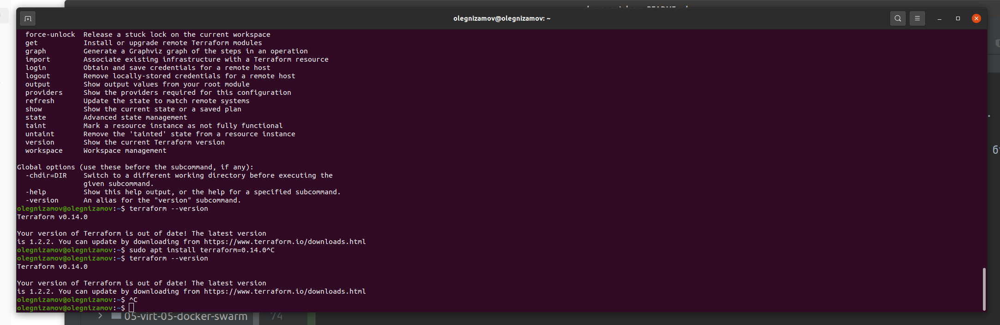
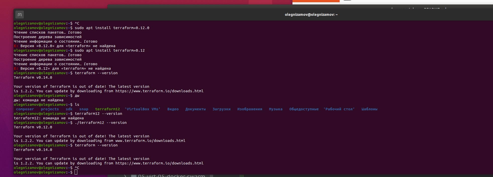

# Домашнее задание к занятию "7.1. Инфраструктура как код"

## Задача 1. Выбор инструментов.

### Легенда

Через час совещание на котором менеджер расскажет о новом проекте. Начать работу над которым надо
будет уже сегодня.
На данный момент известно, что это будет сервис, который ваша компания будет предоставлять внешним заказчикам.
Первое время, скорее всего, будет один внешний клиент, со временем внешних клиентов станет больше.

Так же по разговорам в компании есть вероятность, что техническое задание еще не четкое, что приведет к большому
количеству небольших релизов, тестирований интеграций, откатов, доработок, то есть скучно не будет.

Вам, как девопс инженеру, будет необходимо принять решение об инструментах для организации инфраструктуры.
На данный момент в вашей компании уже используются следующие инструменты:
- остатки Сloud Formation,
- некоторые образы сделаны при помощи Packer,
- год назад начали активно использовать Terraform,
- разработчики привыкли использовать Docker,
- уже есть большая база Kubernetes конфигураций,
- для автоматизации процессов используется Teamcity,
- также есть совсем немного Ansible скриптов,
- и ряд bash скриптов для упрощения рутинных задач.

Для этого в рамках совещания надо будет выяснить подробности о проекте, что бы в итоге определиться с инструментами:

1. Какой тип инфраструктуры будем использовать для этого проекта: изменяемый или не изменяемый?
1. Будет ли центральный сервер для управления инфраструктурой?
1. Будут ли агенты на серверах?
1. Будут ли использованы средства для управления конфигурацией или инициализации ресурсов?

В связи с тем, что проект стартует уже сегодня, в рамках совещания надо будет определиться со всеми этими вопросами.

### В результате задачи необходимо

1. Ответить на четыре вопроса представленных в разделе "Легенда".
```
> Ответ:
1. Какой тип инфраструктуры будем использовать для этого проекта: изменяемый или не изменяемый?
- Я бы использовал оба решения. Первое для неизменяемой части(грубо первоначальная инициализация проекта) + изменяемое - частые релизы.
Docker+Kuber
1. Будет ли центральный сервер для управления инфраструктурой?
Зависит от того, что понимается под центральным сервером. Если мастер-ноды в кубере считаются центральным сервером, то да.
1. Будут ли агенты на серверах?
Не хотелось бы - т.к это потенциальный риск, что они могут отказать и их необходимо мониторить.
1. Будут ли использованы средства для управления конфигурацией или инициализации ресурсов?
Для этого есть teamcity - она с этим справится.
```

1. Какие инструменты из уже используемых вы хотели бы использовать для нового проекта?
```
> Ответ:
Teamcity,terraform,kubernetes,ansible,docker
```

1. Хотите ли рассмотреть возможность внедрения новых инструментов для этого проекта?
```
> Ответ:
 В процессе пьесы понял бы, что необходимо и подобрал бы инструменты.
```

Если для ответа на эти вопросы недостаточно информации, то напишите какие моменты уточните на совещании.
```
> Ответ: Я бы уточнил более подробно информацию о проекте и уточнил по ресурсам компании, насколько они будут свободны для решения этих проблем.
```

## Задача 2. Установка терраформ.

Официальный сайт: https://www.terraform.io/

Установите терраформ при помощи менеджера пакетов используемого в вашей операционной системе.
В виде результата этой задачи приложите вывод команды `terraform --version`.
```
> Ответ:
curl -fsSL https://apt.releases.hashicorp.com/gpg | sudo apt-key add -
sudo apt-add-repository "deb [arch=amd64] https://apt.releases.hashicorp.com $(lsb_release -cs) main"
sudo apt install terraform=0.14.0
olegnizamov@olegnizamov:~$ terraform --version
Terraform v0.14.0

Your version of Terraform is out of date! The latest version
is 1.2.2. You can update by downloading from https://www.terraform.io/downloads.html
```


## Задача 3. Поддержка легаси кода.

В какой-то момент вы обновили терраформ до новой версии, например с 0.12 до 0.13.
А код одного из проектов настолько устарел, что не может работать с версией 0.13.
В связи с этим необходимо сделать так, чтобы вы могли одновременно использовать последнюю версию терраформа установленную при помощи
штатного менеджера пакетов и устаревшую версию 0.12.

В виде результата этой задачи приложите вывод `--version` двух версий терраформа доступных на вашем компьютере
или виртуальной машине.
```
> Ответ: terraform это обычный бинарник, поэтому просто его скачиваем - https://releases.hashicorp.com/terraform/0.12.0
и закидываем его куда-нибудь.

olegnizamov@olegnizamov:~$ ./terraform12 --version
Terraform v0.12.0

Your version of Terraform is out of date! The latest version
is 1.2.2. You can update by downloading from www.terraform.io/downloads.html
olegnizamov@olegnizamov:~$ terraform --version
Terraform v0.14.0

Your version of Terraform is out of date! The latest version
is 1.2.2. You can update by downloading from https://www.terraform.io/downloads.html


```


---

### Как cдавать задание

Выполненное домашнее задание пришлите ссылкой на .md-файл в вашем репозитории.

---