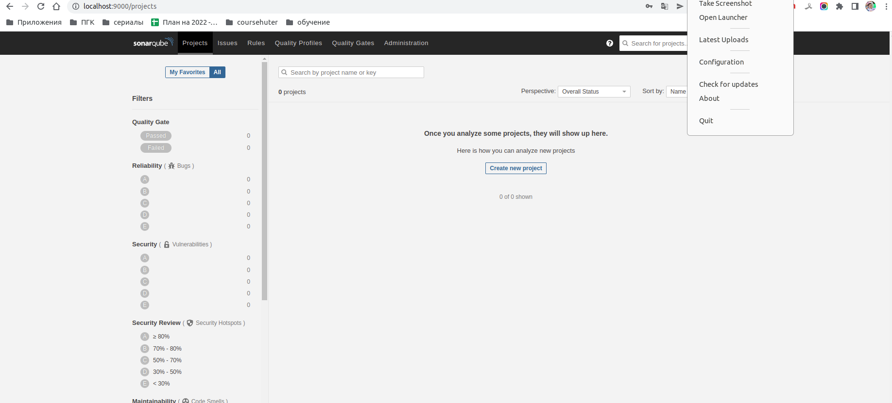
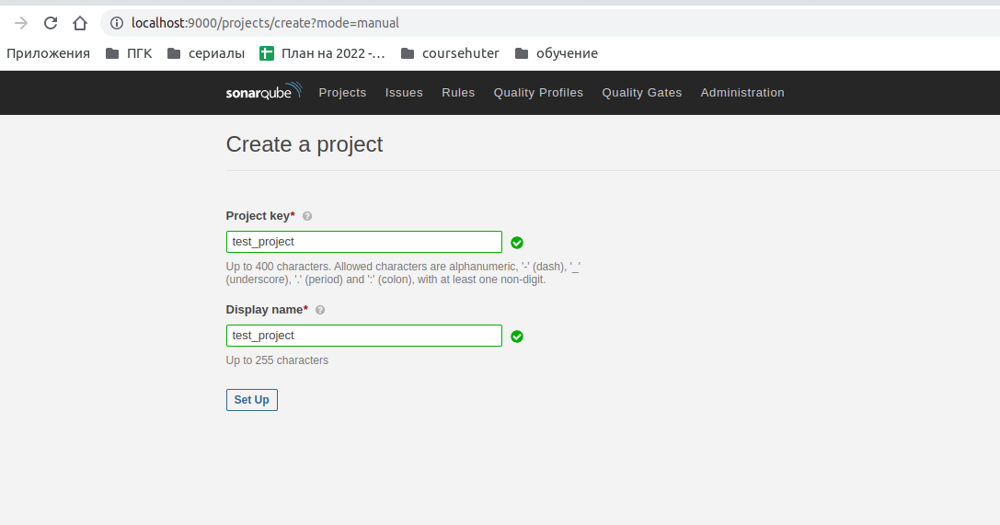
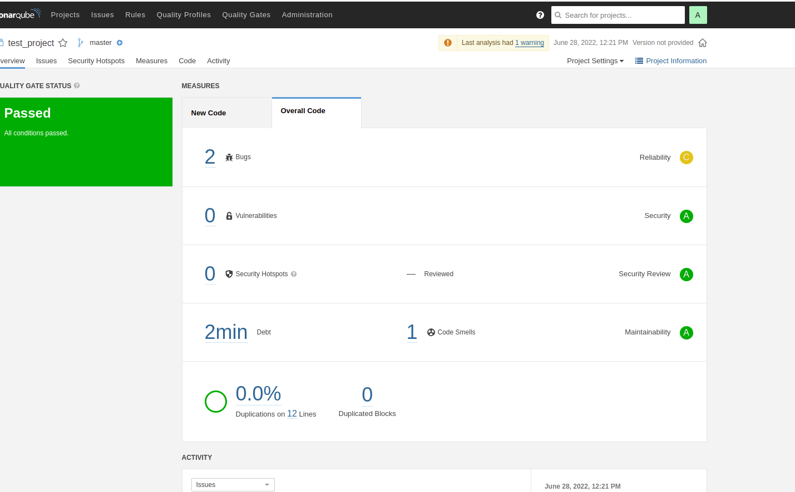
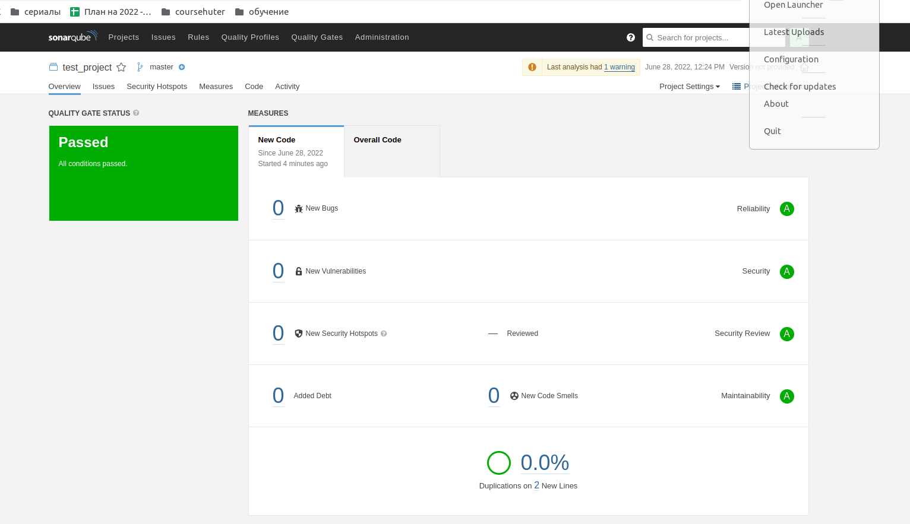
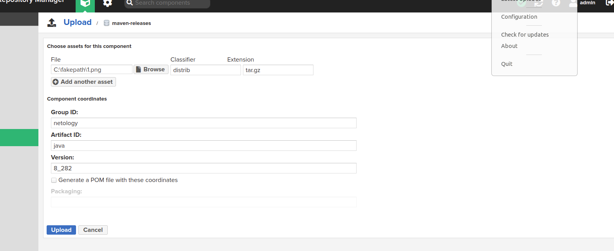
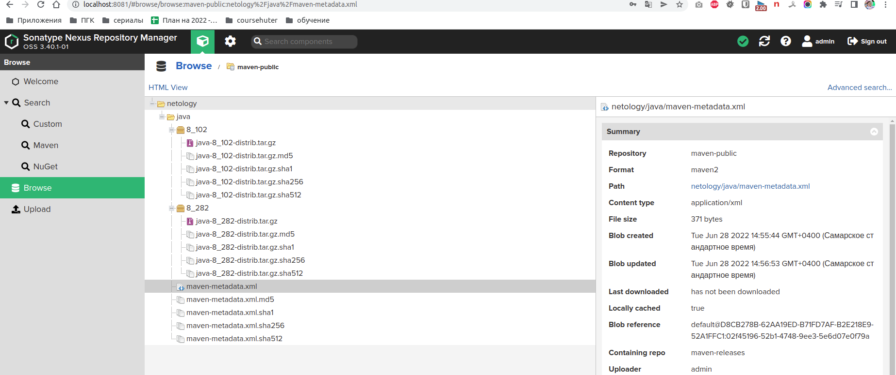

# Домашнее задание к занятию "09.02 CI\CD"

## Знакомоство с SonarQube

### Подготовка к выполнению

1. Выполняем `docker pull sonarqube:8.7-community`
2. Выполняем `docker run -d --name sonarqube -e SONAR_ES_BOOTSTRAP_CHECKS_DISABLE=true -p 9000:9000 sonarqube:8.7-community`
3. Ждём запуск, смотрим логи через `docker logs -f sonarqube`
4. Проверяем готовность сервиса через [браузер](http://localhost:9000)
5. Заходим под admin\admin, меняем пароль на свой

В целом, в [этой статье](https://docs.sonarqube.org/latest/setup/install-server/) описаны все варианты установки, включая и docker, но так как нам он нужен разово, то достаточно того набора действий, который я указал выше.


### Основная часть

1. Создаём новый проект, название произвольное

2. Скачиваем пакет sonar-scanner, который нам предлагает скачать сам sonarqube
3. Делаем так, чтобы binary был доступен через вызов в shell (или меняем переменную PATH или любой другой удобный вам способ)
```
Ответ:
olegnizamov@olegnizamov:~/projects/devops-netology/09-ci-02-cicd$ wget https://binaries.sonarsource.com/Distribution/sonar-scanner-cli/sonar-scanner-cli-4.6.2.2472-linux.zip
--2022-06-28 12:13:19--  https://binaries.sonarsource.com/Distribution/sonar-scanner-cli/sonar-scanner-cli-4.6.2.2472-linux.zip
Распознаётся binaries.sonarsource.com (binaries.sonarsource.com)… 13.33.243.70, 13.33.243.128, 13.33.243.94, ...
Подключение к binaries.sonarsource.com (binaries.sonarsource.com)|13.33.243.70|:443... соединение установлено.
HTTP-запрос отправлен. Ожидание ответа… 200 OK
Длина: 43099390 (41M) [application/zip]
Сохранение в: «sonar-scanner-cli-4.6.2.2472-linux.zip»

sonar-scanner-cli-4.6.2.2472-linux.zip                         100%[==================================================================================================================================================>]  41,10M  11,1MB/s    за 3,8s    

2022-06-28 12:13:24 (10,8 MB/s) - «sonar-scanner-cli-4.6.2.2472-linux.zip» сохранён [43099390/43099390]

olegnizamov@olegnizamov:~/projects/devops-netology/09-ci-02-cicd$ unzip sonar-scanner-cli-4.6.2.2472-linux.zip && sudo mv sonar-scanner-4.6.2.2472-linux /var/lib
Archive:  sonar-scanner-cli-4.6.2.2472-linux.zip
   creating: sonar-scanner-4.6.2.2472-linux/
   creating: sonar-scanner-4.6.2.2472-linux/jre/
   creating: sonar-scanner-4.6.2.2472-linux/jre/conf/
   creating: sonar-scanner-4.6.2.2472-linux/jre/conf/management/
   creating: sonar-scanner-4.6.2.2472-linux/jre/conf/security/
   creating: sonar-scanner-4.6.2.2472-linux/jre/conf/security/policy/
   creating: sonar-scanner-4.6.2.2472-linux/jre/conf/security/policy/limited/
   creating: sonar-scanner-4.6.2.2472-linux/jre/conf/security/policy/unlimited/
   creating: sonar-scanner-4.6.2.2472-linux/jre/lib/
   creating: sonar-scanner-4.6.2.2472-linux/jre/lib/jfr/
   creating: sonar-scanner-4.6.2.2472-linux/jre/lib/server/
   creating: sonar-scanner-4.6.2.2472-linux/jre/lib/jli/
   creating: sonar-scanner-4.6.2.2472-linux/jre/lib/security/
   creating: sonar-scanner-4.6.2.2472-linux/jre/legal/
   creating: sonar-scanner-4.6.2.2472-linux/jre/legal/java.desktop/
   creating: sonar-scanner-4.6.2.2472-linux/jre/legal/jdk.naming.ldap/
   creating: sonar-scanner-4.6.2.2472-linux/jre/legal/java.se/
   creating: sonar-scanner-4.6.2.2472-linux/jre/legal/java.transaction.xa/
   creating: sonar-scanner-4.6.2.2472-linux/jre/legal/java.net.http/
   creating: sonar-scanner-4.6.2.2472-linux/jre/legal/jdk.zipfs/
   creating: sonar-scanner-4.6.2.2472-linux/jre/legal/java.smartcardio/
   creating: sonar-scanner-4.6.2.2472-linux/jre/legal/jdk.naming.dns/
   creating: sonar-scanner-4.6.2.2472-linux/jre/legal/jdk.management/
   creating: sonar-scanner-4.6.2.2472-linux/jre/legal/jdk.charsets/
   creating: sonar-scanner-4.6.2.2472-linux/jre/legal/java.sql/
   creating: sonar-scanner-4.6.2.2472-linux/jre/legal/java.security.jgss/
   creating: sonar-scanner-4.6.2.2472-linux/jre/legal/jdk.aot/
   creating: sonar-scanner-4.6.2.2472-linux/jre/legal/jdk.sctp/
   creating: sonar-scanner-4.6.2.2472-linux/jre/legal/java.compiler/
   creating: sonar-scanner-4.6.2.2472-linux/jre/legal/java.sql.rowset/
   creating: sonar-scanner-4.6.2.2472-linux/jre/legal/jdk.management.jfr/
   creating: sonar-scanner-4.6.2.2472-linux/jre/legal/jdk.internal.vm.compiler/
   creating: sonar-scanner-4.6.2.2472-linux/jre/legal/java.xml/
   creating: sonar-scanner-4.6.2.2472-linux/jre/legal/java.instrument/
   creating: sonar-scanner-4.6.2.2472-linux/jre/legal/jdk.management.agent/
   creating: sonar-scanner-4.6.2.2472-linux/jre/legal/jdk.internal.ed/
   creating: sonar-scanner-4.6.2.2472-linux/jre/legal/jdk.pack/
   creating: sonar-scanner-4.6.2.2472-linux/jre/legal/java.scripting/
   creating: sonar-scanner-4.6.2.2472-linux/jre/legal/jdk.net/
   creating: sonar-scanner-4.6.2.2472-linux/jre/legal/jdk.httpserver/
   creating: sonar-scanner-4.6.2.2472-linux/jre/legal/jdk.security.jgss/
   creating: sonar-scanner-4.6.2.2472-linux/jre/legal/jdk.xml.dom/
   creating: sonar-scanner-4.6.2.2472-linux/jre/legal/java.security.sasl/
   creating: sonar-scanner-4.6.2.2472-linux/jre/legal/java.management/
   creating: sonar-scanner-4.6.2.2472-linux/jre/legal/jdk.internal.vm.compiler.management/
   creating: sonar-scanner-4.6.2.2472-linux/jre/legal/jdk.crypto.ec/
   creating: sonar-scanner-4.6.2.2472-linux/jre/legal/jdk.scripting.nashorn.shell/
   creating: sonar-scanner-4.6.2.2472-linux/jre/legal/jdk.unsupported/
   creating: sonar-scanner-4.6.2.2472-linux/jre/legal/jdk.security.auth/
   creating: sonar-scanner-4.6.2.2472-linux/jre/legal/jdk.crypto.cryptoki/
   creating: sonar-scanner-4.6.2.2472-linux/jre/legal/jdk.jfr/
   creating: sonar-scanner-4.6.2.2472-linux/jre/legal/jdk.scripting.nashorn/
   creating: sonar-scanner-4.6.2.2472-linux/jre/legal/java.rmi/
   creating: sonar-scanner-4.6.2.2472-linux/jre/legal/jdk.naming.rmi/
   creating: sonar-scanner-4.6.2.2472-linux/jre/legal/jdk.internal.vm.ci/
   creating: sonar-scanner-4.6.2.2472-linux/jre/legal/jdk.localedata/
   creating: sonar-scanner-4.6.2.2472-linux/jre/legal/java.xml.crypto/
   creating: sonar-scanner-4.6.2.2472-linux/jre/legal/java.base/
   creating: sonar-scanner-4.6.2.2472-linux/jre/legal/jdk.jdwp.agent/
   creating: sonar-scanner-4.6.2.2472-linux/jre/legal/jdk.internal.le/
   creating: sonar-scanner-4.6.2.2472-linux/jre/legal/jdk.accessibility/
   creating: sonar-scanner-4.6.2.2472-linux/jre/legal/java.prefs/
   creating: sonar-scanner-4.6.2.2472-linux/jre/legal/java.datatransfer/
   creating: sonar-scanner-4.6.2.2472-linux/jre/legal/jdk.dynalink/
   creating: sonar-scanner-4.6.2.2472-linux/jre/legal/java.naming/
   creating: sonar-scanner-4.6.2.2472-linux/jre/legal/java.logging/
   creating: sonar-scanner-4.6.2.2472-linux/jre/legal/java.management.rmi/
   creating: sonar-scanner-4.6.2.2472-linux/jre/legal/jdk.jsobject/
   creating: sonar-scanner-4.6.2.2472-linux/jre/bin/
   creating: sonar-scanner-4.6.2.2472-linux/lib/
   creating: sonar-scanner-4.6.2.2472-linux/conf/
   creating: sonar-scanner-4.6.2.2472-linux/bin/
  inflating: sonar-scanner-4.6.2.2472-linux/jre/release  
  inflating: sonar-scanner-4.6.2.2472-linux/jre/conf/sound.properties  
  inflating: sonar-scanner-4.6.2.2472-linux/jre/conf/management/management.properties  
  inflating: sonar-scanner-4.6.2.2472-linux/jre/conf/management/jmxremote.access  
  inflating: sonar-scanner-4.6.2.2472-linux/jre/conf/management/jmxremote.password.template  
  inflating: sonar-scanner-4.6.2.2472-linux/jre/conf/logging.properties  
  inflating: sonar-scanner-4.6.2.2472-linux/jre/conf/net.properties  
  inflating: sonar-scanner-4.6.2.2472-linux/jre/conf/security/java.security  
  inflating: sonar-scanner-4.6.2.2472-linux/jre/conf/security/policy/limited/default_US_export.policy  
  inflating: sonar-scanner-4.6.2.2472-linux/jre/conf/security/policy/limited/default_local.policy  
  inflating: sonar-scanner-4.6.2.2472-linux/jre/conf/security/policy/limited/exempt_local.policy  
  inflating: sonar-scanner-4.6.2.2472-linux/jre/conf/security/policy/README.txt  
  inflating: sonar-scanner-4.6.2.2472-linux/jre/conf/security/policy/unlimited/default_US_export.policy  
  inflating: sonar-scanner-4.6.2.2472-linux/jre/conf/security/policy/unlimited/default_local.policy  
  inflating: sonar-scanner-4.6.2.2472-linux/jre/conf/security/java.policy  
  inflating: sonar-scanner-4.6.2.2472-linux/jre/lib/libjimage.so  
  inflating: sonar-scanner-4.6.2.2472-linux/jre/lib/libsunec.so  
  inflating: sonar-scanner-4.6.2.2472-linux/jre/lib/libjdwp.so  
  inflating: sonar-scanner-4.6.2.2472-linux/jre/lib/libjawt.so  
  inflating: sonar-scanner-4.6.2.2472-linux/jre/lib/libj2pcsc.so  
  inflating: sonar-scanner-4.6.2.2472-linux/jre/lib/librmi.so  
  inflating: sonar-scanner-4.6.2.2472-linux/jre/lib/libjaas.so  
  inflating: sonar-scanner-4.6.2.2472-linux/jre/lib/libfontmanager.so  
  inflating: sonar-scanner-4.6.2.2472-linux/jre/lib/jfr/profile.jfc  
  inflating: sonar-scanner-4.6.2.2472-linux/jre/lib/jfr/default.jfc  
  inflating: sonar-scanner-4.6.2.2472-linux/jre/lib/libsplashscreen.so  
  inflating: sonar-scanner-4.6.2.2472-linux/jre/lib/libdt_socket.so  
  inflating: sonar-scanner-4.6.2.2472-linux/jre/lib/classlist  
  inflating: sonar-scanner-4.6.2.2472-linux/jre/lib/server/libjsig.so  
  inflating: sonar-scanner-4.6.2.2472-linux/jre/lib/server/libjvm.so  
  inflating: sonar-scanner-4.6.2.2472-linux/jre/lib/server/Xusage.txt  
  inflating: sonar-scanner-4.6.2.2472-linux/jre/lib/libzip.so  
  inflating: sonar-scanner-4.6.2.2472-linux/jre/lib/libjsound.so  
  inflating: sonar-scanner-4.6.2.2472-linux/jre/lib/libverify.so  
  inflating: sonar-scanner-4.6.2.2472-linux/jre/lib/jexec  
  inflating: sonar-scanner-4.6.2.2472-linux/jre/lib/libmlib_image.so  
  inflating: sonar-scanner-4.6.2.2472-linux/jre/lib/tzdb.dat  
  inflating: sonar-scanner-4.6.2.2472-linux/jre/lib/psfont.properties.ja  
  inflating: sonar-scanner-4.6.2.2472-linux/jre/lib/libmanagement_ext.so  
  inflating: sonar-scanner-4.6.2.2472-linux/jre/lib/libinstrument.so  
  inflating: sonar-scanner-4.6.2.2472-linux/jre/lib/libsctp.so  
  inflating: sonar-scanner-4.6.2.2472-linux/jre/lib/libjsig.so  
  inflating: sonar-scanner-4.6.2.2472-linux/jre/lib/libj2pkcs11.so  
  inflating: sonar-scanner-4.6.2.2472-linux/jre/lib/libharfbuzz.so  
  inflating: sonar-scanner-4.6.2.2472-linux/jre/lib/libawt.so  
  inflating: sonar-scanner-4.6.2.2472-linux/jre/lib/jli/libjli.so  
  inflating: sonar-scanner-4.6.2.2472-linux/jre/lib/security/default.policy  
  inflating: sonar-scanner-4.6.2.2472-linux/jre/lib/security/cacerts  
  inflating: sonar-scanner-4.6.2.2472-linux/jre/lib/security/public_suffix_list.dat  
  inflating: sonar-scanner-4.6.2.2472-linux/jre/lib/security/blacklisted.certs  
  inflating: sonar-scanner-4.6.2.2472-linux/jre/lib/libextnet.so  
  inflating: sonar-scanner-4.6.2.2472-linux/jre/lib/jspawnhelper  
  inflating: sonar-scanner-4.6.2.2472-linux/jre/lib/libunpack.so  
  inflating: sonar-scanner-4.6.2.2472-linux/jre/lib/libnet.so  
  inflating: sonar-scanner-4.6.2.2472-linux/jre/lib/libj2gss.so  
  inflating: sonar-scanner-4.6.2.2472-linux/jre/lib/libmanagement.so  
  inflating: sonar-scanner-4.6.2.2472-linux/jre/lib/libawt_xawt.so  
  inflating: sonar-scanner-4.6.2.2472-linux/jre/lib/libmanagement_agent.so  
  inflating: sonar-scanner-4.6.2.2472-linux/jre/lib/jvm.cfg  
  inflating: sonar-scanner-4.6.2.2472-linux/jre/lib/libawt_headless.so  
  inflating: sonar-scanner-4.6.2.2472-linux/jre/lib/jrt-fs.jar  
  inflating: sonar-scanner-4.6.2.2472-linux/jre/lib/libjavajpeg.so  
  inflating: sonar-scanner-4.6.2.2472-linux/jre/lib/modules  
  inflating: sonar-scanner-4.6.2.2472-linux/jre/lib/libprefs.so  
  inflating: sonar-scanner-4.6.2.2472-linux/jre/lib/psfontj2d.properties  
  inflating: sonar-scanner-4.6.2.2472-linux/jre/lib/libjava.so  
  inflating: sonar-scanner-4.6.2.2472-linux/jre/lib/liblcms.so  
  inflating: sonar-scanner-4.6.2.2472-linux/jre/lib/libnio.so  
  inflating: sonar-scanner-4.6.2.2472-linux/jre/legal/java.desktop/ADDITIONAL_LICENSE_INFO  -> ../java.base/ADDITIONAL_LICENSE_INFO 
  inflating: sonar-scanner-4.6.2.2472-linux/jre/legal/java.desktop/lcms.md  
  inflating: sonar-scanner-4.6.2.2472-linux/jre/legal/java.desktop/LICENSE  -> ../java.base/LICENSE 
  inflating: sonar-scanner-4.6.2.2472-linux/jre/legal/java.desktop/harfbuzz.md  
  inflating: sonar-scanner-4.6.2.2472-linux/jre/legal/java.desktop/ASSEMBLY_EXCEPTION  -> ../java.base/ASSEMBLY_EXCEPTION 
  inflating: sonar-scanner-4.6.2.2472-linux/jre/legal/java.desktop/mesa3d.md  
  inflating: sonar-scanner-4.6.2.2472-linux/jre/legal/java.desktop/giflib.md  
  inflating: sonar-scanner-4.6.2.2472-linux/jre/legal/java.desktop/colorimaging.md  
  inflating: sonar-scanner-4.6.2.2472-linux/jre/legal/java.desktop/xwd.md  
  inflating: sonar-scanner-4.6.2.2472-linux/jre/legal/java.desktop/libpng.md  
  inflating: sonar-scanner-4.6.2.2472-linux/jre/legal/java.desktop/jpeg.md  
  inflating: sonar-scanner-4.6.2.2472-linux/jre/legal/jdk.naming.ldap/ADDITIONAL_LICENSE_INFO  -> ../java.base/ADDITIONAL_LICENSE_INFO 
  inflating: sonar-scanner-4.6.2.2472-linux/jre/legal/jdk.naming.ldap/LICENSE  -> ../java.base/LICENSE 
  inflating: sonar-scanner-4.6.2.2472-linux/jre/legal/jdk.naming.ldap/ASSEMBLY_EXCEPTION  -> ../java.base/ASSEMBLY_EXCEPTION 
  inflating: sonar-scanner-4.6.2.2472-linux/jre/legal/java.se/ADDITIONAL_LICENSE_INFO  -> ../java.base/ADDITIONAL_LICENSE_INFO 
  inflating: sonar-scanner-4.6.2.2472-linux/jre/legal/java.se/LICENSE  -> ../java.base/LICENSE 
  inflating: sonar-scanner-4.6.2.2472-linux/jre/legal/java.se/ASSEMBLY_EXCEPTION  -> ../java.base/ASSEMBLY_EXCEPTION 
  inflating: sonar-scanner-4.6.2.2472-linux/jre/legal/java.transaction.xa/ADDITIONAL_LICENSE_INFO  -> ../java.base/ADDITIONAL_LICENSE_INFO 
  inflating: sonar-scanner-4.6.2.2472-linux/jre/legal/java.transaction.xa/LICENSE  -> ../java.base/LICENSE 
  inflating: sonar-scanner-4.6.2.2472-linux/jre/legal/java.transaction.xa/ASSEMBLY_EXCEPTION  -> ../java.base/ASSEMBLY_EXCEPTION 
  inflating: sonar-scanner-4.6.2.2472-linux/jre/legal/java.net.http/ADDITIONAL_LICENSE_INFO  -> ../java.base/ADDITIONAL_LICENSE_INFO 
  inflating: sonar-scanner-4.6.2.2472-linux/jre/legal/java.net.http/LICENSE  -> ../java.base/LICENSE 
  inflating: sonar-scanner-4.6.2.2472-linux/jre/legal/java.net.http/ASSEMBLY_EXCEPTION  -> ../java.base/ASSEMBLY_EXCEPTION 
  inflating: sonar-scanner-4.6.2.2472-linux/jre/legal/jdk.zipfs/ADDITIONAL_LICENSE_INFO  -> ../java.base/ADDITIONAL_LICENSE_INFO 
  inflating: sonar-scanner-4.6.2.2472-linux/jre/legal/jdk.zipfs/LICENSE  -> ../java.base/LICENSE 
  inflating: sonar-scanner-4.6.2.2472-linux/jre/legal/jdk.zipfs/ASSEMBLY_EXCEPTION  -> ../java.base/ASSEMBLY_EXCEPTION 
  inflating: sonar-scanner-4.6.2.2472-linux/jre/legal/java.smartcardio/ADDITIONAL_LICENSE_INFO  -> ../java.base/ADDITIONAL_LICENSE_INFO 
  inflating: sonar-scanner-4.6.2.2472-linux/jre/legal/java.smartcardio/LICENSE  -> ../java.base/LICENSE 
  inflating: sonar-scanner-4.6.2.2472-linux/jre/legal/java.smartcardio/ASSEMBLY_EXCEPTION  -> ../java.base/ASSEMBLY_EXCEPTION 
  inflating: sonar-scanner-4.6.2.2472-linux/jre/legal/java.smartcardio/pcsclite.md  
  inflating: sonar-scanner-4.6.2.2472-linux/jre/legal/jdk.naming.dns/ADDITIONAL_LICENSE_INFO  -> ../java.base/ADDITIONAL_LICENSE_INFO 
  inflating: sonar-scanner-4.6.2.2472-linux/jre/legal/jdk.naming.dns/LICENSE  -> ../java.base/LICENSE 
  inflating: sonar-scanner-4.6.2.2472-linux/jre/legal/jdk.naming.dns/ASSEMBLY_EXCEPTION  -> ../java.base/ASSEMBLY_EXCEPTION 
  inflating: sonar-scanner-4.6.2.2472-linux/jre/legal/jdk.management/ADDITIONAL_LICENSE_INFO  -> ../java.base/ADDITIONAL_LICENSE_INFO 
  inflating: sonar-scanner-4.6.2.2472-linux/jre/legal/jdk.management/LICENSE  -> ../java.base/LICENSE 
  inflating: sonar-scanner-4.6.2.2472-linux/jre/legal/jdk.management/ASSEMBLY_EXCEPTION  -> ../java.base/ASSEMBLY_EXCEPTION 
  inflating: sonar-scanner-4.6.2.2472-linux/jre/legal/jdk.charsets/ADDITIONAL_LICENSE_INFO  -> ../java.base/ADDITIONAL_LICENSE_INFO 
  inflating: sonar-scanner-4.6.2.2472-linux/jre/legal/jdk.charsets/LICENSE  -> ../java.base/LICENSE 
  inflating: sonar-scanner-4.6.2.2472-linux/jre/legal/jdk.charsets/ASSEMBLY_EXCEPTION  -> ../java.base/ASSEMBLY_EXCEPTION 
  inflating: sonar-scanner-4.6.2.2472-linux/jre/legal/java.sql/ADDITIONAL_LICENSE_INFO  -> ../java.base/ADDITIONAL_LICENSE_INFO 
  inflating: sonar-scanner-4.6.2.2472-linux/jre/legal/java.sql/LICENSE  -> ../java.base/LICENSE 
  inflating: sonar-scanner-4.6.2.2472-linux/jre/legal/java.sql/ASSEMBLY_EXCEPTION  -> ../java.base/ASSEMBLY_EXCEPTION 
  inflating: sonar-scanner-4.6.2.2472-linux/jre/legal/java.security.jgss/ADDITIONAL_LICENSE_INFO  -> ../java.base/ADDITIONAL_LICENSE_INFO 
  inflating: sonar-scanner-4.6.2.2472-linux/jre/legal/java.security.jgss/LICENSE  -> ../java.base/LICENSE 
  inflating: sonar-scanner-4.6.2.2472-linux/jre/legal/java.security.jgss/ASSEMBLY_EXCEPTION  -> ../java.base/ASSEMBLY_EXCEPTION 
  inflating: sonar-scanner-4.6.2.2472-linux/jre/legal/jdk.aot/ADDITIONAL_LICENSE_INFO  -> ../java.base/ADDITIONAL_LICENSE_INFO 
  inflating: sonar-scanner-4.6.2.2472-linux/jre/legal/jdk.aot/LICENSE  -> ../java.base/LICENSE 
  inflating: sonar-scanner-4.6.2.2472-linux/jre/legal/jdk.aot/ASSEMBLY_EXCEPTION  -> ../java.base/ASSEMBLY_EXCEPTION 
  inflating: sonar-scanner-4.6.2.2472-linux/jre/legal/jdk.sctp/ADDITIONAL_LICENSE_INFO  -> ../java.base/ADDITIONAL_LICENSE_INFO 
  inflating: sonar-scanner-4.6.2.2472-linux/jre/legal/jdk.sctp/LICENSE  -> ../java.base/LICENSE 
  inflating: sonar-scanner-4.6.2.2472-linux/jre/legal/jdk.sctp/ASSEMBLY_EXCEPTION  -> ../java.base/ASSEMBLY_EXCEPTION 
  inflating: sonar-scanner-4.6.2.2472-linux/jre/legal/java.compiler/ADDITIONAL_LICENSE_INFO  -> ../java.base/ADDITIONAL_LICENSE_INFO 
  inflating: sonar-scanner-4.6.2.2472-linux/jre/legal/java.compiler/LICENSE  -> ../java.base/LICENSE 
  inflating: sonar-scanner-4.6.2.2472-linux/jre/legal/java.compiler/ASSEMBLY_EXCEPTION  -> ../java.base/ASSEMBLY_EXCEPTION 
  inflating: sonar-scanner-4.6.2.2472-linux/jre/legal/java.sql.rowset/ADDITIONAL_LICENSE_INFO  -> ../java.base/ADDITIONAL_LICENSE_INFO 
  inflating: sonar-scanner-4.6.2.2472-linux/jre/legal/java.sql.rowset/LICENSE  -> ../java.base/LICENSE 
  inflating: sonar-scanner-4.6.2.2472-linux/jre/legal/java.sql.rowset/ASSEMBLY_EXCEPTION  -> ../java.base/ASSEMBLY_EXCEPTION 
  inflating: sonar-scanner-4.6.2.2472-linux/jre/legal/jdk.management.jfr/ADDITIONAL_LICENSE_INFO  -> ../java.base/ADDITIONAL_LICENSE_INFO 
  inflating: sonar-scanner-4.6.2.2472-linux/jre/legal/jdk.management.jfr/LICENSE  -> ../java.base/LICENSE 
  inflating: sonar-scanner-4.6.2.2472-linux/jre/legal/jdk.management.jfr/ASSEMBLY_EXCEPTION  -> ../java.base/ASSEMBLY_EXCEPTION 
  inflating: sonar-scanner-4.6.2.2472-linux/jre/legal/jdk.internal.vm.compiler/ADDITIONAL_LICENSE_INFO  -> ../java.base/ADDITIONAL_LICENSE_INFO 
  inflating: sonar-scanner-4.6.2.2472-linux/jre/legal/jdk.internal.vm.compiler/LICENSE  -> ../java.base/LICENSE 
  inflating: sonar-scanner-4.6.2.2472-linux/jre/legal/jdk.internal.vm.compiler/ASSEMBLY_EXCEPTION  -> ../java.base/ASSEMBLY_EXCEPTION 
  inflating: sonar-scanner-4.6.2.2472-linux/jre/legal/java.xml/ADDITIONAL_LICENSE_INFO  -> ../java.base/ADDITIONAL_LICENSE_INFO 
  inflating: sonar-scanner-4.6.2.2472-linux/jre/legal/java.xml/bcel.md  
  inflating: sonar-scanner-4.6.2.2472-linux/jre/legal/java.xml/LICENSE  -> ../java.base/LICENSE 
  inflating: sonar-scanner-4.6.2.2472-linux/jre/legal/java.xml/xalan.md  
  inflating: sonar-scanner-4.6.2.2472-linux/jre/legal/java.xml/jcup.md  
  inflating: sonar-scanner-4.6.2.2472-linux/jre/legal/java.xml/ASSEMBLY_EXCEPTION  -> ../java.base/ASSEMBLY_EXCEPTION 
  inflating: sonar-scanner-4.6.2.2472-linux/jre/legal/java.xml/dom.md  
  inflating: sonar-scanner-4.6.2.2472-linux/jre/legal/java.xml/xerces.md  
  inflating: sonar-scanner-4.6.2.2472-linux/jre/legal/java.instrument/ADDITIONAL_LICENSE_INFO  -> ../java.base/ADDITIONAL_LICENSE_INFO 
  inflating: sonar-scanner-4.6.2.2472-linux/jre/legal/java.instrument/LICENSE  -> ../java.base/LICENSE 
  inflating: sonar-scanner-4.6.2.2472-linux/jre/legal/java.instrument/ASSEMBLY_EXCEPTION  -> ../java.base/ASSEMBLY_EXCEPTION 
  inflating: sonar-scanner-4.6.2.2472-linux/jre/legal/jdk.management.agent/ADDITIONAL_LICENSE_INFO  -> ../java.base/ADDITIONAL_LICENSE_INFO 
  inflating: sonar-scanner-4.6.2.2472-linux/jre/legal/jdk.management.agent/LICENSE  -> ../java.base/LICENSE 
  inflating: sonar-scanner-4.6.2.2472-linux/jre/legal/jdk.management.agent/ASSEMBLY_EXCEPTION  -> ../java.base/ASSEMBLY_EXCEPTION 
  inflating: sonar-scanner-4.6.2.2472-linux/jre/legal/jdk.internal.ed/ADDITIONAL_LICENSE_INFO  -> ../java.base/ADDITIONAL_LICENSE_INFO 
  inflating: sonar-scanner-4.6.2.2472-linux/jre/legal/jdk.internal.ed/LICENSE  -> ../java.base/LICENSE 
  inflating: sonar-scanner-4.6.2.2472-linux/jre/legal/jdk.internal.ed/ASSEMBLY_EXCEPTION  -> ../java.base/ASSEMBLY_EXCEPTION 
  inflating: sonar-scanner-4.6.2.2472-linux/jre/legal/jdk.pack/ADDITIONAL_LICENSE_INFO  -> ../java.base/ADDITIONAL_LICENSE_INFO 
  inflating: sonar-scanner-4.6.2.2472-linux/jre/legal/jdk.pack/LICENSE  -> ../java.base/LICENSE 
  inflating: sonar-scanner-4.6.2.2472-linux/jre/legal/jdk.pack/ASSEMBLY_EXCEPTION  -> ../java.base/ASSEMBLY_EXCEPTION 
  inflating: sonar-scanner-4.6.2.2472-linux/jre/legal/java.scripting/ADDITIONAL_LICENSE_INFO  -> ../java.base/ADDITIONAL_LICENSE_INFO 
  inflating: sonar-scanner-4.6.2.2472-linux/jre/legal/java.scripting/LICENSE  -> ../java.base/LICENSE 
  inflating: sonar-scanner-4.6.2.2472-linux/jre/legal/java.scripting/ASSEMBLY_EXCEPTION  -> ../java.base/ASSEMBLY_EXCEPTION 
  inflating: sonar-scanner-4.6.2.2472-linux/jre/legal/jdk.net/ADDITIONAL_LICENSE_INFO  -> ../java.base/ADDITIONAL_LICENSE_INFO 
  inflating: sonar-scanner-4.6.2.2472-linux/jre/legal/jdk.net/LICENSE  -> ../java.base/LICENSE 
  inflating: sonar-scanner-4.6.2.2472-linux/jre/legal/jdk.net/ASSEMBLY_EXCEPTION  -> ../java.base/ASSEMBLY_EXCEPTION 
  inflating: sonar-scanner-4.6.2.2472-linux/jre/legal/jdk.httpserver/ADDITIONAL_LICENSE_INFO  -> ../java.base/ADDITIONAL_LICENSE_INFO 
  inflating: sonar-scanner-4.6.2.2472-linux/jre/legal/jdk.httpserver/LICENSE  -> ../java.base/LICENSE 
  inflating: sonar-scanner-4.6.2.2472-linux/jre/legal/jdk.httpserver/ASSEMBLY_EXCEPTION  -> ../java.base/ASSEMBLY_EXCEPTION 
  inflating: sonar-scanner-4.6.2.2472-linux/jre/legal/jdk.security.jgss/ADDITIONAL_LICENSE_INFO  -> ../java.base/ADDITIONAL_LICENSE_INFO 
  inflating: sonar-scanner-4.6.2.2472-linux/jre/legal/jdk.security.jgss/LICENSE  -> ../java.base/LICENSE 
  inflating: sonar-scanner-4.6.2.2472-linux/jre/legal/jdk.security.jgss/ASSEMBLY_EXCEPTION  -> ../java.base/ASSEMBLY_EXCEPTION 
  inflating: sonar-scanner-4.6.2.2472-linux/jre/legal/jdk.xml.dom/ADDITIONAL_LICENSE_INFO  -> ../java.base/ADDITIONAL_LICENSE_INFO 
  inflating: sonar-scanner-4.6.2.2472-linux/jre/legal/jdk.xml.dom/LICENSE  -> ../java.base/LICENSE 
  inflating: sonar-scanner-4.6.2.2472-linux/jre/legal/jdk.xml.dom/ASSEMBLY_EXCEPTION  -> ../java.base/ASSEMBLY_EXCEPTION 
  inflating: sonar-scanner-4.6.2.2472-linux/jre/legal/java.security.sasl/ADDITIONAL_LICENSE_INFO  -> ../java.base/ADDITIONAL_LICENSE_INFO 
  inflating: sonar-scanner-4.6.2.2472-linux/jre/legal/java.security.sasl/LICENSE  -> ../java.base/LICENSE 
  inflating: sonar-scanner-4.6.2.2472-linux/jre/legal/java.security.sasl/ASSEMBLY_EXCEPTION  -> ../java.base/ASSEMBLY_EXCEPTION 
  inflating: sonar-scanner-4.6.2.2472-linux/jre/legal/java.management/ADDITIONAL_LICENSE_INFO  -> ../java.base/ADDITIONAL_LICENSE_INFO 
  inflating: sonar-scanner-4.6.2.2472-linux/jre/legal/java.management/LICENSE  -> ../java.base/LICENSE 
  inflating: sonar-scanner-4.6.2.2472-linux/jre/legal/java.management/ASSEMBLY_EXCEPTION  -> ../java.base/ASSEMBLY_EXCEPTION 
  inflating: sonar-scanner-4.6.2.2472-linux/jre/legal/jdk.internal.vm.compiler.management/ADDITIONAL_LICENSE_INFO  -> ../java.base/ADDITIONAL_LICENSE_INFO 
  inflating: sonar-scanner-4.6.2.2472-linux/jre/legal/jdk.internal.vm.compiler.management/LICENSE  -> ../java.base/LICENSE 
  inflating: sonar-scanner-4.6.2.2472-linux/jre/legal/jdk.internal.vm.compiler.management/ASSEMBLY_EXCEPTION  -> ../java.base/ASSEMBLY_EXCEPTION 
  inflating: sonar-scanner-4.6.2.2472-linux/jre/legal/jdk.crypto.ec/ADDITIONAL_LICENSE_INFO  -> ../java.base/ADDITIONAL_LICENSE_INFO 
  inflating: sonar-scanner-4.6.2.2472-linux/jre/legal/jdk.crypto.ec/LICENSE  -> ../java.base/LICENSE 
  inflating: sonar-scanner-4.6.2.2472-linux/jre/legal/jdk.crypto.ec/ASSEMBLY_EXCEPTION  -> ../java.base/ASSEMBLY_EXCEPTION 
  inflating: sonar-scanner-4.6.2.2472-linux/jre/legal/jdk.crypto.ec/ecc.md  
  inflating: sonar-scanner-4.6.2.2472-linux/jre/legal/jdk.scripting.nashorn.shell/ADDITIONAL_LICENSE_INFO  -> ../java.base/ADDITIONAL_LICENSE_INFO 
  inflating: sonar-scanner-4.6.2.2472-linux/jre/legal/jdk.scripting.nashorn.shell/LICENSE  -> ../java.base/LICENSE 
  inflating: sonar-scanner-4.6.2.2472-linux/jre/legal/jdk.scripting.nashorn.shell/ASSEMBLY_EXCEPTION  -> ../java.base/ASSEMBLY_EXCEPTION 
  inflating: sonar-scanner-4.6.2.2472-linux/jre/legal/jdk.unsupported/ADDITIONAL_LICENSE_INFO  -> ../java.base/ADDITIONAL_LICENSE_INFO 
  inflating: sonar-scanner-4.6.2.2472-linux/jre/legal/jdk.unsupported/LICENSE  -> ../java.base/LICENSE 
  inflating: sonar-scanner-4.6.2.2472-linux/jre/legal/jdk.unsupported/ASSEMBLY_EXCEPTION  -> ../java.base/ASSEMBLY_EXCEPTION 
  inflating: sonar-scanner-4.6.2.2472-linux/jre/legal/jdk.security.auth/ADDITIONAL_LICENSE_INFO  -> ../java.base/ADDITIONAL_LICENSE_INFO 
  inflating: sonar-scanner-4.6.2.2472-linux/jre/legal/jdk.security.auth/LICENSE  -> ../java.base/LICENSE 
  inflating: sonar-scanner-4.6.2.2472-linux/jre/legal/jdk.security.auth/ASSEMBLY_EXCEPTION  -> ../java.base/ASSEMBLY_EXCEPTION 
  inflating: sonar-scanner-4.6.2.2472-linux/jre/legal/jdk.crypto.cryptoki/ADDITIONAL_LICENSE_INFO  -> ../java.base/ADDITIONAL_LICENSE_INFO 
  inflating: sonar-scanner-4.6.2.2472-linux/jre/legal/jdk.crypto.cryptoki/pkcs11cryptotoken.md  
  inflating: sonar-scanner-4.6.2.2472-linux/jre/legal/jdk.crypto.cryptoki/pkcs11wrapper.md  
  inflating: sonar-scanner-4.6.2.2472-linux/jre/legal/jdk.crypto.cryptoki/LICENSE  -> ../java.base/LICENSE 
  inflating: sonar-scanner-4.6.2.2472-linux/jre/legal/jdk.crypto.cryptoki/ASSEMBLY_EXCEPTION  -> ../java.base/ASSEMBLY_EXCEPTION 
  inflating: sonar-scanner-4.6.2.2472-linux/jre/legal/jdk.jfr/ADDITIONAL_LICENSE_INFO  -> ../java.base/ADDITIONAL_LICENSE_INFO 
  inflating: sonar-scanner-4.6.2.2472-linux/jre/legal/jdk.jfr/LICENSE  -> ../java.base/LICENSE 
  inflating: sonar-scanner-4.6.2.2472-linux/jre/legal/jdk.jfr/ASSEMBLY_EXCEPTION  -> ../java.base/ASSEMBLY_EXCEPTION 
  inflating: sonar-scanner-4.6.2.2472-linux/jre/legal/jdk.scripting.nashorn/ADDITIONAL_LICENSE_INFO  -> ../java.base/ADDITIONAL_LICENSE_INFO 
  inflating: sonar-scanner-4.6.2.2472-linux/jre/legal/jdk.scripting.nashorn/joni.md  
  inflating: sonar-scanner-4.6.2.2472-linux/jre/legal/jdk.scripting.nashorn/LICENSE  -> ../java.base/LICENSE 
  inflating: sonar-scanner-4.6.2.2472-linux/jre/legal/jdk.scripting.nashorn/ASSEMBLY_EXCEPTION  -> ../java.base/ASSEMBLY_EXCEPTION 
  inflating: sonar-scanner-4.6.2.2472-linux/jre/legal/jdk.scripting.nashorn/double-conversion.md  
  inflating: sonar-scanner-4.6.2.2472-linux/jre/legal/java.rmi/ADDITIONAL_LICENSE_INFO  -> ../java.base/ADDITIONAL_LICENSE_INFO 
  inflating: sonar-scanner-4.6.2.2472-linux/jre/legal/java.rmi/LICENSE  -> ../java.base/LICENSE 
  inflating: sonar-scanner-4.6.2.2472-linux/jre/legal/java.rmi/ASSEMBLY_EXCEPTION  -> ../java.base/ASSEMBLY_EXCEPTION 
  inflating: sonar-scanner-4.6.2.2472-linux/jre/legal/jdk.naming.rmi/ADDITIONAL_LICENSE_INFO  -> ../java.base/ADDITIONAL_LICENSE_INFO 
  inflating: sonar-scanner-4.6.2.2472-linux/jre/legal/jdk.naming.rmi/LICENSE  -> ../java.base/LICENSE 
  inflating: sonar-scanner-4.6.2.2472-linux/jre/legal/jdk.naming.rmi/ASSEMBLY_EXCEPTION  -> ../java.base/ASSEMBLY_EXCEPTION 
  inflating: sonar-scanner-4.6.2.2472-linux/jre/legal/jdk.internal.vm.ci/ADDITIONAL_LICENSE_INFO  -> ../java.base/ADDITIONAL_LICENSE_INFO 
  inflating: sonar-scanner-4.6.2.2472-linux/jre/legal/jdk.internal.vm.ci/LICENSE  -> ../java.base/LICENSE 
  inflating: sonar-scanner-4.6.2.2472-linux/jre/legal/jdk.internal.vm.ci/ASSEMBLY_EXCEPTION  -> ../java.base/ASSEMBLY_EXCEPTION 
  inflating: sonar-scanner-4.6.2.2472-linux/jre/legal/jdk.localedata/ADDITIONAL_LICENSE_INFO  -> ../java.base/ADDITIONAL_LICENSE_INFO 
  inflating: sonar-scanner-4.6.2.2472-linux/jre/legal/jdk.localedata/cldr.md  -> ../java.base/cldr.md 
  inflating: sonar-scanner-4.6.2.2472-linux/jre/legal/jdk.localedata/LICENSE  -> ../java.base/LICENSE 
  inflating: sonar-scanner-4.6.2.2472-linux/jre/legal/jdk.localedata/ASSEMBLY_EXCEPTION  -> ../java.base/ASSEMBLY_EXCEPTION 
  inflating: sonar-scanner-4.6.2.2472-linux/jre/legal/jdk.localedata/thaidict.md  
  inflating: sonar-scanner-4.6.2.2472-linux/jre/legal/java.xml.crypto/ADDITIONAL_LICENSE_INFO  -> ../java.base/ADDITIONAL_LICENSE_INFO 
  inflating: sonar-scanner-4.6.2.2472-linux/jre/legal/java.xml.crypto/LICENSE  -> ../java.base/LICENSE 
  inflating: sonar-scanner-4.6.2.2472-linux/jre/legal/java.xml.crypto/ASSEMBLY_EXCEPTION  -> ../java.base/ASSEMBLY_EXCEPTION 
  inflating: sonar-scanner-4.6.2.2472-linux/jre/legal/java.xml.crypto/santuario.md  
  inflating: sonar-scanner-4.6.2.2472-linux/jre/legal/java.base/public_suffix.md  
  inflating: sonar-scanner-4.6.2.2472-linux/jre/legal/java.base/ADDITIONAL_LICENSE_INFO  
  inflating: sonar-scanner-4.6.2.2472-linux/jre/legal/java.base/cldr.md  
  inflating: sonar-scanner-4.6.2.2472-linux/jre/legal/java.base/LICENSE  
  inflating: sonar-scanner-4.6.2.2472-linux/jre/legal/java.base/ASSEMBLY_EXCEPTION  
  inflating: sonar-scanner-4.6.2.2472-linux/jre/legal/java.base/icu.md  
  inflating: sonar-scanner-4.6.2.2472-linux/jre/legal/java.base/asm.md  
  inflating: sonar-scanner-4.6.2.2472-linux/jre/legal/java.base/unicode.md  
  inflating: sonar-scanner-4.6.2.2472-linux/jre/legal/java.base/c-libutl.md  
  inflating: sonar-scanner-4.6.2.2472-linux/jre/legal/java.base/aes.md  
  inflating: sonar-scanner-4.6.2.2472-linux/jre/legal/jdk.jdwp.agent/ADDITIONAL_LICENSE_INFO  -> ../java.base/ADDITIONAL_LICENSE_INFO 
  inflating: sonar-scanner-4.6.2.2472-linux/jre/legal/jdk.jdwp.agent/LICENSE  -> ../java.base/LICENSE 
  inflating: sonar-scanner-4.6.2.2472-linux/jre/legal/jdk.jdwp.agent/ASSEMBLY_EXCEPTION  -> ../java.base/ASSEMBLY_EXCEPTION 
  inflating: sonar-scanner-4.6.2.2472-linux/jre/legal/jdk.internal.le/ADDITIONAL_LICENSE_INFO  -> ../java.base/ADDITIONAL_LICENSE_INFO 
  inflating: sonar-scanner-4.6.2.2472-linux/jre/legal/jdk.internal.le/jline.md  
  inflating: sonar-scanner-4.6.2.2472-linux/jre/legal/jdk.internal.le/LICENSE  -> ../java.base/LICENSE 
  inflating: sonar-scanner-4.6.2.2472-linux/jre/legal/jdk.internal.le/ASSEMBLY_EXCEPTION  -> ../java.base/ASSEMBLY_EXCEPTION 
  inflating: sonar-scanner-4.6.2.2472-linux/jre/legal/jdk.accessibility/ADDITIONAL_LICENSE_INFO  -> ../java.base/ADDITIONAL_LICENSE_INFO 
  inflating: sonar-scanner-4.6.2.2472-linux/jre/legal/jdk.accessibility/LICENSE  -> ../java.base/LICENSE 
  inflating: sonar-scanner-4.6.2.2472-linux/jre/legal/jdk.accessibility/ASSEMBLY_EXCEPTION  -> ../java.base/ASSEMBLY_EXCEPTION 
  inflating: sonar-scanner-4.6.2.2472-linux/jre/legal/java.prefs/ADDITIONAL_LICENSE_INFO  -> ../java.base/ADDITIONAL_LICENSE_INFO 
  inflating: sonar-scanner-4.6.2.2472-linux/jre/legal/java.prefs/LICENSE  -> ../java.base/LICENSE 
  inflating: sonar-scanner-4.6.2.2472-linux/jre/legal/java.prefs/ASSEMBLY_EXCEPTION  -> ../java.base/ASSEMBLY_EXCEPTION 
  inflating: sonar-scanner-4.6.2.2472-linux/jre/legal/java.datatransfer/ADDITIONAL_LICENSE_INFO  -> ../java.base/ADDITIONAL_LICENSE_INFO 
  inflating: sonar-scanner-4.6.2.2472-linux/jre/legal/java.datatransfer/LICENSE  -> ../java.base/LICENSE 
  inflating: sonar-scanner-4.6.2.2472-linux/jre/legal/java.datatransfer/ASSEMBLY_EXCEPTION  -> ../java.base/ASSEMBLY_EXCEPTION 
  inflating: sonar-scanner-4.6.2.2472-linux/jre/legal/jdk.dynalink/ADDITIONAL_LICENSE_INFO  -> ../java.base/ADDITIONAL_LICENSE_INFO 
  inflating: sonar-scanner-4.6.2.2472-linux/jre/legal/jdk.dynalink/LICENSE  -> ../java.base/LICENSE 
  inflating: sonar-scanner-4.6.2.2472-linux/jre/legal/jdk.dynalink/ASSEMBLY_EXCEPTION  -> ../java.base/ASSEMBLY_EXCEPTION 
  inflating: sonar-scanner-4.6.2.2472-linux/jre/legal/jdk.dynalink/dynalink.md  
  inflating: sonar-scanner-4.6.2.2472-linux/jre/legal/java.naming/ADDITIONAL_LICENSE_INFO  -> ../java.base/ADDITIONAL_LICENSE_INFO 
  inflating: sonar-scanner-4.6.2.2472-linux/jre/legal/java.naming/LICENSE  -> ../java.base/LICENSE 
  inflating: sonar-scanner-4.6.2.2472-linux/jre/legal/java.naming/ASSEMBLY_EXCEPTION  -> ../java.base/ASSEMBLY_EXCEPTION 
  inflating: sonar-scanner-4.6.2.2472-linux/jre/legal/java.logging/ADDITIONAL_LICENSE_INFO  -> ../java.base/ADDITIONAL_LICENSE_INFO 
  inflating: sonar-scanner-4.6.2.2472-linux/jre/legal/java.logging/LICENSE  -> ../java.base/LICENSE 
  inflating: sonar-scanner-4.6.2.2472-linux/jre/legal/java.logging/ASSEMBLY_EXCEPTION  -> ../java.base/ASSEMBLY_EXCEPTION 
  inflating: sonar-scanner-4.6.2.2472-linux/jre/legal/java.management.rmi/ADDITIONAL_LICENSE_INFO  -> ../java.base/ADDITIONAL_LICENSE_INFO 
  inflating: sonar-scanner-4.6.2.2472-linux/jre/legal/java.management.rmi/LICENSE  -> ../java.base/LICENSE 
  inflating: sonar-scanner-4.6.2.2472-linux/jre/legal/java.management.rmi/ASSEMBLY_EXCEPTION  -> ../java.base/ASSEMBLY_EXCEPTION 
  inflating: sonar-scanner-4.6.2.2472-linux/jre/legal/jdk.jsobject/ADDITIONAL_LICENSE_INFO  -> ../java.base/ADDITIONAL_LICENSE_INFO 
  inflating: sonar-scanner-4.6.2.2472-linux/jre/legal/jdk.jsobject/LICENSE  -> ../java.base/LICENSE 
  inflating: sonar-scanner-4.6.2.2472-linux/jre/legal/jdk.jsobject/ASSEMBLY_EXCEPTION  -> ../java.base/ASSEMBLY_EXCEPTION 
  inflating: sonar-scanner-4.6.2.2472-linux/jre/bin/java  
  inflating: sonar-scanner-4.6.2.2472-linux/lib/sonar-scanner-cli-4.6.2.2472.jar  
  inflating: sonar-scanner-4.6.2.2472-linux/conf/sonar-scanner.properties  
  inflating: sonar-scanner-4.6.2.2472-linux/bin/sonar-scanner-debug  
  inflating: sonar-scanner-4.6.2.2472-linux/bin/sonar-scanner  
finishing deferred symbolic links:
  sonar-scanner-4.6.2.2472-linux/jre/legal/java.desktop/ADDITIONAL_LICENSE_INFO -> ../java.base/ADDITIONAL_LICENSE_INFO
  sonar-scanner-4.6.2.2472-linux/jre/legal/java.desktop/LICENSE -> ../java.base/LICENSE
  sonar-scanner-4.6.2.2472-linux/jre/legal/java.desktop/ASSEMBLY_EXCEPTION -> ../java.base/ASSEMBLY_EXCEPTION
  sonar-scanner-4.6.2.2472-linux/jre/legal/jdk.naming.ldap/ADDITIONAL_LICENSE_INFO -> ../java.base/ADDITIONAL_LICENSE_INFO
  sonar-scanner-4.6.2.2472-linux/jre/legal/jdk.naming.ldap/LICENSE -> ../java.base/LICENSE
  sonar-scanner-4.6.2.2472-linux/jre/legal/jdk.naming.ldap/ASSEMBLY_EXCEPTION -> ../java.base/ASSEMBLY_EXCEPTION
  sonar-scanner-4.6.2.2472-linux/jre/legal/java.se/ADDITIONAL_LICENSE_INFO -> ../java.base/ADDITIONAL_LICENSE_INFO
  sonar-scanner-4.6.2.2472-linux/jre/legal/java.se/LICENSE -> ../java.base/LICENSE
  sonar-scanner-4.6.2.2472-linux/jre/legal/java.se/ASSEMBLY_EXCEPTION -> ../java.base/ASSEMBLY_EXCEPTION
  sonar-scanner-4.6.2.2472-linux/jre/legal/java.transaction.xa/ADDITIONAL_LICENSE_INFO -> ../java.base/ADDITIONAL_LICENSE_INFO
  sonar-scanner-4.6.2.2472-linux/jre/legal/java.transaction.xa/LICENSE -> ../java.base/LICENSE
  sonar-scanner-4.6.2.2472-linux/jre/legal/java.transaction.xa/ASSEMBLY_EXCEPTION -> ../java.base/ASSEMBLY_EXCEPTION
  sonar-scanner-4.6.2.2472-linux/jre/legal/java.net.http/ADDITIONAL_LICENSE_INFO -> ../java.base/ADDITIONAL_LICENSE_INFO
  sonar-scanner-4.6.2.2472-linux/jre/legal/java.net.http/LICENSE -> ../java.base/LICENSE
  sonar-scanner-4.6.2.2472-linux/jre/legal/java.net.http/ASSEMBLY_EXCEPTION -> ../java.base/ASSEMBLY_EXCEPTION
  sonar-scanner-4.6.2.2472-linux/jre/legal/jdk.zipfs/ADDITIONAL_LICENSE_INFO -> ../java.base/ADDITIONAL_LICENSE_INFO
  sonar-scanner-4.6.2.2472-linux/jre/legal/jdk.zipfs/LICENSE -> ../java.base/LICENSE
  sonar-scanner-4.6.2.2472-linux/jre/legal/jdk.zipfs/ASSEMBLY_EXCEPTION -> ../java.base/ASSEMBLY_EXCEPTION
  sonar-scanner-4.6.2.2472-linux/jre/legal/java.smartcardio/ADDITIONAL_LICENSE_INFO -> ../java.base/ADDITIONAL_LICENSE_INFO
  sonar-scanner-4.6.2.2472-linux/jre/legal/java.smartcardio/LICENSE -> ../java.base/LICENSE
  sonar-scanner-4.6.2.2472-linux/jre/legal/java.smartcardio/ASSEMBLY_EXCEPTION -> ../java.base/ASSEMBLY_EXCEPTION
  sonar-scanner-4.6.2.2472-linux/jre/legal/jdk.naming.dns/ADDITIONAL_LICENSE_INFO -> ../java.base/ADDITIONAL_LICENSE_INFO
  sonar-scanner-4.6.2.2472-linux/jre/legal/jdk.naming.dns/LICENSE -> ../java.base/LICENSE
  sonar-scanner-4.6.2.2472-linux/jre/legal/jdk.naming.dns/ASSEMBLY_EXCEPTION -> ../java.base/ASSEMBLY_EXCEPTION
  sonar-scanner-4.6.2.2472-linux/jre/legal/jdk.management/ADDITIONAL_LICENSE_INFO -> ../java.base/ADDITIONAL_LICENSE_INFO
  sonar-scanner-4.6.2.2472-linux/jre/legal/jdk.management/LICENSE -> ../java.base/LICENSE
  sonar-scanner-4.6.2.2472-linux/jre/legal/jdk.management/ASSEMBLY_EXCEPTION -> ../java.base/ASSEMBLY_EXCEPTION
  sonar-scanner-4.6.2.2472-linux/jre/legal/jdk.charsets/ADDITIONAL_LICENSE_INFO -> ../java.base/ADDITIONAL_LICENSE_INFO
  sonar-scanner-4.6.2.2472-linux/jre/legal/jdk.charsets/LICENSE -> ../java.base/LICENSE
  sonar-scanner-4.6.2.2472-linux/jre/legal/jdk.charsets/ASSEMBLY_EXCEPTION -> ../java.base/ASSEMBLY_EXCEPTION
  sonar-scanner-4.6.2.2472-linux/jre/legal/java.sql/ADDITIONAL_LICENSE_INFO -> ../java.base/ADDITIONAL_LICENSE_INFO
  sonar-scanner-4.6.2.2472-linux/jre/legal/java.sql/LICENSE -> ../java.base/LICENSE
  sonar-scanner-4.6.2.2472-linux/jre/legal/java.sql/ASSEMBLY_EXCEPTION -> ../java.base/ASSEMBLY_EXCEPTION
  sonar-scanner-4.6.2.2472-linux/jre/legal/java.security.jgss/ADDITIONAL_LICENSE_INFO -> ../java.base/ADDITIONAL_LICENSE_INFO
  sonar-scanner-4.6.2.2472-linux/jre/legal/java.security.jgss/LICENSE -> ../java.base/LICENSE
  sonar-scanner-4.6.2.2472-linux/jre/legal/java.security.jgss/ASSEMBLY_EXCEPTION -> ../java.base/ASSEMBLY_EXCEPTION
  sonar-scanner-4.6.2.2472-linux/jre/legal/jdk.aot/ADDITIONAL_LICENSE_INFO -> ../java.base/ADDITIONAL_LICENSE_INFO
  sonar-scanner-4.6.2.2472-linux/jre/legal/jdk.aot/LICENSE -> ../java.base/LICENSE
  sonar-scanner-4.6.2.2472-linux/jre/legal/jdk.aot/ASSEMBLY_EXCEPTION -> ../java.base/ASSEMBLY_EXCEPTION
  sonar-scanner-4.6.2.2472-linux/jre/legal/jdk.sctp/ADDITIONAL_LICENSE_INFO -> ../java.base/ADDITIONAL_LICENSE_INFO
  sonar-scanner-4.6.2.2472-linux/jre/legal/jdk.sctp/LICENSE -> ../java.base/LICENSE
  sonar-scanner-4.6.2.2472-linux/jre/legal/jdk.sctp/ASSEMBLY_EXCEPTION -> ../java.base/ASSEMBLY_EXCEPTION
  sonar-scanner-4.6.2.2472-linux/jre/legal/java.compiler/ADDITIONAL_LICENSE_INFO -> ../java.base/ADDITIONAL_LICENSE_INFO
  sonar-scanner-4.6.2.2472-linux/jre/legal/java.compiler/LICENSE -> ../java.base/LICENSE
  sonar-scanner-4.6.2.2472-linux/jre/legal/java.compiler/ASSEMBLY_EXCEPTION -> ../java.base/ASSEMBLY_EXCEPTION
  sonar-scanner-4.6.2.2472-linux/jre/legal/java.sql.rowset/ADDITIONAL_LICENSE_INFO -> ../java.base/ADDITIONAL_LICENSE_INFO
  sonar-scanner-4.6.2.2472-linux/jre/legal/java.sql.rowset/LICENSE -> ../java.base/LICENSE
  sonar-scanner-4.6.2.2472-linux/jre/legal/java.sql.rowset/ASSEMBLY_EXCEPTION -> ../java.base/ASSEMBLY_EXCEPTION
  sonar-scanner-4.6.2.2472-linux/jre/legal/jdk.management.jfr/ADDITIONAL_LICENSE_INFO -> ../java.base/ADDITIONAL_LICENSE_INFO
  sonar-scanner-4.6.2.2472-linux/jre/legal/jdk.management.jfr/LICENSE -> ../java.base/LICENSE
  sonar-scanner-4.6.2.2472-linux/jre/legal/jdk.management.jfr/ASSEMBLY_EXCEPTION -> ../java.base/ASSEMBLY_EXCEPTION
  sonar-scanner-4.6.2.2472-linux/jre/legal/jdk.internal.vm.compiler/ADDITIONAL_LICENSE_INFO -> ../java.base/ADDITIONAL_LICENSE_INFO
  sonar-scanner-4.6.2.2472-linux/jre/legal/jdk.internal.vm.compiler/LICENSE -> ../java.base/LICENSE
  sonar-scanner-4.6.2.2472-linux/jre/legal/jdk.internal.vm.compiler/ASSEMBLY_EXCEPTION -> ../java.base/ASSEMBLY_EXCEPTION
  sonar-scanner-4.6.2.2472-linux/jre/legal/java.xml/ADDITIONAL_LICENSE_INFO -> ../java.base/ADDITIONAL_LICENSE_INFO
  sonar-scanner-4.6.2.2472-linux/jre/legal/java.xml/LICENSE -> ../java.base/LICENSE
  sonar-scanner-4.6.2.2472-linux/jre/legal/java.xml/ASSEMBLY_EXCEPTION -> ../java.base/ASSEMBLY_EXCEPTION
  sonar-scanner-4.6.2.2472-linux/jre/legal/java.instrument/ADDITIONAL_LICENSE_INFO -> ../java.base/ADDITIONAL_LICENSE_INFO
  sonar-scanner-4.6.2.2472-linux/jre/legal/java.instrument/LICENSE -> ../java.base/LICENSE
  sonar-scanner-4.6.2.2472-linux/jre/legal/java.instrument/ASSEMBLY_EXCEPTION -> ../java.base/ASSEMBLY_EXCEPTION
  sonar-scanner-4.6.2.2472-linux/jre/legal/jdk.management.agent/ADDITIONAL_LICENSE_INFO -> ../java.base/ADDITIONAL_LICENSE_INFO
  sonar-scanner-4.6.2.2472-linux/jre/legal/jdk.management.agent/LICENSE -> ../java.base/LICENSE
  sonar-scanner-4.6.2.2472-linux/jre/legal/jdk.management.agent/ASSEMBLY_EXCEPTION -> ../java.base/ASSEMBLY_EXCEPTION
  sonar-scanner-4.6.2.2472-linux/jre/legal/jdk.internal.ed/ADDITIONAL_LICENSE_INFO -> ../java.base/ADDITIONAL_LICENSE_INFO
  sonar-scanner-4.6.2.2472-linux/jre/legal/jdk.internal.ed/LICENSE -> ../java.base/LICENSE
  sonar-scanner-4.6.2.2472-linux/jre/legal/jdk.internal.ed/ASSEMBLY_EXCEPTION -> ../java.base/ASSEMBLY_EXCEPTION
  sonar-scanner-4.6.2.2472-linux/jre/legal/jdk.pack/ADDITIONAL_LICENSE_INFO -> ../java.base/ADDITIONAL_LICENSE_INFO
  sonar-scanner-4.6.2.2472-linux/jre/legal/jdk.pack/LICENSE -> ../java.base/LICENSE
  sonar-scanner-4.6.2.2472-linux/jre/legal/jdk.pack/ASSEMBLY_EXCEPTION -> ../java.base/ASSEMBLY_EXCEPTION
  sonar-scanner-4.6.2.2472-linux/jre/legal/java.scripting/ADDITIONAL_LICENSE_INFO -> ../java.base/ADDITIONAL_LICENSE_INFO
  sonar-scanner-4.6.2.2472-linux/jre/legal/java.scripting/LICENSE -> ../java.base/LICENSE
  sonar-scanner-4.6.2.2472-linux/jre/legal/java.scripting/ASSEMBLY_EXCEPTION -> ../java.base/ASSEMBLY_EXCEPTION
  sonar-scanner-4.6.2.2472-linux/jre/legal/jdk.net/ADDITIONAL_LICENSE_INFO -> ../java.base/ADDITIONAL_LICENSE_INFO
  sonar-scanner-4.6.2.2472-linux/jre/legal/jdk.net/LICENSE -> ../java.base/LICENSE
  sonar-scanner-4.6.2.2472-linux/jre/legal/jdk.net/ASSEMBLY_EXCEPTION -> ../java.base/ASSEMBLY_EXCEPTION
  sonar-scanner-4.6.2.2472-linux/jre/legal/jdk.httpserver/ADDITIONAL_LICENSE_INFO -> ../java.base/ADDITIONAL_LICENSE_INFO
  sonar-scanner-4.6.2.2472-linux/jre/legal/jdk.httpserver/LICENSE -> ../java.base/LICENSE
  sonar-scanner-4.6.2.2472-linux/jre/legal/jdk.httpserver/ASSEMBLY_EXCEPTION -> ../java.base/ASSEMBLY_EXCEPTION
  sonar-scanner-4.6.2.2472-linux/jre/legal/jdk.security.jgss/ADDITIONAL_LICENSE_INFO -> ../java.base/ADDITIONAL_LICENSE_INFO
  sonar-scanner-4.6.2.2472-linux/jre/legal/jdk.security.jgss/LICENSE -> ../java.base/LICENSE
  sonar-scanner-4.6.2.2472-linux/jre/legal/jdk.security.jgss/ASSEMBLY_EXCEPTION -> ../java.base/ASSEMBLY_EXCEPTION
  sonar-scanner-4.6.2.2472-linux/jre/legal/jdk.xml.dom/ADDITIONAL_LICENSE_INFO -> ../java.base/ADDITIONAL_LICENSE_INFO
  sonar-scanner-4.6.2.2472-linux/jre/legal/jdk.xml.dom/LICENSE -> ../java.base/LICENSE
  sonar-scanner-4.6.2.2472-linux/jre/legal/jdk.xml.dom/ASSEMBLY_EXCEPTION -> ../java.base/ASSEMBLY_EXCEPTION
  sonar-scanner-4.6.2.2472-linux/jre/legal/java.security.sasl/ADDITIONAL_LICENSE_INFO -> ../java.base/ADDITIONAL_LICENSE_INFO
  sonar-scanner-4.6.2.2472-linux/jre/legal/java.security.sasl/LICENSE -> ../java.base/LICENSE
  sonar-scanner-4.6.2.2472-linux/jre/legal/java.security.sasl/ASSEMBLY_EXCEPTION -> ../java.base/ASSEMBLY_EXCEPTION
  sonar-scanner-4.6.2.2472-linux/jre/legal/java.management/ADDITIONAL_LICENSE_INFO -> ../java.base/ADDITIONAL_LICENSE_INFO
  sonar-scanner-4.6.2.2472-linux/jre/legal/java.management/LICENSE -> ../java.base/LICENSE
  sonar-scanner-4.6.2.2472-linux/jre/legal/java.management/ASSEMBLY_EXCEPTION -> ../java.base/ASSEMBLY_EXCEPTION
  sonar-scanner-4.6.2.2472-linux/jre/legal/jdk.internal.vm.compiler.management/ADDITIONAL_LICENSE_INFO -> ../java.base/ADDITIONAL_LICENSE_INFO
  sonar-scanner-4.6.2.2472-linux/jre/legal/jdk.internal.vm.compiler.management/LICENSE -> ../java.base/LICENSE
  sonar-scanner-4.6.2.2472-linux/jre/legal/jdk.internal.vm.compiler.management/ASSEMBLY_EXCEPTION -> ../java.base/ASSEMBLY_EXCEPTION
  sonar-scanner-4.6.2.2472-linux/jre/legal/jdk.crypto.ec/ADDITIONAL_LICENSE_INFO -> ../java.base/ADDITIONAL_LICENSE_INFO
  sonar-scanner-4.6.2.2472-linux/jre/legal/jdk.crypto.ec/LICENSE -> ../java.base/LICENSE
  sonar-scanner-4.6.2.2472-linux/jre/legal/jdk.crypto.ec/ASSEMBLY_EXCEPTION -> ../java.base/ASSEMBLY_EXCEPTION
  sonar-scanner-4.6.2.2472-linux/jre/legal/jdk.scripting.nashorn.shell/ADDITIONAL_LICENSE_INFO -> ../java.base/ADDITIONAL_LICENSE_INFO
  sonar-scanner-4.6.2.2472-linux/jre/legal/jdk.scripting.nashorn.shell/LICENSE -> ../java.base/LICENSE
  sonar-scanner-4.6.2.2472-linux/jre/legal/jdk.scripting.nashorn.shell/ASSEMBLY_EXCEPTION -> ../java.base/ASSEMBLY_EXCEPTION
  sonar-scanner-4.6.2.2472-linux/jre/legal/jdk.unsupported/ADDITIONAL_LICENSE_INFO -> ../java.base/ADDITIONAL_LICENSE_INFO
  sonar-scanner-4.6.2.2472-linux/jre/legal/jdk.unsupported/LICENSE -> ../java.base/LICENSE
  sonar-scanner-4.6.2.2472-linux/jre/legal/jdk.unsupported/ASSEMBLY_EXCEPTION -> ../java.base/ASSEMBLY_EXCEPTION
  sonar-scanner-4.6.2.2472-linux/jre/legal/jdk.security.auth/ADDITIONAL_LICENSE_INFO -> ../java.base/ADDITIONAL_LICENSE_INFO
  sonar-scanner-4.6.2.2472-linux/jre/legal/jdk.security.auth/LICENSE -> ../java.base/LICENSE
  sonar-scanner-4.6.2.2472-linux/jre/legal/jdk.security.auth/ASSEMBLY_EXCEPTION -> ../java.base/ASSEMBLY_EXCEPTION
  sonar-scanner-4.6.2.2472-linux/jre/legal/jdk.crypto.cryptoki/ADDITIONAL_LICENSE_INFO -> ../java.base/ADDITIONAL_LICENSE_INFO
  sonar-scanner-4.6.2.2472-linux/jre/legal/jdk.crypto.cryptoki/LICENSE -> ../java.base/LICENSE
  sonar-scanner-4.6.2.2472-linux/jre/legal/jdk.crypto.cryptoki/ASSEMBLY_EXCEPTION -> ../java.base/ASSEMBLY_EXCEPTION
  sonar-scanner-4.6.2.2472-linux/jre/legal/jdk.jfr/ADDITIONAL_LICENSE_INFO -> ../java.base/ADDITIONAL_LICENSE_INFO
  sonar-scanner-4.6.2.2472-linux/jre/legal/jdk.jfr/LICENSE -> ../java.base/LICENSE
  sonar-scanner-4.6.2.2472-linux/jre/legal/jdk.jfr/ASSEMBLY_EXCEPTION -> ../java.base/ASSEMBLY_EXCEPTION
  sonar-scanner-4.6.2.2472-linux/jre/legal/jdk.scripting.nashorn/ADDITIONAL_LICENSE_INFO -> ../java.base/ADDITIONAL_LICENSE_INFO
  sonar-scanner-4.6.2.2472-linux/jre/legal/jdk.scripting.nashorn/LICENSE -> ../java.base/LICENSE
  sonar-scanner-4.6.2.2472-linux/jre/legal/jdk.scripting.nashorn/ASSEMBLY_EXCEPTION -> ../java.base/ASSEMBLY_EXCEPTION
  sonar-scanner-4.6.2.2472-linux/jre/legal/java.rmi/ADDITIONAL_LICENSE_INFO -> ../java.base/ADDITIONAL_LICENSE_INFO
  sonar-scanner-4.6.2.2472-linux/jre/legal/java.rmi/LICENSE -> ../java.base/LICENSE
  sonar-scanner-4.6.2.2472-linux/jre/legal/java.rmi/ASSEMBLY_EXCEPTION -> ../java.base/ASSEMBLY_EXCEPTION
  sonar-scanner-4.6.2.2472-linux/jre/legal/jdk.naming.rmi/ADDITIONAL_LICENSE_INFO -> ../java.base/ADDITIONAL_LICENSE_INFO
  sonar-scanner-4.6.2.2472-linux/jre/legal/jdk.naming.rmi/LICENSE -> ../java.base/LICENSE
  sonar-scanner-4.6.2.2472-linux/jre/legal/jdk.naming.rmi/ASSEMBLY_EXCEPTION -> ../java.base/ASSEMBLY_EXCEPTION
  sonar-scanner-4.6.2.2472-linux/jre/legal/jdk.internal.vm.ci/ADDITIONAL_LICENSE_INFO -> ../java.base/ADDITIONAL_LICENSE_INFO
  sonar-scanner-4.6.2.2472-linux/jre/legal/jdk.internal.vm.ci/LICENSE -> ../java.base/LICENSE
  sonar-scanner-4.6.2.2472-linux/jre/legal/jdk.internal.vm.ci/ASSEMBLY_EXCEPTION -> ../java.base/ASSEMBLY_EXCEPTION
  sonar-scanner-4.6.2.2472-linux/jre/legal/jdk.localedata/ADDITIONAL_LICENSE_INFO -> ../java.base/ADDITIONAL_LICENSE_INFO
  sonar-scanner-4.6.2.2472-linux/jre/legal/jdk.localedata/cldr.md -> ../java.base/cldr.md
  sonar-scanner-4.6.2.2472-linux/jre/legal/jdk.localedata/LICENSE -> ../java.base/LICENSE
  sonar-scanner-4.6.2.2472-linux/jre/legal/jdk.localedata/ASSEMBLY_EXCEPTION -> ../java.base/ASSEMBLY_EXCEPTION
  sonar-scanner-4.6.2.2472-linux/jre/legal/java.xml.crypto/ADDITIONAL_LICENSE_INFO -> ../java.base/ADDITIONAL_LICENSE_INFO
  sonar-scanner-4.6.2.2472-linux/jre/legal/java.xml.crypto/LICENSE -> ../java.base/LICENSE
  sonar-scanner-4.6.2.2472-linux/jre/legal/java.xml.crypto/ASSEMBLY_EXCEPTION -> ../java.base/ASSEMBLY_EXCEPTION
  sonar-scanner-4.6.2.2472-linux/jre/legal/jdk.jdwp.agent/ADDITIONAL_LICENSE_INFO -> ../java.base/ADDITIONAL_LICENSE_INFO
  sonar-scanner-4.6.2.2472-linux/jre/legal/jdk.jdwp.agent/LICENSE -> ../java.base/LICENSE
  sonar-scanner-4.6.2.2472-linux/jre/legal/jdk.jdwp.agent/ASSEMBLY_EXCEPTION -> ../java.base/ASSEMBLY_EXCEPTION
  sonar-scanner-4.6.2.2472-linux/jre/legal/jdk.internal.le/ADDITIONAL_LICENSE_INFO -> ../java.base/ADDITIONAL_LICENSE_INFO
  sonar-scanner-4.6.2.2472-linux/jre/legal/jdk.internal.le/LICENSE -> ../java.base/LICENSE
  sonar-scanner-4.6.2.2472-linux/jre/legal/jdk.internal.le/ASSEMBLY_EXCEPTION -> ../java.base/ASSEMBLY_EXCEPTION
  sonar-scanner-4.6.2.2472-linux/jre/legal/jdk.accessibility/ADDITIONAL_LICENSE_INFO -> ../java.base/ADDITIONAL_LICENSE_INFO
  sonar-scanner-4.6.2.2472-linux/jre/legal/jdk.accessibility/LICENSE -> ../java.base/LICENSE
  sonar-scanner-4.6.2.2472-linux/jre/legal/jdk.accessibility/ASSEMBLY_EXCEPTION -> ../java.base/ASSEMBLY_EXCEPTION
  sonar-scanner-4.6.2.2472-linux/jre/legal/java.prefs/ADDITIONAL_LICENSE_INFO -> ../java.base/ADDITIONAL_LICENSE_INFO
  sonar-scanner-4.6.2.2472-linux/jre/legal/java.prefs/LICENSE -> ../java.base/LICENSE
  sonar-scanner-4.6.2.2472-linux/jre/legal/java.prefs/ASSEMBLY_EXCEPTION -> ../java.base/ASSEMBLY_EXCEPTION
  sonar-scanner-4.6.2.2472-linux/jre/legal/java.datatransfer/ADDITIONAL_LICENSE_INFO -> ../java.base/ADDITIONAL_LICENSE_INFO
  sonar-scanner-4.6.2.2472-linux/jre/legal/java.datatransfer/LICENSE -> ../java.base/LICENSE
  sonar-scanner-4.6.2.2472-linux/jre/legal/java.datatransfer/ASSEMBLY_EXCEPTION -> ../java.base/ASSEMBLY_EXCEPTION
  sonar-scanner-4.6.2.2472-linux/jre/legal/jdk.dynalink/ADDITIONAL_LICENSE_INFO -> ../java.base/ADDITIONAL_LICENSE_INFO
  sonar-scanner-4.6.2.2472-linux/jre/legal/jdk.dynalink/LICENSE -> ../java.base/LICENSE
  sonar-scanner-4.6.2.2472-linux/jre/legal/jdk.dynalink/ASSEMBLY_EXCEPTION -> ../java.base/ASSEMBLY_EXCEPTION
  sonar-scanner-4.6.2.2472-linux/jre/legal/java.naming/ADDITIONAL_LICENSE_INFO -> ../java.base/ADDITIONAL_LICENSE_INFO
  sonar-scanner-4.6.2.2472-linux/jre/legal/java.naming/LICENSE -> ../java.base/LICENSE
  sonar-scanner-4.6.2.2472-linux/jre/legal/java.naming/ASSEMBLY_EXCEPTION -> ../java.base/ASSEMBLY_EXCEPTION
  sonar-scanner-4.6.2.2472-linux/jre/legal/java.logging/ADDITIONAL_LICENSE_INFO -> ../java.base/ADDITIONAL_LICENSE_INFO
  sonar-scanner-4.6.2.2472-linux/jre/legal/java.logging/LICENSE -> ../java.base/LICENSE
  sonar-scanner-4.6.2.2472-linux/jre/legal/java.logging/ASSEMBLY_EXCEPTION -> ../java.base/ASSEMBLY_EXCEPTION
  sonar-scanner-4.6.2.2472-linux/jre/legal/java.management.rmi/ADDITIONAL_LICENSE_INFO -> ../java.base/ADDITIONAL_LICENSE_INFO
  sonar-scanner-4.6.2.2472-linux/jre/legal/java.management.rmi/LICENSE -> ../java.base/LICENSE
  sonar-scanner-4.6.2.2472-linux/jre/legal/java.management.rmi/ASSEMBLY_EXCEPTION -> ../java.base/ASSEMBLY_EXCEPTION
  sonar-scanner-4.6.2.2472-linux/jre/legal/jdk.jsobject/ADDITIONAL_LICENSE_INFO -> ../java.base/ADDITIONAL_LICENSE_INFO
  sonar-scanner-4.6.2.2472-linux/jre/legal/jdk.jsobject/LICENSE -> ../java.base/LICENSE
  sonar-scanner-4.6.2.2472-linux/jre/legal/jdk.jsobject/ASSEMBLY_EXCEPTION -> ../java.base/ASSEMBLY_EXCEPTION
olegnizamov@olegnizamov:~/projects/devops-netology/09-ci-02-cicd$ export PATH=$PATH:/var/lib/sonar-scanner-4.6.2.2472-linux/bin
```
5. Проверяем `sonar-scanner --version`
```
Ответ:
olegnizamov@olegnizamov:~/projects/devops-netology/09-ci-02-cicd$ sonar-scanner --version
INFO: Scanner configuration file: /var/lib/sonar-scanner-4.6.2.2472-linux/conf/sonar-scanner.properties
INFO: Project root configuration file: NONE
INFO: SonarScanner 4.6.2.2472
INFO: Java 11.0.11 AdoptOpenJDK (64-bit)
INFO: Linux 5.13.0-51-generic amd64

```
6. Запускаем анализатор против кода из директории [example](./example) с дополнительным ключом `-Dsonar.coverage.exclusions=fail.py`
```
   Ответ:
olegnizamov@olegnizamov:~/projects/devops-netology/09-ci-02-cicd/example$ sonar-scanner -Dsonar.projectKey=test_project -Dsonar.sources=. -Dsonar.host.url=http://localhost:9000 -Dsonar.coverage.exclusions=fail.py -Dsonar.login=2708221badfc47fa9c1f039e7ad4a0ab3a78181d
INFO: Scanner configuration file: /var/lib/sonar-scanner-4.6.2.2472-linux/conf/sonar-scanner.properties
INFO: Project root configuration file: NONE
INFO: SonarScanner 4.6.2.2472
INFO: Java 11.0.11 AdoptOpenJDK (64-bit)
INFO: Linux 5.13.0-51-generic amd64
INFO: User cache: /home/olegnizamov/.sonar/cache
INFO: Scanner configuration file: /var/lib/sonar-scanner-4.6.2.2472-linux/conf/sonar-scanner.properties
INFO: Project root configuration file: NONE
INFO: Analyzing on SonarQube server 8.7.1
INFO: Default locale: "ru_RU", source code encoding: "UTF-8" (analysis is platform dependent)
INFO: Load global settings
INFO: Load global settings (done) | time=79ms
INFO: Server id: BF41A1F2-AYGpVdQ-94Bxx0eR5kfy
INFO: User cache: /home/olegnizamov/.sonar/cache
INFO: Load/download plugins
INFO: Load plugins index
INFO: Load plugins index (done) | time=41ms
INFO: Load/download plugins (done) | time=102ms
INFO: Process project properties
INFO: Process project properties (done) | time=7ms
INFO: Execute project builders
INFO: Execute project builders (done) | time=1ms
INFO: Project key: test_project
INFO: Base dir: /home/olegnizamov/projects/devops-netology/09-ci-02-cicd/example
INFO: Working dir: /home/olegnizamov/projects/devops-netology/09-ci-02-cicd/example/.scannerwork
INFO: Load project settings for component key: 'test_project'
INFO: Load project settings for component key: 'test_project' (done) | time=28ms
INFO: Load quality profiles
INFO: Load quality profiles (done) | time=75ms
INFO: Load active rules
INFO: Load active rules (done) | time=1793ms
INFO: Indexing files...
INFO: Project configuration:
INFO:   Excluded sources for coverage: fail.py
INFO: 1 file indexed
INFO: 0 files ignored because of scm ignore settings
INFO: Quality profile for py: Sonar way
INFO: ------------- Run sensors on module test_project
INFO: Load metrics repository
INFO: Load metrics repository (done) | time=53ms
INFO: Sensor Python Sensor [python]
INFO: Starting global symbols computation
INFO: 1 source files to be analyzed
INFO: Load project repositories
INFO: Load project repositories (done) | time=22ms
INFO: Starting rules execution
INFO: 1 source files to be analyzed
INFO: 1/1 source files have been analyzed
INFO: 1/1 source files have been analyzed
INFO: Sensor Python Sensor [python] (done) | time=5550ms
INFO: Sensor Cobertura Sensor for Python coverage [python]
INFO: Sensor Cobertura Sensor for Python coverage [python] (done) | time=7ms
INFO: Sensor PythonXUnitSensor [python]
INFO: Sensor PythonXUnitSensor [python] (done) | time=1ms
INFO: Sensor CSS Rules [cssfamily]
INFO: No CSS, PHP, HTML or VueJS files are found in the project. CSS analysis is skipped.
INFO: Sensor CSS Rules [cssfamily] (done) | time=0ms
INFO: Sensor JaCoCo XML Report Importer [jacoco]
INFO: 'sonar.coverage.jacoco.xmlReportPaths' is not defined. Using default locations: target/site/jacoco/jacoco.xml,target/site/jacoco-it/jacoco.xml,build/reports/jacoco/test/jacocoTestReport.xml
INFO: No report imported, no coverage information will be imported by JaCoCo XML Report Importer
INFO: Sensor JaCoCo XML Report Importer [jacoco] (done) | time=2ms
INFO: Sensor C# Properties [csharp]
INFO: Sensor C# Properties [csharp] (done) | time=0ms
INFO: Sensor JavaXmlSensor [java]
INFO: Sensor JavaXmlSensor [java] (done) | time=1ms
INFO: Sensor HTML [web]
INFO: Sensor HTML [web] (done) | time=2ms
INFO: Sensor VB.NET Properties [vbnet]
INFO: Sensor VB.NET Properties [vbnet] (done) | time=1ms
INFO: ------------- Run sensors on project
INFO: Sensor Zero Coverage Sensor
INFO: Sensor Zero Coverage Sensor (done) | time=0ms
INFO: SCM Publisher SCM provider for this project is: git
INFO: SCM Publisher 1 source file to be analyzed
INFO: SCM Publisher 0/1 source files have been analyzed (done) | time=40ms
WARN: Missing blame information for the following files:
WARN:   * fail.py
WARN: This may lead to missing/broken features in SonarQube
INFO: CPD Executor Calculating CPD for 1 file
INFO: CPD Executor CPD calculation finished (done) | time=6ms
INFO: Analysis report generated in 66ms, dir size=92 KB
INFO: Analysis report compressed in 13ms, zip size=12 KB
INFO: Analysis report uploaded in 68ms
INFO: ANALYSIS SUCCESSFUL, you can browse http://localhost:9000/dashboard?id=test_project
INFO: Note that you will be able to access the updated dashboard once the server has processed the submitted analysis report
INFO: More about the report processing at http://localhost:9000/api/ce/task?id=AYGpZpkj94Bxx0eR5pe-
INFO: Analysis total time: 9.306 s
INFO: ------------------------------------------------------------------------
INFO: EXECUTION SUCCESS
INFO: ------------------------------------------------------------------------
INFO: Total time: 10.254s
INFO: Final Memory: 7M/27M
INFO: ------------------------------------------------------------------------

```
7. Смотрим результат в интерфейсе

8. Исправляем ошибки, которые он выявил(включая warnings)

```
   Ответ:
def increment(index):
    result = index + 1
    return result
def get_square(numb):
    return numb*numb
def print_numb(numb):
    print("Number is {}".format(numb))

index = 0
while (index < 10):
    index = increment(index)
    print(get_square(index))
```

9. Запускаем анализатор повторно - проверяем, что QG пройдены успешно


10. Делаем скриншот успешного прохождения анализа, прикладываем к решению ДЗ


## Знакомство с Nexus

### Подготовка к выполнению

1. Выполняем `docker pull sonatype/nexus3`
2. Выполняем `docker run -d -p 8081:8081 --name nexus sonatype/nexus3`
3. Ждём запуск, смотрим логи через `docker logs -f nexus`
4. Проверяем готовность сервиса через [бразуер](http://localhost:8081)
5. Узнаём пароль от admin через `docker exec -it nexus /bin/bash`
```
Ответ:
bash-4.4$ cat nexus-data/admin.password 
eaae64c6-a045-45b5-9bc7-7b54dcbb4d46
```
6. Подключаемся под админом, меняем пароль, сохраняем анонимный доступ

### Основная часть

1. В репозиторий `maven-public` загружаем артефакт с GAV параметрами:
   1. groupId: netology
   2. artifactId: java
   3. version: 8_282
   4. classifier: distrib
   5. type: tar.gz
2. В него же загружаем такой же артефакт, но с version: 8_102
3. Проверяем, что все файлы загрузились успешно
4. В ответе присылаем файл `maven-metadata.xml` для этого артефекта
```
Ответ:
<metadata modelVersion="1.1.0">
    <groupId>netology</groupId>
    <artifactId>java</artifactId>
    <versioning>
        <latest>8_282</latest>
        <release>8_282</release>
        <versions>
            <version>8_102</version>
            <version>8_282</version>
        </versions>
        <lastUpdated>20220628105653</lastUpdated>
    </versioning>
</metadata>
```


### Знакомство с Maven

### Подготовка к выполнению

1. Скачиваем дистрибутив с [maven](https://maven.apache.org/download.cgi)
2. Разархивируем, делаем так, чтобы binary был доступен через вызов в shell (или меняем переменную PATH или любой другой удобный вам способ)
```
Ответ:
root@olegnizamov:~# ln -s /home/olegnizamov/files/apache-maven/bin/mvn /usr/bin/mvn
root@olegnizamov:~# chmod ugo+x /usr/bin/mvn
```

3. Проверяем `mvn --version`
```
Ответ:
root@olegnizamov:~# mvn --v
Apache Maven 3.8.6 (84538c9988a25aec085021c365c560670ad80f63)
Maven home: /home/olegnizamov/files/apache-maven
Java version: 11.0.15, vendor: Private Build, runtime: /usr/lib/jvm/java-11-openjdk-amd64
Default locale: ru_RU, platform encoding: UTF-8
OS name: "linux", version: "5.13.0-51-generic", arch: "amd64", family: "unix"
```
4. Забираем директорию [mvn](./mvn) с pom

### Основная часть

1. Меняем в `pom.xml` блок с зависимостями под наш артефакт из первого пункта задания для Nexus (java с версией 8_282)
```
Ответ:
<project xmlns="http://maven.apache.org/POM/4.0.0" xmlns:xsi="http://www.w3.org/2001/XMLSchema-instance"
         xsi:schemaLocation="http://maven.apache.org/POM/4.0.0 http://maven.apache.org/xsd/maven-4.0.0.xsd">
    <modelVersion>4.0.0</modelVersion>

    <groupId>com.netology.app</groupId>
    <artifactId>simple-app</artifactId>
    <version>1.0-SNAPSHOT</version>
    <repositories>
        <repository>
            <id>my-repo</id>
            <name>maven-public</name>
            <url>http://localhost:8081/repository/maven-public/</url>
        </repository>
    </repositories>
    <dependencies>
        <dependency>
            <groupId>netology</groupId>
            <artifactId>java</artifactId>
            <version>8_282</version>
            <classifier>distrib</classifier>
            <type>tar.gz</type>
        </dependency>
    </dependencies>
</project>
```

2. Запускаем команду `mvn package` в директории с `pom.xml`, ожидаем успешного окончания
3. Проверяем директорию `~/.m2/repository/`, находим наш артефакт
```
Ответ:
root@olegnizamov:~ ls -la ~/.m2/repository/netology/java/8_282/
итого 16
drwxrwxr-x. 1 olegnizamov olegnizamov 202 мая  2 16:28 .
drwxrwxr-x. 1 olegnizamov olegnizamov  10 мая  2 16:28 ..
-rw-rw-r--. 1 olegnizamov olegnizamov   4 мая  2 16:28 java-8_282-distrib.tar.gz
-rw-rw-r--. 1 olegnizamov olegnizamov  40 мая  2 16:28 java-8_282-distrib.tar.gz.sha1
-rw-rw-r--. 1 olegnizamov olegnizamov 383 мая  2 16:28 java-8_282.pom.lastUpdated
-rw-rw-r--. 1 olegnizamov olegnizamov 176 мая  2 16:28 _remote.repositories
```

4. В ответе присылаем исправленный файл `pom.xml`
```
Ответ:
<project xmlns="http://maven.apache.org/POM/4.0.0" xmlns:xsi="http://www.w3.org/2001/XMLSchema-instance"
         xsi:schemaLocation="http://maven.apache.org/POM/4.0.0 http://maven.apache.org/xsd/maven-4.0.0.xsd">
    <modelVersion>4.0.0</modelVersion>

    <groupId>com.netology.app</groupId>
    <artifactId>simple-app</artifactId>
    <version>1.0-SNAPSHOT</version>
    <repositories>
        <repository>
            <id>my-repo</id>
            <name>maven-public</name>
            <url>http://localhost:8081/repository/maven-public/</url>
        </repository>
    </repositories>
    <dependencies>
        <dependency>
            <groupId>netology</groupId>
            <artifactId>java</artifactId>
            <version>8_282</version>
            <classifier>distrib</classifier>
            <type>tar.gz</type>
        </dependency>
    </dependencies>
</project>
```
---

### Как оформить ДЗ?

Выполненное домашнее задание пришлите ссылкой на .md-файл в вашем репозитории.

---
