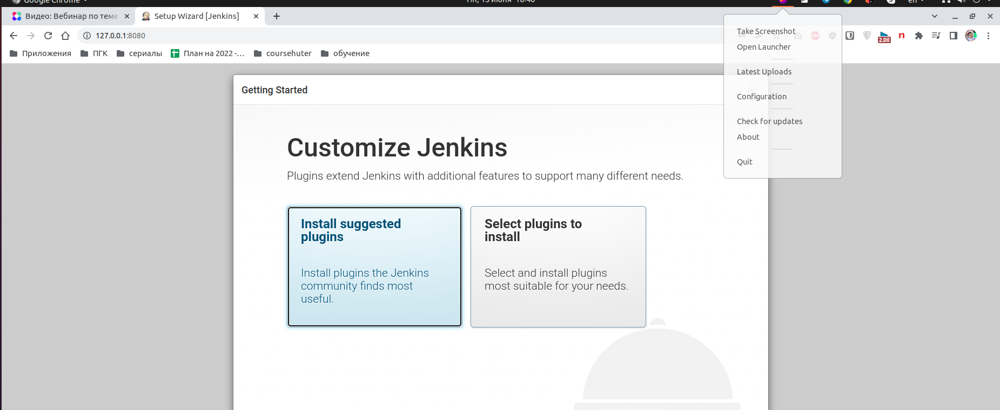
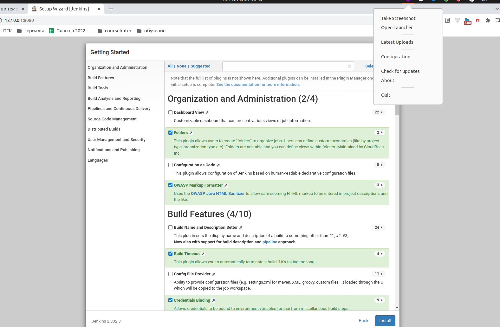
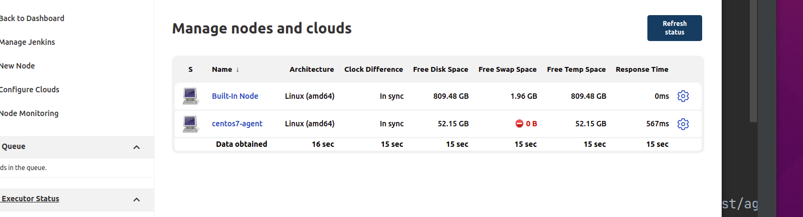
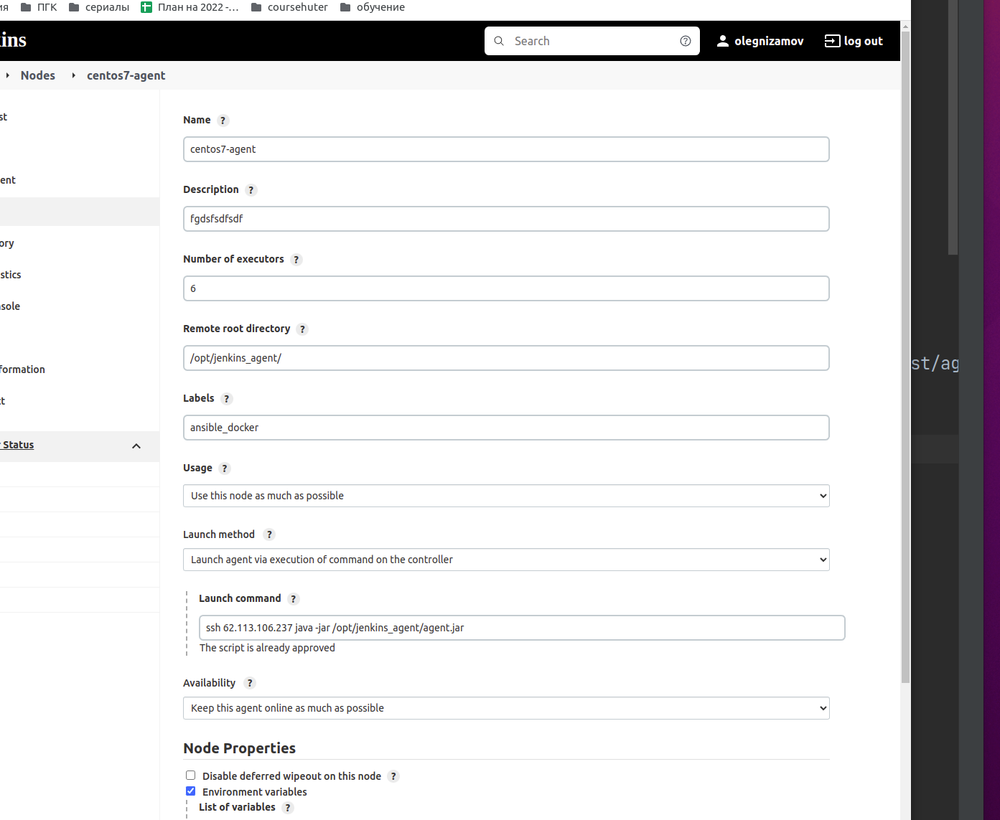
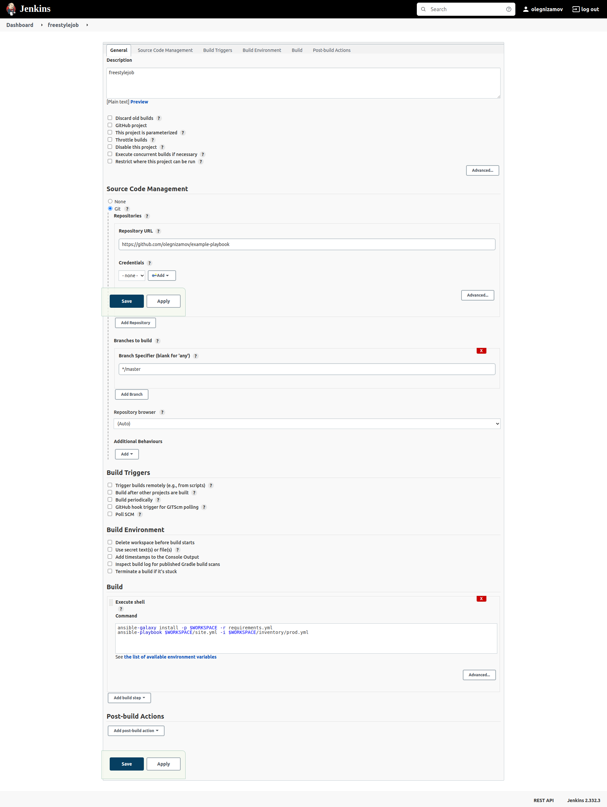

# Домашнее задание к занятию "09.03 Jenkins"

## Подготовка к выполнению

1. Установить jenkins по любой из [инструкций](https://www.jenkins.io/download/)

```
> Ответ:
Запускаем из docker
docker run -p 8080:8080 -p 50000:50000 --restart=on-failure -v jenkins_home:/var/jenkins_home jenkins/jenkins:lts-jdk11

```

2. Запустить и проверить работоспособность
   
3. Сделать первоначальную настройку



4. Настроить под свои нужды

```
> Ответ:  done

```

5. Поднять отдельный cloud

```
> Ответ:
Используя данную ссылку https://acloudguru.com/blog/engineering/adding-a-jenkins-agent-node
1 Создаем машину на centos 7
2 На jenkins мастере генерируем ключи для авторизации
3 По ней по инструкции на агенте создаем папку для jenkins и кладем ключ для авторизации по ssh с мастер машины
4 На мастер машине делаем авторизацию по ssh, проверяем корректность.1

DONE!

```

6. Для динамических агентов можно использовать [образ](https://hub.docker.com/repository/docker/aragast/agent)

```
> Ответ: done

```

7. Обязательный параметр: поставить label для динамических агентов: `ansible_docker`




8. Сделать форк репозитория с [playbook](https://github.com/aragastmatb/example-playbook)

```
> Ответ: https://github.com/olegnizamov/example-playbook
```

## Основная часть

1. Сделать Freestyle Job, который будет запускать `ansible-playbook` из форка репозитория
   

```
> Ответ:

```

2. Сделать Declarative Pipeline, который будет выкачивать репозиторий с плейбукой и запускать её

```
> Ответ:

```

3. Перенести Declarative Pipeline в репозиторий в файл `Jenkinsfile`

```
> Ответ:

```

4. Перенастроить Job на использование `Jenkinsfile` из репозитория

```
> Ответ:

```

5. Создать Scripted Pipeline, наполнить его скриптом из [pipeline](./pipeline)

```
> Ответ:

```

6. Заменить credentialsId на свой собственный

```
> Ответ:

```

7. Проверить работоспособность, исправить ошибки, исправленный Pipeline вложить в репозитрий в файл `ScriptedJenkinsfile`

```
> Ответ:

```

8. Отправить ссылку на репозиторий в ответе

```
> Ответ:

```
